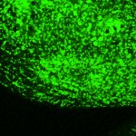

|  Method            | Parameters       | Quick Start Reader | Original Reader | Delta  |
| -------------------|------------------|--------------------|-----------------|------- |
| Initialization     |                  |13 ms|20 ms|        |
| Reader Size (Mb)     |                  |1.33|1.93|        |
# [0.7_L_side_LSO_b6_7_Nissl_first.czi](https://zenodo.org/record/6795923/files/0.7_L_side_LSO_b6_7_Nissl_first.czi) report
 - **Autostitch** = false
 - ZeissCZIReader v6.14.0
 - ZeissQuickStartCZIReader v0.2.1-SNAPSHOT

# Images 

| Series            | Quick Start Reader | Size | Original Reader | Size | #Diffs |
|-------------------|--------------------|------|-----------------|------|--------|
| Read time (all)   |45 ms|------|63 ms|------|--------|
|0||X:1024 Y:1024 C:1 Z:1 T:1||X:1024 Y:1024 C:1 Z:1 T:1|0|

# Metadata

