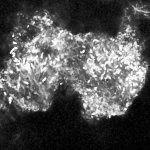
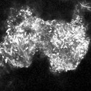

|  Method            | Parameters       | Quick Start Reader | Original Reader | Delta  |
| -------------------|------------------|--------------------|-----------------|------- |
| Initialization     |                  |9 ms|9 ms|        |
| Reader Size (Mb)     |                  |0.17|0.25|        |
# [03_12_2020_DSGN0673_fov_11_561.czi](https://zenodo.org/record/4017923/files/03_12_2020_DSGN0673_fov_11_561.czi) report
 - **Autostitch** = true
 - ZeissCZIReader v6.14.0
 - ZeissQuickStartCZIReader v0.2.2-SNAPSHOT

# Images 

| Series            | Quick Start Reader | Size | Original Reader | Size | #Diffs |
|-------------------|--------------------|------|-----------------|------|--------|
| Read time (all)   |1170 ms|------|1080 ms|------|--------|
|0||X:2000 Y:2000 C:14 Z:1 T:1||X:2000 Y:2000 C:14 Z:1 T:1|0|

# Metadata

