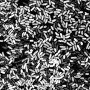

|  Method            | Parameters       | Quick Start Reader | Original Reader | Delta  |
| -------------------|------------------|--------------------|-----------------|------- |
| Initialization     |                  |7 ms|4 ms|        |
| Reader Size (Mb)     |                  |0.17|0.25|        |
# [09_10_2018_hiprfish_mix_1_fov_10_561.czi](https://zenodo.org/record/3457096/files/09_10_2018_hiprfish_mix_1_fov_10_561.czi) report
 - **Autostitch** = false
 - ZeissCZIReader v7.1.0
 - ZeissQuickStartCZIReader v0.2.4-SNAPSHOT

# Images 

| Series            | Quick Start Reader | Size | Original Reader | Size | #Diffs |
|-------------------|--------------------|------|-----------------|------|--------|
| Read time (all)   |175 ms|------|172 ms|------|--------|
|0||X:1000 Y:1000 C:14 Z:1 T:1||X:1000 Y:1000 C:14 Z:1 T:1|0|

# Metadata

