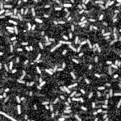

|  Method            | Parameters       | Quick Start Reader | Original Reader | Delta  |
| -------------------|------------------|--------------------|-----------------|------- |
| Initialization     |                  |8 ms|10 ms|        |
| Reader Size (Mb)     |                  |0.24|0.34|        |
# [09_10_2018_hiprfish_mix_1_fov_15_405.czi](https://zenodo.org/record/3457096/files/09_10_2018_hiprfish_mix_1_fov_15_405.czi) report
 - **Autostitch** = true
 - ZeissCZIReader v6.14.0
 - ZeissQuickStartCZIReader v0.2.2-SNAPSHOT

# Images 

| Series            | Quick Start Reader | Size | Original Reader | Size | #Diffs |
|-------------------|--------------------|------|-----------------|------|--------|
| Read time (all)   |527 ms|------|696 ms|------|--------|
|0||X:1000 Y:1000 C:32 Z:1 T:1||X:1000 Y:1000 C:32 Z:1 T:1|0|

# Metadata

