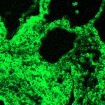

|  Method            | Parameters       | Quick Start Reader | Original Reader | Delta  |
| -------------------|------------------|--------------------|-----------------|------- |
| Initialization     |                  |25 ms|28 ms|        |
| Reader Size (Mb)     |                  |1.89|2.72|        |
# [10.5 dpc vegfc gapdh Pecam wt 1.czi](https://zenodo.org/record/7430767/files/10.5%20dpc%20vegfc%20gapdh%20Pecam%20wt%201.czi) report
 - **Autostitch** = true
 - ZeissCZIReader v6.14.0
 - ZeissQuickStartCZIReader v0.2.2-SNAPSHOT

# Images 

| Series            | Quick Start Reader | Size | Original Reader | Size | #Diffs |
|-------------------|--------------------|------|-----------------|------|--------|
| Read time (all)   |66 ms|------|90 ms|------|--------|
|0||X:512 Y:512 C:3 Z:1 T:1||X:512 Y:512 C:3 Z:1 T:1|0|

# Metadata

