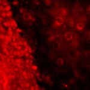

|  Method            | Parameters       | Quick Start Reader | Original Reader | Delta  |
| -------------------|------------------|--------------------|-----------------|------- |
| Initialization     |                  |5 ms|6 ms|        |
| Reader Size (Mb)     |                  |0.19|0.34|        |
# [190729S LP x63Z mCK13rCK17.czi](https://zenodo.org/record/4283106/files/190729S%20LP%20x63Z%20mCK13rCK17.czi) report
 - **Autostitch** = true
 - ZeissCZIReader v6.14.0
 - ZeissQuickStartCZIReader v0.2.1-SNAPSHOT

# Images 

| Series            | Quick Start Reader | Size | Original Reader | Size | #Diffs |
|-------------------|--------------------|------|-----------------|------|--------|
| Read time (all)   |17 ms|------|22 ms|------|--------|
|0||X:512 Y:512 C:3 Z:32 T:1||X:512 Y:512 C:3 Z:32 T:1|0|

# Metadata

