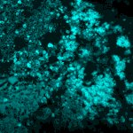

|  Method            | Parameters       | Quick Start Reader | Original Reader | Delta  |
| -------------------|------------------|--------------------|-----------------|------- |
| Initialization     |                  |8 ms|9 ms|        |
| Reader Size (Mb)     |                  |0.20|0.33|        |
# [19juil05a1.czi](https://zenodo.org/record/4627738/files/19juil05a1.czi) report
 - **Autostitch** = false
 - ZeissCZIReader v6.14.0
 - ZeissQuickStartCZIReader v0.2.2-SNAPSHOT

# Images 

| Series            | Quick Start Reader | Size | Original Reader | Size | #Diffs |
|-------------------|--------------------|------|-----------------|------|--------|
| Read time (all)   |245 ms|------|311 ms|------|--------|
|0||X:2048 Y:2048 C:6 Z:12 T:1||X:2048 Y:2048 C:6 Z:12 T:1|0|

# Metadata

