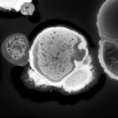
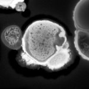

|  Method            | Parameters       | Quick Start Reader | Original Reader | Delta  |
| -------------------|------------------|--------------------|-----------------|------- |
| Initialization     |                  |5 ms|6 ms|        |
| Reader Size (Mb)     |                  |0.13|0.22|        |
# [2021-02-25-tulip_Airyscan.czi](https://zenodo.org/record/4662053/files/2021-02-25-tulip_Airyscan.czi) report
 - **Autostitch** = true
 - ZeissCZIReader v7.0.0
 - ZeissQuickStartCZIReader v0.2.2-SNAPSHOT

# Images 

| Series            | Quick Start Reader | Size | Original Reader | Size | #Diffs |
|-------------------|--------------------|------|-----------------|------|--------|
| Read time (all)   |31 ms|------|36 ms|------|--------|
|0||X:1000 Y:1000 C:1 Z:21 T:1||X:1000 Y:1000 C:1 Z:21 T:1|0|

# Metadata

