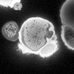

# [2021-02-25-tulip_unprocessed-Airyscan.czi](https://zenodo.org/record/4662053/files/2021-02-25-tulip_unprocessed-Airyscan.czi) report
 - **Autostitch** = false
 - ZeissCZIReader v6.14.0
 - ZeissQuickStartCZIReader v0.1.7-SNAPSHOT

# Images 

| Series            | Quick Start Reader | Size | Original Reader | Size |
|-------------------|--------------------|------|-----------------|------|
| Read time (all)   |94 ms|------|150 ms|------|
|0||X:1024 Y:1024 C:2 Z:21 T:32||X:1024 Y:1024 C:2 Z:21 T:32|

# Metadata

|  Method            | Parameters       | Quick Start Reader | Original Reader | Delta  |
| -------------------|------------------|--------------------|-----------------|------- |
| Initialization     |                  |10 ms|17 ms|        |
| Reader Size (Mb)     |                  |0.65|1.36|        |
| getStageLabelX| Image 0 | 0.000 um | -33280.500 um | 33280.500 um |
| getStageLabelY| Image 0 | 0.000 um | 1262.370 um | 1262.370 um |
| getStageLabelZ| Image 0 | 0.000 um | 705.839 um | 705.839 um |
| getPlaneDeltaT| Image 0 Plane 0 |  � s |  6508.476 s | � s |
| getPlanePositionX| Image 0 Plane 0 | 0.000 um | -33280.500 um | 33280.500 um |
| getPlanePositionY| Image 0 Plane 0 | 0.000 um | 1262.370 um | 1262.370 um |
| getPlanePositionZ| Image 0 Plane 0 | 0.000 um | 705.839 um | 705.839 um |
| getPlaneDeltaT| Image 0 Plane 1 |  � s |  6508.476 s | � s |
| getPlanePositionX| Image 0 Plane 1 | 0.000 um | -33280.500 um | 33280.500 um |
| getPlanePositionY| Image 0 Plane 1 | 0.000 um | 1262.370 um | 1262.370 um |
| getPlanePositionZ| Image 0 Plane 1 | 0.000 um | 705.839 um | 705.839 um |
| getPlaneDeltaT| Image 0 Plane 2 |  � s |  6508.476 s | � s |
| getPlanePositionX| Image 0 Plane 2 | 0.000 um | -33280.500 um | 33280.500 um |
| getPlanePositionY| Image 0 Plane 2 | 0.000 um | 1262.370 um | 1262.370 um |
| getPlanePositionZ| Image 0 Plane 2 | 0.187 um | 706.026 um | 705.839 um |
| getPlaneDeltaT| Image 0 Plane 3 |  � s |  6508.476 s | � s |
| getPlanePositionX| Image 0 Plane 3 | 0.000 um | -33280.500 um | 33280.500 um |
| getPlanePositionY| Image 0 Plane 3 | 0.000 um | 1262.370 um | 1262.370 um |
| getPlanePositionZ| Image 0 Plane 3 | 0.187 um | 706.026 um | 705.839 um |
| getPlaneDeltaT| Image 0 Plane 4 |  � s |  6508.476 s | � s |
| getPlanePositionX| Image 0 Plane 4 | 0.000 um | -33280.500 um | 33280.500 um |
| getPlanePositionY| Image 0 Plane 4 | 0.000 um | 1262.370 um | 1262.370 um |
| getPlanePositionZ| Image 0 Plane 4 | 0.373 um | 706.212 um | 705.839 um |
| getPlaneDeltaT| Image 0 Plane 5 |  � s |  6508.476 s | � s |
| getPlanePositionX| Image 0 Plane 5 | 0.000 um | -33280.500 um | 33280.500 um |
| getPlanePositionY| Image 0 Plane 5 | 0.000 um | 1262.370 um | 1262.370 um |
| getPlanePositionZ| Image 0 Plane 5 | 0.373 um | 706.212 um | 705.839 um |
| getPlaneDeltaT| Image 0 Plane 6 |  � s |  6508.476 s | � s |
| getPlanePositionX| Image 0 Plane 6 | 0.000 um | -33280.500 um | 33280.500 um |
| getPlanePositionY| Image 0 Plane 6 | 0.000 um | 1262.370 um | 1262.370 um |
| getPlanePositionZ| Image 0 Plane 6 | 0.560 um | 706.399 um | 705.839 um |
| getPlaneDeltaT| Image 0 Plane 7 |  � s |  6508.476 s | � s |
| getPlanePositionX| Image 0 Plane 7 | 0.000 um | -33280.500 um | 33280.500 um |
| getPlanePositionY| Image 0 Plane 7 | 0.000 um | 1262.370 um | 1262.370 um |
| getPlanePositionZ| Image 0 Plane 7 | 0.560 um | 706.399 um | 705.839 um |
| getPlaneDeltaT| Image 0 Plane 8 |  � s |  6508.476 s | � s |
| getPlanePositionX| Image 0 Plane 8 | 0.000 um | -33280.500 um | 33280.500 um |
| getPlanePositionY| Image 0 Plane 8 | 0.000 um | 1262.370 um | 1262.370 um |
| getPlanePositionZ| Image 0 Plane 8 | 0.747 um | 706.586 um | 705.839 um |
| getPlaneDeltaT| Image 0 Plane 9 |  � s |  6508.476 s | � s |
| getPlanePositionX| Image 0 Plane 9 | 0.000 um | -33280.500 um | 33280.500 um |
| getPlanePositionY| Image 0 Plane 9 | 0.000 um | 1262.370 um | 1262.370 um |
| getPlanePositionZ| Image 0 Plane 9 | 0.747 um | 706.586 um | 705.839 um |
| getPlaneDeltaT| Image 0 Plane 10 |  � s |  6508.476 s | � s |
| getPlanePositionX| Image 0 Plane 10 | 0.000 um | -33280.500 um | 33280.500 um |
| getPlanePositionY| Image 0 Plane 10 | 0.000 um | 1262.370 um | 1262.370 um |
| getPlanePositionZ| Image 0 Plane 10 | 0.934 um | 706.773 um | 705.839 um |
| getPlaneDeltaT| Image 0 Plane 11 |  � s |  6508.476 s | � s |
| getPlanePositionX| Image 0 Plane 11 | 0.000 um | -33280.500 um | 33280.500 um |
| getPlanePositionY| Image 0 Plane 11 | 0.000 um | 1262.370 um | 1262.370 um |
| getPlanePositionZ| Image 0 Plane 11 | 0.934 um | 706.773 um | 705.839 um |
| getPlaneDeltaT| Image 0 Plane 12 |  � s |  6508.476 s | � s |
| getPlanePositionX| Image 0 Plane 12 | 0.000 um | -33280.500 um | 33280.500 um |
| getPlanePositionY| Image 0 Plane 12 | 0.000 um | 1262.370 um | 1262.370 um |
| getPlanePositionZ| Image 0 Plane 12 | 1.120 um | 706.959 um | 705.839 um |
| getPlaneDeltaT| Image 0 Plane 13 |  � s |  6508.476 s | � s |
| getPlanePositionX| Image 0 Plane 13 | 0.000 um | -33280.500 um | 33280.500 um |
| getPlanePositionY| Image 0 Plane 13 | 0.000 um | 1262.370 um | 1262.370 um |
| getPlanePositionZ| Image 0 Plane 13 | 1.120 um | 706.959 um | 705.839 um |
| getPlaneDeltaT| Image 0 Plane 14 |  � s |  6508.476 s | � s |
| getPlanePositionX| Image 0 Plane 14 | 0.000 um | -33280.500 um | 33280.500 um |
| getPlanePositionY| Image 0 Plane 14 | 0.000 um | 1262.370 um | 1262.370 um |
| getPlanePositionZ| Image 0 Plane 14 | 1.307 um | 707.146 um | 705.839 um |
| getPlaneDeltaT| Image 0 Plane 15 |  � s |  6508.476 s | � s |
| getPlanePositionX| Image 0 Plane 15 | 0.000 um | -33280.500 um | 33280.500 um |
| getPlanePositionY| Image 0 Plane 15 | 0.000 um | 1262.370 um | 1262.370 um |
| getPlanePositionZ| Image 0 Plane 15 | 1.307 um | 707.146 um | 705.839 um |
| getPlaneDeltaT| Image 0 Plane 16 |  � s |  6508.476 s | � s |
| getPlanePositionX| Image 0 Plane 16 | 0.000 um | -33280.500 um | 33280.500 um |
| getPlanePositionY| Image 0 Plane 16 | 0.000 um | 1262.370 um | 1262.370 um |
| getPlanePositionZ| Image 0 Plane 16 | 1.494 um | 707.333 um | 705.839 um |
| getPlaneDeltaT| Image 0 Plane 17 |  � s |  6508.476 s | � s |
| getPlanePositionX| Image 0 Plane 17 | 0.000 um | -33280.500 um | 33280.500 um |
| getPlanePositionY| Image 0 Plane 17 | 0.000 um | 1262.370 um | 1262.370 um |
| getPlanePositionZ| Image 0 Plane 17 | 1.494 um | 707.333 um | 705.839 um |
| getPlaneDeltaT| Image 0 Plane 18 |  � s |  6508.476 s | � s |
| getPlanePositionX| Image 0 Plane 18 | 0.000 um | -33280.500 um | 33280.500 um |
| getPlanePositionY| Image 0 Plane 18 | 0.000 um | 1262.370 um | 1262.370 um |
| getPlanePositionZ| Image 0 Plane 18 | 1.681 um | 707.520 um | 705.839 um |
| getPlaneDeltaT| Image 0 Plane 19 |  � s |  6508.476 s | � s |
| getPlanePositionX| Image 0 Plane 19 | 0.000 um | -33280.500 um | 33280.500 um |
| getPlanePositionY| Image 0 Plane 19 | 0.000 um | 1262.370 um | 1262.370 um |
| getPlanePositionZ| Image 0 Plane 19 | 1.681 um | 707.520 um | 705.839 um |
| getPlaneDeltaT| Image 0 Plane 20 |  � s |  6508.476 s | � s |
| getPlanePositionX| Image 0 Plane 20 | 0.000 um | -33280.500 um | 33280.500 um |
| getPlanePositionY| Image 0 Plane 20 | 0.000 um | 1262.370 um | 1262.370 um |
| getPlanePositionZ| Image 0 Plane 20 | 1.867 um | 707.706 um | 705.839 um |
| getPlaneDeltaT| Image 0 Plane 21 |  � s |  6508.476 s | � s |
| getPlanePositionX| Image 0 Plane 21 | 0.000 um | -33280.500 um | 33280.500 um |
| getPlanePositionY| Image 0 Plane 21 | 0.000 um | 1262.370 um | 1262.370 um |
| getPlanePositionZ| Image 0 Plane 21 | 1.867 um | 707.706 um | 705.839 um |
| getPlaneDeltaT| Image 0 Plane 22 |  � s |  6508.476 s | � s |
| getPlanePositionX| Image 0 Plane 22 | 0.000 um | -33280.500 um | 33280.500 um |
| getPlanePositionY| Image 0 Plane 22 | 0.000 um | 1262.370 um | 1262.370 um |
| getPlanePositionZ| Image 0 Plane 22 | 2.054 um | 707.893 um | 705.839 um |
| getPlaneDeltaT| Image 0 Plane 23 |  � s |  6508.476 s | � s |
| getPlanePositionX| Image 0 Plane 23 | 0.000 um | -33280.500 um | 33280.500 um |
| getPlanePositionY| Image 0 Plane 23 | 0.000 um | 1262.370 um | 1262.370 um |
| getPlanePositionZ| Image 0 Plane 23 | 2.054 um | 707.893 um | 705.839 um |
| getPlaneDeltaT| Image 0 Plane 24 |  � s |  6508.476 s | � s |
| getPlanePositionX| Image 0 Plane 24 | 0.000 um | -33280.500 um | 33280.500 um |
| getPlanePositionY| Image 0 Plane 24 | 0.000 um | 1262.370 um | 1262.370 um |
| getPlanePositionZ| Image 0 Plane 24 | 2.241 um | 708.080 um | 705.839 um |
| getPlaneDeltaT| Image 0 Plane 25 |  � s |  6508.476 s | � s |
| getPlanePositionX| Image 0 Plane 25 | 0.000 um | -33280.500 um | 33280.500 um |
| getPlanePositionY| Image 0 Plane 25 | 0.000 um | 1262.370 um | 1262.370 um |
| getPlanePositionZ| Image 0 Plane 25 | 2.241 um | 708.080 um | 705.839 um |
| getPlaneDeltaT| Image 0 Plane 26 |  � s |  6508.476 s | � s |
| getPlanePositionX| Image 0 Plane 26 | 0.000 um | -33280.500 um | 33280.500 um |
| getPlanePositionY| Image 0 Plane 26 | 0.000 um | 1262.370 um | 1262.370 um |
| getPlanePositionZ| Image 0 Plane 26 | 2.428 um | 708.267 um | 705.839 um |
| getPlaneDeltaT| Image 0 Plane 27 |  � s |  6508.476 s | � s |
| getPlanePositionX| Image 0 Plane 27 | 0.000 um | -33280.500 um | 33280.500 um |
| getPlanePositionY| Image 0 Plane 27 | 0.000 um | 1262.370 um | 1262.370 um |
| getPlanePositionZ| Image 0 Plane 27 | 2.428 um | 708.267 um | 705.839 um |
| getPlaneDeltaT| Image 0 Plane 28 |  � s |  6508.476 s | � s |
| getPlanePositionX| Image 0 Plane 28 | 0.000 um | -33280.500 um | 33280.500 um |
| getPlanePositionY| Image 0 Plane 28 | 0.000 um | 1262.370 um | 1262.370 um |
| getPlanePositionZ| Image 0 Plane 28 | 2.614 um | 708.453 um | 705.839 um |
| getPlaneDeltaT| Image 0 Plane 29 |  � s |  6508.476 s | � s |
| getPlanePositionX| Image 0 Plane 29 | 0.000 um | -33280.500 um | 33280.500 um |
| getPlanePositionY| Image 0 Plane 29 | 0.000 um | 1262.370 um | 1262.370 um |
| getPlanePositionZ| Image 0 Plane 29 | 2.614 um | 708.453 um | 705.839 um |
| getPlaneDeltaT| Image 0 Plane 30 |  � s |  6508.476 s | � s |
| getPlanePositionX| Image 0 Plane 30 | 0.000 um | -33280.500 um | 33280.500 um |
| getPlanePositionY| Image 0 Plane 30 | 0.000 um | 1262.370 um | 1262.370 um |
| getPlanePositionZ| Image 0 Plane 30 | 2.801 um | 708.640 um | 705.839 um |
| getPlaneDeltaT| Image 0 Plane 31 |  � s |  6508.476 s | � s |
| getPlanePositionX| Image 0 Plane 31 | 0.000 um | -33280.500 um | 33280.500 um |
| getPlanePositionY| Image 0 Plane 31 | 0.000 um | 1262.370 um | 1262.370 um |
| getPlanePositionZ| Image 0 Plane 31 | 2.801 um | 708.640 um | 705.839 um |
| getPlaneDeltaT| Image 0 Plane 32 |  � s |  6508.476 s | � s |
| getPlanePositionX| Image 0 Plane 32 | 0.000 um | -33280.500 um | 33280.500 um |
| getPlanePositionY| Image 0 Plane 32 | 0.000 um | 1262.370 um | 1262.370 um |
| getPlanePositionZ| Image 0 Plane 32 | 2.988 um | 708.827 um | 705.839 um |
| getPlaneDeltaT| Image 0 Plane 33 |  � s |  6508.476 s | � s |
| getPlanePositionX| Image 0 Plane 33 | 0.000 um | -33280.500 um | 33280.500 um |
| getPlanePositionY| Image 0 Plane 33 | 0.000 um | 1262.370 um | 1262.370 um |
| getPlanePositionZ| Image 0 Plane 33 | 2.988 um | 708.827 um | 705.839 um |
| getPlaneDeltaT| Image 0 Plane 34 |  � s |  6508.476 s | � s |
| getPlanePositionX| Image 0 Plane 34 | 0.000 um | -33280.500 um | 33280.500 um |
| getPlanePositionY| Image 0 Plane 34 | 0.000 um | 1262.370 um | 1262.370 um |
| getPlanePositionZ| Image 0 Plane 34 | 3.175 um | 709.014 um | 705.839 um |
| getPlaneDeltaT| Image 0 Plane 35 |  � s |  6508.476 s | � s |
| getPlanePositionX| Image 0 Plane 35 | 0.000 um | -33280.500 um | 33280.500 um |
| getPlanePositionY| Image 0 Plane 35 | 0.000 um | 1262.370 um | 1262.370 um |
| getPlanePositionZ| Image 0 Plane 35 | 3.175 um | 709.014 um | 705.839 um |
| getPlaneDeltaT| Image 0 Plane 36 |  � s |  6508.476 s | � s |
| getPlanePositionX| Image 0 Plane 36 | 0.000 um | -33280.500 um | 33280.500 um |
| getPlanePositionY| Image 0 Plane 36 | 0.000 um | 1262.370 um | 1262.370 um |
| getPlanePositionZ| Image 0 Plane 36 | 3.361 um | 709.200 um | 705.839 um |
| getPlaneDeltaT| Image 0 Plane 37 |  � s |  6508.476 s | � s |
| getPlanePositionX| Image 0 Plane 37 | 0.000 um | -33280.500 um | 33280.500 um |
| getPlanePositionY| Image 0 Plane 37 | 0.000 um | 1262.370 um | 1262.370 um |
| getPlanePositionZ| Image 0 Plane 37 | 3.361 um | 709.200 um | 705.839 um |
| getPlaneDeltaT| Image 0 Plane 38 |  � s |  6508.476 s | � s |
| getPlanePositionX| Image 0 Plane 38 | 0.000 um | -33280.500 um | 33280.500 um |
| getPlanePositionY| Image 0 Plane 38 | 0.000 um | 1262.370 um | 1262.370 um |
| getPlanePositionZ| Image 0 Plane 38 | 3.548 um | 709.387 um | 705.839 um |
| getPlaneDeltaT| Image 0 Plane 39 |  � s |  6508.476 s | � s |
| getPlanePositionX| Image 0 Plane 39 | 0.000 um | -33280.500 um | 33280.500 um |
| getPlanePositionY| Image 0 Plane 39 | 0.000 um | 1262.370 um | 1262.370 um |
| getPlanePositionZ| Image 0 Plane 39 | 3.548 um | 709.387 um | 705.839 um |
| getPlaneDeltaT| Image 0 Plane 40 |  � s |  6508.476 s | � s |
| getPlanePositionX| Image 0 Plane 40 | 0.000 um | -33280.500 um | 33280.500 um |
| getPlanePositionY| Image 0 Plane 40 | 0.000 um | 1262.370 um | 1262.370 um |
| getPlanePositionZ| Image 0 Plane 40 | 3.735 um | 709.574 um | 705.839 um |
| getPlaneDeltaT| Image 0 Plane 41 |  � s |  6508.476 s | � s |
| getPlanePositionX| Image 0 Plane 41 | 0.000 um | -33280.500 um | 33280.500 um |
| getPlanePositionY| Image 0 Plane 41 | 0.000 um | 1262.370 um | 1262.370 um |
| getPlanePositionZ| Image 0 Plane 41 | 3.735 um | 709.574 um | 705.839 um |
| getPlaneDeltaT| Image 0 Plane 42 | | 1: ome.units.quantity.Time: value[NaN], unit[s] stored as java.lang.Double| 2: null |
| getPlanePositionX| Image 0 Plane 42 | 0.000 um | -33280.500 um | 33280.500 um |
| getPlanePositionY| Image 0 Plane 42 | 0.000 um | 1262.370 um | 1262.370 um |
| getPlanePositionZ| Image 0 Plane 42 | 0.000 um | 705.839 um | 705.839 um |
| getPlaneDeltaT| Image 0 Plane 43 | | 1: ome.units.quantity.Time: value[NaN], unit[s] stored as java.lang.Double| 2: null |
| getPlanePositionX| Image 0 Plane 43 | | 1: ome.units.quantity.Length: value[0.0], unit[µm] stored as java.lang.Double| 2: null |
| getPlanePositionY| Image 0 Plane 43 | | 1: ome.units.quantity.Length: value[0.0], unit[µm] stored as java.lang.Double| 2: null |
| getPlanePositionZ| Image 0 Plane 43 | | 1: ome.units.quantity.Length: value[0.0], unit[µm] stored as java.lang.Double| 2: null |
| getPlaneDeltaT| Image 0 Plane 44 | | 1: ome.units.quantity.Time: value[NaN], unit[s] stored as java.lang.Double| 2: null |
| getPlanePositionX| Image 0 Plane 44 | 0.000 um | -33280.500 um | 33280.500 um |
| getPlanePositionY| Image 0 Plane 44 | 0.000 um | 1262.370 um | 1262.370 um |
| getPlanePositionZ| Image 0 Plane 44 | 0.187 um | 706.026 um | 705.839 um |
| getPlaneDeltaT| Image 0 Plane 45 | | 1: ome.units.quantity.Time: value[NaN], unit[s] stored as java.lang.Double| 2: null |
| getPlanePositionX| Image 0 Plane 45 | | 1: ome.units.quantity.Length: value[0.0], unit[µm] stored as java.lang.Double| 2: null |
| getPlanePositionY| Image 0 Plane 45 | | 1: ome.units.quantity.Length: value[0.0], unit[µm] stored as java.lang.Double| 2: null |
| getPlanePositionZ| Image 0 Plane 45 | | 1: ome.units.quantity.Length: value[0.18673573391426246], unit[µm] stored as java.lang.Double| 2: null |
| getPlaneDeltaT| Image 0 Plane 46 | | 1: ome.units.quantity.Time: value[NaN], unit[s] stored as java.lang.Double| 2: null |
| getPlanePositionX| Image 0 Plane 46 | 0.000 um | -33280.500 um | 33280.500 um |
| getPlanePositionY| Image 0 Plane 46 | 0.000 um | 1262.370 um | 1262.370 um |
| getPlanePositionZ| Image 0 Plane 46 | 0.373 um | 706.212 um | 705.839 um |
| getPlaneDeltaT| Image 0 Plane 47 | | 1: ome.units.quantity.Time: value[NaN], unit[s] stored as java.lang.Double| 2: null |
| getPlanePositionX| Image 0 Plane 47 | | 1: ome.units.quantity.Length: value[0.0], unit[µm] stored as java.lang.Double| 2: null |
| getPlanePositionY| Image 0 Plane 47 | | 1: ome.units.quantity.Length: value[0.0], unit[µm] stored as java.lang.Double| 2: null |
| getPlanePositionZ| Image 0 Plane 47 | | 1: ome.units.quantity.Length: value[0.3734714678285249], unit[µm] stored as java.lang.Double| 2: null |
| getPlaneDeltaT| Image 0 Plane 48 | | 1: ome.units.quantity.Time: value[NaN], unit[s] stored as java.lang.Double| 2: null |
| getPlanePositionX| Image 0 Plane 48 | 0.000 um | -33280.500 um | 33280.500 um |
| getPlanePositionY| Image 0 Plane 48 | 0.000 um | 1262.370 um | 1262.370 um |
| getPlanePositionZ| Image 0 Plane 48 | 0.560 um | 706.399 um | 705.839 um |
| getPlaneDeltaT| Image 0 Plane 49 | | 1: ome.units.quantity.Time: value[NaN], unit[s] stored as java.lang.Double| 2: null |
| getPlanePositionX| Image 0 Plane 49 | | 1: ome.units.quantity.Length: value[0.0], unit[µm] stored as java.lang.Double| 2: null |
| getPlanePositionY| Image 0 Plane 49 | | 1: ome.units.quantity.Length: value[0.0], unit[µm] stored as java.lang.Double| 2: null |
| getPlanePositionZ| Image 0 Plane 49 | | 1: ome.units.quantity.Length: value[0.5602072017427874], unit[µm] stored as java.lang.Double| 2: null |
| getPlaneDeltaT| Image 0 Plane 50 | | 1: ome.units.quantity.Time: value[NaN], unit[s] stored as java.lang.Double| 2: null |
| getPlanePositionX| Image 0 Plane 50 | 0.000 um | -33280.500 um | 33280.500 um |
| getPlanePositionY| Image 0 Plane 50 | 0.000 um | 1262.370 um | 1262.370 um |
| getPlanePositionZ| Image 0 Plane 50 | 0.747 um | 706.586 um | 705.839 um |
| getPlaneDeltaT| Image 0 Plane 51 | | 1: ome.units.quantity.Time: value[NaN], unit[s] stored as java.lang.Double| 2: null |
| getPlanePositionX| Image 0 Plane 51 | | 1: ome.units.quantity.Length: value[0.0], unit[µm] stored as java.lang.Double| 2: null |
| getPlanePositionY| Image 0 Plane 51 | | 1: ome.units.quantity.Length: value[0.0], unit[µm] stored as java.lang.Double| 2: null |
| getPlanePositionZ| Image 0 Plane 51 | | 1: ome.units.quantity.Length: value[0.7469429356570498], unit[µm] stored as java.lang.Double| 2: null |
| getPlaneDeltaT| Image 0 Plane 52 | | 1: ome.units.quantity.Time: value[NaN], unit[s] stored as java.lang.Double| 2: null |
| getPlanePositionX| Image 0 Plane 52 | 0.000 um | -33280.500 um | 33280.500 um |
| getPlanePositionY| Image 0 Plane 52 | 0.000 um | 1262.370 um | 1262.370 um |
| getPlanePositionZ| Image 0 Plane 52 | 0.934 um | 706.773 um | 705.839 um |
| getPlaneDeltaT| Image 0 Plane 53 | | 1: ome.units.quantity.Time: value[NaN], unit[s] stored as java.lang.Double| 2: null |
| getPlanePositionX| Image 0 Plane 53 | | 1: ome.units.quantity.Length: value[0.0], unit[µm] stored as java.lang.Double| 2: null |
| getPlanePositionY| Image 0 Plane 53 | | 1: ome.units.quantity.Length: value[0.0], unit[µm] stored as java.lang.Double| 2: null |
| getPlanePositionZ| Image 0 Plane 53 | | 1: ome.units.quantity.Length: value[0.9336786695713123], unit[µm] stored as java.lang.Double| 2: null |
| getPlaneDeltaT| Image 0 Plane 54 | | 1: ome.units.quantity.Time: value[NaN], unit[s] stored as java.lang.Double| 2: null |
| getPlanePositionX| Image 0 Plane 54 | 0.000 um | -33280.500 um | 33280.500 um |
| getPlanePositionY| Image 0 Plane 54 | 0.000 um | 1262.370 um | 1262.370 um |
| getPlanePositionZ| Image 0 Plane 54 | 1.120 um | 706.959 um | 705.839 um |
| getPlaneDeltaT| Image 0 Plane 55 | | 1: ome.units.quantity.Time: value[NaN], unit[s] stored as java.lang.Double| 2: null |
| getPlanePositionX| Image 0 Plane 55 | | 1: ome.units.quantity.Length: value[0.0], unit[µm] stored as java.lang.Double| 2: null |
| getPlanePositionY| Image 0 Plane 55 | | 1: ome.units.quantity.Length: value[0.0], unit[µm] stored as java.lang.Double| 2: null |
| getPlanePositionZ| Image 0 Plane 55 | | 1: ome.units.quantity.Length: value[1.1204144034855748], unit[µm] stored as java.lang.Double| 2: null |
| getPlaneDeltaT| Image 0 Plane 56 | | 1: ome.units.quantity.Time: value[NaN], unit[s] stored as java.lang.Double| 2: null |
| getPlanePositionX| Image 0 Plane 56 | 0.000 um | -33280.500 um | 33280.500 um |
| getPlanePositionY| Image 0 Plane 56 | 0.000 um | 1262.370 um | 1262.370 um |
| getPlanePositionZ| Image 0 Plane 56 | 1.307 um | 707.146 um | 705.839 um |
| getPlaneDeltaT| Image 0 Plane 57 | | 1: ome.units.quantity.Time: value[NaN], unit[s] stored as java.lang.Double| 2: null |
| getPlanePositionX| Image 0 Plane 57 | | 1: ome.units.quantity.Length: value[0.0], unit[µm] stored as java.lang.Double| 2: null |
| getPlanePositionY| Image 0 Plane 57 | | 1: ome.units.quantity.Length: value[0.0], unit[µm] stored as java.lang.Double| 2: null |
| getPlanePositionZ| Image 0 Plane 57 | | 1: ome.units.quantity.Length: value[1.3071501373998373], unit[µm] stored as java.lang.Double| 2: null |
| getPlaneDeltaT| Image 0 Plane 58 | | 1: ome.units.quantity.Time: value[NaN], unit[s] stored as java.lang.Double| 2: null |
| getPlanePositionX| Image 0 Plane 58 | 0.000 um | -33280.500 um | 33280.500 um |
| getPlanePositionY| Image 0 Plane 58 | 0.000 um | 1262.370 um | 1262.370 um |
| getPlanePositionZ| Image 0 Plane 58 | 1.494 um | 707.333 um | 705.839 um |
| getPlaneDeltaT| Image 0 Plane 59 | | 1: ome.units.quantity.Time: value[NaN], unit[s] stored as java.lang.Double| 2: null |
| getPlanePositionX| Image 0 Plane 59 | | 1: ome.units.quantity.Length: value[0.0], unit[µm] stored as java.lang.Double| 2: null |
| getPlanePositionY| Image 0 Plane 59 | | 1: ome.units.quantity.Length: value[0.0], unit[µm] stored as java.lang.Double| 2: null |
| getPlanePositionZ| Image 0 Plane 59 | | 1: ome.units.quantity.Length: value[1.4938858713140997], unit[µm] stored as java.lang.Double| 2: null |
| getPlaneDeltaT| Image 0 Plane 60 | | 1: ome.units.quantity.Time: value[NaN], unit[s] stored as java.lang.Double| 2: null |
| getPlanePositionX| Image 0 Plane 60 | 0.000 um | -33280.500 um | 33280.500 um |
| getPlanePositionY| Image 0 Plane 60 | 0.000 um | 1262.370 um | 1262.370 um |
| getPlanePositionZ| Image 0 Plane 60 | 1.681 um | 707.520 um | 705.839 um |
| getPlaneDeltaT| Image 0 Plane 61 | | 1: ome.units.quantity.Time: value[NaN], unit[s] stored as java.lang.Double| 2: null |
| getPlanePositionX| Image 0 Plane 61 | | 1: ome.units.quantity.Length: value[0.0], unit[µm] stored as java.lang.Double| 2: null |
| getPlanePositionY| Image 0 Plane 61 | | 1: ome.units.quantity.Length: value[0.0], unit[µm] stored as java.lang.Double| 2: null |
| getPlanePositionZ| Image 0 Plane 61 | | 1: ome.units.quantity.Length: value[1.680621605228362], unit[µm] stored as java.lang.Double| 2: null |
| getPlaneDeltaT| Image 0 Plane 62 | | 1: ome.units.quantity.Time: value[NaN], unit[s] stored as java.lang.Double| 2: null |
| getPlanePositionX| Image 0 Plane 62 | 0.000 um | -33280.500 um | 33280.500 um |
| getPlanePositionY| Image 0 Plane 62 | 0.000 um | 1262.370 um | 1262.370 um |
| getPlanePositionZ| Image 0 Plane 62 | 1.867 um | 707.706 um | 705.839 um |
| getPlaneDeltaT| Image 0 Plane 63 | | 1: ome.units.quantity.Time: value[NaN], unit[s] stored as java.lang.Double| 2: null |
| getPlanePositionX| Image 0 Plane 63 | | 1: ome.units.quantity.Length: value[0.0], unit[µm] stored as java.lang.Double| 2: null |
| getPlanePositionY| Image 0 Plane 63 | | 1: ome.units.quantity.Length: value[0.0], unit[µm] stored as java.lang.Double| 2: null |
| getPlanePositionZ| Image 0 Plane 63 | | 1: ome.units.quantity.Length: value[1.8673573391426246], unit[µm] stored as java.lang.Double| 2: null |
| getPlaneDeltaT| Image 0 Plane 64 | | 1: ome.units.quantity.Time: value[NaN], unit[s] stored as java.lang.Double| 2: null |
| getPlanePositionX| Image 0 Plane 64 | 0.000 um | -33280.500 um | 33280.500 um |
| getPlanePositionY| Image 0 Plane 64 | 0.000 um | 1262.370 um | 1262.370 um |
| getPlanePositionZ| Image 0 Plane 64 | 2.054 um | 707.893 um | 705.839 um |
| getPlaneDeltaT| Image 0 Plane 65 | | 1: ome.units.quantity.Time: value[NaN], unit[s] stored as java.lang.Double| 2: null |
| getPlanePositionX| Image 0 Plane 65 | | 1: ome.units.quantity.Length: value[0.0], unit[µm] stored as java.lang.Double| 2: null |
| getPlanePositionY| Image 0 Plane 65 | | 1: ome.units.quantity.Length: value[0.0], unit[µm] stored as java.lang.Double| 2: null |
| getPlanePositionZ| Image 0 Plane 65 | | 1: ome.units.quantity.Length: value[2.054093073056887], unit[µm] stored as java.lang.Double| 2: null |
| getPlaneDeltaT| Image 0 Plane 66 | | 1: ome.units.quantity.Time: value[NaN], unit[s] stored as java.lang.Double| 2: null |
| getPlanePositionX| Image 0 Plane 66 | 0.000 um | -33280.500 um | 33280.500 um |
| getPlanePositionY| Image 0 Plane 66 | 0.000 um | 1262.370 um | 1262.370 um |
| getPlanePositionZ| Image 0 Plane 66 | 2.241 um | 708.080 um | 705.839 um |
| getPlaneDeltaT| Image 0 Plane 67 | | 1: ome.units.quantity.Time: value[NaN], unit[s] stored as java.lang.Double| 2: null |
| getPlanePositionX| Image 0 Plane 67 | | 1: ome.units.quantity.Length: value[0.0], unit[µm] stored as java.lang.Double| 2: null |
| getPlanePositionY| Image 0 Plane 67 | | 1: ome.units.quantity.Length: value[0.0], unit[µm] stored as java.lang.Double| 2: null |
| getPlanePositionZ| Image 0 Plane 67 | | 1: ome.units.quantity.Length: value[2.2408288069711495], unit[µm] stored as java.lang.Double| 2: null |
| getPlaneDeltaT| Image 0 Plane 68 | | 1: ome.units.quantity.Time: value[NaN], unit[s] stored as java.lang.Double| 2: null |
| getPlanePositionX| Image 0 Plane 68 | 0.000 um | -33280.500 um | 33280.500 um |
| getPlanePositionY| Image 0 Plane 68 | 0.000 um | 1262.370 um | 1262.370 um |
| getPlanePositionZ| Image 0 Plane 68 | 2.428 um | 708.267 um | 705.839 um |
| getPlaneDeltaT| Image 0 Plane 69 | | 1: ome.units.quantity.Time: value[NaN], unit[s] stored as java.lang.Double| 2: null |
| getPlanePositionX| Image 0 Plane 69 | | 1: ome.units.quantity.Length: value[0.0], unit[µm] stored as java.lang.Double| 2: null |
| getPlanePositionY| Image 0 Plane 69 | | 1: ome.units.quantity.Length: value[0.0], unit[µm] stored as java.lang.Double| 2: null |
| getPlanePositionZ| Image 0 Plane 69 | | 1: ome.units.quantity.Length: value[2.427564540885412], unit[µm] stored as java.lang.Double| 2: null |
| getPlaneDeltaT| Image 0 Plane 70 | | 1: ome.units.quantity.Time: value[NaN], unit[s] stored as java.lang.Double| 2: null |
| getPlanePositionX| Image 0 Plane 70 | 0.000 um | -33280.500 um | 33280.500 um |
| getPlanePositionY| Image 0 Plane 70 | 0.000 um | 1262.370 um | 1262.370 um |
| getPlanePositionZ| Image 0 Plane 70 | 2.614 um | 708.453 um | 705.839 um |
| getPlaneDeltaT| Image 0 Plane 71 | | 1: ome.units.quantity.Time: value[NaN], unit[s] stored as java.lang.Double| 2: null |
| getPlanePositionX| Image 0 Plane 71 | | 1: ome.units.quantity.Length: value[0.0], unit[µm] stored as java.lang.Double| 2: null |
| getPlanePositionY| Image 0 Plane 71 | | 1: ome.units.quantity.Length: value[0.0], unit[µm] stored as java.lang.Double| 2: null |
| getPlanePositionZ| Image 0 Plane 71 | | 1: ome.units.quantity.Length: value[2.6143002747996746], unit[µm] stored as java.lang.Double| 2: null |
| getPlaneDeltaT| Image 0 Plane 72 | | 1: ome.units.quantity.Time: value[NaN], unit[s] stored as java.lang.Double| 2: null |
| getPlanePositionX| Image 0 Plane 72 | 0.000 um | -33280.500 um | 33280.500 um |
| getPlanePositionY| Image 0 Plane 72 | 0.000 um | 1262.370 um | 1262.370 um |
| getPlanePositionZ| Image 0 Plane 72 | 2.801 um | 708.640 um | 705.839 um |
| getPlaneDeltaT| Image 0 Plane 73 | | 1: ome.units.quantity.Time: value[NaN], unit[s] stored as java.lang.Double| 2: null |
| getPlanePositionX| Image 0 Plane 73 | | 1: ome.units.quantity.Length: value[0.0], unit[µm] stored as java.lang.Double| 2: null |
| getPlanePositionY| Image 0 Plane 73 | | 1: ome.units.quantity.Length: value[0.0], unit[µm] stored as java.lang.Double| 2: null |
| getPlanePositionZ| Image 0 Plane 73 | | 1: ome.units.quantity.Length: value[2.801036008713937], unit[µm] stored as java.lang.Double| 2: null |
| getPlaneDeltaT| Image 0 Plane 74 | | 1: ome.units.quantity.Time: value[NaN], unit[s] stored as java.lang.Double| 2: null |
| getPlanePositionX| Image 0 Plane 74 | 0.000 um | -33280.500 um | 33280.500 um |
| getPlanePositionY| Image 0 Plane 74 | 0.000 um | 1262.370 um | 1262.370 um |
| getPlanePositionZ| Image 0 Plane 74 | 2.988 um | 708.827 um | 705.839 um |
| getPlaneDeltaT| Image 0 Plane 75 | | 1: ome.units.quantity.Time: value[NaN], unit[s] stored as java.lang.Double| 2: null |
| getPlanePositionX| Image 0 Plane 75 | | 1: ome.units.quantity.Length: value[0.0], unit[µm] stored as java.lang.Double| 2: null |
| getPlanePositionY| Image 0 Plane 75 | | 1: ome.units.quantity.Length: value[0.0], unit[µm] stored as java.lang.Double| 2: null |
| getPlanePositionZ| Image 0 Plane 75 | | 1: ome.units.quantity.Length: value[2.9877717426281993], unit[µm] stored as java.lang.Double| 2: null |
| getPlaneDeltaT| Image 0 Plane 76 | | 1: ome.units.quantity.Time: value[NaN], unit[s] stored as java.lang.Double| 2: null |
| getPlanePositionX| Image 0 Plane 76 | 0.000 um | -33280.500 um | 33280.500 um |
| getPlanePositionY| Image 0 Plane 76 | 0.000 um | 1262.370 um | 1262.370 um |
| getPlanePositionZ| Image 0 Plane 76 | 3.175 um | 709.014 um | 705.839 um |
| getPlaneDeltaT| Image 0 Plane 77 | | 1: ome.units.quantity.Time: value[NaN], unit[s] stored as java.lang.Double| 2: null |
| getPlanePositionX| Image 0 Plane 77 | | 1: ome.units.quantity.Length: value[0.0], unit[µm] stored as java.lang.Double| 2: null |
| getPlanePositionY| Image 0 Plane 77 | | 1: ome.units.quantity.Length: value[0.0], unit[µm] stored as java.lang.Double| 2: null |
| getPlanePositionZ| Image 0 Plane 77 | | 1: ome.units.quantity.Length: value[3.1745074765424617], unit[µm] stored as java.lang.Double| 2: null |
| getPlaneDeltaT| Image 0 Plane 78 | | 1: ome.units.quantity.Time: value[NaN], unit[s] stored as java.lang.Double| 2: null |
| getPlanePositionX| Image 0 Plane 78 | 0.000 um | -33280.500 um | 33280.500 um |
| getPlanePositionY| Image 0 Plane 78 | 0.000 um | 1262.370 um | 1262.370 um |
| getPlanePositionZ| Image 0 Plane 78 | 3.361 um | 709.200 um | 705.839 um |
| getPlaneDeltaT| Image 0 Plane 79 | | 1: ome.units.quantity.Time: value[NaN], unit[s] stored as java.lang.Double| 2: null |
| getPlanePositionX| Image 0 Plane 79 | | 1: ome.units.quantity.Length: value[0.0], unit[µm] stored as java.lang.Double| 2: null |
| getPlanePositionY| Image 0 Plane 79 | | 1: ome.units.quantity.Length: value[0.0], unit[µm] stored as java.lang.Double| 2: null |
| getPlanePositionZ| Image 0 Plane 79 | | 1: ome.units.quantity.Length: value[3.361243210456724], unit[µm] stored as java.lang.Double| 2: null |
| getPlaneDeltaT| Image 0 Plane 80 | | 1: ome.units.quantity.Time: value[NaN], unit[s] stored as java.lang.Double| 2: null |
| getPlanePositionX| Image 0 Plane 80 | 0.000 um | -33280.500 um | 33280.500 um |
| getPlanePositionY| Image 0 Plane 80 | 0.000 um | 1262.370 um | 1262.370 um |
| getPlanePositionZ| Image 0 Plane 80 | 3.548 um | 709.387 um | 705.839 um |
| getPlaneDeltaT| Image 0 Plane 81 | | 1: ome.units.quantity.Time: value[NaN], unit[s] stored as java.lang.Double| 2: null |
| getPlanePositionX| Image 0 Plane 81 | | 1: ome.units.quantity.Length: value[0.0], unit[µm] stored as java.lang.Double| 2: null |
| getPlanePositionY| Image 0 Plane 81 | | 1: ome.units.quantity.Length: value[0.0], unit[µm] stored as java.lang.Double| 2: null |
| getPlanePositionZ| Image 0 Plane 81 | | 1: ome.units.quantity.Length: value[3.547978944370987], unit[µm] stored as java.lang.Double| 2: null |
| getPlaneDeltaT| Image 0 Plane 82 | | 1: ome.units.quantity.Time: value[NaN], unit[s] stored as java.lang.Double| 2: null |
| getPlanePositionX| Image 0 Plane 82 | 0.000 um | -33280.500 um | 33280.500 um |
| getPlanePositionY| Image 0 Plane 82 | 0.000 um | 1262.370 um | 1262.370 um |
| getPlanePositionZ| Image 0 Plane 82 | 3.735 um | 709.574 um | 705.839 um |
| getPlaneDeltaT| Image 0 Plane 83 | | 1: ome.units.quantity.Time: value[NaN], unit[s] stored as java.lang.Double| 2: null |
| getPlanePositionX| Image 0 Plane 83 | | 1: ome.units.quantity.Length: value[0.0], unit[µm] stored as java.lang.Double| 2: null |
| getPlanePositionY| Image 0 Plane 83 | | 1: ome.units.quantity.Length: value[0.0], unit[µm] stored as java.lang.Double| 2: null |
| getPlanePositionZ| Image 0 Plane 83 | | 1: ome.units.quantity.Length: value[3.734714678285249], unit[µm] stored as java.lang.Double| 2: null |
| getPlaneDeltaT| Image 0 Plane 84 | | 1: ome.units.quantity.Time: value[NaN], unit[s] stored as java.lang.Double| 2: null |
| getPlanePositionX| Image 0 Plane 84 | 0.000 um | -33280.500 um | 33280.500 um |
| getPlanePositionY| Image 0 Plane 84 | 0.000 um | 1262.370 um | 1262.370 um |
| getPlanePositionZ| Image 0 Plane 84 | 0.000 um | 705.839 um | 705.839 um |
| getPlaneDeltaT| Image 0 Plane 85 | | 1: ome.units.quantity.Time: value[NaN], unit[s] stored as java.lang.Double| 2: null |
| getPlanePositionX| Image 0 Plane 85 | | 1: ome.units.quantity.Length: value[0.0], unit[µm] stored as java.lang.Double| 2: null |
| getPlanePositionY| Image 0 Plane 85 | | 1: ome.units.quantity.Length: value[0.0], unit[µm] stored as java.lang.Double| 2: null |
| getPlanePositionZ| Image 0 Plane 85 | | 1: ome.units.quantity.Length: value[0.0], unit[µm] stored as java.lang.Double| 2: null |
| getPlaneDeltaT| Image 0 Plane 86 | | 1: ome.units.quantity.Time: value[NaN], unit[s] stored as java.lang.Double| 2: null |
| getPlanePositionX| Image 0 Plane 86 | 0.000 um | -33280.500 um | 33280.500 um |
| getPlanePositionY| Image 0 Plane 86 | 0.000 um | 1262.370 um | 1262.370 um |
| getPlanePositionZ| Image 0 Plane 86 | 0.187 um | 706.026 um | 705.839 um |
| getPlaneDeltaT| Image 0 Plane 87 | | 1: ome.units.quantity.Time: value[NaN], unit[s] stored as java.lang.Double| 2: null |
| getPlanePositionX| Image 0 Plane 87 | | 1: ome.units.quantity.Length: value[0.0], unit[µm] stored as java.lang.Double| 2: null |
| getPlanePositionY| Image 0 Plane 87 | | 1: ome.units.quantity.Length: value[0.0], unit[µm] stored as java.lang.Double| 2: null |
| getPlanePositionZ| Image 0 Plane 87 | | 1: ome.units.quantity.Length: value[0.18673573391426246], unit[µm] stored as java.lang.Double| 2: null |
| getPlaneDeltaT| Image 0 Plane 88 | | 1: ome.units.quantity.Time: value[NaN], unit[s] stored as java.lang.Double| 2: null |
| getPlanePositionX| Image 0 Plane 88 | 0.000 um | -33280.500 um | 33280.500 um |
| getPlanePositionY| Image 0 Plane 88 | 0.000 um | 1262.370 um | 1262.370 um |
| getPlanePositionZ| Image 0 Plane 88 | 0.373 um | 706.212 um | 705.839 um |
| getPlaneDeltaT| Image 0 Plane 89 | | 1: ome.units.quantity.Time: value[NaN], unit[s] stored as java.lang.Double| 2: null |
| getPlanePositionX| Image 0 Plane 89 | | 1: ome.units.quantity.Length: value[0.0], unit[µm] stored as java.lang.Double| 2: null |
| getPlanePositionY| Image 0 Plane 89 | | 1: ome.units.quantity.Length: value[0.0], unit[µm] stored as java.lang.Double| 2: null |
| getPlanePositionZ| Image 0 Plane 89 | | 1: ome.units.quantity.Length: value[0.3734714678285249], unit[µm] stored as java.lang.Double| 2: null |
| getPlaneDeltaT| Image 0 Plane 90 | | 1: ome.units.quantity.Time: value[NaN], unit[s] stored as java.lang.Double| 2: null |
| getPlanePositionX| Image 0 Plane 90 | 0.000 um | -33280.500 um | 33280.500 um |
| getPlanePositionY| Image 0 Plane 90 | 0.000 um | 1262.370 um | 1262.370 um |
| getPlanePositionZ| Image 0 Plane 90 | 0.560 um | 706.399 um | 705.839 um |
| getPlaneDeltaT| Image 0 Plane 91 | | 1: ome.units.quantity.Time: value[NaN], unit[s] stored as java.lang.Double| 2: null |
| getPlanePositionX| Image 0 Plane 91 | | 1: ome.units.quantity.Length: value[0.0], unit[µm] stored as java.lang.Double| 2: null |
| getPlanePositionY| Image 0 Plane 91 | | 1: ome.units.quantity.Length: value[0.0], unit[µm] stored as java.lang.Double| 2: null |
| getPlanePositionZ| Image 0 Plane 91 | | 1: ome.units.quantity.Length: value[0.5602072017427874], unit[µm] stored as java.lang.Double| 2: null |
| getPlaneDeltaT| Image 0 Plane 92 | | 1: ome.units.quantity.Time: value[NaN], unit[s] stored as java.lang.Double| 2: null |
| getPlanePositionX| Image 0 Plane 92 | 0.000 um | -33280.500 um | 33280.500 um |
| getPlanePositionY| Image 0 Plane 92 | 0.000 um | 1262.370 um | 1262.370 um |
| getPlanePositionZ| Image 0 Plane 92 | 0.747 um | 706.586 um | 705.839 um |
| getPlaneDeltaT| Image 0 Plane 93 | | 1: ome.units.quantity.Time: value[NaN], unit[s] stored as java.lang.Double| 2: null |
| getPlanePositionX| Image 0 Plane 93 | | 1: ome.units.quantity.Length: value[0.0], unit[µm] stored as java.lang.Double| 2: null |
| getPlanePositionY| Image 0 Plane 93 | | 1: ome.units.quantity.Length: value[0.0], unit[µm] stored as java.lang.Double| 2: null |
| getPlanePositionZ| Image 0 Plane 93 | | 1: ome.units.quantity.Length: value[0.7469429356570498], unit[µm] stored as java.lang.Double| 2: null |
| getPlaneDeltaT| Image 0 Plane 94 | | 1: ome.units.quantity.Time: value[NaN], unit[s] stored as java.lang.Double| 2: null |
| getPlanePositionX| Image 0 Plane 94 | 0.000 um | -33280.500 um | 33280.500 um |
| getPlanePositionY| Image 0 Plane 94 | 0.000 um | 1262.370 um | 1262.370 um |
| getPlanePositionZ| Image 0 Plane 94 | 0.934 um | 706.773 um | 705.839 um |
| getPlaneDeltaT| Image 0 Plane 95 | | 1: ome.units.quantity.Time: value[NaN], unit[s] stored as java.lang.Double| 2: null |
| getPlanePositionX| Image 0 Plane 95 | | 1: ome.units.quantity.Length: value[0.0], unit[µm] stored as java.lang.Double| 2: null |
| getPlanePositionY| Image 0 Plane 95 | | 1: ome.units.quantity.Length: value[0.0], unit[µm] stored as java.lang.Double| 2: null |
| getPlanePositionZ| Image 0 Plane 95 | | 1: ome.units.quantity.Length: value[0.9336786695713123], unit[µm] stored as java.lang.Double| 2: null |
| getPlaneDeltaT| Image 0 Plane 96 | | 1: ome.units.quantity.Time: value[NaN], unit[s] stored as java.lang.Double| 2: null |
| getPlanePositionX| Image 0 Plane 96 | 0.000 um | -33280.500 um | 33280.500 um |
| getPlanePositionY| Image 0 Plane 96 | 0.000 um | 1262.370 um | 1262.370 um |
| getPlanePositionZ| Image 0 Plane 96 | 1.120 um | 706.959 um | 705.839 um |
| getPlaneDeltaT| Image 0 Plane 97 | | 1: ome.units.quantity.Time: value[NaN], unit[s] stored as java.lang.Double| 2: null |
| getPlanePositionX| Image 0 Plane 97 | | 1: ome.units.quantity.Length: value[0.0], unit[µm] stored as java.lang.Double| 2: null |
| getPlanePositionY| Image 0 Plane 97 | | 1: ome.units.quantity.Length: value[0.0], unit[µm] stored as java.lang.Double| 2: null |
| getPlanePositionZ| Image 0 Plane 97 | | 1: ome.units.quantity.Length: value[1.1204144034855748], unit[µm] stored as java.lang.Double| 2: null |
| getPlaneDeltaT| Image 0 Plane 98 | | 1: ome.units.quantity.Time: value[NaN], unit[s] stored as java.lang.Double| 2: null |
| getPlanePositionX| Image 0 Plane 98 | 0.000 um | -33280.500 um | 33280.500 um |
| getPlanePositionY| Image 0 Plane 98 | 0.000 um | 1262.370 um | 1262.370 um |
| getPlanePositionZ| Image 0 Plane 98 | 1.307 um | 707.146 um | 705.839 um |
| getPlaneDeltaT| Image 0 Plane 99 | | 1: ome.units.quantity.Time: value[NaN], unit[s] stored as java.lang.Double| 2: null |
| getPlanePositionX| Image 0 Plane 99 | | 1: ome.units.quantity.Length: value[0.0], unit[µm] stored as java.lang.Double| 2: null |
| getPlanePositionY| Image 0 Plane 99 | | 1: ome.units.quantity.Length: value[0.0], unit[µm] stored as java.lang.Double| 2: null |
| getPlanePositionZ| Image 0 Plane 99 | | 1: ome.units.quantity.Length: value[1.3071501373998373], unit[µm] stored as java.lang.Double| 2: null |
| getPlaneDeltaT| Image 0 Plane 100 | | 1: ome.units.quantity.Time: value[NaN], unit[s] stored as java.lang.Double| 2: null |
| getPlanePositionX| Image 0 Plane 100 | 0.000 um | -33280.500 um | 33280.500 um |
| getPlanePositionY| Image 0 Plane 100 | 0.000 um | 1262.370 um | 1262.370 um |
| getPlanePositionZ| Image 0 Plane 100 | 1.494 um | 707.333 um | 705.839 um |
| getPlaneDeltaT| Image 0 Plane 101 | | 1: ome.units.quantity.Time: value[NaN], unit[s] stored as java.lang.Double| 2: null |
| getPlanePositionX| Image 0 Plane 101 | | 1: ome.units.quantity.Length: value[0.0], unit[µm] stored as java.lang.Double| 2: null |
| getPlanePositionY| Image 0 Plane 101 | | 1: ome.units.quantity.Length: value[0.0], unit[µm] stored as java.lang.Double| 2: null |
| getPlanePositionZ| Image 0 Plane 101 | | 1: ome.units.quantity.Length: value[1.4938858713140997], unit[µm] stored as java.lang.Double| 2: null |
| getPlaneDeltaT| Image 0 Plane 102 | | 1: ome.units.quantity.Time: value[NaN], unit[s] stored as java.lang.Double| 2: null |
| getPlanePositionX| Image 0 Plane 102 | 0.000 um | -33280.500 um | 33280.500 um |
| getPlanePositionY| Image 0 Plane 102 | 0.000 um | 1262.370 um | 1262.370 um |
| getPlanePositionZ| Image 0 Plane 102 | 1.681 um | 707.520 um | 705.839 um |
| getPlaneDeltaT| Image 0 Plane 103 | | 1: ome.units.quantity.Time: value[NaN], unit[s] stored as java.lang.Double| 2: null |
| getPlanePositionX| Image 0 Plane 103 | | 1: ome.units.quantity.Length: value[0.0], unit[µm] stored as java.lang.Double| 2: null |
| getPlanePositionY| Image 0 Plane 103 | | 1: ome.units.quantity.Length: value[0.0], unit[µm] stored as java.lang.Double| 2: null |
| getPlanePositionZ| Image 0 Plane 103 | | 1: ome.units.quantity.Length: value[1.680621605228362], unit[µm] stored as java.lang.Double| 2: null |
| getPlaneDeltaT| Image 0 Plane 104 | | 1: ome.units.quantity.Time: value[NaN], unit[s] stored as java.lang.Double| 2: null |
| getPlanePositionX| Image 0 Plane 104 | 0.000 um | -33280.500 um | 33280.500 um |
| getPlanePositionY| Image 0 Plane 104 | 0.000 um | 1262.370 um | 1262.370 um |
| getPlanePositionZ| Image 0 Plane 104 | 1.867 um | 707.706 um | 705.839 um |
| getPlaneDeltaT| Image 0 Plane 105 | | 1: ome.units.quantity.Time: value[NaN], unit[s] stored as java.lang.Double| 2: null |
| getPlanePositionX| Image 0 Plane 105 | | 1: ome.units.quantity.Length: value[0.0], unit[µm] stored as java.lang.Double| 2: null |
| getPlanePositionY| Image 0 Plane 105 | | 1: ome.units.quantity.Length: value[0.0], unit[µm] stored as java.lang.Double| 2: null |
| getPlanePositionZ| Image 0 Plane 105 | | 1: ome.units.quantity.Length: value[1.8673573391426246], unit[µm] stored as java.lang.Double| 2: null |
| getPlaneDeltaT| Image 0 Plane 106 | | 1: ome.units.quantity.Time: value[NaN], unit[s] stored as java.lang.Double| 2: null |
| getPlanePositionX| Image 0 Plane 106 | 0.000 um | -33280.500 um | 33280.500 um |
| getPlanePositionY| Image 0 Plane 106 | 0.000 um | 1262.370 um | 1262.370 um |
| getPlanePositionZ| Image 0 Plane 106 | 2.054 um | 707.893 um | 705.839 um |
| getPlaneDeltaT| Image 0 Plane 107 | | 1: ome.units.quantity.Time: value[NaN], unit[s] stored as java.lang.Double| 2: null |
| getPlanePositionX| Image 0 Plane 107 | | 1: ome.units.quantity.Length: value[0.0], unit[µm] stored as java.lang.Double| 2: null |
| getPlanePositionY| Image 0 Plane 107 | | 1: ome.units.quantity.Length: value[0.0], unit[µm] stored as java.lang.Double| 2: null |
| getPlanePositionZ| Image 0 Plane 107 | | 1: ome.units.quantity.Length: value[2.054093073056887], unit[µm] stored as java.lang.Double| 2: null |
| getPlaneDeltaT| Image 0 Plane 108 | | 1: ome.units.quantity.Time: value[NaN], unit[s] stored as java.lang.Double| 2: null |
| getPlanePositionX| Image 0 Plane 108 | 0.000 um | -33280.500 um | 33280.500 um |
| getPlanePositionY| Image 0 Plane 108 | 0.000 um | 1262.370 um | 1262.370 um |
| getPlanePositionZ| Image 0 Plane 108 | 2.241 um | 708.080 um | 705.839 um |
| getPlaneDeltaT| Image 0 Plane 109 | | 1: ome.units.quantity.Time: value[NaN], unit[s] stored as java.lang.Double| 2: null |
| getPlanePositionX| Image 0 Plane 109 | | 1: ome.units.quantity.Length: value[0.0], unit[µm] stored as java.lang.Double| 2: null |
| getPlanePositionY| Image 0 Plane 109 | | 1: ome.units.quantity.Length: value[0.0], unit[µm] stored as java.lang.Double| 2: null |
| getPlanePositionZ| Image 0 Plane 109 | | 1: ome.units.quantity.Length: value[2.2408288069711495], unit[µm] stored as java.lang.Double| 2: null |
| getPlaneDeltaT| Image 0 Plane 110 | | 1: ome.units.quantity.Time: value[NaN], unit[s] stored as java.lang.Double| 2: null |
| getPlanePositionX| Image 0 Plane 110 | 0.000 um | -33280.500 um | 33280.500 um |
| getPlanePositionY| Image 0 Plane 110 | 0.000 um | 1262.370 um | 1262.370 um |
| getPlanePositionZ| Image 0 Plane 110 | 2.428 um | 708.267 um | 705.839 um |
| getPlaneDeltaT| Image 0 Plane 111 | | 1: ome.units.quantity.Time: value[NaN], unit[s] stored as java.lang.Double| 2: null |
| getPlanePositionX| Image 0 Plane 111 | | 1: ome.units.quantity.Length: value[0.0], unit[µm] stored as java.lang.Double| 2: null |
| getPlanePositionY| Image 0 Plane 111 | | 1: ome.units.quantity.Length: value[0.0], unit[µm] stored as java.lang.Double| 2: null |
| getPlanePositionZ| Image 0 Plane 111 | | 1: ome.units.quantity.Length: value[2.427564540885412], unit[µm] stored as java.lang.Double| 2: null |
| getPlaneDeltaT| Image 0 Plane 112 | | 1: ome.units.quantity.Time: value[NaN], unit[s] stored as java.lang.Double| 2: null |
| getPlanePositionX| Image 0 Plane 112 | 0.000 um | -33280.500 um | 33280.500 um |
| getPlanePositionY| Image 0 Plane 112 | 0.000 um | 1262.370 um | 1262.370 um |
| getPlanePositionZ| Image 0 Plane 112 | 2.614 um | 708.453 um | 705.839 um |
| getPlaneDeltaT| Image 0 Plane 113 | | 1: ome.units.quantity.Time: value[NaN], unit[s] stored as java.lang.Double| 2: null |
| getPlanePositionX| Image 0 Plane 113 | | 1: ome.units.quantity.Length: value[0.0], unit[µm] stored as java.lang.Double| 2: null |
| getPlanePositionY| Image 0 Plane 113 | | 1: ome.units.quantity.Length: value[0.0], unit[µm] stored as java.lang.Double| 2: null |
| getPlanePositionZ| Image 0 Plane 113 | | 1: ome.units.quantity.Length: value[2.6143002747996746], unit[µm] stored as java.lang.Double| 2: null |
| getPlaneDeltaT| Image 0 Plane 114 | | 1: ome.units.quantity.Time: value[NaN], unit[s] stored as java.lang.Double| 2: null |
| getPlanePositionX| Image 0 Plane 114 | 0.000 um | -33280.500 um | 33280.500 um |
| getPlanePositionY| Image 0 Plane 114 | 0.000 um | 1262.370 um | 1262.370 um |
| getPlanePositionZ| Image 0 Plane 114 | 2.801 um | 708.640 um | 705.839 um |
| getPlaneDeltaT| Image 0 Plane 115 | | 1: ome.units.quantity.Time: value[NaN], unit[s] stored as java.lang.Double| 2: null |
| getPlanePositionX| Image 0 Plane 115 | | 1: ome.units.quantity.Length: value[0.0], unit[µm] stored as java.lang.Double| 2: null |
| getPlanePositionY| Image 0 Plane 115 | | 1: ome.units.quantity.Length: value[0.0], unit[µm] stored as java.lang.Double| 2: null |
| getPlanePositionZ| Image 0 Plane 115 | | 1: ome.units.quantity.Length: value[2.801036008713937], unit[µm] stored as java.lang.Double| 2: null |
| getPlaneDeltaT| Image 0 Plane 116 | | 1: ome.units.quantity.Time: value[NaN], unit[s] stored as java.lang.Double| 2: null |
| getPlanePositionX| Image 0 Plane 116 | 0.000 um | -33280.500 um | 33280.500 um |
| getPlanePositionY| Image 0 Plane 116 | 0.000 um | 1262.370 um | 1262.370 um |
| getPlanePositionZ| Image 0 Plane 116 | 2.988 um | 708.827 um | 705.839 um |
| getPlaneDeltaT| Image 0 Plane 117 | | 1: ome.units.quantity.Time: value[NaN], unit[s] stored as java.lang.Double| 2: null |
| getPlanePositionX| Image 0 Plane 117 | | 1: ome.units.quantity.Length: value[0.0], unit[µm] stored as java.lang.Double| 2: null |
| getPlanePositionY| Image 0 Plane 117 | | 1: ome.units.quantity.Length: value[0.0], unit[µm] stored as java.lang.Double| 2: null |
| getPlanePositionZ| Image 0 Plane 117 | | 1: ome.units.quantity.Length: value[2.9877717426281993], unit[µm] stored as java.lang.Double| 2: null |
| getPlaneDeltaT| Image 0 Plane 118 | | 1: ome.units.quantity.Time: value[NaN], unit[s] stored as java.lang.Double| 2: null |
| getPlanePositionX| Image 0 Plane 118 | 0.000 um | -33280.500 um | 33280.500 um |
| getPlanePositionY| Image 0 Plane 118 | 0.000 um | 1262.370 um | 1262.370 um |
| getPlanePositionZ| Image 0 Plane 118 | 3.175 um | 709.014 um | 705.839 um |
| getPlaneDeltaT| Image 0 Plane 119 | | 1: ome.units.quantity.Time: value[NaN], unit[s] stored as java.lang.Double| 2: null |
| getPlanePositionX| Image 0 Plane 119 | | 1: ome.units.quantity.Length: value[0.0], unit[µm] stored as java.lang.Double| 2: null |
| getPlanePositionY| Image 0 Plane 119 | | 1: ome.units.quantity.Length: value[0.0], unit[µm] stored as java.lang.Double| 2: null |
| getPlanePositionZ| Image 0 Plane 119 | | 1: ome.units.quantity.Length: value[3.1745074765424617], unit[µm] stored as java.lang.Double| 2: null |
| getPlaneDeltaT| Image 0 Plane 120 | | 1: ome.units.quantity.Time: value[NaN], unit[s] stored as java.lang.Double| 2: null |
| getPlanePositionX| Image 0 Plane 120 | 0.000 um | -33280.500 um | 33280.500 um |
| getPlanePositionY| Image 0 Plane 120 | 0.000 um | 1262.370 um | 1262.370 um |
| getPlanePositionZ| Image 0 Plane 120 | 3.361 um | 709.200 um | 705.839 um |
| getPlaneDeltaT| Image 0 Plane 121 | | 1: ome.units.quantity.Time: value[NaN], unit[s] stored as java.lang.Double| 2: null |
| getPlanePositionX| Image 0 Plane 121 | | 1: ome.units.quantity.Length: value[0.0], unit[µm] stored as java.lang.Double| 2: null |
| getPlanePositionY| Image 0 Plane 121 | | 1: ome.units.quantity.Length: value[0.0], unit[µm] stored as java.lang.Double| 2: null |
| getPlanePositionZ| Image 0 Plane 121 | | 1: ome.units.quantity.Length: value[3.361243210456724], unit[µm] stored as java.lang.Double| 2: null |
| getPlaneDeltaT| Image 0 Plane 122 | | 1: ome.units.quantity.Time: value[NaN], unit[s] stored as java.lang.Double| 2: null |
| getPlanePositionX| Image 0 Plane 122 | 0.000 um | -33280.500 um | 33280.500 um |
| getPlanePositionY| Image 0 Plane 122 | 0.000 um | 1262.370 um | 1262.370 um |
| getPlanePositionZ| Image 0 Plane 122 | 3.548 um | 709.387 um | 705.839 um |

 More than 500 differences.
