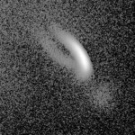
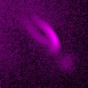

# [20221019_MixedGrain.czi](https://zenodo.org/record/7260610/files/20221019_MixedGrain.czi) report
 - **Autostitch** = false
 - ZeissCZIReader v6.14.0
 - ZeissQuickStartCZIReader v0.1.7-SNAPSHOT

# Images 

| Series            | Quick Start Reader | Size | Original Reader | Size |
|-------------------|--------------------|------|-----------------|------|
| Read time (all)   |51 ms|------|63 ms|------|
|0||X:1024 Y:1024 C:2 Z:27 T:1||X:1024 Y:1024 C:2 Z:27 T:1|

# Metadata

|  Method            | Parameters       | Quick Start Reader | Original Reader | Delta  |
| -------------------|------------------|--------------------|-----------------|------- |
| Initialization     |                  |3 ms|4 ms|        |
| Reader Size (Mb)     |                  |0.16|0.28|        |
| getStageLabelX| Image 0 | 0.000 um | 11657.500 um | 11657.500 um |
| getStageLabelY| Image 0 | 0.000 um | -1811.380 um | 1811.380 um |
| getStageLabelZ| Image 0 | 0.000 um | -564.588 um | 564.588 um |
| getPlaneDeltaT| Image 0 Plane 0 |  0.000 s |  2709.711 s | 2709.711 s |
| getPlanePositionX| Image 0 Plane 0 | 0.000 um | 11657.500 um | 11657.500 um |
| getPlanePositionY| Image 0 Plane 0 | 0.000 um | -1811.380 um | 1811.380 um |
| getPlanePositionZ| Image 0 Plane 0 | 0.000 um | -564.588 um | 564.588 um |
| getPlaneDeltaT| Image 0 Plane 1 |  0.000 s |  2709.711 s | 2709.711 s |
| getPlanePositionX| Image 0 Plane 1 | 0.000 um | 11657.500 um | 11657.500 um |
| getPlanePositionY| Image 0 Plane 1 | 0.000 um | -1811.380 um | 1811.380 um |
| getPlanePositionZ| Image 0 Plane 1 | 0.000 um | -564.588 um | 564.588 um |
| getPlaneDeltaT| Image 0 Plane 2 |  0.000 s |  2709.711 s | 2709.711 s |
| getPlanePositionX| Image 0 Plane 2 | 0.000 um | 11657.500 um | 11657.500 um |
| getPlanePositionY| Image 0 Plane 2 | 0.000 um | -1811.380 um | 1811.380 um |
| getPlanePositionZ| Image 0 Plane 2 | 2.000 um | -562.588 um | 564.588 um |
| getPlaneDeltaT| Image 0 Plane 3 |  0.000 s |  2709.711 s | 2709.711 s |
| getPlanePositionX| Image 0 Plane 3 | 0.000 um | 11657.500 um | 11657.500 um |
| getPlanePositionY| Image 0 Plane 3 | 0.000 um | -1811.380 um | 1811.380 um |
| getPlanePositionZ| Image 0 Plane 3 | 2.000 um | -562.588 um | 564.588 um |
| getPlaneDeltaT| Image 0 Plane 4 |  0.000 s |  2709.711 s | 2709.711 s |
| getPlanePositionX| Image 0 Plane 4 | 0.000 um | 11657.500 um | 11657.500 um |
| getPlanePositionY| Image 0 Plane 4 | 0.000 um | -1811.380 um | 1811.380 um |
| getPlanePositionZ| Image 0 Plane 4 | 4.000 um | -560.588 um | 564.588 um |
| getPlaneDeltaT| Image 0 Plane 5 |  0.000 s |  2709.711 s | 2709.711 s |
| getPlanePositionX| Image 0 Plane 5 | 0.000 um | 11657.500 um | 11657.500 um |
| getPlanePositionY| Image 0 Plane 5 | 0.000 um | -1811.380 um | 1811.380 um |
| getPlanePositionZ| Image 0 Plane 5 | 4.000 um | -560.588 um | 564.588 um |
| getPlaneDeltaT| Image 0 Plane 6 |  0.000 s |  2709.711 s | 2709.711 s |
| getPlanePositionX| Image 0 Plane 6 | 0.000 um | 11657.500 um | 11657.500 um |
| getPlanePositionY| Image 0 Plane 6 | 0.000 um | -1811.380 um | 1811.380 um |
| getPlanePositionZ| Image 0 Plane 6 | 6.000 um | -558.588 um | 564.588 um |
| getPlaneDeltaT| Image 0 Plane 7 |  0.000 s |  2709.711 s | 2709.711 s |
| getPlanePositionX| Image 0 Plane 7 | 0.000 um | 11657.500 um | 11657.500 um |
| getPlanePositionY| Image 0 Plane 7 | 0.000 um | -1811.380 um | 1811.380 um |
| getPlanePositionZ| Image 0 Plane 7 | 6.000 um | -558.588 um | 564.588 um |
| getPlaneDeltaT| Image 0 Plane 8 |  0.000 s |  2709.711 s | 2709.711 s |
| getPlanePositionX| Image 0 Plane 8 | 0.000 um | 11657.500 um | 11657.500 um |
| getPlanePositionY| Image 0 Plane 8 | 0.000 um | -1811.380 um | 1811.380 um |
| getPlanePositionZ| Image 0 Plane 8 | 8.000 um | -556.588 um | 564.588 um |
| getPlaneDeltaT| Image 0 Plane 9 |  0.000 s |  2709.711 s | 2709.711 s |
| getPlanePositionX| Image 0 Plane 9 | 0.000 um | 11657.500 um | 11657.500 um |
| getPlanePositionY| Image 0 Plane 9 | 0.000 um | -1811.380 um | 1811.380 um |
| getPlanePositionZ| Image 0 Plane 9 | 8.000 um | -556.588 um | 564.588 um |
| getPlaneDeltaT| Image 0 Plane 10 |  0.000 s |  2709.711 s | 2709.711 s |
| getPlanePositionX| Image 0 Plane 10 | 0.000 um | 11657.500 um | 11657.500 um |
| getPlanePositionY| Image 0 Plane 10 | 0.000 um | -1811.380 um | 1811.380 um |
| getPlanePositionZ| Image 0 Plane 10 | 10.000 um | -554.588 um | 564.588 um |
| getPlaneDeltaT| Image 0 Plane 11 |  0.000 s |  2709.711 s | 2709.711 s |
| getPlanePositionX| Image 0 Plane 11 | 0.000 um | 11657.500 um | 11657.500 um |
| getPlanePositionY| Image 0 Plane 11 | 0.000 um | -1811.380 um | 1811.380 um |
| getPlanePositionZ| Image 0 Plane 11 | 10.000 um | -554.588 um | 564.588 um |
| getPlaneDeltaT| Image 0 Plane 12 |  0.000 s |  2709.711 s | 2709.711 s |
| getPlanePositionX| Image 0 Plane 12 | 0.000 um | 11657.500 um | 11657.500 um |
| getPlanePositionY| Image 0 Plane 12 | 0.000 um | -1811.380 um | 1811.380 um |
| getPlanePositionZ| Image 0 Plane 12 | 12.000 um | -552.588 um | 564.588 um |
| getPlaneDeltaT| Image 0 Plane 13 |  0.000 s |  2709.711 s | 2709.711 s |
| getPlanePositionX| Image 0 Plane 13 | 0.000 um | 11657.500 um | 11657.500 um |
| getPlanePositionY| Image 0 Plane 13 | 0.000 um | -1811.380 um | 1811.380 um |
| getPlanePositionZ| Image 0 Plane 13 | 12.000 um | -552.588 um | 564.588 um |
| getPlaneDeltaT| Image 0 Plane 14 |  0.000 s |  2709.711 s | 2709.711 s |
| getPlanePositionX| Image 0 Plane 14 | 0.000 um | 11657.500 um | 11657.500 um |
| getPlanePositionY| Image 0 Plane 14 | 0.000 um | -1811.380 um | 1811.380 um |
| getPlanePositionZ| Image 0 Plane 14 | 14.000 um | -550.588 um | 564.588 um |
| getPlaneDeltaT| Image 0 Plane 15 |  0.000 s |  2709.711 s | 2709.711 s |
| getPlanePositionX| Image 0 Plane 15 | 0.000 um | 11657.500 um | 11657.500 um |
| getPlanePositionY| Image 0 Plane 15 | 0.000 um | -1811.380 um | 1811.380 um |
| getPlanePositionZ| Image 0 Plane 15 | 14.000 um | -550.588 um | 564.588 um |
| getPlaneDeltaT| Image 0 Plane 16 |  0.000 s |  2709.711 s | 2709.711 s |
| getPlanePositionX| Image 0 Plane 16 | 0.000 um | 11657.500 um | 11657.500 um |
| getPlanePositionY| Image 0 Plane 16 | 0.000 um | -1811.380 um | 1811.380 um |
| getPlanePositionZ| Image 0 Plane 16 | 16.000 um | -548.588 um | 564.588 um |
| getPlaneDeltaT| Image 0 Plane 17 |  0.000 s |  2709.711 s | 2709.711 s |
| getPlanePositionX| Image 0 Plane 17 | 0.000 um | 11657.500 um | 11657.500 um |
| getPlanePositionY| Image 0 Plane 17 | 0.000 um | -1811.380 um | 1811.380 um |
| getPlanePositionZ| Image 0 Plane 17 | 16.000 um | -548.588 um | 564.588 um |
| getPlaneDeltaT| Image 0 Plane 18 |  0.000 s |  2709.711 s | 2709.711 s |
| getPlanePositionX| Image 0 Plane 18 | 0.000 um | 11657.500 um | 11657.500 um |
| getPlanePositionY| Image 0 Plane 18 | 0.000 um | -1811.380 um | 1811.380 um |
| getPlanePositionZ| Image 0 Plane 18 | 18.000 um | -546.588 um | 564.588 um |
| getPlaneDeltaT| Image 0 Plane 19 |  0.000 s |  2709.711 s | 2709.711 s |
| getPlanePositionX| Image 0 Plane 19 | 0.000 um | 11657.500 um | 11657.500 um |
| getPlanePositionY| Image 0 Plane 19 | 0.000 um | -1811.380 um | 1811.380 um |
| getPlanePositionZ| Image 0 Plane 19 | 18.000 um | -546.588 um | 564.588 um |
| getPlaneDeltaT| Image 0 Plane 20 |  0.000 s |  2709.711 s | 2709.711 s |
| getPlanePositionX| Image 0 Plane 20 | 0.000 um | 11657.500 um | 11657.500 um |
| getPlanePositionY| Image 0 Plane 20 | 0.000 um | -1811.380 um | 1811.380 um |
| getPlanePositionZ| Image 0 Plane 20 | 20.000 um | -544.588 um | 564.588 um |
| getPlaneDeltaT| Image 0 Plane 21 |  0.000 s |  2709.711 s | 2709.711 s |
| getPlanePositionX| Image 0 Plane 21 | 0.000 um | 11657.500 um | 11657.500 um |
| getPlanePositionY| Image 0 Plane 21 | 0.000 um | -1811.380 um | 1811.380 um |
| getPlanePositionZ| Image 0 Plane 21 | 20.000 um | -544.588 um | 564.588 um |
| getPlaneDeltaT| Image 0 Plane 22 |  0.000 s |  2709.711 s | 2709.711 s |
| getPlanePositionX| Image 0 Plane 22 | 0.000 um | 11657.500 um | 11657.500 um |
| getPlanePositionY| Image 0 Plane 22 | 0.000 um | -1811.380 um | 1811.380 um |
| getPlanePositionZ| Image 0 Plane 22 | 22.000 um | -542.588 um | 564.588 um |
| getPlaneDeltaT| Image 0 Plane 23 |  0.000 s |  2709.711 s | 2709.711 s |
| getPlanePositionX| Image 0 Plane 23 | 0.000 um | 11657.500 um | 11657.500 um |
| getPlanePositionY| Image 0 Plane 23 | 0.000 um | -1811.380 um | 1811.380 um |
| getPlanePositionZ| Image 0 Plane 23 | 22.000 um | -542.588 um | 564.588 um |
| getPlaneDeltaT| Image 0 Plane 24 |  0.000 s |  2709.711 s | 2709.711 s |
| getPlanePositionX| Image 0 Plane 24 | 0.000 um | 11657.500 um | 11657.500 um |
| getPlanePositionY| Image 0 Plane 24 | 0.000 um | -1811.380 um | 1811.380 um |
| getPlanePositionZ| Image 0 Plane 24 | 24.000 um | -540.588 um | 564.588 um |
| getPlaneDeltaT| Image 0 Plane 25 |  0.000 s |  2709.711 s | 2709.711 s |
| getPlanePositionX| Image 0 Plane 25 | 0.000 um | 11657.500 um | 11657.500 um |
| getPlanePositionY| Image 0 Plane 25 | 0.000 um | -1811.380 um | 1811.380 um |
| getPlanePositionZ| Image 0 Plane 25 | 24.000 um | -540.588 um | 564.588 um |
| getPlaneDeltaT| Image 0 Plane 26 |  0.000 s |  2709.711 s | 2709.711 s |
| getPlanePositionX| Image 0 Plane 26 | 0.000 um | 11657.500 um | 11657.500 um |
| getPlanePositionY| Image 0 Plane 26 | 0.000 um | -1811.380 um | 1811.380 um |
| getPlanePositionZ| Image 0 Plane 26 | 26.000 um | -538.588 um | 564.588 um |
| getPlaneDeltaT| Image 0 Plane 27 |  0.000 s |  2709.711 s | 2709.711 s |
| getPlanePositionX| Image 0 Plane 27 | 0.000 um | 11657.500 um | 11657.500 um |
| getPlanePositionY| Image 0 Plane 27 | 0.000 um | -1811.380 um | 1811.380 um |
| getPlanePositionZ| Image 0 Plane 27 | 26.000 um | -538.588 um | 564.588 um |
| getPlaneDeltaT| Image 0 Plane 28 |  0.000 s |  2709.711 s | 2709.711 s |
| getPlanePositionX| Image 0 Plane 28 | 0.000 um | 11657.500 um | 11657.500 um |
| getPlanePositionY| Image 0 Plane 28 | 0.000 um | -1811.380 um | 1811.380 um |
| getPlanePositionZ| Image 0 Plane 28 | 28.000 um | -536.588 um | 564.588 um |
| getPlaneDeltaT| Image 0 Plane 29 |  0.000 s |  2709.711 s | 2709.711 s |
| getPlanePositionX| Image 0 Plane 29 | 0.000 um | 11657.500 um | 11657.500 um |
| getPlanePositionY| Image 0 Plane 29 | 0.000 um | -1811.380 um | 1811.380 um |
| getPlanePositionZ| Image 0 Plane 29 | 28.000 um | -536.588 um | 564.588 um |
| getPlaneDeltaT| Image 0 Plane 30 |  0.000 s |  2709.711 s | 2709.711 s |
| getPlanePositionX| Image 0 Plane 30 | 0.000 um | 11657.500 um | 11657.500 um |
| getPlanePositionY| Image 0 Plane 30 | 0.000 um | -1811.380 um | 1811.380 um |
| getPlanePositionZ| Image 0 Plane 30 | 30.000 um | -534.588 um | 564.588 um |
| getPlaneDeltaT| Image 0 Plane 31 |  0.000 s |  2709.711 s | 2709.711 s |
| getPlanePositionX| Image 0 Plane 31 | 0.000 um | 11657.500 um | 11657.500 um |
| getPlanePositionY| Image 0 Plane 31 | 0.000 um | -1811.380 um | 1811.380 um |
| getPlanePositionZ| Image 0 Plane 31 | 30.000 um | -534.588 um | 564.588 um |
| getPlaneDeltaT| Image 0 Plane 32 |  0.000 s |  2709.711 s | 2709.711 s |
| getPlanePositionX| Image 0 Plane 32 | 0.000 um | 11657.500 um | 11657.500 um |
| getPlanePositionY| Image 0 Plane 32 | 0.000 um | -1811.380 um | 1811.380 um |
| getPlanePositionZ| Image 0 Plane 32 | 32.000 um | -532.588 um | 564.588 um |
| getPlaneDeltaT| Image 0 Plane 33 |  0.000 s |  2709.711 s | 2709.711 s |
| getPlanePositionX| Image 0 Plane 33 | 0.000 um | 11657.500 um | 11657.500 um |
| getPlanePositionY| Image 0 Plane 33 | 0.000 um | -1811.380 um | 1811.380 um |
| getPlanePositionZ| Image 0 Plane 33 | 32.000 um | -532.588 um | 564.588 um |
| getPlaneDeltaT| Image 0 Plane 34 |  0.000 s |  2709.711 s | 2709.711 s |
| getPlanePositionX| Image 0 Plane 34 | 0.000 um | 11657.500 um | 11657.500 um |
| getPlanePositionY| Image 0 Plane 34 | 0.000 um | -1811.380 um | 1811.380 um |
| getPlanePositionZ| Image 0 Plane 34 | 34.000 um | -530.588 um | 564.588 um |
| getPlaneDeltaT| Image 0 Plane 35 |  0.000 s |  2709.711 s | 2709.711 s |
| getPlanePositionX| Image 0 Plane 35 | 0.000 um | 11657.500 um | 11657.500 um |
| getPlanePositionY| Image 0 Plane 35 | 0.000 um | -1811.380 um | 1811.380 um |
| getPlanePositionZ| Image 0 Plane 35 | 34.000 um | -530.588 um | 564.588 um |
| getPlaneDeltaT| Image 0 Plane 36 |  0.000 s |  2709.711 s | 2709.711 s |
| getPlanePositionX| Image 0 Plane 36 | 0.000 um | 11657.500 um | 11657.500 um |
| getPlanePositionY| Image 0 Plane 36 | 0.000 um | -1811.380 um | 1811.380 um |
| getPlanePositionZ| Image 0 Plane 36 | 36.000 um | -528.588 um | 564.588 um |
| getPlaneDeltaT| Image 0 Plane 37 |  0.000 s |  2709.711 s | 2709.711 s |
| getPlanePositionX| Image 0 Plane 37 | 0.000 um | 11657.500 um | 11657.500 um |
| getPlanePositionY| Image 0 Plane 37 | 0.000 um | -1811.380 um | 1811.380 um |
| getPlanePositionZ| Image 0 Plane 37 | 36.000 um | -528.588 um | 564.588 um |
| getPlaneDeltaT| Image 0 Plane 38 |  0.000 s |  2709.711 s | 2709.711 s |
| getPlanePositionX| Image 0 Plane 38 | 0.000 um | 11657.500 um | 11657.500 um |
| getPlanePositionY| Image 0 Plane 38 | 0.000 um | -1811.380 um | 1811.380 um |
| getPlanePositionZ| Image 0 Plane 38 | 38.000 um | -526.588 um | 564.588 um |
| getPlaneDeltaT| Image 0 Plane 39 |  0.000 s |  2709.711 s | 2709.711 s |
| getPlanePositionX| Image 0 Plane 39 | 0.000 um | 11657.500 um | 11657.500 um |
| getPlanePositionY| Image 0 Plane 39 | 0.000 um | -1811.380 um | 1811.380 um |
| getPlanePositionZ| Image 0 Plane 39 | 38.000 um | -526.588 um | 564.588 um |
| getPlaneDeltaT| Image 0 Plane 40 |  0.000 s |  2709.711 s | 2709.711 s |
| getPlanePositionX| Image 0 Plane 40 | 0.000 um | 11657.500 um | 11657.500 um |
| getPlanePositionY| Image 0 Plane 40 | 0.000 um | -1811.380 um | 1811.380 um |
| getPlanePositionZ| Image 0 Plane 40 | 40.000 um | -524.588 um | 564.588 um |
| getPlaneDeltaT| Image 0 Plane 41 |  0.000 s |  2709.711 s | 2709.711 s |
| getPlanePositionX| Image 0 Plane 41 | 0.000 um | 11657.500 um | 11657.500 um |
| getPlanePositionY| Image 0 Plane 41 | 0.000 um | -1811.380 um | 1811.380 um |
| getPlanePositionZ| Image 0 Plane 41 | 40.000 um | -524.588 um | 564.588 um |
| getPlaneDeltaT| Image 0 Plane 42 |  0.000 s |  2709.711 s | 2709.711 s |
| getPlanePositionX| Image 0 Plane 42 | 0.000 um | 11657.500 um | 11657.500 um |
| getPlanePositionY| Image 0 Plane 42 | 0.000 um | -1811.380 um | 1811.380 um |
| getPlanePositionZ| Image 0 Plane 42 | 42.000 um | -522.588 um | 564.588 um |
| getPlaneDeltaT| Image 0 Plane 43 |  0.000 s |  2709.711 s | 2709.711 s |
| getPlanePositionX| Image 0 Plane 43 | 0.000 um | 11657.500 um | 11657.500 um |
| getPlanePositionY| Image 0 Plane 43 | 0.000 um | -1811.380 um | 1811.380 um |
| getPlanePositionZ| Image 0 Plane 43 | 42.000 um | -522.588 um | 564.588 um |
| getPlaneDeltaT| Image 0 Plane 44 |  0.000 s |  2709.711 s | 2709.711 s |
| getPlanePositionX| Image 0 Plane 44 | 0.000 um | 11657.500 um | 11657.500 um |
| getPlanePositionY| Image 0 Plane 44 | 0.000 um | -1811.380 um | 1811.380 um |
| getPlanePositionZ| Image 0 Plane 44 | 44.000 um | -520.588 um | 564.588 um |
| getPlaneDeltaT| Image 0 Plane 45 |  0.000 s |  2709.711 s | 2709.711 s |
| getPlanePositionX| Image 0 Plane 45 | 0.000 um | 11657.500 um | 11657.500 um |
| getPlanePositionY| Image 0 Plane 45 | 0.000 um | -1811.380 um | 1811.380 um |
| getPlanePositionZ| Image 0 Plane 45 | 44.000 um | -520.588 um | 564.588 um |
| getPlaneDeltaT| Image 0 Plane 46 |  0.000 s |  2709.711 s | 2709.711 s |
| getPlanePositionX| Image 0 Plane 46 | 0.000 um | 11657.500 um | 11657.500 um |
| getPlanePositionY| Image 0 Plane 46 | 0.000 um | -1811.380 um | 1811.380 um |
| getPlanePositionZ| Image 0 Plane 46 | 46.000 um | -518.588 um | 564.588 um |
| getPlaneDeltaT| Image 0 Plane 47 |  0.000 s |  2709.711 s | 2709.711 s |
| getPlanePositionX| Image 0 Plane 47 | 0.000 um | 11657.500 um | 11657.500 um |
| getPlanePositionY| Image 0 Plane 47 | 0.000 um | -1811.380 um | 1811.380 um |
| getPlanePositionZ| Image 0 Plane 47 | 46.000 um | -518.588 um | 564.588 um |
| getPlaneDeltaT| Image 0 Plane 48 |  0.000 s |  2709.711 s | 2709.711 s |
| getPlanePositionX| Image 0 Plane 48 | 0.000 um | 11657.500 um | 11657.500 um |
| getPlanePositionY| Image 0 Plane 48 | 0.000 um | -1811.380 um | 1811.380 um |
| getPlanePositionZ| Image 0 Plane 48 | 48.000 um | -516.588 um | 564.588 um |
| getPlaneDeltaT| Image 0 Plane 49 |  0.000 s |  2709.711 s | 2709.711 s |
| getPlanePositionX| Image 0 Plane 49 | 0.000 um | 11657.500 um | 11657.500 um |
| getPlanePositionY| Image 0 Plane 49 | 0.000 um | -1811.380 um | 1811.380 um |
| getPlanePositionZ| Image 0 Plane 49 | 48.000 um | -516.588 um | 564.588 um |
| getPlaneDeltaT| Image 0 Plane 50 |  0.000 s |  2709.711 s | 2709.711 s |
| getPlanePositionX| Image 0 Plane 50 | 0.000 um | 11657.500 um | 11657.500 um |
| getPlanePositionY| Image 0 Plane 50 | 0.000 um | -1811.380 um | 1811.380 um |
| getPlanePositionZ| Image 0 Plane 50 | 50.000 um | -514.588 um | 564.588 um |
| getPlaneDeltaT| Image 0 Plane 51 |  0.000 s |  2709.711 s | 2709.711 s |
| getPlanePositionX| Image 0 Plane 51 | 0.000 um | 11657.500 um | 11657.500 um |
| getPlanePositionY| Image 0 Plane 51 | 0.000 um | -1811.380 um | 1811.380 um |
| getPlanePositionZ| Image 0 Plane 51 | 50.000 um | -514.588 um | 564.588 um |
| getPlaneDeltaT| Image 0 Plane 52 |  0.000 s |  2709.711 s | 2709.711 s |
| getPlanePositionX| Image 0 Plane 52 | 0.000 um | 11657.500 um | 11657.500 um |
| getPlanePositionY| Image 0 Plane 52 | 0.000 um | -1811.380 um | 1811.380 um |
| getPlanePositionZ| Image 0 Plane 52 | 52.000 um | -512.588 um | 564.588 um |
| getPlaneDeltaT| Image 0 Plane 53 |  0.000 s |  2709.711 s | 2709.711 s |
| getPlanePositionX| Image 0 Plane 53 | 0.000 um | 11657.500 um | 11657.500 um |
| getPlanePositionY| Image 0 Plane 53 | 0.000 um | -1811.380 um | 1811.380 um |
| getPlanePositionZ| Image 0 Plane 53 | 52.000 um | -512.588 um | 564.588 um |
