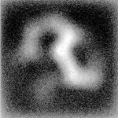

# [20221019_MixedGrain2.czi](https://zenodo.org/record/7260610/files/20221019_MixedGrain2.czi) report
 - **Autostitch** = false
 - ZeissCZIReader v6.14.0
 - ZeissQuickStartCZIReader v0.1.8-SNAPSHOT

# Images 

| Series            | Quick Start Reader | Size | Original Reader | Size | #Diffs |
|-------------------|--------------------|------|-----------------|------|--------|
| Read time (all)   |21 ms|------|29 ms|------|--------|
|0||X:620 Y:620 C:2 Z:51 T:1||X:620 Y:620 C:2 Z:51 T:1|0|

# Metadata

|  Method            | Parameters       | Quick Start Reader | Original Reader | Delta  |
| -------------------|------------------|--------------------|-----------------|------- |
| Initialization     |                  |5 ms|5 ms|        |
| Reader Size (Mb)     |                  |0.18|0.34|        |
