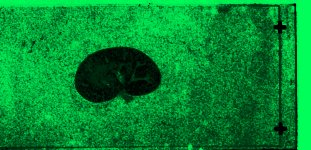

|  Method            | Parameters       | Quick Start Reader | Original Reader | Delta  |
| -------------------|------------------|--------------------|-----------------|------- |
| Initialization     |                  |63 ms|72 ms|        |
| Reader Size (Mb)     |                  |9.13|9.89|        |
| getImageCount|(No args)|8| 7| |
| getStageLabelName| Image 0 | ScanRegion0| Scene position #0| |
| getStageLabelX| Image 0 | -35639.195 um | -30277.775 um | 5361.420 um |
| getStageLabelY| Image 0 | 7270.829 um | 10510.124 um | 3239.294 um |
| getStageLabelZ| Image 0 |  1: ome.units.quantity.Length: value[4012.1892], unit[µm] stored as java.lang.Double| 2: null |
| getPixelsSizeX| Image 0 | 32751| 1504| |
| getPixelsSizeY| Image 0 | 20684| 2048| |
| getStageLabelName| Image 1 | ScanRegion0| Scene position #1| |
| getStageLabelX| Image 1 | -35639.195 um | -30277.775 um | 5361.420 um |
| getStageLabelY| Image 1 | 7270.829 um | 10510.124 um | 3239.294 um |
| getStageLabelZ| Image 1 |  1: ome.units.quantity.Length: value[4012.1892], unit[µm] stored as java.lang.Double| 2: null |
| getPixelsSizeX| Image 1 | 16375| 752| |
| getPixelsSizeY| Image 1 | 10342| 1024| |
| getPixelsPhysicalSizeX| Image 1 | 0.689 um | 0.344 um | 0.344 um |
| getPixelsPhysicalSizeY| Image 1 | 0.689 um | 0.344 um | 0.344 um |
| getStageLabelName| Image 2 | ScanRegion0| Scene position #2| |
| getStageLabelX| Image 2 | -35639.195 um | -30277.775 um | 5361.420 um |
| getStageLabelY| Image 2 | 7270.829 um | 10510.124 um | 3239.294 um |
| getStageLabelZ| Image 2 |  1: ome.units.quantity.Length: value[4012.1892], unit[µm] stored as java.lang.Double| 2: null |
| getPixelsSizeX| Image 2 | 8187| 376| |
| getPixelsSizeY| Image 2 | 5171| 512| |
| getPixelsPhysicalSizeX| Image 2 | 1.378 um | 0.344 um | 1.033 um |
| getPixelsPhysicalSizeY| Image 2 | 1.378 um | 0.344 um | 1.033 um |
| getStageLabelName| Image 3 | ScanRegion0| Scene position #3| |
| getStageLabelX| Image 3 | -35639.195 um | -30277.775 um | 5361.420 um |
| getStageLabelY| Image 3 | 7270.829 um | 10510.124 um | 3239.294 um |
| getStageLabelZ| Image 3 |  1: ome.units.quantity.Length: value[4012.1892], unit[µm] stored as java.lang.Double| 2: null |
| getPixelsSizeX| Image 3 | 4093| 188| |
| getPixelsSizeY| Image 3 | 2585| 256| |
| getPixelsPhysicalSizeX| Image 3 | 2.755 um | 0.344 um | 2.411 um |
| getPixelsPhysicalSizeY| Image 3 | 2.755 um | 0.344 um | 2.411 um |
| getStageLabelName| Image 4 | ScanRegion0| Scene position #4| |
| getStageLabelX| Image 4 | -35639.195 um | -30277.775 um | 5361.420 um |
| getStageLabelY| Image 4 | 7270.829 um | 10510.124 um | 3239.294 um |
| getStageLabelZ| Image 4 |  1: ome.units.quantity.Length: value[4012.1892], unit[µm] stored as java.lang.Double| 2: null |
| getPixelsSizeX| Image 4 | 2046| 94| |
| getPixelsSizeY| Image 4 | 1292| 128| |
| getPixelsPhysicalSizeX| Image 4 | 5.511 um | 0.344 um | 5.166 um |
| getPixelsPhysicalSizeY| Image 4 | 5.511 um | 0.344 um | 5.166 um |
| getImageName| Image 5 | 2023_11_30__RecognizedCode-27-Background subtraction-08.czi #6| label image| |
| getStageLabelName| Image 5 |  error: false | error: true| |
| getStageLabelX| Image 5 |  error: false | error: true| |
| getStageLabelY| Image 5 |  error: false | error: true| |
| getStageLabelZ| Image 5 |  error: false | error: true| |
| getPixelsSizeX| Image 5 | 1023| 1500| |
| getPixelsSizeY| Image 5 | 646| 723| |
| getPixelsSizeC| Image 5 | 1| 3| |
| getPixelsPhysicalSizeX| Image 5 | 11.022 um | 0.344 um | 10.677 um |
| getPixelsPhysicalSizeY| Image 5 | 11.022 um | 0.344 um | 10.677 um |
| getPixelsInterleaved| Image 5 | false| true| |
| getImageName| Image 6 | label image| macro image| |
| getImageAcquisitionDate| Image 6 |  1: null| 2: 2023-12-04T22:40:00.716 |
| getPixelsPhysicalSizeX| Image 6 |  1: null| 2: ome.units.quantity.Length: value[0.3444225755520869], unit[µm] stored as java.lang.Double |
| getPixelsPhysicalSizeY| Image 6 |  1: null| 2: ome.units.quantity.Length: value[0.3444225755520869], unit[µm] stored as java.lang.Double |
| getImageName| Image 7 |  error: false | error: true| |
| getImageAcquisitionDate| Image 7 |  error: false | error: true| |
| getImageAnnotationRefCount| Image 7 |  error: false | error: true| |
| getImageDescription| Image 7 |  error: false | error: true| |
| getImageExperimenterRef| Image 7 |  error: false | error: true| |
| getImageInstrumentRef| Image 7 |  error: false | error: true| |
| getImageID| Image 7 |  error: false | error: true| |
| getImageROIRefCount| Image 7 |  error: false | error: true| |
| getPlaneCount| Image 7 |  error: false | error: true| |
| getChannelCount| Image 7 |  error: false | error: true| |
| getImageROIRefCount| Image 7 |  error: false | error: true| |
| getPixelsBinDataCount| Image 7 |  error: false | error: true| |
| getMicrobeamManipulationRefCount| Image 7 |  error: false | error: true| |
| getTiffDataCount| Image 7 |  error: false | error: true| |
| getPixelsSizeX| Image 7 |  error: false | error: true| |
| getPixelsSizeY| Image 7 |  error: false | error: true| |
| getPixelsSizeZ| Image 7 |  error: false | error: true| |
| getPixelsSizeC| Image 7 |  error: false | error: true| |
| getPixelsSizeT| Image 7 |  error: false | error: true| |
| getPixelsPhysicalSizeX| Image 7 |  error: false | error: true| |
| getPixelsPhysicalSizeY| Image 7 |  error: false | error: true| |
| getPixelsPhysicalSizeZ| Image 7 |  error: false | error: true| |
| getPixelsInterleaved| Image 7 |  error: false | error: true| |
| getPixelsDimensionOrder| Image 7 |  error: false | error: true| |
| getPixelsBigEndian| Image 7 |  error: false | error: true| |
| getPixelsID| Image 7 |  error: false | error: true| |
| getPlanePositionX| Image 0 Plane 0 | -35639.195 um | -30277.775 um | 5361.420 um |
| getPlanePositionY| Image 0 Plane 0 | 7270.829 um | 10510.124 um | 3239.294 um |
| getPlanePositionZ| Image 0 Plane 0 |  1: ome.units.quantity.Length: value[4012.1892], unit[µm] stored as java.lang.Double| 2: null |
| getPlanePositionX| Image 1 Plane 0 | -35639.195 um | -30277.775 um | 5361.420 um |
| getPlanePositionY| Image 1 Plane 0 | 7270.829 um | 10510.124 um | 3239.294 um |
| getPlanePositionZ| Image 1 Plane 0 |  1: ome.units.quantity.Length: value[4012.1892], unit[µm] stored as java.lang.Double| 2: null |
| getPlanePositionX| Image 2 Plane 0 | -35639.195 um | -30277.775 um | 5361.420 um |
| getPlanePositionY| Image 2 Plane 0 | 7270.829 um | 10510.124 um | 3239.294 um |
| getPlanePositionZ| Image 2 Plane 0 |  1: ome.units.quantity.Length: value[4012.1892], unit[µm] stored as java.lang.Double| 2: null |
| getPlanePositionX| Image 3 Plane 0 | -35639.195 um | -30277.775 um | 5361.420 um |
| getPlanePositionY| Image 3 Plane 0 | 7270.829 um | 10510.124 um | 3239.294 um |
| getPlanePositionZ| Image 3 Plane 0 |  1: ome.units.quantity.Length: value[4012.1892], unit[µm] stored as java.lang.Double| 2: null |
| getPlanePositionX| Image 4 Plane 0 | -35639.195 um | -30277.775 um | 5361.420 um |
| getPlanePositionY| Image 4 Plane 0 | 7270.829 um | 10510.124 um | 3239.294 um |
| getPlanePositionZ| Image 4 Plane 0 |  1: ome.units.quantity.Length: value[4012.1892], unit[µm] stored as java.lang.Double| 2: null |
| getPlaneDeltaT| Image 5 Plane 0 |  1: ome.units.quantity.Time: value[2.06499981880188], unit[s] stored as java.lang.Double| 2: null |
| getPlaneExposureTime| Image 5 Plane 0 |  1: ome.units.quantity.Time: value[2.253], unit[s] stored as java.lang.Double| 2: null |
| getPlanePositionX| Image 5 Plane 0 |  1: ome.units.quantity.Length: value[-35639.1953], unit[µm] stored as java.lang.Double| 2: null |
| getPlanePositionY| Image 5 Plane 0 |  1: ome.units.quantity.Length: value[7270.829433220655], unit[µm] stored as java.lang.Double| 2: null |
| getPlanePositionZ| Image 5 Plane 0 |  1: ome.units.quantity.Length: value[4012.1892], unit[µm] stored as java.lang.Double| 2: null |
| Different plane count found for image 7 error: false | error: true| |
| getChannelAcquisitionMode| Image 5 Channel 0 |  1: WideField| 2: null |
| getChannelColor| Image 5 Channel 0 |  1: 16735231| 2: null |
| getChannelFluor| Image 5 Channel 0 |  1: EGFP| 2: null |
| getChannelExcitationWavelength| Image 5 Channel 0 |  1: ome.units.quantity.Length: value[488.0], unit[nm] stored as java.lang.Double| 2: null |
| getChannelEmissionWavelength| Image 5 Channel 0 |  1: ome.units.quantity.Length: value[509.0], unit[nm] stored as java.lang.Double| 2: null |
| getChannelIlluminationType| Image 5 Channel 0 |  1: Epifluorescence| 2: null |
| getChannelFilterSetRef| Image 5 Channel 0 |  error: false | error: true| |
| getChannelName| Image 5 Channel 0 |  1: EGFP| 2: null |
| getChannelSamplesPerPixel| Image 5 Channel 0 | 1| 3| |
| Different channel count found for image 7 error: false | error: true| |
# [2023_11_30__RecognizedCode-27-Background subtraction-08.czi](https://zenodo.org/records/10577186/files/2023_11_30__RecognizedCode-27-Background%20subtraction-08.czi) report
 - **Autostitch** = true
 - ZeissCZIReader v7.1.0
 - ZeissQuickStartCZIReader v0.2.4-SNAPSHOT

# Images 

| Series            | Quick Start Reader | Size | Original Reader | Size | #Diffs |
|-------------------|--------------------|------|-----------------|------|--------|
| Read time (all)   |16360 ms|------|5799 ms|------|--------|
|0||X:32751 Y:20684 C:1 Z:1 T:1||X:1504 Y:2048 C:1 Z:1 T:1|16499|
|1||X:16375 Y:10342 C:1 Z:1 T:1||X:752 Y:1024 C:1 Z:1 T:1|16500|
|2||X:8187 Y:5171 C:1 Z:1 T:1||X:376 Y:512 C:1 Z:1 T:1|16499|
|3||X:4093 Y:2585 C:1 Z:1 T:1||X:188 Y:256 C:1 Z:1 T:1|16496|
|4||X:2046 Y:1292 C:1 Z:1 T:1||X:94 Y:128 C:1 Z:1 T:1|16478|
|5||X:1023 Y:646 C:1 Z:1 T:1||X:1500 Y:723 C:3 Z:1 T:1|35549|
|6||X:542 Y:665 C:3 Z:1 T:1||X:542 Y:665 C:3 Z:1 T:1|0|
|7||X:1500 Y:723 C:3 Z:1 T:1| | |-1|

# Metadata

