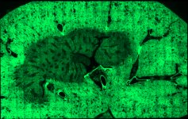

|  Method            | Parameters       | Quick Start Reader | Original Reader | Delta  |
| -------------------|------------------|--------------------|-----------------|------- |
| Initialization     |                  |64 ms|75 ms|        |
| Reader Size (Mb)     |                  |9.12|9.87|        |
| getStageLabelName| Image 0 | ScanRegion0| Scene position #0| |
| getStageLabelX| Image 0 | -35639.195 um | -30277.775 um | 5361.420 um |
| getStageLabelY| Image 0 | 7270.829 um | 10510.124 um | 3239.294 um |
| getStageLabelZ| Image 0 | 4012.189 um | 4018.446 um | 6.257 um |
| getStageLabelName| Image 1 | ScanRegion0| Scene position #1| |
| getStageLabelX| Image 1 | -35639.195 um | -30277.775 um | 5361.420 um |
| getStageLabelY| Image 1 | 7270.829 um | 10510.124 um | 3239.294 um |
| getStageLabelZ| Image 1 |  1: ome.units.quantity.Length: value[4012.1892], unit[µm] stored as java.lang.Double| 2: null |
| getPixelsPhysicalSizeX| Image 1 | 0.689 um | 0.344 um | 0.344 um |
| getPixelsPhysicalSizeY| Image 1 | 0.689 um | 0.344 um | 0.344 um |
| getStageLabelName| Image 2 | ScanRegion0| Scene position #2| |
| getStageLabelX| Image 2 | -35639.195 um | -30277.775 um | 5361.420 um |
| getStageLabelY| Image 2 | 7270.829 um | 10510.124 um | 3239.294 um |
| getStageLabelZ| Image 2 |  1: ome.units.quantity.Length: value[4012.1892], unit[µm] stored as java.lang.Double| 2: null |
| getPixelsPhysicalSizeX| Image 2 | 1.378 um | 0.344 um | 1.033 um |
| getPixelsPhysicalSizeY| Image 2 | 1.378 um | 0.344 um | 1.033 um |
| getStageLabelName| Image 3 | ScanRegion0| Scene position #3| |
| getStageLabelX| Image 3 | -35639.195 um | -30277.775 um | 5361.420 um |
| getStageLabelY| Image 3 | 7270.829 um | 10510.124 um | 3239.294 um |
| getStageLabelZ| Image 3 |  1: ome.units.quantity.Length: value[4012.1892], unit[µm] stored as java.lang.Double| 2: null |
| getPixelsPhysicalSizeX| Image 3 | 2.755 um | 0.344 um | 2.411 um |
| getPixelsPhysicalSizeY| Image 3 | 2.755 um | 0.344 um | 2.411 um |
| getStageLabelName| Image 4 | ScanRegion0| Scene position #4| |
| getStageLabelX| Image 4 | -35639.195 um | -30277.775 um | 5361.420 um |
| getStageLabelY| Image 4 | 7270.829 um | 10510.124 um | 3239.294 um |
| getStageLabelZ| Image 4 |  1: ome.units.quantity.Length: value[4012.1892], unit[µm] stored as java.lang.Double| 2: null |
| getPixelsPhysicalSizeX| Image 4 | 5.511 um | 0.344 um | 5.166 um |
| getPixelsPhysicalSizeY| Image 4 | 5.511 um | 0.344 um | 5.166 um |
| getStageLabelName| Image 5 | ScanRegion0| Scene position #5| |
| getStageLabelX| Image 5 | -35639.195 um | -30277.775 um | 5361.420 um |
| getStageLabelY| Image 5 | 7270.829 um | 10510.124 um | 3239.294 um |
| getStageLabelZ| Image 5 |  1: ome.units.quantity.Length: value[4012.1892], unit[µm] stored as java.lang.Double| 2: null |
| getPixelsPhysicalSizeX| Image 5 | 11.022 um | 0.344 um | 10.677 um |
| getPixelsPhysicalSizeY| Image 5 | 11.022 um | 0.344 um | 10.677 um |
| getImageAcquisitionDate| Image 6 |  1: null| 2: 2023-12-04T22:40:00.716 |
| getPixelsPhysicalSizeX| Image 6 |  1: null| 2: ome.units.quantity.Length: value[0.3444225755520869], unit[µm] stored as java.lang.Double |
| getPixelsPhysicalSizeY| Image 6 |  1: null| 2: ome.units.quantity.Length: value[0.3444225755520869], unit[µm] stored as java.lang.Double |
| getImageAcquisitionDate| Image 7 |  1: null| 2: 2023-12-04T22:40:00.716 |
| getPixelsPhysicalSizeX| Image 7 |  1: null| 2: ome.units.quantity.Length: value[0.3444225755520869], unit[µm] stored as java.lang.Double |
| getPixelsPhysicalSizeY| Image 7 |  1: null| 2: ome.units.quantity.Length: value[0.3444225755520869], unit[µm] stored as java.lang.Double |
| getPlanePositionX| Image 0 Plane 0 | -35639.195 um | -30277.775 um | 5361.420 um |
| getPlanePositionY| Image 0 Plane 0 | 7270.829 um | 10510.124 um | 3239.294 um |
| getPlanePositionZ| Image 0 Plane 0 | 4012.189 um | 4018.446 um | 6.257 um |
| getPlanePositionX| Image 1 Plane 0 | -35639.195 um | -30277.775 um | 5361.420 um |
| getPlanePositionY| Image 1 Plane 0 | 7270.829 um | 10510.124 um | 3239.294 um |
| getPlanePositionZ| Image 1 Plane 0 |  1: ome.units.quantity.Length: value[4012.1892], unit[µm] stored as java.lang.Double| 2: null |
| getPlanePositionX| Image 2 Plane 0 | -35639.195 um | -30277.775 um | 5361.420 um |
| getPlanePositionY| Image 2 Plane 0 | 7270.829 um | 10510.124 um | 3239.294 um |
| getPlanePositionZ| Image 2 Plane 0 |  1: ome.units.quantity.Length: value[4012.1892], unit[µm] stored as java.lang.Double| 2: null |
| getPlanePositionX| Image 3 Plane 0 | -35639.195 um | -30277.775 um | 5361.420 um |
| getPlanePositionY| Image 3 Plane 0 | 7270.829 um | 10510.124 um | 3239.294 um |
| getPlanePositionZ| Image 3 Plane 0 |  1: ome.units.quantity.Length: value[4012.1892], unit[µm] stored as java.lang.Double| 2: null |
| getPlanePositionX| Image 4 Plane 0 | -35639.195 um | -30277.775 um | 5361.420 um |
| getPlanePositionY| Image 4 Plane 0 | 7270.829 um | 10510.124 um | 3239.294 um |
| getPlanePositionZ| Image 4 Plane 0 |  1: ome.units.quantity.Length: value[4012.1892], unit[µm] stored as java.lang.Double| 2: null |
| getPlanePositionX| Image 5 Plane 0 | -35639.195 um | -30277.775 um | 5361.420 um |
| getPlanePositionY| Image 5 Plane 0 | 7270.829 um | 10510.124 um | 3239.294 um |
| getPlanePositionZ| Image 5 Plane 0 |  1: ome.units.quantity.Length: value[4012.1892], unit[µm] stored as java.lang.Double| 2: null |
# [2023_11_30__RecognizedCode-27.czi](https://zenodo.org/records/10577186/files/2023_11_30__RecognizedCode-27.czi) report
 - **Autostitch** = true
 - ZeissCZIReader v7.1.0
 - ZeissQuickStartCZIReader v0.2.4-SNAPSHOT

# Images 

| Series            | Quick Start Reader | Size | Original Reader | Size | #Diffs |
|-------------------|--------------------|------|-----------------|------|--------|
| Read time (all)   |39734 ms|------|43936 ms|------|--------|
|0||X:32751 Y:20684 C:1 Z:1 T:1||X:32751 Y:20684 C:1 Z:1 T:1|0|
|1||X:16375 Y:10342 C:1 Z:1 T:1||X:16375 Y:10342 C:1 Z:1 T:1|0|
|2||X:8187 Y:5171 C:1 Z:1 T:1||X:8187 Y:5171 C:1 Z:1 T:1|0|
|3||X:4093 Y:2585 C:1 Z:1 T:1||X:4093 Y:2585 C:1 Z:1 T:1|35509|
|4||X:2046 Y:1292 C:1 Z:1 T:1||X:2046 Y:1292 C:1 Z:1 T:1|35520|
|5||X:1023 Y:646 C:1 Z:1 T:1||X:1023 Y:646 C:1 Z:1 T:1|35540|
|6||X:542 Y:665 C:3 Z:1 T:1||X:542 Y:665 C:3 Z:1 T:1|0|
|7||X:1500 Y:723 C:3 Z:1 T:1||X:1500 Y:723 C:3 Z:1 T:1|0|

# Metadata

