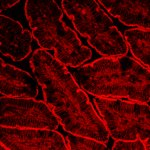

|  Method            | Parameters       | Quick Start Reader | Original Reader | Delta  |
| -------------------|------------------|--------------------|-----------------|------- |
| Initialization     |                  |4 ms|4 ms|        |
| Reader Size (Mb)     |                  |0.15|0.22|        |
# [2_mouse_02_01.czi](https://zenodo.org/record/5823010/files/2_mouse_02_01.czi) report
 - **Autostitch** = true
 - ZeissCZIReader v6.14.0
 - ZeissQuickStartCZIReader v0.2.1-SNAPSHOT

# Images 

| Series            | Quick Start Reader | Size | Original Reader | Size | #Diffs |
|-------------------|--------------------|------|-----------------|------|--------|
| Read time (all)   |31 ms|------|41 ms|------|--------|
|0||X:1024 Y:1024 C:3 Z:1 T:1||X:1024 Y:1024 C:3 Z:1 T:1|0|

# Metadata

