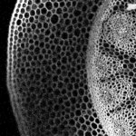
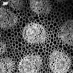
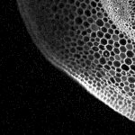
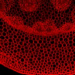

|  Method            | Parameters       | Quick Start Reader | Original Reader | Delta  |
| -------------------|------------------|--------------------|-----------------|------- |
| Initialization     |                  |16 ms|7 ms|        |
| Reader Size (Mb)     |                  |0.16|0.28|        |
| getStageLabelX| Image 0 | -16845.945 um | -16082.100 um | 763.845 um |
| getStageLabelY| Image 0 | -31051.822 um | -30669.900 um | 381.922 um |
| getStageLabelName| Image 1 | Scene position #0| Scene position #1| |
| getStageLabelX| Image 1 | ome.units.quantity.Length: value[-16082.1], unit[µm] stored as java.lang.Double| ome.units.quantity.Length: value[0], unit[reference frame] stored as java.lang.Integer| |
| getStageLabelY| Image 1 | ome.units.quantity.Length: value[-31051.82227764337], unit[µm] stored as java.lang.Double| ome.units.quantity.Length: value[-230], unit[reference frame] stored as java.lang.Integer| |
| getStageLabelZ| Image 1 |  1: ome.units.quantity.Length: value[9780.92], unit[µm] stored as java.lang.Double| 2: null |
| getStageLabelName| Image 2 | Scene position #0| Scene position #2| |
| getStageLabelX| Image 2 | ome.units.quantity.Length: value[-15318.255444713268], unit[µm] stored as java.lang.Double| ome.units.quantity.Length: value[460], unit[reference frame] stored as java.lang.Integer| |
| getStageLabelY| Image 2 | ome.units.quantity.Length: value[-31051.82227764337], unit[µm] stored as java.lang.Double| ome.units.quantity.Length: value[-230], unit[reference frame] stored as java.lang.Integer| |
| getStageLabelZ| Image 2 |  1: ome.units.quantity.Length: value[9780.92], unit[µm] stored as java.lang.Double| 2: null |
| getStageLabelName| Image 3 | Scene position #0| Scene position #3| |
| getStageLabelX| Image 3 | ome.units.quantity.Length: value[-16845.944555286733], unit[µm] stored as java.lang.Double| ome.units.quantity.Length: value[-460], unit[reference frame] stored as java.lang.Integer| |
| getStageLabelY| Image 3 | ome.units.quantity.Length: value[-30287.977722356634], unit[µm] stored as java.lang.Double| ome.units.quantity.Length: value[230], unit[reference frame] stored as java.lang.Integer| |
| getStageLabelZ| Image 3 |  1: ome.units.quantity.Length: value[9780.92], unit[µm] stored as java.lang.Double| 2: null |
| getStageLabelName| Image 4 | Scene position #0| Scene position #4| |
| getStageLabelX| Image 4 | ome.units.quantity.Length: value[-16082.1], unit[µm] stored as java.lang.Double| ome.units.quantity.Length: value[0], unit[reference frame] stored as java.lang.Integer| |
| getStageLabelY| Image 4 | ome.units.quantity.Length: value[-30287.977722356634], unit[µm] stored as java.lang.Double| ome.units.quantity.Length: value[230], unit[reference frame] stored as java.lang.Integer| |
| getStageLabelZ| Image 4 |  1: ome.units.quantity.Length: value[9780.92], unit[µm] stored as java.lang.Double| 2: null |
| getStageLabelName| Image 5 | Scene position #0| Scene position #5| |
| getStageLabelX| Image 5 | ome.units.quantity.Length: value[-15318.255444713268], unit[µm] stored as java.lang.Double| ome.units.quantity.Length: value[460], unit[reference frame] stored as java.lang.Integer| |
| getStageLabelY| Image 5 | ome.units.quantity.Length: value[-30287.977722356634], unit[µm] stored as java.lang.Double| ome.units.quantity.Length: value[230], unit[reference frame] stored as java.lang.Integer| |
| getStageLabelZ| Image 5 |  1: ome.units.quantity.Length: value[9780.92], unit[µm] stored as java.lang.Double| 2: null |
| getPlanePositionX| Image 0 Plane 0 | -16845.945 um | -16082.100 um | 763.845 um |
| getPlanePositionY| Image 0 Plane 0 | -31051.822 um | -30669.900 um | 381.922 um |
| getPlanePositionX| Image 0 Plane 1 | -16845.945 um | -16082.100 um | 763.845 um |
| getPlanePositionY| Image 0 Plane 1 | -31051.822 um | -30669.900 um | 381.922 um |
| getPlanePositionX| Image 0 Plane 2 | -16845.945 um | -16082.100 um | 763.845 um |
| getPlanePositionY| Image 0 Plane 2 | -31051.822 um | -30669.900 um | 381.922 um |
| getPlanePositionX| Image 0 Plane 3 | -16845.945 um | -16082.100 um | 763.845 um |
| getPlanePositionY| Image 0 Plane 3 | -31051.822 um | -30669.900 um | 381.922 um |
| getPlanePositionX| Image 0 Plane 4 | -16845.945 um | -16082.100 um | 763.845 um |
| getPlanePositionY| Image 0 Plane 4 | -31051.822 um | -30669.900 um | 381.922 um |
| getPlanePositionX| Image 0 Plane 5 | -16845.945 um | -16082.100 um | 763.845 um |
| getPlanePositionY| Image 0 Plane 5 | -31051.822 um | -30669.900 um | 381.922 um |
| getPlanePositionX| Image 0 Plane 6 | -16845.945 um | -16082.100 um | 763.845 um |
| getPlanePositionY| Image 0 Plane 6 | -31051.822 um | -30669.900 um | 381.922 um |
| getPlanePositionX| Image 0 Plane 7 | -16845.945 um | -16082.100 um | 763.845 um |
| getPlanePositionY| Image 0 Plane 7 | -31051.822 um | -30669.900 um | 381.922 um |
| getPlanePositionX| Image 1 Plane 0 | ome.units.quantity.Length: value[-16082.1], unit[µm] stored as java.lang.Double| ome.units.quantity.Length: value[0], unit[reference frame] stored as java.lang.Integer| |
| getPlanePositionY| Image 1 Plane 0 | ome.units.quantity.Length: value[-31051.82227764337], unit[µm] stored as java.lang.Double| ome.units.quantity.Length: value[-230], unit[reference frame] stored as java.lang.Integer| |
| getPlanePositionZ| Image 1 Plane 0 |  1: ome.units.quantity.Length: value[9780.92], unit[µm] stored as java.lang.Double| 2: null |
| getPlanePositionX| Image 1 Plane 1 | ome.units.quantity.Length: value[-16082.1], unit[µm] stored as java.lang.Double| ome.units.quantity.Length: value[0], unit[reference frame] stored as java.lang.Integer| |
| getPlanePositionY| Image 1 Plane 1 | ome.units.quantity.Length: value[-31051.82227764337], unit[µm] stored as java.lang.Double| ome.units.quantity.Length: value[-230], unit[reference frame] stored as java.lang.Integer| |
| getPlanePositionZ| Image 1 Plane 1 |  1: ome.units.quantity.Length: value[9780.92], unit[µm] stored as java.lang.Double| 2: null |
| getPlanePositionX| Image 1 Plane 2 | ome.units.quantity.Length: value[-16082.1], unit[µm] stored as java.lang.Double| ome.units.quantity.Length: value[0], unit[reference frame] stored as java.lang.Integer| |
| getPlanePositionY| Image 1 Plane 2 | ome.units.quantity.Length: value[-31051.82227764337], unit[µm] stored as java.lang.Double| ome.units.quantity.Length: value[-230], unit[reference frame] stored as java.lang.Integer| |
| getPlanePositionZ| Image 1 Plane 2 |  1: ome.units.quantity.Length: value[9781.92], unit[µm] stored as java.lang.Double| 2: null |
| getPlanePositionX| Image 1 Plane 3 | ome.units.quantity.Length: value[-16082.1], unit[µm] stored as java.lang.Double| ome.units.quantity.Length: value[0], unit[reference frame] stored as java.lang.Integer| |
| getPlanePositionY| Image 1 Plane 3 | ome.units.quantity.Length: value[-31051.82227764337], unit[µm] stored as java.lang.Double| ome.units.quantity.Length: value[-230], unit[reference frame] stored as java.lang.Integer| |
| getPlanePositionZ| Image 1 Plane 3 |  1: ome.units.quantity.Length: value[9781.92], unit[µm] stored as java.lang.Double| 2: null |
| getPlanePositionX| Image 1 Plane 4 | ome.units.quantity.Length: value[-16082.1], unit[µm] stored as java.lang.Double| ome.units.quantity.Length: value[0], unit[reference frame] stored as java.lang.Integer| |
| getPlanePositionY| Image 1 Plane 4 | ome.units.quantity.Length: value[-31051.82227764337], unit[µm] stored as java.lang.Double| ome.units.quantity.Length: value[-230], unit[reference frame] stored as java.lang.Integer| |
| getPlanePositionZ| Image 1 Plane 4 |  1: ome.units.quantity.Length: value[9782.92], unit[µm] stored as java.lang.Double| 2: null |
| getPlanePositionX| Image 1 Plane 5 | ome.units.quantity.Length: value[-16082.1], unit[µm] stored as java.lang.Double| ome.units.quantity.Length: value[0], unit[reference frame] stored as java.lang.Integer| |
| getPlanePositionY| Image 1 Plane 5 | ome.units.quantity.Length: value[-31051.82227764337], unit[µm] stored as java.lang.Double| ome.units.quantity.Length: value[-230], unit[reference frame] stored as java.lang.Integer| |
| getPlanePositionZ| Image 1 Plane 5 |  1: ome.units.quantity.Length: value[9782.92], unit[µm] stored as java.lang.Double| 2: null |
| getPlanePositionX| Image 1 Plane 6 | ome.units.quantity.Length: value[-16082.1], unit[µm] stored as java.lang.Double| ome.units.quantity.Length: value[0], unit[reference frame] stored as java.lang.Integer| |
| getPlanePositionY| Image 1 Plane 6 | ome.units.quantity.Length: value[-31051.82227764337], unit[µm] stored as java.lang.Double| ome.units.quantity.Length: value[-230], unit[reference frame] stored as java.lang.Integer| |
| getPlanePositionZ| Image 1 Plane 6 |  1: ome.units.quantity.Length: value[9783.92], unit[µm] stored as java.lang.Double| 2: null |
| getPlanePositionX| Image 1 Plane 7 | ome.units.quantity.Length: value[-16082.1], unit[µm] stored as java.lang.Double| ome.units.quantity.Length: value[0], unit[reference frame] stored as java.lang.Integer| |
| getPlanePositionY| Image 1 Plane 7 | ome.units.quantity.Length: value[-31051.82227764337], unit[µm] stored as java.lang.Double| ome.units.quantity.Length: value[-230], unit[reference frame] stored as java.lang.Integer| |
| getPlanePositionZ| Image 1 Plane 7 |  1: ome.units.quantity.Length: value[9783.92], unit[µm] stored as java.lang.Double| 2: null |
| getPlanePositionX| Image 2 Plane 0 | ome.units.quantity.Length: value[-15318.255444713268], unit[µm] stored as java.lang.Double| ome.units.quantity.Length: value[460], unit[reference frame] stored as java.lang.Integer| |
| getPlanePositionY| Image 2 Plane 0 | ome.units.quantity.Length: value[-31051.82227764337], unit[µm] stored as java.lang.Double| ome.units.quantity.Length: value[-230], unit[reference frame] stored as java.lang.Integer| |
| getPlanePositionZ| Image 2 Plane 0 |  1: ome.units.quantity.Length: value[9780.92], unit[µm] stored as java.lang.Double| 2: null |
| getPlanePositionX| Image 2 Plane 1 | ome.units.quantity.Length: value[-15318.255444713268], unit[µm] stored as java.lang.Double| ome.units.quantity.Length: value[460], unit[reference frame] stored as java.lang.Integer| |
| getPlanePositionY| Image 2 Plane 1 | ome.units.quantity.Length: value[-31051.82227764337], unit[µm] stored as java.lang.Double| ome.units.quantity.Length: value[-230], unit[reference frame] stored as java.lang.Integer| |
| getPlanePositionZ| Image 2 Plane 1 |  1: ome.units.quantity.Length: value[9780.92], unit[µm] stored as java.lang.Double| 2: null |
| getPlanePositionX| Image 2 Plane 2 | ome.units.quantity.Length: value[-15318.255444713268], unit[µm] stored as java.lang.Double| ome.units.quantity.Length: value[460], unit[reference frame] stored as java.lang.Integer| |
| getPlanePositionY| Image 2 Plane 2 | ome.units.quantity.Length: value[-31051.82227764337], unit[µm] stored as java.lang.Double| ome.units.quantity.Length: value[-230], unit[reference frame] stored as java.lang.Integer| |
| getPlanePositionZ| Image 2 Plane 2 |  1: ome.units.quantity.Length: value[9781.92], unit[µm] stored as java.lang.Double| 2: null |
| getPlanePositionX| Image 2 Plane 3 | ome.units.quantity.Length: value[-15318.255444713268], unit[µm] stored as java.lang.Double| ome.units.quantity.Length: value[460], unit[reference frame] stored as java.lang.Integer| |
| getPlanePositionY| Image 2 Plane 3 | ome.units.quantity.Length: value[-31051.82227764337], unit[µm] stored as java.lang.Double| ome.units.quantity.Length: value[-230], unit[reference frame] stored as java.lang.Integer| |
| getPlanePositionZ| Image 2 Plane 3 |  1: ome.units.quantity.Length: value[9781.92], unit[µm] stored as java.lang.Double| 2: null |
| getPlanePositionX| Image 2 Plane 4 | ome.units.quantity.Length: value[-15318.255444713268], unit[µm] stored as java.lang.Double| ome.units.quantity.Length: value[460], unit[reference frame] stored as java.lang.Integer| |
| getPlanePositionY| Image 2 Plane 4 | ome.units.quantity.Length: value[-31051.82227764337], unit[µm] stored as java.lang.Double| ome.units.quantity.Length: value[-230], unit[reference frame] stored as java.lang.Integer| |
| getPlanePositionZ| Image 2 Plane 4 |  1: ome.units.quantity.Length: value[9782.92], unit[µm] stored as java.lang.Double| 2: null |
| getPlanePositionX| Image 2 Plane 5 | ome.units.quantity.Length: value[-15318.255444713268], unit[µm] stored as java.lang.Double| ome.units.quantity.Length: value[460], unit[reference frame] stored as java.lang.Integer| |
| getPlanePositionY| Image 2 Plane 5 | ome.units.quantity.Length: value[-31051.82227764337], unit[µm] stored as java.lang.Double| ome.units.quantity.Length: value[-230], unit[reference frame] stored as java.lang.Integer| |
| getPlanePositionZ| Image 2 Plane 5 |  1: ome.units.quantity.Length: value[9782.92], unit[µm] stored as java.lang.Double| 2: null |
| getPlanePositionX| Image 2 Plane 6 | ome.units.quantity.Length: value[-15318.255444713268], unit[µm] stored as java.lang.Double| ome.units.quantity.Length: value[460], unit[reference frame] stored as java.lang.Integer| |
| getPlanePositionY| Image 2 Plane 6 | ome.units.quantity.Length: value[-31051.82227764337], unit[µm] stored as java.lang.Double| ome.units.quantity.Length: value[-230], unit[reference frame] stored as java.lang.Integer| |
| getPlanePositionZ| Image 2 Plane 6 |  1: ome.units.quantity.Length: value[9783.92], unit[µm] stored as java.lang.Double| 2: null |
| getPlanePositionX| Image 2 Plane 7 | ome.units.quantity.Length: value[-15318.255444713268], unit[µm] stored as java.lang.Double| ome.units.quantity.Length: value[460], unit[reference frame] stored as java.lang.Integer| |
| getPlanePositionY| Image 2 Plane 7 | ome.units.quantity.Length: value[-31051.82227764337], unit[µm] stored as java.lang.Double| ome.units.quantity.Length: value[-230], unit[reference frame] stored as java.lang.Integer| |
| getPlanePositionZ| Image 2 Plane 7 |  1: ome.units.quantity.Length: value[9783.92], unit[µm] stored as java.lang.Double| 2: null |
| getPlanePositionX| Image 3 Plane 0 | ome.units.quantity.Length: value[-16845.944555286733], unit[µm] stored as java.lang.Double| ome.units.quantity.Length: value[-460], unit[reference frame] stored as java.lang.Integer| |
| getPlanePositionY| Image 3 Plane 0 | ome.units.quantity.Length: value[-30287.977722356634], unit[µm] stored as java.lang.Double| ome.units.quantity.Length: value[230], unit[reference frame] stored as java.lang.Integer| |
| getPlanePositionZ| Image 3 Plane 0 |  1: ome.units.quantity.Length: value[9780.92], unit[µm] stored as java.lang.Double| 2: null |
| getPlanePositionX| Image 3 Plane 1 | ome.units.quantity.Length: value[-16845.944555286733], unit[µm] stored as java.lang.Double| ome.units.quantity.Length: value[-460], unit[reference frame] stored as java.lang.Integer| |
| getPlanePositionY| Image 3 Plane 1 | ome.units.quantity.Length: value[-30287.977722356634], unit[µm] stored as java.lang.Double| ome.units.quantity.Length: value[230], unit[reference frame] stored as java.lang.Integer| |
| getPlanePositionZ| Image 3 Plane 1 |  1: ome.units.quantity.Length: value[9780.92], unit[µm] stored as java.lang.Double| 2: null |
| getPlanePositionX| Image 3 Plane 2 | ome.units.quantity.Length: value[-16845.944555286733], unit[µm] stored as java.lang.Double| ome.units.quantity.Length: value[-460], unit[reference frame] stored as java.lang.Integer| |
| getPlanePositionY| Image 3 Plane 2 | ome.units.quantity.Length: value[-30287.977722356634], unit[µm] stored as java.lang.Double| ome.units.quantity.Length: value[230], unit[reference frame] stored as java.lang.Integer| |
| getPlanePositionZ| Image 3 Plane 2 |  1: ome.units.quantity.Length: value[9781.92], unit[µm] stored as java.lang.Double| 2: null |
| getPlanePositionX| Image 3 Plane 3 | ome.units.quantity.Length: value[-16845.944555286733], unit[µm] stored as java.lang.Double| ome.units.quantity.Length: value[-460], unit[reference frame] stored as java.lang.Integer| |
| getPlanePositionY| Image 3 Plane 3 | ome.units.quantity.Length: value[-30287.977722356634], unit[µm] stored as java.lang.Double| ome.units.quantity.Length: value[230], unit[reference frame] stored as java.lang.Integer| |
| getPlanePositionZ| Image 3 Plane 3 |  1: ome.units.quantity.Length: value[9781.92], unit[µm] stored as java.lang.Double| 2: null |
| getPlanePositionX| Image 3 Plane 4 | ome.units.quantity.Length: value[-16845.944555286733], unit[µm] stored as java.lang.Double| ome.units.quantity.Length: value[-460], unit[reference frame] stored as java.lang.Integer| |
| getPlanePositionY| Image 3 Plane 4 | ome.units.quantity.Length: value[-30287.977722356634], unit[µm] stored as java.lang.Double| ome.units.quantity.Length: value[230], unit[reference frame] stored as java.lang.Integer| |
| getPlanePositionZ| Image 3 Plane 4 |  1: ome.units.quantity.Length: value[9782.92], unit[µm] stored as java.lang.Double| 2: null |
| getPlanePositionX| Image 3 Plane 5 | ome.units.quantity.Length: value[-16845.944555286733], unit[µm] stored as java.lang.Double| ome.units.quantity.Length: value[-460], unit[reference frame] stored as java.lang.Integer| |
| getPlanePositionY| Image 3 Plane 5 | ome.units.quantity.Length: value[-30287.977722356634], unit[µm] stored as java.lang.Double| ome.units.quantity.Length: value[230], unit[reference frame] stored as java.lang.Integer| |
| getPlanePositionZ| Image 3 Plane 5 |  1: ome.units.quantity.Length: value[9782.92], unit[µm] stored as java.lang.Double| 2: null |
| getPlanePositionX| Image 3 Plane 6 | ome.units.quantity.Length: value[-16845.944555286733], unit[µm] stored as java.lang.Double| ome.units.quantity.Length: value[-460], unit[reference frame] stored as java.lang.Integer| |
| getPlanePositionY| Image 3 Plane 6 | ome.units.quantity.Length: value[-30287.977722356634], unit[µm] stored as java.lang.Double| ome.units.quantity.Length: value[230], unit[reference frame] stored as java.lang.Integer| |
| getPlanePositionZ| Image 3 Plane 6 |  1: ome.units.quantity.Length: value[9783.92], unit[µm] stored as java.lang.Double| 2: null |
| getPlanePositionX| Image 3 Plane 7 | ome.units.quantity.Length: value[-16845.944555286733], unit[µm] stored as java.lang.Double| ome.units.quantity.Length: value[-460], unit[reference frame] stored as java.lang.Integer| |
| getPlanePositionY| Image 3 Plane 7 | ome.units.quantity.Length: value[-30287.977722356634], unit[µm] stored as java.lang.Double| ome.units.quantity.Length: value[230], unit[reference frame] stored as java.lang.Integer| |
| getPlanePositionZ| Image 3 Plane 7 |  1: ome.units.quantity.Length: value[9783.92], unit[µm] stored as java.lang.Double| 2: null |
| getPlanePositionX| Image 4 Plane 0 | ome.units.quantity.Length: value[-16082.1], unit[µm] stored as java.lang.Double| ome.units.quantity.Length: value[0], unit[reference frame] stored as java.lang.Integer| |
| getPlanePositionY| Image 4 Plane 0 | ome.units.quantity.Length: value[-30287.977722356634], unit[µm] stored as java.lang.Double| ome.units.quantity.Length: value[230], unit[reference frame] stored as java.lang.Integer| |
| getPlanePositionZ| Image 4 Plane 0 |  1: ome.units.quantity.Length: value[9780.92], unit[µm] stored as java.lang.Double| 2: null |
| getPlanePositionX| Image 4 Plane 1 | ome.units.quantity.Length: value[-16082.1], unit[µm] stored as java.lang.Double| ome.units.quantity.Length: value[0], unit[reference frame] stored as java.lang.Integer| |
| getPlanePositionY| Image 4 Plane 1 | ome.units.quantity.Length: value[-30287.977722356634], unit[µm] stored as java.lang.Double| ome.units.quantity.Length: value[230], unit[reference frame] stored as java.lang.Integer| |
| getPlanePositionZ| Image 4 Plane 1 |  1: ome.units.quantity.Length: value[9780.92], unit[µm] stored as java.lang.Double| 2: null |
| getPlanePositionX| Image 4 Plane 2 | ome.units.quantity.Length: value[-16082.1], unit[µm] stored as java.lang.Double| ome.units.quantity.Length: value[0], unit[reference frame] stored as java.lang.Integer| |
| getPlanePositionY| Image 4 Plane 2 | ome.units.quantity.Length: value[-30287.977722356634], unit[µm] stored as java.lang.Double| ome.units.quantity.Length: value[230], unit[reference frame] stored as java.lang.Integer| |
| getPlanePositionZ| Image 4 Plane 2 |  1: ome.units.quantity.Length: value[9781.92], unit[µm] stored as java.lang.Double| 2: null |
| getPlanePositionX| Image 4 Plane 3 | ome.units.quantity.Length: value[-16082.1], unit[µm] stored as java.lang.Double| ome.units.quantity.Length: value[0], unit[reference frame] stored as java.lang.Integer| |
| getPlanePositionY| Image 4 Plane 3 | ome.units.quantity.Length: value[-30287.977722356634], unit[µm] stored as java.lang.Double| ome.units.quantity.Length: value[230], unit[reference frame] stored as java.lang.Integer| |
| getPlanePositionZ| Image 4 Plane 3 |  1: ome.units.quantity.Length: value[9781.92], unit[µm] stored as java.lang.Double| 2: null |
| getPlanePositionX| Image 4 Plane 4 | ome.units.quantity.Length: value[-16082.1], unit[µm] stored as java.lang.Double| ome.units.quantity.Length: value[0], unit[reference frame] stored as java.lang.Integer| |
| getPlanePositionY| Image 4 Plane 4 | ome.units.quantity.Length: value[-30287.977722356634], unit[µm] stored as java.lang.Double| ome.units.quantity.Length: value[230], unit[reference frame] stored as java.lang.Integer| |
| getPlanePositionZ| Image 4 Plane 4 |  1: ome.units.quantity.Length: value[9782.92], unit[µm] stored as java.lang.Double| 2: null |
| getPlanePositionX| Image 4 Plane 5 | ome.units.quantity.Length: value[-16082.1], unit[µm] stored as java.lang.Double| ome.units.quantity.Length: value[0], unit[reference frame] stored as java.lang.Integer| |
| getPlanePositionY| Image 4 Plane 5 | ome.units.quantity.Length: value[-30287.977722356634], unit[µm] stored as java.lang.Double| ome.units.quantity.Length: value[230], unit[reference frame] stored as java.lang.Integer| |
| getPlanePositionZ| Image 4 Plane 5 |  1: ome.units.quantity.Length: value[9782.92], unit[µm] stored as java.lang.Double| 2: null |
| getPlanePositionX| Image 4 Plane 6 | ome.units.quantity.Length: value[-16082.1], unit[µm] stored as java.lang.Double| ome.units.quantity.Length: value[0], unit[reference frame] stored as java.lang.Integer| |
| getPlanePositionY| Image 4 Plane 6 | ome.units.quantity.Length: value[-30287.977722356634], unit[µm] stored as java.lang.Double| ome.units.quantity.Length: value[230], unit[reference frame] stored as java.lang.Integer| |
| getPlanePositionZ| Image 4 Plane 6 |  1: ome.units.quantity.Length: value[9783.92], unit[µm] stored as java.lang.Double| 2: null |
| getPlanePositionX| Image 4 Plane 7 | ome.units.quantity.Length: value[-16082.1], unit[µm] stored as java.lang.Double| ome.units.quantity.Length: value[0], unit[reference frame] stored as java.lang.Integer| |
| getPlanePositionY| Image 4 Plane 7 | ome.units.quantity.Length: value[-30287.977722356634], unit[µm] stored as java.lang.Double| ome.units.quantity.Length: value[230], unit[reference frame] stored as java.lang.Integer| |
| getPlanePositionZ| Image 4 Plane 7 |  1: ome.units.quantity.Length: value[9783.92], unit[µm] stored as java.lang.Double| 2: null |
| getPlanePositionX| Image 5 Plane 0 | ome.units.quantity.Length: value[-15318.255444713268], unit[µm] stored as java.lang.Double| ome.units.quantity.Length: value[460], unit[reference frame] stored as java.lang.Integer| |
| getPlanePositionY| Image 5 Plane 0 | ome.units.quantity.Length: value[-30287.977722356634], unit[µm] stored as java.lang.Double| ome.units.quantity.Length: value[230], unit[reference frame] stored as java.lang.Integer| |
| getPlanePositionZ| Image 5 Plane 0 |  1: ome.units.quantity.Length: value[9780.92], unit[µm] stored as java.lang.Double| 2: null |
| getPlanePositionX| Image 5 Plane 1 | ome.units.quantity.Length: value[-15318.255444713268], unit[µm] stored as java.lang.Double| ome.units.quantity.Length: value[460], unit[reference frame] stored as java.lang.Integer| |
| getPlanePositionY| Image 5 Plane 1 | ome.units.quantity.Length: value[-30287.977722356634], unit[µm] stored as java.lang.Double| ome.units.quantity.Length: value[230], unit[reference frame] stored as java.lang.Integer| |
| getPlanePositionZ| Image 5 Plane 1 |  1: ome.units.quantity.Length: value[9780.92], unit[µm] stored as java.lang.Double| 2: null |
| getPlanePositionX| Image 5 Plane 2 | ome.units.quantity.Length: value[-15318.255444713268], unit[µm] stored as java.lang.Double| ome.units.quantity.Length: value[460], unit[reference frame] stored as java.lang.Integer| |
| getPlanePositionY| Image 5 Plane 2 | ome.units.quantity.Length: value[-30287.977722356634], unit[µm] stored as java.lang.Double| ome.units.quantity.Length: value[230], unit[reference frame] stored as java.lang.Integer| |
| getPlanePositionZ| Image 5 Plane 2 |  1: ome.units.quantity.Length: value[9781.92], unit[µm] stored as java.lang.Double| 2: null |
| getPlanePositionX| Image 5 Plane 3 | ome.units.quantity.Length: value[-15318.255444713268], unit[µm] stored as java.lang.Double| ome.units.quantity.Length: value[460], unit[reference frame] stored as java.lang.Integer| |
| getPlanePositionY| Image 5 Plane 3 | ome.units.quantity.Length: value[-30287.977722356634], unit[µm] stored as java.lang.Double| ome.units.quantity.Length: value[230], unit[reference frame] stored as java.lang.Integer| |
| getPlanePositionZ| Image 5 Plane 3 |  1: ome.units.quantity.Length: value[9781.92], unit[µm] stored as java.lang.Double| 2: null |
| getPlanePositionX| Image 5 Plane 4 | ome.units.quantity.Length: value[-15318.255444713268], unit[µm] stored as java.lang.Double| ome.units.quantity.Length: value[460], unit[reference frame] stored as java.lang.Integer| |
| getPlanePositionY| Image 5 Plane 4 | ome.units.quantity.Length: value[-30287.977722356634], unit[µm] stored as java.lang.Double| ome.units.quantity.Length: value[230], unit[reference frame] stored as java.lang.Integer| |
| getPlanePositionZ| Image 5 Plane 4 |  1: ome.units.quantity.Length: value[9782.92], unit[µm] stored as java.lang.Double| 2: null |
| getPlanePositionX| Image 5 Plane 5 | ome.units.quantity.Length: value[-15318.255444713268], unit[µm] stored as java.lang.Double| ome.units.quantity.Length: value[460], unit[reference frame] stored as java.lang.Integer| |
| getPlanePositionY| Image 5 Plane 5 | ome.units.quantity.Length: value[-30287.977722356634], unit[µm] stored as java.lang.Double| ome.units.quantity.Length: value[230], unit[reference frame] stored as java.lang.Integer| |
| getPlanePositionZ| Image 5 Plane 5 |  1: ome.units.quantity.Length: value[9782.92], unit[µm] stored as java.lang.Double| 2: null |
| getPlanePositionX| Image 5 Plane 6 | ome.units.quantity.Length: value[-15318.255444713268], unit[µm] stored as java.lang.Double| ome.units.quantity.Length: value[460], unit[reference frame] stored as java.lang.Integer| |
| getPlanePositionY| Image 5 Plane 6 | ome.units.quantity.Length: value[-30287.977722356634], unit[µm] stored as java.lang.Double| ome.units.quantity.Length: value[230], unit[reference frame] stored as java.lang.Integer| |
| getPlanePositionZ| Image 5 Plane 6 |  1: ome.units.quantity.Length: value[9783.92], unit[µm] stored as java.lang.Double| 2: null |
| getPlanePositionX| Image 5 Plane 7 | ome.units.quantity.Length: value[-15318.255444713268], unit[µm] stored as java.lang.Double| ome.units.quantity.Length: value[460], unit[reference frame] stored as java.lang.Integer| |
| getPlanePositionY| Image 5 Plane 7 | ome.units.quantity.Length: value[-30287.977722356634], unit[µm] stored as java.lang.Double| ome.units.quantity.Length: value[230], unit[reference frame] stored as java.lang.Integer| |
| getPlanePositionZ| Image 5 Plane 7 |  1: ome.units.quantity.Length: value[9783.92], unit[µm] stored as java.lang.Double| 2: null |
# [3Dexample.czi](https://zenodo.org/record/8321543/files/3Dexample.czi) report
 - **Autostitch** = false
 - ZeissCZIReader v7.0.0
 - ZeissQuickStartCZIReader v0.2.2-SNAPSHOT

# Images 

| Series            | Quick Start Reader | Size | Original Reader | Size | #Diffs |
|-------------------|--------------------|------|-----------------|------|--------|
| Read time (all)   |55 ms|------|54 ms|------|--------|
|0||X:512 Y:512 C:2 Z:4 T:1||X:512 Y:512 C:2 Z:4 T:1|0|
|1||X:512 Y:512 C:2 Z:4 T:1||X:512 Y:512 C:2 Z:4 T:1|0|
|2||X:512 Y:512 C:2 Z:4 T:1||X:512 Y:512 C:2 Z:4 T:1|0|
|3||X:512 Y:512 C:2 Z:4 T:1||X:512 Y:512 C:2 Z:4 T:1|0|
|4||X:512 Y:512 C:2 Z:4 T:1||X:512 Y:512 C:2 Z:4 T:1|0|
|5||X:512 Y:512 C:2 Z:4 T:1||X:512 Y:512 C:2 Z:4 T:1|0|

# Metadata

