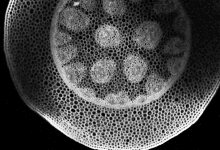
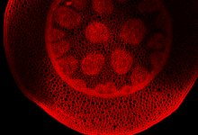

|  Method            | Parameters       | Quick Start Reader | Original Reader | Delta  |
| -------------------|------------------|--------------------|-----------------|------- |
| Initialization     |                  |3 ms|4 ms|        |
| Reader Size (Mb)     |                  |0.13|0.24|        |
| getStageLabelX| Image 0 | -16845.945 um | -16082.100 um | 763.845 um |
| getStageLabelY| Image 0 | -31051.822 um | -30669.900 um | 381.922 um |
| getPlanePositionX| Image 0 Plane 0 | -16845.945 um | -16082.100 um | 763.845 um |
| getPlanePositionY| Image 0 Plane 0 | -31051.822 um | -30669.900 um | 381.922 um |
| getPlanePositionX| Image 0 Plane 1 | -16845.945 um | -16082.100 um | 763.845 um |
| getPlanePositionY| Image 0 Plane 1 | -31051.822 um | -30669.900 um | 381.922 um |
| getPlanePositionX| Image 0 Plane 2 | -16845.945 um | -16082.100 um | 763.845 um |
| getPlanePositionY| Image 0 Plane 2 | -31051.822 um | -30669.900 um | 381.922 um |
| getPlanePositionX| Image 0 Plane 3 | -16845.945 um | -16082.100 um | 763.845 um |
| getPlanePositionY| Image 0 Plane 3 | -31051.822 um | -30669.900 um | 381.922 um |
| getPlanePositionX| Image 0 Plane 4 | -16845.945 um | -16082.100 um | 763.845 um |
| getPlanePositionY| Image 0 Plane 4 | -31051.822 um | -30669.900 um | 381.922 um |
| getPlanePositionX| Image 0 Plane 5 | -16845.945 um | -16082.100 um | 763.845 um |
| getPlanePositionY| Image 0 Plane 5 | -31051.822 um | -30669.900 um | 381.922 um |
| getPlanePositionX| Image 0 Plane 6 | -16845.945 um | -16082.100 um | 763.845 um |
| getPlanePositionY| Image 0 Plane 6 | -31051.822 um | -30669.900 um | 381.922 um |
| getPlanePositionX| Image 0 Plane 7 | -16845.945 um | -16082.100 um | 763.845 um |
| getPlanePositionY| Image 0 Plane 7 | -31051.822 um | -30669.900 um | 381.922 um |
# [3Dexample.czi](https://zenodo.org/record/8321543/files/3Dexample.czi) report
 - **Autostitch** = true
 - ZeissCZIReader v7.1.0
 - ZeissQuickStartCZIReader v0.2.4-SNAPSHOT

# Images 

| Series            | Quick Start Reader | Size | Original Reader | Size | #Diffs |
|-------------------|--------------------|------|-----------------|------|--------|
| Read time (all)   |30 ms|------|40 ms|------|--------|
|0||X:1432 Y:972 C:2 Z:4 T:1||X:1432 Y:972 C:2 Z:4 T:1|0|

# Metadata

