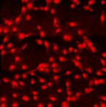

|  Method            | Parameters       | Quick Start Reader | Original Reader | Delta  |
| -------------------|------------------|--------------------|-----------------|------- |
| Initialization     |                  |3 ms|3 ms|        |
| Reader Size (Mb)     |                  |0.14|0.22|        |
| getStageLabelX| Image 0 | 10627.391 um | 10746.100 um | 118.709 um |
| getStageLabelY| Image 0 | 3260.401 um | 3379.110 um | 118.709 um |
| getPlanePositionX| Image 0 Plane 0 | 10627.391 um | 10746.100 um | 118.709 um |
| getPlanePositionY| Image 0 Plane 0 | 3260.401 um | 3379.110 um | 118.709 um |
| getPlanePositionX| Image 0 Plane 1 | 10627.391 um | 10746.100 um | 118.709 um |
| getPlanePositionY| Image 0 Plane 1 | 3260.401 um | 3379.110 um | 118.709 um |
| getPlanePositionX| Image 0 Plane 2 | 10627.391 um | 10746.100 um | 118.709 um |
| getPlanePositionY| Image 0 Plane 2 | 3260.401 um | 3379.110 um | 118.709 um |
# [63x_tile_du145_tf_647_k27ac_488_dapi_r2.czi](https://zenodo.org/record/4243557/files/63x_tile_du145_tf_647_k27ac_488_dapi_r2.czi) report
 - **Autostitch** = true
 - ZeissCZIReader v7.1.0
 - ZeissQuickStartCZIReader v0.2.4-SNAPSHOT

# Images 

| Series            | Quick Start Reader | Size | Original Reader | Size | #Diffs |
|-------------------|--------------------|------|-----------------|------|--------|
| Read time (all)   |1800 ms|------|1712 ms|------|--------|
|0||X:6835 Y:6852 C:3 Z:1 T:1||X:6835 Y:6852 C:3 Z:1 T:1|0|

# Metadata

