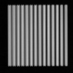

|  Method            | Parameters       | Quick Start Reader | Original Reader | Delta  |
| -------------------|------------------|--------------------|-----------------|------- |
| Initialization     |                  |5 ms|6 ms|        |
| Reader Size (Mb)     |                  |0.12|0.19|        |
# [Airyscan Lines Pattern.czi](https://zenodo.org/record/6848342/files/Airyscan%20Lines%20Pattern.czi) report
 - **Autostitch** = false
 - ZeissCZIReader v6.14.0
 - ZeissQuickStartCZIReader v0.2.2-SNAPSHOT

# Images 

| Series            | Quick Start Reader | Size | Original Reader | Size | #Diffs |
|-------------------|--------------------|------|-----------------|------|--------|
| Read time (all)   |27 ms|------|90 ms|------|--------|
|0||X:1000 Y:1000 C:1 Z:1 T:1||X:1000 Y:1000 C:1 Z:1 T:1|0|

# Metadata

