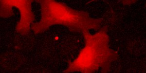

|  Method            | Parameters       | Quick Start Reader | Original Reader | Delta  |
| -------------------|------------------|--------------------|-----------------|------- |
| Initialization     |                  |5 ms|6 ms|        |
| Reader Size (Mb)     |                  |0.18|0.26|        |
# [CHMP2B_IF_A13410_CR-Gauss-15.czi](https://zenodo.org/record/8139356/files/CHMP2B_IF_A13410_CR-Gauss-15.czi) report
 - **Autostitch** = true
 - ZeissCZIReader v7.0.0
 - ZeissQuickStartCZIReader v0.2.2-SNAPSHOT

# Images 

| Series            | Quick Start Reader | Size | Original Reader | Size | #Diffs |
|-------------------|--------------------|------|-----------------|------|--------|
| Read time (all)   |141 ms|------|134 ms|------|--------|
|0||X:2599 Y:1299 C:4 Z:1 T:1||X:2599 Y:1299 C:4 Z:1 T:1|0|

# Metadata

