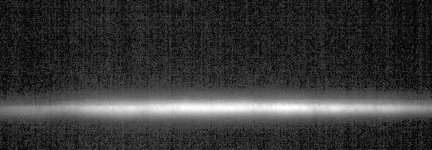

# [Cfra_LS2-02.czi](\\sv-01-154\d$\SWAP\Data\Marine\2023-03-16\Cfra_LS2-02.czi) report
 - **Autostitch** = true
 - ZeissCZIReader v6.14.0
 - ZeissQuickStartCZIReader v0.2.1-SNAPSHOT

# Images 

| Series            | Quick Start Reader | Size | Original Reader | Size | #Diffs |
|-------------------|--------------------|------|-----------------|------|--------|
| Read time (all)   |592 ms|------|955 ms|------|--------|
|0||X:2016 Y:700 C:2 Z:3751 T:2||X:2016 Y:700 C:2 Z:3751 T:2|0|

# Metadata

|  Method            | Parameters       | Quick Start Reader | Original Reader | Delta  |
| -------------------|------------------|--------------------|-----------------|------- |
| Initialization     |                  |142 ms|456 ms|        |
| Reader Size (Mb)     |                  |7.32|19.04|        |
| getStageLabelName| Image 0 | TR1| Scene position #0| |
| getPlaneDeltaT| Image 0 Plane 1 |  1: null| 2: ome.units.quantity.Time: value[45.657999992370605], unit[s] stored as java.lang.Double |
| getPlaneExposureTime| Image 0 Plane 1 |  1: null| 2: ome.units.quantity.Time: value[5.0], unit[s] stored as java.lang.Double |
| getPlanePositionX| Image 0 Plane 1 |  1: null| 2: ome.units.quantity.Length: value[1874.824], unit[µm] stored as java.lang.Double |
| getPlanePositionY| Image 0 Plane 1 |  1: null| 2: ome.units.quantity.Length: value[261.316], unit[µm] stored as java.lang.Double |
| getPlanePositionZ| Image 0 Plane 1 |  1: null| 2: ome.units.quantity.Length: value[-254.612], unit[µm] stored as java.lang.Double |
| getPlanePositionZ| Image 0 Plane 2 | -254.212 um | -254.612 um | 0.400 um |
| getPlaneDeltaT| Image 0 Plane 3 |  1: null| 2: ome.units.quantity.Time: value[45.66700005531311], unit[s] stored as java.lang.Double |
| getPlaneExposureTime| Image 0 Plane 3 |  1: null| 2: ome.units.quantity.Time: value[5.0], unit[s] stored as java.lang.Double |
| getPlanePositionX| Image 0 Plane 3 |  1: null| 2: ome.units.quantity.Length: value[1874.824], unit[µm] stored as java.lang.Double |
| getPlanePositionY| Image 0 Plane 3 |  1: null| 2: ome.units.quantity.Length: value[261.316], unit[µm] stored as java.lang.Double |
| getPlanePositionZ| Image 0 Plane 3 |  1: null| 2: ome.units.quantity.Length: value[-254.612], unit[µm] stored as java.lang.Double |
| getPlanePositionZ| Image 0 Plane 4 | -253.812 um | -254.612 um | 0.800 um |
| getPlaneDeltaT| Image 0 Plane 5 |  1: null| 2: ome.units.quantity.Time: value[45.676000118255615], unit[s] stored as java.lang.Double |
| getPlaneExposureTime| Image 0 Plane 5 |  1: null| 2: ome.units.quantity.Time: value[5.0], unit[s] stored as java.lang.Double |
| getPlanePositionX| Image 0 Plane 5 |  1: null| 2: ome.units.quantity.Length: value[1874.824], unit[µm] stored as java.lang.Double |
| getPlanePositionY| Image 0 Plane 5 |  1: null| 2: ome.units.quantity.Length: value[261.316], unit[µm] stored as java.lang.Double |
| getPlanePositionZ| Image 0 Plane 5 |  1: null| 2: ome.units.quantity.Length: value[-254.612], unit[µm] stored as java.lang.Double |
| getPlanePositionZ| Image 0 Plane 6 | -253.412 um | -254.612 um | 1.200 um |
| getPlaneDeltaT| Image 0 Plane 7 |  1: null| 2: ome.units.quantity.Time: value[45.68499994277954], unit[s] stored as java.lang.Double |
| getPlaneExposureTime| Image 0 Plane 7 |  1: null| 2: ome.units.quantity.Time: value[5.0], unit[s] stored as java.lang.Double |
| getPlanePositionX| Image 0 Plane 7 |  1: null| 2: ome.units.quantity.Length: value[1874.824], unit[µm] stored as java.lang.Double |
| getPlanePositionY| Image 0 Plane 7 |  1: null| 2: ome.units.quantity.Length: value[261.316], unit[µm] stored as java.lang.Double |
| getPlanePositionZ| Image 0 Plane 7 |  1: null| 2: ome.units.quantity.Length: value[-254.612], unit[µm] stored as java.lang.Double |
| getPlanePositionZ| Image 0 Plane 8 | -253.012 um | -254.612 um | 1.600 um |
| getPlaneDeltaT| Image 0 Plane 9 |  1: null| 2: ome.units.quantity.Time: value[45.6949999332428], unit[s] stored as java.lang.Double |
| getPlaneExposureTime| Image 0 Plane 9 |  1: null| 2: ome.units.quantity.Time: value[5.0], unit[s] stored as java.lang.Double |
| getPlanePositionX| Image 0 Plane 9 |  1: null| 2: ome.units.quantity.Length: value[1874.824], unit[µm] stored as java.lang.Double |
| getPlanePositionY| Image 0 Plane 9 |  1: null| 2: ome.units.quantity.Length: value[261.316], unit[µm] stored as java.lang.Double |
| getPlanePositionZ| Image 0 Plane 9 |  1: null| 2: ome.units.quantity.Length: value[-254.612], unit[µm] stored as java.lang.Double |
| getPlanePositionZ| Image 0 Plane 10 | -252.612 um | -254.612 um | 2.000 um |
| getPlaneDeltaT| Image 0 Plane 11 |  1: null| 2: ome.units.quantity.Time: value[45.7039999961853], unit[s] stored as java.lang.Double |
| getPlaneExposureTime| Image 0 Plane 11 |  1: null| 2: ome.units.quantity.Time: value[5.0], unit[s] stored as java.lang.Double |
| getPlanePositionX| Image 0 Plane 11 |  1: null| 2: ome.units.quantity.Length: value[1874.824], unit[µm] stored as java.lang.Double |
| getPlanePositionY| Image 0 Plane 11 |  1: null| 2: ome.units.quantity.Length: value[261.316], unit[µm] stored as java.lang.Double |
| getPlanePositionZ| Image 0 Plane 11 |  1: null| 2: ome.units.quantity.Length: value[-254.612], unit[µm] stored as java.lang.Double |
| getPlanePositionZ| Image 0 Plane 12 | -252.212 um | -254.612 um | 2.400 um |
| getPlaneDeltaT| Image 0 Plane 13 |  1: null| 2: ome.units.quantity.Time: value[45.71300005912781], unit[s] stored as java.lang.Double |
| getPlaneExposureTime| Image 0 Plane 13 |  1: null| 2: ome.units.quantity.Time: value[5.0], unit[s] stored as java.lang.Double |
| getPlanePositionX| Image 0 Plane 13 |  1: null| 2: ome.units.quantity.Length: value[1874.824], unit[µm] stored as java.lang.Double |
| getPlanePositionY| Image 0 Plane 13 |  1: null| 2: ome.units.quantity.Length: value[261.316], unit[µm] stored as java.lang.Double |
| getPlanePositionZ| Image 0 Plane 13 |  1: null| 2: ome.units.quantity.Length: value[-254.612], unit[µm] stored as java.lang.Double |
| getPlanePositionZ| Image 0 Plane 14 | -251.812 um | -254.612 um | 2.800 um |
| getPlaneDeltaT| Image 0 Plane 15 |  1: null| 2: ome.units.quantity.Time: value[45.72200012207031], unit[s] stored as java.lang.Double |
| getPlaneExposureTime| Image 0 Plane 15 |  1: null| 2: ome.units.quantity.Time: value[5.0], unit[s] stored as java.lang.Double |
| getPlanePositionX| Image 0 Plane 15 |  1: null| 2: ome.units.quantity.Length: value[1874.824], unit[µm] stored as java.lang.Double |
| getPlanePositionY| Image 0 Plane 15 |  1: null| 2: ome.units.quantity.Length: value[261.316], unit[µm] stored as java.lang.Double |
| getPlanePositionZ| Image 0 Plane 15 |  1: null| 2: ome.units.quantity.Length: value[-254.612], unit[µm] stored as java.lang.Double |
| getPlanePositionZ| Image 0 Plane 16 | -251.412 um | -254.612 um | 3.200 um |
| getPlaneDeltaT| Image 0 Plane 17 |  1: null| 2: ome.units.quantity.Time: value[45.73099994659424], unit[s] stored as java.lang.Double |
| getPlaneExposureTime| Image 0 Plane 17 |  1: null| 2: ome.units.quantity.Time: value[5.0], unit[s] stored as java.lang.Double |
| getPlanePositionX| Image 0 Plane 17 |  1: null| 2: ome.units.quantity.Length: value[1874.824], unit[µm] stored as java.lang.Double |
| getPlanePositionY| Image 0 Plane 17 |  1: null| 2: ome.units.quantity.Length: value[261.316], unit[µm] stored as java.lang.Double |
| getPlanePositionZ| Image 0 Plane 17 |  1: null| 2: ome.units.quantity.Length: value[-254.612], unit[µm] stored as java.lang.Double |
| getPlanePositionZ| Image 0 Plane 18 | -251.012 um | -254.612 um | 3.600 um |
| getPlaneDeltaT| Image 0 Plane 19 |  1: null| 2: ome.units.quantity.Time: value[45.740999937057495], unit[s] stored as java.lang.Double |
| getPlaneExposureTime| Image 0 Plane 19 |  1: null| 2: ome.units.quantity.Time: value[5.0], unit[s] stored as java.lang.Double |
| getPlanePositionX| Image 0 Plane 19 |  1: null| 2: ome.units.quantity.Length: value[1874.824], unit[µm] stored as java.lang.Double |
| getPlanePositionY| Image 0 Plane 19 |  1: null| 2: ome.units.quantity.Length: value[261.316], unit[µm] stored as java.lang.Double |
| getPlanePositionZ| Image 0 Plane 19 |  1: null| 2: ome.units.quantity.Length: value[-254.612], unit[µm] stored as java.lang.Double |
| getPlanePositionZ| Image 0 Plane 20 | -250.612 um | -254.612 um | 4.000 um |
| getPlaneDeltaT| Image 0 Plane 21 |  1: null| 2: ome.units.quantity.Time: value[45.75], unit[s] stored as java.lang.Double |
| getPlaneExposureTime| Image 0 Plane 21 |  1: null| 2: ome.units.quantity.Time: value[5.0], unit[s] stored as java.lang.Double |
| getPlanePositionX| Image 0 Plane 21 |  1: null| 2: ome.units.quantity.Length: value[1874.824], unit[µm] stored as java.lang.Double |
| getPlanePositionY| Image 0 Plane 21 |  1: null| 2: ome.units.quantity.Length: value[261.316], unit[µm] stored as java.lang.Double |
| getPlanePositionZ| Image 0 Plane 21 |  1: null| 2: ome.units.quantity.Length: value[-254.612], unit[µm] stored as java.lang.Double |
| getPlanePositionZ| Image 0 Plane 22 | -250.212 um | -254.612 um | 4.400 um |
| getPlaneDeltaT| Image 0 Plane 23 |  1: null| 2: ome.units.quantity.Time: value[45.759000062942505], unit[s] stored as java.lang.Double |
| getPlaneExposureTime| Image 0 Plane 23 |  1: null| 2: ome.units.quantity.Time: value[5.0], unit[s] stored as java.lang.Double |
| getPlanePositionX| Image 0 Plane 23 |  1: null| 2: ome.units.quantity.Length: value[1874.824], unit[µm] stored as java.lang.Double |
| getPlanePositionY| Image 0 Plane 23 |  1: null| 2: ome.units.quantity.Length: value[261.316], unit[µm] stored as java.lang.Double |
| getPlanePositionZ| Image 0 Plane 23 |  1: null| 2: ome.units.quantity.Length: value[-254.612], unit[µm] stored as java.lang.Double |
| getPlanePositionZ| Image 0 Plane 24 | -249.812 um | -254.612 um | 4.800 um |
| getPlaneDeltaT| Image 0 Plane 25 |  1: null| 2: ome.units.quantity.Time: value[45.76799988746643], unit[s] stored as java.lang.Double |
| getPlaneExposureTime| Image 0 Plane 25 |  1: null| 2: ome.units.quantity.Time: value[5.0], unit[s] stored as java.lang.Double |
| getPlanePositionX| Image 0 Plane 25 |  1: null| 2: ome.units.quantity.Length: value[1874.824], unit[µm] stored as java.lang.Double |
| getPlanePositionY| Image 0 Plane 25 |  1: null| 2: ome.units.quantity.Length: value[261.316], unit[µm] stored as java.lang.Double |
| getPlanePositionZ| Image 0 Plane 25 |  1: null| 2: ome.units.quantity.Length: value[-254.612], unit[µm] stored as java.lang.Double |
| getPlanePositionZ| Image 0 Plane 26 | -249.412 um | -254.612 um | 5.200 um |
| getPlaneDeltaT| Image 0 Plane 27 |  1: null| 2: ome.units.quantity.Time: value[45.776999950408936], unit[s] stored as java.lang.Double |
| getPlaneExposureTime| Image 0 Plane 27 |  1: null| 2: ome.units.quantity.Time: value[5.0], unit[s] stored as java.lang.Double |
| getPlanePositionX| Image 0 Plane 27 |  1: null| 2: ome.units.quantity.Length: value[1874.824], unit[µm] stored as java.lang.Double |
| getPlanePositionY| Image 0 Plane 27 |  1: null| 2: ome.units.quantity.Length: value[261.316], unit[µm] stored as java.lang.Double |
| getPlanePositionZ| Image 0 Plane 27 |  1: null| 2: ome.units.quantity.Length: value[-254.612], unit[µm] stored as java.lang.Double |
| getPlanePositionZ| Image 0 Plane 28 | -249.012 um | -254.612 um | 5.600 um |
| getPlaneDeltaT| Image 0 Plane 29 |  1: null| 2: ome.units.quantity.Time: value[45.78600001335144], unit[s] stored as java.lang.Double |
| getPlaneExposureTime| Image 0 Plane 29 |  1: null| 2: ome.units.quantity.Time: value[5.0], unit[s] stored as java.lang.Double |
| getPlanePositionX| Image 0 Plane 29 |  1: null| 2: ome.units.quantity.Length: value[1874.824], unit[µm] stored as java.lang.Double |
| getPlanePositionY| Image 0 Plane 29 |  1: null| 2: ome.units.quantity.Length: value[261.316], unit[µm] stored as java.lang.Double |
| getPlanePositionZ| Image 0 Plane 29 |  1: null| 2: ome.units.quantity.Length: value[-254.612], unit[µm] stored as java.lang.Double |
| getPlanePositionZ| Image 0 Plane 30 | -248.612 um | -254.612 um | 6.000 um |
| getPlaneDeltaT| Image 0 Plane 31 |  1: null| 2: ome.units.quantity.Time: value[45.795000076293945], unit[s] stored as java.lang.Double |
| getPlaneExposureTime| Image 0 Plane 31 |  1: null| 2: ome.units.quantity.Time: value[5.0], unit[s] stored as java.lang.Double |
| getPlanePositionX| Image 0 Plane 31 |  1: null| 2: ome.units.quantity.Length: value[1874.824], unit[µm] stored as java.lang.Double |
| getPlanePositionY| Image 0 Plane 31 |  1: null| 2: ome.units.quantity.Length: value[261.316], unit[µm] stored as java.lang.Double |
| getPlanePositionZ| Image 0 Plane 31 |  1: null| 2: ome.units.quantity.Length: value[-254.612], unit[µm] stored as java.lang.Double |
| getPlanePositionZ| Image 0 Plane 32 | -248.212 um | -254.612 um | 6.400 um |
| getPlaneDeltaT| Image 0 Plane 33 |  1: null| 2: ome.units.quantity.Time: value[45.80399990081787], unit[s] stored as java.lang.Double |
| getPlaneExposureTime| Image 0 Plane 33 |  1: null| 2: ome.units.quantity.Time: value[5.0], unit[s] stored as java.lang.Double |
| getPlanePositionX| Image 0 Plane 33 |  1: null| 2: ome.units.quantity.Length: value[1874.824], unit[µm] stored as java.lang.Double |
| getPlanePositionY| Image 0 Plane 33 |  1: null| 2: ome.units.quantity.Length: value[261.316], unit[µm] stored as java.lang.Double |
| getPlanePositionZ| Image 0 Plane 33 |  1: null| 2: ome.units.quantity.Length: value[-254.612], unit[µm] stored as java.lang.Double |
| getPlanePositionZ| Image 0 Plane 34 | -247.812 um | -254.612 um | 6.800 um |
| getPlaneDeltaT| Image 0 Plane 35 |  1: null| 2: ome.units.quantity.Time: value[45.81399989128113], unit[s] stored as java.lang.Double |
| getPlaneExposureTime| Image 0 Plane 35 |  1: null| 2: ome.units.quantity.Time: value[5.0], unit[s] stored as java.lang.Double |
| getPlanePositionX| Image 0 Plane 35 |  1: null| 2: ome.units.quantity.Length: value[1874.824], unit[µm] stored as java.lang.Double |
| getPlanePositionY| Image 0 Plane 35 |  1: null| 2: ome.units.quantity.Length: value[261.316], unit[µm] stored as java.lang.Double |
| getPlanePositionZ| Image 0 Plane 35 |  1: null| 2: ome.units.quantity.Length: value[-254.612], unit[µm] stored as java.lang.Double |
| getPlanePositionZ| Image 0 Plane 36 | -247.412 um | -254.612 um | 7.200 um |
| getPlaneDeltaT| Image 0 Plane 37 |  1: null| 2: ome.units.quantity.Time: value[45.82299995422363], unit[s] stored as java.lang.Double |
| getPlaneExposureTime| Image 0 Plane 37 |  1: null| 2: ome.units.quantity.Time: value[5.0], unit[s] stored as java.lang.Double |
| getPlanePositionX| Image 0 Plane 37 |  1: null| 2: ome.units.quantity.Length: value[1874.824], unit[µm] stored as java.lang.Double |
| getPlanePositionY| Image 0 Plane 37 |  1: null| 2: ome.units.quantity.Length: value[261.316], unit[µm] stored as java.lang.Double |
| getPlanePositionZ| Image 0 Plane 37 |  1: null| 2: ome.units.quantity.Length: value[-254.612], unit[µm] stored as java.lang.Double |
| getPlanePositionZ| Image 0 Plane 38 | -247.012 um | -254.612 um | 7.600 um |
| getPlaneDeltaT| Image 0 Plane 39 |  1: null| 2: ome.units.quantity.Time: value[45.83200001716614], unit[s] stored as java.lang.Double |
| getPlaneExposureTime| Image 0 Plane 39 |  1: null| 2: ome.units.quantity.Time: value[5.0], unit[s] stored as java.lang.Double |
| getPlanePositionX| Image 0 Plane 39 |  1: null| 2: ome.units.quantity.Length: value[1874.824], unit[µm] stored as java.lang.Double |
| getPlanePositionY| Image 0 Plane 39 |  1: null| 2: ome.units.quantity.Length: value[261.316], unit[µm] stored as java.lang.Double |
| getPlanePositionZ| Image 0 Plane 39 |  1: null| 2: ome.units.quantity.Length: value[-254.612], unit[µm] stored as java.lang.Double |
| getPlanePositionZ| Image 0 Plane 40 | -246.612 um | -254.612 um | 8.000 um |
| getPlaneDeltaT| Image 0 Plane 41 |  1: null| 2: ome.units.quantity.Time: value[45.84100008010864], unit[s] stored as java.lang.Double |
| getPlaneExposureTime| Image 0 Plane 41 |  1: null| 2: ome.units.quantity.Time: value[5.0], unit[s] stored as java.lang.Double |
| getPlanePositionX| Image 0 Plane 41 |  1: null| 2: ome.units.quantity.Length: value[1874.824], unit[µm] stored as java.lang.Double |
| getPlanePositionY| Image 0 Plane 41 |  1: null| 2: ome.units.quantity.Length: value[261.316], unit[µm] stored as java.lang.Double |
| getPlanePositionZ| Image 0 Plane 41 |  1: null| 2: ome.units.quantity.Length: value[-254.612], unit[µm] stored as java.lang.Double |
| getPlanePositionZ| Image 0 Plane 42 | -246.212 um | -254.612 um | 8.400 um |
| getPlaneDeltaT| Image 0 Plane 43 |  1: null| 2: ome.units.quantity.Time: value[45.84999990463257], unit[s] stored as java.lang.Double |
| getPlaneExposureTime| Image 0 Plane 43 |  1: null| 2: ome.units.quantity.Time: value[5.0], unit[s] stored as java.lang.Double |
| getPlanePositionX| Image 0 Plane 43 |  1: null| 2: ome.units.quantity.Length: value[1874.824], unit[µm] stored as java.lang.Double |
| getPlanePositionY| Image 0 Plane 43 |  1: null| 2: ome.units.quantity.Length: value[261.316], unit[µm] stored as java.lang.Double |
| getPlanePositionZ| Image 0 Plane 43 |  1: null| 2: ome.units.quantity.Length: value[-254.612], unit[µm] stored as java.lang.Double |
| getPlanePositionZ| Image 0 Plane 44 | -245.812 um | -254.612 um | 8.800 um |
| getPlaneDeltaT| Image 0 Plane 45 |  1: null| 2: ome.units.quantity.Time: value[45.859999895095825], unit[s] stored as java.lang.Double |
| getPlaneExposureTime| Image 0 Plane 45 |  1: null| 2: ome.units.quantity.Time: value[5.0], unit[s] stored as java.lang.Double |
| getPlanePositionX| Image 0 Plane 45 |  1: null| 2: ome.units.quantity.Length: value[1874.824], unit[µm] stored as java.lang.Double |
| getPlanePositionY| Image 0 Plane 45 |  1: null| 2: ome.units.quantity.Length: value[261.316], unit[µm] stored as java.lang.Double |
| getPlanePositionZ| Image 0 Plane 45 |  1: null| 2: ome.units.quantity.Length: value[-254.612], unit[µm] stored as java.lang.Double |
| getPlanePositionZ| Image 0 Plane 46 | -245.412 um | -254.612 um | 9.200 um |
| getPlaneDeltaT| Image 0 Plane 47 |  1: null| 2: ome.units.quantity.Time: value[45.86899995803833], unit[s] stored as java.lang.Double |
| getPlaneExposureTime| Image 0 Plane 47 |  1: null| 2: ome.units.quantity.Time: value[5.0], unit[s] stored as java.lang.Double |
| getPlanePositionX| Image 0 Plane 47 |  1: null| 2: ome.units.quantity.Length: value[1874.824], unit[µm] stored as java.lang.Double |
| getPlanePositionY| Image 0 Plane 47 |  1: null| 2: ome.units.quantity.Length: value[261.316], unit[µm] stored as java.lang.Double |
| getPlanePositionZ| Image 0 Plane 47 |  1: null| 2: ome.units.quantity.Length: value[-254.612], unit[µm] stored as java.lang.Double |
| getPlanePositionZ| Image 0 Plane 48 | -245.012 um | -254.612 um | 9.600 um |
| getPlaneDeltaT| Image 0 Plane 49 |  1: null| 2: ome.units.quantity.Time: value[45.878000020980835], unit[s] stored as java.lang.Double |
| getPlaneExposureTime| Image 0 Plane 49 |  1: null| 2: ome.units.quantity.Time: value[5.0], unit[s] stored as java.lang.Double |
| getPlanePositionX| Image 0 Plane 49 |  1: null| 2: ome.units.quantity.Length: value[1874.824], unit[µm] stored as java.lang.Double |
| getPlanePositionY| Image 0 Plane 49 |  1: null| 2: ome.units.quantity.Length: value[261.316], unit[µm] stored as java.lang.Double |
| getPlanePositionZ| Image 0 Plane 49 |  1: null| 2: ome.units.quantity.Length: value[-254.612], unit[µm] stored as java.lang.Double |
| getPlanePositionZ| Image 0 Plane 50 | -244.612 um | -254.612 um | 10.000 um |
| getPlaneDeltaT| Image 0 Plane 51 |  1: null| 2: ome.units.quantity.Time: value[45.88700008392334], unit[s] stored as java.lang.Double |
| getPlaneExposureTime| Image 0 Plane 51 |  1: null| 2: ome.units.quantity.Time: value[5.0], unit[s] stored as java.lang.Double |
| getPlanePositionX| Image 0 Plane 51 |  1: null| 2: ome.units.quantity.Length: value[1874.824], unit[µm] stored as java.lang.Double |
| getPlanePositionY| Image 0 Plane 51 |  1: null| 2: ome.units.quantity.Length: value[261.316], unit[µm] stored as java.lang.Double |
| getPlanePositionZ| Image 0 Plane 51 |  1: null| 2: ome.units.quantity.Length: value[-254.612], unit[µm] stored as java.lang.Double |
| getPlanePositionZ| Image 0 Plane 52 | -244.212 um | -254.612 um | 10.400 um |
| getPlaneDeltaT| Image 0 Plane 53 |  1: null| 2: ome.units.quantity.Time: value[45.8970000743866], unit[s] stored as java.lang.Double |
| getPlaneExposureTime| Image 0 Plane 53 |  1: null| 2: ome.units.quantity.Time: value[5.0], unit[s] stored as java.lang.Double |
| getPlanePositionX| Image 0 Plane 53 |  1: null| 2: ome.units.quantity.Length: value[1874.824], unit[µm] stored as java.lang.Double |
| getPlanePositionY| Image 0 Plane 53 |  1: null| 2: ome.units.quantity.Length: value[261.316], unit[µm] stored as java.lang.Double |
| getPlanePositionZ| Image 0 Plane 53 |  1: null| 2: ome.units.quantity.Length: value[-254.612], unit[µm] stored as java.lang.Double |
| getPlanePositionZ| Image 0 Plane 54 | -243.812 um | -254.612 um | 10.800 um |
| getPlaneDeltaT| Image 0 Plane 55 |  1: null| 2: ome.units.quantity.Time: value[45.90599989891052], unit[s] stored as java.lang.Double |
| getPlaneExposureTime| Image 0 Plane 55 |  1: null| 2: ome.units.quantity.Time: value[5.0], unit[s] stored as java.lang.Double |
| getPlanePositionX| Image 0 Plane 55 |  1: null| 2: ome.units.quantity.Length: value[1874.824], unit[µm] stored as java.lang.Double |
| getPlanePositionY| Image 0 Plane 55 |  1: null| 2: ome.units.quantity.Length: value[261.316], unit[µm] stored as java.lang.Double |
| getPlanePositionZ| Image 0 Plane 55 |  1: null| 2: ome.units.quantity.Length: value[-254.612], unit[µm] stored as java.lang.Double |
| getPlanePositionZ| Image 0 Plane 56 | -243.412 um | -254.612 um | 11.200 um |
| getPlaneDeltaT| Image 0 Plane 57 |  1: null| 2: ome.units.quantity.Time: value[45.91499996185303], unit[s] stored as java.lang.Double |
| getPlaneExposureTime| Image 0 Plane 57 |  1: null| 2: ome.units.quantity.Time: value[5.0], unit[s] stored as java.lang.Double |
| getPlanePositionX| Image 0 Plane 57 |  1: null| 2: ome.units.quantity.Length: value[1874.824], unit[µm] stored as java.lang.Double |
| getPlanePositionY| Image 0 Plane 57 |  1: null| 2: ome.units.quantity.Length: value[261.316], unit[µm] stored as java.lang.Double |
| getPlanePositionZ| Image 0 Plane 57 |  1: null| 2: ome.units.quantity.Length: value[-254.612], unit[µm] stored as java.lang.Double |
| getPlanePositionZ| Image 0 Plane 58 | -243.012 um | -254.612 um | 11.600 um |
| getPlaneDeltaT| Image 0 Plane 59 |  1: null| 2: ome.units.quantity.Time: value[45.92400002479553], unit[s] stored as java.lang.Double |
| getPlaneExposureTime| Image 0 Plane 59 |  1: null| 2: ome.units.quantity.Time: value[5.0], unit[s] stored as java.lang.Double |
| getPlanePositionX| Image 0 Plane 59 |  1: null| 2: ome.units.quantity.Length: value[1874.824], unit[µm] stored as java.lang.Double |
| getPlanePositionY| Image 0 Plane 59 |  1: null| 2: ome.units.quantity.Length: value[261.316], unit[µm] stored as java.lang.Double |
| getPlanePositionZ| Image 0 Plane 59 |  1: null| 2: ome.units.quantity.Length: value[-254.612], unit[µm] stored as java.lang.Double |
| getPlanePositionZ| Image 0 Plane 60 | -242.612 um | -254.612 um | 12.000 um |
| getPlaneDeltaT| Image 0 Plane 61 |  1: null| 2: ome.units.quantity.Time: value[45.93400001525879], unit[s] stored as java.lang.Double |
| getPlaneExposureTime| Image 0 Plane 61 |  1: null| 2: ome.units.quantity.Time: value[5.0], unit[s] stored as java.lang.Double |
| getPlanePositionX| Image 0 Plane 61 |  1: null| 2: ome.units.quantity.Length: value[1874.824], unit[µm] stored as java.lang.Double |
| getPlanePositionY| Image 0 Plane 61 |  1: null| 2: ome.units.quantity.Length: value[261.316], unit[µm] stored as java.lang.Double |
| getPlanePositionZ| Image 0 Plane 61 |  1: null| 2: ome.units.quantity.Length: value[-254.612], unit[µm] stored as java.lang.Double |
| getPlanePositionZ| Image 0 Plane 62 | -242.212 um | -254.612 um | 12.400 um |
| getPlaneDeltaT| Image 0 Plane 63 |  1: null| 2: ome.units.quantity.Time: value[45.943000078201294], unit[s] stored as java.lang.Double |
| getPlaneExposureTime| Image 0 Plane 63 |  1: null| 2: ome.units.quantity.Time: value[5.0], unit[s] stored as java.lang.Double |
| getPlanePositionX| Image 0 Plane 63 |  1: null| 2: ome.units.quantity.Length: value[1874.824], unit[µm] stored as java.lang.Double |
| getPlanePositionY| Image 0 Plane 63 |  1: null| 2: ome.units.quantity.Length: value[261.316], unit[µm] stored as java.lang.Double |
| getPlanePositionZ| Image 0 Plane 63 |  1: null| 2: ome.units.quantity.Length: value[-254.612], unit[µm] stored as java.lang.Double |
| getPlanePositionZ| Image 0 Plane 64 | -241.812 um | -254.612 um | 12.800 um |
| getPlaneDeltaT| Image 0 Plane 65 |  1: null| 2: ome.units.quantity.Time: value[45.95199990272522], unit[s] stored as java.lang.Double |
| getPlaneExposureTime| Image 0 Plane 65 |  1: null| 2: ome.units.quantity.Time: value[5.0], unit[s] stored as java.lang.Double |
| getPlanePositionX| Image 0 Plane 65 |  1: null| 2: ome.units.quantity.Length: value[1874.824], unit[µm] stored as java.lang.Double |
| getPlanePositionY| Image 0 Plane 65 |  1: null| 2: ome.units.quantity.Length: value[261.316], unit[µm] stored as java.lang.Double |
| getPlanePositionZ| Image 0 Plane 65 |  1: null| 2: ome.units.quantity.Length: value[-254.612], unit[µm] stored as java.lang.Double |
| getPlanePositionZ| Image 0 Plane 66 | -241.412 um | -254.612 um | 13.200 um |
| getPlaneDeltaT| Image 0 Plane 67 |  1: null| 2: ome.units.quantity.Time: value[45.960999965667725], unit[s] stored as java.lang.Double |
| getPlaneExposureTime| Image 0 Plane 67 |  1: null| 2: ome.units.quantity.Time: value[5.0], unit[s] stored as java.lang.Double |
| getPlanePositionX| Image 0 Plane 67 |  1: null| 2: ome.units.quantity.Length: value[1874.824], unit[µm] stored as java.lang.Double |
| getPlanePositionY| Image 0 Plane 67 |  1: null| 2: ome.units.quantity.Length: value[261.316], unit[µm] stored as java.lang.Double |
| getPlanePositionZ| Image 0 Plane 67 |  1: null| 2: ome.units.quantity.Length: value[-254.612], unit[µm] stored as java.lang.Double |
| getPlanePositionZ| Image 0 Plane 68 | -241.012 um | -254.612 um | 13.600 um |
| getPlaneDeltaT| Image 0 Plane 69 |  1: null| 2: ome.units.quantity.Time: value[45.97099995613098], unit[s] stored as java.lang.Double |
| getPlaneExposureTime| Image 0 Plane 69 |  1: null| 2: ome.units.quantity.Time: value[5.0], unit[s] stored as java.lang.Double |
| getPlanePositionX| Image 0 Plane 69 |  1: null| 2: ome.units.quantity.Length: value[1874.824], unit[µm] stored as java.lang.Double |
| getPlanePositionY| Image 0 Plane 69 |  1: null| 2: ome.units.quantity.Length: value[261.316], unit[µm] stored as java.lang.Double |
| getPlanePositionZ| Image 0 Plane 69 |  1: null| 2: ome.units.quantity.Length: value[-254.612], unit[µm] stored as java.lang.Double |
| getPlanePositionZ| Image 0 Plane 70 | -240.612 um | -254.612 um | 14.000 um |
| getPlaneDeltaT| Image 0 Plane 71 |  1: null| 2: ome.units.quantity.Time: value[45.980000019073486], unit[s] stored as java.lang.Double |
| getPlaneExposureTime| Image 0 Plane 71 |  1: null| 2: ome.units.quantity.Time: value[5.0], unit[s] stored as java.lang.Double |
| getPlanePositionX| Image 0 Plane 71 |  1: null| 2: ome.units.quantity.Length: value[1874.824], unit[µm] stored as java.lang.Double |
| getPlanePositionY| Image 0 Plane 71 |  1: null| 2: ome.units.quantity.Length: value[261.316], unit[µm] stored as java.lang.Double |
| getPlanePositionZ| Image 0 Plane 71 |  1: null| 2: ome.units.quantity.Length: value[-254.612], unit[µm] stored as java.lang.Double |
| getPlanePositionZ| Image 0 Plane 72 | -240.212 um | -254.612 um | 14.400 um |
| getPlaneDeltaT| Image 0 Plane 73 |  1: null| 2: ome.units.quantity.Time: value[45.98900008201599], unit[s] stored as java.lang.Double |
| getPlaneExposureTime| Image 0 Plane 73 |  1: null| 2: ome.units.quantity.Time: value[5.0], unit[s] stored as java.lang.Double |
| getPlanePositionX| Image 0 Plane 73 |  1: null| 2: ome.units.quantity.Length: value[1874.824], unit[µm] stored as java.lang.Double |
| getPlanePositionY| Image 0 Plane 73 |  1: null| 2: ome.units.quantity.Length: value[261.316], unit[µm] stored as java.lang.Double |
| getPlanePositionZ| Image 0 Plane 73 |  1: null| 2: ome.units.quantity.Length: value[-254.612], unit[µm] stored as java.lang.Double |
| getPlanePositionZ| Image 0 Plane 74 | -239.812 um | -254.612 um | 14.800 um |
| getPlaneDeltaT| Image 0 Plane 75 |  1: null| 2: ome.units.quantity.Time: value[45.996999979019165], unit[s] stored as java.lang.Double |
| getPlaneExposureTime| Image 0 Plane 75 |  1: null| 2: ome.units.quantity.Time: value[5.0], unit[s] stored as java.lang.Double |
| getPlanePositionX| Image 0 Plane 75 |  1: null| 2: ome.units.quantity.Length: value[1874.824], unit[µm] stored as java.lang.Double |
| getPlanePositionY| Image 0 Plane 75 |  1: null| 2: ome.units.quantity.Length: value[261.316], unit[µm] stored as java.lang.Double |
| getPlanePositionZ| Image 0 Plane 75 |  1: null| 2: ome.units.quantity.Length: value[-254.612], unit[µm] stored as java.lang.Double |
| getPlanePositionZ| Image 0 Plane 76 | -239.412 um | -254.612 um | 15.200 um |
| getPlaneDeltaT| Image 0 Plane 77 |  1: null| 2: ome.units.quantity.Time: value[46.00699996948242], unit[s] stored as java.lang.Double |
| getPlaneExposureTime| Image 0 Plane 77 |  1: null| 2: ome.units.quantity.Time: value[5.0], unit[s] stored as java.lang.Double |
| getPlanePositionX| Image 0 Plane 77 |  1: null| 2: ome.units.quantity.Length: value[1874.824], unit[µm] stored as java.lang.Double |
| getPlanePositionY| Image 0 Plane 77 |  1: null| 2: ome.units.quantity.Length: value[261.316], unit[µm] stored as java.lang.Double |
| getPlanePositionZ| Image 0 Plane 77 |  1: null| 2: ome.units.quantity.Length: value[-254.612], unit[µm] stored as java.lang.Double |
| getPlanePositionZ| Image 0 Plane 78 | -239.012 um | -254.612 um | 15.600 um |
| getPlaneDeltaT| Image 0 Plane 79 |  1: null| 2: ome.units.quantity.Time: value[46.01600003242493], unit[s] stored as java.lang.Double |
| getPlaneExposureTime| Image 0 Plane 79 |  1: null| 2: ome.units.quantity.Time: value[5.0], unit[s] stored as java.lang.Double |
| getPlanePositionX| Image 0 Plane 79 |  1: null| 2: ome.units.quantity.Length: value[1874.824], unit[µm] stored as java.lang.Double |
| getPlanePositionY| Image 0 Plane 79 |  1: null| 2: ome.units.quantity.Length: value[261.316], unit[µm] stored as java.lang.Double |
| getPlanePositionZ| Image 0 Plane 79 |  1: null| 2: ome.units.quantity.Length: value[-254.612], unit[µm] stored as java.lang.Double |
| getPlanePositionZ| Image 0 Plane 80 | -238.612 um | -254.612 um | 16.000 um |
| getPlaneDeltaT| Image 0 Plane 81 |  1: null| 2: ome.units.quantity.Time: value[46.02500009536743], unit[s] stored as java.lang.Double |
| getPlaneExposureTime| Image 0 Plane 81 |  1: null| 2: ome.units.quantity.Time: value[5.0], unit[s] stored as java.lang.Double |
| getPlanePositionX| Image 0 Plane 81 |  1: null| 2: ome.units.quantity.Length: value[1874.824], unit[µm] stored as java.lang.Double |
| getPlanePositionY| Image 0 Plane 81 |  1: null| 2: ome.units.quantity.Length: value[261.316], unit[µm] stored as java.lang.Double |
| getPlanePositionZ| Image 0 Plane 81 |  1: null| 2: ome.units.quantity.Length: value[-254.612], unit[µm] stored as java.lang.Double |
| getPlanePositionZ| Image 0 Plane 82 | -238.212 um | -254.612 um | 16.400 um |
| getPlaneDeltaT| Image 0 Plane 83 |  1: null| 2: ome.units.quantity.Time: value[46.03399991989136], unit[s] stored as java.lang.Double |
| getPlaneExposureTime| Image 0 Plane 83 |  1: null| 2: ome.units.quantity.Time: value[5.0], unit[s] stored as java.lang.Double |
| getPlanePositionX| Image 0 Plane 83 |  1: null| 2: ome.units.quantity.Length: value[1874.824], unit[µm] stored as java.lang.Double |
| getPlanePositionY| Image 0 Plane 83 |  1: null| 2: ome.units.quantity.Length: value[261.316], unit[µm] stored as java.lang.Double |
| getPlanePositionZ| Image 0 Plane 83 |  1: null| 2: ome.units.quantity.Length: value[-254.612], unit[µm] stored as java.lang.Double |
| getPlanePositionZ| Image 0 Plane 84 | -237.812 um | -254.612 um | 16.800 um |
| getPlaneDeltaT| Image 0 Plane 85 |  1: null| 2: ome.units.quantity.Time: value[46.043999910354614], unit[s] stored as java.lang.Double |
| getPlaneExposureTime| Image 0 Plane 85 |  1: null| 2: ome.units.quantity.Time: value[5.0], unit[s] stored as java.lang.Double |
| getPlanePositionX| Image 0 Plane 85 |  1: null| 2: ome.units.quantity.Length: value[1874.824], unit[µm] stored as java.lang.Double |
| getPlanePositionY| Image 0 Plane 85 |  1: null| 2: ome.units.quantity.Length: value[261.316], unit[µm] stored as java.lang.Double |
| getPlanePositionZ| Image 0 Plane 85 |  1: null| 2: ome.units.quantity.Length: value[-254.612], unit[µm] stored as java.lang.Double |
| getPlanePositionZ| Image 0 Plane 86 | -237.412 um | -254.612 um | 17.200 um |
| getPlaneDeltaT| Image 0 Plane 87 |  1: null| 2: ome.units.quantity.Time: value[46.05299997329712], unit[s] stored as java.lang.Double |
| getPlaneExposureTime| Image 0 Plane 87 |  1: null| 2: ome.units.quantity.Time: value[5.0], unit[s] stored as java.lang.Double |
| getPlanePositionX| Image 0 Plane 87 |  1: null| 2: ome.units.quantity.Length: value[1874.824], unit[µm] stored as java.lang.Double |
| getPlanePositionY| Image 0 Plane 87 |  1: null| 2: ome.units.quantity.Length: value[261.316], unit[µm] stored as java.lang.Double |
| getPlanePositionZ| Image 0 Plane 87 |  1: null| 2: ome.units.quantity.Length: value[-254.612], unit[µm] stored as java.lang.Double |
| getPlanePositionZ| Image 0 Plane 88 | -237.012 um | -254.612 um | 17.600 um |
| getPlaneDeltaT| Image 0 Plane 89 |  1: null| 2: ome.units.quantity.Time: value[46.062000036239624], unit[s] stored as java.lang.Double |
| getPlaneExposureTime| Image 0 Plane 89 |  1: null| 2: ome.units.quantity.Time: value[5.0], unit[s] stored as java.lang.Double |
| getPlanePositionX| Image 0 Plane 89 |  1: null| 2: ome.units.quantity.Length: value[1874.824], unit[µm] stored as java.lang.Double |
| getPlanePositionY| Image 0 Plane 89 |  1: null| 2: ome.units.quantity.Length: value[261.316], unit[µm] stored as java.lang.Double |
| getPlanePositionZ| Image 0 Plane 89 |  1: null| 2: ome.units.quantity.Length: value[-254.612], unit[µm] stored as java.lang.Double |
| getPlanePositionZ| Image 0 Plane 90 | -236.612 um | -254.612 um | 18.000 um |
| getPlaneDeltaT| Image 0 Plane 91 |  1: null| 2: ome.units.quantity.Time: value[46.07100009918213], unit[s] stored as java.lang.Double |
| getPlaneExposureTime| Image 0 Plane 91 |  1: null| 2: ome.units.quantity.Time: value[5.0], unit[s] stored as java.lang.Double |
| getPlanePositionX| Image 0 Plane 91 |  1: null| 2: ome.units.quantity.Length: value[1874.824], unit[µm] stored as java.lang.Double |
| getPlanePositionY| Image 0 Plane 91 |  1: null| 2: ome.units.quantity.Length: value[261.316], unit[µm] stored as java.lang.Double |
| getPlanePositionZ| Image 0 Plane 91 |  1: null| 2: ome.units.quantity.Length: value[-254.612], unit[µm] stored as java.lang.Double |
| getPlanePositionZ| Image 0 Plane 92 | -236.212 um | -254.612 um | 18.400 um |
| getPlaneDeltaT| Image 0 Plane 93 |  1: null| 2: ome.units.quantity.Time: value[46.079999923706055], unit[s] stored as java.lang.Double |
| getPlaneExposureTime| Image 0 Plane 93 |  1: null| 2: ome.units.quantity.Time: value[5.0], unit[s] stored as java.lang.Double |
| getPlanePositionX| Image 0 Plane 93 |  1: null| 2: ome.units.quantity.Length: value[1874.824], unit[µm] stored as java.lang.Double |
| getPlanePositionY| Image 0 Plane 93 |  1: null| 2: ome.units.quantity.Length: value[261.316], unit[µm] stored as java.lang.Double |
| getPlanePositionZ| Image 0 Plane 93 |  1: null| 2: ome.units.quantity.Length: value[-254.612], unit[µm] stored as java.lang.Double |
| getPlanePositionZ| Image 0 Plane 94 | -235.812 um | -254.612 um | 18.800 um |
| getPlaneDeltaT| Image 0 Plane 95 |  1: null| 2: ome.units.quantity.Time: value[46.08999991416931], unit[s] stored as java.lang.Double |
| getPlaneExposureTime| Image 0 Plane 95 |  1: null| 2: ome.units.quantity.Time: value[5.0], unit[s] stored as java.lang.Double |
| getPlanePositionX| Image 0 Plane 95 |  1: null| 2: ome.units.quantity.Length: value[1874.824], unit[µm] stored as java.lang.Double |
| getPlanePositionY| Image 0 Plane 95 |  1: null| 2: ome.units.quantity.Length: value[261.316], unit[µm] stored as java.lang.Double |
| getPlanePositionZ| Image 0 Plane 95 |  1: null| 2: ome.units.quantity.Length: value[-254.612], unit[µm] stored as java.lang.Double |
| getPlanePositionZ| Image 0 Plane 96 | -235.412 um | -254.612 um | 19.200 um |
| getPlaneDeltaT| Image 0 Plane 97 |  1: null| 2: ome.units.quantity.Time: value[46.098999977111816], unit[s] stored as java.lang.Double |
| getPlaneExposureTime| Image 0 Plane 97 |  1: null| 2: ome.units.quantity.Time: value[5.0], unit[s] stored as java.lang.Double |
| getPlanePositionX| Image 0 Plane 97 |  1: null| 2: ome.units.quantity.Length: value[1874.824], unit[µm] stored as java.lang.Double |
| getPlanePositionY| Image 0 Plane 97 |  1: null| 2: ome.units.quantity.Length: value[261.316], unit[µm] stored as java.lang.Double |
| getPlanePositionZ| Image 0 Plane 97 |  1: null| 2: ome.units.quantity.Length: value[-254.612], unit[µm] stored as java.lang.Double |
| getPlanePositionZ| Image 0 Plane 98 | -235.012 um | -254.612 um | 19.600 um |
| getPlaneDeltaT| Image 0 Plane 99 |  1: null| 2: ome.units.quantity.Time: value[46.10800004005432], unit[s] stored as java.lang.Double |
| getPlaneExposureTime| Image 0 Plane 99 |  1: null| 2: ome.units.quantity.Time: value[5.0], unit[s] stored as java.lang.Double |
| getPlanePositionX| Image 0 Plane 99 |  1: null| 2: ome.units.quantity.Length: value[1874.824], unit[µm] stored as java.lang.Double |
| getPlanePositionY| Image 0 Plane 99 |  1: null| 2: ome.units.quantity.Length: value[261.316], unit[µm] stored as java.lang.Double |
| getPlanePositionZ| Image 0 Plane 99 |  1: null| 2: ome.units.quantity.Length: value[-254.612], unit[µm] stored as java.lang.Double |
| getPlanePositionZ| Image 0 Plane 100 | -234.612 um | -254.612 um | 20.000 um |
| getPlaneDeltaT| Image 0 Plane 101 |  1: null| 2: ome.units.quantity.Time: value[46.117000102996826], unit[s] stored as java.lang.Double |
| getPlaneExposureTime| Image 0 Plane 101 |  1: null| 2: ome.units.quantity.Time: value[5.0], unit[s] stored as java.lang.Double |
| getPlanePositionX| Image 0 Plane 101 |  1: null| 2: ome.units.quantity.Length: value[1874.824], unit[µm] stored as java.lang.Double |
| getPlanePositionY| Image 0 Plane 101 |  1: null| 2: ome.units.quantity.Length: value[261.316], unit[µm] stored as java.lang.Double |
| getPlanePositionZ| Image 0 Plane 101 |  1: null| 2: ome.units.quantity.Length: value[-254.612], unit[µm] stored as java.lang.Double |
| getPlanePositionZ| Image 0 Plane 102 | -234.212 um | -254.612 um | 20.400 um |
| getPlaneDeltaT| Image 0 Plane 103 |  1: null| 2: ome.units.quantity.Time: value[46.12700009346008], unit[s] stored as java.lang.Double |
| getPlaneExposureTime| Image 0 Plane 103 |  1: null| 2: ome.units.quantity.Time: value[5.0], unit[s] stored as java.lang.Double |
| getPlanePositionX| Image 0 Plane 103 |  1: null| 2: ome.units.quantity.Length: value[1874.824], unit[µm] stored as java.lang.Double |
| getPlanePositionY| Image 0 Plane 103 |  1: null| 2: ome.units.quantity.Length: value[261.316], unit[µm] stored as java.lang.Double |
| getPlanePositionZ| Image 0 Plane 103 |  1: null| 2: ome.units.quantity.Length: value[-254.612], unit[µm] stored as java.lang.Double |
| getPlanePositionZ| Image 0 Plane 104 | -233.812 um | -254.612 um | 20.800 um |
| getPlaneDeltaT| Image 0 Plane 105 |  1: null| 2: ome.units.quantity.Time: value[46.13599991798401], unit[s] stored as java.lang.Double |
| getPlaneExposureTime| Image 0 Plane 105 |  1: null| 2: ome.units.quantity.Time: value[5.0], unit[s] stored as java.lang.Double |
| getPlanePositionX| Image 0 Plane 105 |  1: null| 2: ome.units.quantity.Length: value[1874.824], unit[µm] stored as java.lang.Double |
| getPlanePositionY| Image 0 Plane 105 |  1: null| 2: ome.units.quantity.Length: value[261.316], unit[µm] stored as java.lang.Double |
| getPlanePositionZ| Image 0 Plane 105 |  1: null| 2: ome.units.quantity.Length: value[-254.612], unit[µm] stored as java.lang.Double |
| getPlanePositionZ| Image 0 Plane 106 | -233.412 um | -254.612 um | 21.200 um |
| getPlaneDeltaT| Image 0 Plane 107 |  1: null| 2: ome.units.quantity.Time: value[46.14800000190735], unit[s] stored as java.lang.Double |
| getPlaneExposureTime| Image 0 Plane 107 |  1: null| 2: ome.units.quantity.Time: value[5.0], unit[s] stored as java.lang.Double |
| getPlanePositionX| Image 0 Plane 107 |  1: null| 2: ome.units.quantity.Length: value[1874.824], unit[µm] stored as java.lang.Double |
| getPlanePositionY| Image 0 Plane 107 |  1: null| 2: ome.units.quantity.Length: value[261.316], unit[µm] stored as java.lang.Double |
| getPlanePositionZ| Image 0 Plane 107 |  1: null| 2: ome.units.quantity.Length: value[-254.612], unit[µm] stored as java.lang.Double |
| getPlanePositionZ| Image 0 Plane 108 | -233.012 um | -254.612 um | 21.600 um |
| getPlaneDeltaT| Image 0 Plane 109 |  1: null| 2: ome.units.quantity.Time: value[46.15400004386902], unit[s] stored as java.lang.Double |
| getPlaneExposureTime| Image 0 Plane 109 |  1: null| 2: ome.units.quantity.Time: value[5.0], unit[s] stored as java.lang.Double |
| getPlanePositionX| Image 0 Plane 109 |  1: null| 2: ome.units.quantity.Length: value[1874.824], unit[µm] stored as java.lang.Double |
| getPlanePositionY| Image 0 Plane 109 |  1: null| 2: ome.units.quantity.Length: value[261.316], unit[µm] stored as java.lang.Double |
| getPlanePositionZ| Image 0 Plane 109 |  1: null| 2: ome.units.quantity.Length: value[-254.612], unit[µm] stored as java.lang.Double |
| getPlanePositionZ| Image 0 Plane 110 | -232.612 um | -254.612 um | 22.000 um |
| getPlaneDeltaT| Image 0 Plane 111 |  1: null| 2: ome.units.quantity.Time: value[46.164000034332275], unit[s] stored as java.lang.Double |
| getPlaneExposureTime| Image 0 Plane 111 |  1: null| 2: ome.units.quantity.Time: value[5.0], unit[s] stored as java.lang.Double |
| getPlanePositionX| Image 0 Plane 111 |  1: null| 2: ome.units.quantity.Length: value[1874.824], unit[µm] stored as java.lang.Double |
| getPlanePositionY| Image 0 Plane 111 |  1: null| 2: ome.units.quantity.Length: value[261.316], unit[µm] stored as java.lang.Double |
| getPlanePositionZ| Image 0 Plane 111 |  1: null| 2: ome.units.quantity.Length: value[-254.612], unit[µm] stored as java.lang.Double |
| getPlanePositionZ| Image 0 Plane 112 | -232.212 um | -254.612 um | 22.400 um |
| getPlaneDeltaT| Image 0 Plane 113 |  1: null| 2: ome.units.quantity.Time: value[46.17300009727478], unit[s] stored as java.lang.Double |
| getPlaneExposureTime| Image 0 Plane 113 |  1: null| 2: ome.units.quantity.Time: value[5.0], unit[s] stored as java.lang.Double |
| getPlanePositionX| Image 0 Plane 113 |  1: null| 2: ome.units.quantity.Length: value[1874.824], unit[µm] stored as java.lang.Double |
| getPlanePositionY| Image 0 Plane 113 |  1: null| 2: ome.units.quantity.Length: value[261.316], unit[µm] stored as java.lang.Double |
| getPlanePositionZ| Image 0 Plane 113 |  1: null| 2: ome.units.quantity.Length: value[-254.612], unit[µm] stored as java.lang.Double |
| getPlanePositionZ| Image 0 Plane 114 | -231.812 um | -254.612 um | 22.800 um |
| getPlaneDeltaT| Image 0 Plane 115 |  1: null| 2: ome.units.quantity.Time: value[46.181999921798706], unit[s] stored as java.lang.Double |
| getPlaneExposureTime| Image 0 Plane 115 |  1: null| 2: ome.units.quantity.Time: value[5.0], unit[s] stored as java.lang.Double |
| getPlanePositionX| Image 0 Plane 115 |  1: null| 2: ome.units.quantity.Length: value[1874.824], unit[µm] stored as java.lang.Double |
| getPlanePositionY| Image 0 Plane 115 |  1: null| 2: ome.units.quantity.Length: value[261.316], unit[µm] stored as java.lang.Double |
| getPlanePositionZ| Image 0 Plane 115 |  1: null| 2: ome.units.quantity.Length: value[-254.612], unit[µm] stored as java.lang.Double |
| getPlanePositionZ| Image 0 Plane 116 | -231.412 um | -254.612 um | 23.200 um |
| getPlaneDeltaT| Image 0 Plane 117 |  1: null| 2: ome.units.quantity.Time: value[46.19099998474121], unit[s] stored as java.lang.Double |
| getPlaneExposureTime| Image 0 Plane 117 |  1: null| 2: ome.units.quantity.Time: value[5.0], unit[s] stored as java.lang.Double |
| getPlanePositionX| Image 0 Plane 117 |  1: null| 2: ome.units.quantity.Length: value[1874.824], unit[µm] stored as java.lang.Double |
| getPlanePositionY| Image 0 Plane 117 |  1: null| 2: ome.units.quantity.Length: value[261.316], unit[µm] stored as java.lang.Double |
| getPlanePositionZ| Image 0 Plane 117 |  1: null| 2: ome.units.quantity.Length: value[-254.612], unit[µm] stored as java.lang.Double |
| getPlanePositionZ| Image 0 Plane 118 | -231.012 um | -254.612 um | 23.600 um |
| getPlaneDeltaT| Image 0 Plane 119 |  1: null| 2: ome.units.quantity.Time: value[46.20099997520447], unit[s] stored as java.lang.Double |
| getPlaneExposureTime| Image 0 Plane 119 |  1: null| 2: ome.units.quantity.Time: value[5.0], unit[s] stored as java.lang.Double |
| getPlanePositionX| Image 0 Plane 119 |  1: null| 2: ome.units.quantity.Length: value[1874.824], unit[µm] stored as java.lang.Double |
| getPlanePositionY| Image 0 Plane 119 |  1: null| 2: ome.units.quantity.Length: value[261.316], unit[µm] stored as java.lang.Double |
| getPlanePositionZ| Image 0 Plane 119 |  1: null| 2: ome.units.quantity.Length: value[-254.612], unit[µm] stored as java.lang.Double |
| getPlanePositionZ| Image 0 Plane 120 | -230.612 um | -254.612 um | 24.000 um |
| getPlaneDeltaT| Image 0 Plane 121 |  1: null| 2: ome.units.quantity.Time: value[46.21000003814697], unit[s] stored as java.lang.Double |
| getPlaneExposureTime| Image 0 Plane 121 |  1: null| 2: ome.units.quantity.Time: value[5.0], unit[s] stored as java.lang.Double |
| getPlanePositionX| Image 0 Plane 121 |  1: null| 2: ome.units.quantity.Length: value[1874.824], unit[µm] stored as java.lang.Double |
| getPlanePositionY| Image 0 Plane 121 |  1: null| 2: ome.units.quantity.Length: value[261.316], unit[µm] stored as java.lang.Double |
| getPlanePositionZ| Image 0 Plane 121 |  1: null| 2: ome.units.quantity.Length: value[-254.612], unit[µm] stored as java.lang.Double |
| getPlanePositionZ| Image 0 Plane 122 | -230.212 um | -254.612 um | 24.400 um |
| getPlaneDeltaT| Image 0 Plane 123 |  1: null| 2: ome.units.quantity.Time: value[46.21900010108948], unit[s] stored as java.lang.Double |
| getPlaneExposureTime| Image 0 Plane 123 |  1: null| 2: ome.units.quantity.Time: value[5.0], unit[s] stored as java.lang.Double |
| getPlanePositionX| Image 0 Plane 123 |  1: null| 2: ome.units.quantity.Length: value[1874.824], unit[µm] stored as java.lang.Double |
| getPlanePositionY| Image 0 Plane 123 |  1: null| 2: ome.units.quantity.Length: value[261.316], unit[µm] stored as java.lang.Double |
| getPlanePositionZ| Image 0 Plane 123 |  1: null| 2: ome.units.quantity.Length: value[-254.612], unit[µm] stored as java.lang.Double |
| getPlanePositionZ| Image 0 Plane 124 | -229.812 um | -254.612 um | 24.800 um |
| getPlaneDeltaT| Image 0 Plane 125 |  1: null| 2: ome.units.quantity.Time: value[46.22699999809265], unit[s] stored as java.lang.Double |
| getPlaneExposureTime| Image 0 Plane 125 |  1: null| 2: ome.units.quantity.Time: value[5.0], unit[s] stored as java.lang.Double |
| getPlanePositionX| Image 0 Plane 125 |  1: null| 2: ome.units.quantity.Length: value[1874.824], unit[µm] stored as java.lang.Double |
| getPlanePositionY| Image 0 Plane 125 |  1: null| 2: ome.units.quantity.Length: value[261.316], unit[µm] stored as java.lang.Double |
| getPlanePositionZ| Image 0 Plane 125 |  1: null| 2: ome.units.quantity.Length: value[-254.612], unit[µm] stored as java.lang.Double |
| getPlanePositionZ| Image 0 Plane 126 | -229.412 um | -254.612 um | 25.200 um |
| getPlaneDeltaT| Image 0 Plane 127 |  1: null| 2: ome.units.quantity.Time: value[46.23699998855591], unit[s] stored as java.lang.Double |
| getPlaneExposureTime| Image 0 Plane 127 |  1: null| 2: ome.units.quantity.Time: value[5.0], unit[s] stored as java.lang.Double |
| getPlanePositionX| Image 0 Plane 127 |  1: null| 2: ome.units.quantity.Length: value[1874.824], unit[µm] stored as java.lang.Double |
| getPlanePositionY| Image 0 Plane 127 |  1: null| 2: ome.units.quantity.Length: value[261.316], unit[µm] stored as java.lang.Double |
| getPlanePositionZ| Image 0 Plane 127 |  1: null| 2: ome.units.quantity.Length: value[-254.612], unit[µm] stored as java.lang.Double |
| getPlanePositionZ| Image 0 Plane 128 | -229.012 um | -254.612 um | 25.600 um |
| getPlaneDeltaT| Image 0 Plane 129 |  1: null| 2: ome.units.quantity.Time: value[46.24600005149841], unit[s] stored as java.lang.Double |
| getPlaneExposureTime| Image 0 Plane 129 |  1: null| 2: ome.units.quantity.Time: value[5.0], unit[s] stored as java.lang.Double |
| getPlanePositionX| Image 0 Plane 129 |  1: null| 2: ome.units.quantity.Length: value[1874.824], unit[µm] stored as java.lang.Double |
| getPlanePositionY| Image 0 Plane 129 |  1: null| 2: ome.units.quantity.Length: value[261.316], unit[µm] stored as java.lang.Double |
| getPlanePositionZ| Image 0 Plane 129 |  1: null| 2: ome.units.quantity.Length: value[-254.612], unit[µm] stored as java.lang.Double |
| getPlanePositionZ| Image 0 Plane 130 | -228.612 um | -254.612 um | 26.000 um |
| getPlaneDeltaT| Image 0 Plane 131 |  1: null| 2: ome.units.quantity.Time: value[46.25500011444092], unit[s] stored as java.lang.Double |
| getPlaneExposureTime| Image 0 Plane 131 |  1: null| 2: ome.units.quantity.Time: value[5.0], unit[s] stored as java.lang.Double |
| getPlanePositionX| Image 0 Plane 131 |  1: null| 2: ome.units.quantity.Length: value[1874.824], unit[µm] stored as java.lang.Double |
| getPlanePositionY| Image 0 Plane 131 |  1: null| 2: ome.units.quantity.Length: value[261.316], unit[µm] stored as java.lang.Double |
| getPlanePositionZ| Image 0 Plane 131 |  1: null| 2: ome.units.quantity.Length: value[-254.612], unit[µm] stored as java.lang.Double |
| getPlanePositionZ| Image 0 Plane 132 | -228.212 um | -254.612 um | 26.400 um |
| getPlaneDeltaT| Image 0 Plane 133 |  1: null| 2: ome.units.quantity.Time: value[46.263999938964844], unit[s] stored as java.lang.Double |
| getPlaneExposureTime| Image 0 Plane 133 |  1: null| 2: ome.units.quantity.Time: value[5.0], unit[s] stored as java.lang.Double |
| getPlanePositionX| Image 0 Plane 133 |  1: null| 2: ome.units.quantity.Length: value[1874.824], unit[µm] stored as java.lang.Double |
| getPlanePositionY| Image 0 Plane 133 |  1: null| 2: ome.units.quantity.Length: value[261.316], unit[µm] stored as java.lang.Double |
| getPlanePositionZ| Image 0 Plane 133 |  1: null| 2: ome.units.quantity.Length: value[-254.612], unit[µm] stored as java.lang.Double |
| getPlanePositionZ| Image 0 Plane 134 | -227.812 um | -254.612 um | 26.800 um |
| getPlaneDeltaT| Image 0 Plane 135 |  1: null| 2: ome.units.quantity.Time: value[46.2739999294281], unit[s] stored as java.lang.Double |
| getPlaneExposureTime| Image 0 Plane 135 |  1: null| 2: ome.units.quantity.Time: value[5.0], unit[s] stored as java.lang.Double |
| getPlanePositionX| Image 0 Plane 135 |  1: null| 2: ome.units.quantity.Length: value[1874.824], unit[µm] stored as java.lang.Double |
| getPlanePositionY| Image 0 Plane 135 |  1: null| 2: ome.units.quantity.Length: value[261.316], unit[µm] stored as java.lang.Double |
| getPlanePositionZ| Image 0 Plane 135 |  1: null| 2: ome.units.quantity.Length: value[-254.612], unit[µm] stored as java.lang.Double |
| getPlanePositionZ| Image 0 Plane 136 | -227.412 um | -254.612 um | 27.200 um |
| getPlaneDeltaT| Image 0 Plane 137 |  1: null| 2: ome.units.quantity.Time: value[46.282999992370605], unit[s] stored as java.lang.Double |
| getPlaneExposureTime| Image 0 Plane 137 |  1: null| 2: ome.units.quantity.Time: value[5.0], unit[s] stored as java.lang.Double |
| getPlanePositionX| Image 0 Plane 137 |  1: null| 2: ome.units.quantity.Length: value[1874.824], unit[µm] stored as java.lang.Double |
| getPlanePositionY| Image 0 Plane 137 |  1: null| 2: ome.units.quantity.Length: value[261.316], unit[µm] stored as java.lang.Double |
| getPlanePositionZ| Image 0 Plane 137 |  1: null| 2: ome.units.quantity.Length: value[-254.612], unit[µm] stored as java.lang.Double |
| getPlanePositionZ| Image 0 Plane 138 | -227.012 um | -254.612 um | 27.600 um |
| getPlaneDeltaT| Image 0 Plane 139 |  1: null| 2: ome.units.quantity.Time: value[46.29200005531311], unit[s] stored as java.lang.Double |
| getPlaneExposureTime| Image 0 Plane 139 |  1: null| 2: ome.units.quantity.Time: value[5.0], unit[s] stored as java.lang.Double |
| getPlanePositionX| Image 0 Plane 139 |  1: null| 2: ome.units.quantity.Length: value[1874.824], unit[µm] stored as java.lang.Double |
| getPlanePositionY| Image 0 Plane 139 |  1: null| 2: ome.units.quantity.Length: value[261.316], unit[µm] stored as java.lang.Double |
| getPlanePositionZ| Image 0 Plane 139 |  1: null| 2: ome.units.quantity.Length: value[-254.612], unit[µm] stored as java.lang.Double |
| getPlanePositionZ| Image 0 Plane 140 | -226.612 um | -254.612 um | 28.000 um |
| getPlaneDeltaT| Image 0 Plane 141 |  1: null| 2: ome.units.quantity.Time: value[46.301000118255615], unit[s] stored as java.lang.Double |
| getPlaneExposureTime| Image 0 Plane 141 |  1: null| 2: ome.units.quantity.Time: value[5.0], unit[s] stored as java.lang.Double |
| getPlanePositionX| Image 0 Plane 141 |  1: null| 2: ome.units.quantity.Length: value[1874.824], unit[µm] stored as java.lang.Double |
| getPlanePositionY| Image 0 Plane 141 |  1: null| 2: ome.units.quantity.Length: value[261.316], unit[µm] stored as java.lang.Double |
| getPlanePositionZ| Image 0 Plane 141 |  1: null| 2: ome.units.quantity.Length: value[-254.612], unit[µm] stored as java.lang.Double |
| getPlanePositionZ| Image 0 Plane 142 | -226.212 um | -254.612 um | 28.400 um |
| getPlaneDeltaT| Image 0 Plane 143 |  1: null| 2: ome.units.quantity.Time: value[46.31100010871887], unit[s] stored as java.lang.Double |
| getPlaneExposureTime| Image 0 Plane 143 |  1: null| 2: ome.units.quantity.Time: value[5.0], unit[s] stored as java.lang.Double |
| getPlanePositionX| Image 0 Plane 143 |  1: null| 2: ome.units.quantity.Length: value[1874.824], unit[µm] stored as java.lang.Double |
| getPlanePositionY| Image 0 Plane 143 |  1: null| 2: ome.units.quantity.Length: value[261.316], unit[µm] stored as java.lang.Double |
| getPlanePositionZ| Image 0 Plane 143 |  1: null| 2: ome.units.quantity.Length: value[-254.612], unit[µm] stored as java.lang.Double |
| getPlanePositionZ| Image 0 Plane 144 | -225.812 um | -254.612 um | 28.800 um |
| getPlaneDeltaT| Image 0 Plane 145 |  1: null| 2: ome.units.quantity.Time: value[46.3199999332428], unit[s] stored as java.lang.Double |
| getPlaneExposureTime| Image 0 Plane 145 |  1: null| 2: ome.units.quantity.Time: value[5.0], unit[s] stored as java.lang.Double |
| getPlanePositionX| Image 0 Plane 145 |  1: null| 2: ome.units.quantity.Length: value[1874.824], unit[µm] stored as java.lang.Double |
| getPlanePositionY| Image 0 Plane 145 |  1: null| 2: ome.units.quantity.Length: value[261.316], unit[µm] stored as java.lang.Double |
| getPlanePositionZ| Image 0 Plane 145 |  1: null| 2: ome.units.quantity.Length: value[-254.612], unit[µm] stored as java.lang.Double |
| getPlanePositionZ| Image 0 Plane 146 | -225.412 um | -254.612 um | 29.200 um |
| getPlaneDeltaT| Image 0 Plane 147 |  1: null| 2: ome.units.quantity.Time: value[46.3289999961853], unit[s] stored as java.lang.Double |
| getPlaneExposureTime| Image 0 Plane 147 |  1: null| 2: ome.units.quantity.Time: value[5.0], unit[s] stored as java.lang.Double |
| getPlanePositionX| Image 0 Plane 147 |  1: null| 2: ome.units.quantity.Length: value[1874.824], unit[µm] stored as java.lang.Double |
| getPlanePositionY| Image 0 Plane 147 |  1: null| 2: ome.units.quantity.Length: value[261.316], unit[µm] stored as java.lang.Double |
| getPlanePositionZ| Image 0 Plane 147 |  1: null| 2: ome.units.quantity.Length: value[-254.612], unit[µm] stored as java.lang.Double |
| getPlanePositionZ| Image 0 Plane 148 | -225.012 um | -254.612 um | 29.600 um |
| getPlaneDeltaT| Image 0 Plane 149 |  1: null| 2: ome.units.quantity.Time: value[46.33800005912781], unit[s] stored as java.lang.Double |
| getPlaneExposureTime| Image 0 Plane 149 |  1: null| 2: ome.units.quantity.Time: value[5.0], unit[s] stored as java.lang.Double |
| getPlanePositionX| Image 0 Plane 149 |  1: null| 2: ome.units.quantity.Length: value[1874.824], unit[µm] stored as java.lang.Double |
| getPlanePositionY| Image 0 Plane 149 |  1: null| 2: ome.units.quantity.Length: value[261.316], unit[µm] stored as java.lang.Double |
| getPlanePositionZ| Image 0 Plane 149 |  1: null| 2: ome.units.quantity.Length: value[-254.612], unit[µm] stored as java.lang.Double |
| getPlanePositionZ| Image 0 Plane 150 | -224.612 um | -254.612 um | 30.000 um |
| getPlaneDeltaT| Image 0 Plane 151 |  1: null| 2: ome.units.quantity.Time: value[46.34700012207031], unit[s] stored as java.lang.Double |
| getPlaneExposureTime| Image 0 Plane 151 |  1: null| 2: ome.units.quantity.Time: value[5.0], unit[s] stored as java.lang.Double |
| getPlanePositionX| Image 0 Plane 151 |  1: null| 2: ome.units.quantity.Length: value[1874.824], unit[µm] stored as java.lang.Double |
| getPlanePositionY| Image 0 Plane 151 |  1: null| 2: ome.units.quantity.Length: value[261.316], unit[µm] stored as java.lang.Double |
| getPlanePositionZ| Image 0 Plane 151 |  1: null| 2: ome.units.quantity.Length: value[-254.612], unit[µm] stored as java.lang.Double |
| getPlanePositionZ| Image 0 Plane 152 | -224.212 um | -254.612 um | 30.400 um |
| getPlaneDeltaT| Image 0 Plane 153 |  1: null| 2: ome.units.quantity.Time: value[46.35700011253357], unit[s] stored as java.lang.Double |
| getPlaneExposureTime| Image 0 Plane 153 |  1: null| 2: ome.units.quantity.Time: value[5.0], unit[s] stored as java.lang.Double |
| getPlanePositionX| Image 0 Plane 153 |  1: null| 2: ome.units.quantity.Length: value[1874.824], unit[µm] stored as java.lang.Double |
| getPlanePositionY| Image 0 Plane 153 |  1: null| 2: ome.units.quantity.Length: value[261.316], unit[µm] stored as java.lang.Double |
| getPlanePositionZ| Image 0 Plane 153 |  1: null| 2: ome.units.quantity.Length: value[-254.612], unit[µm] stored as java.lang.Double |
| getPlanePositionZ| Image 0 Plane 154 | -223.812 um | -254.612 um | 30.800 um |
| getPlaneDeltaT| Image 0 Plane 155 |  1: null| 2: ome.units.quantity.Time: value[46.365999937057495], unit[s] stored as java.lang.Double |
| getPlaneExposureTime| Image 0 Plane 155 |  1: null| 2: ome.units.quantity.Time: value[5.0], unit[s] stored as java.lang.Double |
| getPlanePositionX| Image 0 Plane 155 |  1: null| 2: ome.units.quantity.Length: value[1874.824], unit[µm] stored as java.lang.Double |
| getPlanePositionY| Image 0 Plane 155 |  1: null| 2: ome.units.quantity.Length: value[261.316], unit[µm] stored as java.lang.Double |
| getPlanePositionZ| Image 0 Plane 155 |  1: null| 2: ome.units.quantity.Length: value[-254.612], unit[µm] stored as java.lang.Double |
| getPlanePositionZ| Image 0 Plane 156 | -223.412 um | -254.612 um | 31.200 um |
| getPlaneDeltaT| Image 0 Plane 157 |  1: null| 2: ome.units.quantity.Time: value[46.375], unit[s] stored as java.lang.Double |
| getPlaneExposureTime| Image 0 Plane 157 |  1: null| 2: ome.units.quantity.Time: value[5.0], unit[s] stored as java.lang.Double |
| getPlanePositionX| Image 0 Plane 157 |  1: null| 2: ome.units.quantity.Length: value[1874.824], unit[µm] stored as java.lang.Double |
| getPlanePositionY| Image 0 Plane 157 |  1: null| 2: ome.units.quantity.Length: value[261.316], unit[µm] stored as java.lang.Double |
| getPlanePositionZ| Image 0 Plane 157 |  1: null| 2: ome.units.quantity.Length: value[-254.612], unit[µm] stored as java.lang.Double |
| getPlanePositionZ| Image 0 Plane 158 | -223.012 um | -254.612 um | 31.600 um |
| getPlaneDeltaT| Image 0 Plane 159 |  1: null| 2: ome.units.quantity.Time: value[46.384000062942505], unit[s] stored as java.lang.Double |
| getPlaneExposureTime| Image 0 Plane 159 |  1: null| 2: ome.units.quantity.Time: value[5.0], unit[s] stored as java.lang.Double |
| getPlanePositionX| Image 0 Plane 159 |  1: null| 2: ome.units.quantity.Length: value[1874.824], unit[µm] stored as java.lang.Double |
| getPlanePositionY| Image 0 Plane 159 |  1: null| 2: ome.units.quantity.Length: value[261.316], unit[µm] stored as java.lang.Double |
| getPlanePositionZ| Image 0 Plane 159 |  1: null| 2: ome.units.quantity.Length: value[-254.612], unit[µm] stored as java.lang.Double |
| getPlanePositionZ| Image 0 Plane 160 | -222.612 um | -254.612 um | 32.000 um |
| getPlaneDeltaT| Image 0 Plane 161 |  1: null| 2: ome.units.quantity.Time: value[46.39400005340576], unit[s] stored as java.lang.Double |
| getPlaneExposureTime| Image 0 Plane 161 |  1: null| 2: ome.units.quantity.Time: value[5.0], unit[s] stored as java.lang.Double |
| getPlanePositionX| Image 0 Plane 161 |  1: null| 2: ome.units.quantity.Length: value[1874.824], unit[µm] stored as java.lang.Double |
| getPlanePositionY| Image 0 Plane 161 |  1: null| 2: ome.units.quantity.Length: value[261.316], unit[µm] stored as java.lang.Double |
| getPlanePositionZ| Image 0 Plane 161 |  1: null| 2: ome.units.quantity.Length: value[-254.612], unit[µm] stored as java.lang.Double |
| getPlanePositionZ| Image 0 Plane 162 | -222.212 um | -254.612 um | 32.400 um |
| getPlaneDeltaT| Image 0 Plane 163 |  1: null| 2: ome.units.quantity.Time: value[46.40300011634827], unit[s] stored as java.lang.Double |
| getPlaneExposureTime| Image 0 Plane 163 |  1: null| 2: ome.units.quantity.Time: value[5.0], unit[s] stored as java.lang.Double |
| getPlanePositionX| Image 0 Plane 163 |  1: null| 2: ome.units.quantity.Length: value[1874.824], unit[µm] stored as java.lang.Double |
| getPlanePositionY| Image 0 Plane 163 |  1: null| 2: ome.units.quantity.Length: value[261.316], unit[µm] stored as java.lang.Double |
| getPlanePositionZ| Image 0 Plane 163 |  1: null| 2: ome.units.quantity.Length: value[-254.612], unit[µm] stored as java.lang.Double |
| getPlanePositionZ| Image 0 Plane 164 | -221.812 um | -254.612 um | 32.800 um |
| getPlaneDeltaT| Image 0 Plane 165 |  1: null| 2: ome.units.quantity.Time: value[46.41199994087219], unit[s] stored as java.lang.Double |
| getPlaneExposureTime| Image 0 Plane 165 |  1: null| 2: ome.units.quantity.Time: value[5.0], unit[s] stored as java.lang.Double |

 More than 500 differences.
