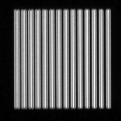

# [Confocal Lines Pattern.czi](https://zenodo.org/record/6848342/files/Confocal%20Lines%20Pattern.czi) report
 - **Autostitch** = false
 - ZeissCZIReader v6.14.0
 - ZeissQuickStartCZIReader v0.1.8-SNAPSHOT

# Images 

| Series            | Quick Start Reader | Size | Original Reader | Size | #Diffs |
|-------------------|--------------------|------|-----------------|------|--------|
| Read time (all)   |54 ms|------|52 ms|------|--------|
|0||X:1024 Y:1024 C:1 Z:1 T:1||X:1024 Y:1024 C:1 Z:1 T:1|0|

# Metadata

|  Method            | Parameters       | Quick Start Reader | Original Reader | Delta  |
| -------------------|------------------|--------------------|-----------------|------- |
| Initialization     |                  |4 ms|6 ms|        |
| Reader Size (Mb)     |                  |0.12|0.19|        |
| getStageLabelX| Image 0 | | 1: null| 2: ome.units.quantity.Length: value[-10942.2], unit[µm] stored as java.lang.Double |
| getStageLabelY| Image 0 | | 1: null| 2: ome.units.quantity.Length: value[-2472.76], unit[µm] stored as java.lang.Double |
| getStageLabelZ| Image 0 | | 1: null| 2: ome.units.quantity.Length: value[-100.449], unit[µm] stored as java.lang.Double |
| getPlaneDeltaT| Image 0 Plane 0 |  0.000 s |  1666.773 s | 1666.773 s |
| getPlanePositionX| Image 0 Plane 0 | | 1: null| 2: ome.units.quantity.Length: value[-10942.2], unit[µm] stored as java.lang.Double |
| getPlanePositionY| Image 0 Plane 0 | | 1: null| 2: ome.units.quantity.Length: value[-2472.76], unit[µm] stored as java.lang.Double |
| getPlanePositionZ| Image 0 Plane 0 | 0.000 um | -100.449 um | 100.449 um |
