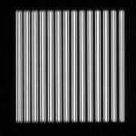

# [Confocal Lines Pattern.czi](https://zenodo.org/record/6848342/files/Confocal%20Lines%20Pattern.czi) report
 - **Autostitch** = true
 - ZeissCZIReader v6.14.0
 - ZeissQuickStartCZIReader v0.1.8-SNAPSHOT

# Images 

| Series            | Quick Start Reader | Size | Original Reader | Size | #Diffs |
|-------------------|--------------------|------|-----------------|------|--------|
| Read time (all)   |30 ms|------|39 ms|------|--------|
|0||X:1024 Y:1024 C:1 Z:1 T:1||X:1024 Y:1024 C:1 Z:1 T:1|0|

# Metadata

|  Method            | Parameters       | Quick Start Reader | Original Reader | Delta  |
| -------------------|------------------|--------------------|-----------------|------- |
| Initialization     |                  |3 ms|4 ms|        |
| Reader Size (Mb)     |                  |0.12|0.19|        |
