|  Method            | Parameters       | Quick Start Reader | Original Reader | Delta  |
| -------------------|------------------|--------------------|-----------------|------- |
| Initialization     |                  |542 ms|159 ms|        |
| Reader Size (Mb)     |                  |1.08|3.47|        |
| getStageLabelX| Image 0 | -3371.350 um | -27.045 um | 3344.305 um |
| getStageLabelY| Image 0 | 12412.780 um | 17428.300 um | 5015.520 um |
| getStageLabelName| Image 1 | Scene position #0| Scene position #1| |
| getStageLabelX| Image 1 | ome.units.quantity.Length: value[-1141.8132762518997], unit[µm] stored as java.lang.Double| ome.units.quantity.Length: value[-595], unit[reference frame] stored as java.lang.Integer| |
| getStageLabelY| Image 1 | ome.units.quantity.Length: value[12412.779536930528], unit[µm] stored as java.lang.Double| ome.units.quantity.Length: value[-2677], unit[reference frame] stored as java.lang.Integer| |
| getStageLabelZ| Image 1 |  1: ome.units.quantity.Length: value[-3825.61], unit[µm] stored as java.lang.Double| 2: null |
| getStageLabelName| Image 2 | Scene position #0| Scene position #2| |
| getStageLabelX| Image 2 | ome.units.quantity.Length: value[1085.8497161237449], unit[µm] stored as java.lang.Double| ome.units.quantity.Length: value[594], unit[reference frame] stored as java.lang.Integer| |
| getStageLabelY| Image 2 | ome.units.quantity.Length: value[12412.779536930528], unit[µm] stored as java.lang.Double| ome.units.quantity.Length: value[-2677], unit[reference frame] stored as java.lang.Integer| |
| getStageLabelZ| Image 2 |  1: ome.units.quantity.Length: value[-3825.61], unit[µm] stored as java.lang.Double| 2: null |
| getStageLabelName| Image 3 | Scene position #0| Scene position #3| |
| getStageLabelX| Image 3 | ome.units.quantity.Length: value[3315.386268627544], unit[µm] stored as java.lang.Double| ome.units.quantity.Length: value[1784], unit[reference frame] stored as java.lang.Integer| |
| getStageLabelY| Image 3 | ome.units.quantity.Length: value[12412.779536930528], unit[µm] stored as java.lang.Double| ome.units.quantity.Length: value[-2677], unit[reference frame] stored as java.lang.Integer| |
| getStageLabelZ| Image 3 |  1: ome.units.quantity.Length: value[-3825.61], unit[µm] stored as java.lang.Double| 2: null |
| getStageLabelName| Image 4 | Scene position #0| Scene position #4| |
| getStageLabelX| Image 4 | ome.units.quantity.Length: value[-3371.3498287556986], unit[µm] stored as java.lang.Double| ome.units.quantity.Length: value[-1785], unit[reference frame] stored as java.lang.Integer| |
| getStageLabelY| Image 4 | ome.units.quantity.Length: value[13846.053034968685], unit[µm] stored as java.lang.Double| ome.units.quantity.Length: value[-1912], unit[reference frame] stored as java.lang.Integer| |
| getStageLabelZ| Image 4 |  1: ome.units.quantity.Length: value[-3825.61], unit[µm] stored as java.lang.Double| 2: null |
| getStageLabelName| Image 5 | Scene position #0| Scene position #5| |
| getStageLabelX| Image 5 | ome.units.quantity.Length: value[-1141.8132762518997], unit[µm] stored as java.lang.Double| ome.units.quantity.Length: value[-595], unit[reference frame] stored as java.lang.Integer| |
| getStageLabelY| Image 5 | ome.units.quantity.Length: value[13846.053034968685], unit[µm] stored as java.lang.Double| ome.units.quantity.Length: value[-1912], unit[reference frame] stored as java.lang.Integer| |
| getStageLabelZ| Image 5 |  1: ome.units.quantity.Length: value[-3825.61], unit[µm] stored as java.lang.Double| 2: null |
| getStageLabelName| Image 6 | Scene position #0| Scene position #6| |
| getStageLabelX| Image 6 | ome.units.quantity.Length: value[1085.8497161237449], unit[µm] stored as java.lang.Double| ome.units.quantity.Length: value[594], unit[reference frame] stored as java.lang.Integer| |
| getStageLabelY| Image 6 | ome.units.quantity.Length: value[13846.053034968685], unit[µm] stored as java.lang.Double| ome.units.quantity.Length: value[-1912], unit[reference frame] stored as java.lang.Integer| |
| getStageLabelZ| Image 6 |  1: ome.units.quantity.Length: value[-3825.61], unit[µm] stored as java.lang.Double| 2: null |
| getStageLabelName| Image 7 | Scene position #0| Scene position #7| |
| getStageLabelX| Image 7 | ome.units.quantity.Length: value[3315.386268627544], unit[µm] stored as java.lang.Double| ome.units.quantity.Length: value[1784], unit[reference frame] stored as java.lang.Integer| |
| getStageLabelY| Image 7 | ome.units.quantity.Length: value[13846.053034968685], unit[µm] stored as java.lang.Double| ome.units.quantity.Length: value[-1912], unit[reference frame] stored as java.lang.Integer| |
| getStageLabelZ| Image 7 |  1: ome.units.quantity.Length: value[-3825.61], unit[µm] stored as java.lang.Double| 2: null |
| getStageLabelName| Image 8 | Scene position #0| Scene position #8| |
| getStageLabelX| Image 8 | ome.units.quantity.Length: value[-3371.3498287556986], unit[µm] stored as java.lang.Double| ome.units.quantity.Length: value[-1785], unit[reference frame] stored as java.lang.Integer| |
| getStageLabelY| Image 8 | ome.units.quantity.Length: value[15279.326533006843], unit[µm] stored as java.lang.Double| ome.units.quantity.Length: value[-1147], unit[reference frame] stored as java.lang.Integer| |
| getStageLabelZ| Image 8 |  1: ome.units.quantity.Length: value[-3825.61], unit[µm] stored as java.lang.Double| 2: null |
| getStageLabelName| Image 9 | Scene position #0| Scene position #9| |
| getStageLabelX| Image 9 | ome.units.quantity.Length: value[-1141.8132762518997], unit[µm] stored as java.lang.Double| ome.units.quantity.Length: value[-595], unit[reference frame] stored as java.lang.Integer| |
| getStageLabelY| Image 9 | ome.units.quantity.Length: value[15279.326533006843], unit[µm] stored as java.lang.Double| ome.units.quantity.Length: value[-1147], unit[reference frame] stored as java.lang.Integer| |
| getStageLabelZ| Image 9 |  1: ome.units.quantity.Length: value[-3825.61], unit[µm] stored as java.lang.Double| 2: null |
| getStageLabelName| Image 10 | Scene position #0| Scene position #10| |
| getStageLabelX| Image 10 | ome.units.quantity.Length: value[1085.8497161237449], unit[µm] stored as java.lang.Double| ome.units.quantity.Length: value[594], unit[reference frame] stored as java.lang.Integer| |
| getStageLabelY| Image 10 | ome.units.quantity.Length: value[15279.326533006843], unit[µm] stored as java.lang.Double| ome.units.quantity.Length: value[-1147], unit[reference frame] stored as java.lang.Integer| |
| getStageLabelZ| Image 10 |  1: ome.units.quantity.Length: value[-3825.61], unit[µm] stored as java.lang.Double| 2: null |
| getStageLabelName| Image 11 | Scene position #0| Scene position #11| |
| getStageLabelX| Image 11 | ome.units.quantity.Length: value[3315.386268627544], unit[µm] stored as java.lang.Double| ome.units.quantity.Length: value[1784], unit[reference frame] stored as java.lang.Integer| |
| getStageLabelY| Image 11 | ome.units.quantity.Length: value[15279.326533006843], unit[µm] stored as java.lang.Double| ome.units.quantity.Length: value[-1147], unit[reference frame] stored as java.lang.Integer| |
| getStageLabelZ| Image 11 |  1: ome.units.quantity.Length: value[-3825.61], unit[µm] stored as java.lang.Double| 2: null |
| getStageLabelName| Image 12 | Scene position #0| Scene position #12| |
| getStageLabelX| Image 12 | ome.units.quantity.Length: value[-3371.3498287556986], unit[µm] stored as java.lang.Double| ome.units.quantity.Length: value[-1785], unit[reference frame] stored as java.lang.Integer| |
| getStageLabelY| Image 12 | ome.units.quantity.Length: value[16712.600031045], unit[µm] stored as java.lang.Double| ome.units.quantity.Length: value[-382], unit[reference frame] stored as java.lang.Integer| |
| getStageLabelZ| Image 12 |  1: ome.units.quantity.Length: value[-3825.61], unit[µm] stored as java.lang.Double| 2: null |
| getStageLabelName| Image 13 | Scene position #0| Scene position #13| |
| getStageLabelX| Image 13 | ome.units.quantity.Length: value[-1141.8132762518997], unit[µm] stored as java.lang.Double| ome.units.quantity.Length: value[-595], unit[reference frame] stored as java.lang.Integer| |
| getStageLabelY| Image 13 | ome.units.quantity.Length: value[16712.600031045], unit[µm] stored as java.lang.Double| ome.units.quantity.Length: value[-382], unit[reference frame] stored as java.lang.Integer| |
| getStageLabelZ| Image 13 |  1: ome.units.quantity.Length: value[-3825.61], unit[µm] stored as java.lang.Double| 2: null |
| getStageLabelName| Image 14 | Scene position #0| Scene position #14| |
| getStageLabelX| Image 14 | ome.units.quantity.Length: value[1085.8497161237449], unit[µm] stored as java.lang.Double| ome.units.quantity.Length: value[594], unit[reference frame] stored as java.lang.Integer| |
| getStageLabelY| Image 14 | ome.units.quantity.Length: value[16712.600031045], unit[µm] stored as java.lang.Double| ome.units.quantity.Length: value[-382], unit[reference frame] stored as java.lang.Integer| |
| getStageLabelZ| Image 14 |  1: ome.units.quantity.Length: value[-3825.61], unit[µm] stored as java.lang.Double| 2: null |
| getStageLabelName| Image 15 | Scene position #0| Scene position #15| |
| getStageLabelX| Image 15 | ome.units.quantity.Length: value[3315.386268627544], unit[µm] stored as java.lang.Double| ome.units.quantity.Length: value[1784], unit[reference frame] stored as java.lang.Integer| |
| getStageLabelY| Image 15 | ome.units.quantity.Length: value[16712.600031045], unit[µm] stored as java.lang.Double| ome.units.quantity.Length: value[-382], unit[reference frame] stored as java.lang.Integer| |
| getStageLabelZ| Image 15 |  1: ome.units.quantity.Length: value[-3825.61], unit[µm] stored as java.lang.Double| 2: null |
| getStageLabelName| Image 16 | Scene position #0| Scene position #16| |
| getStageLabelX| Image 16 | ome.units.quantity.Length: value[-3371.3498287556986], unit[µm] stored as java.lang.Double| ome.units.quantity.Length: value[-1785], unit[reference frame] stored as java.lang.Integer| |
| getStageLabelY| Image 16 | ome.units.quantity.Length: value[18143.999968955], unit[µm] stored as java.lang.Double| ome.units.quantity.Length: value[382], unit[reference frame] stored as java.lang.Integer| |
| getStageLabelZ| Image 16 |  1: ome.units.quantity.Length: value[-3825.61], unit[µm] stored as java.lang.Double| 2: null |
| getStageLabelName| Image 17 | Scene position #0| Scene position #17| |
| getStageLabelX| Image 17 | ome.units.quantity.Length: value[-1141.8132762518997], unit[µm] stored as java.lang.Double| ome.units.quantity.Length: value[-595], unit[reference frame] stored as java.lang.Integer| |
| getStageLabelY| Image 17 | ome.units.quantity.Length: value[18143.999968955], unit[µm] stored as java.lang.Double| ome.units.quantity.Length: value[382], unit[reference frame] stored as java.lang.Integer| |
| getStageLabelZ| Image 17 |  1: ome.units.quantity.Length: value[-3825.61], unit[µm] stored as java.lang.Double| 2: null |
| getStageLabelName| Image 18 | Scene position #0| Scene position #18| |
| getStageLabelX| Image 18 | ome.units.quantity.Length: value[1085.8497161237449], unit[µm] stored as java.lang.Double| ome.units.quantity.Length: value[594], unit[reference frame] stored as java.lang.Integer| |
| getStageLabelY| Image 18 | ome.units.quantity.Length: value[18143.999968955], unit[µm] stored as java.lang.Double| ome.units.quantity.Length: value[382], unit[reference frame] stored as java.lang.Integer| |
| getStageLabelZ| Image 18 |  1: ome.units.quantity.Length: value[-3825.61], unit[µm] stored as java.lang.Double| 2: null |
| getStageLabelName| Image 19 | Scene position #0| Scene position #19| |
| getStageLabelX| Image 19 | ome.units.quantity.Length: value[3315.386268627544], unit[µm] stored as java.lang.Double| ome.units.quantity.Length: value[1784], unit[reference frame] stored as java.lang.Integer| |
| getStageLabelY| Image 19 | ome.units.quantity.Length: value[18143.999968955], unit[µm] stored as java.lang.Double| ome.units.quantity.Length: value[382], unit[reference frame] stored as java.lang.Integer| |
| getStageLabelZ| Image 19 |  1: ome.units.quantity.Length: value[-3825.61], unit[µm] stored as java.lang.Double| 2: null |
| getStageLabelName| Image 20 | Scene position #0| Scene position #20| |
| getStageLabelX| Image 20 | ome.units.quantity.Length: value[-3371.3498287556986], unit[µm] stored as java.lang.Double| ome.units.quantity.Length: value[-1785], unit[reference frame] stored as java.lang.Integer| |
| getStageLabelY| Image 20 | ome.units.quantity.Length: value[19577.273466993156], unit[µm] stored as java.lang.Double| ome.units.quantity.Length: value[1147], unit[reference frame] stored as java.lang.Integer| |
| getStageLabelZ| Image 20 |  1: ome.units.quantity.Length: value[-3825.61], unit[µm] stored as java.lang.Double| 2: null |
| getStageLabelName| Image 21 | Scene position #0| Scene position #21| |
| getStageLabelX| Image 21 | ome.units.quantity.Length: value[-1141.8132762518997], unit[µm] stored as java.lang.Double| ome.units.quantity.Length: value[-595], unit[reference frame] stored as java.lang.Integer| |
| getStageLabelY| Image 21 | ome.units.quantity.Length: value[19577.273466993156], unit[µm] stored as java.lang.Double| ome.units.quantity.Length: value[1147], unit[reference frame] stored as java.lang.Integer| |
| getStageLabelZ| Image 21 |  1: ome.units.quantity.Length: value[-3825.61], unit[µm] stored as java.lang.Double| 2: null |
| getStageLabelName| Image 22 | Scene position #0| Scene position #22| |
| getStageLabelX| Image 22 | ome.units.quantity.Length: value[1085.8497161237449], unit[µm] stored as java.lang.Double| ome.units.quantity.Length: value[594], unit[reference frame] stored as java.lang.Integer| |
| getStageLabelY| Image 22 | ome.units.quantity.Length: value[19577.273466993156], unit[µm] stored as java.lang.Double| ome.units.quantity.Length: value[1147], unit[reference frame] stored as java.lang.Integer| |
| getStageLabelZ| Image 22 |  1: ome.units.quantity.Length: value[-3825.61], unit[µm] stored as java.lang.Double| 2: null |
| getStageLabelName| Image 23 | Scene position #0| Scene position #23| |
| getStageLabelX| Image 23 | ome.units.quantity.Length: value[3315.386268627544], unit[µm] stored as java.lang.Double| ome.units.quantity.Length: value[1784], unit[reference frame] stored as java.lang.Integer| |
| getStageLabelY| Image 23 | ome.units.quantity.Length: value[19577.273466993156], unit[µm] stored as java.lang.Double| ome.units.quantity.Length: value[1147], unit[reference frame] stored as java.lang.Integer| |
| getStageLabelZ| Image 23 |  1: ome.units.quantity.Length: value[-3825.61], unit[µm] stored as java.lang.Double| 2: null |
| getStageLabelName| Image 24 | Scene position #0| Scene position #24| |
| getStageLabelX| Image 24 | ome.units.quantity.Length: value[-3371.3498287556986], unit[µm] stored as java.lang.Double| ome.units.quantity.Length: value[-1785], unit[reference frame] stored as java.lang.Integer| |
| getStageLabelY| Image 24 | ome.units.quantity.Length: value[21010.546965031313], unit[µm] stored as java.lang.Double| ome.units.quantity.Length: value[1912], unit[reference frame] stored as java.lang.Integer| |
| getStageLabelZ| Image 24 |  1: ome.units.quantity.Length: value[-3825.61], unit[µm] stored as java.lang.Double| 2: null |
| getStageLabelName| Image 25 | Scene position #0| Scene position #25| |
| getStageLabelX| Image 25 | ome.units.quantity.Length: value[-1141.8132762518997], unit[µm] stored as java.lang.Double| ome.units.quantity.Length: value[-595], unit[reference frame] stored as java.lang.Integer| |
| getStageLabelY| Image 25 | ome.units.quantity.Length: value[21010.546965031313], unit[µm] stored as java.lang.Double| ome.units.quantity.Length: value[1912], unit[reference frame] stored as java.lang.Integer| |
| getStageLabelZ| Image 25 |  1: ome.units.quantity.Length: value[-3825.61], unit[µm] stored as java.lang.Double| 2: null |
| getStageLabelName| Image 26 | Scene position #0| Scene position #26| |
| getStageLabelX| Image 26 | ome.units.quantity.Length: value[1085.8497161237449], unit[µm] stored as java.lang.Double| ome.units.quantity.Length: value[594], unit[reference frame] stored as java.lang.Integer| |
| getStageLabelY| Image 26 | ome.units.quantity.Length: value[21010.546965031313], unit[µm] stored as java.lang.Double| ome.units.quantity.Length: value[1912], unit[reference frame] stored as java.lang.Integer| |
| getStageLabelZ| Image 26 |  1: ome.units.quantity.Length: value[-3825.61], unit[µm] stored as java.lang.Double| 2: null |
| getStageLabelName| Image 27 | Scene position #0| Scene position #27| |
| getStageLabelX| Image 27 | ome.units.quantity.Length: value[3315.386268627544], unit[µm] stored as java.lang.Double| ome.units.quantity.Length: value[1784], unit[reference frame] stored as java.lang.Integer| |
| getStageLabelY| Image 27 | ome.units.quantity.Length: value[21010.546965031313], unit[µm] stored as java.lang.Double| ome.units.quantity.Length: value[1912], unit[reference frame] stored as java.lang.Integer| |
| getStageLabelZ| Image 27 |  1: ome.units.quantity.Length: value[-3825.61], unit[µm] stored as java.lang.Double| 2: null |
| getStageLabelName| Image 28 | Scene position #0| Scene position #28| |
| getStageLabelX| Image 28 | ome.units.quantity.Length: value[-3371.3498287556986], unit[µm] stored as java.lang.Double| ome.units.quantity.Length: value[-1785], unit[reference frame] stored as java.lang.Integer| |
| getStageLabelY| Image 28 | ome.units.quantity.Length: value[22443.82046306947], unit[µm] stored as java.lang.Double| ome.units.quantity.Length: value[2677], unit[reference frame] stored as java.lang.Integer| |
| getStageLabelZ| Image 28 |  1: ome.units.quantity.Length: value[-3825.61], unit[µm] stored as java.lang.Double| 2: null |
| getStageLabelName| Image 29 | Scene position #0| Scene position #29| |
| getStageLabelX| Image 29 | ome.units.quantity.Length: value[-1141.8132762518997], unit[µm] stored as java.lang.Double| ome.units.quantity.Length: value[-595], unit[reference frame] stored as java.lang.Integer| |
| getStageLabelY| Image 29 | ome.units.quantity.Length: value[22443.82046306947], unit[µm] stored as java.lang.Double| ome.units.quantity.Length: value[2677], unit[reference frame] stored as java.lang.Integer| |
| getStageLabelZ| Image 29 |  1: ome.units.quantity.Length: value[-3825.61], unit[µm] stored as java.lang.Double| 2: null |
| getStageLabelName| Image 30 | Scene position #0| Scene position #30| |
| getStageLabelX| Image 30 | ome.units.quantity.Length: value[1085.8497161237449], unit[µm] stored as java.lang.Double| ome.units.quantity.Length: value[594], unit[reference frame] stored as java.lang.Integer| |
| getStageLabelY| Image 30 | ome.units.quantity.Length: value[22443.82046306947], unit[µm] stored as java.lang.Double| ome.units.quantity.Length: value[2677], unit[reference frame] stored as java.lang.Integer| |
| getStageLabelZ| Image 30 |  1: ome.units.quantity.Length: value[-3825.61], unit[µm] stored as java.lang.Double| 2: null |
| getStageLabelName| Image 31 | Scene position #0| Scene position #31| |
| getStageLabelX| Image 31 | ome.units.quantity.Length: value[3315.386268627544], unit[µm] stored as java.lang.Double| ome.units.quantity.Length: value[1784], unit[reference frame] stored as java.lang.Integer| |
| getStageLabelY| Image 31 | ome.units.quantity.Length: value[22443.82046306947], unit[µm] stored as java.lang.Double| ome.units.quantity.Length: value[2677], unit[reference frame] stored as java.lang.Integer| |
| getStageLabelZ| Image 31 |  1: ome.units.quantity.Length: value[-3825.61], unit[µm] stored as java.lang.Double| 2: null |
| getPlanePositionX| Image 0 Plane 0 | -3371.350 um | -27.045 um | 3344.305 um |
| getPlanePositionY| Image 0 Plane 0 | 12412.780 um | 17428.300 um | 5015.520 um |
| getPlanePositionX| Image 0 Plane 1 | -3371.350 um | -27.045 um | 3344.305 um |
| getPlanePositionY| Image 0 Plane 1 | 12412.780 um | 17428.300 um | 5015.520 um |
| getPlanePositionX| Image 0 Plane 2 | -3371.350 um | -27.045 um | 3344.305 um |
| getPlanePositionY| Image 0 Plane 2 | 12412.780 um | 17428.300 um | 5015.520 um |
| getPlanePositionX| Image 0 Plane 3 | -3371.350 um | -27.045 um | 3344.305 um |
| getPlanePositionY| Image 0 Plane 3 | 12412.780 um | 17428.300 um | 5015.520 um |
| getPlanePositionX| Image 0 Plane 4 | -3371.350 um | -27.045 um | 3344.305 um |
| getPlanePositionY| Image 0 Plane 4 | 12412.780 um | 17428.300 um | 5015.520 um |
| getPlanePositionX| Image 0 Plane 5 | -3371.350 um | -27.045 um | 3344.305 um |
| getPlanePositionY| Image 0 Plane 5 | 12412.780 um | 17428.300 um | 5015.520 um |
| getPlanePositionX| Image 0 Plane 6 | -3371.350 um | -27.045 um | 3344.305 um |
| getPlanePositionY| Image 0 Plane 6 | 12412.780 um | 17428.300 um | 5015.520 um |
| getPlanePositionX| Image 0 Plane 7 | -3371.350 um | -27.045 um | 3344.305 um |
| getPlanePositionY| Image 0 Plane 7 | 12412.780 um | 17428.300 um | 5015.520 um |
| getPlanePositionX| Image 0 Plane 8 | -3371.350 um | -27.045 um | 3344.305 um |
| getPlanePositionY| Image 0 Plane 8 | 12412.780 um | 17428.300 um | 5015.520 um |
| getPlanePositionX| Image 0 Plane 9 | -3371.350 um | -27.045 um | 3344.305 um |
| getPlanePositionY| Image 0 Plane 9 | 12412.780 um | 17428.300 um | 5015.520 um |
| getPlanePositionX| Image 0 Plane 10 | -3371.350 um | -27.045 um | 3344.305 um |
| getPlanePositionY| Image 0 Plane 10 | 12412.780 um | 17428.300 um | 5015.520 um |
| getPlanePositionX| Image 0 Plane 11 | -3371.350 um | -27.045 um | 3344.305 um |
| getPlanePositionY| Image 0 Plane 11 | 12412.780 um | 17428.300 um | 5015.520 um |
| getPlanePositionX| Image 0 Plane 12 | -3371.350 um | -27.045 um | 3344.305 um |
| getPlanePositionY| Image 0 Plane 12 | 12412.780 um | 17428.300 um | 5015.520 um |
| getPlanePositionX| Image 0 Plane 13 | -3371.350 um | -27.045 um | 3344.305 um |
| getPlanePositionY| Image 0 Plane 13 | 12412.780 um | 17428.300 um | 5015.520 um |
| getPlanePositionX| Image 0 Plane 14 | -3371.350 um | -27.045 um | 3344.305 um |
| getPlanePositionY| Image 0 Plane 14 | 12412.780 um | 17428.300 um | 5015.520 um |
| getPlanePositionX| Image 0 Plane 15 | -3371.350 um | -27.045 um | 3344.305 um |
| getPlanePositionY| Image 0 Plane 15 | 12412.780 um | 17428.300 um | 5015.520 um |
| getPlanePositionX| Image 0 Plane 16 | -3371.350 um | -27.045 um | 3344.305 um |
| getPlanePositionY| Image 0 Plane 16 | 12412.780 um | 17428.300 um | 5015.520 um |
| getPlanePositionX| Image 0 Plane 17 | -3371.350 um | -27.045 um | 3344.305 um |
| getPlanePositionY| Image 0 Plane 17 | 12412.780 um | 17428.300 um | 5015.520 um |
| getPlanePositionX| Image 0 Plane 18 | -3371.350 um | -27.045 um | 3344.305 um |
| getPlanePositionY| Image 0 Plane 18 | 12412.780 um | 17428.300 um | 5015.520 um |
| getPlanePositionX| Image 0 Plane 19 | -3371.350 um | -27.045 um | 3344.305 um |
| getPlanePositionY| Image 0 Plane 19 | 12412.780 um | 17428.300 um | 5015.520 um |
| getPlanePositionX| Image 0 Plane 20 | -3371.350 um | -27.045 um | 3344.305 um |
| getPlanePositionY| Image 0 Plane 20 | 12412.780 um | 17428.300 um | 5015.520 um |
| getPlanePositionX| Image 0 Plane 21 | -3371.350 um | -27.045 um | 3344.305 um |
| getPlanePositionY| Image 0 Plane 21 | 12412.780 um | 17428.300 um | 5015.520 um |
| getPlanePositionX| Image 0 Plane 22 | -3371.350 um | -27.045 um | 3344.305 um |
| getPlanePositionY| Image 0 Plane 22 | 12412.780 um | 17428.300 um | 5015.520 um |
| getPlanePositionX| Image 0 Plane 23 | -3371.350 um | -27.045 um | 3344.305 um |
| getPlanePositionY| Image 0 Plane 23 | 12412.780 um | 17428.300 um | 5015.520 um |
| getPlanePositionX| Image 0 Plane 24 | -3371.350 um | -27.045 um | 3344.305 um |
| getPlanePositionY| Image 0 Plane 24 | 12412.780 um | 17428.300 um | 5015.520 um |
| getPlanePositionX| Image 0 Plane 25 | -3371.350 um | -27.045 um | 3344.305 um |
| getPlanePositionY| Image 0 Plane 25 | 12412.780 um | 17428.300 um | 5015.520 um |
| getPlanePositionX| Image 0 Plane 26 | -3371.350 um | -27.045 um | 3344.305 um |
| getPlanePositionY| Image 0 Plane 26 | 12412.780 um | 17428.300 um | 5015.520 um |
| getPlanePositionX| Image 0 Plane 27 | -3371.350 um | -27.045 um | 3344.305 um |
| getPlanePositionY| Image 0 Plane 27 | 12412.780 um | 17428.300 um | 5015.520 um |
| getPlanePositionX| Image 0 Plane 28 | -3371.350 um | -27.045 um | 3344.305 um |
| getPlanePositionY| Image 0 Plane 28 | 12412.780 um | 17428.300 um | 5015.520 um |
| getPlanePositionX| Image 0 Plane 29 | -3371.350 um | -27.045 um | 3344.305 um |
| getPlanePositionY| Image 0 Plane 29 | 12412.780 um | 17428.300 um | 5015.520 um |
| getPlanePositionX| Image 0 Plane 30 | -3371.350 um | -27.045 um | 3344.305 um |
| getPlanePositionY| Image 0 Plane 30 | 12412.780 um | 17428.300 um | 5015.520 um |
| getPlanePositionX| Image 0 Plane 31 | -3371.350 um | -27.045 um | 3344.305 um |
| getPlanePositionY| Image 0 Plane 31 | 12412.780 um | 17428.300 um | 5015.520 um |
| getPlanePositionX| Image 0 Plane 32 | -3371.350 um | -27.045 um | 3344.305 um |
| getPlanePositionY| Image 0 Plane 32 | 12412.780 um | 17428.300 um | 5015.520 um |
| getPlanePositionX| Image 0 Plane 33 | -3371.350 um | -27.045 um | 3344.305 um |
| getPlanePositionY| Image 0 Plane 33 | 12412.780 um | 17428.300 um | 5015.520 um |
| getPlanePositionX| Image 0 Plane 34 | -3371.350 um | -27.045 um | 3344.305 um |
| getPlanePositionY| Image 0 Plane 34 | 12412.780 um | 17428.300 um | 5015.520 um |
| getPlanePositionX| Image 0 Plane 35 | -3371.350 um | -27.045 um | 3344.305 um |
| getPlanePositionY| Image 0 Plane 35 | 12412.780 um | 17428.300 um | 5015.520 um |
| getPlanePositionX| Image 0 Plane 36 | -3371.350 um | -27.045 um | 3344.305 um |
| getPlanePositionY| Image 0 Plane 36 | 12412.780 um | 17428.300 um | 5015.520 um |
| getPlanePositionX| Image 0 Plane 37 | -3371.350 um | -27.045 um | 3344.305 um |
| getPlanePositionY| Image 0 Plane 37 | 12412.780 um | 17428.300 um | 5015.520 um |
| getPlanePositionX| Image 0 Plane 38 | -3371.350 um | -27.045 um | 3344.305 um |
| getPlanePositionY| Image 0 Plane 38 | 12412.780 um | 17428.300 um | 5015.520 um |
| getPlanePositionX| Image 0 Plane 39 | -3371.350 um | -27.045 um | 3344.305 um |
| getPlanePositionY| Image 0 Plane 39 | 12412.780 um | 17428.300 um | 5015.520 um |
| getPlanePositionX| Image 0 Plane 40 | -3371.350 um | -27.045 um | 3344.305 um |
| getPlanePositionY| Image 0 Plane 40 | 12412.780 um | 17428.300 um | 5015.520 um |
| getPlanePositionX| Image 0 Plane 41 | -3371.350 um | -27.045 um | 3344.305 um |
| getPlanePositionY| Image 0 Plane 41 | 12412.780 um | 17428.300 um | 5015.520 um |
| getPlanePositionX| Image 0 Plane 42 | -3371.350 um | -27.045 um | 3344.305 um |
| getPlanePositionY| Image 0 Plane 42 | 12412.780 um | 17428.300 um | 5015.520 um |
| getPlanePositionX| Image 0 Plane 43 | -3371.350 um | -27.045 um | 3344.305 um |
| getPlanePositionY| Image 0 Plane 43 | 12412.780 um | 17428.300 um | 5015.520 um |
| getPlanePositionX| Image 0 Plane 44 | -3371.350 um | -27.045 um | 3344.305 um |
| getPlanePositionY| Image 0 Plane 44 | 12412.780 um | 17428.300 um | 5015.520 um |
| getPlanePositionX| Image 0 Plane 45 | -3371.350 um | -27.045 um | 3344.305 um |
| getPlanePositionY| Image 0 Plane 45 | 12412.780 um | 17428.300 um | 5015.520 um |
| getPlanePositionX| Image 0 Plane 46 | -3371.350 um | -27.045 um | 3344.305 um |
| getPlanePositionY| Image 0 Plane 46 | 12412.780 um | 17428.300 um | 5015.520 um |
| getPlanePositionX| Image 0 Plane 47 | -3371.350 um | -27.045 um | 3344.305 um |
| getPlanePositionY| Image 0 Plane 47 | 12412.780 um | 17428.300 um | 5015.520 um |
| getPlanePositionX| Image 0 Plane 48 | -3371.350 um | -27.045 um | 3344.305 um |
| getPlanePositionY| Image 0 Plane 48 | 12412.780 um | 17428.300 um | 5015.520 um |
| getPlanePositionX| Image 0 Plane 49 | -3371.350 um | -27.045 um | 3344.305 um |
| getPlanePositionY| Image 0 Plane 49 | 12412.780 um | 17428.300 um | 5015.520 um |
| getPlanePositionX| Image 0 Plane 50 | -3371.350 um | -27.045 um | 3344.305 um |
| getPlanePositionY| Image 0 Plane 50 | 12412.780 um | 17428.300 um | 5015.520 um |
| getPlanePositionX| Image 0 Plane 51 | -3371.350 um | -27.045 um | 3344.305 um |
| getPlanePositionY| Image 0 Plane 51 | 12412.780 um | 17428.300 um | 5015.520 um |
| getPlanePositionX| Image 0 Plane 52 | -3371.350 um | -27.045 um | 3344.305 um |
| getPlanePositionY| Image 0 Plane 52 | 12412.780 um | 17428.300 um | 5015.520 um |
| getPlanePositionX| Image 0 Plane 53 | -3371.350 um | -27.045 um | 3344.305 um |
| getPlanePositionY| Image 0 Plane 53 | 12412.780 um | 17428.300 um | 5015.520 um |
| getPlanePositionX| Image 0 Plane 54 | -3371.350 um | -27.045 um | 3344.305 um |
| getPlanePositionY| Image 0 Plane 54 | 12412.780 um | 17428.300 um | 5015.520 um |
| getPlanePositionX| Image 0 Plane 55 | -3371.350 um | -27.045 um | 3344.305 um |
| getPlanePositionY| Image 0 Plane 55 | 12412.780 um | 17428.300 um | 5015.520 um |
| getPlanePositionX| Image 1 Plane 0 | ome.units.quantity.Length: value[-1141.8132762518997], unit[µm] stored as java.lang.Double| ome.units.quantity.Length: value[-595], unit[reference frame] stored as java.lang.Integer| |
| getPlanePositionY| Image 1 Plane 0 | ome.units.quantity.Length: value[12412.779536930528], unit[µm] stored as java.lang.Double| ome.units.quantity.Length: value[-2677], unit[reference frame] stored as java.lang.Integer| |
| getPlanePositionZ| Image 1 Plane 0 |  1: ome.units.quantity.Length: value[-3825.61], unit[µm] stored as java.lang.Double| 2: null |
| getPlanePositionX| Image 1 Plane 1 | ome.units.quantity.Length: value[-1141.8132762518997], unit[µm] stored as java.lang.Double| ome.units.quantity.Length: value[-595], unit[reference frame] stored as java.lang.Integer| |
| getPlanePositionY| Image 1 Plane 1 | ome.units.quantity.Length: value[12412.779536930528], unit[µm] stored as java.lang.Double| ome.units.quantity.Length: value[-2677], unit[reference frame] stored as java.lang.Integer| |
| getPlanePositionZ| Image 1 Plane 1 |  1: ome.units.quantity.Length: value[-3725.61], unit[µm] stored as java.lang.Double| 2: null |
| getPlanePositionX| Image 1 Plane 2 | ome.units.quantity.Length: value[-1141.8132762518997], unit[µm] stored as java.lang.Double| ome.units.quantity.Length: value[-595], unit[reference frame] stored as java.lang.Integer| |
| getPlanePositionY| Image 1 Plane 2 | ome.units.quantity.Length: value[12412.779536930528], unit[µm] stored as java.lang.Double| ome.units.quantity.Length: value[-2677], unit[reference frame] stored as java.lang.Integer| |
| getPlanePositionZ| Image 1 Plane 2 |  1: ome.units.quantity.Length: value[-3625.61], unit[µm] stored as java.lang.Double| 2: null |
| getPlanePositionX| Image 1 Plane 3 | ome.units.quantity.Length: value[-1141.8132762518997], unit[µm] stored as java.lang.Double| ome.units.quantity.Length: value[-595], unit[reference frame] stored as java.lang.Integer| |
| getPlanePositionY| Image 1 Plane 3 | ome.units.quantity.Length: value[12412.779536930528], unit[µm] stored as java.lang.Double| ome.units.quantity.Length: value[-2677], unit[reference frame] stored as java.lang.Integer| |
| getPlanePositionZ| Image 1 Plane 3 |  1: ome.units.quantity.Length: value[-3525.61], unit[µm] stored as java.lang.Double| 2: null |
| getPlanePositionX| Image 1 Plane 4 | ome.units.quantity.Length: value[-1141.8132762518997], unit[µm] stored as java.lang.Double| ome.units.quantity.Length: value[-595], unit[reference frame] stored as java.lang.Integer| |
| getPlanePositionY| Image 1 Plane 4 | ome.units.quantity.Length: value[12412.779536930528], unit[µm] stored as java.lang.Double| ome.units.quantity.Length: value[-2677], unit[reference frame] stored as java.lang.Integer| |
| getPlanePositionZ| Image 1 Plane 4 |  1: ome.units.quantity.Length: value[-3425.61], unit[µm] stored as java.lang.Double| 2: null |
| getPlanePositionX| Image 1 Plane 5 | ome.units.quantity.Length: value[-1141.8132762518997], unit[µm] stored as java.lang.Double| ome.units.quantity.Length: value[-595], unit[reference frame] stored as java.lang.Integer| |
| getPlanePositionY| Image 1 Plane 5 | ome.units.quantity.Length: value[12412.779536930528], unit[µm] stored as java.lang.Double| ome.units.quantity.Length: value[-2677], unit[reference frame] stored as java.lang.Integer| |
| getPlanePositionZ| Image 1 Plane 5 |  1: ome.units.quantity.Length: value[-3325.61], unit[µm] stored as java.lang.Double| 2: null |
| getPlanePositionX| Image 1 Plane 6 | ome.units.quantity.Length: value[-1141.8132762518997], unit[µm] stored as java.lang.Double| ome.units.quantity.Length: value[-595], unit[reference frame] stored as java.lang.Integer| |
| getPlanePositionY| Image 1 Plane 6 | ome.units.quantity.Length: value[12412.779536930528], unit[µm] stored as java.lang.Double| ome.units.quantity.Length: value[-2677], unit[reference frame] stored as java.lang.Integer| |
| getPlanePositionZ| Image 1 Plane 6 |  1: ome.units.quantity.Length: value[-3225.61], unit[µm] stored as java.lang.Double| 2: null |
| getPlanePositionX| Image 1 Plane 7 | ome.units.quantity.Length: value[-1141.8132762518997], unit[µm] stored as java.lang.Double| ome.units.quantity.Length: value[-595], unit[reference frame] stored as java.lang.Integer| |
| getPlanePositionY| Image 1 Plane 7 | ome.units.quantity.Length: value[12412.779536930528], unit[µm] stored as java.lang.Double| ome.units.quantity.Length: value[-2677], unit[reference frame] stored as java.lang.Integer| |
| getPlanePositionZ| Image 1 Plane 7 |  1: ome.units.quantity.Length: value[-3125.61], unit[µm] stored as java.lang.Double| 2: null |
| getPlanePositionX| Image 1 Plane 8 | ome.units.quantity.Length: value[-1141.8132762518997], unit[µm] stored as java.lang.Double| ome.units.quantity.Length: value[-595], unit[reference frame] stored as java.lang.Integer| |
| getPlanePositionY| Image 1 Plane 8 | ome.units.quantity.Length: value[12412.779536930528], unit[µm] stored as java.lang.Double| ome.units.quantity.Length: value[-2677], unit[reference frame] stored as java.lang.Integer| |
| getPlanePositionZ| Image 1 Plane 8 |  1: ome.units.quantity.Length: value[-3025.61], unit[µm] stored as java.lang.Double| 2: null |
| getPlanePositionX| Image 1 Plane 9 | ome.units.quantity.Length: value[-1141.8132762518997], unit[µm] stored as java.lang.Double| ome.units.quantity.Length: value[-595], unit[reference frame] stored as java.lang.Integer| |
| getPlanePositionY| Image 1 Plane 9 | ome.units.quantity.Length: value[12412.779536930528], unit[µm] stored as java.lang.Double| ome.units.quantity.Length: value[-2677], unit[reference frame] stored as java.lang.Integer| |
| getPlanePositionZ| Image 1 Plane 9 |  1: ome.units.quantity.Length: value[-2925.61], unit[µm] stored as java.lang.Double| 2: null |
| getPlanePositionX| Image 1 Plane 10 | ome.units.quantity.Length: value[-1141.8132762518997], unit[µm] stored as java.lang.Double| ome.units.quantity.Length: value[-595], unit[reference frame] stored as java.lang.Integer| |
| getPlanePositionY| Image 1 Plane 10 | ome.units.quantity.Length: value[12412.779536930528], unit[µm] stored as java.lang.Double| ome.units.quantity.Length: value[-2677], unit[reference frame] stored as java.lang.Integer| |
| getPlanePositionZ| Image 1 Plane 10 |  1: ome.units.quantity.Length: value[-2825.61], unit[µm] stored as java.lang.Double| 2: null |
| getPlanePositionX| Image 1 Plane 11 | ome.units.quantity.Length: value[-1141.8132762518997], unit[µm] stored as java.lang.Double| ome.units.quantity.Length: value[-595], unit[reference frame] stored as java.lang.Integer| |
| getPlanePositionY| Image 1 Plane 11 | ome.units.quantity.Length: value[12412.779536930528], unit[µm] stored as java.lang.Double| ome.units.quantity.Length: value[-2677], unit[reference frame] stored as java.lang.Integer| |
| getPlanePositionZ| Image 1 Plane 11 |  1: ome.units.quantity.Length: value[-2725.6100000000006], unit[µm] stored as java.lang.Double| 2: null |
| getPlanePositionX| Image 1 Plane 12 | ome.units.quantity.Length: value[-1141.8132762518997], unit[µm] stored as java.lang.Double| ome.units.quantity.Length: value[-595], unit[reference frame] stored as java.lang.Integer| |
| getPlanePositionY| Image 1 Plane 12 | ome.units.quantity.Length: value[12412.779536930528], unit[µm] stored as java.lang.Double| ome.units.quantity.Length: value[-2677], unit[reference frame] stored as java.lang.Integer| |
| getPlanePositionZ| Image 1 Plane 12 |  1: ome.units.quantity.Length: value[-2625.6100000000006], unit[µm] stored as java.lang.Double| 2: null |
| getPlanePositionX| Image 1 Plane 13 | ome.units.quantity.Length: value[-1141.8132762518997], unit[µm] stored as java.lang.Double| ome.units.quantity.Length: value[-595], unit[reference frame] stored as java.lang.Integer| |
| getPlanePositionY| Image 1 Plane 13 | ome.units.quantity.Length: value[12412.779536930528], unit[µm] stored as java.lang.Double| ome.units.quantity.Length: value[-2677], unit[reference frame] stored as java.lang.Integer| |
| getPlanePositionZ| Image 1 Plane 13 |  1: ome.units.quantity.Length: value[-2525.6100000000006], unit[µm] stored as java.lang.Double| 2: null |
| getPlanePositionX| Image 1 Plane 14 | ome.units.quantity.Length: value[-1141.8132762518997], unit[µm] stored as java.lang.Double| ome.units.quantity.Length: value[-595], unit[reference frame] stored as java.lang.Integer| |
| getPlanePositionY| Image 1 Plane 14 | ome.units.quantity.Length: value[12412.779536930528], unit[µm] stored as java.lang.Double| ome.units.quantity.Length: value[-2677], unit[reference frame] stored as java.lang.Integer| |
| getPlanePositionZ| Image 1 Plane 14 |  1: ome.units.quantity.Length: value[-2425.6100000000006], unit[µm] stored as java.lang.Double| 2: null |
| getPlanePositionX| Image 1 Plane 15 | ome.units.quantity.Length: value[-1141.8132762518997], unit[µm] stored as java.lang.Double| ome.units.quantity.Length: value[-595], unit[reference frame] stored as java.lang.Integer| |
| getPlanePositionY| Image 1 Plane 15 | ome.units.quantity.Length: value[12412.779536930528], unit[µm] stored as java.lang.Double| ome.units.quantity.Length: value[-2677], unit[reference frame] stored as java.lang.Integer| |
| getPlanePositionZ| Image 1 Plane 15 |  1: ome.units.quantity.Length: value[-2325.6100000000006], unit[µm] stored as java.lang.Double| 2: null |
| getPlanePositionX| Image 1 Plane 16 | ome.units.quantity.Length: value[-1141.8132762518997], unit[µm] stored as java.lang.Double| ome.units.quantity.Length: value[-595], unit[reference frame] stored as java.lang.Integer| |
| getPlanePositionY| Image 1 Plane 16 | ome.units.quantity.Length: value[12412.779536930528], unit[µm] stored as java.lang.Double| ome.units.quantity.Length: value[-2677], unit[reference frame] stored as java.lang.Integer| |
| getPlanePositionZ| Image 1 Plane 16 |  1: ome.units.quantity.Length: value[-2225.6100000000006], unit[µm] stored as java.lang.Double| 2: null |
| getPlanePositionX| Image 1 Plane 17 | ome.units.quantity.Length: value[-1141.8132762518997], unit[µm] stored as java.lang.Double| ome.units.quantity.Length: value[-595], unit[reference frame] stored as java.lang.Integer| |
| getPlanePositionY| Image 1 Plane 17 | ome.units.quantity.Length: value[12412.779536930528], unit[µm] stored as java.lang.Double| ome.units.quantity.Length: value[-2677], unit[reference frame] stored as java.lang.Integer| |
| getPlanePositionZ| Image 1 Plane 17 |  1: ome.units.quantity.Length: value[-2125.6100000000006], unit[µm] stored as java.lang.Double| 2: null |
| getPlanePositionX| Image 1 Plane 18 | ome.units.quantity.Length: value[-1141.8132762518997], unit[µm] stored as java.lang.Double| ome.units.quantity.Length: value[-595], unit[reference frame] stored as java.lang.Integer| |
| getPlanePositionY| Image 1 Plane 18 | ome.units.quantity.Length: value[12412.779536930528], unit[µm] stored as java.lang.Double| ome.units.quantity.Length: value[-2677], unit[reference frame] stored as java.lang.Integer| |
| getPlanePositionZ| Image 1 Plane 18 |  1: ome.units.quantity.Length: value[-2025.6100000000004], unit[µm] stored as java.lang.Double| 2: null |
| getPlanePositionX| Image 1 Plane 19 | ome.units.quantity.Length: value[-1141.8132762518997], unit[µm] stored as java.lang.Double| ome.units.quantity.Length: value[-595], unit[reference frame] stored as java.lang.Integer| |
| getPlanePositionY| Image 1 Plane 19 | ome.units.quantity.Length: value[12412.779536930528], unit[µm] stored as java.lang.Double| ome.units.quantity.Length: value[-2677], unit[reference frame] stored as java.lang.Integer| |
| getPlanePositionZ| Image 1 Plane 19 |  1: ome.units.quantity.Length: value[-1925.6100000000004], unit[µm] stored as java.lang.Double| 2: null |
| getPlanePositionX| Image 1 Plane 20 | ome.units.quantity.Length: value[-1141.8132762518997], unit[µm] stored as java.lang.Double| ome.units.quantity.Length: value[-595], unit[reference frame] stored as java.lang.Integer| |
| getPlanePositionY| Image 1 Plane 20 | ome.units.quantity.Length: value[12412.779536930528], unit[µm] stored as java.lang.Double| ome.units.quantity.Length: value[-2677], unit[reference frame] stored as java.lang.Integer| |
| getPlanePositionZ| Image 1 Plane 20 |  1: ome.units.quantity.Length: value[-1825.6100000000004], unit[µm] stored as java.lang.Double| 2: null |
| getPlanePositionX| Image 1 Plane 21 | ome.units.quantity.Length: value[-1141.8132762518997], unit[µm] stored as java.lang.Double| ome.units.quantity.Length: value[-595], unit[reference frame] stored as java.lang.Integer| |
| getPlanePositionY| Image 1 Plane 21 | ome.units.quantity.Length: value[12412.779536930528], unit[µm] stored as java.lang.Double| ome.units.quantity.Length: value[-2677], unit[reference frame] stored as java.lang.Integer| |
| getPlanePositionZ| Image 1 Plane 21 |  1: ome.units.quantity.Length: value[-1725.6100000000006], unit[µm] stored as java.lang.Double| 2: null |
| getPlanePositionX| Image 1 Plane 22 | ome.units.quantity.Length: value[-1141.8132762518997], unit[µm] stored as java.lang.Double| ome.units.quantity.Length: value[-595], unit[reference frame] stored as java.lang.Integer| |
| getPlanePositionY| Image 1 Plane 22 | ome.units.quantity.Length: value[12412.779536930528], unit[µm] stored as java.lang.Double| ome.units.quantity.Length: value[-2677], unit[reference frame] stored as java.lang.Integer| |
| getPlanePositionZ| Image 1 Plane 22 |  1: ome.units.quantity.Length: value[-1625.6100000000006], unit[µm] stored as java.lang.Double| 2: null |
| getPlanePositionX| Image 1 Plane 23 | ome.units.quantity.Length: value[-1141.8132762518997], unit[µm] stored as java.lang.Double| ome.units.quantity.Length: value[-595], unit[reference frame] stored as java.lang.Integer| |
| getPlanePositionY| Image 1 Plane 23 | ome.units.quantity.Length: value[12412.779536930528], unit[µm] stored as java.lang.Double| ome.units.quantity.Length: value[-2677], unit[reference frame] stored as java.lang.Integer| |
| getPlanePositionZ| Image 1 Plane 23 |  1: ome.units.quantity.Length: value[-1525.6100000000006], unit[µm] stored as java.lang.Double| 2: null |
| getPlanePositionX| Image 1 Plane 24 | ome.units.quantity.Length: value[-1141.8132762518997], unit[µm] stored as java.lang.Double| ome.units.quantity.Length: value[-595], unit[reference frame] stored as java.lang.Integer| |
| getPlanePositionY| Image 1 Plane 24 | ome.units.quantity.Length: value[12412.779536930528], unit[µm] stored as java.lang.Double| ome.units.quantity.Length: value[-2677], unit[reference frame] stored as java.lang.Integer| |
| getPlanePositionZ| Image 1 Plane 24 |  1: ome.units.quantity.Length: value[-1425.6100000000006], unit[µm] stored as java.lang.Double| 2: null |
| getPlanePositionX| Image 1 Plane 25 | ome.units.quantity.Length: value[-1141.8132762518997], unit[µm] stored as java.lang.Double| ome.units.quantity.Length: value[-595], unit[reference frame] stored as java.lang.Integer| |
| getPlanePositionY| Image 1 Plane 25 | ome.units.quantity.Length: value[12412.779536930528], unit[µm] stored as java.lang.Double| ome.units.quantity.Length: value[-2677], unit[reference frame] stored as java.lang.Integer| |
| getPlanePositionZ| Image 1 Plane 25 |  1: ome.units.quantity.Length: value[-1325.6100000000006], unit[µm] stored as java.lang.Double| 2: null |
| getPlanePositionX| Image 1 Plane 26 | ome.units.quantity.Length: value[-1141.8132762518997], unit[µm] stored as java.lang.Double| ome.units.quantity.Length: value[-595], unit[reference frame] stored as java.lang.Integer| |
| getPlanePositionY| Image 1 Plane 26 | ome.units.quantity.Length: value[12412.779536930528], unit[µm] stored as java.lang.Double| ome.units.quantity.Length: value[-2677], unit[reference frame] stored as java.lang.Integer| |
| getPlanePositionZ| Image 1 Plane 26 |  1: ome.units.quantity.Length: value[-1225.6100000000006], unit[µm] stored as java.lang.Double| 2: null |
| getPlanePositionX| Image 1 Plane 27 | ome.units.quantity.Length: value[-1141.8132762518997], unit[µm] stored as java.lang.Double| ome.units.quantity.Length: value[-595], unit[reference frame] stored as java.lang.Integer| |
| getPlanePositionY| Image 1 Plane 27 | ome.units.quantity.Length: value[12412.779536930528], unit[µm] stored as java.lang.Double| ome.units.quantity.Length: value[-2677], unit[reference frame] stored as java.lang.Integer| |
| getPlanePositionZ| Image 1 Plane 27 |  1: ome.units.quantity.Length: value[-1125.6100000000006], unit[µm] stored as java.lang.Double| 2: null |
| getPlanePositionX| Image 1 Plane 28 | ome.units.quantity.Length: value[-1141.8132762518997], unit[µm] stored as java.lang.Double| ome.units.quantity.Length: value[-595], unit[reference frame] stored as java.lang.Integer| |
| getPlanePositionY| Image 1 Plane 28 | ome.units.quantity.Length: value[12412.779536930528], unit[µm] stored as java.lang.Double| ome.units.quantity.Length: value[-2677], unit[reference frame] stored as java.lang.Integer| |
| getPlanePositionZ| Image 1 Plane 28 |  1: ome.units.quantity.Length: value[-1025.6100000000006], unit[µm] stored as java.lang.Double| 2: null |
| getPlanePositionX| Image 1 Plane 29 | ome.units.quantity.Length: value[-1141.8132762518997], unit[µm] stored as java.lang.Double| ome.units.quantity.Length: value[-595], unit[reference frame] stored as java.lang.Integer| |
| getPlanePositionY| Image 1 Plane 29 | ome.units.quantity.Length: value[12412.779536930528], unit[µm] stored as java.lang.Double| ome.units.quantity.Length: value[-2677], unit[reference frame] stored as java.lang.Integer| |
| getPlanePositionZ| Image 1 Plane 29 |  1: ome.units.quantity.Length: value[-925.6100000000006], unit[µm] stored as java.lang.Double| 2: null |
| getPlanePositionX| Image 1 Plane 30 | ome.units.quantity.Length: value[-1141.8132762518997], unit[µm] stored as java.lang.Double| ome.units.quantity.Length: value[-595], unit[reference frame] stored as java.lang.Integer| |
| getPlanePositionY| Image 1 Plane 30 | ome.units.quantity.Length: value[12412.779536930528], unit[µm] stored as java.lang.Double| ome.units.quantity.Length: value[-2677], unit[reference frame] stored as java.lang.Integer| |
| getPlanePositionZ| Image 1 Plane 30 |  1: ome.units.quantity.Length: value[-825.6100000000006], unit[µm] stored as java.lang.Double| 2: null |
| getPlanePositionX| Image 1 Plane 31 | ome.units.quantity.Length: value[-1141.8132762518997], unit[µm] stored as java.lang.Double| ome.units.quantity.Length: value[-595], unit[reference frame] stored as java.lang.Integer| |
| getPlanePositionY| Image 1 Plane 31 | ome.units.quantity.Length: value[12412.779536930528], unit[µm] stored as java.lang.Double| ome.units.quantity.Length: value[-2677], unit[reference frame] stored as java.lang.Integer| |
| getPlanePositionZ| Image 1 Plane 31 |  1: ome.units.quantity.Length: value[-725.6100000000006], unit[µm] stored as java.lang.Double| 2: null |
| getPlanePositionX| Image 1 Plane 32 | ome.units.quantity.Length: value[-1141.8132762518997], unit[µm] stored as java.lang.Double| ome.units.quantity.Length: value[-595], unit[reference frame] stored as java.lang.Integer| |
| getPlanePositionY| Image 1 Plane 32 | ome.units.quantity.Length: value[12412.779536930528], unit[µm] stored as java.lang.Double| ome.units.quantity.Length: value[-2677], unit[reference frame] stored as java.lang.Integer| |
| getPlanePositionZ| Image 1 Plane 32 |  1: ome.units.quantity.Length: value[-625.6100000000006], unit[µm] stored as java.lang.Double| 2: null |
| getPlanePositionX| Image 1 Plane 33 | ome.units.quantity.Length: value[-1141.8132762518997], unit[µm] stored as java.lang.Double| ome.units.quantity.Length: value[-595], unit[reference frame] stored as java.lang.Integer| |
| getPlanePositionY| Image 1 Plane 33 | ome.units.quantity.Length: value[12412.779536930528], unit[µm] stored as java.lang.Double| ome.units.quantity.Length: value[-2677], unit[reference frame] stored as java.lang.Integer| |
| getPlanePositionZ| Image 1 Plane 33 |  1: ome.units.quantity.Length: value[-525.6100000000006], unit[µm] stored as java.lang.Double| 2: null |
| getPlanePositionX| Image 1 Plane 34 | ome.units.quantity.Length: value[-1141.8132762518997], unit[µm] stored as java.lang.Double| ome.units.quantity.Length: value[-595], unit[reference frame] stored as java.lang.Integer| |
| getPlanePositionY| Image 1 Plane 34 | ome.units.quantity.Length: value[12412.779536930528], unit[µm] stored as java.lang.Double| ome.units.quantity.Length: value[-2677], unit[reference frame] stored as java.lang.Integer| |
| getPlanePositionZ| Image 1 Plane 34 |  1: ome.units.quantity.Length: value[-425.6100000000006], unit[µm] stored as java.lang.Double| 2: null |
| getPlanePositionX| Image 1 Plane 35 | ome.units.quantity.Length: value[-1141.8132762518997], unit[µm] stored as java.lang.Double| ome.units.quantity.Length: value[-595], unit[reference frame] stored as java.lang.Integer| |
| getPlanePositionY| Image 1 Plane 35 | ome.units.quantity.Length: value[12412.779536930528], unit[µm] stored as java.lang.Double| ome.units.quantity.Length: value[-2677], unit[reference frame] stored as java.lang.Integer| |
| getPlanePositionZ| Image 1 Plane 35 |  1: ome.units.quantity.Length: value[-325.6100000000006], unit[µm] stored as java.lang.Double| 2: null |
| getPlanePositionX| Image 1 Plane 36 | ome.units.quantity.Length: value[-1141.8132762518997], unit[µm] stored as java.lang.Double| ome.units.quantity.Length: value[-595], unit[reference frame] stored as java.lang.Integer| |
| getPlanePositionY| Image 1 Plane 36 | ome.units.quantity.Length: value[12412.779536930528], unit[µm] stored as java.lang.Double| ome.units.quantity.Length: value[-2677], unit[reference frame] stored as java.lang.Integer| |
| getPlanePositionZ| Image 1 Plane 36 |  1: ome.units.quantity.Length: value[-225.61000000000058], unit[µm] stored as java.lang.Double| 2: null |
| getPlanePositionX| Image 1 Plane 37 | ome.units.quantity.Length: value[-1141.8132762518997], unit[µm] stored as java.lang.Double| ome.units.quantity.Length: value[-595], unit[reference frame] stored as java.lang.Integer| |
| getPlanePositionY| Image 1 Plane 37 | ome.units.quantity.Length: value[12412.779536930528], unit[µm] stored as java.lang.Double| ome.units.quantity.Length: value[-2677], unit[reference frame] stored as java.lang.Integer| |
| getPlanePositionZ| Image 1 Plane 37 |  1: ome.units.quantity.Length: value[-125.61000000000058], unit[µm] stored as java.lang.Double| 2: null |
| getPlanePositionX| Image 1 Plane 38 | ome.units.quantity.Length: value[-1141.8132762518997], unit[µm] stored as java.lang.Double| ome.units.quantity.Length: value[-595], unit[reference frame] stored as java.lang.Integer| |
| getPlanePositionY| Image 1 Plane 38 | ome.units.quantity.Length: value[12412.779536930528], unit[µm] stored as java.lang.Double| ome.units.quantity.Length: value[-2677], unit[reference frame] stored as java.lang.Integer| |
| getPlanePositionZ| Image 1 Plane 38 |  1: ome.units.quantity.Length: value[-25.610000000000582], unit[µm] stored as java.lang.Double| 2: null |
| getPlanePositionX| Image 1 Plane 39 | ome.units.quantity.Length: value[-1141.8132762518997], unit[µm] stored as java.lang.Double| ome.units.quantity.Length: value[-595], unit[reference frame] stored as java.lang.Integer| |
| getPlanePositionY| Image 1 Plane 39 | ome.units.quantity.Length: value[12412.779536930528], unit[µm] stored as java.lang.Double| ome.units.quantity.Length: value[-2677], unit[reference frame] stored as java.lang.Integer| |
| getPlanePositionZ| Image 1 Plane 39 |  1: ome.units.quantity.Length: value[74.38999999999942], unit[µm] stored as java.lang.Double| 2: null |
| getPlanePositionX| Image 1 Plane 40 | ome.units.quantity.Length: value[-1141.8132762518997], unit[µm] stored as java.lang.Double| ome.units.quantity.Length: value[-595], unit[reference frame] stored as java.lang.Integer| |
| getPlanePositionY| Image 1 Plane 40 | ome.units.quantity.Length: value[12412.779536930528], unit[µm] stored as java.lang.Double| ome.units.quantity.Length: value[-2677], unit[reference frame] stored as java.lang.Integer| |
| getPlanePositionZ| Image 1 Plane 40 |  1: ome.units.quantity.Length: value[174.38999999999942], unit[µm] stored as java.lang.Double| 2: null |
| getPlanePositionX| Image 1 Plane 41 | ome.units.quantity.Length: value[-1141.8132762518997], unit[µm] stored as java.lang.Double| ome.units.quantity.Length: value[-595], unit[reference frame] stored as java.lang.Integer| |
| getPlanePositionY| Image 1 Plane 41 | ome.units.quantity.Length: value[12412.779536930528], unit[µm] stored as java.lang.Double| ome.units.quantity.Length: value[-2677], unit[reference frame] stored as java.lang.Integer| |
| getPlanePositionZ| Image 1 Plane 41 |  1: ome.units.quantity.Length: value[274.38999999999896], unit[µm] stored as java.lang.Double| 2: null |
| getPlanePositionX| Image 1 Plane 42 | ome.units.quantity.Length: value[-1141.8132762518997], unit[µm] stored as java.lang.Double| ome.units.quantity.Length: value[-595], unit[reference frame] stored as java.lang.Integer| |
| getPlanePositionY| Image 1 Plane 42 | ome.units.quantity.Length: value[12412.779536930528], unit[µm] stored as java.lang.Double| ome.units.quantity.Length: value[-2677], unit[reference frame] stored as java.lang.Integer| |
| getPlanePositionZ| Image 1 Plane 42 |  1: ome.units.quantity.Length: value[374.38999999999896], unit[µm] stored as java.lang.Double| 2: null |
| getPlanePositionX| Image 1 Plane 43 | ome.units.quantity.Length: value[-1141.8132762518997], unit[µm] stored as java.lang.Double| ome.units.quantity.Length: value[-595], unit[reference frame] stored as java.lang.Integer| |
| getPlanePositionY| Image 1 Plane 43 | ome.units.quantity.Length: value[12412.779536930528], unit[µm] stored as java.lang.Double| ome.units.quantity.Length: value[-2677], unit[reference frame] stored as java.lang.Integer| |
| getPlanePositionZ| Image 1 Plane 43 |  1: ome.units.quantity.Length: value[474.38999999999896], unit[µm] stored as java.lang.Double| 2: null |
| getPlanePositionX| Image 1 Plane 44 | ome.units.quantity.Length: value[-1141.8132762518997], unit[µm] stored as java.lang.Double| ome.units.quantity.Length: value[-595], unit[reference frame] stored as java.lang.Integer| |
| getPlanePositionY| Image 1 Plane 44 | ome.units.quantity.Length: value[12412.779536930528], unit[µm] stored as java.lang.Double| ome.units.quantity.Length: value[-2677], unit[reference frame] stored as java.lang.Integer| |
| getPlanePositionZ| Image 1 Plane 44 |  1: ome.units.quantity.Length: value[574.389999999999], unit[µm] stored as java.lang.Double| 2: null |
| getPlanePositionX| Image 1 Plane 45 | ome.units.quantity.Length: value[-1141.8132762518997], unit[µm] stored as java.lang.Double| ome.units.quantity.Length: value[-595], unit[reference frame] stored as java.lang.Integer| |
| getPlanePositionY| Image 1 Plane 45 | ome.units.quantity.Length: value[12412.779536930528], unit[µm] stored as java.lang.Double| ome.units.quantity.Length: value[-2677], unit[reference frame] stored as java.lang.Integer| |
| getPlanePositionZ| Image 1 Plane 45 |  1: ome.units.quantity.Length: value[674.389999999999], unit[µm] stored as java.lang.Double| 2: null |
| getPlanePositionX| Image 1 Plane 46 | ome.units.quantity.Length: value[-1141.8132762518997], unit[µm] stored as java.lang.Double| ome.units.quantity.Length: value[-595], unit[reference frame] stored as java.lang.Integer| |
| getPlanePositionY| Image 1 Plane 46 | ome.units.quantity.Length: value[12412.779536930528], unit[µm] stored as java.lang.Double| ome.units.quantity.Length: value[-2677], unit[reference frame] stored as java.lang.Integer| |
| getPlanePositionZ| Image 1 Plane 46 |  1: ome.units.quantity.Length: value[774.389999999999], unit[µm] stored as java.lang.Double| 2: null |
| getPlanePositionX| Image 1 Plane 47 | ome.units.quantity.Length: value[-1141.8132762518997], unit[µm] stored as java.lang.Double| ome.units.quantity.Length: value[-595], unit[reference frame] stored as java.lang.Integer| |
| getPlanePositionY| Image 1 Plane 47 | ome.units.quantity.Length: value[12412.779536930528], unit[µm] stored as java.lang.Double| ome.units.quantity.Length: value[-2677], unit[reference frame] stored as java.lang.Integer| |
| getPlanePositionZ| Image 1 Plane 47 |  1: ome.units.quantity.Length: value[874.389999999999], unit[µm] stored as java.lang.Double| 2: null |
| getPlanePositionX| Image 1 Plane 48 | ome.units.quantity.Length: value[-1141.8132762518997], unit[µm] stored as java.lang.Double| ome.units.quantity.Length: value[-595], unit[reference frame] stored as java.lang.Integer| |
| getPlanePositionY| Image 1 Plane 48 | ome.units.quantity.Length: value[12412.779536930528], unit[µm] stored as java.lang.Double| ome.units.quantity.Length: value[-2677], unit[reference frame] stored as java.lang.Integer| |
| getPlanePositionZ| Image 1 Plane 48 |  1: ome.units.quantity.Length: value[974.389999999999], unit[µm] stored as java.lang.Double| 2: null |
| getPlanePositionX| Image 1 Plane 49 | ome.units.quantity.Length: value[-1141.8132762518997], unit[µm] stored as java.lang.Double| ome.units.quantity.Length: value[-595], unit[reference frame] stored as java.lang.Integer| |
| getPlanePositionY| Image 1 Plane 49 | ome.units.quantity.Length: value[12412.779536930528], unit[µm] stored as java.lang.Double| ome.units.quantity.Length: value[-2677], unit[reference frame] stored as java.lang.Integer| |
| getPlanePositionZ| Image 1 Plane 49 |  1: ome.units.quantity.Length: value[1074.389999999999], unit[µm] stored as java.lang.Double| 2: null |
| getPlanePositionX| Image 1 Plane 50 | ome.units.quantity.Length: value[-1141.8132762518997], unit[µm] stored as java.lang.Double| ome.units.quantity.Length: value[-595], unit[reference frame] stored as java.lang.Integer| |
| getPlanePositionY| Image 1 Plane 50 | ome.units.quantity.Length: value[12412.779536930528], unit[µm] stored as java.lang.Double| ome.units.quantity.Length: value[-2677], unit[reference frame] stored as java.lang.Integer| |
| getPlanePositionZ| Image 1 Plane 50 |  1: ome.units.quantity.Length: value[1174.389999999999], unit[µm] stored as java.lang.Double| 2: null |
| getPlanePositionX| Image 1 Plane 51 | ome.units.quantity.Length: value[-1141.8132762518997], unit[µm] stored as java.lang.Double| ome.units.quantity.Length: value[-595], unit[reference frame] stored as java.lang.Integer| |
| getPlanePositionY| Image 1 Plane 51 | ome.units.quantity.Length: value[12412.779536930528], unit[µm] stored as java.lang.Double| ome.units.quantity.Length: value[-2677], unit[reference frame] stored as java.lang.Integer| |
| getPlanePositionZ| Image 1 Plane 51 |  1: ome.units.quantity.Length: value[1274.389999999999], unit[µm] stored as java.lang.Double| 2: null |
| getPlanePositionX| Image 1 Plane 52 | ome.units.quantity.Length: value[-1141.8132762518997], unit[µm] stored as java.lang.Double| ome.units.quantity.Length: value[-595], unit[reference frame] stored as java.lang.Integer| |
| getPlanePositionY| Image 1 Plane 52 | ome.units.quantity.Length: value[12412.779536930528], unit[µm] stored as java.lang.Double| ome.units.quantity.Length: value[-2677], unit[reference frame] stored as java.lang.Integer| |
| getPlanePositionZ| Image 1 Plane 52 |  1: ome.units.quantity.Length: value[1374.389999999999], unit[µm] stored as java.lang.Double| 2: null |
| getPlanePositionX| Image 1 Plane 53 | ome.units.quantity.Length: value[-1141.8132762518997], unit[µm] stored as java.lang.Double| ome.units.quantity.Length: value[-595], unit[reference frame] stored as java.lang.Integer| |
| getPlanePositionY| Image 1 Plane 53 | ome.units.quantity.Length: value[12412.779536930528], unit[µm] stored as java.lang.Double| ome.units.quantity.Length: value[-2677], unit[reference frame] stored as java.lang.Integer| |
| getPlanePositionZ| Image 1 Plane 53 |  1: ome.units.quantity.Length: value[1474.389999999999], unit[µm] stored as java.lang.Double| 2: null |
| getPlanePositionX| Image 1 Plane 54 | ome.units.quantity.Length: value[-1141.8132762518997], unit[µm] stored as java.lang.Double| ome.units.quantity.Length: value[-595], unit[reference frame] stored as java.lang.Integer| |
| getPlanePositionY| Image 1 Plane 54 | ome.units.quantity.Length: value[12412.779536930528], unit[µm] stored as java.lang.Double| ome.units.quantity.Length: value[-2677], unit[reference frame] stored as java.lang.Integer| |
| getPlanePositionZ| Image 1 Plane 54 |  1: ome.units.quantity.Length: value[1574.389999999999], unit[µm] stored as java.lang.Double| 2: null |
| getPlanePositionX| Image 1 Plane 55 | ome.units.quantity.Length: value[-1141.8132762518997], unit[µm] stored as java.lang.Double| ome.units.quantity.Length: value[-595], unit[reference frame] stored as java.lang.Integer| |
| getPlanePositionY| Image 1 Plane 55 | ome.units.quantity.Length: value[12412.779536930528], unit[µm] stored as java.lang.Double| ome.units.quantity.Length: value[-2677], unit[reference frame] stored as java.lang.Integer| |
| getPlanePositionZ| Image 1 Plane 55 |  1: ome.units.quantity.Length: value[1674.389999999999], unit[µm] stored as java.lang.Double| 2: null |
| getPlanePositionX| Image 2 Plane 0 | ome.units.quantity.Length: value[1085.8497161237449], unit[µm] stored as java.lang.Double| ome.units.quantity.Length: value[594], unit[reference frame] stored as java.lang.Integer| |
| getPlanePositionY| Image 2 Plane 0 | ome.units.quantity.Length: value[12412.779536930528], unit[µm] stored as java.lang.Double| ome.units.quantity.Length: value[-2677], unit[reference frame] stored as java.lang.Integer| |
| getPlanePositionZ| Image 2 Plane 0 |  1: ome.units.quantity.Length: value[-3825.61], unit[µm] stored as java.lang.Double| 2: null |
| getPlanePositionX| Image 2 Plane 1 | ome.units.quantity.Length: value[1085.8497161237449], unit[µm] stored as java.lang.Double| ome.units.quantity.Length: value[594], unit[reference frame] stored as java.lang.Integer| |
| getPlanePositionY| Image 2 Plane 1 | ome.units.quantity.Length: value[12412.779536930528], unit[µm] stored as java.lang.Double| ome.units.quantity.Length: value[-2677], unit[reference frame] stored as java.lang.Integer| |
| getPlanePositionZ| Image 2 Plane 1 |  1: ome.units.quantity.Length: value[-3725.61], unit[µm] stored as java.lang.Double| 2: null |
| getPlanePositionX| Image 2 Plane 2 | ome.units.quantity.Length: value[1085.8497161237449], unit[µm] stored as java.lang.Double| ome.units.quantity.Length: value[594], unit[reference frame] stored as java.lang.Integer| |
| getPlanePositionY| Image 2 Plane 2 | ome.units.quantity.Length: value[12412.779536930528], unit[µm] stored as java.lang.Double| ome.units.quantity.Length: value[-2677], unit[reference frame] stored as java.lang.Integer| |
| getPlanePositionZ| Image 2 Plane 2 |  1: ome.units.quantity.Length: value[-3625.61], unit[µm] stored as java.lang.Double| 2: null |
| getPlanePositionX| Image 2 Plane 3 | ome.units.quantity.Length: value[1085.8497161237449], unit[µm] stored as java.lang.Double| ome.units.quantity.Length: value[594], unit[reference frame] stored as java.lang.Integer| |
| getPlanePositionY| Image 2 Plane 3 | ome.units.quantity.Length: value[12412.779536930528], unit[µm] stored as java.lang.Double| ome.units.quantity.Length: value[-2677], unit[reference frame] stored as java.lang.Integer| |
| getPlanePositionZ| Image 2 Plane 3 |  1: ome.units.quantity.Length: value[-3525.61], unit[µm] stored as java.lang.Double| 2: null |
| getPlanePositionX| Image 2 Plane 4 | ome.units.quantity.Length: value[1085.8497161237449], unit[µm] stored as java.lang.Double| ome.units.quantity.Length: value[594], unit[reference frame] stored as java.lang.Integer| |
| getPlanePositionY| Image 2 Plane 4 | ome.units.quantity.Length: value[12412.779536930528], unit[µm] stored as java.lang.Double| ome.units.quantity.Length: value[-2677], unit[reference frame] stored as java.lang.Integer| |
| getPlanePositionZ| Image 2 Plane 4 |  1: ome.units.quantity.Length: value[-3425.61], unit[µm] stored as java.lang.Double| 2: null |
| getPlanePositionX| Image 2 Plane 5 | ome.units.quantity.Length: value[1085.8497161237449], unit[µm] stored as java.lang.Double| ome.units.quantity.Length: value[594], unit[reference frame] stored as java.lang.Integer| |
| getPlanePositionY| Image 2 Plane 5 | ome.units.quantity.Length: value[12412.779536930528], unit[µm] stored as java.lang.Double| ome.units.quantity.Length: value[-2677], unit[reference frame] stored as java.lang.Integer| |
| getPlanePositionZ| Image 2 Plane 5 |  1: ome.units.quantity.Length: value[-3325.61], unit[µm] stored as java.lang.Double| 2: null |
| getPlanePositionX| Image 2 Plane 6 | ome.units.quantity.Length: value[1085.8497161237449], unit[µm] stored as java.lang.Double| ome.units.quantity.Length: value[594], unit[reference frame] stored as java.lang.Integer| |
| getPlanePositionY| Image 2 Plane 6 | ome.units.quantity.Length: value[12412.779536930528], unit[µm] stored as java.lang.Double| ome.units.quantity.Length: value[-2677], unit[reference frame] stored as java.lang.Integer| |
| getPlanePositionZ| Image 2 Plane 6 |  1: ome.units.quantity.Length: value[-3225.61], unit[µm] stored as java.lang.Double| 2: null |
| getPlanePositionX| Image 2 Plane 7 | ome.units.quantity.Length: value[1085.8497161237449], unit[µm] stored as java.lang.Double| ome.units.quantity.Length: value[594], unit[reference frame] stored as java.lang.Integer| |
| getPlanePositionY| Image 2 Plane 7 | ome.units.quantity.Length: value[12412.779536930528], unit[µm] stored as java.lang.Double| ome.units.quantity.Length: value[-2677], unit[reference frame] stored as java.lang.Integer| |
| getPlanePositionZ| Image 2 Plane 7 |  1: ome.units.quantity.Length: value[-3125.61], unit[µm] stored as java.lang.Double| 2: null |
| getPlanePositionX| Image 2 Plane 8 | ome.units.quantity.Length: value[1085.8497161237449], unit[µm] stored as java.lang.Double| ome.units.quantity.Length: value[594], unit[reference frame] stored as java.lang.Integer| |
| getPlanePositionY| Image 2 Plane 8 | ome.units.quantity.Length: value[12412.779536930528], unit[µm] stored as java.lang.Double| ome.units.quantity.Length: value[-2677], unit[reference frame] stored as java.lang.Integer| |
| getPlanePositionZ| Image 2 Plane 8 |  1: ome.units.quantity.Length: value[-3025.61], unit[µm] stored as java.lang.Double| 2: null |
| getPlanePositionX| Image 2 Plane 9 | ome.units.quantity.Length: value[1085.8497161237449], unit[µm] stored as java.lang.Double| ome.units.quantity.Length: value[594], unit[reference frame] stored as java.lang.Integer| |
| getPlanePositionY| Image 2 Plane 9 | ome.units.quantity.Length: value[12412.779536930528], unit[µm] stored as java.lang.Double| ome.units.quantity.Length: value[-2677], unit[reference frame] stored as java.lang.Integer| |
| getPlanePositionZ| Image 2 Plane 9 |  1: ome.units.quantity.Length: value[-2925.61], unit[µm] stored as java.lang.Double| 2: null |
| getPlanePositionX| Image 2 Plane 10 | ome.units.quantity.Length: value[1085.8497161237449], unit[µm] stored as java.lang.Double| ome.units.quantity.Length: value[594], unit[reference frame] stored as java.lang.Integer| |
| getPlanePositionY| Image 2 Plane 10 | ome.units.quantity.Length: value[12412.779536930528], unit[µm] stored as java.lang.Double| ome.units.quantity.Length: value[-2677], unit[reference frame] stored as java.lang.Integer| |
| getPlanePositionZ| Image 2 Plane 10 |  1: ome.units.quantity.Length: value[-2825.61], unit[µm] stored as java.lang.Double| 2: null |
| getPlanePositionX| Image 2 Plane 11 | ome.units.quantity.Length: value[1085.8497161237449], unit[µm] stored as java.lang.Double| ome.units.quantity.Length: value[594], unit[reference frame] stored as java.lang.Integer| |
| getPlanePositionY| Image 2 Plane 11 | ome.units.quantity.Length: value[12412.779536930528], unit[µm] stored as java.lang.Double| ome.units.quantity.Length: value[-2677], unit[reference frame] stored as java.lang.Integer| |
| getPlanePositionZ| Image 2 Plane 11 |  1: ome.units.quantity.Length: value[-2725.6100000000006], unit[µm] stored as java.lang.Double| 2: null |
| getPlanePositionX| Image 2 Plane 12 | ome.units.quantity.Length: value[1085.8497161237449], unit[µm] stored as java.lang.Double| ome.units.quantity.Length: value[594], unit[reference frame] stored as java.lang.Integer| |
| getPlanePositionY| Image 2 Plane 12 | ome.units.quantity.Length: value[12412.779536930528], unit[µm] stored as java.lang.Double| ome.units.quantity.Length: value[-2677], unit[reference frame] stored as java.lang.Integer| |
| getPlanePositionZ| Image 2 Plane 12 |  1: ome.units.quantity.Length: value[-2625.6100000000006], unit[µm] stored as java.lang.Double| 2: null |
| getPlanePositionX| Image 2 Plane 13 | ome.units.quantity.Length: value[1085.8497161237449], unit[µm] stored as java.lang.Double| ome.units.quantity.Length: value[594], unit[reference frame] stored as java.lang.Integer| |
| getPlanePositionY| Image 2 Plane 13 | ome.units.quantity.Length: value[12412.779536930528], unit[µm] stored as java.lang.Double| ome.units.quantity.Length: value[-2677], unit[reference frame] stored as java.lang.Integer| |
| getPlanePositionZ| Image 2 Plane 13 |  1: ome.units.quantity.Length: value[-2525.6100000000006], unit[µm] stored as java.lang.Double| 2: null |
| getPlanePositionX| Image 2 Plane 14 | ome.units.quantity.Length: value[1085.8497161237449], unit[µm] stored as java.lang.Double| ome.units.quantity.Length: value[594], unit[reference frame] stored as java.lang.Integer| |
| getPlanePositionY| Image 2 Plane 14 | ome.units.quantity.Length: value[12412.779536930528], unit[µm] stored as java.lang.Double| ome.units.quantity.Length: value[-2677], unit[reference frame] stored as java.lang.Integer| |
| getPlanePositionZ| Image 2 Plane 14 |  1: ome.units.quantity.Length: value[-2425.6100000000006], unit[µm] stored as java.lang.Double| 2: null |
| getPlanePositionX| Image 2 Plane 15 | ome.units.quantity.Length: value[1085.8497161237449], unit[µm] stored as java.lang.Double| ome.units.quantity.Length: value[594], unit[reference frame] stored as java.lang.Integer| |
| getPlanePositionY| Image 2 Plane 15 | ome.units.quantity.Length: value[12412.779536930528], unit[µm] stored as java.lang.Double| ome.units.quantity.Length: value[-2677], unit[reference frame] stored as java.lang.Integer| |
| getPlanePositionZ| Image 2 Plane 15 |  1: ome.units.quantity.Length: value[-2325.6100000000006], unit[µm] stored as java.lang.Double| 2: null |
| getPlanePositionX| Image 2 Plane 16 | ome.units.quantity.Length: value[1085.8497161237449], unit[µm] stored as java.lang.Double| ome.units.quantity.Length: value[594], unit[reference frame] stored as java.lang.Integer| |
| getPlanePositionY| Image 2 Plane 16 | ome.units.quantity.Length: value[12412.779536930528], unit[µm] stored as java.lang.Double| ome.units.quantity.Length: value[-2677], unit[reference frame] stored as java.lang.Integer| |
| getPlanePositionZ| Image 2 Plane 16 |  1: ome.units.quantity.Length: value[-2225.6100000000006], unit[µm] stored as java.lang.Double| 2: null |
| getPlanePositionX| Image 2 Plane 17 | ome.units.quantity.Length: value[1085.8497161237449], unit[µm] stored as java.lang.Double| ome.units.quantity.Length: value[594], unit[reference frame] stored as java.lang.Integer| |
| getPlanePositionY| Image 2 Plane 17 | ome.units.quantity.Length: value[12412.779536930528], unit[µm] stored as java.lang.Double| ome.units.quantity.Length: value[-2677], unit[reference frame] stored as java.lang.Integer| |
| getPlanePositionZ| Image 2 Plane 17 |  1: ome.units.quantity.Length: value[-2125.6100000000006], unit[µm] stored as java.lang.Double| 2: null |
| getPlanePositionX| Image 2 Plane 18 | ome.units.quantity.Length: value[1085.8497161237449], unit[µm] stored as java.lang.Double| ome.units.quantity.Length: value[594], unit[reference frame] stored as java.lang.Integer| |
| getPlanePositionY| Image 2 Plane 18 | ome.units.quantity.Length: value[12412.779536930528], unit[µm] stored as java.lang.Double| ome.units.quantity.Length: value[-2677], unit[reference frame] stored as java.lang.Integer| |
| getPlanePositionZ| Image 2 Plane 18 |  1: ome.units.quantity.Length: value[-2025.6100000000004], unit[µm] stored as java.lang.Double| 2: null |
| getPlanePositionX| Image 2 Plane 19 | ome.units.quantity.Length: value[1085.8497161237449], unit[µm] stored as java.lang.Double| ome.units.quantity.Length: value[594], unit[reference frame] stored as java.lang.Integer| |
| getPlanePositionY| Image 2 Plane 19 | ome.units.quantity.Length: value[12412.779536930528], unit[µm] stored as java.lang.Double| ome.units.quantity.Length: value[-2677], unit[reference frame] stored as java.lang.Integer| |
| getPlanePositionZ| Image 2 Plane 19 |  1: ome.units.quantity.Length: value[-1925.6100000000004], unit[µm] stored as java.lang.Double| 2: null |
| getPlanePositionX| Image 2 Plane 20 | ome.units.quantity.Length: value[1085.8497161237449], unit[µm] stored as java.lang.Double| ome.units.quantity.Length: value[594], unit[reference frame] stored as java.lang.Integer| |
| getPlanePositionY| Image 2 Plane 20 | ome.units.quantity.Length: value[12412.779536930528], unit[µm] stored as java.lang.Double| ome.units.quantity.Length: value[-2677], unit[reference frame] stored as java.lang.Integer| |
| getPlanePositionZ| Image 2 Plane 20 |  1: ome.units.quantity.Length: value[-1825.6100000000004], unit[µm] stored as java.lang.Double| 2: null |
| getPlanePositionX| Image 2 Plane 21 | ome.units.quantity.Length: value[1085.8497161237449], unit[µm] stored as java.lang.Double| ome.units.quantity.Length: value[594], unit[reference frame] stored as java.lang.Integer| |
| getPlanePositionY| Image 2 Plane 21 | ome.units.quantity.Length: value[12412.779536930528], unit[µm] stored as java.lang.Double| ome.units.quantity.Length: value[-2677], unit[reference frame] stored as java.lang.Integer| |
| getPlanePositionZ| Image 2 Plane 21 |  1: ome.units.quantity.Length: value[-1725.6100000000006], unit[µm] stored as java.lang.Double| 2: null |
| getPlanePositionX| Image 2 Plane 22 | ome.units.quantity.Length: value[1085.8497161237449], unit[µm] stored as java.lang.Double| ome.units.quantity.Length: value[594], unit[reference frame] stored as java.lang.Integer| |
| getPlanePositionY| Image 2 Plane 22 | ome.units.quantity.Length: value[12412.779536930528], unit[µm] stored as java.lang.Double| ome.units.quantity.Length: value[-2677], unit[reference frame] stored as java.lang.Integer| |
| getPlanePositionZ| Image 2 Plane 22 |  1: ome.units.quantity.Length: value[-1625.6100000000006], unit[µm] stored as java.lang.Double| 2: null |
| getPlanePositionX| Image 2 Plane 23 | ome.units.quantity.Length: value[1085.8497161237449], unit[µm] stored as java.lang.Double| ome.units.quantity.Length: value[594], unit[reference frame] stored as java.lang.Integer| |
| getPlanePositionY| Image 2 Plane 23 | ome.units.quantity.Length: value[12412.779536930528], unit[µm] stored as java.lang.Double| ome.units.quantity.Length: value[-2677], unit[reference frame] stored as java.lang.Integer| |
| getPlanePositionZ| Image 2 Plane 23 |  1: ome.units.quantity.Length: value[-1525.6100000000006], unit[µm] stored as java.lang.Double| 2: null |
| getPlanePositionX| Image 2 Plane 24 | ome.units.quantity.Length: value[1085.8497161237449], unit[µm] stored as java.lang.Double| ome.units.quantity.Length: value[594], unit[reference frame] stored as java.lang.Integer| |
| getPlanePositionY| Image 2 Plane 24 | ome.units.quantity.Length: value[12412.779536930528], unit[µm] stored as java.lang.Double| ome.units.quantity.Length: value[-2677], unit[reference frame] stored as java.lang.Integer| |
| getPlanePositionZ| Image 2 Plane 24 |  1: ome.units.quantity.Length: value[-1425.6100000000006], unit[µm] stored as java.lang.Double| 2: null |
| getPlanePositionX| Image 2 Plane 25 | ome.units.quantity.Length: value[1085.8497161237449], unit[µm] stored as java.lang.Double| ome.units.quantity.Length: value[594], unit[reference frame] stored as java.lang.Integer| |
| getPlanePositionY| Image 2 Plane 25 | ome.units.quantity.Length: value[12412.779536930528], unit[µm] stored as java.lang.Double| ome.units.quantity.Length: value[-2677], unit[reference frame] stored as java.lang.Integer| |
| getPlanePositionZ| Image 2 Plane 25 |  1: ome.units.quantity.Length: value[-1325.6100000000006], unit[µm] stored as java.lang.Double| 2: null |
| getPlanePositionX| Image 2 Plane 26 | ome.units.quantity.Length: value[1085.8497161237449], unit[µm] stored as java.lang.Double| ome.units.quantity.Length: value[594], unit[reference frame] stored as java.lang.Integer| |
| getPlanePositionY| Image 2 Plane 26 | ome.units.quantity.Length: value[12412.779536930528], unit[µm] stored as java.lang.Double| ome.units.quantity.Length: value[-2677], unit[reference frame] stored as java.lang.Integer| |
| getPlanePositionZ| Image 2 Plane 26 |  1: ome.units.quantity.Length: value[-1225.6100000000006], unit[µm] stored as java.lang.Double| 2: null |
| getPlanePositionX| Image 2 Plane 27 | ome.units.quantity.Length: value[1085.8497161237449], unit[µm] stored as java.lang.Double| ome.units.quantity.Length: value[594], unit[reference frame] stored as java.lang.Integer| |
| getPlanePositionY| Image 2 Plane 27 | ome.units.quantity.Length: value[12412.779536930528], unit[µm] stored as java.lang.Double| ome.units.quantity.Length: value[-2677], unit[reference frame] stored as java.lang.Integer| |
| getPlanePositionZ| Image 2 Plane 27 |  1: ome.units.quantity.Length: value[-1125.6100000000006], unit[µm] stored as java.lang.Double| 2: null |
| getPlanePositionX| Image 2 Plane 28 | ome.units.quantity.Length: value[1085.8497161237449], unit[µm] stored as java.lang.Double| ome.units.quantity.Length: value[594], unit[reference frame] stored as java.lang.Integer| |
| getPlanePositionY| Image 2 Plane 28 | ome.units.quantity.Length: value[12412.779536930528], unit[µm] stored as java.lang.Double| ome.units.quantity.Length: value[-2677], unit[reference frame] stored as java.lang.Integer| |
| getPlanePositionZ| Image 2 Plane 28 |  1: ome.units.quantity.Length: value[-1025.6100000000006], unit[µm] stored as java.lang.Double| 2: null |
| getPlanePositionX| Image 2 Plane 29 | ome.units.quantity.Length: value[1085.8497161237449], unit[µm] stored as java.lang.Double| ome.units.quantity.Length: value[594], unit[reference frame] stored as java.lang.Integer| |
| getPlanePositionY| Image 2 Plane 29 | ome.units.quantity.Length: value[12412.779536930528], unit[µm] stored as java.lang.Double| ome.units.quantity.Length: value[-2677], unit[reference frame] stored as java.lang.Integer| |

 More than 500 differences.
# [Demo LISH 4x8 15pct 647.czi](https://zenodo.org/record/8263451/files/Demo%20LISH%204x8%2015pct%20647.czi) report
 - **Autostitch** = false
 - ZeissCZIReader v6.14.0
 - ZeissQuickStartCZIReader v0.2.2-SNAPSHOT

# Images 

| Series            | Quick Start Reader | Size | Original Reader | Size | #Diffs |
|-------------------|--------------------|------|-----------------|------|--------|
| Read time (all)   |2041 ms|------|1866 ms|------|--------|
|0|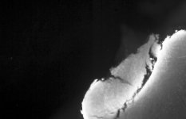|X:1400 Y:900 C:1 Z:56 T:1||X:1400 Y:900 C:1 Z:56 T:1|0|
|1||X:1400 Y:900 C:1 Z:56 T:1||X:1400 Y:900 C:1 Z:56 T:1|0|
|2|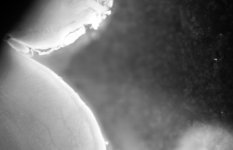|X:1400 Y:900 C:1 Z:56 T:1||X:1400 Y:900 C:1 Z:56 T:1|0|
|3||X:1400 Y:900 C:1 Z:56 T:1|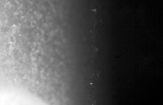|X:1400 Y:900 C:1 Z:56 T:1|0|
|4|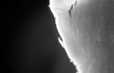|X:1400 Y:900 C:1 Z:56 T:1||X:1400 Y:900 C:1 Z:56 T:1|0|
|5||X:1400 Y:900 C:1 Z:56 T:1||X:1400 Y:900 C:1 Z:56 T:1|0|
|6||X:1400 Y:900 C:1 Z:56 T:1|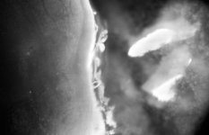|X:1400 Y:900 C:1 Z:56 T:1|0|
|7||X:1400 Y:900 C:1 Z:56 T:1|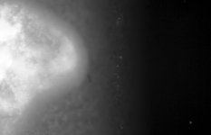|X:1400 Y:900 C:1 Z:56 T:1|0|
|8|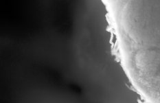|X:1400 Y:900 C:1 Z:56 T:1||X:1400 Y:900 C:1 Z:56 T:1|0|
|9||X:1400 Y:900 C:1 Z:56 T:1||X:1400 Y:900 C:1 Z:56 T:1|0|
|10||X:1400 Y:900 C:1 Z:56 T:1||X:1400 Y:900 C:1 Z:56 T:1|0|
|11|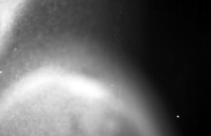|X:1400 Y:900 C:1 Z:56 T:1||X:1400 Y:900 C:1 Z:56 T:1|0|
|12||X:1400 Y:900 C:1 Z:56 T:1||X:1400 Y:900 C:1 Z:56 T:1|0|
|13|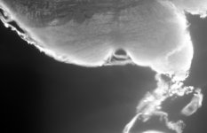|X:1400 Y:900 C:1 Z:56 T:1||X:1400 Y:900 C:1 Z:56 T:1|0|
|14||X:1400 Y:900 C:1 Z:56 T:1||X:1400 Y:900 C:1 Z:56 T:1|0|
|15|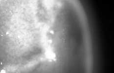|X:1400 Y:900 C:1 Z:56 T:1||X:1400 Y:900 C:1 Z:56 T:1|0|
|16||X:1400 Y:900 C:1 Z:56 T:1||X:1400 Y:900 C:1 Z:56 T:1|0|
|17||X:1400 Y:900 C:1 Z:56 T:1|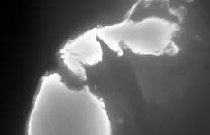|X:1400 Y:900 C:1 Z:56 T:1|0|
|18||X:1400 Y:900 C:1 Z:56 T:1||X:1400 Y:900 C:1 Z:56 T:1|0|
|19|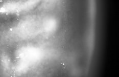|X:1400 Y:900 C:1 Z:56 T:1||X:1400 Y:900 C:1 Z:56 T:1|0|
|20||X:1400 Y:900 C:1 Z:56 T:1||X:1400 Y:900 C:1 Z:56 T:1|0|
|21|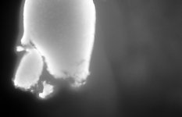|X:1400 Y:900 C:1 Z:56 T:1||X:1400 Y:900 C:1 Z:56 T:1|0|
|22|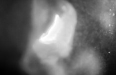|X:1400 Y:900 C:1 Z:56 T:1||X:1400 Y:900 C:1 Z:56 T:1|0|
|23|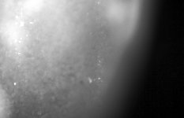|X:1400 Y:900 C:1 Z:56 T:1|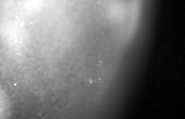|X:1400 Y:900 C:1 Z:56 T:1|0|
|24|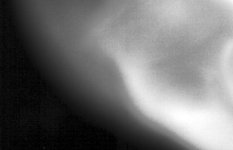|X:1400 Y:900 C:1 Z:56 T:1||X:1400 Y:900 C:1 Z:56 T:1|0|
|25||X:1400 Y:900 C:1 Z:56 T:1||X:1400 Y:900 C:1 Z:56 T:1|0|
|26||X:1400 Y:900 C:1 Z:56 T:1||X:1400 Y:900 C:1 Z:56 T:1|0|
|27||X:1400 Y:900 C:1 Z:56 T:1|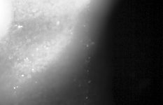|X:1400 Y:900 C:1 Z:56 T:1|0|
|28|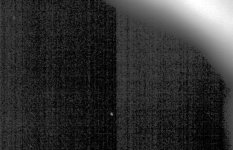|X:1400 Y:900 C:1 Z:56 T:1||X:1400 Y:900 C:1 Z:56 T:1|0|
|29||X:1400 Y:900 C:1 Z:56 T:1||X:1400 Y:900 C:1 Z:56 T:1|0|
|30||X:1400 Y:900 C:1 Z:56 T:1|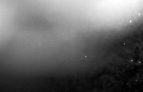|X:1400 Y:900 C:1 Z:56 T:1|0|
|31|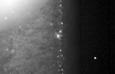|X:1400 Y:900 C:1 Z:56 T:1||X:1400 Y:900 C:1 Z:56 T:1|0|

# Metadata

