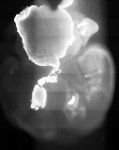

# [Demo LISH 4x8 15pct 647.czi](https://zenodo.org/record/8263451/files/Demo%20LISH%204x8%2015pct%20647.czi) report
 - **Autostitch** = true
 - ZeissCZIReader v6.14.0
 - ZeissQuickStartCZIReader v0.1.8-SNAPSHOT

# Images 

| Series            | Quick Start Reader | Size | Original Reader | Size | #Diffs |
|-------------------|--------------------|------|-----------------|------|--------|
| Read time (all)   |926 ms|------|997 ms|------|--------|
|0||X:4969 Y:6254 C:1 Z:56 T:1||X:4969 Y:6254 C:1 Z:56 T:1|0|

# Metadata

|  Method            | Parameters       | Quick Start Reader | Original Reader | Delta  |
| -------------------|------------------|--------------------|-----------------|------- |
| Initialization     |                  |24 ms|53 ms|        |
| Reader Size (Mb)     |                  |0.23|2.63|        |
| getStageLabelX| Image 0 | -3344.305 um | -27.045 um | 3317.260 um |
| getStageLabelY| Image 0 | -5015.520 um | 17428.300 um | 22443.820 um |
| getPlaneDeltaT| Image 0 Plane 0 |  1: null| 2: ome.units.quantity.Time: value[0.0], unit[s] stored as java.lang.Double |
| getPlanePositionX| Image 0 Plane 0 | -3344.305 um | -27.045 um | 3317.260 um |
| getPlanePositionY| Image 0 Plane 0 | -5015.520 um | 17428.300 um | 22443.820 um |
| getPlanePositionZ| Image 0 Plane 0 | 0.000 um | -3825.610 um | 3825.610 um |
| getPlaneDeltaT| Image 0 Plane 1 |  1: null| 2: ome.units.quantity.Time: value[0.0], unit[s] stored as java.lang.Double |
| getPlanePositionX| Image 0 Plane 1 | -3344.305 um | -27.045 um | 3317.260 um |
| getPlanePositionY| Image 0 Plane 1 | -5015.520 um | 17428.300 um | 22443.820 um |
| getPlanePositionZ| Image 0 Plane 1 | 100.000 um | -3725.610 um | 3825.610 um |
| getPlaneDeltaT| Image 0 Plane 2 |  1: null| 2: ome.units.quantity.Time: value[0.0], unit[s] stored as java.lang.Double |
| getPlanePositionX| Image 0 Plane 2 | -3344.305 um | -27.045 um | 3317.260 um |
| getPlanePositionY| Image 0 Plane 2 | -5015.520 um | 17428.300 um | 22443.820 um |
| getPlanePositionZ| Image 0 Plane 2 | 200.000 um | -3625.610 um | 3825.610 um |
| getPlaneDeltaT| Image 0 Plane 3 |  1: null| 2: ome.units.quantity.Time: value[0.0], unit[s] stored as java.lang.Double |
| getPlanePositionX| Image 0 Plane 3 | -3344.305 um | -27.045 um | 3317.260 um |
| getPlanePositionY| Image 0 Plane 3 | -5015.520 um | 17428.300 um | 22443.820 um |
| getPlanePositionZ| Image 0 Plane 3 | 300.000 um | -3525.610 um | 3825.610 um |
| getPlaneDeltaT| Image 0 Plane 4 |  1: null| 2: ome.units.quantity.Time: value[0.0], unit[s] stored as java.lang.Double |
| getPlanePositionX| Image 0 Plane 4 | -3344.305 um | -27.045 um | 3317.260 um |
| getPlanePositionY| Image 0 Plane 4 | -5015.520 um | 17428.300 um | 22443.820 um |
| getPlanePositionZ| Image 0 Plane 4 | 400.000 um | -3425.610 um | 3825.610 um |
| getPlaneDeltaT| Image 0 Plane 5 |  1: null| 2: ome.units.quantity.Time: value[0.0], unit[s] stored as java.lang.Double |
| getPlanePositionX| Image 0 Plane 5 | -3344.305 um | -27.045 um | 3317.260 um |
| getPlanePositionY| Image 0 Plane 5 | -5015.520 um | 17428.300 um | 22443.820 um |
| getPlanePositionZ| Image 0 Plane 5 | 500.000 um | -3325.610 um | 3825.610 um |
| getPlaneDeltaT| Image 0 Plane 6 |  1: null| 2: ome.units.quantity.Time: value[0.0], unit[s] stored as java.lang.Double |
| getPlanePositionX| Image 0 Plane 6 | -3344.305 um | -27.045 um | 3317.260 um |
| getPlanePositionY| Image 0 Plane 6 | -5015.520 um | 17428.300 um | 22443.820 um |
| getPlanePositionZ| Image 0 Plane 6 | 600.000 um | -3225.610 um | 3825.610 um |
| getPlaneDeltaT| Image 0 Plane 7 |  1: null| 2: ome.units.quantity.Time: value[0.0], unit[s] stored as java.lang.Double |
| getPlanePositionX| Image 0 Plane 7 | -3344.305 um | -27.045 um | 3317.260 um |
| getPlanePositionY| Image 0 Plane 7 | -5015.520 um | 17428.300 um | 22443.820 um |
| getPlanePositionZ| Image 0 Plane 7 | 700.000 um | -3125.610 um | 3825.610 um |
| getPlaneDeltaT| Image 0 Plane 8 |  1: null| 2: ome.units.quantity.Time: value[0.0], unit[s] stored as java.lang.Double |
| getPlanePositionX| Image 0 Plane 8 | -3344.305 um | -27.045 um | 3317.260 um |
| getPlanePositionY| Image 0 Plane 8 | -5015.520 um | 17428.300 um | 22443.820 um |
| getPlanePositionZ| Image 0 Plane 8 | 800.000 um | -3025.610 um | 3825.610 um |
| getPlaneDeltaT| Image 0 Plane 9 |  1: null| 2: ome.units.quantity.Time: value[0.0], unit[s] stored as java.lang.Double |
| getPlanePositionX| Image 0 Plane 9 | -3344.305 um | -27.045 um | 3317.260 um |
| getPlanePositionY| Image 0 Plane 9 | -5015.520 um | 17428.300 um | 22443.820 um |
| getPlanePositionZ| Image 0 Plane 9 | 900.000 um | -2925.610 um | 3825.610 um |
| getPlaneDeltaT| Image 0 Plane 10 |  1: null| 2: ome.units.quantity.Time: value[0.0], unit[s] stored as java.lang.Double |
| getPlanePositionX| Image 0 Plane 10 | -3344.305 um | -27.045 um | 3317.260 um |
| getPlanePositionY| Image 0 Plane 10 | -5015.520 um | 17428.300 um | 22443.820 um |
| getPlanePositionZ| Image 0 Plane 10 | 1000.000 um | -2825.610 um | 3825.610 um |
| getPlaneDeltaT| Image 0 Plane 11 |  1: null| 2: ome.units.quantity.Time: value[0.0], unit[s] stored as java.lang.Double |
| getPlanePositionX| Image 0 Plane 11 | -3344.305 um | -27.045 um | 3317.260 um |
| getPlanePositionY| Image 0 Plane 11 | -5015.520 um | 17428.300 um | 22443.820 um |
| getPlanePositionZ| Image 0 Plane 11 | 1100.000 um | -2725.610 um | 3825.610 um |
| getPlaneDeltaT| Image 0 Plane 12 |  1: null| 2: ome.units.quantity.Time: value[0.0], unit[s] stored as java.lang.Double |
| getPlanePositionX| Image 0 Plane 12 | -3344.305 um | -27.045 um | 3317.260 um |
| getPlanePositionY| Image 0 Plane 12 | -5015.520 um | 17428.300 um | 22443.820 um |
| getPlanePositionZ| Image 0 Plane 12 | 1200.000 um | -2625.610 um | 3825.610 um |
| getPlaneDeltaT| Image 0 Plane 13 |  1: null| 2: ome.units.quantity.Time: value[0.0], unit[s] stored as java.lang.Double |
| getPlanePositionX| Image 0 Plane 13 | -3344.305 um | -27.045 um | 3317.260 um |
| getPlanePositionY| Image 0 Plane 13 | -5015.520 um | 17428.300 um | 22443.820 um |
| getPlanePositionZ| Image 0 Plane 13 | 1300.000 um | -2525.610 um | 3825.610 um |
| getPlaneDeltaT| Image 0 Plane 14 |  1: null| 2: ome.units.quantity.Time: value[0.0], unit[s] stored as java.lang.Double |
| getPlanePositionX| Image 0 Plane 14 | -3344.305 um | -27.045 um | 3317.260 um |
| getPlanePositionY| Image 0 Plane 14 | -5015.520 um | 17428.300 um | 22443.820 um |
| getPlanePositionZ| Image 0 Plane 14 | 1400.000 um | -2425.610 um | 3825.610 um |
| getPlaneDeltaT| Image 0 Plane 15 |  1: null| 2: ome.units.quantity.Time: value[0.0], unit[s] stored as java.lang.Double |
| getPlanePositionX| Image 0 Plane 15 | -3344.305 um | -27.045 um | 3317.260 um |
| getPlanePositionY| Image 0 Plane 15 | -5015.520 um | 17428.300 um | 22443.820 um |
| getPlanePositionZ| Image 0 Plane 15 | 1500.000 um | -2325.610 um | 3825.610 um |
| getPlaneDeltaT| Image 0 Plane 16 |  1: null| 2: ome.units.quantity.Time: value[0.0], unit[s] stored as java.lang.Double |
| getPlanePositionX| Image 0 Plane 16 | -3344.305 um | -27.045 um | 3317.260 um |
| getPlanePositionY| Image 0 Plane 16 | -5015.520 um | 17428.300 um | 22443.820 um |
| getPlanePositionZ| Image 0 Plane 16 | 1600.000 um | -2225.610 um | 3825.610 um |
| getPlaneDeltaT| Image 0 Plane 17 |  1: null| 2: ome.units.quantity.Time: value[0.0], unit[s] stored as java.lang.Double |
| getPlanePositionX| Image 0 Plane 17 | -3344.305 um | -27.045 um | 3317.260 um |
| getPlanePositionY| Image 0 Plane 17 | -5015.520 um | 17428.300 um | 22443.820 um |
| getPlanePositionZ| Image 0 Plane 17 | 1700.000 um | -2125.610 um | 3825.610 um |
| getPlaneDeltaT| Image 0 Plane 18 |  1: null| 2: ome.units.quantity.Time: value[0.0], unit[s] stored as java.lang.Double |
| getPlanePositionX| Image 0 Plane 18 | -3344.305 um | -27.045 um | 3317.260 um |
| getPlanePositionY| Image 0 Plane 18 | -5015.520 um | 17428.300 um | 22443.820 um |
| getPlanePositionZ| Image 0 Plane 18 | 1800.000 um | -2025.610 um | 3825.610 um |
| getPlaneDeltaT| Image 0 Plane 19 |  1: null| 2: ome.units.quantity.Time: value[0.0], unit[s] stored as java.lang.Double |
| getPlanePositionX| Image 0 Plane 19 | -3344.305 um | -27.045 um | 3317.260 um |
| getPlanePositionY| Image 0 Plane 19 | -5015.520 um | 17428.300 um | 22443.820 um |
| getPlanePositionZ| Image 0 Plane 19 | 1900.000 um | -1925.610 um | 3825.610 um |
| getPlaneDeltaT| Image 0 Plane 20 |  1: null| 2: ome.units.quantity.Time: value[0.0], unit[s] stored as java.lang.Double |
| getPlanePositionX| Image 0 Plane 20 | -3344.305 um | -27.045 um | 3317.260 um |
| getPlanePositionY| Image 0 Plane 20 | -5015.520 um | 17428.300 um | 22443.820 um |
| getPlanePositionZ| Image 0 Plane 20 | 2000.000 um | -1825.610 um | 3825.610 um |
| getPlaneDeltaT| Image 0 Plane 21 |  1: null| 2: ome.units.quantity.Time: value[0.0], unit[s] stored as java.lang.Double |
| getPlanePositionX| Image 0 Plane 21 | -3344.305 um | -27.045 um | 3317.260 um |
| getPlanePositionY| Image 0 Plane 21 | -5015.520 um | 17428.300 um | 22443.820 um |
| getPlanePositionZ| Image 0 Plane 21 | 2100.000 um | -1725.610 um | 3825.610 um |
| getPlaneDeltaT| Image 0 Plane 22 |  1: null| 2: ome.units.quantity.Time: value[0.0], unit[s] stored as java.lang.Double |
| getPlanePositionX| Image 0 Plane 22 | -3344.305 um | -27.045 um | 3317.260 um |
| getPlanePositionY| Image 0 Plane 22 | -5015.520 um | 17428.300 um | 22443.820 um |
| getPlanePositionZ| Image 0 Plane 22 | 2200.000 um | -1625.610 um | 3825.610 um |
| getPlaneDeltaT| Image 0 Plane 23 |  1: null| 2: ome.units.quantity.Time: value[0.0], unit[s] stored as java.lang.Double |
| getPlanePositionX| Image 0 Plane 23 | -3344.305 um | -27.045 um | 3317.260 um |
| getPlanePositionY| Image 0 Plane 23 | -5015.520 um | 17428.300 um | 22443.820 um |
| getPlanePositionZ| Image 0 Plane 23 | 2300.000 um | -1525.610 um | 3825.610 um |
| getPlaneDeltaT| Image 0 Plane 24 |  1: null| 2: ome.units.quantity.Time: value[0.0], unit[s] stored as java.lang.Double |
| getPlanePositionX| Image 0 Plane 24 | -3344.305 um | -27.045 um | 3317.260 um |
| getPlanePositionY| Image 0 Plane 24 | -5015.520 um | 17428.300 um | 22443.820 um |
| getPlanePositionZ| Image 0 Plane 24 | 2400.000 um | -1425.610 um | 3825.610 um |
| getPlaneDeltaT| Image 0 Plane 25 |  1: null| 2: ome.units.quantity.Time: value[0.0], unit[s] stored as java.lang.Double |
| getPlanePositionX| Image 0 Plane 25 | -3344.305 um | -27.045 um | 3317.260 um |
| getPlanePositionY| Image 0 Plane 25 | -5015.520 um | 17428.300 um | 22443.820 um |
| getPlanePositionZ| Image 0 Plane 25 | 2500.000 um | -1325.610 um | 3825.610 um |
| getPlaneDeltaT| Image 0 Plane 26 |  1: null| 2: ome.units.quantity.Time: value[0.0], unit[s] stored as java.lang.Double |
| getPlanePositionX| Image 0 Plane 26 | -3344.305 um | -27.045 um | 3317.260 um |
| getPlanePositionY| Image 0 Plane 26 | -5015.520 um | 17428.300 um | 22443.820 um |
| getPlanePositionZ| Image 0 Plane 26 | 2600.000 um | -1225.610 um | 3825.610 um |
| getPlaneDeltaT| Image 0 Plane 27 |  1: null| 2: ome.units.quantity.Time: value[0.0], unit[s] stored as java.lang.Double |
| getPlanePositionX| Image 0 Plane 27 | -3344.305 um | -27.045 um | 3317.260 um |
| getPlanePositionY| Image 0 Plane 27 | -5015.520 um | 17428.300 um | 22443.820 um |
| getPlanePositionZ| Image 0 Plane 27 | 2700.000 um | -1125.610 um | 3825.610 um |
| getPlaneDeltaT| Image 0 Plane 28 |  1: null| 2: ome.units.quantity.Time: value[0.0], unit[s] stored as java.lang.Double |
| getPlanePositionX| Image 0 Plane 28 | -3344.305 um | -27.045 um | 3317.260 um |
| getPlanePositionY| Image 0 Plane 28 | -5015.520 um | 17428.300 um | 22443.820 um |
| getPlanePositionZ| Image 0 Plane 28 | 2800.000 um | -1025.610 um | 3825.610 um |
| getPlaneDeltaT| Image 0 Plane 29 |  1: null| 2: ome.units.quantity.Time: value[0.0], unit[s] stored as java.lang.Double |
| getPlanePositionX| Image 0 Plane 29 | -3344.305 um | -27.045 um | 3317.260 um |
| getPlanePositionY| Image 0 Plane 29 | -5015.520 um | 17428.300 um | 22443.820 um |
| getPlanePositionZ| Image 0 Plane 29 | 2900.000 um | -925.610 um | 3825.610 um |
| getPlaneDeltaT| Image 0 Plane 30 |  1: null| 2: ome.units.quantity.Time: value[0.0], unit[s] stored as java.lang.Double |
| getPlanePositionX| Image 0 Plane 30 | -3344.305 um | -27.045 um | 3317.260 um |
| getPlanePositionY| Image 0 Plane 30 | -5015.520 um | 17428.300 um | 22443.820 um |
| getPlanePositionZ| Image 0 Plane 30 | 3000.000 um | -825.610 um | 3825.610 um |
| getPlaneDeltaT| Image 0 Plane 31 |  1: null| 2: ome.units.quantity.Time: value[0.0], unit[s] stored as java.lang.Double |
| getPlanePositionX| Image 0 Plane 31 | -3344.305 um | -27.045 um | 3317.260 um |
| getPlanePositionY| Image 0 Plane 31 | -5015.520 um | 17428.300 um | 22443.820 um |
| getPlanePositionZ| Image 0 Plane 31 | 3100.000 um | -725.610 um | 3825.610 um |
| getPlaneDeltaT| Image 0 Plane 32 |  1: null| 2: ome.units.quantity.Time: value[0.0], unit[s] stored as java.lang.Double |
| getPlanePositionX| Image 0 Plane 32 | -3344.305 um | -27.045 um | 3317.260 um |
| getPlanePositionY| Image 0 Plane 32 | -5015.520 um | 17428.300 um | 22443.820 um |
| getPlanePositionZ| Image 0 Plane 32 | 3200.000 um | -625.610 um | 3825.610 um |
| getPlaneDeltaT| Image 0 Plane 33 |  1: null| 2: ome.units.quantity.Time: value[0.0], unit[s] stored as java.lang.Double |
| getPlanePositionX| Image 0 Plane 33 | -3344.305 um | -27.045 um | 3317.260 um |
| getPlanePositionY| Image 0 Plane 33 | -5015.520 um | 17428.300 um | 22443.820 um |
| getPlanePositionZ| Image 0 Plane 33 | 3300.000 um | -525.610 um | 3825.610 um |
| getPlaneDeltaT| Image 0 Plane 34 |  1: null| 2: ome.units.quantity.Time: value[0.0], unit[s] stored as java.lang.Double |
| getPlanePositionX| Image 0 Plane 34 | -3344.305 um | -27.045 um | 3317.260 um |
| getPlanePositionY| Image 0 Plane 34 | -5015.520 um | 17428.300 um | 22443.820 um |
| getPlanePositionZ| Image 0 Plane 34 | 3400.000 um | -425.610 um | 3825.610 um |
| getPlaneDeltaT| Image 0 Plane 35 |  1: null| 2: ome.units.quantity.Time: value[0.0], unit[s] stored as java.lang.Double |
| getPlanePositionX| Image 0 Plane 35 | -3344.305 um | -27.045 um | 3317.260 um |
| getPlanePositionY| Image 0 Plane 35 | -5015.520 um | 17428.300 um | 22443.820 um |
| getPlanePositionZ| Image 0 Plane 35 | 3500.000 um | -325.610 um | 3825.610 um |
| getPlaneDeltaT| Image 0 Plane 36 |  1: null| 2: ome.units.quantity.Time: value[0.0], unit[s] stored as java.lang.Double |
| getPlanePositionX| Image 0 Plane 36 | -3344.305 um | -27.045 um | 3317.260 um |
| getPlanePositionY| Image 0 Plane 36 | -5015.520 um | 17428.300 um | 22443.820 um |
| getPlanePositionZ| Image 0 Plane 36 | 3600.000 um | -225.610 um | 3825.610 um |
| getPlaneDeltaT| Image 0 Plane 37 |  1: null| 2: ome.units.quantity.Time: value[0.0], unit[s] stored as java.lang.Double |
| getPlanePositionX| Image 0 Plane 37 | -3344.305 um | -27.045 um | 3317.260 um |
| getPlanePositionY| Image 0 Plane 37 | -5015.520 um | 17428.300 um | 22443.820 um |
| getPlanePositionZ| Image 0 Plane 37 | 3700.000 um | -125.610 um | 3825.610 um |
| getPlaneDeltaT| Image 0 Plane 38 |  1: null| 2: ome.units.quantity.Time: value[0.0], unit[s] stored as java.lang.Double |
| getPlanePositionX| Image 0 Plane 38 | -3344.305 um | -27.045 um | 3317.260 um |
| getPlanePositionY| Image 0 Plane 38 | -5015.520 um | 17428.300 um | 22443.820 um |
| getPlanePositionZ| Image 0 Plane 38 | 3800.000 um | -25.610 um | 3825.610 um |
| getPlaneDeltaT| Image 0 Plane 39 |  1: null| 2: ome.units.quantity.Time: value[0.0], unit[s] stored as java.lang.Double |
| getPlanePositionX| Image 0 Plane 39 | -3344.305 um | -27.045 um | 3317.260 um |
| getPlanePositionY| Image 0 Plane 39 | -5015.520 um | 17428.300 um | 22443.820 um |
| getPlanePositionZ| Image 0 Plane 39 | 3900.000 um | 74.390 um | 3825.610 um |
| getPlaneDeltaT| Image 0 Plane 40 |  1: null| 2: ome.units.quantity.Time: value[0.0], unit[s] stored as java.lang.Double |
| getPlanePositionX| Image 0 Plane 40 | -3344.305 um | -27.045 um | 3317.260 um |
| getPlanePositionY| Image 0 Plane 40 | -5015.520 um | 17428.300 um | 22443.820 um |
| getPlanePositionZ| Image 0 Plane 40 | 4000.000 um | 174.390 um | 3825.610 um |
| getPlaneDeltaT| Image 0 Plane 41 |  1: null| 2: ome.units.quantity.Time: value[0.0], unit[s] stored as java.lang.Double |
| getPlanePositionX| Image 0 Plane 41 | -3344.305 um | -27.045 um | 3317.260 um |
| getPlanePositionY| Image 0 Plane 41 | -5015.520 um | 17428.300 um | 22443.820 um |
| getPlanePositionZ| Image 0 Plane 41 | 4100.000 um | 274.390 um | 3825.610 um |
| getPlaneDeltaT| Image 0 Plane 42 |  1: null| 2: ome.units.quantity.Time: value[0.0], unit[s] stored as java.lang.Double |
| getPlanePositionX| Image 0 Plane 42 | -3344.305 um | -27.045 um | 3317.260 um |
| getPlanePositionY| Image 0 Plane 42 | -5015.520 um | 17428.300 um | 22443.820 um |
| getPlanePositionZ| Image 0 Plane 42 | 4200.000 um | 374.390 um | 3825.610 um |
| getPlaneDeltaT| Image 0 Plane 43 |  1: null| 2: ome.units.quantity.Time: value[0.0], unit[s] stored as java.lang.Double |
| getPlanePositionX| Image 0 Plane 43 | -3344.305 um | -27.045 um | 3317.260 um |
| getPlanePositionY| Image 0 Plane 43 | -5015.520 um | 17428.300 um | 22443.820 um |
| getPlanePositionZ| Image 0 Plane 43 | 4300.000 um | 474.390 um | 3825.610 um |
| getPlaneDeltaT| Image 0 Plane 44 |  1: null| 2: ome.units.quantity.Time: value[0.0], unit[s] stored as java.lang.Double |
| getPlanePositionX| Image 0 Plane 44 | -3344.305 um | -27.045 um | 3317.260 um |
| getPlanePositionY| Image 0 Plane 44 | -5015.520 um | 17428.300 um | 22443.820 um |
| getPlanePositionZ| Image 0 Plane 44 | 4400.000 um | 574.390 um | 3825.610 um |
| getPlaneDeltaT| Image 0 Plane 45 |  1: null| 2: ome.units.quantity.Time: value[0.0], unit[s] stored as java.lang.Double |
| getPlanePositionX| Image 0 Plane 45 | -3344.305 um | -27.045 um | 3317.260 um |
| getPlanePositionY| Image 0 Plane 45 | -5015.520 um | 17428.300 um | 22443.820 um |
| getPlanePositionZ| Image 0 Plane 45 | 4500.000 um | 674.390 um | 3825.610 um |
| getPlaneDeltaT| Image 0 Plane 46 |  1: null| 2: ome.units.quantity.Time: value[0.0], unit[s] stored as java.lang.Double |
| getPlanePositionX| Image 0 Plane 46 | -3344.305 um | -27.045 um | 3317.260 um |
| getPlanePositionY| Image 0 Plane 46 | -5015.520 um | 17428.300 um | 22443.820 um |
| getPlanePositionZ| Image 0 Plane 46 | 4600.000 um | 774.390 um | 3825.610 um |
| getPlaneDeltaT| Image 0 Plane 47 |  1: null| 2: ome.units.quantity.Time: value[0.0], unit[s] stored as java.lang.Double |
| getPlanePositionX| Image 0 Plane 47 | -3344.305 um | -27.045 um | 3317.260 um |
| getPlanePositionY| Image 0 Plane 47 | -5015.520 um | 17428.300 um | 22443.820 um |
| getPlanePositionZ| Image 0 Plane 47 | 4700.000 um | 874.390 um | 3825.610 um |
| getPlaneDeltaT| Image 0 Plane 48 |  1: null| 2: ome.units.quantity.Time: value[0.0], unit[s] stored as java.lang.Double |
| getPlanePositionX| Image 0 Plane 48 | -3344.305 um | -27.045 um | 3317.260 um |
| getPlanePositionY| Image 0 Plane 48 | -5015.520 um | 17428.300 um | 22443.820 um |
| getPlanePositionZ| Image 0 Plane 48 | 4800.000 um | 974.390 um | 3825.610 um |
| getPlaneDeltaT| Image 0 Plane 49 |  1: null| 2: ome.units.quantity.Time: value[0.0], unit[s] stored as java.lang.Double |
| getPlanePositionX| Image 0 Plane 49 | -3344.305 um | -27.045 um | 3317.260 um |
| getPlanePositionY| Image 0 Plane 49 | -5015.520 um | 17428.300 um | 22443.820 um |
| getPlanePositionZ| Image 0 Plane 49 | 4900.000 um | 1074.390 um | 3825.610 um |
| getPlaneDeltaT| Image 0 Plane 50 |  1: null| 2: ome.units.quantity.Time: value[0.0], unit[s] stored as java.lang.Double |
| getPlanePositionX| Image 0 Plane 50 | -3344.305 um | -27.045 um | 3317.260 um |
| getPlanePositionY| Image 0 Plane 50 | -5015.520 um | 17428.300 um | 22443.820 um |
| getPlanePositionZ| Image 0 Plane 50 | 5000.000 um | 1174.390 um | 3825.610 um |
| getPlaneDeltaT| Image 0 Plane 51 |  1: null| 2: ome.units.quantity.Time: value[0.0], unit[s] stored as java.lang.Double |
| getPlanePositionX| Image 0 Plane 51 | -3344.305 um | -27.045 um | 3317.260 um |
| getPlanePositionY| Image 0 Plane 51 | -5015.520 um | 17428.300 um | 22443.820 um |
| getPlanePositionZ| Image 0 Plane 51 | 5100.000 um | 1274.390 um | 3825.610 um |
| getPlaneDeltaT| Image 0 Plane 52 |  1: null| 2: ome.units.quantity.Time: value[0.0], unit[s] stored as java.lang.Double |
| getPlanePositionX| Image 0 Plane 52 | -3344.305 um | -27.045 um | 3317.260 um |
| getPlanePositionY| Image 0 Plane 52 | -5015.520 um | 17428.300 um | 22443.820 um |
| getPlanePositionZ| Image 0 Plane 52 | 5200.000 um | 1374.390 um | 3825.610 um |
| getPlaneDeltaT| Image 0 Plane 53 |  1: null| 2: ome.units.quantity.Time: value[0.0], unit[s] stored as java.lang.Double |
| getPlanePositionX| Image 0 Plane 53 | -3344.305 um | -27.045 um | 3317.260 um |
| getPlanePositionY| Image 0 Plane 53 | -5015.520 um | 17428.300 um | 22443.820 um |
| getPlanePositionZ| Image 0 Plane 53 | 5300.000 um | 1474.390 um | 3825.610 um |
| getPlaneDeltaT| Image 0 Plane 54 |  1: null| 2: ome.units.quantity.Time: value[0.0], unit[s] stored as java.lang.Double |
| getPlanePositionX| Image 0 Plane 54 | -3344.305 um | -27.045 um | 3317.260 um |
| getPlanePositionY| Image 0 Plane 54 | -5015.520 um | 17428.300 um | 22443.820 um |
| getPlanePositionZ| Image 0 Plane 54 | 5400.000 um | 1574.390 um | 3825.610 um |
| getPlaneDeltaT| Image 0 Plane 55 |  1: null| 2: ome.units.quantity.Time: value[0.0], unit[s] stored as java.lang.Double |
| getPlanePositionX| Image 0 Plane 55 | -3344.305 um | -27.045 um | 3317.260 um |
| getPlanePositionY| Image 0 Plane 55 | -5015.520 um | 17428.300 um | 22443.820 um |
| getPlanePositionZ| Image 0 Plane 55 | 5500.000 um | 1674.390 um | 3825.610 um |
