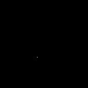

|  Method            | Parameters       | Quick Start Reader | Original Reader | Delta  |
| -------------------|------------------|--------------------|-----------------|------- |
| Initialization     |                  |5 ms|3 ms|        |
| Reader Size (Mb)     |                  |0.12|0.20|        |
# [Figure2D-eGFPCdt1_2MKCl.czi](https://zenodo.org/record/5908580/files/Figure2D-eGFPCdt1_2MKCl.czi) report
 - **Autostitch** = false
 - ZeissCZIReader v7.0.0
 - ZeissQuickStartCZIReader v0.2.2-SNAPSHOT

# Images 

| Series            | Quick Start Reader | Size | Original Reader | Size | #Diffs |
|-------------------|--------------------|------|-----------------|------|--------|
| Read time (all)   |21 ms|------|25 ms|------|--------|
|0||X:1024 Y:1024 C:1 Z:11 T:1||X:1024 Y:1024 C:1 Z:11 T:1|0|

# Metadata

