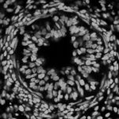

|  Method            | Parameters       | Quick Start Reader | Original Reader | Delta  |
| -------------------|------------------|--------------------|-----------------|------- |
| Initialization     |                  |18 ms|17 ms|        |
| Reader Size (Mb)     |                  |1.17|2.06|        |
# [Figure2_G.czi](https://zenodo.org/record/6385351/files/Figure2_G.czi) report
 - **Autostitch** = false
 - ZeissCZIReader v6.14.0
 - ZeissQuickStartCZIReader v0.2.2-SNAPSHOT

# Images 

| Series            | Quick Start Reader | Size | Original Reader | Size | #Diffs |
|-------------------|--------------------|------|-----------------|------|--------|
| Read time (all)   |586 ms|------|800 ms|------|--------|
|0||X:2927 Y:2927 C:4 Z:1 T:1||X:2927 Y:2927 C:4 Z:1 T:1|0|

# Metadata

