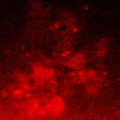

|  Method            | Parameters       | Quick Start Reader | Original Reader | Delta  |
| -------------------|------------------|--------------------|-----------------|------- |
| Initialization     |                  |7 ms|7 ms|        |
| Reader Size (Mb)     |                  |0.24|0.49|        |
# [HepG2_ND100_ctrl_FASTZ.czi](https://zenodo.org/record/5068754/files/HepG2_ND100_ctrl_FASTZ.czi) report
 - **Autostitch** = true
 - ZeissCZIReader v7.0.0
 - ZeissQuickStartCZIReader v0.2.2-SNAPSHOT

# Images 

| Series            | Quick Start Reader | Size | Original Reader | Size | #Diffs |
|-------------------|--------------------|------|-----------------|------|--------|
| Read time (all)   |312 ms|------|303 ms|------|--------|
|0||X:2532 Y:2532 C:3 Z:65 T:1||X:2532 Y:2532 C:3 Z:65 T:1|0|

# Metadata

