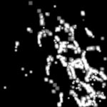

|  Method            | Parameters       | Quick Start Reader | Original Reader | Delta  |
| -------------------|------------------|--------------------|-----------------|------- |
| Initialization     |                  |2 ms|4 ms|        |
| Reader Size (Mb)     |                  |0.12|0.19|        |
# [Image 5_PALM_verrechnet.czi](https://zenodo.org/records/10577621/files/Image%205_PALM_verrechnet.czi) report
 - **Autostitch** = true
 - ZeissCZIReader v7.1.0
 - ZeissQuickStartCZIReader v0.2.4-SNAPSHOT

# Images 

| Series            | Quick Start Reader | Size | Original Reader | Size | #Diffs |
|-------------------|--------------------|------|-----------------|------|--------|
| Read time (all)   |33 ms|------|36 ms|------|--------|
|0||X:1206 Y:1206 C:1 Z:1 T:1||X:1206 Y:1206 C:1 Z:1 T:1|0|

# Metadata

