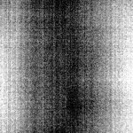
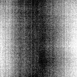
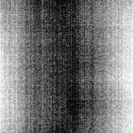
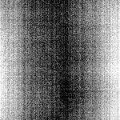
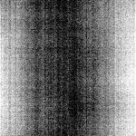

# [Image_1_2023_08_18__14_32_31_964.czi](https://zenodo.org/record/8263451/files/Image_1_2023_08_18__14_32_31_964.czi) report
 - **Autostitch** = false
 - ZeissCZIReader v6.14.0
 - ZeissQuickStartCZIReader v0.1.8-SNAPSHOT

# Images 

| Series            | Quick Start Reader | Size | Original Reader | Size | #Diffs |
|-------------------|--------------------|------|-----------------|------|--------|
| Read time (all)   |448 ms|------|514 ms|------|--------|
|0||X:1920 Y:1920 C:1 Z:1 T:1||X:1920 Y:1920 C:1 Z:1 T:1|0|
|1||X:1920 Y:1920 C:1 Z:1 T:1||X:1920 Y:1920 C:1 Z:1 T:1|0|
|2||X:1920 Y:1920 C:1 Z:1 T:1||X:1920 Y:1920 C:1 Z:1 T:1|0|
|3||X:1920 Y:1920 C:1 Z:1 T:1||X:1920 Y:1920 C:1 Z:1 T:1|0|

# Metadata

|  Method            | Parameters       | Quick Start Reader | Original Reader | Delta  |
| -------------------|------------------|--------------------|-----------------|------- |
| Initialization     |                  |15 ms|26 ms|        |
| Reader Size (Mb)     |                  |0.13|0.20|        |
| getStageLabelX| Image 0 | -1574.258 um | 0.016 um | 1574.274 um |
| getStageLabelY| Image 0 | 43425.726 um | 45000.000 um | 1574.274 um |
| getStageLabelName| Image 1 | Scene position #0| Scene position #1| |
| getStageLabelX| Image 1 | ome.units.quantity.Length: value[1574.2900157482613], unit[µm] stored as java.lang.Double| ome.units.quantity.Length: value[864], unit[reference frame] stored as java.lang.Integer| |
| getStageLabelY| Image 1 | ome.units.quantity.Length: value[43425.72598425174], unit[µm] stored as java.lang.Double| ome.units.quantity.Length: value[-864], unit[reference frame] stored as java.lang.Integer| |
| getStageLabelZ| Image 1 |  1: ome.units.quantity.Length: value[4999.95], unit[µm] stored as java.lang.Double| 2: null |
| getStageLabelName| Image 2 | Scene position #0| Scene position #2| |
| getStageLabelX| Image 2 | ome.units.quantity.Length: value[-1574.2580157482612], unit[µm] stored as java.lang.Double| ome.units.quantity.Length: value[-864], unit[reference frame] stored as java.lang.Integer| |
| getStageLabelY| Image 2 | ome.units.quantity.Length: value[46574.27401574826], unit[µm] stored as java.lang.Double| ome.units.quantity.Length: value[864], unit[reference frame] stored as java.lang.Integer| |
| getStageLabelZ| Image 2 |  1: ome.units.quantity.Length: value[4999.95], unit[µm] stored as java.lang.Double| 2: null |
| getStageLabelName| Image 3 | Scene position #0| Scene position #3| |
| getStageLabelX| Image 3 | ome.units.quantity.Length: value[1574.2900157482613], unit[µm] stored as java.lang.Double| ome.units.quantity.Length: value[864], unit[reference frame] stored as java.lang.Integer| |
| getStageLabelY| Image 3 | ome.units.quantity.Length: value[46574.27401574826], unit[µm] stored as java.lang.Double| ome.units.quantity.Length: value[864], unit[reference frame] stored as java.lang.Integer| |
| getStageLabelZ| Image 3 |  1: ome.units.quantity.Length: value[4999.95], unit[µm] stored as java.lang.Double| 2: null |
| getPlanePositionX| Image 0 Plane 0 | -1574.258 um | 0.016 um | 1574.274 um |
| getPlanePositionY| Image 0 Plane 0 | 43425.726 um | 45000.000 um | 1574.274 um |
| getPlanePositionX| Image 1 Plane 0 | ome.units.quantity.Length: value[1574.2900157482613], unit[µm] stored as java.lang.Double| ome.units.quantity.Length: value[864], unit[reference frame] stored as java.lang.Integer| |
| getPlanePositionY| Image 1 Plane 0 | ome.units.quantity.Length: value[43425.72598425174], unit[µm] stored as java.lang.Double| ome.units.quantity.Length: value[-864], unit[reference frame] stored as java.lang.Integer| |
| getPlanePositionZ| Image 1 Plane 0 |  1: ome.units.quantity.Length: value[4999.95], unit[µm] stored as java.lang.Double| 2: null |
| getPlanePositionX| Image 2 Plane 0 | ome.units.quantity.Length: value[-1574.2580157482612], unit[µm] stored as java.lang.Double| ome.units.quantity.Length: value[-864], unit[reference frame] stored as java.lang.Integer| |
| getPlanePositionY| Image 2 Plane 0 | ome.units.quantity.Length: value[46574.27401574826], unit[µm] stored as java.lang.Double| ome.units.quantity.Length: value[864], unit[reference frame] stored as java.lang.Integer| |
| getPlanePositionZ| Image 2 Plane 0 |  1: ome.units.quantity.Length: value[4999.95], unit[µm] stored as java.lang.Double| 2: null |
| getPlanePositionX| Image 3 Plane 0 | ome.units.quantity.Length: value[1574.2900157482613], unit[µm] stored as java.lang.Double| ome.units.quantity.Length: value[864], unit[reference frame] stored as java.lang.Integer| |
| getPlanePositionY| Image 3 Plane 0 | ome.units.quantity.Length: value[46574.27401574826], unit[µm] stored as java.lang.Double| ome.units.quantity.Length: value[864], unit[reference frame] stored as java.lang.Integer| |
| getPlanePositionZ| Image 3 Plane 0 |  1: ome.units.quantity.Length: value[4999.95], unit[µm] stored as java.lang.Double| 2: null |
