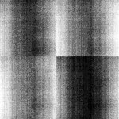

# [Image_1_2023_08_18__14_32_31_964.czi](https://zenodo.org/record/8263451/files/Image_1_2023_08_18__14_32_31_964.czi) report
 - **Autostitch** = true
 - ZeissCZIReader v6.14.0
 - ZeissQuickStartCZIReader v0.1.8-SNAPSHOT

# Images 

| Series            | Quick Start Reader | Size | Original Reader | Size | #Diffs |
|-------------------|--------------------|------|-----------------|------|--------|
| Read time (all)   |323 ms|------|355 ms|------|--------|
|0||X:3648 Y:3648 C:1 Z:1 T:1||X:3648 Y:3648 C:1 Z:1 T:1|0|

# Metadata

|  Method            | Parameters       | Quick Start Reader | Original Reader | Delta  |
| -------------------|------------------|--------------------|-----------------|------- |
| Initialization     |                  |8 ms|9 ms|        |
| Reader Size (Mb)     |                  |0.11|0.19|        |
| getStageLabelX| Image 0 |  1: null| 2: ome.units.quantity.Length: value[0.016], unit[µm] stored as java.lang.Double |
| getStageLabelY| Image 0 |  1: null| 2: ome.units.quantity.Length: value[45000.0], unit[µm] stored as java.lang.Double |
| getPlanePositionX| Image 0 Plane 0 | ome.units.quantity.Length: value[-864.0], unit[reference frame] stored as java.lang.Double| ome.units.quantity.Length: value[0.016], unit[µm] stored as java.lang.Double| |
| getPlanePositionY| Image 0 Plane 0 | ome.units.quantity.Length: value[-864.0], unit[reference frame] stored as java.lang.Double| ome.units.quantity.Length: value[45000.0], unit[µm] stored as java.lang.Double| |
| getPlanePositionZ| Image 0 Plane 0 | ome.units.quantity.Length: value[0.0], unit[reference frame] stored as java.lang.Double| ome.units.quantity.Length: value[4999.95], unit[µm] stored as java.lang.Double| |
