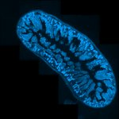
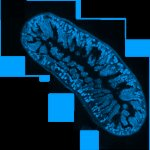
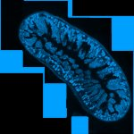
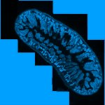
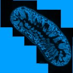

|  Method            | Parameters       | Quick Start Reader | Original Reader | Delta  |
| -------------------|------------------|--------------------|-----------------|------- |
| Initialization     |                  |57 ms|62 ms|        |
| Reader Size (Mb)     |                  |3.39|3.76|        |
| getStageLabelName| Image 0 | ScanRegion0| Scene position #0| |
| getStageLabelX| Image 0 | -22336.736 um | -21329.569 um | 1007.167 um |
| getStageLabelY| Image 0 | 11034.660 um | 12091.170 um | 1056.510 um |
| getStageLabelZ| Image 0 | 4495.252 um | 4496.121 um | 0.869 um |
| getStageLabelName| Image 1 | ScanRegion0| Scene position #1| |
| getStageLabelX| Image 1 | -22336.736 um | -21329.569 um | 1007.167 um |
| getStageLabelY| Image 1 | 11034.660 um | 12091.170 um | 1056.510 um |
| getStageLabelZ| Image 1 |  1: ome.units.quantity.Length: value[4495.251987243652], unit[µm] stored as java.lang.Double| 2: null |
| getPixelsPhysicalSizeX| Image 1 | 0.645 um | 0.323 um | 0.323 um |
| getPixelsPhysicalSizeY| Image 1 | 0.645 um | 0.323 um | 0.323 um |
| getStageLabelName| Image 2 | ScanRegion0| Scene position #2| |
| getStageLabelX| Image 2 | -22336.736 um | -21329.569 um | 1007.167 um |
| getStageLabelY| Image 2 | 11034.660 um | 12091.170 um | 1056.510 um |
| getStageLabelZ| Image 2 |  1: ome.units.quantity.Length: value[4495.251987243652], unit[µm] stored as java.lang.Double| 2: null |
| getPixelsPhysicalSizeX| Image 2 | 1.290 um | 0.323 um | 0.968 um |
| getPixelsPhysicalSizeY| Image 2 | 1.290 um | 0.323 um | 0.968 um |
| getStageLabelName| Image 3 | ScanRegion0| Scene position #3| |
| getStageLabelX| Image 3 | -22336.736 um | -21329.569 um | 1007.167 um |
| getStageLabelY| Image 3 | 11034.660 um | 12091.170 um | 1056.510 um |
| getStageLabelZ| Image 3 |  1: ome.units.quantity.Length: value[4495.251987243652], unit[µm] stored as java.lang.Double| 2: null |
| getPixelsPhysicalSizeX| Image 3 | 2.580 um | 0.323 um | 2.258 um |
| getPixelsPhysicalSizeY| Image 3 | 2.580 um | 0.323 um | 2.258 um |
| getImageAcquisitionDate| Image 4 |  1: null| 2: 2012-12-07T13:52:41.839 |
| getPixelsPhysicalSizeX| Image 4 |  1: null| 2: ome.units.quantity.Length: value[0.3225], unit[µm] stored as java.lang.Double |
| getPixelsPhysicalSizeY| Image 4 |  1: null| 2: ome.units.quantity.Length: value[0.3225], unit[µm] stored as java.lang.Double |
| getPlanePositionX| Image 0 Plane 0 | -22336.736 um | -21329.569 um | 1007.167 um |
| getPlanePositionY| Image 0 Plane 0 | 11034.660 um | 12091.170 um | 1056.510 um |
| getPlanePositionZ| Image 0 Plane 0 | 4495.252 um | 4496.121 um | 0.869 um |
| getPlanePositionX| Image 0 Plane 1 | -22336.736 um | -21329.569 um | 1007.167 um |
| getPlanePositionY| Image 0 Plane 1 | 11034.660 um | 12091.170 um | 1056.510 um |
| getPlanePositionZ| Image 0 Plane 1 | 4495.252 um | 4496.121 um | 0.869 um |
| getPlanePositionX| Image 0 Plane 2 | -22336.736 um | -21329.569 um | 1007.167 um |
| getPlanePositionY| Image 0 Plane 2 | 11034.660 um | 12091.170 um | 1056.510 um |
| getPlanePositionZ| Image 0 Plane 2 | 4495.252 um | 4496.121 um | 0.869 um |
| getPlanePositionX| Image 0 Plane 3 | -22336.736 um | -21329.569 um | 1007.167 um |
| getPlanePositionY| Image 0 Plane 3 | 11034.660 um | 12091.170 um | 1056.510 um |
| getPlanePositionZ| Image 0 Plane 3 | 4495.252 um | 4496.121 um | 0.869 um |
| getPlanePositionX| Image 1 Plane 0 | -22336.736 um | -21329.569 um | 1007.167 um |
| getPlanePositionY| Image 1 Plane 0 | 11034.660 um | 12091.170 um | 1056.510 um |
| getPlanePositionZ| Image 1 Plane 0 |  1: ome.units.quantity.Length: value[4495.251987243652], unit[µm] stored as java.lang.Double| 2: null |
| getPlaneDeltaT| Image 1 Plane 1 |  1.142 s |  0.769 s | 0.373 s |
| getPlanePositionX| Image 1 Plane 1 | -22336.736 um | -21329.569 um | 1007.167 um |
| getPlanePositionY| Image 1 Plane 1 | 11034.660 um | 12091.170 um | 1056.510 um |
| getPlanePositionZ| Image 1 Plane 1 |  1: ome.units.quantity.Length: value[4495.251987243652], unit[µm] stored as java.lang.Double| 2: null |
| getPlaneDeltaT| Image 1 Plane 2 |  1.685 s |  0.769 s | 0.916 s |
| getPlanePositionX| Image 1 Plane 2 | -22336.736 um | -21329.569 um | 1007.167 um |
| getPlanePositionY| Image 1 Plane 2 | 11034.660 um | 12091.170 um | 1056.510 um |
| getPlanePositionZ| Image 1 Plane 2 |  1: ome.units.quantity.Length: value[4495.251987243652], unit[µm] stored as java.lang.Double| 2: null |
| getPlaneDeltaT| Image 1 Plane 3 |  2.372 s |  0.769 s | 1.603 s |
| getPlanePositionX| Image 1 Plane 3 | -22336.736 um | -21329.569 um | 1007.167 um |
| getPlanePositionY| Image 1 Plane 3 | 11034.660 um | 12091.170 um | 1056.510 um |
| getPlanePositionZ| Image 1 Plane 3 |  1: ome.units.quantity.Length: value[4495.251987243652], unit[µm] stored as java.lang.Double| 2: null |
| getPlanePositionX| Image 2 Plane 0 | -22336.736 um | -21329.569 um | 1007.167 um |
| getPlanePositionY| Image 2 Plane 0 | 11034.660 um | 12091.170 um | 1056.510 um |
| getPlanePositionZ| Image 2 Plane 0 |  1: ome.units.quantity.Length: value[4495.251987243652], unit[µm] stored as java.lang.Double| 2: null |
| getPlaneDeltaT| Image 2 Plane 1 |  1.142 s |  0.769 s | 0.373 s |
| getPlanePositionX| Image 2 Plane 1 | -22336.736 um | -21329.569 um | 1007.167 um |
| getPlanePositionY| Image 2 Plane 1 | 11034.660 um | 12091.170 um | 1056.510 um |
| getPlanePositionZ| Image 2 Plane 1 |  1: ome.units.quantity.Length: value[4495.251987243652], unit[µm] stored as java.lang.Double| 2: null |
| getPlaneDeltaT| Image 2 Plane 2 |  1.685 s |  0.769 s | 0.916 s |
| getPlanePositionX| Image 2 Plane 2 | -22336.736 um | -21329.569 um | 1007.167 um |
| getPlanePositionY| Image 2 Plane 2 | 11034.660 um | 12091.170 um | 1056.510 um |
| getPlanePositionZ| Image 2 Plane 2 |  1: ome.units.quantity.Length: value[4495.251987243652], unit[µm] stored as java.lang.Double| 2: null |
| getPlaneDeltaT| Image 2 Plane 3 |  2.372 s |  0.769 s | 1.603 s |
| getPlanePositionX| Image 2 Plane 3 | -22336.736 um | -21329.569 um | 1007.167 um |
| getPlanePositionY| Image 2 Plane 3 | 11034.660 um | 12091.170 um | 1056.510 um |
| getPlanePositionZ| Image 2 Plane 3 |  1: ome.units.quantity.Length: value[4495.251987243652], unit[µm] stored as java.lang.Double| 2: null |
| getPlanePositionX| Image 3 Plane 0 | -22336.736 um | -21329.569 um | 1007.167 um |
| getPlanePositionY| Image 3 Plane 0 | 11034.660 um | 12091.170 um | 1056.510 um |
| getPlanePositionZ| Image 3 Plane 0 |  1: ome.units.quantity.Length: value[4495.251987243652], unit[µm] stored as java.lang.Double| 2: null |
| getPlaneDeltaT| Image 3 Plane 1 |  1.142 s |  0.769 s | 0.373 s |
| getPlanePositionX| Image 3 Plane 1 | -22336.736 um | -21329.569 um | 1007.167 um |
| getPlanePositionY| Image 3 Plane 1 | 11034.660 um | 12091.170 um | 1056.510 um |
| getPlanePositionZ| Image 3 Plane 1 |  1: ome.units.quantity.Length: value[4495.251987243652], unit[µm] stored as java.lang.Double| 2: null |
| getPlaneDeltaT| Image 3 Plane 2 |  1.685 s |  0.769 s | 0.916 s |
| getPlanePositionX| Image 3 Plane 2 | -22336.736 um | -21329.569 um | 1007.167 um |
| getPlanePositionY| Image 3 Plane 2 | 11034.660 um | 12091.170 um | 1056.510 um |
| getPlanePositionZ| Image 3 Plane 2 |  1: ome.units.quantity.Length: value[4495.251987243652], unit[µm] stored as java.lang.Double| 2: null |
| getPlaneDeltaT| Image 3 Plane 3 |  2.372 s |  0.769 s | 1.603 s |
| getPlanePositionX| Image 3 Plane 3 | -22336.736 um | -21329.569 um | 1007.167 um |
| getPlanePositionY| Image 3 Plane 3 | 11034.660 um | 12091.170 um | 1056.510 um |
| getPlanePositionZ| Image 3 Plane 3 |  1: ome.units.quantity.Length: value[4495.251987243652], unit[µm] stored as java.lang.Double| 2: null |
# [Intestine_3color_RAC.czi](https://zenodo.org/records/10577621/files/Intestine_3color_RAC.czi) report
 - **Autostitch** = true
 - ZeissCZIReader v7.1.0
 - ZeissQuickStartCZIReader v0.2.4-SNAPSHOT

# Images 

| Series            | Quick Start Reader | Size | Original Reader | Size | #Diffs |
|-------------------|--------------------|------|-----------------|------|--------|
| Read time (all)   |6573 ms|------|7503 ms|------|--------|
|0||X:7626 Y:7612 C:4 Z:1 T:1||X:7626 Y:7612 C:4 Z:1 T:1|0|
|1||X:3813 Y:3806 C:4 Z:1 T:1||X:3813 Y:3806 C:4 Z:1 T:1|14137|
|2||X:1906 Y:1903 C:4 Z:1 T:1||X:1906 Y:1903 C:4 Z:1 T:1|15005|
|3||X:953 Y:951 C:4 Z:1 T:1||X:953 Y:951 C:4 Z:1 T:1|14769|
|4||X:584 Y:683 C:3 Z:1 T:1||X:584 Y:683 C:3 Z:1 T:1|0|

# Metadata

