|  Method            | Parameters       | Quick Start Reader | Original Reader | Delta  |
| -------------------|------------------|--------------------|-----------------|------- |
| Initialization     |                  |149 ms|108 ms|        |
| Reader Size (Mb)     |                  |3.60|3.95|        |
| getStageLabelName| Image 0 | ScanRegion0| Scene position #0| |
| getStageLabelName| Image 1 | ScanRegion0| Scene position #1| |
| getStageLabelX| Image 1 | -21132.071 um | -21128.136 um | 3.934 um |
| getStageLabelName| Image 2 | ScanRegion0| Scene position #2| |
| getStageLabelX| Image 2 | -20728.301 um | -20725.269 um | 3.032 um |
| getStageLabelName| Image 3 | ScanRegion0| Scene position #3| |
| getStageLabelX| Image 3 | -20325.176 um | -20322.402 um | 2.773 um |
| getStageLabelY| Image 3 | 7411.695 um | 7412.340 um | 0.645 um |
| getStageLabelName| Image 4 | ScanRegion0| Scene position #4| |
| getStageLabelX| Image 4 | -19922.051 um | -19919.535 um | 2.516 um |
| getStageLabelY| Image 4 | 7411.695 um | 7412.340 um | 0.645 um |
| getStageLabelName| Image 5 | ScanRegion0| Scene position #5| |
| getStageLabelX| Image 5 | -19518.926 um | -19516.668 um | 2.257 um |
| getStageLabelY| Image 5 | 7411.373 um | 7412.340 um | 0.967 um |
| getStageLabelName| Image 6 | ScanRegion0| Scene position #6| |
| getStageLabelX| Image 6 | -19116.768 um | -19113.801 um | 2.967 um |
| getStageLabelY| Image 6 | 7411.050 um | 7412.340 um | 1.290 um |
| getStageLabelName| Image 7 | ScanRegion0| Scene position #7| |
| getStageLabelX| Image 7 | -18713.643 um | -18710.934 um | 2.709 um |
| getStageLabelY| Image 7 | 7410.727 um | 7412.340 um | 1.613 um |
| getStageLabelName| Image 8 | ScanRegion0| Scene position #8| |
| getStageLabelX| Image 8 | -18713.966 um | -18710.934 um | 3.032 um |
| getStageLabelY| Image 8 | 7709.363 um | 7714.200 um | 4.837 um |
| getStageLabelName| Image 9 | ScanRegion0| Scene position #9| |
| getStageLabelX| Image 9 | -19112.576 um | -19113.801 um | 1.225 um |
| getStageLabelY| Image 9 | 7709.685 um | 7714.200 um | 4.515 um |
| getStageLabelName| Image 10 | ScanRegion0| Scene position #10| |
| getStageLabelX| Image 10 | -19514.733 um | -19516.668 um | 1.935 um |
| getStageLabelY| Image 10 | 7710.007 um | 7714.200 um | 4.193 um |
| getStageLabelName| Image 11 | ScanRegion0| Scene position #11| |
| getStageLabelX| Image 11 | -19917.536 um | -19919.535 um | 1.999 um |
| getStageLabelY| Image 11 | 7710.330 um | 7714.200 um | 3.870 um |
| getStageLabelName| Image 12 | ScanRegion0| Scene position #12| |
| getStageLabelX| Image 12 | -20320.661 um | -20322.402 um | 1.742 um |
| getStageLabelY| Image 12 | 7710.653 um | 7714.200 um | 3.547 um |
| getStageLabelName| Image 13 | ScanRegion0| Scene position #13| |
| getStageLabelX| Image 13 | -20723.463 um | -20725.269 um | 1.806 um |
| getStageLabelY| Image 13 | 7710.975 um | 7714.200 um | 3.225 um |
| getStageLabelName| Image 14 | ScanRegion0| Scene position #14| |
| getStageLabelX| Image 14 | -21126.911 um | -21128.136 um | 1.226 um |
| getStageLabelY| Image 14 | 7711.297 um | 7714.200 um | 2.903 um |
| getStageLabelName| Image 15 | ScanRegion0| Scene position #15| |
| getStageLabelY| Image 15 | 7711.620 um | 7714.200 um | 2.580 um |
| getStageLabelName| Image 16 | ScanRegion0| Scene position #16| |
| getStageLabelY| Image 16 | 8012.835 um | 8016.060 um | 3.225 um |
| getStageLabelName| Image 17 | ScanRegion0| Scene position #17| |
| getStageLabelX| Image 17 | -21132.071 um | -21128.136 um | 3.934 um |
| getStageLabelY| Image 17 | 8012.512 um | 8016.060 um | 3.548 um |
| getStageLabelName| Image 18 | ScanRegion0| Scene position #18| |
| getStageLabelX| Image 18 | -20728.301 um | -20725.269 um | 3.032 um |
| getStageLabelY| Image 18 | 8012.190 um | 8016.060 um | 3.870 um |
| getStageLabelName| Image 19 | ScanRegion0| Scene position #19| |
| getStageLabelX| Image 19 | -20325.176 um | -20322.402 um | 2.773 um |
| getStageLabelY| Image 19 | 8012.190 um | 8016.060 um | 3.870 um |
| getStageLabelName| Image 20 | ScanRegion0| Scene position #20| |
| getStageLabelX| Image 20 | -19922.051 um | -19919.535 um | 2.516 um |
| getStageLabelY| Image 20 | 8012.190 um | 8016.060 um | 3.870 um |
| getStageLabelName| Image 21 | ScanRegion0| Scene position #21| |
| getStageLabelX| Image 21 | -19518.926 um | -19516.668 um | 2.257 um |
| getStageLabelY| Image 21 | 8012.190 um | 8016.060 um | 3.870 um |
| getStageLabelName| Image 22 | ScanRegion0| Scene position #22| |
| getStageLabelX| Image 22 | -19116.768 um | -19113.801 um | 2.967 um |
| getStageLabelY| Image 22 | 8011.868 um | 8016.060 um | 4.193 um |
| getStageLabelName| Image 23 | ScanRegion0| Scene position #23| |
| getStageLabelX| Image 23 | -18713.643 um | -18710.934 um | 2.709 um |
| getStageLabelY| Image 23 | 8011.868 um | 8016.060 um | 4.193 um |
| getStageLabelName| Image 24 | ScanRegion0| Scene position #24| |
| getStageLabelX| Image 24 | -18713.321 um | -18710.934 um | 2.387 um |
| getStageLabelY| Image 24 | 8313.405 um | 8317.920 um | 4.515 um |
| getStageLabelName| Image 25 | ScanRegion0| Scene position #25| |
| getStageLabelX| Image 25 | -19111.931 um | -19113.801 um | 1.870 um |
| getStageLabelY| Image 25 | 8313.728 um | 8317.920 um | 4.192 um |
| getStageLabelName| Image 26 | ScanRegion0| Scene position #26| |
| getStageLabelX| Image 26 | -19514.088 um | -19516.668 um | 2.580 um |
| getStageLabelY| Image 26 | 8314.050 um | 8317.920 um | 3.870 um |
| getStageLabelName| Image 27 | ScanRegion0| Scene position #27| |
| getStageLabelX| Image 27 | -19916.891 um | -19919.535 um | 2.644 um |
| getStageLabelY| Image 27 | 8314.373 um | 8317.920 um | 3.547 um |
| getStageLabelName| Image 28 | ScanRegion0| Scene position #28| |
| getStageLabelX| Image 28 | -20320.016 um | -20322.402 um | 2.387 um |
| getStageLabelY| Image 28 | 8314.373 um | 8317.920 um | 3.547 um |
| getStageLabelName| Image 29 | ScanRegion0| Scene position #29| |
| getStageLabelX| Image 29 | -20722.818 um | -20725.269 um | 2.451 um |
| getStageLabelY| Image 29 | 8314.695 um | 8317.920 um | 3.225 um |
| getStageLabelName| Image 30 | ScanRegion0| Scene position #30| |
| getStageLabelX| Image 30 | -21126.588 um | -21128.136 um | 1.548 um |
| getStageLabelY| Image 30 | 8314.695 um | 8317.920 um | 3.225 um |
| getStageLabelName| Image 31 | ScanRegion0| Scene position #31| |
| getStageLabelX| Image 31 | -21530.681 um | -21531.003 um | 0.322 um |
| getStageLabelY| Image 31 | 8314.695 um | 8317.920 um | 3.225 um |
| getStageLabelName| Image 32 | ScanRegion0| Scene position #32| |
| getStageLabelX| Image 32 | -21530.358 um | -21531.003 um | 0.645 um |
| getStageLabelY| Image 32 | 8617.522 um | 8619.780 um | 2.258 um |
| getStageLabelName| Image 33 | ScanRegion0| Scene position #33| |
| getStageLabelX| Image 33 | -21131.103 um | -21128.136 um | 2.967 um |
| getStageLabelY| Image 33 | 8617.522 um | 8619.780 um | 2.258 um |
| getStageLabelName| Image 34 | ScanRegion0| Scene position #34| |
| getStageLabelX| Image 34 | -20727.333 um | -20725.269 um | 2.064 um |
| getStageLabelY| Image 34 | 8617.200 um | 8619.780 um | 2.580 um |
| getStageLabelName| Image 35 | ScanRegion0| Scene position #35| |
| getStageLabelX| Image 35 | -20324.208 um | -20322.402 um | 1.806 um |
| getStageLabelY| Image 35 | 8616.877 um | 8619.780 um | 2.903 um |
| getStageLabelName| Image 36 | ScanRegion0| Scene position #36| |
| getStageLabelX| Image 36 | -19921.083 um | -19919.535 um | 1.548 um |
| getStageLabelY| Image 36 | 8616.877 um | 8619.780 um | 2.903 um |
| getStageLabelName| Image 37 | ScanRegion0| Scene position #37| |
| getStageLabelX| Image 37 | -19517.958 um | -19516.668 um | 1.290 um |
| getStageLabelY| Image 37 | 8616.555 um | 8619.780 um | 3.225 um |
| getStageLabelName| Image 38 | ScanRegion0| Scene position #38| |
| getStageLabelX| Image 38 | -19115.801 um | -19113.801 um | 2.000 um |
| getStageLabelY| Image 38 | 8616.232 um | 8619.780 um | 3.548 um |
| getStageLabelName| Image 39 | ScanRegion0| Scene position #39| |
| getStageLabelX| Image 39 | -18712.676 um | -18710.934 um | 1.742 um |
| getStageLabelY| Image 39 | 8615.910 um | 8619.780 um | 3.870 um |
| getStageLabelName| Image 40 | ScanRegion0| Scene position #40| |
| getStageLabelX| Image 40 | -18712.353 um | -18710.934 um | 1.419 um |
| getStageLabelY| Image 40 | 8917.447 um | 8921.640 um | 4.193 um |
| getStageLabelName| Image 41 | ScanRegion0| Scene position #41| |
| getStageLabelX| Image 41 | -19110.963 um | -19113.801 um | 2.838 um |
| getStageLabelY| Image 41 | 8917.770 um | 8921.640 um | 3.870 um |
| getStageLabelName| Image 42 | ScanRegion0| Scene position #42| |
| getStageLabelX| Image 42 | -19513.121 um | -19516.668 um | 3.548 um |
| getStageLabelY| Image 42 | 8918.092 um | 8921.640 um | 3.548 um |
| getStageLabelName| Image 43 | ScanRegion0| Scene position #43| |
| getStageLabelX| Image 43 | -19915.923 um | -19919.535 um | 3.612 um |
| getStageLabelY| Image 43 | 8918.415 um | 8921.640 um | 3.225 um |
| getStageLabelName| Image 44 | ScanRegion0| Scene position #44| |
| getStageLabelX| Image 44 | -20319.048 um | -20322.402 um | 3.354 um |
| getStageLabelY| Image 44 | 8918.737 um | 8921.640 um | 2.903 um |
| getStageLabelName| Image 45 | ScanRegion0| Scene position #45| |
| getStageLabelX| Image 45 | -20721.851 um | -20725.269 um | 3.418 um |
| getStageLabelY| Image 45 | 8919.060 um | 8921.640 um | 2.580 um |
| getStageLabelName| Image 46 | ScanRegion0| Scene position #46| |
| getStageLabelX| Image 46 | -21125.621 um | -21128.136 um | 2.516 um |
| getStageLabelY| Image 46 | 8919.382 um | 8921.640 um | 2.257 um |
| getStageLabelName| Image 47 | ScanRegion0| Scene position #47| |
| getStageLabelX| Image 47 | -21529.713 um | -21531.003 um | 1.290 um |
| getStageLabelY| Image 47 | 8919.382 um | 8921.640 um | 2.257 um |
| getImageAcquisitionDate| Image 48 |  1: null| 2: 2012-11-25T09:08:25.992 |
| getPixelsPhysicalSizeX| Image 48 |  1: null| 2: ome.units.quantity.Length: value[0.3225], unit[µm] stored as java.lang.Double |
| getPixelsPhysicalSizeY| Image 48 |  1: null| 2: ome.units.quantity.Length: value[0.3225], unit[µm] stored as java.lang.Double |
| getPlanePositionX| Image 1 Plane 0 | -21132.071 um | -21128.136 um | 3.934 um |
| getPlanePositionX| Image 1 Plane 1 | -21132.071 um | -21128.136 um | 3.934 um |
| getPlanePositionX| Image 1 Plane 2 | -21132.071 um | -21128.136 um | 3.934 um |
| getPlanePositionX| Image 1 Plane 3 | -21132.071 um | -21128.136 um | 3.934 um |
| getPlanePositionX| Image 2 Plane 0 | -20728.301 um | -20725.269 um | 3.032 um |
| getPlanePositionX| Image 2 Plane 1 | -20728.301 um | -20725.269 um | 3.032 um |
| getPlanePositionX| Image 2 Plane 2 | -20728.301 um | -20725.269 um | 3.032 um |
| getPlanePositionX| Image 2 Plane 3 | -20728.301 um | -20725.269 um | 3.032 um |
| getPlanePositionX| Image 3 Plane 0 | -20325.176 um | -20322.402 um | 2.773 um |
| getPlanePositionY| Image 3 Plane 0 | 7411.695 um | 7412.340 um | 0.645 um |
| getPlanePositionX| Image 3 Plane 1 | -20325.176 um | -20322.402 um | 2.773 um |
| getPlanePositionY| Image 3 Plane 1 | 7411.695 um | 7412.340 um | 0.645 um |
| getPlanePositionX| Image 3 Plane 2 | -20325.176 um | -20322.402 um | 2.773 um |
| getPlanePositionY| Image 3 Plane 2 | 7411.695 um | 7412.340 um | 0.645 um |
| getPlanePositionX| Image 3 Plane 3 | -20325.176 um | -20322.402 um | 2.773 um |
| getPlanePositionY| Image 3 Plane 3 | 7411.695 um | 7412.340 um | 0.645 um |
| getPlanePositionX| Image 4 Plane 0 | -19922.051 um | -19919.535 um | 2.516 um |
| getPlanePositionY| Image 4 Plane 0 | 7411.695 um | 7412.340 um | 0.645 um |
| getPlanePositionX| Image 4 Plane 1 | -19922.051 um | -19919.535 um | 2.516 um |
| getPlanePositionY| Image 4 Plane 1 | 7411.695 um | 7412.340 um | 0.645 um |
| getPlanePositionX| Image 4 Plane 2 | -19922.051 um | -19919.535 um | 2.516 um |
| getPlanePositionY| Image 4 Plane 2 | 7411.695 um | 7412.340 um | 0.645 um |
| getPlanePositionX| Image 4 Plane 3 | -19922.051 um | -19919.535 um | 2.516 um |
| getPlanePositionY| Image 4 Plane 3 | 7411.695 um | 7412.340 um | 0.645 um |
| getPlanePositionX| Image 5 Plane 0 | -19518.926 um | -19516.668 um | 2.257 um |
| getPlanePositionY| Image 5 Plane 0 | 7411.373 um | 7412.340 um | 0.967 um |
| getPlanePositionX| Image 5 Plane 1 | -19518.926 um | -19516.668 um | 2.257 um |
| getPlanePositionY| Image 5 Plane 1 | 7411.373 um | 7412.340 um | 0.967 um |
| getPlanePositionX| Image 5 Plane 2 | -19518.926 um | -19516.668 um | 2.257 um |
| getPlanePositionY| Image 5 Plane 2 | 7411.373 um | 7412.340 um | 0.967 um |
| getPlanePositionX| Image 5 Plane 3 | -19518.926 um | -19516.668 um | 2.257 um |
| getPlanePositionY| Image 5 Plane 3 | 7411.373 um | 7412.340 um | 0.967 um |
| getPlanePositionX| Image 6 Plane 0 | -19116.768 um | -19113.801 um | 2.967 um |
| getPlanePositionY| Image 6 Plane 0 | 7411.050 um | 7412.340 um | 1.290 um |
| getPlanePositionX| Image 6 Plane 1 | -19116.768 um | -19113.801 um | 2.967 um |
| getPlanePositionY| Image 6 Plane 1 | 7411.050 um | 7412.340 um | 1.290 um |
| getPlanePositionX| Image 6 Plane 2 | -19116.768 um | -19113.801 um | 2.967 um |
| getPlanePositionY| Image 6 Plane 2 | 7411.050 um | 7412.340 um | 1.290 um |
| getPlanePositionX| Image 6 Plane 3 | -19116.768 um | -19113.801 um | 2.967 um |
| getPlanePositionY| Image 6 Plane 3 | 7411.050 um | 7412.340 um | 1.290 um |
| getPlanePositionX| Image 7 Plane 0 | -18713.643 um | -18710.934 um | 2.709 um |
| getPlanePositionY| Image 7 Plane 0 | 7410.727 um | 7412.340 um | 1.613 um |
| getPlanePositionX| Image 7 Plane 1 | -18713.643 um | -18710.934 um | 2.709 um |
| getPlanePositionY| Image 7 Plane 1 | 7410.727 um | 7412.340 um | 1.613 um |
| getPlanePositionX| Image 7 Plane 2 | -18713.643 um | -18710.934 um | 2.709 um |
| getPlanePositionY| Image 7 Plane 2 | 7410.727 um | 7412.340 um | 1.613 um |
| getPlanePositionX| Image 7 Plane 3 | -18713.643 um | -18710.934 um | 2.709 um |
| getPlanePositionY| Image 7 Plane 3 | 7410.727 um | 7412.340 um | 1.613 um |
| getPlanePositionX| Image 8 Plane 0 | -18713.966 um | -18710.934 um | 3.032 um |
| getPlanePositionY| Image 8 Plane 0 | 7709.363 um | 7714.200 um | 4.837 um |
| getPlanePositionX| Image 8 Plane 1 | -18713.966 um | -18710.934 um | 3.032 um |
| getPlanePositionY| Image 8 Plane 1 | 7709.363 um | 7714.200 um | 4.837 um |
| getPlanePositionX| Image 8 Plane 2 | -18713.966 um | -18710.934 um | 3.032 um |
| getPlanePositionY| Image 8 Plane 2 | 7709.363 um | 7714.200 um | 4.837 um |
| getPlanePositionX| Image 8 Plane 3 | -18713.966 um | -18710.934 um | 3.032 um |
| getPlanePositionY| Image 8 Plane 3 | 7709.363 um | 7714.200 um | 4.837 um |
| getPlanePositionX| Image 9 Plane 0 | -19112.576 um | -19113.801 um | 1.225 um |
| getPlanePositionY| Image 9 Plane 0 | 7709.685 um | 7714.200 um | 4.515 um |
| getPlanePositionX| Image 9 Plane 1 | -19112.576 um | -19113.801 um | 1.225 um |
| getPlanePositionY| Image 9 Plane 1 | 7709.685 um | 7714.200 um | 4.515 um |
| getPlanePositionX| Image 9 Plane 2 | -19112.576 um | -19113.801 um | 1.225 um |
| getPlanePositionY| Image 9 Plane 2 | 7709.685 um | 7714.200 um | 4.515 um |
| getPlanePositionX| Image 9 Plane 3 | -19112.576 um | -19113.801 um | 1.225 um |
| getPlanePositionY| Image 9 Plane 3 | 7709.685 um | 7714.200 um | 4.515 um |
| getPlanePositionX| Image 10 Plane 0 | -19514.733 um | -19516.668 um | 1.935 um |
| getPlanePositionY| Image 10 Plane 0 | 7710.007 um | 7714.200 um | 4.193 um |
| getPlanePositionX| Image 10 Plane 1 | -19514.733 um | -19516.668 um | 1.935 um |
| getPlanePositionY| Image 10 Plane 1 | 7710.007 um | 7714.200 um | 4.193 um |
| getPlanePositionX| Image 10 Plane 2 | -19514.733 um | -19516.668 um | 1.935 um |
| getPlanePositionY| Image 10 Plane 2 | 7710.007 um | 7714.200 um | 4.193 um |
| getPlanePositionX| Image 10 Plane 3 | -19514.733 um | -19516.668 um | 1.935 um |
| getPlanePositionY| Image 10 Plane 3 | 7710.007 um | 7714.200 um | 4.193 um |
| getPlanePositionX| Image 11 Plane 0 | -19917.536 um | -19919.535 um | 1.999 um |
| getPlanePositionY| Image 11 Plane 0 | 7710.330 um | 7714.200 um | 3.870 um |
| getPlanePositionX| Image 11 Plane 1 | -19917.536 um | -19919.535 um | 1.999 um |
| getPlanePositionY| Image 11 Plane 1 | 7710.330 um | 7714.200 um | 3.870 um |
| getPlanePositionZ| Image 11 Plane 1 | 4277.999 um | 4278.020 um | 0.021 um |
| getPlanePositionX| Image 11 Plane 2 | -19917.536 um | -19919.535 um | 1.999 um |
| getPlanePositionY| Image 11 Plane 2 | 7710.330 um | 7714.200 um | 3.870 um |
| getPlanePositionZ| Image 11 Plane 2 | 4277.999 um | 4278.020 um | 0.021 um |
| getPlanePositionX| Image 11 Plane 3 | -19917.536 um | -19919.535 um | 1.999 um |
| getPlanePositionY| Image 11 Plane 3 | 7710.330 um | 7714.200 um | 3.870 um |
| getPlanePositionZ| Image 11 Plane 3 | 4277.999 um | 4278.020 um | 0.021 um |
| getPlanePositionX| Image 12 Plane 0 | -20320.661 um | -20322.402 um | 1.742 um |
| getPlanePositionY| Image 12 Plane 0 | 7710.653 um | 7714.200 um | 3.547 um |
| getPlanePositionX| Image 12 Plane 1 | -20320.661 um | -20322.402 um | 1.742 um |
| getPlanePositionY| Image 12 Plane 1 | 7710.653 um | 7714.200 um | 3.547 um |
| getPlanePositionX| Image 12 Plane 2 | -20320.661 um | -20322.402 um | 1.742 um |
| getPlanePositionY| Image 12 Plane 2 | 7710.653 um | 7714.200 um | 3.547 um |
| getPlanePositionX| Image 12 Plane 3 | -20320.661 um | -20322.402 um | 1.742 um |
| getPlanePositionY| Image 12 Plane 3 | 7710.653 um | 7714.200 um | 3.547 um |
| getPlanePositionX| Image 13 Plane 0 | -20723.463 um | -20725.269 um | 1.806 um |
| getPlanePositionY| Image 13 Plane 0 | 7710.975 um | 7714.200 um | 3.225 um |
| getPlanePositionX| Image 13 Plane 1 | -20723.463 um | -20725.269 um | 1.806 um |
| getPlanePositionY| Image 13 Plane 1 | 7710.975 um | 7714.200 um | 3.225 um |
| getPlanePositionZ| Image 13 Plane 1 | 4278.837 um | 4278.840 um | 0.003 um |
| getPlanePositionX| Image 13 Plane 2 | -20723.463 um | -20725.269 um | 1.806 um |
| getPlanePositionY| Image 13 Plane 2 | 7710.975 um | 7714.200 um | 3.225 um |
| getPlanePositionZ| Image 13 Plane 2 | 4278.837 um | 4278.840 um | 0.003 um |
| getPlanePositionX| Image 13 Plane 3 | -20723.463 um | -20725.269 um | 1.806 um |
| getPlanePositionY| Image 13 Plane 3 | 7710.975 um | 7714.200 um | 3.225 um |
| getPlanePositionZ| Image 13 Plane 3 | 4278.837 um | 4278.840 um | 0.003 um |
| getPlanePositionX| Image 14 Plane 0 | -21126.911 um | -21128.136 um | 1.226 um |
| getPlanePositionY| Image 14 Plane 0 | 7711.297 um | 7714.200 um | 2.903 um |
| getPlanePositionX| Image 14 Plane 1 | -21126.911 um | -21128.136 um | 1.226 um |
| getPlanePositionY| Image 14 Plane 1 | 7711.297 um | 7714.200 um | 2.903 um |
| getPlanePositionX| Image 14 Plane 2 | -21126.911 um | -21128.136 um | 1.226 um |
| getPlanePositionY| Image 14 Plane 2 | 7711.297 um | 7714.200 um | 2.903 um |
| getPlanePositionX| Image 14 Plane 3 | -21126.911 um | -21128.136 um | 1.226 um |
| getPlanePositionY| Image 14 Plane 3 | 7711.297 um | 7714.200 um | 2.903 um |
| getPlanePositionY| Image 15 Plane 0 | 7711.620 um | 7714.200 um | 2.580 um |
| getPlanePositionY| Image 15 Plane 1 | 7711.620 um | 7714.200 um | 2.580 um |
| getPlanePositionY| Image 15 Plane 2 | 7711.620 um | 7714.200 um | 2.580 um |
| getPlanePositionY| Image 15 Plane 3 | 7711.620 um | 7714.200 um | 2.580 um |
| getPlanePositionY| Image 16 Plane 0 | 8012.835 um | 8016.060 um | 3.225 um |
| getPlanePositionY| Image 16 Plane 1 | 8012.835 um | 8016.060 um | 3.225 um |
| getPlanePositionZ| Image 16 Plane 1 | 4279.885 um | 4279.876 um | 0.009 um |
| getPlanePositionY| Image 16 Plane 2 | 8012.835 um | 8016.060 um | 3.225 um |
| getPlanePositionZ| Image 16 Plane 2 | 4279.885 um | 4279.876 um | 0.009 um |
| getPlanePositionY| Image 16 Plane 3 | 8012.835 um | 8016.060 um | 3.225 um |
| getPlanePositionZ| Image 16 Plane 3 | 4279.885 um | 4279.876 um | 0.009 um |
| getPlanePositionX| Image 17 Plane 0 | -21132.071 um | -21128.136 um | 3.934 um |
| getPlanePositionY| Image 17 Plane 0 | 8012.512 um | 8016.060 um | 3.548 um |
| getPlanePositionX| Image 17 Plane 1 | -21132.071 um | -21128.136 um | 3.934 um |
| getPlanePositionY| Image 17 Plane 1 | 8012.512 um | 8016.060 um | 3.548 um |
| getPlanePositionX| Image 17 Plane 2 | -21132.071 um | -21128.136 um | 3.934 um |
| getPlanePositionY| Image 17 Plane 2 | 8012.512 um | 8016.060 um | 3.548 um |
| getPlanePositionX| Image 17 Plane 3 | -21132.071 um | -21128.136 um | 3.934 um |
| getPlanePositionY| Image 17 Plane 3 | 8012.512 um | 8016.060 um | 3.548 um |
| getPlanePositionX| Image 18 Plane 0 | -20728.301 um | -20725.269 um | 3.032 um |
| getPlanePositionY| Image 18 Plane 0 | 8012.190 um | 8016.060 um | 3.870 um |
| getPlanePositionX| Image 18 Plane 1 | -20728.301 um | -20725.269 um | 3.032 um |
| getPlanePositionY| Image 18 Plane 1 | 8012.190 um | 8016.060 um | 3.870 um |
| getPlanePositionX| Image 18 Plane 2 | -20728.301 um | -20725.269 um | 3.032 um |
| getPlanePositionY| Image 18 Plane 2 | 8012.190 um | 8016.060 um | 3.870 um |
| getPlanePositionX| Image 18 Plane 3 | -20728.301 um | -20725.269 um | 3.032 um |
| getPlanePositionY| Image 18 Plane 3 | 8012.190 um | 8016.060 um | 3.870 um |
| getPlanePositionX| Image 19 Plane 0 | -20325.176 um | -20322.402 um | 2.773 um |
| getPlanePositionY| Image 19 Plane 0 | 8012.190 um | 8016.060 um | 3.870 um |
| getPlanePositionX| Image 19 Plane 1 | -20325.176 um | -20322.402 um | 2.773 um |
| getPlanePositionY| Image 19 Plane 1 | 8012.190 um | 8016.060 um | 3.870 um |
| getPlanePositionX| Image 19 Plane 2 | -20325.176 um | -20322.402 um | 2.773 um |
| getPlanePositionY| Image 19 Plane 2 | 8012.190 um | 8016.060 um | 3.870 um |
| getPlanePositionX| Image 19 Plane 3 | -20325.176 um | -20322.402 um | 2.773 um |
| getPlanePositionY| Image 19 Plane 3 | 8012.190 um | 8016.060 um | 3.870 um |
| getPlanePositionX| Image 20 Plane 0 | -19922.051 um | -19919.535 um | 2.516 um |
| getPlanePositionY| Image 20 Plane 0 | 8012.190 um | 8016.060 um | 3.870 um |
| getPlanePositionX| Image 20 Plane 1 | -19922.051 um | -19919.535 um | 2.516 um |
| getPlanePositionY| Image 20 Plane 1 | 8012.190 um | 8016.060 um | 3.870 um |
| getPlanePositionX| Image 20 Plane 2 | -19922.051 um | -19919.535 um | 2.516 um |
| getPlanePositionY| Image 20 Plane 2 | 8012.190 um | 8016.060 um | 3.870 um |
| getPlanePositionX| Image 20 Plane 3 | -19922.051 um | -19919.535 um | 2.516 um |
| getPlanePositionY| Image 20 Plane 3 | 8012.190 um | 8016.060 um | 3.870 um |
| getPlanePositionX| Image 21 Plane 0 | -19518.926 um | -19516.668 um | 2.257 um |
| getPlanePositionY| Image 21 Plane 0 | 8012.190 um | 8016.060 um | 3.870 um |
| getPlanePositionX| Image 21 Plane 1 | -19518.926 um | -19516.668 um | 2.257 um |
| getPlanePositionY| Image 21 Plane 1 | 8012.190 um | 8016.060 um | 3.870 um |
| getPlanePositionX| Image 21 Plane 2 | -19518.926 um | -19516.668 um | 2.257 um |
| getPlanePositionY| Image 21 Plane 2 | 8012.190 um | 8016.060 um | 3.870 um |
| getPlanePositionZ| Image 21 Plane 2 | 4277.791 um | 4277.776 um | 0.015 um |
| getPlanePositionX| Image 21 Plane 3 | -19518.926 um | -19516.668 um | 2.257 um |
| getPlanePositionY| Image 21 Plane 3 | 8012.190 um | 8016.060 um | 3.870 um |
| getPlanePositionZ| Image 21 Plane 3 | 4277.791 um | 4277.776 um | 0.015 um |
| getPlanePositionX| Image 22 Plane 0 | -19116.768 um | -19113.801 um | 2.967 um |
| getPlanePositionY| Image 22 Plane 0 | 8011.868 um | 8016.060 um | 4.193 um |
| getPlanePositionX| Image 22 Plane 1 | -19116.768 um | -19113.801 um | 2.967 um |
| getPlanePositionY| Image 22 Plane 1 | 8011.868 um | 8016.060 um | 4.193 um |
| getPlanePositionZ| Image 22 Plane 1 | 4277.372 um | 4277.360 um | 0.012 um |
| getPlanePositionX| Image 22 Plane 2 | -19116.768 um | -19113.801 um | 2.967 um |
| getPlanePositionY| Image 22 Plane 2 | 8011.868 um | 8016.060 um | 4.193 um |
| getPlanePositionZ| Image 22 Plane 2 | 4277.372 um | 4277.360 um | 0.012 um |
| getPlanePositionX| Image 22 Plane 3 | -19116.768 um | -19113.801 um | 2.967 um |
| getPlanePositionY| Image 22 Plane 3 | 8011.868 um | 8016.060 um | 4.193 um |
| getPlanePositionZ| Image 22 Plane 3 | 4277.372 um | 4277.360 um | 0.012 um |
| getPlanePositionX| Image 23 Plane 0 | -18713.643 um | -18710.934 um | 2.709 um |
| getPlanePositionY| Image 23 Plane 0 | 8011.868 um | 8016.060 um | 4.193 um |
| getPlanePositionX| Image 23 Plane 1 | -18713.643 um | -18710.934 um | 2.709 um |
| getPlanePositionY| Image 23 Plane 1 | 8011.868 um | 8016.060 um | 4.193 um |
| getPlanePositionX| Image 23 Plane 2 | -18713.643 um | -18710.934 um | 2.709 um |
| getPlanePositionY| Image 23 Plane 2 | 8011.868 um | 8016.060 um | 4.193 um |
| getPlanePositionX| Image 23 Plane 3 | -18713.643 um | -18710.934 um | 2.709 um |
| getPlanePositionY| Image 23 Plane 3 | 8011.868 um | 8016.060 um | 4.193 um |
| getPlanePositionZ| Image 23 Plane 3 | 4276.953 um | 4276.994 um | 0.041 um |
| getPlanePositionX| Image 24 Plane 0 | -18713.321 um | -18710.934 um | 2.387 um |
| getPlanePositionY| Image 24 Plane 0 | 8313.405 um | 8317.920 um | 4.515 um |
| getPlanePositionX| Image 24 Plane 1 | -18713.321 um | -18710.934 um | 2.387 um |
| getPlanePositionY| Image 24 Plane 1 | 8313.405 um | 8317.920 um | 4.515 um |
| getPlanePositionX| Image 24 Plane 2 | -18713.321 um | -18710.934 um | 2.387 um |
| getPlanePositionY| Image 24 Plane 2 | 8313.405 um | 8317.920 um | 4.515 um |
| getPlanePositionX| Image 24 Plane 3 | -18713.321 um | -18710.934 um | 2.387 um |
| getPlanePositionY| Image 24 Plane 3 | 8313.405 um | 8317.920 um | 4.515 um |
| getPlanePositionX| Image 25 Plane 0 | -19111.931 um | -19113.801 um | 1.870 um |
| getPlanePositionY| Image 25 Plane 0 | 8313.728 um | 8317.920 um | 4.192 um |
| getPlanePositionX| Image 25 Plane 1 | -19111.931 um | -19113.801 um | 1.870 um |
| getPlanePositionY| Image 25 Plane 1 | 8313.728 um | 8317.920 um | 4.192 um |
| getPlanePositionX| Image 25 Plane 2 | -19111.931 um | -19113.801 um | 1.870 um |
| getPlanePositionY| Image 25 Plane 2 | 8313.728 um | 8317.920 um | 4.192 um |
| getPlanePositionX| Image 25 Plane 3 | -19111.931 um | -19113.801 um | 1.870 um |
| getPlanePositionY| Image 25 Plane 3 | 8313.728 um | 8317.920 um | 4.192 um |
| getPlanePositionX| Image 26 Plane 0 | -19514.088 um | -19516.668 um | 2.580 um |
| getPlanePositionY| Image 26 Plane 0 | 8314.050 um | 8317.920 um | 3.870 um |
| getPlanePositionX| Image 26 Plane 1 | -19514.088 um | -19516.668 um | 2.580 um |
| getPlanePositionY| Image 26 Plane 1 | 8314.050 um | 8317.920 um | 3.870 um |
| getPlanePositionX| Image 26 Plane 2 | -19514.088 um | -19516.668 um | 2.580 um |
| getPlanePositionY| Image 26 Plane 2 | 8314.050 um | 8317.920 um | 3.870 um |
| getPlanePositionX| Image 26 Plane 3 | -19514.088 um | -19516.668 um | 2.580 um |
| getPlanePositionY| Image 26 Plane 3 | 8314.050 um | 8317.920 um | 3.870 um |
| getPlanePositionX| Image 27 Plane 0 | -19916.891 um | -19919.535 um | 2.644 um |
| getPlanePositionY| Image 27 Plane 0 | 8314.373 um | 8317.920 um | 3.547 um |
| getPlanePositionX| Image 27 Plane 1 | -19916.891 um | -19919.535 um | 2.644 um |
| getPlanePositionY| Image 27 Plane 1 | 8314.373 um | 8317.920 um | 3.547 um |
| getPlanePositionX| Image 27 Plane 2 | -19916.891 um | -19919.535 um | 2.644 um |
| getPlanePositionY| Image 27 Plane 2 | 8314.373 um | 8317.920 um | 3.547 um |
| getPlanePositionX| Image 27 Plane 3 | -19916.891 um | -19919.535 um | 2.644 um |
| getPlanePositionY| Image 27 Plane 3 | 8314.373 um | 8317.920 um | 3.547 um |
| getPlanePositionX| Image 28 Plane 0 | -20320.016 um | -20322.402 um | 2.387 um |
| getPlanePositionY| Image 28 Plane 0 | 8314.373 um | 8317.920 um | 3.547 um |
| getPlanePositionX| Image 28 Plane 1 | -20320.016 um | -20322.402 um | 2.387 um |
| getPlanePositionY| Image 28 Plane 1 | 8314.373 um | 8317.920 um | 3.547 um |
| getPlanePositionX| Image 28 Plane 2 | -20320.016 um | -20322.402 um | 2.387 um |
| getPlanePositionY| Image 28 Plane 2 | 8314.373 um | 8317.920 um | 3.547 um |
| getPlanePositionX| Image 28 Plane 3 | -20320.016 um | -20322.402 um | 2.387 um |
| getPlanePositionY| Image 28 Plane 3 | 8314.373 um | 8317.920 um | 3.547 um |
| getPlanePositionX| Image 29 Plane 0 | -20722.818 um | -20725.269 um | 2.451 um |
| getPlanePositionY| Image 29 Plane 0 | 8314.695 um | 8317.920 um | 3.225 um |
| getPlanePositionX| Image 29 Plane 1 | -20722.818 um | -20725.269 um | 2.451 um |
| getPlanePositionY| Image 29 Plane 1 | 8314.695 um | 8317.920 um | 3.225 um |
| getPlanePositionX| Image 29 Plane 2 | -20722.818 um | -20725.269 um | 2.451 um |
| getPlanePositionY| Image 29 Plane 2 | 8314.695 um | 8317.920 um | 3.225 um |
| getPlanePositionX| Image 29 Plane 3 | -20722.818 um | -20725.269 um | 2.451 um |
| getPlanePositionY| Image 29 Plane 3 | 8314.695 um | 8317.920 um | 3.225 um |
| getPlanePositionX| Image 30 Plane 0 | -21126.588 um | -21128.136 um | 1.548 um |
| getPlanePositionY| Image 30 Plane 0 | 8314.695 um | 8317.920 um | 3.225 um |
| getPlanePositionX| Image 30 Plane 1 | -21126.588 um | -21128.136 um | 1.548 um |
| getPlanePositionY| Image 30 Plane 1 | 8314.695 um | 8317.920 um | 3.225 um |
| getPlanePositionX| Image 30 Plane 2 | -21126.588 um | -21128.136 um | 1.548 um |
| getPlanePositionY| Image 30 Plane 2 | 8314.695 um | 8317.920 um | 3.225 um |
| getPlanePositionX| Image 30 Plane 3 | -21126.588 um | -21128.136 um | 1.548 um |
| getPlanePositionY| Image 30 Plane 3 | 8314.695 um | 8317.920 um | 3.225 um |
| getPlanePositionX| Image 31 Plane 0 | -21530.681 um | -21531.003 um | 0.322 um |
| getPlanePositionY| Image 31 Plane 0 | 8314.695 um | 8317.920 um | 3.225 um |
| getPlanePositionX| Image 31 Plane 1 | -21530.681 um | -21531.003 um | 0.322 um |
| getPlanePositionY| Image 31 Plane 1 | 8314.695 um | 8317.920 um | 3.225 um |
| getPlanePositionX| Image 31 Plane 2 | -21530.681 um | -21531.003 um | 0.322 um |
| getPlanePositionY| Image 31 Plane 2 | 8314.695 um | 8317.920 um | 3.225 um |
| getPlanePositionX| Image 31 Plane 3 | -21530.681 um | -21531.003 um | 0.322 um |
| getPlanePositionY| Image 31 Plane 3 | 8314.695 um | 8317.920 um | 3.225 um |
| getPlanePositionX| Image 32 Plane 0 | -21530.358 um | -21531.003 um | 0.645 um |
| getPlanePositionY| Image 32 Plane 0 | 8617.522 um | 8619.780 um | 2.258 um |
| getPlanePositionX| Image 32 Plane 1 | -21530.358 um | -21531.003 um | 0.645 um |
| getPlanePositionY| Image 32 Plane 1 | 8617.522 um | 8619.780 um | 2.258 um |
| getPlanePositionZ| Image 32 Plane 1 | 4280.306 um | 4280.301 um | 0.005 um |
| getPlanePositionX| Image 32 Plane 2 | -21530.358 um | -21531.003 um | 0.645 um |
| getPlanePositionY| Image 32 Plane 2 | 8617.522 um | 8619.780 um | 2.258 um |
| getPlanePositionZ| Image 32 Plane 2 | 4280.306 um | 4280.317 um | 0.011 um |
| getPlanePositionX| Image 32 Plane 3 | -21530.358 um | -21531.003 um | 0.645 um |
| getPlanePositionY| Image 32 Plane 3 | 8617.522 um | 8619.780 um | 2.258 um |
| getPlanePositionZ| Image 32 Plane 3 | 4280.306 um | 4280.317 um | 0.011 um |
| getPlanePositionX| Image 33 Plane 0 | -21131.103 um | -21128.136 um | 2.967 um |
| getPlanePositionY| Image 33 Plane 0 | 8617.522 um | 8619.780 um | 2.258 um |
| getPlanePositionX| Image 33 Plane 1 | -21131.103 um | -21128.136 um | 2.967 um |
| getPlanePositionY| Image 33 Plane 1 | 8617.522 um | 8619.780 um | 2.258 um |
| getPlanePositionX| Image 33 Plane 2 | -21131.103 um | -21128.136 um | 2.967 um |
| getPlanePositionY| Image 33 Plane 2 | 8617.522 um | 8619.780 um | 2.258 um |
| getPlanePositionX| Image 33 Plane 3 | -21131.103 um | -21128.136 um | 2.967 um |
| getPlanePositionY| Image 33 Plane 3 | 8617.522 um | 8619.780 um | 2.258 um |
| getPlanePositionX| Image 34 Plane 0 | -20727.333 um | -20725.269 um | 2.064 um |
| getPlanePositionY| Image 34 Plane 0 | 8617.200 um | 8619.780 um | 2.580 um |
| getPlanePositionX| Image 34 Plane 1 | -20727.333 um | -20725.269 um | 2.064 um |
| getPlanePositionY| Image 34 Plane 1 | 8617.200 um | 8619.780 um | 2.580 um |
| getPlanePositionX| Image 34 Plane 2 | -20727.333 um | -20725.269 um | 2.064 um |
| getPlanePositionY| Image 34 Plane 2 | 8617.200 um | 8619.780 um | 2.580 um |
| getPlanePositionZ| Image 34 Plane 2 | 4279.468 um | 4279.503 um | 0.035 um |
| getPlanePositionX| Image 34 Plane 3 | -20727.333 um | -20725.269 um | 2.064 um |
| getPlanePositionY| Image 34 Plane 3 | 8617.200 um | 8619.780 um | 2.580 um |
| getPlanePositionZ| Image 34 Plane 3 | 4279.468 um | 4279.503 um | 0.035 um |
| getPlanePositionX| Image 35 Plane 0 | -20324.208 um | -20322.402 um | 1.806 um |
| getPlanePositionY| Image 35 Plane 0 | 8616.877 um | 8619.780 um | 2.903 um |
| getPlanePositionX| Image 35 Plane 1 | -20324.208 um | -20322.402 um | 1.806 um |
| getPlanePositionY| Image 35 Plane 1 | 8616.877 um | 8619.780 um | 2.903 um |
| getPlanePositionX| Image 35 Plane 2 | -20324.208 um | -20322.402 um | 1.806 um |
| getPlanePositionY| Image 35 Plane 2 | 8616.877 um | 8619.780 um | 2.903 um |
| getPlanePositionZ| Image 35 Plane 2 | 4279.049 um | 4279.046 um | 0.003 um |
| getPlanePositionX| Image 35 Plane 3 | -20324.208 um | -20322.402 um | 1.806 um |
| getPlanePositionY| Image 35 Plane 3 | 8616.877 um | 8619.780 um | 2.903 um |
| getPlanePositionZ| Image 35 Plane 3 | 4279.049 um | 4279.046 um | 0.003 um |
| getPlanePositionX| Image 36 Plane 0 | -19921.083 um | -19919.535 um | 1.548 um |
| getPlanePositionY| Image 36 Plane 0 | 8616.877 um | 8619.780 um | 2.903 um |
| getPlanePositionX| Image 36 Plane 1 | -19921.083 um | -19919.535 um | 1.548 um |
| getPlanePositionY| Image 36 Plane 1 | 8616.877 um | 8619.780 um | 2.903 um |
| getPlanePositionX| Image 36 Plane 2 | -19921.083 um | -19919.535 um | 1.548 um |
| getPlanePositionY| Image 36 Plane 2 | 8616.877 um | 8619.780 um | 2.903 um |
| getPlanePositionX| Image 36 Plane 3 | -19921.083 um | -19919.535 um | 1.548 um |
| getPlanePositionY| Image 36 Plane 3 | 8616.877 um | 8619.780 um | 2.903 um |
| getPlanePositionX| Image 37 Plane 0 | -19517.958 um | -19516.668 um | 1.290 um |
| getPlanePositionY| Image 37 Plane 0 | 8616.555 um | 8619.780 um | 3.225 um |
| getPlanePositionX| Image 37 Plane 1 | -19517.958 um | -19516.668 um | 1.290 um |
| getPlanePositionY| Image 37 Plane 1 | 8616.555 um | 8619.780 um | 3.225 um |
| getPlanePositionX| Image 37 Plane 2 | -19517.958 um | -19516.668 um | 1.290 um |
| getPlanePositionY| Image 37 Plane 2 | 8616.555 um | 8619.780 um | 3.225 um |
| getPlanePositionX| Image 37 Plane 3 | -19517.958 um | -19516.668 um | 1.290 um |
| getPlanePositionY| Image 37 Plane 3 | 8616.555 um | 8619.780 um | 3.225 um |
| getPlanePositionZ| Image 37 Plane 3 | 4278.212 um | 4278.211 um | 0.001 um |
| getPlanePositionX| Image 38 Plane 0 | -19115.801 um | -19113.801 um | 2.000 um |
| getPlanePositionY| Image 38 Plane 0 | 8616.232 um | 8619.780 um | 3.548 um |
| getPlanePositionX| Image 38 Plane 1 | -19115.801 um | -19113.801 um | 2.000 um |
| getPlanePositionY| Image 38 Plane 1 | 8616.232 um | 8619.780 um | 3.548 um |
| getPlanePositionX| Image 38 Plane 2 | -19115.801 um | -19113.801 um | 2.000 um |
| getPlanePositionY| Image 38 Plane 2 | 8616.232 um | 8619.780 um | 3.548 um |
| getPlanePositionX| Image 38 Plane 3 | -19115.801 um | -19113.801 um | 2.000 um |
| getPlanePositionY| Image 38 Plane 3 | 8616.232 um | 8619.780 um | 3.548 um |
| getPlanePositionX| Image 39 Plane 0 | -18712.676 um | -18710.934 um | 1.742 um |
| getPlanePositionY| Image 39 Plane 0 | 8615.910 um | 8619.780 um | 3.870 um |
| getPlanePositionX| Image 39 Plane 1 | -18712.676 um | -18710.934 um | 1.742 um |
| getPlanePositionY| Image 39 Plane 1 | 8615.910 um | 8619.780 um | 3.870 um |
| getPlanePositionX| Image 39 Plane 2 | -18712.676 um | -18710.934 um | 1.742 um |
| getPlanePositionY| Image 39 Plane 2 | 8615.910 um | 8619.780 um | 3.870 um |
| getPlanePositionX| Image 39 Plane 3 | -18712.676 um | -18710.934 um | 1.742 um |
| getPlanePositionY| Image 39 Plane 3 | 8615.910 um | 8619.780 um | 3.870 um |
| getPlanePositionX| Image 40 Plane 0 | -18712.353 um | -18710.934 um | 1.419 um |
| getPlanePositionY| Image 40 Plane 0 | 8917.447 um | 8921.640 um | 4.193 um |
| getPlanePositionX| Image 40 Plane 1 | -18712.353 um | -18710.934 um | 1.419 um |
| getPlanePositionY| Image 40 Plane 1 | 8917.447 um | 8921.640 um | 4.193 um |
| getPlanePositionX| Image 40 Plane 2 | -18712.353 um | -18710.934 um | 1.419 um |
| getPlanePositionY| Image 40 Plane 2 | 8917.447 um | 8921.640 um | 4.193 um |
| getPlanePositionX| Image 40 Plane 3 | -18712.353 um | -18710.934 um | 1.419 um |
| getPlanePositionY| Image 40 Plane 3 | 8917.447 um | 8921.640 um | 4.193 um |
| getPlanePositionX| Image 41 Plane 0 | -19110.963 um | -19113.801 um | 2.838 um |
| getPlanePositionY| Image 41 Plane 0 | 8917.770 um | 8921.640 um | 3.870 um |
| getPlanePositionX| Image 41 Plane 1 | -19110.963 um | -19113.801 um | 2.838 um |
| getPlanePositionY| Image 41 Plane 1 | 8917.770 um | 8921.640 um | 3.870 um |
| getPlanePositionX| Image 41 Plane 2 | -19110.963 um | -19113.801 um | 2.838 um |
| getPlanePositionY| Image 41 Plane 2 | 8917.770 um | 8921.640 um | 3.870 um |
| getPlanePositionX| Image 41 Plane 3 | -19110.963 um | -19113.801 um | 2.838 um |
| getPlanePositionY| Image 41 Plane 3 | 8917.770 um | 8921.640 um | 3.870 um |
| getPlanePositionX| Image 42 Plane 0 | -19513.121 um | -19516.668 um | 3.548 um |
| getPlanePositionY| Image 42 Plane 0 | 8918.092 um | 8921.640 um | 3.548 um |
| getPlanePositionX| Image 42 Plane 1 | -19513.121 um | -19516.668 um | 3.548 um |
| getPlanePositionY| Image 42 Plane 1 | 8918.092 um | 8921.640 um | 3.548 um |
| getPlanePositionX| Image 42 Plane 2 | -19513.121 um | -19516.668 um | 3.548 um |
| getPlanePositionY| Image 42 Plane 2 | 8918.092 um | 8921.640 um | 3.548 um |
| getPlanePositionX| Image 42 Plane 3 | -19513.121 um | -19516.668 um | 3.548 um |
| getPlanePositionY| Image 42 Plane 3 | 8918.092 um | 8921.640 um | 3.548 um |
| getPlanePositionX| Image 43 Plane 0 | -19915.923 um | -19919.535 um | 3.612 um |
| getPlanePositionY| Image 43 Plane 0 | 8918.415 um | 8921.640 um | 3.225 um |
| getPlanePositionX| Image 43 Plane 1 | -19915.923 um | -19919.535 um | 3.612 um |
| getPlanePositionY| Image 43 Plane 1 | 8918.415 um | 8921.640 um | 3.225 um |
| getPlanePositionX| Image 43 Plane 2 | -19915.923 um | -19919.535 um | 3.612 um |
| getPlanePositionY| Image 43 Plane 2 | 8918.415 um | 8921.640 um | 3.225 um |
| getPlanePositionX| Image 43 Plane 3 | -19915.923 um | -19919.535 um | 3.612 um |
| getPlanePositionY| Image 43 Plane 3 | 8918.415 um | 8921.640 um | 3.225 um |
| getPlanePositionX| Image 44 Plane 0 | -20319.048 um | -20322.402 um | 3.354 um |
| getPlanePositionY| Image 44 Plane 0 | 8918.737 um | 8921.640 um | 2.903 um |
| getPlanePositionX| Image 44 Plane 1 | -20319.048 um | -20322.402 um | 3.354 um |

 More than 500 differences.
# [Kidney_RAC_3color.czi](https://zenodo.org/records/10577621/files/Kidney_RAC_3color.czi) report
 - **Autostitch** = false
 - ZeissCZIReader v7.1.0
 - ZeissQuickStartCZIReader v0.2.4-SNAPSHOT

# Images 

| Series            | Quick Start Reader | Size | Original Reader | Size | #Diffs |
|-------------------|--------------------|------|-----------------|------|--------|
| Read time (all)   |7494 ms|------|8784 ms|------|--------|
|0|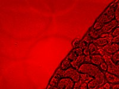|X:1388 Y:1040 C:4 Z:1 T:1||X:1388 Y:1040 C:4 Z:1 T:1|0|
|1|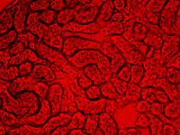|X:1388 Y:1040 C:4 Z:1 T:1||X:1388 Y:1040 C:4 Z:1 T:1|0|
|2|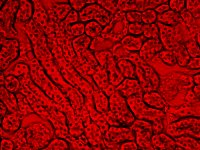|X:1388 Y:1040 C:4 Z:1 T:1||X:1388 Y:1040 C:4 Z:1 T:1|0|
|3|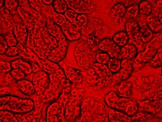|X:1388 Y:1040 C:4 Z:1 T:1||X:1388 Y:1040 C:4 Z:1 T:1|0|
|4|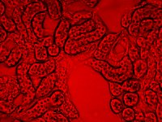|X:1388 Y:1040 C:4 Z:1 T:1||X:1388 Y:1040 C:4 Z:1 T:1|0|
|5|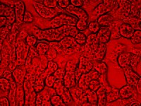|X:1388 Y:1040 C:4 Z:1 T:1||X:1388 Y:1040 C:4 Z:1 T:1|0|
|6|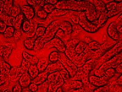|X:1388 Y:1040 C:4 Z:1 T:1||X:1388 Y:1040 C:4 Z:1 T:1|0|
|7||X:1388 Y:1040 C:4 Z:1 T:1|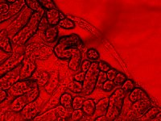|X:1388 Y:1040 C:4 Z:1 T:1|0|
|8|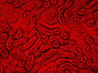|X:1388 Y:1040 C:4 Z:1 T:1||X:1388 Y:1040 C:4 Z:1 T:1|0|
|9|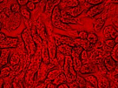|X:1388 Y:1040 C:4 Z:1 T:1||X:1388 Y:1040 C:4 Z:1 T:1|0|
|10|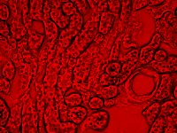|X:1388 Y:1040 C:4 Z:1 T:1||X:1388 Y:1040 C:4 Z:1 T:1|0|
|11|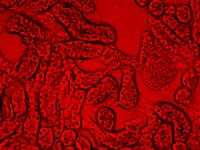|X:1388 Y:1040 C:4 Z:1 T:1||X:1388 Y:1040 C:4 Z:1 T:1|0|
|12|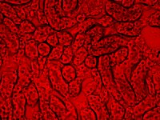|X:1388 Y:1040 C:4 Z:1 T:1||X:1388 Y:1040 C:4 Z:1 T:1|0|
|13|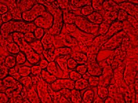|X:1388 Y:1040 C:4 Z:1 T:1||X:1388 Y:1040 C:4 Z:1 T:1|0|
|14|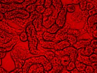|X:1388 Y:1040 C:4 Z:1 T:1||X:1388 Y:1040 C:4 Z:1 T:1|0|
|15|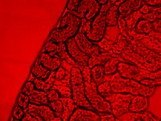|X:1388 Y:1040 C:4 Z:1 T:1||X:1388 Y:1040 C:4 Z:1 T:1|0|
|16|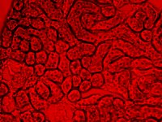|X:1388 Y:1040 C:4 Z:1 T:1||X:1388 Y:1040 C:4 Z:1 T:1|0|
|17|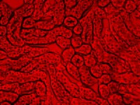|X:1388 Y:1040 C:4 Z:1 T:1||X:1388 Y:1040 C:4 Z:1 T:1|0|
|18|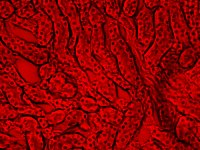|X:1388 Y:1040 C:4 Z:1 T:1||X:1388 Y:1040 C:4 Z:1 T:1|0|
|19|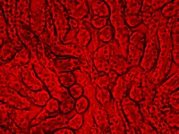|X:1388 Y:1040 C:4 Z:1 T:1||X:1388 Y:1040 C:4 Z:1 T:1|0|
|20|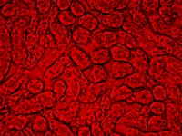|X:1388 Y:1040 C:4 Z:1 T:1||X:1388 Y:1040 C:4 Z:1 T:1|0|
|21|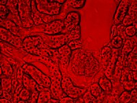|X:1388 Y:1040 C:4 Z:1 T:1||X:1388 Y:1040 C:4 Z:1 T:1|0|
|22|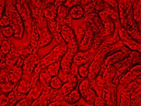|X:1388 Y:1040 C:4 Z:1 T:1||X:1388 Y:1040 C:4 Z:1 T:1|0|
|23|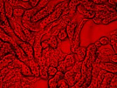|X:1388 Y:1040 C:4 Z:1 T:1||X:1388 Y:1040 C:4 Z:1 T:1|0|
|24|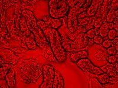|X:1388 Y:1040 C:4 Z:1 T:1||X:1388 Y:1040 C:4 Z:1 T:1|0|
|25|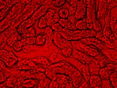|X:1388 Y:1040 C:4 Z:1 T:1||X:1388 Y:1040 C:4 Z:1 T:1|0|
|26|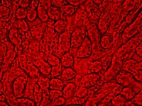|X:1388 Y:1040 C:4 Z:1 T:1||X:1388 Y:1040 C:4 Z:1 T:1|0|
|27|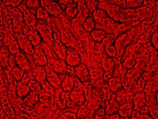|X:1388 Y:1040 C:4 Z:1 T:1||X:1388 Y:1040 C:4 Z:1 T:1|0|
|28|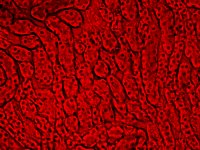|X:1388 Y:1040 C:4 Z:1 T:1||X:1388 Y:1040 C:4 Z:1 T:1|0|
|29|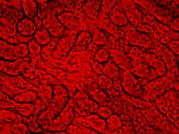|X:1388 Y:1040 C:4 Z:1 T:1||X:1388 Y:1040 C:4 Z:1 T:1|0|
|30|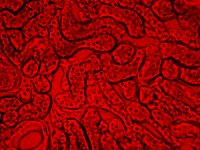|X:1388 Y:1040 C:4 Z:1 T:1||X:1388 Y:1040 C:4 Z:1 T:1|0|
|31|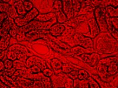|X:1388 Y:1040 C:4 Z:1 T:1||X:1388 Y:1040 C:4 Z:1 T:1|0|
|32||X:1388 Y:1040 C:4 Z:1 T:1|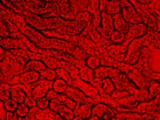|X:1388 Y:1040 C:4 Z:1 T:1|0|
|33|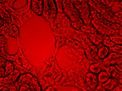|X:1388 Y:1040 C:4 Z:1 T:1||X:1388 Y:1040 C:4 Z:1 T:1|0|
|34|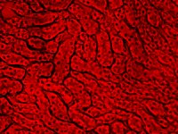|X:1388 Y:1040 C:4 Z:1 T:1||X:1388 Y:1040 C:4 Z:1 T:1|0|
|35|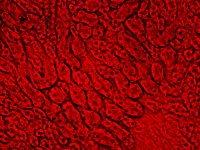|X:1388 Y:1040 C:4 Z:1 T:1||X:1388 Y:1040 C:4 Z:1 T:1|0|
|36|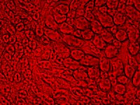|X:1388 Y:1040 C:4 Z:1 T:1||X:1388 Y:1040 C:4 Z:1 T:1|0|
|37|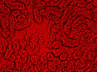|X:1388 Y:1040 C:4 Z:1 T:1||X:1388 Y:1040 C:4 Z:1 T:1|0|
|38|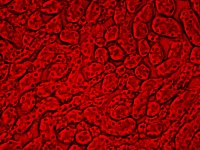|X:1388 Y:1040 C:4 Z:1 T:1||X:1388 Y:1040 C:4 Z:1 T:1|0|
|39|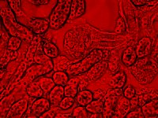|X:1388 Y:1040 C:4 Z:1 T:1||X:1388 Y:1040 C:4 Z:1 T:1|0|
|40|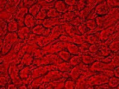|X:1388 Y:1040 C:4 Z:1 T:1||X:1388 Y:1040 C:4 Z:1 T:1|0|
|41|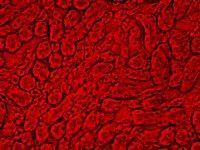|X:1388 Y:1040 C:4 Z:1 T:1||X:1388 Y:1040 C:4 Z:1 T:1|0|
|42|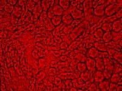|X:1388 Y:1040 C:4 Z:1 T:1||X:1388 Y:1040 C:4 Z:1 T:1|0|
|43|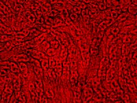|X:1388 Y:1040 C:4 Z:1 T:1||X:1388 Y:1040 C:4 Z:1 T:1|0|
|44|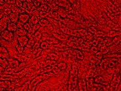|X:1388 Y:1040 C:4 Z:1 T:1||X:1388 Y:1040 C:4 Z:1 T:1|0|
|45|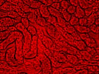|X:1388 Y:1040 C:4 Z:1 T:1||X:1388 Y:1040 C:4 Z:1 T:1|0|
|46|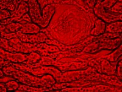|X:1388 Y:1040 C:4 Z:1 T:1||X:1388 Y:1040 C:4 Z:1 T:1|0|
|47|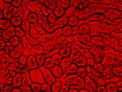|X:1388 Y:1040 C:4 Z:1 T:1||X:1388 Y:1040 C:4 Z:1 T:1|0|
|48|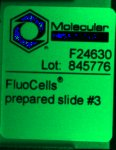|X:544 Y:699 C:3 Z:1 T:1||X:544 Y:699 C:3 Z:1 T:1|0|

# Metadata

