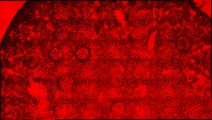
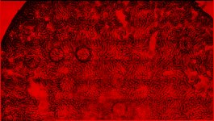
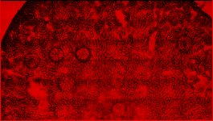
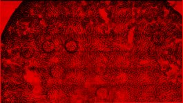
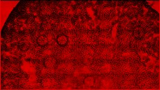
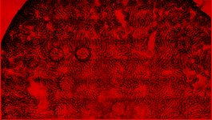
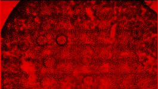
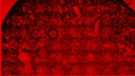
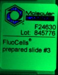

|  Method            | Parameters       | Quick Start Reader | Original Reader | Delta  |
| -------------------|------------------|--------------------|-----------------|------- |
| Initialization     |                  |73 ms|87 ms|        |
| Reader Size (Mb)     |                  |3.28|3.71|        |
| getStageLabelName| Image 0 | ScanRegion0| Scene position #0| |
| getStageLabelX| Image 0 | -21531.003 um | -20120.969 um | 1410.034 um |
| getStageLabelY| Image 0 | 7410.727 um | 8166.990 um | 756.262 um |
| getStageLabelZ| Image 0 | 4276.533 um | 4279.464 um | 2.931 um |
| getStageLabelName| Image 1 | ScanRegion0| Scene position #1| |
| getStageLabelX| Image 1 | -21531.003 um | -20120.969 um | 1410.034 um |
| getStageLabelY| Image 1 | 7410.727 um | 8166.990 um | 756.262 um |
| getStageLabelZ| Image 1 |  1: ome.units.quantity.Length: value[4276.533], unit[µm] stored as java.lang.Double| 2: null |
| getPixelsPhysicalSizeX| Image 1 | 0.645 um | 0.323 um | 0.323 um |
| getPixelsPhysicalSizeY| Image 1 | 0.645 um | 0.323 um | 0.323 um |
| getStageLabelName| Image 2 | ScanRegion0| Scene position #2| |
| getStageLabelX| Image 2 | -21531.003 um | -20120.969 um | 1410.034 um |
| getStageLabelY| Image 2 | 7410.727 um | 8166.990 um | 756.262 um |
| getStageLabelZ| Image 2 |  1: ome.units.quantity.Length: value[4276.533], unit[µm] stored as java.lang.Double| 2: null |
| getPixelsPhysicalSizeX| Image 2 | 1.290 um | 0.323 um | 0.968 um |
| getPixelsPhysicalSizeY| Image 2 | 1.290 um | 0.323 um | 0.968 um |
| getStageLabelName| Image 3 | ScanRegion0| Scene position #3| |
| getStageLabelX| Image 3 | -21531.003 um | -20120.969 um | 1410.034 um |
| getStageLabelY| Image 3 | 7410.727 um | 8166.990 um | 756.262 um |
| getStageLabelZ| Image 3 |  1: ome.units.quantity.Length: value[4276.533], unit[µm] stored as java.lang.Double| 2: null |
| getPixelsPhysicalSizeX| Image 3 | 2.580 um | 0.323 um | 2.258 um |
| getPixelsPhysicalSizeY| Image 3 | 2.580 um | 0.323 um | 2.258 um |
| getStageLabelName| Image 4 | ScanRegion0| Scene position #4| |
| getStageLabelX| Image 4 | -21531.003 um | -20120.969 um | 1410.034 um |
| getStageLabelY| Image 4 | 7410.727 um | 8166.990 um | 756.262 um |
| getStageLabelZ| Image 4 |  1: ome.units.quantity.Length: value[4276.533], unit[µm] stored as java.lang.Double| 2: null |
| getPixelsPhysicalSizeX| Image 4 | 5.160 um | 0.323 um | 4.838 um |
| getPixelsPhysicalSizeY| Image 4 | 5.160 um | 0.323 um | 4.838 um |
| getImageAcquisitionDate| Image 5 |  1: null| 2: 2012-11-25T09:08:25.992 |
| getPixelsPhysicalSizeX| Image 5 |  1: null| 2: ome.units.quantity.Length: value[0.3225], unit[µm] stored as java.lang.Double |
| getPixelsPhysicalSizeY| Image 5 |  1: null| 2: ome.units.quantity.Length: value[0.3225], unit[µm] stored as java.lang.Double |
| getPlanePositionX| Image 0 Plane 0 | -21531.003 um | -20120.969 um | 1410.034 um |
| getPlanePositionY| Image 0 Plane 0 | 7410.727 um | 8166.990 um | 756.262 um |
| getPlanePositionZ| Image 0 Plane 0 | 4276.533 um | 4279.464 um | 2.931 um |
| getPlanePositionX| Image 0 Plane 1 | -21531.003 um | -20120.969 um | 1410.034 um |
| getPlanePositionY| Image 0 Plane 1 | 7410.727 um | 8166.990 um | 756.262 um |
| getPlanePositionZ| Image 0 Plane 1 | 4276.533 um | 4279.464 um | 2.931 um |
| getPlanePositionX| Image 0 Plane 2 | -21531.003 um | -20120.969 um | 1410.034 um |
| getPlanePositionY| Image 0 Plane 2 | 7410.727 um | 8166.990 um | 756.262 um |
| getPlanePositionZ| Image 0 Plane 2 | 4276.533 um | 4279.045 um | 2.512 um |
| getPlanePositionX| Image 0 Plane 3 | -21531.003 um | -20120.969 um | 1410.034 um |
| getPlanePositionY| Image 0 Plane 3 | 7410.727 um | 8166.990 um | 756.262 um |
| getPlanePositionZ| Image 0 Plane 3 | 4276.533 um | 4279.464 um | 2.931 um |
| getPlanePositionX| Image 1 Plane 0 | -21531.003 um | -20120.969 um | 1410.034 um |
| getPlanePositionY| Image 1 Plane 0 | 7410.727 um | 8166.990 um | 756.262 um |
| getPlanePositionZ| Image 1 Plane 0 |  1: ome.units.quantity.Length: value[4276.533], unit[µm] stored as java.lang.Double| 2: null |
| getPlaneDeltaT| Image 1 Plane 1 |  4.438 s |  2.743 s | 1.695 s |
| getPlanePositionX| Image 1 Plane 1 | -21531.003 um | -20120.969 um | 1410.034 um |
| getPlanePositionY| Image 1 Plane 1 | 7410.727 um | 8166.990 um | 756.262 um |
| getPlanePositionZ| Image 1 Plane 1 |  1: ome.units.quantity.Length: value[4276.533], unit[µm] stored as java.lang.Double| 2: null |
| getPlaneDeltaT| Image 1 Plane 2 |  9.076 s |  2.743 s | 6.333 s |
| getPlanePositionX| Image 1 Plane 2 | -21531.003 um | -20120.969 um | 1410.034 um |
| getPlanePositionY| Image 1 Plane 2 | 7410.727 um | 8166.990 um | 756.262 um |
| getPlanePositionZ| Image 1 Plane 2 |  1: ome.units.quantity.Length: value[4276.533], unit[µm] stored as java.lang.Double| 2: null |
| getPlaneDeltaT| Image 1 Plane 3 |  5.207 s |  2.743 s | 2.464 s |
| getPlanePositionX| Image 1 Plane 3 | -21531.003 um | -20120.969 um | 1410.034 um |
| getPlanePositionY| Image 1 Plane 3 | 7410.727 um | 8166.990 um | 756.262 um |
| getPlanePositionZ| Image 1 Plane 3 |  1: ome.units.quantity.Length: value[4276.533], unit[µm] stored as java.lang.Double| 2: null |
| getPlanePositionX| Image 2 Plane 0 | -21531.003 um | -20120.969 um | 1410.034 um |
| getPlanePositionY| Image 2 Plane 0 | 7410.727 um | 8166.990 um | 756.262 um |
| getPlanePositionZ| Image 2 Plane 0 |  1: ome.units.quantity.Length: value[4276.533], unit[µm] stored as java.lang.Double| 2: null |
| getPlaneDeltaT| Image 2 Plane 1 |  4.438 s |  2.743 s | 1.695 s |
| getPlanePositionX| Image 2 Plane 1 | -21531.003 um | -20120.969 um | 1410.034 um |
| getPlanePositionY| Image 2 Plane 1 | 7410.727 um | 8166.990 um | 756.262 um |
| getPlanePositionZ| Image 2 Plane 1 |  1: ome.units.quantity.Length: value[4276.533], unit[µm] stored as java.lang.Double| 2: null |
| getPlaneDeltaT| Image 2 Plane 2 |  9.076 s |  2.743 s | 6.333 s |
| getPlanePositionX| Image 2 Plane 2 | -21531.003 um | -20120.969 um | 1410.034 um |
| getPlanePositionY| Image 2 Plane 2 | 7410.727 um | 8166.990 um | 756.262 um |
| getPlanePositionZ| Image 2 Plane 2 |  1: ome.units.quantity.Length: value[4276.533], unit[µm] stored as java.lang.Double| 2: null |
| getPlaneDeltaT| Image 2 Plane 3 |  5.207 s |  2.743 s | 2.464 s |
| getPlanePositionX| Image 2 Plane 3 | -21531.003 um | -20120.969 um | 1410.034 um |
| getPlanePositionY| Image 2 Plane 3 | 7410.727 um | 8166.990 um | 756.262 um |
| getPlanePositionZ| Image 2 Plane 3 |  1: ome.units.quantity.Length: value[4276.533], unit[µm] stored as java.lang.Double| 2: null |
| getPlanePositionX| Image 3 Plane 0 | -21531.003 um | -20120.969 um | 1410.034 um |
| getPlanePositionY| Image 3 Plane 0 | 7410.727 um | 8166.990 um | 756.262 um |
| getPlanePositionZ| Image 3 Plane 0 |  1: ome.units.quantity.Length: value[4276.533], unit[µm] stored as java.lang.Double| 2: null |
| getPlaneDeltaT| Image 3 Plane 1 |  4.438 s |  2.743 s | 1.695 s |
| getPlanePositionX| Image 3 Plane 1 | -21531.003 um | -20120.969 um | 1410.034 um |
| getPlanePositionY| Image 3 Plane 1 | 7410.727 um | 8166.990 um | 756.262 um |
| getPlanePositionZ| Image 3 Plane 1 |  1: ome.units.quantity.Length: value[4276.533], unit[µm] stored as java.lang.Double| 2: null |
| getPlaneDeltaT| Image 3 Plane 2 |  9.076 s |  2.743 s | 6.333 s |
| getPlanePositionX| Image 3 Plane 2 | -21531.003 um | -20120.969 um | 1410.034 um |
| getPlanePositionY| Image 3 Plane 2 | 7410.727 um | 8166.990 um | 756.262 um |
| getPlanePositionZ| Image 3 Plane 2 |  1: ome.units.quantity.Length: value[4276.533], unit[µm] stored as java.lang.Double| 2: null |
| getPlaneDeltaT| Image 3 Plane 3 |  5.207 s |  2.743 s | 2.464 s |
| getPlanePositionX| Image 3 Plane 3 | -21531.003 um | -20120.969 um | 1410.034 um |
| getPlanePositionY| Image 3 Plane 3 | 7410.727 um | 8166.990 um | 756.262 um |
| getPlanePositionZ| Image 3 Plane 3 |  1: ome.units.quantity.Length: value[4276.533], unit[µm] stored as java.lang.Double| 2: null |
| getPlanePositionX| Image 4 Plane 0 | -21531.003 um | -20120.969 um | 1410.034 um |
| getPlanePositionY| Image 4 Plane 0 | 7410.727 um | 8166.990 um | 756.262 um |
| getPlanePositionZ| Image 4 Plane 0 |  1: ome.units.quantity.Length: value[4276.533], unit[µm] stored as java.lang.Double| 2: null |
| getPlaneDeltaT| Image 4 Plane 1 |  4.438 s |  2.743 s | 1.695 s |
| getPlanePositionX| Image 4 Plane 1 | -21531.003 um | -20120.969 um | 1410.034 um |
| getPlanePositionY| Image 4 Plane 1 | 7410.727 um | 8166.990 um | 756.262 um |
| getPlanePositionZ| Image 4 Plane 1 |  1: ome.units.quantity.Length: value[4276.533], unit[µm] stored as java.lang.Double| 2: null |
| getPlaneDeltaT| Image 4 Plane 2 |  9.076 s |  2.743 s | 6.333 s |
| getPlanePositionX| Image 4 Plane 2 | -21531.003 um | -20120.969 um | 1410.034 um |
| getPlanePositionY| Image 4 Plane 2 | 7410.727 um | 8166.990 um | 756.262 um |
| getPlanePositionZ| Image 4 Plane 2 |  1: ome.units.quantity.Length: value[4276.533], unit[µm] stored as java.lang.Double| 2: null |
| getPlaneDeltaT| Image 4 Plane 3 |  5.207 s |  2.743 s | 2.464 s |
| getPlanePositionX| Image 4 Plane 3 | -21531.003 um | -20120.969 um | 1410.034 um |
| getPlanePositionY| Image 4 Plane 3 | 7410.727 um | 8166.990 um | 756.262 um |
| getPlanePositionZ| Image 4 Plane 3 |  1: ome.units.quantity.Length: value[4276.533], unit[µm] stored as java.lang.Double| 2: null |
# [Kidney_RAC_3color.czi](https://zenodo.org/records/10577621/files/Kidney_RAC_3color.czi) report
 - **Autostitch** = true
 - ZeissCZIReader v7.1.0
 - ZeissQuickStartCZIReader v0.2.4-SNAPSHOT

# Images 

| Series            | Quick Start Reader | Size | Original Reader | Size | #Diffs |
|-------------------|--------------------|------|-----------------|------|--------|
| Read time (all)   |8771 ms|------|10597 ms|------|--------|
|0||X:10128 Y:5718 C:4 Z:1 T:1||X:10128 Y:5718 C:4 Z:1 T:1|0|
|1||X:5064 Y:2859 C:4 Z:1 T:1||X:5064 Y:2859 C:4 Z:1 T:1|39722|
|2||X:2532 Y:1429 C:4 Z:1 T:1||X:2532 Y:1429 C:4 Z:1 T:1|39748|
|3||X:1266 Y:714 C:4 Z:1 T:1||X:1266 Y:714 C:4 Z:1 T:1|39747|
|4||X:633 Y:357 C:4 Z:1 T:1||X:633 Y:357 C:4 Z:1 T:1|39749|
|5||X:544 Y:699 C:3 Z:1 T:1||X:544 Y:699 C:3 Z:1 T:1|0|

# Metadata

