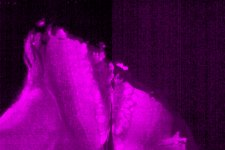
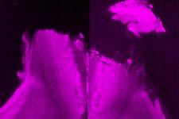

|  Method            | Parameters       | Quick Start Reader | Original Reader | Delta  |
| -------------------|------------------|--------------------|-----------------|------- |
| Initialization     |                  |16 ms|12 ms|        |
| Reader Size (Mb)     |                  |0.22|0.49|        |
| getStageLabelName| Image 1 | Scene position #0| Scene position #1| |
| getStageLabelX| Image 1 | ome.units.quantity.Length: value[-387.375], unit[µm] stored as java.lang.Double| ome.units.quantity.Length: value[0], unit[reference frame] stored as java.lang.Integer| |
| getStageLabelY| Image 1 | ome.units.quantity.Length: value[16038.0], unit[µm] stored as java.lang.Double| ome.units.quantity.Length: value[0], unit[reference frame] stored as java.lang.Integer| |
| getStageLabelZ| Image 1 |  1: ome.units.quantity.Length: value[-1487.55], unit[µm] stored as java.lang.Double| 2: null |
| getPlanePositionX| Image 1 Plane 0 | ome.units.quantity.Length: value[-387.375], unit[µm] stored as java.lang.Double| ome.units.quantity.Length: value[0], unit[reference frame] stored as java.lang.Integer| |
| getPlanePositionY| Image 1 Plane 0 | ome.units.quantity.Length: value[16038.0], unit[µm] stored as java.lang.Double| ome.units.quantity.Length: value[0], unit[reference frame] stored as java.lang.Integer| |
| getPlanePositionZ| Image 1 Plane 0 |  1: ome.units.quantity.Length: value[-1487.55], unit[µm] stored as java.lang.Double| 2: null |
| getPlanePositionX| Image 1 Plane 1 | ome.units.quantity.Length: value[-387.375], unit[µm] stored as java.lang.Double| ome.units.quantity.Length: value[0], unit[reference frame] stored as java.lang.Integer| |
| getPlanePositionY| Image 1 Plane 1 | ome.units.quantity.Length: value[16038.0], unit[µm] stored as java.lang.Double| ome.units.quantity.Length: value[0], unit[reference frame] stored as java.lang.Integer| |
| getPlanePositionZ| Image 1 Plane 1 |  1: ome.units.quantity.Length: value[-1487.55], unit[µm] stored as java.lang.Double| 2: null |
| getPlanePositionX| Image 1 Plane 2 | ome.units.quantity.Length: value[-387.375], unit[µm] stored as java.lang.Double| ome.units.quantity.Length: value[0], unit[reference frame] stored as java.lang.Integer| |
| getPlanePositionY| Image 1 Plane 2 | ome.units.quantity.Length: value[16038.0], unit[µm] stored as java.lang.Double| ome.units.quantity.Length: value[0], unit[reference frame] stored as java.lang.Integer| |
| getPlanePositionZ| Image 1 Plane 2 |  1: ome.units.quantity.Length: value[-1480.55], unit[µm] stored as java.lang.Double| 2: null |
| getPlanePositionX| Image 1 Plane 3 | ome.units.quantity.Length: value[-387.375], unit[µm] stored as java.lang.Double| ome.units.quantity.Length: value[0], unit[reference frame] stored as java.lang.Integer| |
| getPlanePositionY| Image 1 Plane 3 | ome.units.quantity.Length: value[16038.0], unit[µm] stored as java.lang.Double| ome.units.quantity.Length: value[0], unit[reference frame] stored as java.lang.Integer| |
| getPlanePositionZ| Image 1 Plane 3 |  1: ome.units.quantity.Length: value[-1480.55], unit[µm] stored as java.lang.Double| 2: null |
| getPlanePositionX| Image 1 Plane 4 | ome.units.quantity.Length: value[-387.375], unit[µm] stored as java.lang.Double| ome.units.quantity.Length: value[0], unit[reference frame] stored as java.lang.Integer| |
| getPlanePositionY| Image 1 Plane 4 | ome.units.quantity.Length: value[16038.0], unit[µm] stored as java.lang.Double| ome.units.quantity.Length: value[0], unit[reference frame] stored as java.lang.Integer| |
| getPlanePositionZ| Image 1 Plane 4 |  1: ome.units.quantity.Length: value[-1473.55], unit[µm] stored as java.lang.Double| 2: null |
| getPlanePositionX| Image 1 Plane 5 | ome.units.quantity.Length: value[-387.375], unit[µm] stored as java.lang.Double| ome.units.quantity.Length: value[0], unit[reference frame] stored as java.lang.Integer| |
| getPlanePositionY| Image 1 Plane 5 | ome.units.quantity.Length: value[16038.0], unit[µm] stored as java.lang.Double| ome.units.quantity.Length: value[0], unit[reference frame] stored as java.lang.Integer| |
| getPlanePositionZ| Image 1 Plane 5 |  1: ome.units.quantity.Length: value[-1473.55], unit[µm] stored as java.lang.Double| 2: null |
| getPlanePositionX| Image 1 Plane 6 | ome.units.quantity.Length: value[-387.375], unit[µm] stored as java.lang.Double| ome.units.quantity.Length: value[0], unit[reference frame] stored as java.lang.Integer| |
| getPlanePositionY| Image 1 Plane 6 | ome.units.quantity.Length: value[16038.0], unit[µm] stored as java.lang.Double| ome.units.quantity.Length: value[0], unit[reference frame] stored as java.lang.Integer| |
| getPlanePositionZ| Image 1 Plane 6 |  1: ome.units.quantity.Length: value[-1466.55], unit[µm] stored as java.lang.Double| 2: null |
| getPlanePositionX| Image 1 Plane 7 | ome.units.quantity.Length: value[-387.375], unit[µm] stored as java.lang.Double| ome.units.quantity.Length: value[0], unit[reference frame] stored as java.lang.Integer| |
| getPlanePositionY| Image 1 Plane 7 | ome.units.quantity.Length: value[16038.0], unit[µm] stored as java.lang.Double| ome.units.quantity.Length: value[0], unit[reference frame] stored as java.lang.Integer| |
| getPlanePositionZ| Image 1 Plane 7 |  1: ome.units.quantity.Length: value[-1466.55], unit[µm] stored as java.lang.Double| 2: null |
| getPlanePositionX| Image 1 Plane 8 | ome.units.quantity.Length: value[-387.375], unit[µm] stored as java.lang.Double| ome.units.quantity.Length: value[0], unit[reference frame] stored as java.lang.Integer| |
| getPlanePositionY| Image 1 Plane 8 | ome.units.quantity.Length: value[16038.0], unit[µm] stored as java.lang.Double| ome.units.quantity.Length: value[0], unit[reference frame] stored as java.lang.Integer| |
| getPlanePositionZ| Image 1 Plane 8 |  1: ome.units.quantity.Length: value[-1459.55], unit[µm] stored as java.lang.Double| 2: null |
| getPlanePositionX| Image 1 Plane 9 | ome.units.quantity.Length: value[-387.375], unit[µm] stored as java.lang.Double| ome.units.quantity.Length: value[0], unit[reference frame] stored as java.lang.Integer| |
| getPlanePositionY| Image 1 Plane 9 | ome.units.quantity.Length: value[16038.0], unit[µm] stored as java.lang.Double| ome.units.quantity.Length: value[0], unit[reference frame] stored as java.lang.Integer| |
| getPlanePositionZ| Image 1 Plane 9 |  1: ome.units.quantity.Length: value[-1459.55], unit[µm] stored as java.lang.Double| 2: null |
| getPlanePositionX| Image 1 Plane 10 | ome.units.quantity.Length: value[-387.375], unit[µm] stored as java.lang.Double| ome.units.quantity.Length: value[0], unit[reference frame] stored as java.lang.Integer| |
| getPlanePositionY| Image 1 Plane 10 | ome.units.quantity.Length: value[16038.0], unit[µm] stored as java.lang.Double| ome.units.quantity.Length: value[0], unit[reference frame] stored as java.lang.Integer| |
| getPlanePositionZ| Image 1 Plane 10 |  1: ome.units.quantity.Length: value[-1452.55], unit[µm] stored as java.lang.Double| 2: null |
| getPlanePositionX| Image 1 Plane 11 | ome.units.quantity.Length: value[-387.375], unit[µm] stored as java.lang.Double| ome.units.quantity.Length: value[0], unit[reference frame] stored as java.lang.Integer| |
| getPlanePositionY| Image 1 Plane 11 | ome.units.quantity.Length: value[16038.0], unit[µm] stored as java.lang.Double| ome.units.quantity.Length: value[0], unit[reference frame] stored as java.lang.Integer| |
| getPlanePositionZ| Image 1 Plane 11 |  1: ome.units.quantity.Length: value[-1452.55], unit[µm] stored as java.lang.Double| 2: null |
| getPlanePositionX| Image 1 Plane 12 | ome.units.quantity.Length: value[-387.375], unit[µm] stored as java.lang.Double| ome.units.quantity.Length: value[0], unit[reference frame] stored as java.lang.Integer| |
| getPlanePositionY| Image 1 Plane 12 | ome.units.quantity.Length: value[16038.0], unit[µm] stored as java.lang.Double| ome.units.quantity.Length: value[0], unit[reference frame] stored as java.lang.Integer| |
| getPlanePositionZ| Image 1 Plane 12 |  1: ome.units.quantity.Length: value[-1445.55], unit[µm] stored as java.lang.Double| 2: null |
| getPlanePositionX| Image 1 Plane 13 | ome.units.quantity.Length: value[-387.375], unit[µm] stored as java.lang.Double| ome.units.quantity.Length: value[0], unit[reference frame] stored as java.lang.Integer| |
| getPlanePositionY| Image 1 Plane 13 | ome.units.quantity.Length: value[16038.0], unit[µm] stored as java.lang.Double| ome.units.quantity.Length: value[0], unit[reference frame] stored as java.lang.Integer| |
| getPlanePositionZ| Image 1 Plane 13 |  1: ome.units.quantity.Length: value[-1445.55], unit[µm] stored as java.lang.Double| 2: null |
| getPlanePositionX| Image 1 Plane 14 | ome.units.quantity.Length: value[-387.375], unit[µm] stored as java.lang.Double| ome.units.quantity.Length: value[0], unit[reference frame] stored as java.lang.Integer| |
| getPlanePositionY| Image 1 Plane 14 | ome.units.quantity.Length: value[16038.0], unit[µm] stored as java.lang.Double| ome.units.quantity.Length: value[0], unit[reference frame] stored as java.lang.Integer| |
| getPlanePositionZ| Image 1 Plane 14 |  1: ome.units.quantity.Length: value[-1438.55], unit[µm] stored as java.lang.Double| 2: null |
| getPlanePositionX| Image 1 Plane 15 | ome.units.quantity.Length: value[-387.375], unit[µm] stored as java.lang.Double| ome.units.quantity.Length: value[0], unit[reference frame] stored as java.lang.Integer| |
| getPlanePositionY| Image 1 Plane 15 | ome.units.quantity.Length: value[16038.0], unit[µm] stored as java.lang.Double| ome.units.quantity.Length: value[0], unit[reference frame] stored as java.lang.Integer| |
| getPlanePositionZ| Image 1 Plane 15 |  1: ome.units.quantity.Length: value[-1438.55], unit[µm] stored as java.lang.Double| 2: null |
| getPlanePositionX| Image 1 Plane 16 | ome.units.quantity.Length: value[-387.375], unit[µm] stored as java.lang.Double| ome.units.quantity.Length: value[0], unit[reference frame] stored as java.lang.Integer| |
| getPlanePositionY| Image 1 Plane 16 | ome.units.quantity.Length: value[16038.0], unit[µm] stored as java.lang.Double| ome.units.quantity.Length: value[0], unit[reference frame] stored as java.lang.Integer| |
| getPlanePositionZ| Image 1 Plane 16 |  1: ome.units.quantity.Length: value[-1431.55], unit[µm] stored as java.lang.Double| 2: null |
| getPlanePositionX| Image 1 Plane 17 | ome.units.quantity.Length: value[-387.375], unit[µm] stored as java.lang.Double| ome.units.quantity.Length: value[0], unit[reference frame] stored as java.lang.Integer| |
| getPlanePositionY| Image 1 Plane 17 | ome.units.quantity.Length: value[16038.0], unit[µm] stored as java.lang.Double| ome.units.quantity.Length: value[0], unit[reference frame] stored as java.lang.Integer| |
| getPlanePositionZ| Image 1 Plane 17 |  1: ome.units.quantity.Length: value[-1431.55], unit[µm] stored as java.lang.Double| 2: null |
| getPlanePositionX| Image 1 Plane 18 | ome.units.quantity.Length: value[-387.375], unit[µm] stored as java.lang.Double| ome.units.quantity.Length: value[0], unit[reference frame] stored as java.lang.Integer| |
| getPlanePositionY| Image 1 Plane 18 | ome.units.quantity.Length: value[16038.0], unit[µm] stored as java.lang.Double| ome.units.quantity.Length: value[0], unit[reference frame] stored as java.lang.Integer| |
| getPlanePositionZ| Image 1 Plane 18 |  1: ome.units.quantity.Length: value[-1424.55], unit[µm] stored as java.lang.Double| 2: null |
| getPlanePositionX| Image 1 Plane 19 | ome.units.quantity.Length: value[-387.375], unit[µm] stored as java.lang.Double| ome.units.quantity.Length: value[0], unit[reference frame] stored as java.lang.Integer| |
| getPlanePositionY| Image 1 Plane 19 | ome.units.quantity.Length: value[16038.0], unit[µm] stored as java.lang.Double| ome.units.quantity.Length: value[0], unit[reference frame] stored as java.lang.Integer| |
| getPlanePositionZ| Image 1 Plane 19 |  1: ome.units.quantity.Length: value[-1424.55], unit[µm] stored as java.lang.Double| 2: null |
| getPlanePositionX| Image 1 Plane 20 | ome.units.quantity.Length: value[-387.375], unit[µm] stored as java.lang.Double| ome.units.quantity.Length: value[0], unit[reference frame] stored as java.lang.Integer| |
| getPlanePositionY| Image 1 Plane 20 | ome.units.quantity.Length: value[16038.0], unit[µm] stored as java.lang.Double| ome.units.quantity.Length: value[0], unit[reference frame] stored as java.lang.Integer| |
| getPlanePositionZ| Image 1 Plane 20 |  1: ome.units.quantity.Length: value[-1417.55], unit[µm] stored as java.lang.Double| 2: null |
| getPlanePositionX| Image 1 Plane 21 | ome.units.quantity.Length: value[-387.375], unit[µm] stored as java.lang.Double| ome.units.quantity.Length: value[0], unit[reference frame] stored as java.lang.Integer| |
| getPlanePositionY| Image 1 Plane 21 | ome.units.quantity.Length: value[16038.0], unit[µm] stored as java.lang.Double| ome.units.quantity.Length: value[0], unit[reference frame] stored as java.lang.Integer| |
| getPlanePositionZ| Image 1 Plane 21 |  1: ome.units.quantity.Length: value[-1417.55], unit[µm] stored as java.lang.Double| 2: null |
| getPlanePositionX| Image 1 Plane 22 | ome.units.quantity.Length: value[-387.375], unit[µm] stored as java.lang.Double| ome.units.quantity.Length: value[0], unit[reference frame] stored as java.lang.Integer| |
| getPlanePositionY| Image 1 Plane 22 | ome.units.quantity.Length: value[16038.0], unit[µm] stored as java.lang.Double| ome.units.quantity.Length: value[0], unit[reference frame] stored as java.lang.Integer| |
| getPlanePositionZ| Image 1 Plane 22 |  1: ome.units.quantity.Length: value[-1410.55], unit[µm] stored as java.lang.Double| 2: null |
| getPlanePositionX| Image 1 Plane 23 | ome.units.quantity.Length: value[-387.375], unit[µm] stored as java.lang.Double| ome.units.quantity.Length: value[0], unit[reference frame] stored as java.lang.Integer| |
| getPlanePositionY| Image 1 Plane 23 | ome.units.quantity.Length: value[16038.0], unit[µm] stored as java.lang.Double| ome.units.quantity.Length: value[0], unit[reference frame] stored as java.lang.Integer| |
| getPlanePositionZ| Image 1 Plane 23 |  1: ome.units.quantity.Length: value[-1410.55], unit[µm] stored as java.lang.Double| 2: null |
| getPlanePositionX| Image 1 Plane 24 | ome.units.quantity.Length: value[-387.375], unit[µm] stored as java.lang.Double| ome.units.quantity.Length: value[0], unit[reference frame] stored as java.lang.Integer| |
| getPlanePositionY| Image 1 Plane 24 | ome.units.quantity.Length: value[16038.0], unit[µm] stored as java.lang.Double| ome.units.quantity.Length: value[0], unit[reference frame] stored as java.lang.Integer| |
| getPlanePositionZ| Image 1 Plane 24 |  1: ome.units.quantity.Length: value[-1403.55], unit[µm] stored as java.lang.Double| 2: null |
| getPlanePositionX| Image 1 Plane 25 | ome.units.quantity.Length: value[-387.375], unit[µm] stored as java.lang.Double| ome.units.quantity.Length: value[0], unit[reference frame] stored as java.lang.Integer| |
| getPlanePositionY| Image 1 Plane 25 | ome.units.quantity.Length: value[16038.0], unit[µm] stored as java.lang.Double| ome.units.quantity.Length: value[0], unit[reference frame] stored as java.lang.Integer| |
| getPlanePositionZ| Image 1 Plane 25 |  1: ome.units.quantity.Length: value[-1403.55], unit[µm] stored as java.lang.Double| 2: null |
| getPlanePositionX| Image 1 Plane 26 | ome.units.quantity.Length: value[-387.375], unit[µm] stored as java.lang.Double| ome.units.quantity.Length: value[0], unit[reference frame] stored as java.lang.Integer| |
| getPlanePositionY| Image 1 Plane 26 | ome.units.quantity.Length: value[16038.0], unit[µm] stored as java.lang.Double| ome.units.quantity.Length: value[0], unit[reference frame] stored as java.lang.Integer| |
| getPlanePositionZ| Image 1 Plane 26 |  1: ome.units.quantity.Length: value[-1396.55], unit[µm] stored as java.lang.Double| 2: null |
| getPlanePositionX| Image 1 Plane 27 | ome.units.quantity.Length: value[-387.375], unit[µm] stored as java.lang.Double| ome.units.quantity.Length: value[0], unit[reference frame] stored as java.lang.Integer| |
| getPlanePositionY| Image 1 Plane 27 | ome.units.quantity.Length: value[16038.0], unit[µm] stored as java.lang.Double| ome.units.quantity.Length: value[0], unit[reference frame] stored as java.lang.Integer| |
| getPlanePositionZ| Image 1 Plane 27 |  1: ome.units.quantity.Length: value[-1396.55], unit[µm] stored as java.lang.Double| 2: null |
| getPlanePositionX| Image 1 Plane 28 | ome.units.quantity.Length: value[-387.375], unit[µm] stored as java.lang.Double| ome.units.quantity.Length: value[0], unit[reference frame] stored as java.lang.Integer| |
| getPlanePositionY| Image 1 Plane 28 | ome.units.quantity.Length: value[16038.0], unit[µm] stored as java.lang.Double| ome.units.quantity.Length: value[0], unit[reference frame] stored as java.lang.Integer| |
| getPlanePositionZ| Image 1 Plane 28 |  1: ome.units.quantity.Length: value[-1389.55], unit[µm] stored as java.lang.Double| 2: null |
| getPlanePositionX| Image 1 Plane 29 | ome.units.quantity.Length: value[-387.375], unit[µm] stored as java.lang.Double| ome.units.quantity.Length: value[0], unit[reference frame] stored as java.lang.Integer| |
| getPlanePositionY| Image 1 Plane 29 | ome.units.quantity.Length: value[16038.0], unit[µm] stored as java.lang.Double| ome.units.quantity.Length: value[0], unit[reference frame] stored as java.lang.Integer| |
| getPlanePositionZ| Image 1 Plane 29 |  1: ome.units.quantity.Length: value[-1389.55], unit[µm] stored as java.lang.Double| 2: null |
| getPlanePositionX| Image 1 Plane 30 | ome.units.quantity.Length: value[-387.375], unit[µm] stored as java.lang.Double| ome.units.quantity.Length: value[0], unit[reference frame] stored as java.lang.Integer| |
| getPlanePositionY| Image 1 Plane 30 | ome.units.quantity.Length: value[16038.0], unit[µm] stored as java.lang.Double| ome.units.quantity.Length: value[0], unit[reference frame] stored as java.lang.Integer| |
| getPlanePositionZ| Image 1 Plane 30 |  1: ome.units.quantity.Length: value[-1382.55], unit[µm] stored as java.lang.Double| 2: null |
| getPlanePositionX| Image 1 Plane 31 | ome.units.quantity.Length: value[-387.375], unit[µm] stored as java.lang.Double| ome.units.quantity.Length: value[0], unit[reference frame] stored as java.lang.Integer| |
| getPlanePositionY| Image 1 Plane 31 | ome.units.quantity.Length: value[16038.0], unit[µm] stored as java.lang.Double| ome.units.quantity.Length: value[0], unit[reference frame] stored as java.lang.Integer| |
| getPlanePositionZ| Image 1 Plane 31 |  1: ome.units.quantity.Length: value[-1382.55], unit[µm] stored as java.lang.Double| 2: null |
| getPlanePositionX| Image 1 Plane 32 | ome.units.quantity.Length: value[-387.375], unit[µm] stored as java.lang.Double| ome.units.quantity.Length: value[0], unit[reference frame] stored as java.lang.Integer| |
| getPlanePositionY| Image 1 Plane 32 | ome.units.quantity.Length: value[16038.0], unit[µm] stored as java.lang.Double| ome.units.quantity.Length: value[0], unit[reference frame] stored as java.lang.Integer| |
| getPlanePositionZ| Image 1 Plane 32 |  1: ome.units.quantity.Length: value[-1375.55], unit[µm] stored as java.lang.Double| 2: null |
| getPlanePositionX| Image 1 Plane 33 | ome.units.quantity.Length: value[-387.375], unit[µm] stored as java.lang.Double| ome.units.quantity.Length: value[0], unit[reference frame] stored as java.lang.Integer| |
| getPlanePositionY| Image 1 Plane 33 | ome.units.quantity.Length: value[16038.0], unit[µm] stored as java.lang.Double| ome.units.quantity.Length: value[0], unit[reference frame] stored as java.lang.Integer| |
| getPlanePositionZ| Image 1 Plane 33 |  1: ome.units.quantity.Length: value[-1375.55], unit[µm] stored as java.lang.Double| 2: null |
| getPlanePositionX| Image 1 Plane 34 | ome.units.quantity.Length: value[-387.375], unit[µm] stored as java.lang.Double| ome.units.quantity.Length: value[0], unit[reference frame] stored as java.lang.Integer| |
| getPlanePositionY| Image 1 Plane 34 | ome.units.quantity.Length: value[16038.0], unit[µm] stored as java.lang.Double| ome.units.quantity.Length: value[0], unit[reference frame] stored as java.lang.Integer| |
| getPlanePositionZ| Image 1 Plane 34 |  1: ome.units.quantity.Length: value[-1368.55], unit[µm] stored as java.lang.Double| 2: null |
| getPlanePositionX| Image 1 Plane 35 | ome.units.quantity.Length: value[-387.375], unit[µm] stored as java.lang.Double| ome.units.quantity.Length: value[0], unit[reference frame] stored as java.lang.Integer| |
| getPlanePositionY| Image 1 Plane 35 | ome.units.quantity.Length: value[16038.0], unit[µm] stored as java.lang.Double| ome.units.quantity.Length: value[0], unit[reference frame] stored as java.lang.Integer| |
| getPlanePositionZ| Image 1 Plane 35 |  1: ome.units.quantity.Length: value[-1368.55], unit[µm] stored as java.lang.Double| 2: null |
| getPlanePositionX| Image 1 Plane 36 | ome.units.quantity.Length: value[-387.375], unit[µm] stored as java.lang.Double| ome.units.quantity.Length: value[0], unit[reference frame] stored as java.lang.Integer| |
| getPlanePositionY| Image 1 Plane 36 | ome.units.quantity.Length: value[16038.0], unit[µm] stored as java.lang.Double| ome.units.quantity.Length: value[0], unit[reference frame] stored as java.lang.Integer| |
| getPlanePositionZ| Image 1 Plane 36 |  1: ome.units.quantity.Length: value[-1361.55], unit[µm] stored as java.lang.Double| 2: null |
| getPlanePositionX| Image 1 Plane 37 | ome.units.quantity.Length: value[-387.375], unit[µm] stored as java.lang.Double| ome.units.quantity.Length: value[0], unit[reference frame] stored as java.lang.Integer| |
| getPlanePositionY| Image 1 Plane 37 | ome.units.quantity.Length: value[16038.0], unit[µm] stored as java.lang.Double| ome.units.quantity.Length: value[0], unit[reference frame] stored as java.lang.Integer| |
| getPlanePositionZ| Image 1 Plane 37 |  1: ome.units.quantity.Length: value[-1361.55], unit[µm] stored as java.lang.Double| 2: null |
| getPlanePositionX| Image 1 Plane 38 | ome.units.quantity.Length: value[-387.375], unit[µm] stored as java.lang.Double| ome.units.quantity.Length: value[0], unit[reference frame] stored as java.lang.Integer| |
| getPlanePositionY| Image 1 Plane 38 | ome.units.quantity.Length: value[16038.0], unit[µm] stored as java.lang.Double| ome.units.quantity.Length: value[0], unit[reference frame] stored as java.lang.Integer| |
| getPlanePositionZ| Image 1 Plane 38 |  1: ome.units.quantity.Length: value[-1354.55], unit[µm] stored as java.lang.Double| 2: null |
| getPlanePositionX| Image 1 Plane 39 | ome.units.quantity.Length: value[-387.375], unit[µm] stored as java.lang.Double| ome.units.quantity.Length: value[0], unit[reference frame] stored as java.lang.Integer| |
| getPlanePositionY| Image 1 Plane 39 | ome.units.quantity.Length: value[16038.0], unit[µm] stored as java.lang.Double| ome.units.quantity.Length: value[0], unit[reference frame] stored as java.lang.Integer| |
| getPlanePositionZ| Image 1 Plane 39 |  1: ome.units.quantity.Length: value[-1354.55], unit[µm] stored as java.lang.Double| 2: null |
| getPlanePositionX| Image 1 Plane 40 | ome.units.quantity.Length: value[-387.375], unit[µm] stored as java.lang.Double| ome.units.quantity.Length: value[0], unit[reference frame] stored as java.lang.Integer| |
| getPlanePositionY| Image 1 Plane 40 | ome.units.quantity.Length: value[16038.0], unit[µm] stored as java.lang.Double| ome.units.quantity.Length: value[0], unit[reference frame] stored as java.lang.Integer| |
| getPlanePositionZ| Image 1 Plane 40 |  1: ome.units.quantity.Length: value[-1347.55], unit[µm] stored as java.lang.Double| 2: null |
| getPlanePositionX| Image 1 Plane 41 | ome.units.quantity.Length: value[-387.375], unit[µm] stored as java.lang.Double| ome.units.quantity.Length: value[0], unit[reference frame] stored as java.lang.Integer| |
| getPlanePositionY| Image 1 Plane 41 | ome.units.quantity.Length: value[16038.0], unit[µm] stored as java.lang.Double| ome.units.quantity.Length: value[0], unit[reference frame] stored as java.lang.Integer| |
| getPlanePositionZ| Image 1 Plane 41 |  1: ome.units.quantity.Length: value[-1347.55], unit[µm] stored as java.lang.Double| 2: null |
| getPlanePositionX| Image 1 Plane 42 | ome.units.quantity.Length: value[-387.375], unit[µm] stored as java.lang.Double| ome.units.quantity.Length: value[0], unit[reference frame] stored as java.lang.Integer| |
| getPlanePositionY| Image 1 Plane 42 | ome.units.quantity.Length: value[16038.0], unit[µm] stored as java.lang.Double| ome.units.quantity.Length: value[0], unit[reference frame] stored as java.lang.Integer| |
| getPlanePositionZ| Image 1 Plane 42 |  1: ome.units.quantity.Length: value[-1340.55], unit[µm] stored as java.lang.Double| 2: null |
| getPlanePositionX| Image 1 Plane 43 | ome.units.quantity.Length: value[-387.375], unit[µm] stored as java.lang.Double| ome.units.quantity.Length: value[0], unit[reference frame] stored as java.lang.Integer| |
| getPlanePositionY| Image 1 Plane 43 | ome.units.quantity.Length: value[16038.0], unit[µm] stored as java.lang.Double| ome.units.quantity.Length: value[0], unit[reference frame] stored as java.lang.Integer| |
| getPlanePositionZ| Image 1 Plane 43 |  1: ome.units.quantity.Length: value[-1340.55], unit[µm] stored as java.lang.Double| 2: null |
| getPlanePositionX| Image 1 Plane 44 | ome.units.quantity.Length: value[-387.375], unit[µm] stored as java.lang.Double| ome.units.quantity.Length: value[0], unit[reference frame] stored as java.lang.Integer| |
| getPlanePositionY| Image 1 Plane 44 | ome.units.quantity.Length: value[16038.0], unit[µm] stored as java.lang.Double| ome.units.quantity.Length: value[0], unit[reference frame] stored as java.lang.Integer| |
| getPlanePositionZ| Image 1 Plane 44 |  1: ome.units.quantity.Length: value[-1333.55], unit[µm] stored as java.lang.Double| 2: null |
| getPlanePositionX| Image 1 Plane 45 | ome.units.quantity.Length: value[-387.375], unit[µm] stored as java.lang.Double| ome.units.quantity.Length: value[0], unit[reference frame] stored as java.lang.Integer| |
| getPlanePositionY| Image 1 Plane 45 | ome.units.quantity.Length: value[16038.0], unit[µm] stored as java.lang.Double| ome.units.quantity.Length: value[0], unit[reference frame] stored as java.lang.Integer| |
| getPlanePositionZ| Image 1 Plane 45 |  1: ome.units.quantity.Length: value[-1333.55], unit[µm] stored as java.lang.Double| 2: null |
| getPlanePositionX| Image 1 Plane 46 | ome.units.quantity.Length: value[-387.375], unit[µm] stored as java.lang.Double| ome.units.quantity.Length: value[0], unit[reference frame] stored as java.lang.Integer| |
| getPlanePositionY| Image 1 Plane 46 | ome.units.quantity.Length: value[16038.0], unit[µm] stored as java.lang.Double| ome.units.quantity.Length: value[0], unit[reference frame] stored as java.lang.Integer| |
| getPlanePositionZ| Image 1 Plane 46 |  1: ome.units.quantity.Length: value[-1326.55], unit[µm] stored as java.lang.Double| 2: null |
| getPlanePositionX| Image 1 Plane 47 | ome.units.quantity.Length: value[-387.375], unit[µm] stored as java.lang.Double| ome.units.quantity.Length: value[0], unit[reference frame] stored as java.lang.Integer| |
| getPlanePositionY| Image 1 Plane 47 | ome.units.quantity.Length: value[16038.0], unit[µm] stored as java.lang.Double| ome.units.quantity.Length: value[0], unit[reference frame] stored as java.lang.Integer| |
| getPlanePositionZ| Image 1 Plane 47 |  1: ome.units.quantity.Length: value[-1326.55], unit[µm] stored as java.lang.Double| 2: null |
| getPlanePositionX| Image 1 Plane 48 | ome.units.quantity.Length: value[-387.375], unit[µm] stored as java.lang.Double| ome.units.quantity.Length: value[0], unit[reference frame] stored as java.lang.Integer| |
| getPlanePositionY| Image 1 Plane 48 | ome.units.quantity.Length: value[16038.0], unit[µm] stored as java.lang.Double| ome.units.quantity.Length: value[0], unit[reference frame] stored as java.lang.Integer| |
| getPlanePositionZ| Image 1 Plane 48 |  1: ome.units.quantity.Length: value[-1319.55], unit[µm] stored as java.lang.Double| 2: null |
| getPlanePositionX| Image 1 Plane 49 | ome.units.quantity.Length: value[-387.375], unit[µm] stored as java.lang.Double| ome.units.quantity.Length: value[0], unit[reference frame] stored as java.lang.Integer| |
| getPlanePositionY| Image 1 Plane 49 | ome.units.quantity.Length: value[16038.0], unit[µm] stored as java.lang.Double| ome.units.quantity.Length: value[0], unit[reference frame] stored as java.lang.Integer| |
| getPlanePositionZ| Image 1 Plane 49 |  1: ome.units.quantity.Length: value[-1319.55], unit[µm] stored as java.lang.Double| 2: null |
| getPlanePositionX| Image 1 Plane 50 | ome.units.quantity.Length: value[-387.375], unit[µm] stored as java.lang.Double| ome.units.quantity.Length: value[0], unit[reference frame] stored as java.lang.Integer| |
| getPlanePositionY| Image 1 Plane 50 | ome.units.quantity.Length: value[16038.0], unit[µm] stored as java.lang.Double| ome.units.quantity.Length: value[0], unit[reference frame] stored as java.lang.Integer| |
| getPlanePositionZ| Image 1 Plane 50 |  1: ome.units.quantity.Length: value[-1312.55], unit[µm] stored as java.lang.Double| 2: null |
| getPlanePositionX| Image 1 Plane 51 | ome.units.quantity.Length: value[-387.375], unit[µm] stored as java.lang.Double| ome.units.quantity.Length: value[0], unit[reference frame] stored as java.lang.Integer| |
| getPlanePositionY| Image 1 Plane 51 | ome.units.quantity.Length: value[16038.0], unit[µm] stored as java.lang.Double| ome.units.quantity.Length: value[0], unit[reference frame] stored as java.lang.Integer| |
| getPlanePositionZ| Image 1 Plane 51 |  1: ome.units.quantity.Length: value[-1312.55], unit[µm] stored as java.lang.Double| 2: null |
| getPlanePositionX| Image 1 Plane 52 | ome.units.quantity.Length: value[-387.375], unit[µm] stored as java.lang.Double| ome.units.quantity.Length: value[0], unit[reference frame] stored as java.lang.Integer| |
| getPlanePositionY| Image 1 Plane 52 | ome.units.quantity.Length: value[16038.0], unit[µm] stored as java.lang.Double| ome.units.quantity.Length: value[0], unit[reference frame] stored as java.lang.Integer| |
| getPlanePositionZ| Image 1 Plane 52 |  1: ome.units.quantity.Length: value[-1305.55], unit[µm] stored as java.lang.Double| 2: null |
| getPlanePositionX| Image 1 Plane 53 | ome.units.quantity.Length: value[-387.375], unit[µm] stored as java.lang.Double| ome.units.quantity.Length: value[0], unit[reference frame] stored as java.lang.Integer| |
| getPlanePositionY| Image 1 Plane 53 | ome.units.quantity.Length: value[16038.0], unit[µm] stored as java.lang.Double| ome.units.quantity.Length: value[0], unit[reference frame] stored as java.lang.Integer| |
| getPlanePositionZ| Image 1 Plane 53 |  1: ome.units.quantity.Length: value[-1305.55], unit[µm] stored as java.lang.Double| 2: null |
| getPlanePositionX| Image 1 Plane 54 | ome.units.quantity.Length: value[-387.375], unit[µm] stored as java.lang.Double| ome.units.quantity.Length: value[0], unit[reference frame] stored as java.lang.Integer| |
| getPlanePositionY| Image 1 Plane 54 | ome.units.quantity.Length: value[16038.0], unit[µm] stored as java.lang.Double| ome.units.quantity.Length: value[0], unit[reference frame] stored as java.lang.Integer| |
| getPlanePositionZ| Image 1 Plane 54 |  1: ome.units.quantity.Length: value[-1298.55], unit[µm] stored as java.lang.Double| 2: null |
| getPlanePositionX| Image 1 Plane 55 | ome.units.quantity.Length: value[-387.375], unit[µm] stored as java.lang.Double| ome.units.quantity.Length: value[0], unit[reference frame] stored as java.lang.Integer| |
| getPlanePositionY| Image 1 Plane 55 | ome.units.quantity.Length: value[16038.0], unit[µm] stored as java.lang.Double| ome.units.quantity.Length: value[0], unit[reference frame] stored as java.lang.Integer| |
| getPlanePositionZ| Image 1 Plane 55 |  1: ome.units.quantity.Length: value[-1298.55], unit[µm] stored as java.lang.Double| 2: null |
| getPlanePositionX| Image 1 Plane 56 | ome.units.quantity.Length: value[-387.375], unit[µm] stored as java.lang.Double| ome.units.quantity.Length: value[0], unit[reference frame] stored as java.lang.Integer| |
| getPlanePositionY| Image 1 Plane 56 | ome.units.quantity.Length: value[16038.0], unit[µm] stored as java.lang.Double| ome.units.quantity.Length: value[0], unit[reference frame] stored as java.lang.Integer| |
| getPlanePositionZ| Image 1 Plane 56 |  1: ome.units.quantity.Length: value[-1291.55], unit[µm] stored as java.lang.Double| 2: null |
| getPlanePositionX| Image 1 Plane 57 | ome.units.quantity.Length: value[-387.375], unit[µm] stored as java.lang.Double| ome.units.quantity.Length: value[0], unit[reference frame] stored as java.lang.Integer| |
| getPlanePositionY| Image 1 Plane 57 | ome.units.quantity.Length: value[16038.0], unit[µm] stored as java.lang.Double| ome.units.quantity.Length: value[0], unit[reference frame] stored as java.lang.Integer| |
| getPlanePositionZ| Image 1 Plane 57 |  1: ome.units.quantity.Length: value[-1291.55], unit[µm] stored as java.lang.Double| 2: null |
| getPlanePositionX| Image 1 Plane 58 | ome.units.quantity.Length: value[-387.375], unit[µm] stored as java.lang.Double| ome.units.quantity.Length: value[0], unit[reference frame] stored as java.lang.Integer| |
| getPlanePositionY| Image 1 Plane 58 | ome.units.quantity.Length: value[16038.0], unit[µm] stored as java.lang.Double| ome.units.quantity.Length: value[0], unit[reference frame] stored as java.lang.Integer| |
| getPlanePositionZ| Image 1 Plane 58 |  1: ome.units.quantity.Length: value[-1284.55], unit[µm] stored as java.lang.Double| 2: null |
| getPlanePositionX| Image 1 Plane 59 | ome.units.quantity.Length: value[-387.375], unit[µm] stored as java.lang.Double| ome.units.quantity.Length: value[0], unit[reference frame] stored as java.lang.Integer| |
| getPlanePositionY| Image 1 Plane 59 | ome.units.quantity.Length: value[16038.0], unit[µm] stored as java.lang.Double| ome.units.quantity.Length: value[0], unit[reference frame] stored as java.lang.Integer| |
| getPlanePositionZ| Image 1 Plane 59 |  1: ome.units.quantity.Length: value[-1284.55], unit[µm] stored as java.lang.Double| 2: null |
| getPlanePositionX| Image 1 Plane 60 | ome.units.quantity.Length: value[-387.375], unit[µm] stored as java.lang.Double| ome.units.quantity.Length: value[0], unit[reference frame] stored as java.lang.Integer| |
| getPlanePositionY| Image 1 Plane 60 | ome.units.quantity.Length: value[16038.0], unit[µm] stored as java.lang.Double| ome.units.quantity.Length: value[0], unit[reference frame] stored as java.lang.Integer| |
| getPlanePositionZ| Image 1 Plane 60 |  1: ome.units.quantity.Length: value[-1277.55], unit[µm] stored as java.lang.Double| 2: null |
| getPlanePositionX| Image 1 Plane 61 | ome.units.quantity.Length: value[-387.375], unit[µm] stored as java.lang.Double| ome.units.quantity.Length: value[0], unit[reference frame] stored as java.lang.Integer| |
| getPlanePositionY| Image 1 Plane 61 | ome.units.quantity.Length: value[16038.0], unit[µm] stored as java.lang.Double| ome.units.quantity.Length: value[0], unit[reference frame] stored as java.lang.Integer| |
| getPlanePositionZ| Image 1 Plane 61 |  1: ome.units.quantity.Length: value[-1277.55], unit[µm] stored as java.lang.Double| 2: null |
| getPlanePositionX| Image 1 Plane 62 | ome.units.quantity.Length: value[-387.375], unit[µm] stored as java.lang.Double| ome.units.quantity.Length: value[0], unit[reference frame] stored as java.lang.Integer| |
| getPlanePositionY| Image 1 Plane 62 | ome.units.quantity.Length: value[16038.0], unit[µm] stored as java.lang.Double| ome.units.quantity.Length: value[0], unit[reference frame] stored as java.lang.Integer| |
| getPlanePositionZ| Image 1 Plane 62 |  1: ome.units.quantity.Length: value[-1270.55], unit[µm] stored as java.lang.Double| 2: null |
| getPlanePositionX| Image 1 Plane 63 | ome.units.quantity.Length: value[-387.375], unit[µm] stored as java.lang.Double| ome.units.quantity.Length: value[0], unit[reference frame] stored as java.lang.Integer| |
| getPlanePositionY| Image 1 Plane 63 | ome.units.quantity.Length: value[16038.0], unit[µm] stored as java.lang.Double| ome.units.quantity.Length: value[0], unit[reference frame] stored as java.lang.Integer| |
| getPlanePositionZ| Image 1 Plane 63 |  1: ome.units.quantity.Length: value[-1270.55], unit[µm] stored as java.lang.Double| 2: null |
| getPlanePositionX| Image 1 Plane 64 | ome.units.quantity.Length: value[-387.375], unit[µm] stored as java.lang.Double| ome.units.quantity.Length: value[0], unit[reference frame] stored as java.lang.Integer| |
| getPlanePositionY| Image 1 Plane 64 | ome.units.quantity.Length: value[16038.0], unit[µm] stored as java.lang.Double| ome.units.quantity.Length: value[0], unit[reference frame] stored as java.lang.Integer| |
| getPlanePositionZ| Image 1 Plane 64 |  1: ome.units.quantity.Length: value[-1263.55], unit[µm] stored as java.lang.Double| 2: null |
| getPlanePositionX| Image 1 Plane 65 | ome.units.quantity.Length: value[-387.375], unit[µm] stored as java.lang.Double| ome.units.quantity.Length: value[0], unit[reference frame] stored as java.lang.Integer| |
| getPlanePositionY| Image 1 Plane 65 | ome.units.quantity.Length: value[16038.0], unit[µm] stored as java.lang.Double| ome.units.quantity.Length: value[0], unit[reference frame] stored as java.lang.Integer| |
| getPlanePositionZ| Image 1 Plane 65 |  1: ome.units.quantity.Length: value[-1263.55], unit[µm] stored as java.lang.Double| 2: null |
| getPlanePositionX| Image 1 Plane 66 | ome.units.quantity.Length: value[-387.375], unit[µm] stored as java.lang.Double| ome.units.quantity.Length: value[0], unit[reference frame] stored as java.lang.Integer| |
| getPlanePositionY| Image 1 Plane 66 | ome.units.quantity.Length: value[16038.0], unit[µm] stored as java.lang.Double| ome.units.quantity.Length: value[0], unit[reference frame] stored as java.lang.Integer| |
| getPlanePositionZ| Image 1 Plane 66 |  1: ome.units.quantity.Length: value[-1256.55], unit[µm] stored as java.lang.Double| 2: null |
| getPlanePositionX| Image 1 Plane 67 | ome.units.quantity.Length: value[-387.375], unit[µm] stored as java.lang.Double| ome.units.quantity.Length: value[0], unit[reference frame] stored as java.lang.Integer| |
| getPlanePositionY| Image 1 Plane 67 | ome.units.quantity.Length: value[16038.0], unit[µm] stored as java.lang.Double| ome.units.quantity.Length: value[0], unit[reference frame] stored as java.lang.Integer| |
| getPlanePositionZ| Image 1 Plane 67 |  1: ome.units.quantity.Length: value[-1256.55], unit[µm] stored as java.lang.Double| 2: null |
| getPlanePositionX| Image 1 Plane 68 | ome.units.quantity.Length: value[-387.375], unit[µm] stored as java.lang.Double| ome.units.quantity.Length: value[0], unit[reference frame] stored as java.lang.Integer| |
| getPlanePositionY| Image 1 Plane 68 | ome.units.quantity.Length: value[16038.0], unit[µm] stored as java.lang.Double| ome.units.quantity.Length: value[0], unit[reference frame] stored as java.lang.Integer| |
| getPlanePositionZ| Image 1 Plane 68 |  1: ome.units.quantity.Length: value[-1249.55], unit[µm] stored as java.lang.Double| 2: null |
| getPlanePositionX| Image 1 Plane 69 | ome.units.quantity.Length: value[-387.375], unit[µm] stored as java.lang.Double| ome.units.quantity.Length: value[0], unit[reference frame] stored as java.lang.Integer| |
| getPlanePositionY| Image 1 Plane 69 | ome.units.quantity.Length: value[16038.0], unit[µm] stored as java.lang.Double| ome.units.quantity.Length: value[0], unit[reference frame] stored as java.lang.Integer| |
| getPlanePositionZ| Image 1 Plane 69 |  1: ome.units.quantity.Length: value[-1249.55], unit[µm] stored as java.lang.Double| 2: null |
| getPlanePositionX| Image 1 Plane 70 | ome.units.quantity.Length: value[-387.375], unit[µm] stored as java.lang.Double| ome.units.quantity.Length: value[0], unit[reference frame] stored as java.lang.Integer| |
| getPlanePositionY| Image 1 Plane 70 | ome.units.quantity.Length: value[16038.0], unit[µm] stored as java.lang.Double| ome.units.quantity.Length: value[0], unit[reference frame] stored as java.lang.Integer| |
| getPlanePositionZ| Image 1 Plane 70 |  1: ome.units.quantity.Length: value[-1242.55], unit[µm] stored as java.lang.Double| 2: null |
| getPlanePositionX| Image 1 Plane 71 | ome.units.quantity.Length: value[-387.375], unit[µm] stored as java.lang.Double| ome.units.quantity.Length: value[0], unit[reference frame] stored as java.lang.Integer| |
| getPlanePositionY| Image 1 Plane 71 | ome.units.quantity.Length: value[16038.0], unit[µm] stored as java.lang.Double| ome.units.quantity.Length: value[0], unit[reference frame] stored as java.lang.Integer| |
| getPlanePositionZ| Image 1 Plane 71 |  1: ome.units.quantity.Length: value[-1242.55], unit[µm] stored as java.lang.Double| 2: null |
| getPlanePositionX| Image 1 Plane 72 | ome.units.quantity.Length: value[-387.375], unit[µm] stored as java.lang.Double| ome.units.quantity.Length: value[0], unit[reference frame] stored as java.lang.Integer| |
| getPlanePositionY| Image 1 Plane 72 | ome.units.quantity.Length: value[16038.0], unit[µm] stored as java.lang.Double| ome.units.quantity.Length: value[0], unit[reference frame] stored as java.lang.Integer| |
| getPlanePositionZ| Image 1 Plane 72 |  1: ome.units.quantity.Length: value[-1235.55], unit[µm] stored as java.lang.Double| 2: null |
| getPlanePositionX| Image 1 Plane 73 | ome.units.quantity.Length: value[-387.375], unit[µm] stored as java.lang.Double| ome.units.quantity.Length: value[0], unit[reference frame] stored as java.lang.Integer| |
| getPlanePositionY| Image 1 Plane 73 | ome.units.quantity.Length: value[16038.0], unit[µm] stored as java.lang.Double| ome.units.quantity.Length: value[0], unit[reference frame] stored as java.lang.Integer| |
| getPlanePositionZ| Image 1 Plane 73 |  1: ome.units.quantity.Length: value[-1235.55], unit[µm] stored as java.lang.Double| 2: null |
| getPlanePositionX| Image 1 Plane 74 | ome.units.quantity.Length: value[-387.375], unit[µm] stored as java.lang.Double| ome.units.quantity.Length: value[0], unit[reference frame] stored as java.lang.Integer| |
| getPlanePositionY| Image 1 Plane 74 | ome.units.quantity.Length: value[16038.0], unit[µm] stored as java.lang.Double| ome.units.quantity.Length: value[0], unit[reference frame] stored as java.lang.Integer| |
| getPlanePositionZ| Image 1 Plane 74 |  1: ome.units.quantity.Length: value[-1228.55], unit[µm] stored as java.lang.Double| 2: null |
| getPlanePositionX| Image 1 Plane 75 | ome.units.quantity.Length: value[-387.375], unit[µm] stored as java.lang.Double| ome.units.quantity.Length: value[0], unit[reference frame] stored as java.lang.Integer| |
| getPlanePositionY| Image 1 Plane 75 | ome.units.quantity.Length: value[16038.0], unit[µm] stored as java.lang.Double| ome.units.quantity.Length: value[0], unit[reference frame] stored as java.lang.Integer| |
| getPlanePositionZ| Image 1 Plane 75 |  1: ome.units.quantity.Length: value[-1228.55], unit[µm] stored as java.lang.Double| 2: null |
| getPlanePositionX| Image 1 Plane 76 | ome.units.quantity.Length: value[-387.375], unit[µm] stored as java.lang.Double| ome.units.quantity.Length: value[0], unit[reference frame] stored as java.lang.Integer| |
| getPlanePositionY| Image 1 Plane 76 | ome.units.quantity.Length: value[16038.0], unit[µm] stored as java.lang.Double| ome.units.quantity.Length: value[0], unit[reference frame] stored as java.lang.Integer| |
| getPlanePositionZ| Image 1 Plane 76 |  1: ome.units.quantity.Length: value[-1221.55], unit[µm] stored as java.lang.Double| 2: null |
| getPlanePositionX| Image 1 Plane 77 | ome.units.quantity.Length: value[-387.375], unit[µm] stored as java.lang.Double| ome.units.quantity.Length: value[0], unit[reference frame] stored as java.lang.Integer| |
| getPlanePositionY| Image 1 Plane 77 | ome.units.quantity.Length: value[16038.0], unit[µm] stored as java.lang.Double| ome.units.quantity.Length: value[0], unit[reference frame] stored as java.lang.Integer| |
| getPlanePositionZ| Image 1 Plane 77 |  1: ome.units.quantity.Length: value[-1221.55], unit[µm] stored as java.lang.Double| 2: null |
| getPlanePositionX| Image 1 Plane 78 | ome.units.quantity.Length: value[-387.375], unit[µm] stored as java.lang.Double| ome.units.quantity.Length: value[0], unit[reference frame] stored as java.lang.Integer| |
| getPlanePositionY| Image 1 Plane 78 | ome.units.quantity.Length: value[16038.0], unit[µm] stored as java.lang.Double| ome.units.quantity.Length: value[0], unit[reference frame] stored as java.lang.Integer| |
| getPlanePositionZ| Image 1 Plane 78 |  1: ome.units.quantity.Length: value[-1214.55], unit[µm] stored as java.lang.Double| 2: null |
| getPlanePositionX| Image 1 Plane 79 | ome.units.quantity.Length: value[-387.375], unit[µm] stored as java.lang.Double| ome.units.quantity.Length: value[0], unit[reference frame] stored as java.lang.Integer| |
| getPlanePositionY| Image 1 Plane 79 | ome.units.quantity.Length: value[16038.0], unit[µm] stored as java.lang.Double| ome.units.quantity.Length: value[0], unit[reference frame] stored as java.lang.Integer| |
| getPlanePositionZ| Image 1 Plane 79 |  1: ome.units.quantity.Length: value[-1214.55], unit[µm] stored as java.lang.Double| 2: null |
| getPlanePositionX| Image 1 Plane 80 | ome.units.quantity.Length: value[-387.375], unit[µm] stored as java.lang.Double| ome.units.quantity.Length: value[0], unit[reference frame] stored as java.lang.Integer| |
| getPlanePositionY| Image 1 Plane 80 | ome.units.quantity.Length: value[16038.0], unit[µm] stored as java.lang.Double| ome.units.quantity.Length: value[0], unit[reference frame] stored as java.lang.Integer| |
| getPlanePositionZ| Image 1 Plane 80 |  1: ome.units.quantity.Length: value[-1207.55], unit[µm] stored as java.lang.Double| 2: null |
| getPlanePositionX| Image 1 Plane 81 | ome.units.quantity.Length: value[-387.375], unit[µm] stored as java.lang.Double| ome.units.quantity.Length: value[0], unit[reference frame] stored as java.lang.Integer| |
| getPlanePositionY| Image 1 Plane 81 | ome.units.quantity.Length: value[16038.0], unit[µm] stored as java.lang.Double| ome.units.quantity.Length: value[0], unit[reference frame] stored as java.lang.Integer| |
| getPlanePositionZ| Image 1 Plane 81 |  1: ome.units.quantity.Length: value[-1207.55], unit[µm] stored as java.lang.Double| 2: null |
# [MouseBrain_41Slices_1Tile_1Channel_2Illuminations_2Angles.czi](https://zenodo.org/record/8305531/files/MouseBrain_41Slices_1Tile_1Channel_2Illuminations_2Angles.czi) report
 - **Autostitch** = false
 - ZeissCZIReader v6.14.0
 - ZeissQuickStartCZIReader v0.2.2-SNAPSHOT

# Images 

| Series            | Quick Start Reader | Size | Original Reader | Size | #Diffs |
|-------------------|--------------------|------|-----------------|------|--------|
| Read time (all)   |128 ms|------|193 ms|------|--------|
|0||X:1500 Y:1000 C:2 Z:41 T:1||X:1500 Y:1000 C:2 Z:41 T:1|0|
|1||X:1500 Y:1000 C:2 Z:41 T:1||X:1500 Y:1000 C:2 Z:41 T:1|0|

# Metadata

