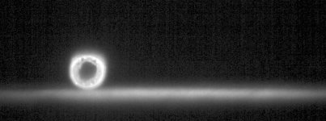
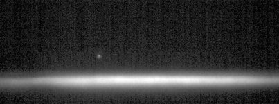
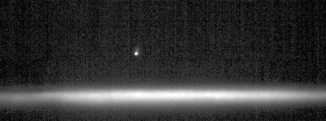
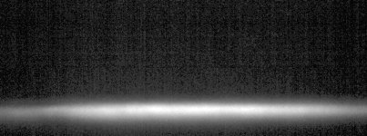
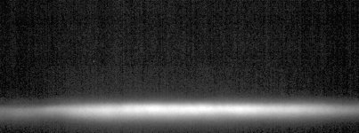
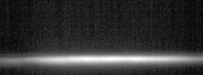
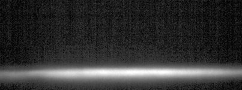
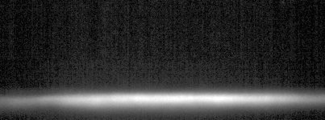
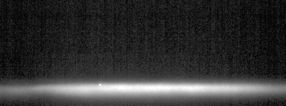
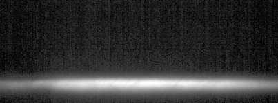

# [New-02.czi](\\sv-01-154\d$\SWAP\Data\2023-02-16_Marine\2023-02-16\New-02.czi) report
 - **Autostitch** = true
 - ZeissCZIReader v6.14.0
 - ZeissQuickStartCZIReader v0.2.1-SNAPSHOT

# Images 

| Series            | Quick Start Reader | Size | Original Reader | Size | #Diffs |
|-------------------|--------------------|------|-----------------|------|--------|
| Read time (all)   |86453 ms|------|195354 ms|------|--------|
|0||X:2016 Y:750 C:2 Z:1251 T:86||X:2016 Y:750 C:2 Z:1251 T:86|0|
|1||X:2016 Y:750 C:2 Z:1251 T:86||X:2016 Y:750 C:2 Z:1251 T:86|0|
|2||X:2016 Y:750 C:2 Z:1251 T:86||X:2016 Y:750 C:2 Z:1251 T:86|0|
|3||X:2016 Y:750 C:2 Z:1251 T:86||X:2016 Y:750 C:2 Z:1251 T:86|0|
|4||X:2016 Y:750 C:2 Z:1251 T:86||X:2016 Y:750 C:2 Z:1251 T:86|0|
|5||X:2016 Y:750 C:2 Z:1251 T:86||X:2016 Y:750 C:2 Z:1251 T:86|0|
|6||X:2016 Y:750 C:2 Z:1251 T:86||X:2016 Y:750 C:2 Z:1251 T:86|0|
|7||X:2016 Y:750 C:2 Z:1251 T:86||X:2016 Y:750 C:2 Z:1251 T:86|0|
|8||X:2016 Y:750 C:2 Z:1251 T:86||X:2016 Y:750 C:2 Z:1251 T:86|0|
|9||X:2016 Y:750 C:2 Z:1251 T:86||X:2016 Y:750 C:2 Z:1251 T:86|0|

# Metadata

|  Method            | Parameters       | Quick Start Reader | Original Reader | Delta  |
| -------------------|------------------|--------------------|-----------------|------- |
| Initialization     |                  |27217 ms|84401 ms|        |
| Reader Size (Mb)     |                  |1061.65|3395.79|        |
| getStageLabelName| Image 0 | TR1| Scene position #0| |
| getStageLabelName| Image 1 | TR2| Scene position #1| |
| getStageLabelX| Image 1 | 1772.867 um | 1221.854 um | 551.013 um |
| getStageLabelY| Image 1 | 2323.178 um | 2614.035 um | 290.857 um |
| getStageLabelName| Image 2 | TR3| Scene position #2| |
| getStageLabelX| Image 2 | 1880.017 um | 895.326 um | 984.691 um |
| getStageLabelY| Image 2 | 2649.701 um | 2721.177 um | 71.476 um |
| getStageLabelName| Image 3 | TR4| Scene position #3| |
| getStageLabelX| Image 3 | 1811.145 um | 614.716 um | 1196.429 um |
| getStageLabelY| Image 3 | 2930.260 um | 2652.300 um | 277.960 um |
| getStageLabelName| Image 4 | TR5| Scene position #4| |
| getStageLabelX| Image 4 | 1874.942 um | 173.393 um | 1701.549 um |
| getStageLabelY| Image 4 | 3371.617 um | 2716.075 um | 655.542 um |
| getStageLabelName| Image 5 | TR6| Scene position #5| |
| getStageLabelX| Image 5 | 2229.448 um | 584.104 um | 1645.344 um |
| getStageLabelY| Image 5 | 2960.854 um | 3070.665 um | 109.811 um |
| getStageLabelName| Image 6 | TR7| Scene position #6| |
| getStageLabelX| Image 6 | 2326.448 um | -76.605 um | 2403.053 um |
| getStageLabelY| Image 6 | 3621.583 um | 3167.603 um | 453.980 um |
| getStageLabelName| Image 7 | TR8| Scene position #7| |
| getStageLabelX| Image 7 | 2086.630 um | -283.236 um | 2369.866 um |
| getStageLabelY| Image 7 | 3828.197 um | 2927.809 um | 900.388 um |
| getStageLabelName| Image 8 | TR9| Scene position #8| |
| getStageLabelX| Image 8 | 1614.681 um | 303.494 um | 1311.187 um |
| getStageLabelY| Image 8 | 3241.559 um | 2455.873 um | 785.686 um |
| getStageLabelName| Image 9 | TR10| Scene position #9| |
| getStageLabelX| Image 9 | 984.545 um | 1010.121 um | 25.576 um |
| getStageLabelY| Image 9 | 2534.867 um | 1825.776 um | 709.091 um |
| getPlanePositionZ| Image 0 Plane 1 | -90.092 um | -90.150 um | 0.058 um |
| getPlanePositionZ| Image 0 Plane 2 | -89.892 um | -90.092 um | 0.200 um |
| getPlanePositionZ| Image 0 Plane 3 | -89.892 um | -90.150 um | 0.258 um |
| getPlanePositionZ| Image 0 Plane 4 | -89.692 um | -90.092 um | 0.400 um |
| getPlanePositionZ| Image 0 Plane 5 | -89.692 um | -90.150 um | 0.458 um |
| getPlanePositionZ| Image 0 Plane 6 | -89.492 um | -90.092 um | 0.600 um |
| getPlanePositionZ| Image 0 Plane 7 | -89.492 um | -90.150 um | 0.658 um |
| getPlanePositionZ| Image 0 Plane 8 | -89.292 um | -90.092 um | 0.800 um |
| getPlanePositionZ| Image 0 Plane 9 | -89.292 um | -90.150 um | 0.858 um |
| getPlanePositionZ| Image 0 Plane 10 | -89.092 um | -90.092 um | 1.000 um |
| getPlanePositionZ| Image 0 Plane 11 | -89.092 um | -90.150 um | 1.058 um |
| getPlanePositionZ| Image 0 Plane 12 | -88.892 um | -90.092 um | 1.200 um |
| getPlanePositionZ| Image 0 Plane 13 | -88.892 um | -90.150 um | 1.258 um |
| getPlanePositionZ| Image 0 Plane 14 | -88.692 um | -90.092 um | 1.400 um |
| getPlanePositionZ| Image 0 Plane 15 | -88.692 um | -90.150 um | 1.458 um |
| getPlanePositionZ| Image 0 Plane 16 | -88.492 um | -90.092 um | 1.600 um |
| getPlanePositionZ| Image 0 Plane 17 | -88.492 um | -90.150 um | 1.658 um |
| getPlanePositionZ| Image 0 Plane 18 | -88.292 um | -90.092 um | 1.800 um |
| getPlanePositionZ| Image 0 Plane 19 | -88.292 um | -90.150 um | 1.858 um |
| getPlanePositionZ| Image 0 Plane 20 | -88.092 um | -90.092 um | 2.000 um |
| getPlanePositionZ| Image 0 Plane 21 | -88.092 um | -90.150 um | 2.058 um |
| getPlanePositionZ| Image 0 Plane 22 | -87.892 um | -90.092 um | 2.200 um |
| getPlanePositionZ| Image 0 Plane 23 | -87.892 um | -90.150 um | 2.258 um |
| getPlanePositionZ| Image 0 Plane 24 | -87.692 um | -90.092 um | 2.400 um |
| getPlanePositionZ| Image 0 Plane 25 | -87.692 um | -90.150 um | 2.458 um |
| getPlanePositionZ| Image 0 Plane 26 | -87.492 um | -90.092 um | 2.600 um |
| getPlanePositionZ| Image 0 Plane 27 | -87.492 um | -90.150 um | 2.658 um |
| getPlanePositionZ| Image 0 Plane 28 | -87.292 um | -90.092 um | 2.800 um |
| getPlanePositionZ| Image 0 Plane 29 | -87.292 um | -90.150 um | 2.858 um |
| getPlanePositionZ| Image 0 Plane 30 | -87.092 um | -90.092 um | 3.000 um |
| getPlanePositionZ| Image 0 Plane 31 | -87.092 um | -90.150 um | 3.058 um |
| getPlanePositionZ| Image 0 Plane 32 | -86.892 um | -90.092 um | 3.200 um |
| getPlanePositionZ| Image 0 Plane 33 | -86.892 um | -90.150 um | 3.258 um |
| getPlanePositionZ| Image 0 Plane 34 | -86.692 um | -90.092 um | 3.400 um |
| getPlanePositionZ| Image 0 Plane 35 | -86.692 um | -90.150 um | 3.458 um |
| getPlanePositionZ| Image 0 Plane 36 | -86.492 um | -90.092 um | 3.600 um |
| getPlanePositionZ| Image 0 Plane 37 | -86.492 um | -90.150 um | 3.658 um |
| getPlanePositionZ| Image 0 Plane 38 | -86.292 um | -90.092 um | 3.800 um |
| getPlanePositionZ| Image 0 Plane 39 | -86.292 um | -90.150 um | 3.858 um |
| getPlanePositionZ| Image 0 Plane 40 | -86.092 um | -90.092 um | 4.000 um |
| getPlanePositionZ| Image 0 Plane 41 | -86.092 um | -90.150 um | 4.058 um |
| getPlanePositionZ| Image 0 Plane 42 | -85.892 um | -90.092 um | 4.200 um |
| getPlanePositionZ| Image 0 Plane 43 | -85.892 um | -90.150 um | 4.258 um |
| getPlanePositionZ| Image 0 Plane 44 | -85.692 um | -90.092 um | 4.400 um |
| getPlanePositionZ| Image 0 Plane 45 | -85.692 um | -90.150 um | 4.458 um |
| getPlanePositionZ| Image 0 Plane 46 | -85.492 um | -90.092 um | 4.600 um |
| getPlanePositionZ| Image 0 Plane 47 | -85.492 um | -90.150 um | 4.658 um |
| getPlanePositionZ| Image 0 Plane 48 | -85.292 um | -90.092 um | 4.800 um |
| getPlanePositionZ| Image 0 Plane 49 | -85.292 um | -90.150 um | 4.858 um |
| getPlanePositionZ| Image 0 Plane 50 | -85.092 um | -90.092 um | 5.000 um |
| getPlanePositionZ| Image 0 Plane 51 | -85.092 um | -90.150 um | 5.058 um |
| getPlanePositionZ| Image 0 Plane 52 | -84.892 um | -90.092 um | 5.200 um |
| getPlanePositionZ| Image 0 Plane 53 | -84.892 um | -90.150 um | 5.258 um |
| getPlanePositionZ| Image 0 Plane 54 | -84.692 um | -90.092 um | 5.400 um |
| getPlanePositionZ| Image 0 Plane 55 | -84.692 um | -90.150 um | 5.458 um |
| getPlanePositionZ| Image 0 Plane 56 | -84.492 um | -90.092 um | 5.600 um |
| getPlanePositionZ| Image 0 Plane 57 | -84.492 um | -90.150 um | 5.658 um |
| getPlanePositionZ| Image 0 Plane 58 | -84.292 um | -90.092 um | 5.800 um |
| getPlanePositionZ| Image 0 Plane 59 | -84.292 um | -90.150 um | 5.858 um |
| getPlanePositionZ| Image 0 Plane 60 | -84.092 um | -90.092 um | 6.000 um |
| getPlanePositionZ| Image 0 Plane 61 | -84.092 um | -90.150 um | 6.058 um |
| getPlanePositionZ| Image 0 Plane 62 | -83.892 um | -90.092 um | 6.200 um |
| getPlanePositionZ| Image 0 Plane 63 | -83.892 um | -90.150 um | 6.258 um |
| getPlanePositionZ| Image 0 Plane 64 | -83.692 um | -90.092 um | 6.400 um |
| getPlanePositionZ| Image 0 Plane 65 | -83.692 um | -90.150 um | 6.458 um |
| getPlanePositionZ| Image 0 Plane 66 | -83.492 um | -90.092 um | 6.600 um |
| getPlanePositionZ| Image 0 Plane 67 | -83.492 um | -90.150 um | 6.658 um |
| getPlanePositionZ| Image 0 Plane 68 | -83.292 um | -90.092 um | 6.800 um |
| getPlanePositionZ| Image 0 Plane 69 | -83.292 um | -90.150 um | 6.858 um |
| getPlanePositionZ| Image 0 Plane 70 | -83.092 um | -90.092 um | 7.000 um |
| getPlanePositionZ| Image 0 Plane 71 | -83.092 um | -90.150 um | 7.058 um |
| getPlanePositionZ| Image 0 Plane 72 | -82.892 um | -90.092 um | 7.200 um |
| getPlanePositionZ| Image 0 Plane 73 | -82.892 um | -90.150 um | 7.258 um |
| getPlanePositionZ| Image 0 Plane 74 | -82.692 um | -90.092 um | 7.400 um |
| getPlanePositionZ| Image 0 Plane 75 | -82.692 um | -90.150 um | 7.458 um |
| getPlanePositionZ| Image 0 Plane 76 | -82.492 um | -90.092 um | 7.600 um |
| getPlanePositionZ| Image 0 Plane 77 | -82.492 um | -90.150 um | 7.658 um |
| getPlanePositionZ| Image 0 Plane 78 | -82.292 um | -90.092 um | 7.800 um |
| getPlanePositionZ| Image 0 Plane 79 | -82.292 um | -90.150 um | 7.858 um |
| getPlanePositionZ| Image 0 Plane 80 | -82.092 um | -90.092 um | 8.000 um |
| getPlanePositionZ| Image 0 Plane 81 | -82.092 um | -90.150 um | 8.058 um |
| getPlanePositionZ| Image 0 Plane 82 | -81.892 um | -90.092 um | 8.200 um |
| getPlanePositionZ| Image 0 Plane 83 | -81.892 um | -90.150 um | 8.258 um |
| getPlanePositionZ| Image 0 Plane 84 | -81.692 um | -90.092 um | 8.400 um |
| getPlanePositionZ| Image 0 Plane 85 | -81.692 um | -90.150 um | 8.458 um |
| getPlanePositionZ| Image 0 Plane 86 | -81.492 um | -90.092 um | 8.600 um |
| getPlanePositionZ| Image 0 Plane 87 | -81.492 um | -90.150 um | 8.658 um |
| getPlanePositionZ| Image 0 Plane 88 | -81.292 um | -90.092 um | 8.800 um |
| getPlanePositionZ| Image 0 Plane 89 | -81.292 um | -90.150 um | 8.858 um |
| getPlanePositionZ| Image 0 Plane 90 | -81.092 um | -90.092 um | 9.000 um |
| getPlanePositionZ| Image 0 Plane 91 | -81.092 um | -90.150 um | 9.058 um |
| getPlanePositionZ| Image 0 Plane 92 | -80.892 um | -90.092 um | 9.200 um |
| getPlanePositionZ| Image 0 Plane 93 | -80.892 um | -90.150 um | 9.258 um |
| getPlanePositionZ| Image 0 Plane 94 | -80.692 um | -90.092 um | 9.400 um |
| getPlanePositionZ| Image 0 Plane 95 | -80.692 um | -90.150 um | 9.458 um |
| getPlanePositionZ| Image 0 Plane 96 | -80.492 um | -90.092 um | 9.600 um |
| getPlanePositionZ| Image 0 Plane 97 | -80.492 um | -90.150 um | 9.658 um |
| getPlanePositionZ| Image 0 Plane 98 | -80.292 um | -90.092 um | 9.800 um |
| getPlanePositionZ| Image 0 Plane 99 | -80.292 um | -90.150 um | 9.858 um |
| getPlanePositionZ| Image 0 Plane 100 | -80.092 um | -90.092 um | 10.000 um |
| getPlanePositionZ| Image 0 Plane 101 | -80.092 um | -90.150 um | 10.058 um |
| getPlanePositionZ| Image 0 Plane 102 | -79.892 um | -90.092 um | 10.200 um |
| getPlanePositionZ| Image 0 Plane 103 | -79.892 um | -90.150 um | 10.258 um |
| getPlanePositionZ| Image 0 Plane 104 | -79.692 um | -90.092 um | 10.400 um |
| getPlanePositionZ| Image 0 Plane 105 | -79.692 um | -90.150 um | 10.458 um |
| getPlanePositionZ| Image 0 Plane 106 | -79.492 um | -90.092 um | 10.600 um |
| getPlanePositionZ| Image 0 Plane 107 | -79.492 um | -90.150 um | 10.658 um |
| getPlanePositionZ| Image 0 Plane 108 | -79.292 um | -90.092 um | 10.800 um |
| getPlanePositionZ| Image 0 Plane 109 | -79.292 um | -90.150 um | 10.858 um |
| getPlanePositionZ| Image 0 Plane 110 | -79.092 um | -90.092 um | 11.000 um |
| getPlanePositionZ| Image 0 Plane 111 | -79.092 um | -90.150 um | 11.058 um |
| getPlanePositionZ| Image 0 Plane 112 | -78.892 um | -90.092 um | 11.200 um |
| getPlanePositionZ| Image 0 Plane 113 | -78.892 um | -90.150 um | 11.258 um |
| getPlanePositionZ| Image 0 Plane 114 | -78.692 um | -90.092 um | 11.400 um |
| getPlanePositionZ| Image 0 Plane 115 | -78.692 um | -90.150 um | 11.458 um |
| getPlanePositionZ| Image 0 Plane 116 | -78.492 um | -90.092 um | 11.600 um |
| getPlanePositionZ| Image 0 Plane 117 | -78.492 um | -90.150 um | 11.658 um |
| getPlanePositionZ| Image 0 Plane 118 | -78.292 um | -90.092 um | 11.800 um |
| getPlanePositionZ| Image 0 Plane 119 | -78.292 um | -90.150 um | 11.858 um |
| getPlanePositionZ| Image 0 Plane 120 | -78.092 um | -90.092 um | 12.000 um |
| getPlanePositionZ| Image 0 Plane 121 | -78.092 um | -90.150 um | 12.058 um |
| getPlanePositionZ| Image 0 Plane 122 | -77.892 um | -90.092 um | 12.200 um |
| getPlanePositionZ| Image 0 Plane 123 | -77.892 um | -90.150 um | 12.258 um |
| getPlanePositionZ| Image 0 Plane 124 | -77.692 um | -90.092 um | 12.400 um |
| getPlanePositionZ| Image 0 Plane 125 | -77.692 um | -90.150 um | 12.458 um |
| getPlanePositionZ| Image 0 Plane 126 | -77.492 um | -90.092 um | 12.600 um |
| getPlanePositionZ| Image 0 Plane 127 | -77.492 um | -90.150 um | 12.658 um |
| getPlanePositionZ| Image 0 Plane 128 | -77.292 um | -90.092 um | 12.800 um |
| getPlanePositionZ| Image 0 Plane 129 | -77.292 um | -90.150 um | 12.858 um |
| getPlanePositionZ| Image 0 Plane 130 | -77.092 um | -90.092 um | 13.000 um |
| getPlanePositionZ| Image 0 Plane 131 | -77.092 um | -90.150 um | 13.058 um |
| getPlanePositionZ| Image 0 Plane 132 | -76.892 um | -90.092 um | 13.200 um |
| getPlanePositionZ| Image 0 Plane 133 | -76.892 um | -90.150 um | 13.258 um |
| getPlanePositionZ| Image 0 Plane 134 | -76.692 um | -90.092 um | 13.400 um |
| getPlanePositionZ| Image 0 Plane 135 | -76.692 um | -90.150 um | 13.458 um |
| getPlanePositionZ| Image 0 Plane 136 | -76.492 um | -90.092 um | 13.600 um |
| getPlanePositionZ| Image 0 Plane 137 | -76.492 um | -90.150 um | 13.658 um |
| getPlanePositionZ| Image 0 Plane 138 | -76.292 um | -90.092 um | 13.800 um |
| getPlanePositionZ| Image 0 Plane 139 | -76.292 um | -90.150 um | 13.858 um |
| getPlanePositionZ| Image 0 Plane 140 | -76.092 um | -90.092 um | 14.000 um |
| getPlanePositionZ| Image 0 Plane 141 | -76.092 um | -90.150 um | 14.058 um |
| getPlanePositionZ| Image 0 Plane 142 | -75.892 um | -90.092 um | 14.200 um |
| getPlanePositionZ| Image 0 Plane 143 | -75.892 um | -90.150 um | 14.258 um |
| getPlanePositionZ| Image 0 Plane 144 | -75.692 um | -90.092 um | 14.400 um |
| getPlanePositionZ| Image 0 Plane 145 | -75.692 um | -90.150 um | 14.458 um |
| getPlanePositionZ| Image 0 Plane 146 | -75.492 um | -90.092 um | 14.600 um |
| getPlanePositionZ| Image 0 Plane 147 | -75.492 um | -90.150 um | 14.658 um |
| getPlanePositionZ| Image 0 Plane 148 | -75.292 um | -90.092 um | 14.800 um |
| getPlanePositionZ| Image 0 Plane 149 | -75.292 um | -90.150 um | 14.858 um |
| getPlanePositionZ| Image 0 Plane 150 | -75.092 um | -90.092 um | 15.000 um |
| getPlanePositionZ| Image 0 Plane 151 | -75.092 um | -90.150 um | 15.058 um |
| getPlanePositionZ| Image 0 Plane 152 | -74.892 um | -90.092 um | 15.200 um |
| getPlanePositionZ| Image 0 Plane 153 | -74.892 um | -90.150 um | 15.258 um |
| getPlanePositionZ| Image 0 Plane 154 | -74.692 um | -90.092 um | 15.400 um |
| getPlanePositionZ| Image 0 Plane 155 | -74.692 um | -90.150 um | 15.458 um |
| getPlanePositionZ| Image 0 Plane 156 | -74.492 um | -90.092 um | 15.600 um |
| getPlanePositionZ| Image 0 Plane 157 | -74.492 um | -90.150 um | 15.658 um |
| getPlanePositionZ| Image 0 Plane 158 | -74.292 um | -90.092 um | 15.800 um |
| getPlanePositionZ| Image 0 Plane 159 | -74.292 um | -90.150 um | 15.858 um |
| getPlanePositionZ| Image 0 Plane 160 | -74.092 um | -90.092 um | 16.000 um |
| getPlanePositionZ| Image 0 Plane 161 | -74.092 um | -90.150 um | 16.058 um |
| getPlanePositionZ| Image 0 Plane 162 | -73.892 um | -90.092 um | 16.200 um |
| getPlanePositionZ| Image 0 Plane 163 | -73.892 um | -90.150 um | 16.258 um |
| getPlanePositionZ| Image 0 Plane 164 | -73.692 um | -90.092 um | 16.400 um |
| getPlanePositionZ| Image 0 Plane 165 | -73.692 um | -90.150 um | 16.458 um |
| getPlanePositionZ| Image 0 Plane 166 | -73.492 um | -90.092 um | 16.600 um |
| getPlanePositionZ| Image 0 Plane 167 | -73.492 um | -90.150 um | 16.658 um |
| getPlanePositionZ| Image 0 Plane 168 | -73.292 um | -90.092 um | 16.800 um |
| getPlanePositionZ| Image 0 Plane 169 | -73.292 um | -90.150 um | 16.858 um |
| getPlanePositionZ| Image 0 Plane 170 | -73.092 um | -90.092 um | 17.000 um |
| getPlanePositionZ| Image 0 Plane 171 | -73.092 um | -90.150 um | 17.058 um |
| getPlanePositionZ| Image 0 Plane 172 | -72.892 um | -90.092 um | 17.200 um |
| getPlanePositionZ| Image 0 Plane 173 | -72.892 um | -90.150 um | 17.258 um |
| getPlanePositionZ| Image 0 Plane 174 | -72.692 um | -90.092 um | 17.400 um |
| getPlanePositionZ| Image 0 Plane 175 | -72.692 um | -90.150 um | 17.458 um |
| getPlanePositionZ| Image 0 Plane 176 | -72.492 um | -90.092 um | 17.600 um |
| getPlanePositionZ| Image 0 Plane 177 | -72.492 um | -90.150 um | 17.658 um |
| getPlanePositionZ| Image 0 Plane 178 | -72.292 um | -90.092 um | 17.800 um |
| getPlanePositionZ| Image 0 Plane 179 | -72.292 um | -90.150 um | 17.858 um |
| getPlanePositionZ| Image 0 Plane 180 | -72.092 um | -90.092 um | 18.000 um |
| getPlanePositionZ| Image 0 Plane 181 | -72.092 um | -90.150 um | 18.058 um |
| getPlanePositionZ| Image 0 Plane 182 | -71.892 um | -90.092 um | 18.200 um |
| getPlanePositionZ| Image 0 Plane 183 | -71.892 um | -90.150 um | 18.258 um |
| getPlanePositionZ| Image 0 Plane 184 | -71.692 um | -90.092 um | 18.400 um |
| getPlanePositionZ| Image 0 Plane 185 | -71.692 um | -90.150 um | 18.458 um |
| getPlanePositionZ| Image 0 Plane 186 | -71.492 um | -90.092 um | 18.600 um |
| getPlanePositionZ| Image 0 Plane 187 | -71.492 um | -90.150 um | 18.658 um |
| getPlanePositionZ| Image 0 Plane 188 | -71.292 um | -90.092 um | 18.800 um |
| getPlanePositionZ| Image 0 Plane 189 | -71.292 um | -90.150 um | 18.858 um |
| getPlanePositionZ| Image 0 Plane 190 | -71.092 um | -90.092 um | 19.000 um |
| getPlanePositionZ| Image 0 Plane 191 | -71.092 um | -90.150 um | 19.058 um |
| getPlanePositionZ| Image 0 Plane 192 | -70.892 um | -90.092 um | 19.200 um |
| getPlanePositionZ| Image 0 Plane 193 | -70.892 um | -90.150 um | 19.258 um |
| getPlanePositionZ| Image 0 Plane 194 | -70.692 um | -90.092 um | 19.400 um |
| getPlanePositionZ| Image 0 Plane 195 | -70.692 um | -90.150 um | 19.458 um |
| getPlanePositionZ| Image 0 Plane 196 | -70.492 um | -90.092 um | 19.600 um |
| getPlanePositionZ| Image 0 Plane 197 | -70.492 um | -90.150 um | 19.658 um |
| getPlanePositionZ| Image 0 Plane 198 | -70.292 um | -90.092 um | 19.800 um |
| getPlanePositionZ| Image 0 Plane 199 | -70.292 um | -90.150 um | 19.858 um |
| getPlanePositionZ| Image 0 Plane 200 | -70.092 um | -90.092 um | 20.000 um |
| getPlanePositionZ| Image 0 Plane 201 | -70.092 um | -90.150 um | 20.058 um |
| getPlanePositionZ| Image 0 Plane 202 | -69.892 um | -90.092 um | 20.200 um |
| getPlanePositionZ| Image 0 Plane 203 | -69.892 um | -90.150 um | 20.258 um |
| getPlanePositionZ| Image 0 Plane 204 | -69.692 um | -90.092 um | 20.400 um |
| getPlanePositionZ| Image 0 Plane 205 | -69.692 um | -90.150 um | 20.458 um |
| getPlanePositionZ| Image 0 Plane 206 | -69.492 um | -90.092 um | 20.600 um |
| getPlanePositionZ| Image 0 Plane 207 | -69.492 um | -90.150 um | 20.658 um |
| getPlanePositionZ| Image 0 Plane 208 | -69.292 um | -90.092 um | 20.800 um |
| getPlanePositionZ| Image 0 Plane 209 | -69.292 um | -90.150 um | 20.858 um |
| getPlanePositionZ| Image 0 Plane 210 | -69.092 um | -90.092 um | 21.000 um |
| getPlanePositionZ| Image 0 Plane 211 | -69.092 um | -90.150 um | 21.058 um |
| getPlanePositionZ| Image 0 Plane 212 | -68.892 um | -90.092 um | 21.200 um |
| getPlanePositionZ| Image 0 Plane 213 | -68.892 um | -90.150 um | 21.258 um |
| getPlanePositionZ| Image 0 Plane 214 | -68.692 um | -90.092 um | 21.400 um |
| getPlanePositionZ| Image 0 Plane 215 | -68.692 um | -90.150 um | 21.458 um |
| getPlanePositionZ| Image 0 Plane 216 | -68.492 um | -90.092 um | 21.600 um |
| getPlanePositionZ| Image 0 Plane 217 | -68.492 um | -90.150 um | 21.658 um |
| getPlanePositionZ| Image 0 Plane 218 | -68.292 um | -90.092 um | 21.800 um |
| getPlanePositionZ| Image 0 Plane 219 | -68.292 um | -90.150 um | 21.858 um |
| getPlanePositionZ| Image 0 Plane 220 | -68.092 um | -90.092 um | 22.000 um |
| getPlanePositionZ| Image 0 Plane 221 | -68.092 um | -90.150 um | 22.058 um |
| getPlanePositionZ| Image 0 Plane 222 | -67.892 um | -90.092 um | 22.200 um |
| getPlanePositionZ| Image 0 Plane 223 | -67.892 um | -90.150 um | 22.258 um |
| getPlanePositionZ| Image 0 Plane 224 | -67.692 um | -90.092 um | 22.400 um |
| getPlanePositionZ| Image 0 Plane 225 | -67.692 um | -90.150 um | 22.458 um |
| getPlanePositionZ| Image 0 Plane 226 | -67.492 um | -90.092 um | 22.600 um |
| getPlanePositionZ| Image 0 Plane 227 | -67.492 um | -90.150 um | 22.658 um |
| getPlanePositionZ| Image 0 Plane 228 | -67.292 um | -90.092 um | 22.800 um |
| getPlanePositionZ| Image 0 Plane 229 | -67.292 um | -90.150 um | 22.858 um |
| getPlanePositionZ| Image 0 Plane 230 | -67.092 um | -90.092 um | 23.000 um |
| getPlanePositionZ| Image 0 Plane 231 | -67.092 um | -90.150 um | 23.058 um |
| getPlanePositionZ| Image 0 Plane 232 | -66.892 um | -90.092 um | 23.200 um |
| getPlanePositionZ| Image 0 Plane 233 | -66.892 um | -90.150 um | 23.258 um |
| getPlanePositionZ| Image 0 Plane 234 | -66.692 um | -90.092 um | 23.400 um |
| getPlanePositionZ| Image 0 Plane 235 | -66.692 um | -90.150 um | 23.458 um |
| getPlanePositionZ| Image 0 Plane 236 | -66.492 um | -90.092 um | 23.600 um |
| getPlanePositionZ| Image 0 Plane 237 | -66.492 um | -90.150 um | 23.658 um |
| getPlanePositionZ| Image 0 Plane 238 | -66.292 um | -90.092 um | 23.800 um |
| getPlanePositionZ| Image 0 Plane 239 | -66.292 um | -90.150 um | 23.858 um |
| getPlanePositionZ| Image 0 Plane 240 | -66.092 um | -90.092 um | 24.000 um |
| getPlanePositionZ| Image 0 Plane 241 | -66.092 um | -90.150 um | 24.058 um |
| getPlanePositionZ| Image 0 Plane 242 | -65.892 um | -90.092 um | 24.200 um |
| getPlanePositionZ| Image 0 Plane 243 | -65.892 um | -90.150 um | 24.258 um |
| getPlanePositionZ| Image 0 Plane 244 | -65.692 um | -90.092 um | 24.400 um |
| getPlanePositionZ| Image 0 Plane 245 | -65.692 um | -90.150 um | 24.458 um |
| getPlanePositionZ| Image 0 Plane 246 | -65.492 um | -90.092 um | 24.600 um |
| getPlanePositionZ| Image 0 Plane 247 | -65.492 um | -90.150 um | 24.658 um |
| getPlanePositionZ| Image 0 Plane 248 | -65.292 um | -90.092 um | 24.800 um |
| getPlanePositionZ| Image 0 Plane 249 | -65.292 um | -90.150 um | 24.858 um |
| getPlanePositionZ| Image 0 Plane 250 | -65.092 um | -90.092 um | 25.000 um |
| getPlanePositionZ| Image 0 Plane 251 | -65.092 um | -90.150 um | 25.058 um |
| getPlanePositionZ| Image 0 Plane 252 | -64.892 um | -90.092 um | 25.200 um |
| getPlanePositionZ| Image 0 Plane 253 | -64.892 um | -90.150 um | 25.258 um |
| getPlanePositionZ| Image 0 Plane 254 | -64.692 um | -90.092 um | 25.400 um |
| getPlanePositionZ| Image 0 Plane 255 | -64.692 um | -90.150 um | 25.458 um |
| getPlanePositionZ| Image 0 Plane 256 | -64.492 um | -90.092 um | 25.600 um |
| getPlanePositionZ| Image 0 Plane 257 | -64.492 um | -90.150 um | 25.658 um |
| getPlanePositionZ| Image 0 Plane 258 | -64.292 um | -90.092 um | 25.800 um |
| getPlanePositionZ| Image 0 Plane 259 | -64.292 um | -90.150 um | 25.858 um |
| getPlanePositionZ| Image 0 Plane 260 | -64.092 um | -90.092 um | 26.000 um |
| getPlanePositionZ| Image 0 Plane 261 | -64.092 um | -90.150 um | 26.058 um |
| getPlanePositionZ| Image 0 Plane 262 | -63.892 um | -90.092 um | 26.200 um |
| getPlanePositionZ| Image 0 Plane 263 | -63.892 um | -90.150 um | 26.258 um |
| getPlanePositionZ| Image 0 Plane 264 | -63.692 um | -90.092 um | 26.400 um |
| getPlanePositionZ| Image 0 Plane 265 | -63.692 um | -90.150 um | 26.458 um |
| getPlanePositionZ| Image 0 Plane 266 | -63.492 um | -90.092 um | 26.600 um |
| getPlanePositionZ| Image 0 Plane 267 | -63.492 um | -90.150 um | 26.658 um |
| getPlanePositionZ| Image 0 Plane 268 | -63.292 um | -90.092 um | 26.800 um |
| getPlanePositionZ| Image 0 Plane 269 | -63.292 um | -90.150 um | 26.858 um |
| getPlanePositionZ| Image 0 Plane 270 | -63.092 um | -90.092 um | 27.000 um |
| getPlanePositionZ| Image 0 Plane 271 | -63.092 um | -90.150 um | 27.058 um |
| getPlanePositionZ| Image 0 Plane 272 | -62.892 um | -90.092 um | 27.200 um |
| getPlanePositionZ| Image 0 Plane 273 | -62.892 um | -90.150 um | 27.258 um |
| getPlanePositionZ| Image 0 Plane 274 | -62.692 um | -90.092 um | 27.400 um |
| getPlanePositionZ| Image 0 Plane 275 | -62.692 um | -90.150 um | 27.458 um |
| getPlanePositionZ| Image 0 Plane 276 | -62.492 um | -90.092 um | 27.600 um |
| getPlanePositionZ| Image 0 Plane 277 | -62.492 um | -90.150 um | 27.658 um |
| getPlanePositionZ| Image 0 Plane 278 | -62.292 um | -90.092 um | 27.800 um |
| getPlanePositionZ| Image 0 Plane 279 | -62.292 um | -90.150 um | 27.858 um |
| getPlanePositionZ| Image 0 Plane 280 | -62.092 um | -90.092 um | 28.000 um |
| getPlanePositionZ| Image 0 Plane 281 | -62.092 um | -90.150 um | 28.058 um |
| getPlanePositionZ| Image 0 Plane 282 | -61.892 um | -90.092 um | 28.200 um |
| getPlanePositionZ| Image 0 Plane 283 | -61.892 um | -90.150 um | 28.258 um |
| getPlanePositionZ| Image 0 Plane 284 | -61.692 um | -90.092 um | 28.400 um |
| getPlanePositionZ| Image 0 Plane 285 | -61.692 um | -90.150 um | 28.458 um |
| getPlanePositionZ| Image 0 Plane 286 | -61.492 um | -90.092 um | 28.600 um |
| getPlanePositionZ| Image 0 Plane 287 | -61.492 um | -90.150 um | 28.658 um |
| getPlanePositionZ| Image 0 Plane 288 | -61.292 um | -90.092 um | 28.800 um |
| getPlanePositionZ| Image 0 Plane 289 | -61.292 um | -90.150 um | 28.858 um |
| getPlanePositionZ| Image 0 Plane 290 | -61.092 um | -90.092 um | 29.000 um |
| getPlanePositionZ| Image 0 Plane 291 | -61.092 um | -90.150 um | 29.058 um |
| getPlanePositionZ| Image 0 Plane 292 | -60.892 um | -90.092 um | 29.200 um |
| getPlanePositionZ| Image 0 Plane 293 | -60.892 um | -90.150 um | 29.258 um |
| getPlanePositionZ| Image 0 Plane 294 | -60.692 um | -90.092 um | 29.400 um |
| getPlanePositionZ| Image 0 Plane 295 | -60.692 um | -90.150 um | 29.458 um |
| getPlanePositionZ| Image 0 Plane 296 | -60.492 um | -90.092 um | 29.600 um |
| getPlanePositionZ| Image 0 Plane 297 | -60.492 um | -90.150 um | 29.658 um |
| getPlanePositionZ| Image 0 Plane 298 | -60.292 um | -90.092 um | 29.800 um |
| getPlanePositionZ| Image 0 Plane 299 | -60.292 um | -90.150 um | 29.858 um |
| getPlanePositionZ| Image 0 Plane 300 | -60.092 um | -90.092 um | 30.000 um |
| getPlanePositionZ| Image 0 Plane 301 | -60.092 um | -90.150 um | 30.058 um |
| getPlanePositionZ| Image 0 Plane 302 | -59.892 um | -90.092 um | 30.200 um |
| getPlanePositionZ| Image 0 Plane 303 | -59.892 um | -90.150 um | 30.258 um |
| getPlanePositionZ| Image 0 Plane 304 | -59.692 um | -90.092 um | 30.400 um |
| getPlanePositionZ| Image 0 Plane 305 | -59.692 um | -90.150 um | 30.458 um |
| getPlanePositionZ| Image 0 Plane 306 | -59.492 um | -90.092 um | 30.600 um |
| getPlanePositionZ| Image 0 Plane 307 | -59.492 um | -90.150 um | 30.658 um |
| getPlanePositionZ| Image 0 Plane 308 | -59.292 um | -90.092 um | 30.800 um |
| getPlanePositionZ| Image 0 Plane 309 | -59.292 um | -90.150 um | 30.858 um |
| getPlanePositionZ| Image 0 Plane 310 | -59.092 um | -90.092 um | 31.000 um |
| getPlanePositionZ| Image 0 Plane 311 | -59.092 um | -90.150 um | 31.058 um |
| getPlanePositionZ| Image 0 Plane 312 | -58.892 um | -90.092 um | 31.200 um |
| getPlanePositionZ| Image 0 Plane 313 | -58.892 um | -90.150 um | 31.258 um |
| getPlanePositionZ| Image 0 Plane 314 | -58.692 um | -90.092 um | 31.400 um |
| getPlanePositionZ| Image 0 Plane 315 | -58.692 um | -90.150 um | 31.458 um |
| getPlanePositionZ| Image 0 Plane 316 | -58.492 um | -90.092 um | 31.600 um |
| getPlanePositionZ| Image 0 Plane 317 | -58.492 um | -90.150 um | 31.658 um |
| getPlanePositionZ| Image 0 Plane 318 | -58.292 um | -90.092 um | 31.800 um |
| getPlanePositionZ| Image 0 Plane 319 | -58.292 um | -90.150 um | 31.858 um |
| getPlanePositionZ| Image 0 Plane 320 | -58.092 um | -90.092 um | 32.000 um |
| getPlanePositionZ| Image 0 Plane 321 | -58.092 um | -90.150 um | 32.058 um |
| getPlanePositionZ| Image 0 Plane 322 | -57.892 um | -90.092 um | 32.200 um |
| getPlanePositionZ| Image 0 Plane 323 | -57.892 um | -90.150 um | 32.258 um |
| getPlanePositionZ| Image 0 Plane 324 | -57.692 um | -90.092 um | 32.400 um |
| getPlanePositionZ| Image 0 Plane 325 | -57.692 um | -90.150 um | 32.458 um |
| getPlanePositionZ| Image 0 Plane 326 | -57.492 um | -90.092 um | 32.600 um |
| getPlanePositionZ| Image 0 Plane 327 | -57.492 um | -90.150 um | 32.658 um |
| getPlanePositionZ| Image 0 Plane 328 | -57.292 um | -90.092 um | 32.800 um |
| getPlanePositionZ| Image 0 Plane 329 | -57.292 um | -90.150 um | 32.858 um |
| getPlanePositionZ| Image 0 Plane 330 | -57.092 um | -90.092 um | 33.000 um |
| getPlanePositionZ| Image 0 Plane 331 | -57.092 um | -90.150 um | 33.058 um |
| getPlanePositionZ| Image 0 Plane 332 | -56.892 um | -90.092 um | 33.200 um |
| getPlanePositionZ| Image 0 Plane 333 | -56.892 um | -90.150 um | 33.258 um |
| getPlanePositionZ| Image 0 Plane 334 | -56.692 um | -90.092 um | 33.400 um |
| getPlanePositionZ| Image 0 Plane 335 | -56.692 um | -90.150 um | 33.458 um |
| getPlanePositionZ| Image 0 Plane 336 | -56.492 um | -90.092 um | 33.600 um |
| getPlanePositionZ| Image 0 Plane 337 | -56.492 um | -90.150 um | 33.658 um |
| getPlanePositionZ| Image 0 Plane 338 | -56.292 um | -90.092 um | 33.800 um |
| getPlanePositionZ| Image 0 Plane 339 | -56.292 um | -90.150 um | 33.858 um |
| getPlanePositionZ| Image 0 Plane 340 | -56.092 um | -90.092 um | 34.000 um |
| getPlanePositionZ| Image 0 Plane 341 | -56.092 um | -90.150 um | 34.058 um |
| getPlanePositionZ| Image 0 Plane 342 | -55.892 um | -90.092 um | 34.200 um |
| getPlanePositionZ| Image 0 Plane 343 | -55.892 um | -90.150 um | 34.258 um |
| getPlanePositionZ| Image 0 Plane 344 | -55.692 um | -90.092 um | 34.400 um |
| getPlanePositionZ| Image 0 Plane 345 | -55.692 um | -90.150 um | 34.458 um |
| getPlanePositionZ| Image 0 Plane 346 | -55.492 um | -90.092 um | 34.600 um |
| getPlanePositionZ| Image 0 Plane 347 | -55.492 um | -90.150 um | 34.658 um |
| getPlanePositionZ| Image 0 Plane 348 | -55.292 um | -90.092 um | 34.800 um |
| getPlanePositionZ| Image 0 Plane 349 | -55.292 um | -90.150 um | 34.858 um |
| getPlanePositionZ| Image 0 Plane 350 | -55.092 um | -90.092 um | 35.000 um |
| getPlanePositionZ| Image 0 Plane 351 | -55.092 um | -90.150 um | 35.058 um |
| getPlanePositionZ| Image 0 Plane 352 | -54.892 um | -90.092 um | 35.200 um |
| getPlanePositionZ| Image 0 Plane 353 | -54.892 um | -90.150 um | 35.258 um |
| getPlanePositionZ| Image 0 Plane 354 | -54.692 um | -90.092 um | 35.400 um |
| getPlanePositionZ| Image 0 Plane 355 | -54.692 um | -90.150 um | 35.458 um |
| getPlanePositionZ| Image 0 Plane 356 | -54.492 um | -90.092 um | 35.600 um |
| getPlanePositionZ| Image 0 Plane 357 | -54.492 um | -90.150 um | 35.658 um |
| getPlanePositionZ| Image 0 Plane 358 | -54.292 um | -90.092 um | 35.800 um |
| getPlanePositionZ| Image 0 Plane 359 | -54.292 um | -90.150 um | 35.858 um |
| getPlanePositionZ| Image 0 Plane 360 | -54.092 um | -90.092 um | 36.000 um |
| getPlanePositionZ| Image 0 Plane 361 | -54.092 um | -90.150 um | 36.058 um |
| getPlanePositionZ| Image 0 Plane 362 | -53.892 um | -90.092 um | 36.200 um |
| getPlanePositionZ| Image 0 Plane 363 | -53.892 um | -90.150 um | 36.258 um |
| getPlanePositionZ| Image 0 Plane 364 | -53.692 um | -90.092 um | 36.400 um |
| getPlanePositionZ| Image 0 Plane 365 | -53.692 um | -90.150 um | 36.458 um |
| getPlanePositionZ| Image 0 Plane 366 | -53.492 um | -90.092 um | 36.600 um |
| getPlanePositionZ| Image 0 Plane 367 | -53.492 um | -90.150 um | 36.658 um |
| getPlanePositionZ| Image 0 Plane 368 | -53.292 um | -90.092 um | 36.800 um |
| getPlanePositionZ| Image 0 Plane 369 | -53.292 um | -90.150 um | 36.858 um |
| getPlanePositionZ| Image 0 Plane 370 | -53.092 um | -90.092 um | 37.000 um |
| getPlanePositionZ| Image 0 Plane 371 | -53.092 um | -90.150 um | 37.058 um |
| getPlanePositionZ| Image 0 Plane 372 | -52.892 um | -90.092 um | 37.200 um |
| getPlanePositionZ| Image 0 Plane 373 | -52.892 um | -90.150 um | 37.258 um |
| getPlanePositionZ| Image 0 Plane 374 | -52.692 um | -90.092 um | 37.400 um |
| getPlanePositionZ| Image 0 Plane 375 | -52.692 um | -90.150 um | 37.458 um |
| getPlanePositionZ| Image 0 Plane 376 | -52.492 um | -90.092 um | 37.600 um |
| getPlanePositionZ| Image 0 Plane 377 | -52.492 um | -90.150 um | 37.658 um |
| getPlanePositionZ| Image 0 Plane 378 | -52.292 um | -90.092 um | 37.800 um |
| getPlanePositionZ| Image 0 Plane 379 | -52.292 um | -90.150 um | 37.858 um |
| getPlanePositionZ| Image 0 Plane 380 | -52.092 um | -90.092 um | 38.000 um |
| getPlanePositionZ| Image 0 Plane 381 | -52.092 um | -90.150 um | 38.058 um |
| getPlanePositionZ| Image 0 Plane 382 | -51.892 um | -90.092 um | 38.200 um |
| getPlanePositionZ| Image 0 Plane 383 | -51.892 um | -90.150 um | 38.258 um |
| getPlanePositionZ| Image 0 Plane 384 | -51.692 um | -90.092 um | 38.400 um |
| getPlanePositionZ| Image 0 Plane 385 | -51.692 um | -90.150 um | 38.458 um |
| getPlanePositionZ| Image 0 Plane 386 | -51.492 um | -90.092 um | 38.600 um |
| getPlanePositionZ| Image 0 Plane 387 | -51.492 um | -90.150 um | 38.658 um |
| getPlanePositionZ| Image 0 Plane 388 | -51.292 um | -90.092 um | 38.800 um |
| getPlanePositionZ| Image 0 Plane 389 | -51.292 um | -90.150 um | 38.858 um |
| getPlanePositionZ| Image 0 Plane 390 | -51.092 um | -90.092 um | 39.000 um |
| getPlanePositionZ| Image 0 Plane 391 | -51.092 um | -90.150 um | 39.058 um |
| getPlanePositionZ| Image 0 Plane 392 | -50.892 um | -90.092 um | 39.200 um |
| getPlanePositionZ| Image 0 Plane 393 | -50.892 um | -90.150 um | 39.258 um |
| getPlanePositionZ| Image 0 Plane 394 | -50.692 um | -90.092 um | 39.400 um |
| getPlanePositionZ| Image 0 Plane 395 | -50.692 um | -90.150 um | 39.458 um |
| getPlanePositionZ| Image 0 Plane 396 | -50.492 um | -90.092 um | 39.600 um |
| getPlanePositionZ| Image 0 Plane 397 | -50.492 um | -90.150 um | 39.658 um |
| getPlanePositionZ| Image 0 Plane 398 | -50.292 um | -90.092 um | 39.800 um |
| getPlanePositionZ| Image 0 Plane 399 | -50.292 um | -90.150 um | 39.858 um |
| getPlanePositionZ| Image 0 Plane 400 | -50.092 um | -90.092 um | 40.000 um |
| getPlanePositionZ| Image 0 Plane 401 | -50.092 um | -90.150 um | 40.058 um |
| getPlanePositionZ| Image 0 Plane 402 | -49.892 um | -90.092 um | 40.200 um |
| getPlanePositionZ| Image 0 Plane 403 | -49.892 um | -90.150 um | 40.258 um |
| getPlanePositionZ| Image 0 Plane 404 | -49.692 um | -90.092 um | 40.400 um |
| getPlanePositionZ| Image 0 Plane 405 | -49.692 um | -90.150 um | 40.458 um |
| getPlanePositionZ| Image 0 Plane 406 | -49.492 um | -90.092 um | 40.600 um |
| getPlanePositionZ| Image 0 Plane 407 | -49.492 um | -90.150 um | 40.658 um |
| getPlanePositionZ| Image 0 Plane 408 | -49.292 um | -90.092 um | 40.800 um |
| getPlanePositionZ| Image 0 Plane 409 | -49.292 um | -90.150 um | 40.858 um |
| getPlanePositionZ| Image 0 Plane 410 | -49.092 um | -90.092 um | 41.000 um |
| getPlanePositionZ| Image 0 Plane 411 | -49.092 um | -90.150 um | 41.058 um |
| getPlanePositionZ| Image 0 Plane 412 | -48.892 um | -90.092 um | 41.200 um |
| getPlanePositionZ| Image 0 Plane 413 | -48.892 um | -90.150 um | 41.258 um |
| getPlanePositionZ| Image 0 Plane 414 | -48.692 um | -90.092 um | 41.400 um |
| getPlanePositionZ| Image 0 Plane 415 | -48.692 um | -90.150 um | 41.458 um |
| getPlanePositionZ| Image 0 Plane 416 | -48.492 um | -90.092 um | 41.600 um |
| getPlanePositionZ| Image 0 Plane 417 | -48.492 um | -90.150 um | 41.658 um |
| getPlanePositionZ| Image 0 Plane 418 | -48.292 um | -90.092 um | 41.800 um |
| getPlanePositionZ| Image 0 Plane 419 | -48.292 um | -90.150 um | 41.858 um |
| getPlanePositionZ| Image 0 Plane 420 | -48.092 um | -90.092 um | 42.000 um |
| getPlanePositionZ| Image 0 Plane 421 | -48.092 um | -90.150 um | 42.058 um |
| getPlanePositionZ| Image 0 Plane 422 | -47.892 um | -90.092 um | 42.200 um |
| getPlanePositionZ| Image 0 Plane 423 | -47.892 um | -90.150 um | 42.258 um |
| getPlanePositionZ| Image 0 Plane 424 | -47.692 um | -90.092 um | 42.400 um |
| getPlanePositionZ| Image 0 Plane 425 | -47.692 um | -90.150 um | 42.458 um |
| getPlanePositionZ| Image 0 Plane 426 | -47.492 um | -90.092 um | 42.600 um |
| getPlanePositionZ| Image 0 Plane 427 | -47.492 um | -90.150 um | 42.658 um |
| getPlanePositionZ| Image 0 Plane 428 | -47.292 um | -90.092 um | 42.800 um |
| getPlanePositionZ| Image 0 Plane 429 | -47.292 um | -90.150 um | 42.858 um |
| getPlanePositionZ| Image 0 Plane 430 | -47.092 um | -90.092 um | 43.000 um |
| getPlanePositionZ| Image 0 Plane 431 | -47.092 um | -90.150 um | 43.058 um |
| getPlanePositionZ| Image 0 Plane 432 | -46.892 um | -90.092 um | 43.200 um |
| getPlanePositionZ| Image 0 Plane 433 | -46.892 um | -90.150 um | 43.258 um |
| getPlanePositionZ| Image 0 Plane 434 | -46.692 um | -90.092 um | 43.400 um |
| getPlanePositionZ| Image 0 Plane 435 | -46.692 um | -90.150 um | 43.458 um |
| getPlanePositionZ| Image 0 Plane 436 | -46.492 um | -90.092 um | 43.600 um |
| getPlanePositionZ| Image 0 Plane 437 | -46.492 um | -90.150 um | 43.658 um |
| getPlanePositionZ| Image 0 Plane 438 | -46.292 um | -90.092 um | 43.800 um |
| getPlanePositionZ| Image 0 Plane 439 | -46.292 um | -90.150 um | 43.858 um |
| getPlanePositionZ| Image 0 Plane 440 | -46.092 um | -90.092 um | 44.000 um |
| getPlanePositionZ| Image 0 Plane 441 | -46.092 um | -90.150 um | 44.058 um |
| getPlanePositionZ| Image 0 Plane 442 | -45.892 um | -90.092 um | 44.200 um |
| getPlanePositionZ| Image 0 Plane 443 | -45.892 um | -90.150 um | 44.258 um |
| getPlanePositionZ| Image 0 Plane 444 | -45.692 um | -90.092 um | 44.400 um |
| getPlanePositionZ| Image 0 Plane 445 | -45.692 um | -90.150 um | 44.458 um |
| getPlanePositionZ| Image 0 Plane 446 | -45.492 um | -90.092 um | 44.600 um |
| getPlanePositionZ| Image 0 Plane 447 | -45.492 um | -90.150 um | 44.658 um |
| getPlanePositionZ| Image 0 Plane 448 | -45.292 um | -90.092 um | 44.800 um |
| getPlanePositionZ| Image 0 Plane 449 | -45.292 um | -90.150 um | 44.858 um |
| getPlanePositionZ| Image 0 Plane 450 | -45.092 um | -90.092 um | 45.000 um |
| getPlanePositionZ| Image 0 Plane 451 | -45.092 um | -90.150 um | 45.058 um |
| getPlanePositionZ| Image 0 Plane 452 | -44.892 um | -90.092 um | 45.200 um |
| getPlanePositionZ| Image 0 Plane 453 | -44.892 um | -90.150 um | 45.258 um |
| getPlanePositionZ| Image 0 Plane 454 | -44.692 um | -90.092 um | 45.400 um |
| getPlanePositionZ| Image 0 Plane 455 | -44.692 um | -90.150 um | 45.458 um |
| getPlanePositionZ| Image 0 Plane 456 | -44.492 um | -90.092 um | 45.600 um |
| getPlanePositionZ| Image 0 Plane 457 | -44.492 um | -90.150 um | 45.658 um |
| getPlanePositionZ| Image 0 Plane 458 | -44.292 um | -90.092 um | 45.800 um |
| getPlanePositionZ| Image 0 Plane 459 | -44.292 um | -90.150 um | 45.858 um |
| getPlanePositionZ| Image 0 Plane 460 | -44.092 um | -90.092 um | 46.000 um |
| getPlanePositionZ| Image 0 Plane 461 | -44.092 um | -90.150 um | 46.058 um |
| getPlanePositionZ| Image 0 Plane 462 | -43.892 um | -90.092 um | 46.200 um |
| getPlanePositionZ| Image 0 Plane 463 | -43.892 um | -90.150 um | 46.258 um |
| getPlanePositionZ| Image 0 Plane 464 | -43.692 um | -90.092 um | 46.400 um |
| getPlanePositionZ| Image 0 Plane 465 | -43.692 um | -90.150 um | 46.458 um |
| getPlanePositionZ| Image 0 Plane 466 | -43.492 um | -90.092 um | 46.600 um |
| getPlanePositionZ| Image 0 Plane 467 | -43.492 um | -90.150 um | 46.658 um |

 More than 500 differences.
