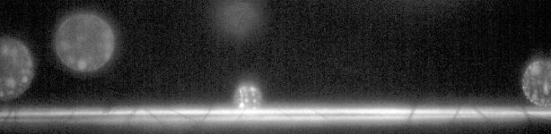

# [New-04.czi](\\sv-01-154\d$\SWAP\Data\2022-11-07-Omaya\2022-11-07\New-04.czi) report
 - **Autostitch** = false
 - ZeissCZIReader v6.14.0
 - ZeissQuickStartCZIReader v0.2.1-SNAPSHOT

# Images 

| Series            | Quick Start Reader | Size | Original Reader | Size | #Diffs |
|-------------------|--------------------|------|-----------------|------|--------|
| Read time (all)   |3245 ms|------|57085 ms|------|--------|
|0||X:2048 Y:500 C:1 Z:2501 T:31||X:2048 Y:500 C:1 Z:2501 T:31|0|

# Metadata

|  Method            | Parameters       | Quick Start Reader | Original Reader | Delta  |
| -------------------|------------------|--------------------|-----------------|------- |
| Initialization     |                  |910 ms|2530 ms|        |
| Reader Size (Mb)     |                  |39.65|111.54|        |
| getPlanePositionZ| Image 0 Plane 1 | -289.131 um | -289.531 um | 0.400 um |
| getPlanePositionZ| Image 0 Plane 2 | -288.731 um | -289.531 um | 0.800 um |
| getPlanePositionZ| Image 0 Plane 3 | -288.331 um | -289.531 um | 1.200 um |
| getPlanePositionZ| Image 0 Plane 4 | -287.931 um | -289.531 um | 1.600 um |
| getPlanePositionZ| Image 0 Plane 5 | -287.531 um | -289.531 um | 2.000 um |
| getPlanePositionZ| Image 0 Plane 6 | -287.131 um | -289.531 um | 2.400 um |
| getPlanePositionZ| Image 0 Plane 7 | -286.731 um | -289.531 um | 2.800 um |
| getPlanePositionZ| Image 0 Plane 8 | -286.331 um | -289.531 um | 3.200 um |
| getPlanePositionZ| Image 0 Plane 9 | -285.931 um | -289.531 um | 3.600 um |
| getPlanePositionZ| Image 0 Plane 10 | -285.531 um | -289.531 um | 4.000 um |
| getPlanePositionZ| Image 0 Plane 11 | -285.131 um | -289.531 um | 4.400 um |
| getPlanePositionZ| Image 0 Plane 12 | -284.731 um | -289.531 um | 4.800 um |
| getPlanePositionZ| Image 0 Plane 13 | -284.331 um | -289.531 um | 5.200 um |
| getPlanePositionZ| Image 0 Plane 14 | -283.931 um | -289.531 um | 5.600 um |
| getPlanePositionZ| Image 0 Plane 15 | -283.531 um | -289.531 um | 6.000 um |
| getPlanePositionZ| Image 0 Plane 16 | -283.131 um | -289.531 um | 6.400 um |
| getPlanePositionZ| Image 0 Plane 17 | -282.731 um | -289.531 um | 6.800 um |
| getPlanePositionZ| Image 0 Plane 18 | -282.331 um | -289.531 um | 7.200 um |
| getPlanePositionZ| Image 0 Plane 19 | -281.931 um | -289.531 um | 7.600 um |
| getPlanePositionZ| Image 0 Plane 20 | -281.531 um | -289.531 um | 8.000 um |
| getPlanePositionZ| Image 0 Plane 21 | -281.131 um | -289.531 um | 8.400 um |
| getPlanePositionZ| Image 0 Plane 22 | -280.731 um | -289.531 um | 8.800 um |
| getPlanePositionZ| Image 0 Plane 23 | -280.331 um | -289.531 um | 9.200 um |
| getPlanePositionZ| Image 0 Plane 24 | -279.931 um | -289.531 um | 9.600 um |
| getPlanePositionZ| Image 0 Plane 25 | -279.531 um | -289.531 um | 10.000 um |
| getPlanePositionZ| Image 0 Plane 26 | -279.131 um | -289.531 um | 10.400 um |
| getPlanePositionZ| Image 0 Plane 27 | -278.731 um | -289.531 um | 10.800 um |
| getPlanePositionZ| Image 0 Plane 28 | -278.331 um | -289.531 um | 11.200 um |
| getPlanePositionZ| Image 0 Plane 29 | -277.931 um | -289.531 um | 11.600 um |
| getPlanePositionZ| Image 0 Plane 30 | -277.531 um | -289.531 um | 12.000 um |
| getPlanePositionZ| Image 0 Plane 31 | -277.131 um | -289.531 um | 12.400 um |
| getPlanePositionZ| Image 0 Plane 32 | -276.731 um | -289.531 um | 12.800 um |
| getPlanePositionZ| Image 0 Plane 33 | -276.331 um | -289.531 um | 13.200 um |
| getPlanePositionZ| Image 0 Plane 34 | -275.931 um | -289.531 um | 13.600 um |
| getPlanePositionZ| Image 0 Plane 35 | -275.531 um | -289.531 um | 14.000 um |
| getPlanePositionZ| Image 0 Plane 36 | -275.131 um | -289.531 um | 14.400 um |
| getPlanePositionZ| Image 0 Plane 37 | -274.731 um | -289.531 um | 14.800 um |
| getPlanePositionZ| Image 0 Plane 38 | -274.331 um | -289.531 um | 15.200 um |
| getPlanePositionZ| Image 0 Plane 39 | -273.931 um | -289.531 um | 15.600 um |
| getPlanePositionZ| Image 0 Plane 40 | -273.531 um | -289.531 um | 16.000 um |
| getPlanePositionZ| Image 0 Plane 41 | -273.131 um | -289.531 um | 16.400 um |
| getPlanePositionZ| Image 0 Plane 42 | -272.731 um | -289.531 um | 16.800 um |
| getPlanePositionZ| Image 0 Plane 43 | -272.331 um | -289.531 um | 17.200 um |
| getPlanePositionZ| Image 0 Plane 44 | -271.931 um | -289.531 um | 17.600 um |
| getPlanePositionZ| Image 0 Plane 45 | -271.531 um | -289.531 um | 18.000 um |
| getPlanePositionZ| Image 0 Plane 46 | -271.131 um | -289.531 um | 18.400 um |
| getPlanePositionZ| Image 0 Plane 47 | -270.731 um | -289.531 um | 18.800 um |
| getPlanePositionZ| Image 0 Plane 48 | -270.331 um | -289.531 um | 19.200 um |
| getPlanePositionZ| Image 0 Plane 49 | -269.931 um | -289.531 um | 19.600 um |
| getPlanePositionZ| Image 0 Plane 50 | -269.531 um | -289.531 um | 20.000 um |
| getPlanePositionZ| Image 0 Plane 51 | -269.131 um | -289.531 um | 20.400 um |
| getPlanePositionZ| Image 0 Plane 52 | -268.731 um | -289.531 um | 20.800 um |
| getPlanePositionZ| Image 0 Plane 53 | -268.331 um | -289.531 um | 21.200 um |
| getPlanePositionZ| Image 0 Plane 54 | -267.931 um | -289.531 um | 21.600 um |
| getPlanePositionZ| Image 0 Plane 55 | -267.531 um | -289.531 um | 22.000 um |
| getPlanePositionZ| Image 0 Plane 56 | -267.131 um | -289.531 um | 22.400 um |
| getPlanePositionZ| Image 0 Plane 57 | -266.731 um | -289.531 um | 22.800 um |
| getPlanePositionZ| Image 0 Plane 58 | -266.331 um | -289.531 um | 23.200 um |
| getPlanePositionZ| Image 0 Plane 59 | -265.931 um | -289.531 um | 23.600 um |
| getPlanePositionZ| Image 0 Plane 60 | -265.531 um | -289.531 um | 24.000 um |
| getPlanePositionZ| Image 0 Plane 61 | -265.131 um | -289.531 um | 24.400 um |
| getPlanePositionZ| Image 0 Plane 62 | -264.731 um | -289.531 um | 24.800 um |
| getPlanePositionZ| Image 0 Plane 63 | -264.331 um | -289.531 um | 25.200 um |
| getPlanePositionZ| Image 0 Plane 64 | -263.931 um | -289.531 um | 25.600 um |
| getPlanePositionZ| Image 0 Plane 65 | -263.531 um | -289.531 um | 26.000 um |
| getPlanePositionZ| Image 0 Plane 66 | -263.131 um | -289.531 um | 26.400 um |
| getPlanePositionZ| Image 0 Plane 67 | -262.731 um | -289.531 um | 26.800 um |
| getPlanePositionZ| Image 0 Plane 68 | -262.331 um | -289.531 um | 27.200 um |
| getPlanePositionZ| Image 0 Plane 69 | -261.931 um | -289.531 um | 27.600 um |
| getPlanePositionZ| Image 0 Plane 70 | -261.531 um | -289.531 um | 28.000 um |
| getPlanePositionZ| Image 0 Plane 71 | -261.131 um | -289.531 um | 28.400 um |
| getPlanePositionZ| Image 0 Plane 72 | -260.731 um | -289.531 um | 28.800 um |
| getPlanePositionZ| Image 0 Plane 73 | -260.331 um | -289.531 um | 29.200 um |
| getPlanePositionZ| Image 0 Plane 74 | -259.931 um | -289.531 um | 29.600 um |
| getPlanePositionZ| Image 0 Plane 75 | -259.531 um | -289.531 um | 30.000 um |
| getPlanePositionZ| Image 0 Plane 76 | -259.131 um | -289.531 um | 30.400 um |
| getPlanePositionZ| Image 0 Plane 77 | -258.731 um | -289.531 um | 30.800 um |
| getPlanePositionZ| Image 0 Plane 78 | -258.331 um | -289.531 um | 31.200 um |
| getPlanePositionZ| Image 0 Plane 79 | -257.931 um | -289.531 um | 31.600 um |
| getPlanePositionZ| Image 0 Plane 80 | -257.531 um | -289.531 um | 32.000 um |
| getPlanePositionZ| Image 0 Plane 81 | -257.131 um | -289.531 um | 32.400 um |
| getPlanePositionZ| Image 0 Plane 82 | -256.731 um | -289.531 um | 32.800 um |
| getPlanePositionZ| Image 0 Plane 83 | -256.331 um | -289.531 um | 33.200 um |
| getPlanePositionZ| Image 0 Plane 84 | -255.931 um | -289.531 um | 33.600 um |
| getPlanePositionZ| Image 0 Plane 85 | -255.531 um | -289.531 um | 34.000 um |
| getPlanePositionZ| Image 0 Plane 86 | -255.131 um | -289.531 um | 34.400 um |
| getPlanePositionZ| Image 0 Plane 87 | -254.731 um | -289.531 um | 34.800 um |
| getPlanePositionZ| Image 0 Plane 88 | -254.331 um | -289.531 um | 35.200 um |
| getPlanePositionZ| Image 0 Plane 89 | -253.931 um | -289.531 um | 35.600 um |
| getPlanePositionZ| Image 0 Plane 90 | -253.531 um | -289.531 um | 36.000 um |
| getPlanePositionZ| Image 0 Plane 91 | -253.131 um | -289.531 um | 36.400 um |
| getPlanePositionZ| Image 0 Plane 92 | -252.731 um | -289.531 um | 36.800 um |
| getPlanePositionZ| Image 0 Plane 93 | -252.331 um | -289.531 um | 37.200 um |
| getPlanePositionZ| Image 0 Plane 94 | -251.931 um | -289.531 um | 37.600 um |
| getPlanePositionZ| Image 0 Plane 95 | -251.531 um | -289.531 um | 38.000 um |
| getPlanePositionZ| Image 0 Plane 96 | -251.131 um | -289.531 um | 38.400 um |
| getPlanePositionZ| Image 0 Plane 97 | -250.731 um | -289.531 um | 38.800 um |
| getPlanePositionZ| Image 0 Plane 98 | -250.331 um | -289.531 um | 39.200 um |
| getPlanePositionZ| Image 0 Plane 99 | -249.931 um | -289.531 um | 39.600 um |
| getPlanePositionZ| Image 0 Plane 100 | -249.531 um | -289.531 um | 40.000 um |
| getPlanePositionZ| Image 0 Plane 101 | -249.131 um | -289.531 um | 40.400 um |
| getPlanePositionZ| Image 0 Plane 102 | -248.731 um | -289.531 um | 40.800 um |
| getPlanePositionZ| Image 0 Plane 103 | -248.331 um | -289.531 um | 41.200 um |
| getPlanePositionZ| Image 0 Plane 104 | -247.931 um | -289.531 um | 41.600 um |
| getPlanePositionZ| Image 0 Plane 105 | -247.531 um | -289.531 um | 42.000 um |
| getPlanePositionZ| Image 0 Plane 106 | -247.131 um | -289.531 um | 42.400 um |
| getPlanePositionZ| Image 0 Plane 107 | -246.731 um | -289.531 um | 42.800 um |
| getPlanePositionZ| Image 0 Plane 108 | -246.331 um | -289.531 um | 43.200 um |
| getPlanePositionZ| Image 0 Plane 109 | -245.931 um | -289.531 um | 43.600 um |
| getPlanePositionZ| Image 0 Plane 110 | -245.531 um | -289.531 um | 44.000 um |
| getPlanePositionZ| Image 0 Plane 111 | -245.131 um | -289.531 um | 44.400 um |
| getPlanePositionZ| Image 0 Plane 112 | -244.731 um | -289.531 um | 44.800 um |
| getPlanePositionZ| Image 0 Plane 113 | -244.331 um | -289.531 um | 45.200 um |
| getPlanePositionZ| Image 0 Plane 114 | -243.931 um | -289.531 um | 45.600 um |
| getPlanePositionZ| Image 0 Plane 115 | -243.531 um | -289.531 um | 46.000 um |
| getPlanePositionZ| Image 0 Plane 116 | -243.131 um | -289.531 um | 46.400 um |
| getPlanePositionZ| Image 0 Plane 117 | -242.731 um | -289.531 um | 46.800 um |
| getPlanePositionZ| Image 0 Plane 118 | -242.331 um | -289.531 um | 47.200 um |
| getPlanePositionZ| Image 0 Plane 119 | -241.931 um | -289.531 um | 47.600 um |
| getPlanePositionZ| Image 0 Plane 120 | -241.531 um | -289.531 um | 48.000 um |
| getPlanePositionZ| Image 0 Plane 121 | -241.131 um | -289.531 um | 48.400 um |
| getPlanePositionZ| Image 0 Plane 122 | -240.731 um | -289.531 um | 48.800 um |
| getPlanePositionZ| Image 0 Plane 123 | -240.331 um | -289.531 um | 49.200 um |
| getPlanePositionZ| Image 0 Plane 124 | -239.931 um | -289.531 um | 49.600 um |
| getPlanePositionZ| Image 0 Plane 125 | -239.531 um | -289.531 um | 50.000 um |
| getPlanePositionZ| Image 0 Plane 126 | -239.131 um | -289.531 um | 50.400 um |
| getPlanePositionZ| Image 0 Plane 127 | -238.731 um | -289.531 um | 50.800 um |
| getPlanePositionZ| Image 0 Plane 128 | -238.331 um | -289.531 um | 51.200 um |
| getPlanePositionZ| Image 0 Plane 129 | -237.931 um | -289.531 um | 51.600 um |
| getPlanePositionZ| Image 0 Plane 130 | -237.531 um | -289.531 um | 52.000 um |
| getPlanePositionZ| Image 0 Plane 131 | -237.131 um | -289.531 um | 52.400 um |
| getPlanePositionZ| Image 0 Plane 132 | -236.731 um | -289.531 um | 52.800 um |
| getPlanePositionZ| Image 0 Plane 133 | -236.331 um | -289.531 um | 53.200 um |
| getPlanePositionZ| Image 0 Plane 134 | -235.931 um | -289.531 um | 53.600 um |
| getPlanePositionZ| Image 0 Plane 135 | -235.531 um | -289.531 um | 54.000 um |
| getPlanePositionZ| Image 0 Plane 136 | -235.131 um | -289.531 um | 54.400 um |
| getPlanePositionZ| Image 0 Plane 137 | -234.731 um | -289.531 um | 54.800 um |
| getPlanePositionZ| Image 0 Plane 138 | -234.331 um | -289.531 um | 55.200 um |
| getPlanePositionZ| Image 0 Plane 139 | -233.931 um | -289.531 um | 55.600 um |
| getPlanePositionZ| Image 0 Plane 140 | -233.531 um | -289.531 um | 56.000 um |
| getPlanePositionZ| Image 0 Plane 141 | -233.131 um | -289.531 um | 56.400 um |
| getPlanePositionZ| Image 0 Plane 142 | -232.731 um | -289.531 um | 56.800 um |
| getPlanePositionZ| Image 0 Plane 143 | -232.331 um | -289.531 um | 57.200 um |
| getPlanePositionZ| Image 0 Plane 144 | -231.931 um | -289.531 um | 57.600 um |
| getPlanePositionZ| Image 0 Plane 145 | -231.531 um | -289.531 um | 58.000 um |
| getPlanePositionZ| Image 0 Plane 146 | -231.131 um | -289.531 um | 58.400 um |
| getPlanePositionZ| Image 0 Plane 147 | -230.731 um | -289.531 um | 58.800 um |
| getPlanePositionZ| Image 0 Plane 148 | -230.331 um | -289.531 um | 59.200 um |
| getPlanePositionZ| Image 0 Plane 149 | -229.931 um | -289.531 um | 59.600 um |
| getPlanePositionZ| Image 0 Plane 150 | -229.531 um | -289.531 um | 60.000 um |
| getPlanePositionZ| Image 0 Plane 151 | -229.131 um | -289.531 um | 60.400 um |
| getPlanePositionZ| Image 0 Plane 152 | -228.731 um | -289.531 um | 60.800 um |
| getPlanePositionZ| Image 0 Plane 153 | -228.331 um | -289.531 um | 61.200 um |
| getPlanePositionZ| Image 0 Plane 154 | -227.931 um | -289.531 um | 61.600 um |
| getPlanePositionZ| Image 0 Plane 155 | -227.531 um | -289.531 um | 62.000 um |
| getPlanePositionZ| Image 0 Plane 156 | -227.131 um | -289.531 um | 62.400 um |
| getPlanePositionZ| Image 0 Plane 157 | -226.731 um | -289.531 um | 62.800 um |
| getPlanePositionZ| Image 0 Plane 158 | -226.331 um | -289.531 um | 63.200 um |
| getPlanePositionZ| Image 0 Plane 159 | -225.931 um | -289.531 um | 63.600 um |
| getPlanePositionZ| Image 0 Plane 160 | -225.531 um | -289.531 um | 64.000 um |
| getPlanePositionZ| Image 0 Plane 161 | -225.131 um | -289.531 um | 64.400 um |
| getPlanePositionZ| Image 0 Plane 162 | -224.731 um | -289.531 um | 64.800 um |
| getPlanePositionZ| Image 0 Plane 163 | -224.331 um | -289.531 um | 65.200 um |
| getPlanePositionZ| Image 0 Plane 164 | -223.931 um | -289.531 um | 65.600 um |
| getPlanePositionZ| Image 0 Plane 165 | -223.531 um | -289.531 um | 66.000 um |
| getPlanePositionZ| Image 0 Plane 166 | -223.131 um | -289.531 um | 66.400 um |
| getPlanePositionZ| Image 0 Plane 167 | -222.731 um | -289.531 um | 66.800 um |
| getPlanePositionZ| Image 0 Plane 168 | -222.331 um | -289.531 um | 67.200 um |
| getPlanePositionZ| Image 0 Plane 169 | -221.931 um | -289.531 um | 67.600 um |
| getPlanePositionZ| Image 0 Plane 170 | -221.531 um | -289.531 um | 68.000 um |
| getPlanePositionZ| Image 0 Plane 171 | -221.131 um | -289.531 um | 68.400 um |
| getPlanePositionZ| Image 0 Plane 172 | -220.731 um | -289.531 um | 68.800 um |
| getPlanePositionZ| Image 0 Plane 173 | -220.331 um | -289.531 um | 69.200 um |
| getPlanePositionZ| Image 0 Plane 174 | -219.931 um | -289.531 um | 69.600 um |
| getPlanePositionZ| Image 0 Plane 175 | -219.531 um | -289.531 um | 70.000 um |
| getPlanePositionZ| Image 0 Plane 176 | -219.131 um | -289.531 um | 70.400 um |
| getPlanePositionZ| Image 0 Plane 177 | -218.731 um | -289.531 um | 70.800 um |
| getPlanePositionZ| Image 0 Plane 178 | -218.331 um | -289.531 um | 71.200 um |
| getPlanePositionZ| Image 0 Plane 179 | -217.931 um | -289.531 um | 71.600 um |
| getPlanePositionZ| Image 0 Plane 180 | -217.531 um | -289.531 um | 72.000 um |
| getPlanePositionZ| Image 0 Plane 181 | -217.131 um | -289.531 um | 72.400 um |
| getPlanePositionZ| Image 0 Plane 182 | -216.731 um | -289.531 um | 72.800 um |
| getPlanePositionZ| Image 0 Plane 183 | -216.331 um | -289.531 um | 73.200 um |
| getPlanePositionZ| Image 0 Plane 184 | -215.931 um | -289.531 um | 73.600 um |
| getPlanePositionZ| Image 0 Plane 185 | -215.531 um | -289.531 um | 74.000 um |
| getPlanePositionZ| Image 0 Plane 186 | -215.131 um | -289.531 um | 74.400 um |
| getPlanePositionZ| Image 0 Plane 187 | -214.731 um | -289.531 um | 74.800 um |
| getPlanePositionZ| Image 0 Plane 188 | -214.331 um | -289.531 um | 75.200 um |
| getPlanePositionZ| Image 0 Plane 189 | -213.931 um | -289.531 um | 75.600 um |
| getPlanePositionZ| Image 0 Plane 190 | -213.531 um | -289.531 um | 76.000 um |
| getPlanePositionZ| Image 0 Plane 191 | -213.131 um | -289.531 um | 76.400 um |
| getPlanePositionZ| Image 0 Plane 192 | -212.731 um | -289.531 um | 76.800 um |
| getPlanePositionZ| Image 0 Plane 193 | -212.331 um | -289.531 um | 77.200 um |
| getPlanePositionZ| Image 0 Plane 194 | -211.931 um | -289.531 um | 77.600 um |
| getPlanePositionZ| Image 0 Plane 195 | -211.531 um | -289.531 um | 78.000 um |
| getPlanePositionZ| Image 0 Plane 196 | -211.131 um | -289.531 um | 78.400 um |
| getPlanePositionZ| Image 0 Plane 197 | -210.731 um | -289.531 um | 78.800 um |
| getPlanePositionZ| Image 0 Plane 198 | -210.331 um | -289.531 um | 79.200 um |
| getPlanePositionZ| Image 0 Plane 199 | -209.931 um | -289.531 um | 79.600 um |
| getPlanePositionZ| Image 0 Plane 200 | -209.531 um | -289.531 um | 80.000 um |
| getPlanePositionZ| Image 0 Plane 201 | -209.131 um | -289.531 um | 80.400 um |
| getPlanePositionZ| Image 0 Plane 202 | -208.731 um | -289.531 um | 80.800 um |
| getPlanePositionZ| Image 0 Plane 203 | -208.331 um | -289.531 um | 81.200 um |
| getPlanePositionZ| Image 0 Plane 204 | -207.931 um | -289.531 um | 81.600 um |
| getPlanePositionZ| Image 0 Plane 205 | -207.531 um | -289.531 um | 82.000 um |
| getPlanePositionZ| Image 0 Plane 206 | -207.131 um | -289.531 um | 82.400 um |
| getPlanePositionZ| Image 0 Plane 207 | -206.731 um | -289.531 um | 82.800 um |
| getPlanePositionZ| Image 0 Plane 208 | -206.331 um | -289.531 um | 83.200 um |
| getPlanePositionZ| Image 0 Plane 209 | -205.931 um | -289.531 um | 83.600 um |
| getPlanePositionZ| Image 0 Plane 210 | -205.531 um | -289.531 um | 84.000 um |
| getPlanePositionZ| Image 0 Plane 211 | -205.131 um | -289.531 um | 84.400 um |
| getPlanePositionZ| Image 0 Plane 212 | -204.731 um | -289.531 um | 84.800 um |
| getPlanePositionZ| Image 0 Plane 213 | -204.331 um | -289.531 um | 85.200 um |
| getPlanePositionZ| Image 0 Plane 214 | -203.931 um | -289.531 um | 85.600 um |
| getPlanePositionZ| Image 0 Plane 215 | -203.531 um | -289.531 um | 86.000 um |
| getPlanePositionZ| Image 0 Plane 216 | -203.131 um | -289.531 um | 86.400 um |
| getPlanePositionZ| Image 0 Plane 217 | -202.731 um | -289.531 um | 86.800 um |
| getPlanePositionZ| Image 0 Plane 218 | -202.331 um | -289.531 um | 87.200 um |
| getPlanePositionZ| Image 0 Plane 219 | -201.931 um | -289.531 um | 87.600 um |
| getPlanePositionZ| Image 0 Plane 220 | -201.531 um | -289.531 um | 88.000 um |
| getPlanePositionZ| Image 0 Plane 221 | -201.131 um | -289.531 um | 88.400 um |
| getPlanePositionZ| Image 0 Plane 222 | -200.731 um | -289.531 um | 88.800 um |
| getPlanePositionZ| Image 0 Plane 223 | -200.331 um | -289.531 um | 89.200 um |
| getPlanePositionZ| Image 0 Plane 224 | -199.931 um | -289.531 um | 89.600 um |
| getPlanePositionZ| Image 0 Plane 225 | -199.531 um | -289.531 um | 90.000 um |
| getPlanePositionZ| Image 0 Plane 226 | -199.131 um | -289.531 um | 90.400 um |
| getPlanePositionZ| Image 0 Plane 227 | -198.731 um | -289.531 um | 90.800 um |
| getPlanePositionZ| Image 0 Plane 228 | -198.331 um | -289.531 um | 91.200 um |
| getPlanePositionZ| Image 0 Plane 229 | -197.931 um | -289.531 um | 91.600 um |
| getPlanePositionZ| Image 0 Plane 230 | -197.531 um | -289.531 um | 92.000 um |
| getPlanePositionZ| Image 0 Plane 231 | -197.131 um | -289.531 um | 92.400 um |
| getPlanePositionZ| Image 0 Plane 232 | -196.731 um | -289.531 um | 92.800 um |
| getPlanePositionZ| Image 0 Plane 233 | -196.331 um | -289.531 um | 93.200 um |
| getPlanePositionZ| Image 0 Plane 234 | -195.931 um | -289.531 um | 93.600 um |
| getPlanePositionZ| Image 0 Plane 235 | -195.531 um | -289.531 um | 94.000 um |
| getPlanePositionZ| Image 0 Plane 236 | -195.131 um | -289.531 um | 94.400 um |
| getPlanePositionZ| Image 0 Plane 237 | -194.731 um | -289.531 um | 94.800 um |
| getPlanePositionZ| Image 0 Plane 238 | -194.331 um | -289.531 um | 95.200 um |
| getPlanePositionZ| Image 0 Plane 239 | -193.931 um | -289.531 um | 95.600 um |
| getPlanePositionZ| Image 0 Plane 240 | -193.531 um | -289.531 um | 96.000 um |
| getPlanePositionZ| Image 0 Plane 241 | -193.131 um | -289.531 um | 96.400 um |
| getPlanePositionZ| Image 0 Plane 242 | -192.731 um | -289.531 um | 96.800 um |
| getPlanePositionZ| Image 0 Plane 243 | -192.331 um | -289.531 um | 97.200 um |
| getPlanePositionZ| Image 0 Plane 244 | -191.931 um | -289.531 um | 97.600 um |
| getPlanePositionZ| Image 0 Plane 245 | -191.531 um | -289.531 um | 98.000 um |
| getPlanePositionZ| Image 0 Plane 246 | -191.131 um | -289.531 um | 98.400 um |
| getPlanePositionZ| Image 0 Plane 247 | -190.731 um | -289.531 um | 98.800 um |
| getPlanePositionZ| Image 0 Plane 248 | -190.331 um | -289.531 um | 99.200 um |
| getPlanePositionZ| Image 0 Plane 249 | -189.931 um | -289.531 um | 99.600 um |
| getPlanePositionZ| Image 0 Plane 250 | -189.531 um | -289.531 um | 100.000 um |
| getPlanePositionZ| Image 0 Plane 251 | -189.131 um | -289.531 um | 100.400 um |
| getPlanePositionZ| Image 0 Plane 252 | -188.731 um | -289.531 um | 100.800 um |
| getPlanePositionZ| Image 0 Plane 253 | -188.331 um | -289.531 um | 101.200 um |
| getPlanePositionZ| Image 0 Plane 254 | -187.931 um | -289.531 um | 101.600 um |
| getPlanePositionZ| Image 0 Plane 255 | -187.531 um | -289.531 um | 102.000 um |
| getPlanePositionZ| Image 0 Plane 256 | -187.131 um | -289.531 um | 102.400 um |
| getPlanePositionZ| Image 0 Plane 257 | -186.731 um | -289.531 um | 102.800 um |
| getPlanePositionZ| Image 0 Plane 258 | -186.331 um | -289.531 um | 103.200 um |
| getPlanePositionZ| Image 0 Plane 259 | -185.931 um | -289.531 um | 103.600 um |
| getPlanePositionZ| Image 0 Plane 260 | -185.531 um | -289.531 um | 104.000 um |
| getPlanePositionZ| Image 0 Plane 261 | -185.131 um | -289.531 um | 104.400 um |
| getPlanePositionZ| Image 0 Plane 262 | -184.731 um | -289.531 um | 104.800 um |
| getPlanePositionZ| Image 0 Plane 263 | -184.331 um | -289.531 um | 105.200 um |
| getPlanePositionZ| Image 0 Plane 264 | -183.931 um | -289.531 um | 105.600 um |
| getPlanePositionZ| Image 0 Plane 265 | -183.531 um | -289.531 um | 106.000 um |
| getPlanePositionZ| Image 0 Plane 266 | -183.131 um | -289.531 um | 106.400 um |
| getPlanePositionZ| Image 0 Plane 267 | -182.731 um | -289.531 um | 106.800 um |
| getPlanePositionZ| Image 0 Plane 268 | -182.331 um | -289.531 um | 107.200 um |
| getPlanePositionZ| Image 0 Plane 269 | -181.931 um | -289.531 um | 107.600 um |
| getPlanePositionZ| Image 0 Plane 270 | -181.531 um | -289.531 um | 108.000 um |
| getPlanePositionZ| Image 0 Plane 271 | -181.131 um | -289.531 um | 108.400 um |
| getPlanePositionZ| Image 0 Plane 272 | -180.731 um | -289.531 um | 108.800 um |
| getPlanePositionZ| Image 0 Plane 273 | -180.331 um | -289.531 um | 109.200 um |
| getPlanePositionZ| Image 0 Plane 274 | -179.931 um | -289.531 um | 109.600 um |
| getPlanePositionZ| Image 0 Plane 275 | -179.531 um | -289.531 um | 110.000 um |
| getPlanePositionZ| Image 0 Plane 276 | -179.131 um | -289.531 um | 110.400 um |
| getPlanePositionZ| Image 0 Plane 277 | -178.731 um | -289.531 um | 110.800 um |
| getPlanePositionZ| Image 0 Plane 278 | -178.331 um | -289.531 um | 111.200 um |
| getPlanePositionZ| Image 0 Plane 279 | -177.931 um | -289.531 um | 111.600 um |
| getPlanePositionZ| Image 0 Plane 280 | -177.531 um | -289.531 um | 112.000 um |
| getPlanePositionZ| Image 0 Plane 281 | -177.131 um | -289.531 um | 112.400 um |
| getPlanePositionZ| Image 0 Plane 282 | -176.731 um | -289.531 um | 112.800 um |
| getPlanePositionZ| Image 0 Plane 283 | -176.331 um | -289.531 um | 113.200 um |
| getPlanePositionZ| Image 0 Plane 284 | -175.931 um | -289.531 um | 113.600 um |
| getPlanePositionZ| Image 0 Plane 285 | -175.531 um | -289.531 um | 114.000 um |
| getPlanePositionZ| Image 0 Plane 286 | -175.131 um | -289.531 um | 114.400 um |
| getPlanePositionZ| Image 0 Plane 287 | -174.731 um | -289.531 um | 114.800 um |
| getPlanePositionZ| Image 0 Plane 288 | -174.331 um | -289.531 um | 115.200 um |
| getPlanePositionZ| Image 0 Plane 289 | -173.931 um | -289.531 um | 115.600 um |
| getPlanePositionZ| Image 0 Plane 290 | -173.531 um | -289.531 um | 116.000 um |
| getPlanePositionZ| Image 0 Plane 291 | -173.131 um | -289.531 um | 116.400 um |
| getPlanePositionZ| Image 0 Plane 292 | -172.731 um | -289.531 um | 116.800 um |
| getPlanePositionZ| Image 0 Plane 293 | -172.331 um | -289.531 um | 117.200 um |
| getPlanePositionZ| Image 0 Plane 294 | -171.931 um | -289.531 um | 117.600 um |
| getPlanePositionZ| Image 0 Plane 295 | -171.531 um | -289.531 um | 118.000 um |
| getPlanePositionZ| Image 0 Plane 296 | -171.131 um | -289.531 um | 118.400 um |
| getPlanePositionZ| Image 0 Plane 297 | -170.731 um | -289.531 um | 118.800 um |
| getPlanePositionZ| Image 0 Plane 298 | -170.331 um | -289.531 um | 119.200 um |
| getPlanePositionZ| Image 0 Plane 299 | -169.931 um | -289.531 um | 119.600 um |
| getPlanePositionZ| Image 0 Plane 300 | -169.531 um | -289.531 um | 120.000 um |
| getPlanePositionZ| Image 0 Plane 301 | -169.131 um | -289.531 um | 120.400 um |
| getPlanePositionZ| Image 0 Plane 302 | -168.731 um | -289.531 um | 120.800 um |
| getPlanePositionZ| Image 0 Plane 303 | -168.331 um | -289.531 um | 121.200 um |
| getPlanePositionZ| Image 0 Plane 304 | -167.931 um | -289.531 um | 121.600 um |
| getPlanePositionZ| Image 0 Plane 305 | -167.531 um | -289.531 um | 122.000 um |
| getPlanePositionZ| Image 0 Plane 306 | -167.131 um | -289.531 um | 122.400 um |
| getPlanePositionZ| Image 0 Plane 307 | -166.731 um | -289.531 um | 122.800 um |
| getPlanePositionZ| Image 0 Plane 308 | -166.331 um | -289.531 um | 123.200 um |
| getPlanePositionZ| Image 0 Plane 309 | -165.931 um | -289.531 um | 123.600 um |
| getPlanePositionZ| Image 0 Plane 310 | -165.531 um | -289.531 um | 124.000 um |
| getPlanePositionZ| Image 0 Plane 311 | -165.131 um | -289.531 um | 124.400 um |
| getPlanePositionZ| Image 0 Plane 312 | -164.731 um | -289.531 um | 124.800 um |
| getPlanePositionZ| Image 0 Plane 313 | -164.331 um | -289.531 um | 125.200 um |
| getPlanePositionZ| Image 0 Plane 314 | -163.931 um | -289.531 um | 125.600 um |
| getPlanePositionZ| Image 0 Plane 315 | -163.531 um | -289.531 um | 126.000 um |
| getPlanePositionZ| Image 0 Plane 316 | -163.131 um | -289.531 um | 126.400 um |
| getPlanePositionZ| Image 0 Plane 317 | -162.731 um | -289.531 um | 126.800 um |
| getPlanePositionZ| Image 0 Plane 318 | -162.331 um | -289.531 um | 127.200 um |
| getPlanePositionZ| Image 0 Plane 319 | -161.931 um | -289.531 um | 127.600 um |
| getPlanePositionZ| Image 0 Plane 320 | -161.531 um | -289.531 um | 128.000 um |
| getPlanePositionZ| Image 0 Plane 321 | -161.131 um | -289.531 um | 128.400 um |
| getPlanePositionZ| Image 0 Plane 322 | -160.731 um | -289.531 um | 128.800 um |
| getPlanePositionZ| Image 0 Plane 323 | -160.331 um | -289.531 um | 129.200 um |
| getPlanePositionZ| Image 0 Plane 324 | -159.931 um | -289.531 um | 129.600 um |
| getPlanePositionZ| Image 0 Plane 325 | -159.531 um | -289.531 um | 130.000 um |
| getPlanePositionZ| Image 0 Plane 326 | -159.131 um | -289.531 um | 130.400 um |
| getPlanePositionZ| Image 0 Plane 327 | -158.731 um | -289.531 um | 130.800 um |
| getPlanePositionZ| Image 0 Plane 328 | -158.331 um | -289.531 um | 131.200 um |
| getPlanePositionZ| Image 0 Plane 329 | -157.931 um | -289.531 um | 131.600 um |
| getPlanePositionZ| Image 0 Plane 330 | -157.531 um | -289.531 um | 132.000 um |
| getPlanePositionZ| Image 0 Plane 331 | -157.131 um | -289.531 um | 132.400 um |
| getPlanePositionZ| Image 0 Plane 332 | -156.731 um | -289.531 um | 132.800 um |
| getPlanePositionZ| Image 0 Plane 333 | -156.331 um | -289.531 um | 133.200 um |
| getPlanePositionZ| Image 0 Plane 334 | -155.931 um | -289.531 um | 133.600 um |
| getPlanePositionZ| Image 0 Plane 335 | -155.531 um | -289.531 um | 134.000 um |
| getPlanePositionZ| Image 0 Plane 336 | -155.131 um | -289.531 um | 134.400 um |
| getPlanePositionZ| Image 0 Plane 337 | -154.731 um | -289.531 um | 134.800 um |
| getPlanePositionZ| Image 0 Plane 338 | -154.331 um | -289.531 um | 135.200 um |
| getPlanePositionZ| Image 0 Plane 339 | -153.931 um | -289.531 um | 135.600 um |
| getPlanePositionZ| Image 0 Plane 340 | -153.531 um | -289.531 um | 136.000 um |
| getPlanePositionZ| Image 0 Plane 341 | -153.131 um | -289.531 um | 136.400 um |
| getPlanePositionZ| Image 0 Plane 342 | -152.731 um | -289.531 um | 136.800 um |
| getPlanePositionZ| Image 0 Plane 343 | -152.331 um | -289.531 um | 137.200 um |
| getPlanePositionZ| Image 0 Plane 344 | -151.931 um | -289.531 um | 137.600 um |
| getPlanePositionZ| Image 0 Plane 345 | -151.531 um | -289.531 um | 138.000 um |
| getPlanePositionZ| Image 0 Plane 346 | -151.131 um | -289.531 um | 138.400 um |
| getPlanePositionZ| Image 0 Plane 347 | -150.731 um | -289.531 um | 138.800 um |
| getPlanePositionZ| Image 0 Plane 348 | -150.331 um | -289.531 um | 139.200 um |
| getPlanePositionZ| Image 0 Plane 349 | -149.931 um | -289.531 um | 139.600 um |
| getPlanePositionZ| Image 0 Plane 350 | -149.531 um | -289.531 um | 140.000 um |
| getPlanePositionZ| Image 0 Plane 351 | -149.131 um | -289.531 um | 140.400 um |
| getPlanePositionZ| Image 0 Plane 352 | -148.731 um | -289.531 um | 140.800 um |
| getPlanePositionZ| Image 0 Plane 353 | -148.331 um | -289.531 um | 141.200 um |
| getPlanePositionZ| Image 0 Plane 354 | -147.931 um | -289.531 um | 141.600 um |
| getPlanePositionZ| Image 0 Plane 355 | -147.531 um | -289.531 um | 142.000 um |
| getPlanePositionZ| Image 0 Plane 356 | -147.131 um | -289.531 um | 142.400 um |
| getPlanePositionZ| Image 0 Plane 357 | -146.731 um | -289.531 um | 142.800 um |
| getPlanePositionZ| Image 0 Plane 358 | -146.331 um | -289.531 um | 143.200 um |
| getPlanePositionZ| Image 0 Plane 359 | -145.931 um | -289.531 um | 143.600 um |
| getPlanePositionZ| Image 0 Plane 360 | -145.531 um | -289.531 um | 144.000 um |
| getPlanePositionZ| Image 0 Plane 361 | -145.131 um | -289.531 um | 144.400 um |
| getPlanePositionZ| Image 0 Plane 362 | -144.731 um | -289.531 um | 144.800 um |
| getPlanePositionZ| Image 0 Plane 363 | -144.331 um | -289.531 um | 145.200 um |
| getPlanePositionZ| Image 0 Plane 364 | -143.931 um | -289.531 um | 145.600 um |
| getPlanePositionZ| Image 0 Plane 365 | -143.531 um | -289.531 um | 146.000 um |
| getPlanePositionZ| Image 0 Plane 366 | -143.131 um | -289.531 um | 146.400 um |
| getPlanePositionZ| Image 0 Plane 367 | -142.731 um | -289.531 um | 146.800 um |
| getPlanePositionZ| Image 0 Plane 368 | -142.331 um | -289.531 um | 147.200 um |
| getPlanePositionZ| Image 0 Plane 369 | -141.931 um | -289.531 um | 147.600 um |
| getPlanePositionZ| Image 0 Plane 370 | -141.531 um | -289.531 um | 148.000 um |
| getPlanePositionZ| Image 0 Plane 371 | -141.131 um | -289.531 um | 148.400 um |
| getPlanePositionZ| Image 0 Plane 372 | -140.731 um | -289.531 um | 148.800 um |
| getPlanePositionZ| Image 0 Plane 373 | -140.331 um | -289.531 um | 149.200 um |
| getPlanePositionZ| Image 0 Plane 374 | -139.931 um | -289.531 um | 149.600 um |
| getPlanePositionZ| Image 0 Plane 375 | -139.531 um | -289.531 um | 150.000 um |
| getPlanePositionZ| Image 0 Plane 376 | -139.131 um | -289.531 um | 150.400 um |
| getPlanePositionZ| Image 0 Plane 377 | -138.731 um | -289.531 um | 150.800 um |
| getPlanePositionZ| Image 0 Plane 378 | -138.331 um | -289.531 um | 151.200 um |
| getPlanePositionZ| Image 0 Plane 379 | -137.931 um | -289.531 um | 151.600 um |
| getPlanePositionZ| Image 0 Plane 380 | -137.531 um | -289.531 um | 152.000 um |
| getPlanePositionZ| Image 0 Plane 381 | -137.131 um | -289.531 um | 152.400 um |
| getPlanePositionZ| Image 0 Plane 382 | -136.731 um | -289.531 um | 152.800 um |
| getPlanePositionZ| Image 0 Plane 383 | -136.331 um | -289.531 um | 153.200 um |
| getPlanePositionZ| Image 0 Plane 384 | -135.931 um | -289.531 um | 153.600 um |
| getPlanePositionZ| Image 0 Plane 385 | -135.531 um | -289.531 um | 154.000 um |
| getPlanePositionZ| Image 0 Plane 386 | -135.131 um | -289.531 um | 154.400 um |
| getPlanePositionZ| Image 0 Plane 387 | -134.731 um | -289.531 um | 154.800 um |
| getPlanePositionZ| Image 0 Plane 388 | -134.331 um | -289.531 um | 155.200 um |
| getPlanePositionZ| Image 0 Plane 389 | -133.931 um | -289.531 um | 155.600 um |
| getPlanePositionZ| Image 0 Plane 390 | -133.531 um | -289.531 um | 156.000 um |
| getPlanePositionZ| Image 0 Plane 391 | -133.131 um | -289.531 um | 156.400 um |
| getPlanePositionZ| Image 0 Plane 392 | -132.731 um | -289.531 um | 156.800 um |
| getPlanePositionZ| Image 0 Plane 393 | -132.331 um | -289.531 um | 157.200 um |
| getPlanePositionZ| Image 0 Plane 394 | -131.931 um | -289.531 um | 157.600 um |
| getPlanePositionZ| Image 0 Plane 395 | -131.531 um | -289.531 um | 158.000 um |
| getPlanePositionZ| Image 0 Plane 396 | -131.131 um | -289.531 um | 158.400 um |
| getPlanePositionZ| Image 0 Plane 397 | -130.731 um | -289.531 um | 158.800 um |
| getPlanePositionZ| Image 0 Plane 398 | -130.331 um | -289.531 um | 159.200 um |
| getPlanePositionZ| Image 0 Plane 399 | -129.931 um | -289.531 um | 159.600 um |
| getPlanePositionZ| Image 0 Plane 400 | -129.531 um | -289.531 um | 160.000 um |
| getPlanePositionZ| Image 0 Plane 401 | -129.131 um | -289.531 um | 160.400 um |
| getPlanePositionZ| Image 0 Plane 402 | -128.731 um | -289.531 um | 160.800 um |
| getPlanePositionZ| Image 0 Plane 403 | -128.331 um | -289.531 um | 161.200 um |
| getPlanePositionZ| Image 0 Plane 404 | -127.931 um | -289.531 um | 161.600 um |
| getPlanePositionZ| Image 0 Plane 405 | -127.531 um | -289.531 um | 162.000 um |
| getPlanePositionZ| Image 0 Plane 406 | -127.131 um | -289.531 um | 162.400 um |
| getPlanePositionZ| Image 0 Plane 407 | -126.731 um | -289.531 um | 162.800 um |
| getPlanePositionZ| Image 0 Plane 408 | -126.331 um | -289.531 um | 163.200 um |
| getPlanePositionZ| Image 0 Plane 409 | -125.931 um | -289.531 um | 163.600 um |
| getPlanePositionZ| Image 0 Plane 410 | -125.531 um | -289.531 um | 164.000 um |
| getPlanePositionZ| Image 0 Plane 411 | -125.131 um | -289.531 um | 164.400 um |
| getPlanePositionZ| Image 0 Plane 412 | -124.731 um | -289.531 um | 164.800 um |
| getPlanePositionZ| Image 0 Plane 413 | -124.331 um | -289.531 um | 165.200 um |
| getPlanePositionZ| Image 0 Plane 414 | -123.931 um | -289.531 um | 165.600 um |
| getPlanePositionZ| Image 0 Plane 415 | -123.531 um | -289.531 um | 166.000 um |
| getPlanePositionZ| Image 0 Plane 416 | -123.131 um | -289.531 um | 166.400 um |
| getPlanePositionZ| Image 0 Plane 417 | -122.731 um | -289.531 um | 166.800 um |
| getPlanePositionZ| Image 0 Plane 418 | -122.331 um | -289.531 um | 167.200 um |
| getPlanePositionZ| Image 0 Plane 419 | -121.931 um | -289.531 um | 167.600 um |
| getPlanePositionZ| Image 0 Plane 420 | -121.531 um | -289.531 um | 168.000 um |
| getPlanePositionZ| Image 0 Plane 421 | -121.131 um | -289.531 um | 168.400 um |
| getPlanePositionZ| Image 0 Plane 422 | -120.731 um | -289.531 um | 168.800 um |
| getPlanePositionZ| Image 0 Plane 423 | -120.331 um | -289.531 um | 169.200 um |
| getPlanePositionZ| Image 0 Plane 424 | -119.931 um | -289.531 um | 169.600 um |
| getPlanePositionZ| Image 0 Plane 425 | -119.531 um | -289.531 um | 170.000 um |
| getPlanePositionZ| Image 0 Plane 426 | -119.131 um | -289.531 um | 170.400 um |
| getPlanePositionZ| Image 0 Plane 427 | -118.731 um | -289.531 um | 170.800 um |
| getPlanePositionZ| Image 0 Plane 428 | -118.331 um | -289.531 um | 171.200 um |
| getPlanePositionZ| Image 0 Plane 429 | -117.931 um | -289.531 um | 171.600 um |
| getPlanePositionZ| Image 0 Plane 430 | -117.531 um | -289.531 um | 172.000 um |
| getPlanePositionZ| Image 0 Plane 431 | -117.131 um | -289.531 um | 172.400 um |
| getPlanePositionZ| Image 0 Plane 432 | -116.731 um | -289.531 um | 172.800 um |
| getPlanePositionZ| Image 0 Plane 433 | -116.331 um | -289.531 um | 173.200 um |
| getPlanePositionZ| Image 0 Plane 434 | -115.931 um | -289.531 um | 173.600 um |
| getPlanePositionZ| Image 0 Plane 435 | -115.531 um | -289.531 um | 174.000 um |
| getPlanePositionZ| Image 0 Plane 436 | -115.131 um | -289.531 um | 174.400 um |
| getPlanePositionZ| Image 0 Plane 437 | -114.731 um | -289.531 um | 174.800 um |
| getPlanePositionZ| Image 0 Plane 438 | -114.331 um | -289.531 um | 175.200 um |
| getPlanePositionZ| Image 0 Plane 439 | -113.931 um | -289.531 um | 175.600 um |
| getPlanePositionZ| Image 0 Plane 440 | -113.531 um | -289.531 um | 176.000 um |
| getPlanePositionZ| Image 0 Plane 441 | -113.131 um | -289.531 um | 176.400 um |
| getPlanePositionZ| Image 0 Plane 442 | -112.731 um | -289.531 um | 176.800 um |
| getPlanePositionZ| Image 0 Plane 443 | -112.331 um | -289.531 um | 177.200 um |
| getPlanePositionZ| Image 0 Plane 444 | -111.931 um | -289.531 um | 177.600 um |
| getPlanePositionZ| Image 0 Plane 445 | -111.531 um | -289.531 um | 178.000 um |
| getPlanePositionZ| Image 0 Plane 446 | -111.131 um | -289.531 um | 178.400 um |
| getPlanePositionZ| Image 0 Plane 447 | -110.731 um | -289.531 um | 178.800 um |
| getPlanePositionZ| Image 0 Plane 448 | -110.331 um | -289.531 um | 179.200 um |
| getPlanePositionZ| Image 0 Plane 449 | -109.931 um | -289.531 um | 179.600 um |
| getPlanePositionZ| Image 0 Plane 450 | -109.531 um | -289.531 um | 180.000 um |
| getPlanePositionZ| Image 0 Plane 451 | -109.131 um | -289.531 um | 180.400 um |
| getPlanePositionZ| Image 0 Plane 452 | -108.731 um | -289.531 um | 180.800 um |
| getPlanePositionZ| Image 0 Plane 453 | -108.331 um | -289.531 um | 181.200 um |
| getPlanePositionZ| Image 0 Plane 454 | -107.931 um | -289.531 um | 181.600 um |
| getPlanePositionZ| Image 0 Plane 455 | -107.531 um | -289.531 um | 182.000 um |
| getPlanePositionZ| Image 0 Plane 456 | -107.131 um | -289.531 um | 182.400 um |
| getPlanePositionZ| Image 0 Plane 457 | -106.731 um | -289.531 um | 182.800 um |
| getPlanePositionZ| Image 0 Plane 458 | -106.331 um | -289.531 um | 183.200 um |
| getPlanePositionZ| Image 0 Plane 459 | -105.931 um | -289.531 um | 183.600 um |
| getPlanePositionZ| Image 0 Plane 460 | -105.531 um | -289.531 um | 184.000 um |
| getPlanePositionZ| Image 0 Plane 461 | -105.131 um | -289.531 um | 184.400 um |
| getPlanePositionZ| Image 0 Plane 462 | -104.731 um | -289.531 um | 184.800 um |
| getPlanePositionZ| Image 0 Plane 463 | -104.331 um | -289.531 um | 185.200 um |
| getPlanePositionZ| Image 0 Plane 464 | -103.931 um | -289.531 um | 185.600 um |
| getPlanePositionZ| Image 0 Plane 465 | -103.531 um | -289.531 um | 186.000 um |
| getPlanePositionZ| Image 0 Plane 466 | -103.131 um | -289.531 um | 186.400 um |
| getPlanePositionZ| Image 0 Plane 467 | -102.731 um | -289.531 um | 186.800 um |
| getPlanePositionZ| Image 0 Plane 468 | -102.331 um | -289.531 um | 187.200 um |
| getPlanePositionZ| Image 0 Plane 469 | -101.931 um | -289.531 um | 187.600 um |
| getPlanePositionZ| Image 0 Plane 470 | -101.531 um | -289.531 um | 188.000 um |
| getPlanePositionZ| Image 0 Plane 471 | -101.131 um | -289.531 um | 188.400 um |
| getPlanePositionZ| Image 0 Plane 472 | -100.731 um | -289.531 um | 188.800 um |
| getPlanePositionZ| Image 0 Plane 473 | -100.331 um | -289.531 um | 189.200 um |
| getPlanePositionZ| Image 0 Plane 474 | -99.931 um | -289.531 um | 189.600 um |
| getPlanePositionZ| Image 0 Plane 475 | -99.531 um | -289.531 um | 190.000 um |
| getPlanePositionZ| Image 0 Plane 476 | -99.131 um | -289.531 um | 190.400 um |
| getPlanePositionZ| Image 0 Plane 477 | -98.731 um | -289.531 um | 190.800 um |
| getPlanePositionZ| Image 0 Plane 478 | -98.331 um | -289.531 um | 191.200 um |
| getPlanePositionZ| Image 0 Plane 479 | -97.931 um | -289.531 um | 191.600 um |
| getPlanePositionZ| Image 0 Plane 480 | -97.531 um | -289.531 um | 192.000 um |
| getPlanePositionZ| Image 0 Plane 481 | -97.131 um | -289.531 um | 192.400 um |
| getPlanePositionZ| Image 0 Plane 482 | -96.731 um | -289.531 um | 192.800 um |
| getPlanePositionZ| Image 0 Plane 483 | -96.331 um | -289.531 um | 193.200 um |
| getPlanePositionZ| Image 0 Plane 484 | -95.931 um | -289.531 um | 193.600 um |
| getPlanePositionZ| Image 0 Plane 485 | -95.531 um | -289.531 um | 194.000 um |
| getPlanePositionZ| Image 0 Plane 486 | -95.131 um | -289.531 um | 194.400 um |
| getPlanePositionZ| Image 0 Plane 487 | -94.731 um | -289.531 um | 194.800 um |
| getPlanePositionZ| Image 0 Plane 488 | -94.331 um | -289.531 um | 195.200 um |
| getPlanePositionZ| Image 0 Plane 489 | -93.931 um | -289.531 um | 195.600 um |
| getPlanePositionZ| Image 0 Plane 490 | -93.531 um | -289.531 um | 196.000 um |
| getPlanePositionZ| Image 0 Plane 491 | -93.131 um | -289.531 um | 196.400 um |
| getPlanePositionZ| Image 0 Plane 492 | -92.731 um | -289.531 um | 196.800 um |
| getPlanePositionZ| Image 0 Plane 493 | -92.331 um | -289.531 um | 197.200 um |
| getPlanePositionZ| Image 0 Plane 494 | -91.931 um | -289.531 um | 197.600 um |
| getPlanePositionZ| Image 0 Plane 495 | -91.531 um | -289.531 um | 198.000 um |

 More than 500 differences.
