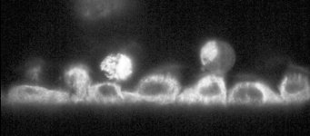
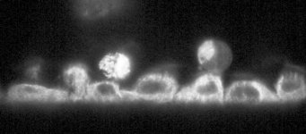

# [New-07.czi](\\sv-01-154\d$\SWAP\Data\NicoBIOP\2022-06-30\New-07.czi) report
 - **Autostitch** = true
 - ZeissCZIReader v6.14.0
 - ZeissQuickStartCZIReader v0.2.1-SNAPSHOT

# Images 

| Series            | Quick Start Reader | Size | Original Reader | Size | #Diffs |
|-------------------|--------------------|------|-----------------|------|--------|
| Read time (all)   |39368 ms|------|86735 ms|------|--------|
|0||X:1025 Y:450 C:2 Z:2001 T:300||X:1024 Y:450 C:2 Z:2001 T:300|51147|

# Metadata

|  Method            | Parameters       | Quick Start Reader | Original Reader | Delta  |
| -------------------|------------------|--------------------|-----------------|------- |
| Initialization     |                  |9633 ms|50355 ms|        |
| Reader Size (Mb)     |                  |628.00|1704.84|        |
| getPixelsSizeX| Image 0 | 1025| 1024| |
| getPlanePositionX| Image 0 Plane 1 | -2169.239 um | -2169.249 um | 0.010 um |
| getPlanePositionZ| Image 0 Plane 1 | -792.979 um | -792.965 um | 0.014 um |
| getPlanePositionZ| Image 0 Plane 2 | -792.779 um | -792.979 um | 0.200 um |
| getPlanePositionX| Image 0 Plane 3 | -2169.239 um | -2169.249 um | 0.010 um |
| getPlanePositionZ| Image 0 Plane 3 | -792.779 um | -792.965 um | 0.186 um |
| getPlanePositionZ| Image 0 Plane 4 | -792.579 um | -792.979 um | 0.400 um |
| getPlanePositionX| Image 0 Plane 5 | -2169.239 um | -2169.249 um | 0.010 um |
| getPlanePositionZ| Image 0 Plane 5 | -792.579 um | -792.965 um | 0.386 um |
| getPlanePositionZ| Image 0 Plane 6 | -792.379 um | -792.979 um | 0.600 um |
| getPlanePositionX| Image 0 Plane 7 | -2169.239 um | -2169.249 um | 0.010 um |
| getPlanePositionZ| Image 0 Plane 7 | -792.379 um | -792.965 um | 0.586 um |
| getPlanePositionZ| Image 0 Plane 8 | -792.179 um | -792.979 um | 0.800 um |
| getPlanePositionX| Image 0 Plane 9 | -2169.239 um | -2169.249 um | 0.010 um |
| getPlanePositionZ| Image 0 Plane 9 | -792.179 um | -792.965 um | 0.786 um |
| getPlanePositionZ| Image 0 Plane 10 | -791.979 um | -792.979 um | 1.000 um |
| getPlanePositionX| Image 0 Plane 11 | -2169.239 um | -2169.249 um | 0.010 um |
| getPlanePositionZ| Image 0 Plane 11 | -791.979 um | -792.965 um | 0.986 um |
| getPlanePositionZ| Image 0 Plane 12 | -791.779 um | -792.979 um | 1.200 um |
| getPlanePositionX| Image 0 Plane 13 | -2169.239 um | -2169.249 um | 0.010 um |
| getPlanePositionZ| Image 0 Plane 13 | -791.779 um | -792.965 um | 1.186 um |
| getPlanePositionZ| Image 0 Plane 14 | -791.579 um | -792.979 um | 1.400 um |
| getPlanePositionX| Image 0 Plane 15 | -2169.239 um | -2169.249 um | 0.010 um |
| getPlanePositionZ| Image 0 Plane 15 | -791.579 um | -792.965 um | 1.386 um |
| getPlanePositionZ| Image 0 Plane 16 | -791.379 um | -792.979 um | 1.600 um |
| getPlanePositionX| Image 0 Plane 17 | -2169.239 um | -2169.249 um | 0.010 um |
| getPlanePositionZ| Image 0 Plane 17 | -791.379 um | -792.965 um | 1.586 um |
| getPlanePositionZ| Image 0 Plane 18 | -791.179 um | -792.979 um | 1.800 um |
| getPlanePositionX| Image 0 Plane 19 | -2169.239 um | -2169.249 um | 0.010 um |
| getPlanePositionZ| Image 0 Plane 19 | -791.179 um | -792.965 um | 1.786 um |
| getPlanePositionZ| Image 0 Plane 20 | -790.979 um | -792.979 um | 2.000 um |
| getPlanePositionX| Image 0 Plane 21 | -2169.239 um | -2169.249 um | 0.010 um |
| getPlanePositionZ| Image 0 Plane 21 | -790.979 um | -792.965 um | 1.986 um |
| getPlanePositionZ| Image 0 Plane 22 | -790.779 um | -792.979 um | 2.200 um |
| getPlanePositionX| Image 0 Plane 23 | -2169.239 um | -2169.249 um | 0.010 um |
| getPlanePositionZ| Image 0 Plane 23 | -790.779 um | -792.965 um | 2.186 um |
| getPlanePositionZ| Image 0 Plane 24 | -790.579 um | -792.979 um | 2.400 um |
| getPlanePositionX| Image 0 Plane 25 | -2169.239 um | -2169.249 um | 0.010 um |
| getPlanePositionZ| Image 0 Plane 25 | -790.579 um | -792.965 um | 2.386 um |
| getPlanePositionZ| Image 0 Plane 26 | -790.379 um | -792.979 um | 2.600 um |
| getPlanePositionX| Image 0 Plane 27 | -2169.239 um | -2169.249 um | 0.010 um |
| getPlanePositionZ| Image 0 Plane 27 | -790.379 um | -792.965 um | 2.586 um |
| getPlanePositionZ| Image 0 Plane 28 | -790.179 um | -792.979 um | 2.800 um |
| getPlanePositionX| Image 0 Plane 29 | -2169.239 um | -2169.249 um | 0.010 um |
| getPlanePositionZ| Image 0 Plane 29 | -790.179 um | -792.965 um | 2.786 um |
| getPlanePositionZ| Image 0 Plane 30 | -789.979 um | -792.979 um | 3.000 um |
| getPlanePositionX| Image 0 Plane 31 | -2169.239 um | -2169.249 um | 0.010 um |
| getPlanePositionZ| Image 0 Plane 31 | -789.979 um | -792.965 um | 2.986 um |
| getPlanePositionZ| Image 0 Plane 32 | -789.779 um | -792.979 um | 3.200 um |
| getPlanePositionX| Image 0 Plane 33 | -2169.239 um | -2169.249 um | 0.010 um |
| getPlanePositionZ| Image 0 Plane 33 | -789.779 um | -792.965 um | 3.186 um |
| getPlanePositionZ| Image 0 Plane 34 | -789.579 um | -792.979 um | 3.400 um |
| getPlanePositionX| Image 0 Plane 35 | -2169.239 um | -2169.249 um | 0.010 um |
| getPlanePositionZ| Image 0 Plane 35 | -789.579 um | -792.965 um | 3.386 um |
| getPlanePositionZ| Image 0 Plane 36 | -789.379 um | -792.979 um | 3.600 um |
| getPlanePositionX| Image 0 Plane 37 | -2169.239 um | -2169.249 um | 0.010 um |
| getPlanePositionZ| Image 0 Plane 37 | -789.379 um | -792.965 um | 3.586 um |
| getPlanePositionZ| Image 0 Plane 38 | -789.179 um | -792.979 um | 3.800 um |
| getPlanePositionX| Image 0 Plane 39 | -2169.239 um | -2169.249 um | 0.010 um |
| getPlanePositionZ| Image 0 Plane 39 | -789.179 um | -792.965 um | 3.786 um |
| getPlanePositionZ| Image 0 Plane 40 | -788.979 um | -792.979 um | 4.000 um |
| getPlanePositionX| Image 0 Plane 41 | -2169.239 um | -2169.249 um | 0.010 um |
| getPlanePositionZ| Image 0 Plane 41 | -788.979 um | -792.965 um | 3.986 um |
| getPlanePositionZ| Image 0 Plane 42 | -788.779 um | -792.979 um | 4.200 um |
| getPlanePositionX| Image 0 Plane 43 | -2169.239 um | -2169.249 um | 0.010 um |
| getPlanePositionZ| Image 0 Plane 43 | -788.779 um | -792.965 um | 4.186 um |
| getPlanePositionZ| Image 0 Plane 44 | -788.579 um | -792.979 um | 4.400 um |
| getPlanePositionX| Image 0 Plane 45 | -2169.239 um | -2169.249 um | 0.010 um |
| getPlanePositionZ| Image 0 Plane 45 | -788.579 um | -792.965 um | 4.386 um |
| getPlanePositionZ| Image 0 Plane 46 | -788.379 um | -792.979 um | 4.600 um |
| getPlanePositionX| Image 0 Plane 47 | -2169.239 um | -2169.249 um | 0.010 um |
| getPlanePositionZ| Image 0 Plane 47 | -788.379 um | -792.965 um | 4.586 um |
| getPlanePositionZ| Image 0 Plane 48 | -788.179 um | -792.979 um | 4.800 um |
| getPlanePositionX| Image 0 Plane 49 | -2169.239 um | -2169.249 um | 0.010 um |
| getPlanePositionZ| Image 0 Plane 49 | -788.179 um | -792.965 um | 4.786 um |
| getPlanePositionZ| Image 0 Plane 50 | -787.979 um | -792.979 um | 5.000 um |
| getPlanePositionX| Image 0 Plane 51 | -2169.239 um | -2169.249 um | 0.010 um |
| getPlanePositionZ| Image 0 Plane 51 | -787.979 um | -792.965 um | 4.986 um |
| getPlanePositionZ| Image 0 Plane 52 | -787.779 um | -792.979 um | 5.200 um |
| getPlanePositionX| Image 0 Plane 53 | -2169.239 um | -2169.249 um | 0.010 um |
| getPlanePositionZ| Image 0 Plane 53 | -787.779 um | -792.965 um | 5.186 um |
| getPlanePositionZ| Image 0 Plane 54 | -787.579 um | -792.979 um | 5.400 um |
| getPlanePositionX| Image 0 Plane 55 | -2169.239 um | -2169.249 um | 0.010 um |
| getPlanePositionZ| Image 0 Plane 55 | -787.579 um | -792.965 um | 5.386 um |
| getPlanePositionZ| Image 0 Plane 56 | -787.379 um | -792.979 um | 5.600 um |
| getPlanePositionX| Image 0 Plane 57 | -2169.239 um | -2169.249 um | 0.010 um |
| getPlanePositionZ| Image 0 Plane 57 | -787.379 um | -792.965 um | 5.586 um |
| getPlanePositionZ| Image 0 Plane 58 | -787.179 um | -792.979 um | 5.800 um |
| getPlanePositionX| Image 0 Plane 59 | -2169.239 um | -2169.249 um | 0.010 um |
| getPlanePositionZ| Image 0 Plane 59 | -787.179 um | -792.965 um | 5.786 um |
| getPlanePositionZ| Image 0 Plane 60 | -786.979 um | -792.979 um | 6.000 um |
| getPlanePositionX| Image 0 Plane 61 | -2169.239 um | -2169.249 um | 0.010 um |
| getPlanePositionZ| Image 0 Plane 61 | -786.979 um | -792.965 um | 5.986 um |
| getPlanePositionZ| Image 0 Plane 62 | -786.779 um | -792.979 um | 6.200 um |
| getPlanePositionX| Image 0 Plane 63 | -2169.239 um | -2169.249 um | 0.010 um |
| getPlanePositionZ| Image 0 Plane 63 | -786.779 um | -792.965 um | 6.186 um |
| getPlanePositionZ| Image 0 Plane 64 | -786.579 um | -792.979 um | 6.400 um |
| getPlanePositionX| Image 0 Plane 65 | -2169.239 um | -2169.249 um | 0.010 um |
| getPlanePositionZ| Image 0 Plane 65 | -786.579 um | -792.965 um | 6.386 um |
| getPlanePositionZ| Image 0 Plane 66 | -786.379 um | -792.979 um | 6.600 um |
| getPlanePositionX| Image 0 Plane 67 | -2169.239 um | -2169.249 um | 0.010 um |
| getPlanePositionZ| Image 0 Plane 67 | -786.379 um | -792.965 um | 6.586 um |
| getPlanePositionZ| Image 0 Plane 68 | -786.179 um | -792.979 um | 6.800 um |
| getPlanePositionX| Image 0 Plane 69 | -2169.239 um | -2169.249 um | 0.010 um |
| getPlanePositionZ| Image 0 Plane 69 | -786.179 um | -792.965 um | 6.786 um |
| getPlanePositionZ| Image 0 Plane 70 | -785.979 um | -792.979 um | 7.000 um |
| getPlanePositionX| Image 0 Plane 71 | -2169.239 um | -2169.249 um | 0.010 um |
| getPlanePositionZ| Image 0 Plane 71 | -785.979 um | -792.965 um | 6.986 um |
| getPlanePositionZ| Image 0 Plane 72 | -785.779 um | -792.979 um | 7.200 um |
| getPlanePositionX| Image 0 Plane 73 | -2169.239 um | -2169.249 um | 0.010 um |
| getPlanePositionZ| Image 0 Plane 73 | -785.779 um | -792.965 um | 7.186 um |
| getPlanePositionZ| Image 0 Plane 74 | -785.579 um | -792.979 um | 7.400 um |
| getPlanePositionX| Image 0 Plane 75 | -2169.239 um | -2169.249 um | 0.010 um |
| getPlanePositionZ| Image 0 Plane 75 | -785.579 um | -792.965 um | 7.386 um |
| getPlanePositionZ| Image 0 Plane 76 | -785.379 um | -792.979 um | 7.600 um |
| getPlanePositionX| Image 0 Plane 77 | -2169.239 um | -2169.249 um | 0.010 um |
| getPlanePositionZ| Image 0 Plane 77 | -785.379 um | -792.965 um | 7.586 um |
| getPlanePositionZ| Image 0 Plane 78 | -785.179 um | -792.979 um | 7.800 um |
| getPlanePositionX| Image 0 Plane 79 | -2169.239 um | -2169.249 um | 0.010 um |
| getPlanePositionZ| Image 0 Plane 79 | -785.179 um | -792.965 um | 7.786 um |
| getPlanePositionZ| Image 0 Plane 80 | -784.979 um | -792.979 um | 8.000 um |
| getPlanePositionX| Image 0 Plane 81 | -2169.239 um | -2169.249 um | 0.010 um |
| getPlanePositionZ| Image 0 Plane 81 | -784.979 um | -792.965 um | 7.986 um |
| getPlanePositionZ| Image 0 Plane 82 | -784.779 um | -792.979 um | 8.200 um |
| getPlanePositionX| Image 0 Plane 83 | -2169.239 um | -2169.249 um | 0.010 um |
| getPlanePositionZ| Image 0 Plane 83 | -784.779 um | -792.965 um | 8.186 um |
| getPlanePositionZ| Image 0 Plane 84 | -784.579 um | -792.979 um | 8.400 um |
| getPlanePositionX| Image 0 Plane 85 | -2169.239 um | -2169.249 um | 0.010 um |
| getPlanePositionZ| Image 0 Plane 85 | -784.579 um | -792.965 um | 8.386 um |
| getPlanePositionZ| Image 0 Plane 86 | -784.379 um | -792.979 um | 8.600 um |
| getPlanePositionX| Image 0 Plane 87 | -2169.239 um | -2169.249 um | 0.010 um |
| getPlanePositionZ| Image 0 Plane 87 | -784.379 um | -792.965 um | 8.586 um |
| getPlanePositionZ| Image 0 Plane 88 | -784.179 um | -792.979 um | 8.800 um |
| getPlanePositionX| Image 0 Plane 89 | -2169.239 um | -2169.249 um | 0.010 um |
| getPlanePositionZ| Image 0 Plane 89 | -784.179 um | -792.965 um | 8.786 um |
| getPlanePositionZ| Image 0 Plane 90 | -783.979 um | -792.979 um | 9.000 um |
| getPlanePositionX| Image 0 Plane 91 | -2169.239 um | -2169.249 um | 0.010 um |
| getPlanePositionZ| Image 0 Plane 91 | -783.979 um | -792.965 um | 8.986 um |
| getPlanePositionZ| Image 0 Plane 92 | -783.779 um | -792.979 um | 9.200 um |
| getPlanePositionX| Image 0 Plane 93 | -2169.239 um | -2169.249 um | 0.010 um |
| getPlanePositionZ| Image 0 Plane 93 | -783.779 um | -792.965 um | 9.186 um |
| getPlanePositionZ| Image 0 Plane 94 | -783.579 um | -792.979 um | 9.400 um |
| getPlanePositionX| Image 0 Plane 95 | -2169.239 um | -2169.249 um | 0.010 um |
| getPlanePositionZ| Image 0 Plane 95 | -783.579 um | -792.965 um | 9.386 um |
| getPlanePositionZ| Image 0 Plane 96 | -783.379 um | -792.979 um | 9.600 um |
| getPlanePositionX| Image 0 Plane 97 | -2169.239 um | -2169.249 um | 0.010 um |
| getPlanePositionZ| Image 0 Plane 97 | -783.379 um | -792.965 um | 9.586 um |
| getPlanePositionZ| Image 0 Plane 98 | -783.179 um | -792.979 um | 9.800 um |
| getPlanePositionX| Image 0 Plane 99 | -2169.239 um | -2169.249 um | 0.010 um |
| getPlanePositionZ| Image 0 Plane 99 | -783.179 um | -792.965 um | 9.786 um |
| getPlanePositionZ| Image 0 Plane 100 | -782.979 um | -792.979 um | 10.000 um |
| getPlanePositionX| Image 0 Plane 101 | -2169.239 um | -2169.249 um | 0.010 um |
| getPlanePositionZ| Image 0 Plane 101 | -782.979 um | -792.965 um | 9.986 um |
| getPlanePositionZ| Image 0 Plane 102 | -782.779 um | -792.979 um | 10.200 um |
| getPlanePositionX| Image 0 Plane 103 | -2169.239 um | -2169.249 um | 0.010 um |
| getPlanePositionZ| Image 0 Plane 103 | -782.779 um | -792.965 um | 10.186 um |
| getPlanePositionZ| Image 0 Plane 104 | -782.579 um | -792.979 um | 10.400 um |
| getPlanePositionX| Image 0 Plane 105 | -2169.239 um | -2169.249 um | 0.010 um |
| getPlanePositionZ| Image 0 Plane 105 | -782.579 um | -792.965 um | 10.386 um |
| getPlanePositionZ| Image 0 Plane 106 | -782.379 um | -792.979 um | 10.600 um |
| getPlanePositionX| Image 0 Plane 107 | -2169.239 um | -2169.249 um | 0.010 um |
| getPlanePositionZ| Image 0 Plane 107 | -782.379 um | -792.965 um | 10.586 um |
| getPlanePositionZ| Image 0 Plane 108 | -782.179 um | -792.979 um | 10.800 um |
| getPlanePositionX| Image 0 Plane 109 | -2169.239 um | -2169.249 um | 0.010 um |
| getPlanePositionZ| Image 0 Plane 109 | -782.179 um | -792.965 um | 10.786 um |
| getPlanePositionZ| Image 0 Plane 110 | -781.979 um | -792.979 um | 11.000 um |
| getPlanePositionX| Image 0 Plane 111 | -2169.239 um | -2169.249 um | 0.010 um |
| getPlanePositionZ| Image 0 Plane 111 | -781.979 um | -792.965 um | 10.986 um |
| getPlanePositionZ| Image 0 Plane 112 | -781.779 um | -792.979 um | 11.200 um |
| getPlanePositionX| Image 0 Plane 113 | -2169.239 um | -2169.249 um | 0.010 um |
| getPlanePositionZ| Image 0 Plane 113 | -781.779 um | -792.965 um | 11.186 um |
| getPlanePositionZ| Image 0 Plane 114 | -781.579 um | -792.979 um | 11.400 um |
| getPlanePositionX| Image 0 Plane 115 | -2169.239 um | -2169.249 um | 0.010 um |
| getPlanePositionZ| Image 0 Plane 115 | -781.579 um | -792.965 um | 11.386 um |
| getPlanePositionZ| Image 0 Plane 116 | -781.379 um | -792.979 um | 11.600 um |
| getPlanePositionX| Image 0 Plane 117 | -2169.239 um | -2169.249 um | 0.010 um |
| getPlanePositionZ| Image 0 Plane 117 | -781.379 um | -792.965 um | 11.586 um |
| getPlanePositionZ| Image 0 Plane 118 | -781.179 um | -792.979 um | 11.800 um |
| getPlanePositionX| Image 0 Plane 119 | -2169.239 um | -2169.249 um | 0.010 um |
| getPlanePositionZ| Image 0 Plane 119 | -781.179 um | -792.965 um | 11.786 um |
| getPlanePositionZ| Image 0 Plane 120 | -780.979 um | -792.979 um | 12.000 um |
| getPlanePositionX| Image 0 Plane 121 | -2169.239 um | -2169.249 um | 0.010 um |
| getPlanePositionZ| Image 0 Plane 121 | -780.979 um | -792.965 um | 11.986 um |
| getPlanePositionZ| Image 0 Plane 122 | -780.779 um | -792.979 um | 12.200 um |
| getPlanePositionX| Image 0 Plane 123 | -2169.239 um | -2169.249 um | 0.010 um |
| getPlanePositionZ| Image 0 Plane 123 | -780.779 um | -792.965 um | 12.186 um |
| getPlanePositionZ| Image 0 Plane 124 | -780.579 um | -792.979 um | 12.400 um |
| getPlanePositionX| Image 0 Plane 125 | -2169.239 um | -2169.249 um | 0.010 um |
| getPlanePositionZ| Image 0 Plane 125 | -780.579 um | -792.965 um | 12.386 um |
| getPlanePositionZ| Image 0 Plane 126 | -780.379 um | -792.979 um | 12.600 um |
| getPlanePositionX| Image 0 Plane 127 | -2169.239 um | -2169.249 um | 0.010 um |
| getPlanePositionZ| Image 0 Plane 127 | -780.379 um | -792.965 um | 12.586 um |
| getPlanePositionZ| Image 0 Plane 128 | -780.179 um | -792.979 um | 12.800 um |
| getPlanePositionX| Image 0 Plane 129 | -2169.239 um | -2169.249 um | 0.010 um |
| getPlanePositionZ| Image 0 Plane 129 | -780.179 um | -792.965 um | 12.786 um |
| getPlanePositionZ| Image 0 Plane 130 | -779.979 um | -792.979 um | 13.000 um |
| getPlanePositionX| Image 0 Plane 131 | -2169.239 um | -2169.249 um | 0.010 um |
| getPlanePositionZ| Image 0 Plane 131 | -779.979 um | -792.965 um | 12.986 um |
| getPlanePositionZ| Image 0 Plane 132 | -779.779 um | -792.979 um | 13.200 um |
| getPlanePositionX| Image 0 Plane 133 | -2169.239 um | -2169.249 um | 0.010 um |
| getPlanePositionZ| Image 0 Plane 133 | -779.779 um | -792.965 um | 13.186 um |
| getPlanePositionZ| Image 0 Plane 134 | -779.579 um | -792.979 um | 13.400 um |
| getPlanePositionX| Image 0 Plane 135 | -2169.239 um | -2169.249 um | 0.010 um |
| getPlanePositionZ| Image 0 Plane 135 | -779.579 um | -792.965 um | 13.386 um |
| getPlanePositionZ| Image 0 Plane 136 | -779.379 um | -792.979 um | 13.600 um |
| getPlanePositionX| Image 0 Plane 137 | -2169.239 um | -2169.249 um | 0.010 um |
| getPlanePositionZ| Image 0 Plane 137 | -779.379 um | -792.965 um | 13.586 um |
| getPlanePositionZ| Image 0 Plane 138 | -779.179 um | -792.979 um | 13.800 um |
| getPlanePositionX| Image 0 Plane 139 | -2169.239 um | -2169.249 um | 0.010 um |
| getPlanePositionZ| Image 0 Plane 139 | -779.179 um | -792.965 um | 13.786 um |
| getPlanePositionZ| Image 0 Plane 140 | -778.979 um | -792.979 um | 14.000 um |
| getPlanePositionX| Image 0 Plane 141 | -2169.239 um | -2169.249 um | 0.010 um |
| getPlanePositionZ| Image 0 Plane 141 | -778.979 um | -792.965 um | 13.986 um |
| getPlanePositionZ| Image 0 Plane 142 | -778.779 um | -792.979 um | 14.200 um |
| getPlanePositionX| Image 0 Plane 143 | -2169.239 um | -2169.249 um | 0.010 um |
| getPlanePositionZ| Image 0 Plane 143 | -778.779 um | -792.965 um | 14.186 um |
| getPlanePositionZ| Image 0 Plane 144 | -778.579 um | -792.979 um | 14.400 um |
| getPlanePositionX| Image 0 Plane 145 | -2169.239 um | -2169.249 um | 0.010 um |
| getPlanePositionZ| Image 0 Plane 145 | -778.579 um | -792.965 um | 14.386 um |
| getPlanePositionZ| Image 0 Plane 146 | -778.379 um | -792.979 um | 14.600 um |
| getPlanePositionX| Image 0 Plane 147 | -2169.239 um | -2169.249 um | 0.010 um |
| getPlanePositionZ| Image 0 Plane 147 | -778.379 um | -792.965 um | 14.586 um |
| getPlanePositionZ| Image 0 Plane 148 | -778.179 um | -792.979 um | 14.800 um |
| getPlanePositionX| Image 0 Plane 149 | -2169.239 um | -2169.249 um | 0.010 um |
| getPlanePositionZ| Image 0 Plane 149 | -778.179 um | -792.965 um | 14.786 um |
| getPlanePositionZ| Image 0 Plane 150 | -777.979 um | -792.979 um | 15.000 um |
| getPlanePositionX| Image 0 Plane 151 | -2169.239 um | -2169.249 um | 0.010 um |
| getPlanePositionZ| Image 0 Plane 151 | -777.979 um | -792.965 um | 14.986 um |
| getPlanePositionZ| Image 0 Plane 152 | -777.779 um | -792.979 um | 15.200 um |
| getPlanePositionX| Image 0 Plane 153 | -2169.239 um | -2169.249 um | 0.010 um |
| getPlanePositionZ| Image 0 Plane 153 | -777.779 um | -792.965 um | 15.186 um |
| getPlanePositionZ| Image 0 Plane 154 | -777.579 um | -792.979 um | 15.400 um |
| getPlanePositionX| Image 0 Plane 155 | -2169.239 um | -2169.249 um | 0.010 um |
| getPlanePositionZ| Image 0 Plane 155 | -777.579 um | -792.965 um | 15.386 um |
| getPlanePositionZ| Image 0 Plane 156 | -777.379 um | -792.979 um | 15.600 um |
| getPlanePositionX| Image 0 Plane 157 | -2169.239 um | -2169.249 um | 0.010 um |
| getPlanePositionZ| Image 0 Plane 157 | -777.379 um | -792.965 um | 15.586 um |
| getPlanePositionZ| Image 0 Plane 158 | -777.179 um | -792.979 um | 15.800 um |
| getPlanePositionX| Image 0 Plane 159 | -2169.239 um | -2169.249 um | 0.010 um |
| getPlanePositionZ| Image 0 Plane 159 | -777.179 um | -792.965 um | 15.786 um |
| getPlanePositionZ| Image 0 Plane 160 | -776.979 um | -792.979 um | 16.000 um |
| getPlanePositionX| Image 0 Plane 161 | -2169.239 um | -2169.249 um | 0.010 um |
| getPlanePositionZ| Image 0 Plane 161 | -776.979 um | -792.965 um | 15.986 um |
| getPlanePositionZ| Image 0 Plane 162 | -776.779 um | -792.979 um | 16.200 um |
| getPlanePositionX| Image 0 Plane 163 | -2169.239 um | -2169.249 um | 0.010 um |
| getPlanePositionZ| Image 0 Plane 163 | -776.779 um | -792.965 um | 16.186 um |
| getPlanePositionZ| Image 0 Plane 164 | -776.579 um | -792.979 um | 16.400 um |
| getPlanePositionX| Image 0 Plane 165 | -2169.239 um | -2169.249 um | 0.010 um |
| getPlanePositionZ| Image 0 Plane 165 | -776.579 um | -792.965 um | 16.386 um |
| getPlanePositionZ| Image 0 Plane 166 | -776.379 um | -792.979 um | 16.600 um |
| getPlanePositionX| Image 0 Plane 167 | -2169.239 um | -2169.249 um | 0.010 um |
| getPlanePositionZ| Image 0 Plane 167 | -776.379 um | -792.965 um | 16.586 um |
| getPlanePositionZ| Image 0 Plane 168 | -776.179 um | -792.979 um | 16.800 um |
| getPlanePositionX| Image 0 Plane 169 | -2169.239 um | -2169.249 um | 0.010 um |
| getPlanePositionZ| Image 0 Plane 169 | -776.179 um | -792.965 um | 16.786 um |
| getPlanePositionZ| Image 0 Plane 170 | -775.979 um | -792.979 um | 17.000 um |
| getPlanePositionX| Image 0 Plane 171 | -2169.239 um | -2169.249 um | 0.010 um |
| getPlanePositionZ| Image 0 Plane 171 | -775.979 um | -792.965 um | 16.986 um |
| getPlanePositionZ| Image 0 Plane 172 | -775.779 um | -792.979 um | 17.200 um |
| getPlanePositionX| Image 0 Plane 173 | -2169.239 um | -2169.249 um | 0.010 um |
| getPlanePositionZ| Image 0 Plane 173 | -775.779 um | -792.965 um | 17.186 um |
| getPlanePositionZ| Image 0 Plane 174 | -775.579 um | -792.979 um | 17.400 um |
| getPlanePositionX| Image 0 Plane 175 | -2169.239 um | -2169.249 um | 0.010 um |
| getPlanePositionZ| Image 0 Plane 175 | -775.579 um | -792.965 um | 17.386 um |
| getPlanePositionZ| Image 0 Plane 176 | -775.379 um | -792.979 um | 17.600 um |
| getPlanePositionX| Image 0 Plane 177 | -2169.239 um | -2169.249 um | 0.010 um |
| getPlanePositionZ| Image 0 Plane 177 | -775.379 um | -792.965 um | 17.586 um |
| getPlanePositionZ| Image 0 Plane 178 | -775.179 um | -792.979 um | 17.800 um |
| getPlanePositionX| Image 0 Plane 179 | -2169.239 um | -2169.249 um | 0.010 um |
| getPlanePositionZ| Image 0 Plane 179 | -775.179 um | -792.965 um | 17.786 um |
| getPlanePositionZ| Image 0 Plane 180 | -774.979 um | -792.979 um | 18.000 um |
| getPlanePositionX| Image 0 Plane 181 | -2169.239 um | -2169.249 um | 0.010 um |
| getPlanePositionZ| Image 0 Plane 181 | -774.979 um | -792.965 um | 17.986 um |
| getPlanePositionZ| Image 0 Plane 182 | -774.779 um | -792.979 um | 18.200 um |
| getPlanePositionX| Image 0 Plane 183 | -2169.239 um | -2169.249 um | 0.010 um |
| getPlanePositionZ| Image 0 Plane 183 | -774.779 um | -792.965 um | 18.186 um |
| getPlanePositionZ| Image 0 Plane 184 | -774.579 um | -792.979 um | 18.400 um |
| getPlanePositionX| Image 0 Plane 185 | -2169.239 um | -2169.249 um | 0.010 um |
| getPlanePositionZ| Image 0 Plane 185 | -774.579 um | -792.965 um | 18.386 um |
| getPlanePositionZ| Image 0 Plane 186 | -774.379 um | -792.979 um | 18.600 um |
| getPlanePositionX| Image 0 Plane 187 | -2169.239 um | -2169.249 um | 0.010 um |
| getPlanePositionZ| Image 0 Plane 187 | -774.379 um | -792.965 um | 18.586 um |
| getPlanePositionZ| Image 0 Plane 188 | -774.179 um | -792.979 um | 18.800 um |
| getPlanePositionX| Image 0 Plane 189 | -2169.239 um | -2169.249 um | 0.010 um |
| getPlanePositionZ| Image 0 Plane 189 | -774.179 um | -792.965 um | 18.786 um |
| getPlanePositionZ| Image 0 Plane 190 | -773.979 um | -792.979 um | 19.000 um |
| getPlanePositionX| Image 0 Plane 191 | -2169.239 um | -2169.249 um | 0.010 um |
| getPlanePositionZ| Image 0 Plane 191 | -773.979 um | -792.965 um | 18.986 um |
| getPlanePositionZ| Image 0 Plane 192 | -773.779 um | -792.979 um | 19.200 um |
| getPlanePositionX| Image 0 Plane 193 | -2169.239 um | -2169.249 um | 0.010 um |
| getPlanePositionZ| Image 0 Plane 193 | -773.779 um | -792.965 um | 19.186 um |
| getPlanePositionZ| Image 0 Plane 194 | -773.579 um | -792.979 um | 19.400 um |
| getPlanePositionX| Image 0 Plane 195 | -2169.239 um | -2169.249 um | 0.010 um |
| getPlanePositionZ| Image 0 Plane 195 | -773.579 um | -792.965 um | 19.386 um |
| getPlanePositionZ| Image 0 Plane 196 | -773.379 um | -792.979 um | 19.600 um |
| getPlanePositionX| Image 0 Plane 197 | -2169.239 um | -2169.249 um | 0.010 um |
| getPlanePositionZ| Image 0 Plane 197 | -773.379 um | -792.965 um | 19.586 um |
| getPlanePositionZ| Image 0 Plane 198 | -773.179 um | -792.979 um | 19.800 um |
| getPlanePositionX| Image 0 Plane 199 | -2169.239 um | -2169.249 um | 0.010 um |
| getPlanePositionZ| Image 0 Plane 199 | -773.179 um | -792.965 um | 19.786 um |
| getPlanePositionZ| Image 0 Plane 200 | -772.979 um | -792.979 um | 20.000 um |
| getPlanePositionX| Image 0 Plane 201 | -2169.239 um | -2169.249 um | 0.010 um |
| getPlanePositionZ| Image 0 Plane 201 | -772.979 um | -792.965 um | 19.986 um |
| getPlanePositionZ| Image 0 Plane 202 | -772.779 um | -792.979 um | 20.200 um |
| getPlanePositionX| Image 0 Plane 203 | -2169.239 um | -2169.249 um | 0.010 um |
| getPlanePositionZ| Image 0 Plane 203 | -772.779 um | -792.965 um | 20.186 um |
| getPlanePositionZ| Image 0 Plane 204 | -772.579 um | -792.979 um | 20.400 um |
| getPlanePositionX| Image 0 Plane 205 | -2169.239 um | -2169.249 um | 0.010 um |
| getPlanePositionZ| Image 0 Plane 205 | -772.579 um | -792.965 um | 20.386 um |
| getPlanePositionZ| Image 0 Plane 206 | -772.379 um | -792.979 um | 20.600 um |
| getPlanePositionX| Image 0 Plane 207 | -2169.239 um | -2169.249 um | 0.010 um |
| getPlanePositionZ| Image 0 Plane 207 | -772.379 um | -792.965 um | 20.586 um |
| getPlanePositionZ| Image 0 Plane 208 | -772.179 um | -792.979 um | 20.800 um |
| getPlanePositionX| Image 0 Plane 209 | -2169.239 um | -2169.249 um | 0.010 um |
| getPlanePositionZ| Image 0 Plane 209 | -772.179 um | -792.965 um | 20.786 um |
| getPlanePositionZ| Image 0 Plane 210 | -771.979 um | -792.979 um | 21.000 um |
| getPlanePositionX| Image 0 Plane 211 | -2169.239 um | -2169.249 um | 0.010 um |
| getPlanePositionZ| Image 0 Plane 211 | -771.979 um | -792.965 um | 20.986 um |
| getPlanePositionZ| Image 0 Plane 212 | -771.779 um | -792.979 um | 21.200 um |
| getPlanePositionX| Image 0 Plane 213 | -2169.239 um | -2169.249 um | 0.010 um |
| getPlanePositionZ| Image 0 Plane 213 | -771.779 um | -792.965 um | 21.186 um |
| getPlanePositionZ| Image 0 Plane 214 | -771.579 um | -792.979 um | 21.400 um |
| getPlanePositionX| Image 0 Plane 215 | -2169.239 um | -2169.249 um | 0.010 um |
| getPlanePositionZ| Image 0 Plane 215 | -771.579 um | -792.965 um | 21.386 um |
| getPlanePositionZ| Image 0 Plane 216 | -771.379 um | -792.979 um | 21.600 um |
| getPlanePositionX| Image 0 Plane 217 | -2169.239 um | -2169.249 um | 0.010 um |
| getPlanePositionZ| Image 0 Plane 217 | -771.379 um | -792.965 um | 21.586 um |
| getPlanePositionZ| Image 0 Plane 218 | -771.179 um | -792.979 um | 21.800 um |
| getPlanePositionX| Image 0 Plane 219 | -2169.239 um | -2169.249 um | 0.010 um |
| getPlanePositionZ| Image 0 Plane 219 | -771.179 um | -792.965 um | 21.786 um |
| getPlanePositionZ| Image 0 Plane 220 | -770.979 um | -792.979 um | 22.000 um |
| getPlanePositionX| Image 0 Plane 221 | -2169.239 um | -2169.249 um | 0.010 um |
| getPlanePositionZ| Image 0 Plane 221 | -770.979 um | -792.965 um | 21.986 um |
| getPlanePositionZ| Image 0 Plane 222 | -770.779 um | -792.979 um | 22.200 um |
| getPlanePositionX| Image 0 Plane 223 | -2169.239 um | -2169.249 um | 0.010 um |
| getPlanePositionZ| Image 0 Plane 223 | -770.779 um | -792.965 um | 22.186 um |
| getPlanePositionZ| Image 0 Plane 224 | -770.579 um | -792.979 um | 22.400 um |
| getPlanePositionX| Image 0 Plane 225 | -2169.239 um | -2169.249 um | 0.010 um |
| getPlanePositionZ| Image 0 Plane 225 | -770.579 um | -792.965 um | 22.386 um |
| getPlanePositionZ| Image 0 Plane 226 | -770.379 um | -792.979 um | 22.600 um |
| getPlanePositionX| Image 0 Plane 227 | -2169.239 um | -2169.249 um | 0.010 um |
| getPlanePositionZ| Image 0 Plane 227 | -770.379 um | -792.965 um | 22.586 um |
| getPlanePositionZ| Image 0 Plane 228 | -770.179 um | -792.979 um | 22.800 um |
| getPlanePositionX| Image 0 Plane 229 | -2169.239 um | -2169.249 um | 0.010 um |
| getPlanePositionZ| Image 0 Plane 229 | -770.179 um | -792.965 um | 22.786 um |
| getPlanePositionZ| Image 0 Plane 230 | -769.979 um | -792.979 um | 23.000 um |
| getPlanePositionX| Image 0 Plane 231 | -2169.239 um | -2169.249 um | 0.010 um |
| getPlanePositionZ| Image 0 Plane 231 | -769.979 um | -792.965 um | 22.986 um |
| getPlanePositionZ| Image 0 Plane 232 | -769.779 um | -792.979 um | 23.200 um |
| getPlanePositionX| Image 0 Plane 233 | -2169.239 um | -2169.249 um | 0.010 um |
| getPlanePositionZ| Image 0 Plane 233 | -769.779 um | -792.965 um | 23.186 um |
| getPlanePositionZ| Image 0 Plane 234 | -769.579 um | -792.979 um | 23.400 um |
| getPlanePositionX| Image 0 Plane 235 | -2169.239 um | -2169.249 um | 0.010 um |
| getPlanePositionZ| Image 0 Plane 235 | -769.579 um | -792.965 um | 23.386 um |
| getPlanePositionZ| Image 0 Plane 236 | -769.379 um | -792.979 um | 23.600 um |
| getPlaneDeltaT| Image 0 Plane 237 |  62.929 s |  62.957 s | 0.028 s |
| getPlanePositionX| Image 0 Plane 237 | -2169.239 um | -2169.249 um | 0.010 um |
| getPlanePositionZ| Image 0 Plane 237 | -769.379 um | -792.965 um | 23.586 um |
| getPlanePositionZ| Image 0 Plane 238 | -769.179 um | -792.979 um | 23.800 um |
| getPlanePositionX| Image 0 Plane 239 | -2169.239 um | -2169.249 um | 0.010 um |
| getPlanePositionZ| Image 0 Plane 239 | -769.179 um | -792.965 um | 23.786 um |
| getPlanePositionZ| Image 0 Plane 240 | -768.979 um | -792.979 um | 24.000 um |
| getPlanePositionX| Image 0 Plane 241 | -2169.239 um | -2169.249 um | 0.010 um |
| getPlanePositionZ| Image 0 Plane 241 | -768.979 um | -792.965 um | 23.986 um |
| getPlanePositionZ| Image 0 Plane 242 | -768.779 um | -792.979 um | 24.200 um |
| getPlanePositionX| Image 0 Plane 243 | -2169.239 um | -2169.249 um | 0.010 um |
| getPlanePositionZ| Image 0 Plane 243 | -768.779 um | -792.965 um | 24.186 um |
| getPlanePositionZ| Image 0 Plane 244 | -768.579 um | -792.979 um | 24.400 um |
| getPlanePositionX| Image 0 Plane 245 | -2169.239 um | -2169.249 um | 0.010 um |
| getPlanePositionZ| Image 0 Plane 245 | -768.579 um | -792.965 um | 24.386 um |
| getPlanePositionZ| Image 0 Plane 246 | -768.379 um | -792.979 um | 24.600 um |
| getPlanePositionX| Image 0 Plane 247 | -2169.239 um | -2169.249 um | 0.010 um |
| getPlanePositionZ| Image 0 Plane 247 | -768.379 um | -792.965 um | 24.586 um |
| getPlanePositionZ| Image 0 Plane 248 | -768.179 um | -792.979 um | 24.800 um |
| getPlanePositionX| Image 0 Plane 249 | -2169.239 um | -2169.249 um | 0.010 um |
| getPlanePositionZ| Image 0 Plane 249 | -768.179 um | -792.965 um | 24.786 um |
| getPlanePositionZ| Image 0 Plane 250 | -767.979 um | -792.979 um | 25.000 um |
| getPlanePositionX| Image 0 Plane 251 | -2169.239 um | -2169.249 um | 0.010 um |
| getPlanePositionZ| Image 0 Plane 251 | -767.979 um | -792.965 um | 24.986 um |
| getPlanePositionZ| Image 0 Plane 252 | -767.779 um | -792.979 um | 25.200 um |
| getPlanePositionX| Image 0 Plane 253 | -2169.239 um | -2169.249 um | 0.010 um |
| getPlanePositionZ| Image 0 Plane 253 | -767.779 um | -792.965 um | 25.186 um |
| getPlanePositionZ| Image 0 Plane 254 | -767.579 um | -792.979 um | 25.400 um |
| getPlanePositionX| Image 0 Plane 255 | -2169.239 um | -2169.249 um | 0.010 um |
| getPlanePositionZ| Image 0 Plane 255 | -767.579 um | -792.965 um | 25.386 um |
| getPlanePositionZ| Image 0 Plane 256 | -767.379 um | -792.979 um | 25.600 um |
| getPlanePositionX| Image 0 Plane 257 | -2169.239 um | -2169.249 um | 0.010 um |
| getPlanePositionZ| Image 0 Plane 257 | -767.379 um | -792.965 um | 25.586 um |
| getPlanePositionZ| Image 0 Plane 258 | -767.179 um | -792.979 um | 25.800 um |
| getPlanePositionX| Image 0 Plane 259 | -2169.239 um | -2169.249 um | 0.010 um |
| getPlanePositionZ| Image 0 Plane 259 | -767.179 um | -792.965 um | 25.786 um |
| getPlanePositionZ| Image 0 Plane 260 | -766.979 um | -792.979 um | 26.000 um |
| getPlanePositionX| Image 0 Plane 261 | -2169.239 um | -2169.249 um | 0.010 um |
| getPlanePositionZ| Image 0 Plane 261 | -766.979 um | -792.965 um | 25.986 um |
| getPlanePositionZ| Image 0 Plane 262 | -766.779 um | -792.979 um | 26.200 um |
| getPlanePositionX| Image 0 Plane 263 | -2169.239 um | -2169.249 um | 0.010 um |
| getPlanePositionZ| Image 0 Plane 263 | -766.779 um | -792.965 um | 26.186 um |
| getPlanePositionZ| Image 0 Plane 264 | -766.579 um | -792.979 um | 26.400 um |
| getPlanePositionX| Image 0 Plane 265 | -2169.239 um | -2169.249 um | 0.010 um |
| getPlanePositionZ| Image 0 Plane 265 | -766.579 um | -792.965 um | 26.386 um |
| getPlanePositionZ| Image 0 Plane 266 | -766.379 um | -792.979 um | 26.600 um |
| getPlanePositionX| Image 0 Plane 267 | -2169.239 um | -2169.249 um | 0.010 um |
| getPlanePositionZ| Image 0 Plane 267 | -766.379 um | -792.965 um | 26.586 um |
| getPlanePositionZ| Image 0 Plane 268 | -766.179 um | -792.979 um | 26.800 um |
| getPlanePositionX| Image 0 Plane 269 | -2169.239 um | -2169.249 um | 0.010 um |
| getPlanePositionZ| Image 0 Plane 269 | -766.179 um | -792.965 um | 26.786 um |
| getPlanePositionZ| Image 0 Plane 270 | -765.979 um | -792.979 um | 27.000 um |
| getPlanePositionX| Image 0 Plane 271 | -2169.239 um | -2169.249 um | 0.010 um |
| getPlanePositionZ| Image 0 Plane 271 | -765.979 um | -792.965 um | 26.986 um |
| getPlanePositionZ| Image 0 Plane 272 | -765.779 um | -792.979 um | 27.200 um |
| getPlanePositionX| Image 0 Plane 273 | -2169.239 um | -2169.249 um | 0.010 um |
| getPlanePositionZ| Image 0 Plane 273 | -765.779 um | -792.965 um | 27.186 um |
| getPlanePositionZ| Image 0 Plane 274 | -765.579 um | -792.979 um | 27.400 um |
| getPlanePositionX| Image 0 Plane 275 | -2169.239 um | -2169.249 um | 0.010 um |
| getPlanePositionZ| Image 0 Plane 275 | -765.579 um | -792.965 um | 27.386 um |
| getPlanePositionZ| Image 0 Plane 276 | -765.379 um | -792.979 um | 27.600 um |
| getPlanePositionX| Image 0 Plane 277 | -2169.239 um | -2169.249 um | 0.010 um |
| getPlanePositionZ| Image 0 Plane 277 | -765.379 um | -792.965 um | 27.586 um |
| getPlaneDeltaT| Image 0 Plane 278 |  5.824 s |  5.844 s | 0.020 s |
| getPlanePositionZ| Image 0 Plane 278 | -765.179 um | -792.979 um | 27.800 um |
| getPlanePositionX| Image 0 Plane 279 | -2169.239 um | -2169.249 um | 0.010 um |
| getPlanePositionZ| Image 0 Plane 279 | -765.179 um | -792.965 um | 27.786 um |
| getPlanePositionZ| Image 0 Plane 280 | -764.979 um | -792.979 um | 28.000 um |
| getPlanePositionX| Image 0 Plane 281 | -2169.239 um | -2169.249 um | 0.010 um |
| getPlanePositionZ| Image 0 Plane 281 | -764.979 um | -792.965 um | 27.986 um |
| getPlanePositionZ| Image 0 Plane 282 | -764.779 um | -792.979 um | 28.200 um |
| getPlanePositionX| Image 0 Plane 283 | -2169.239 um | -2169.249 um | 0.010 um |
| getPlanePositionZ| Image 0 Plane 283 | -764.779 um | -792.965 um | 28.186 um |
| getPlanePositionZ| Image 0 Plane 284 | -764.579 um | -792.979 um | 28.400 um |
| getPlanePositionX| Image 0 Plane 285 | -2169.239 um | -2169.249 um | 0.010 um |
| getPlanePositionZ| Image 0 Plane 285 | -764.579 um | -792.965 um | 28.386 um |
| getPlanePositionZ| Image 0 Plane 286 | -764.379 um | -792.979 um | 28.600 um |
| getPlanePositionX| Image 0 Plane 287 | -2169.239 um | -2169.249 um | 0.010 um |
| getPlanePositionZ| Image 0 Plane 287 | -764.379 um | -792.965 um | 28.586 um |
| getPlanePositionZ| Image 0 Plane 288 | -764.179 um | -792.979 um | 28.800 um |
| getPlanePositionX| Image 0 Plane 289 | -2169.239 um | -2169.249 um | 0.010 um |
| getPlanePositionZ| Image 0 Plane 289 | -764.179 um | -792.965 um | 28.786 um |
| getPlanePositionZ| Image 0 Plane 290 | -763.979 um | -792.979 um | 29.000 um |
| getPlanePositionX| Image 0 Plane 291 | -2169.239 um | -2169.249 um | 0.010 um |
| getPlanePositionZ| Image 0 Plane 291 | -763.979 um | -792.965 um | 28.986 um |
| getPlanePositionZ| Image 0 Plane 292 | -763.779 um | -792.979 um | 29.200 um |
| getPlanePositionX| Image 0 Plane 293 | -2169.239 um | -2169.249 um | 0.010 um |
| getPlanePositionZ| Image 0 Plane 293 | -763.779 um | -792.965 um | 29.186 um |
| getPlanePositionZ| Image 0 Plane 294 | -763.579 um | -792.979 um | 29.400 um |
| getPlanePositionX| Image 0 Plane 295 | -2169.239 um | -2169.249 um | 0.010 um |
| getPlanePositionZ| Image 0 Plane 295 | -763.579 um | -792.965 um | 29.386 um |
| getPlanePositionZ| Image 0 Plane 296 | -763.379 um | -792.979 um | 29.600 um |
| getPlanePositionX| Image 0 Plane 297 | -2169.239 um | -2169.249 um | 0.010 um |
| getPlanePositionZ| Image 0 Plane 297 | -763.379 um | -792.965 um | 29.586 um |
| getPlanePositionZ| Image 0 Plane 298 | -763.179 um | -792.979 um | 29.800 um |
| getPlanePositionX| Image 0 Plane 299 | -2169.239 um | -2169.249 um | 0.010 um |
| getPlanePositionZ| Image 0 Plane 299 | -763.179 um | -792.965 um | 29.786 um |
| getPlanePositionZ| Image 0 Plane 300 | -762.979 um | -792.979 um | 30.000 um |
| getPlanePositionX| Image 0 Plane 301 | -2169.239 um | -2169.249 um | 0.010 um |
| getPlanePositionZ| Image 0 Plane 301 | -762.979 um | -792.965 um | 29.986 um |
| getPlanePositionZ| Image 0 Plane 302 | -762.779 um | -792.979 um | 30.200 um |
| getPlanePositionX| Image 0 Plane 303 | -2169.239 um | -2169.249 um | 0.010 um |
| getPlanePositionZ| Image 0 Plane 303 | -762.779 um | -792.965 um | 30.186 um |
| getPlanePositionZ| Image 0 Plane 304 | -762.579 um | -792.979 um | 30.400 um |
| getPlanePositionX| Image 0 Plane 305 | -2169.239 um | -2169.249 um | 0.010 um |
| getPlanePositionZ| Image 0 Plane 305 | -762.579 um | -792.965 um | 30.386 um |
| getPlanePositionZ| Image 0 Plane 306 | -762.379 um | -792.979 um | 30.600 um |
| getPlanePositionX| Image 0 Plane 307 | -2169.239 um | -2169.249 um | 0.010 um |
| getPlanePositionZ| Image 0 Plane 307 | -762.379 um | -792.965 um | 30.586 um |
| getPlanePositionZ| Image 0 Plane 308 | -762.179 um | -792.979 um | 30.800 um |
| getPlanePositionX| Image 0 Plane 309 | -2169.239 um | -2169.249 um | 0.010 um |
| getPlanePositionZ| Image 0 Plane 309 | -762.179 um | -792.965 um | 30.786 um |
| getPlanePositionZ| Image 0 Plane 310 | -761.979 um | -792.979 um | 31.000 um |
| getPlanePositionX| Image 0 Plane 311 | -2169.239 um | -2169.249 um | 0.010 um |
| getPlanePositionZ| Image 0 Plane 311 | -761.979 um | -792.965 um | 30.986 um |
| getPlanePositionZ| Image 0 Plane 312 | -761.779 um | -792.979 um | 31.200 um |
| getPlanePositionX| Image 0 Plane 313 | -2169.239 um | -2169.249 um | 0.010 um |
| getPlanePositionZ| Image 0 Plane 313 | -761.779 um | -792.965 um | 31.186 um |
| getPlanePositionZ| Image 0 Plane 314 | -761.579 um | -792.979 um | 31.400 um |
| getPlanePositionX| Image 0 Plane 315 | -2169.239 um | -2169.249 um | 0.010 um |
| getPlanePositionZ| Image 0 Plane 315 | -761.579 um | -792.965 um | 31.386 um |
| getPlanePositionZ| Image 0 Plane 316 | -761.379 um | -792.979 um | 31.600 um |
| getPlanePositionX| Image 0 Plane 317 | -2169.239 um | -2169.249 um | 0.010 um |
| getPlanePositionZ| Image 0 Plane 317 | -761.379 um | -792.965 um | 31.586 um |
| getPlanePositionZ| Image 0 Plane 318 | -761.179 um | -792.979 um | 31.800 um |
| getPlanePositionX| Image 0 Plane 319 | -2169.239 um | -2169.249 um | 0.010 um |
| getPlanePositionZ| Image 0 Plane 319 | -761.179 um | -792.965 um | 31.786 um |
| getPlanePositionZ| Image 0 Plane 320 | -760.979 um | -792.979 um | 32.000 um |
| getPlanePositionX| Image 0 Plane 321 | -2169.239 um | -2169.249 um | 0.010 um |
| getPlanePositionZ| Image 0 Plane 321 | -760.979 um | -792.965 um | 31.986 um |
| getPlanePositionZ| Image 0 Plane 322 | -760.779 um | -792.979 um | 32.200 um |
| getPlanePositionX| Image 0 Plane 323 | -2169.239 um | -2169.249 um | 0.010 um |
| getPlanePositionZ| Image 0 Plane 323 | -760.779 um | -792.965 um | 32.186 um |
| getPlanePositionZ| Image 0 Plane 324 | -760.579 um | -792.979 um | 32.400 um |
| getPlanePositionX| Image 0 Plane 325 | -2169.239 um | -2169.249 um | 0.010 um |
| getPlanePositionZ| Image 0 Plane 325 | -760.579 um | -792.965 um | 32.386 um |
| getPlanePositionZ| Image 0 Plane 326 | -760.379 um | -792.979 um | 32.600 um |
| getPlanePositionX| Image 0 Plane 327 | -2169.239 um | -2169.249 um | 0.010 um |
| getPlanePositionZ| Image 0 Plane 327 | -760.379 um | -792.965 um | 32.586 um |
| getPlanePositionZ| Image 0 Plane 328 | -760.179 um | -792.979 um | 32.800 um |

 More than 500 differences.
