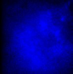

# [P1.czi](https://zenodo.org/record/7254229/files/P1.czi) report
 - **Autostitch** = false
 - ZeissCZIReader v6.14.0
 - ZeissQuickStartCZIReader v0.1.8-SNAPSHOT

# Images 

| Series            | Quick Start Reader | Size | Original Reader | Size | #Diffs |
|-------------------|--------------------|------|-----------------|------|--------|
| Read time (all)   |81 ms|------|41 ms|------|--------|
|0||X:507 Y:512 C:2 Z:120 T:1||X:507 Y:512 C:2 Z:120 T:1|0|

# Metadata

|  Method            | Parameters       | Quick Start Reader | Original Reader | Delta  |
| -------------------|------------------|--------------------|-----------------|------- |
| Initialization     |                  |13 ms|12 ms|        |
| Reader Size (Mb)     |                  |0.40|0.72|        |
