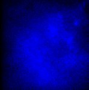
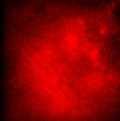

# [P1.czi](https://zenodo.org/record/7254229/files/P1.czi) report
 - **Autostitch** = true
 - ZeissCZIReader v6.14.0
 - ZeissQuickStartCZIReader v0.1.8-SNAPSHOT

# Images 

| Series            | Quick Start Reader | Size | Original Reader | Size | #Diffs |
|-------------------|--------------------|------|-----------------|------|--------|
| Read time (all)   |29 ms|------|50 ms|------|--------|
|0||X:507 Y:512 C:2 Z:120 T:1||X:507 Y:512 C:2 Z:120 T:1|0|

# Metadata

|  Method            | Parameters       | Quick Start Reader | Original Reader | Delta  |
| -------------------|------------------|--------------------|-----------------|------- |
| Initialization     |                  |8 ms|13 ms|        |
| Reader Size (Mb)     |                  |0.39|0.71|        |
| getPlaneDeltaT| Image 0 Plane 2 |  2.028 s |  2.058 s | 0.030 s |
| getPlaneDeltaT| Image 0 Plane 4 |  3.036 s |  3.065 s | 0.029 s |
| getPlaneDeltaT| Image 0 Plane 5 |  3.551 s |  3.554 s | 0.003 s |
| getPlaneDeltaT| Image 0 Plane 6 |  4.043 s |  4.073 s | 0.030 s |
| getPlaneDeltaT| Image 0 Plane 8 |  5.051 s |  5.079 s | 0.028 s |
| getPlaneDeltaT| Image 0 Plane 10 |  6.058 s |  6.102 s | 0.044 s |
| getPlaneDeltaT| Image 0 Plane 11 |  6.573 s |  6.588 s | 0.015 s |
| getPlaneDeltaT| Image 0 Plane 12 |  7.066 s |  7.107 s | 0.041 s |
| getPlaneDeltaT| Image 0 Plane 13 |  7.580 s |  7.594 s | 0.014 s |
| getPlaneDeltaT| Image 0 Plane 14 |  8.073 s |  8.117 s | 0.044 s |
| getPlaneDeltaT| Image 0 Plane 15 |  8.587 s |  8.604 s | 0.017 s |
| getPlaneDeltaT| Image 0 Plane 16 |  9.081 s |  9.122 s | 0.041 s |
| getPlaneDeltaT| Image 0 Plane 17 |  9.595 s |  9.607 s | 0.012 s |
| getPlaneDeltaT| Image 0 Plane 18 |  10.088 s |  10.126 s | 0.038 s |
| getPlaneDeltaT| Image 0 Plane 19 |  10.602 s |  10.613 s | 0.011 s |
| getPlaneDeltaT| Image 0 Plane 20 |  11.095 s |  11.132 s | 0.037 s |
| getPlaneDeltaT| Image 0 Plane 21 |  11.609 s |  11.618 s | 0.009 s |
| getPlaneDeltaT| Image 0 Plane 22 |  12.103 s |  12.137 s | 0.034 s |
| getPlaneDeltaT| Image 0 Plane 23 |  12.616 s |  12.624 s | 0.008 s |
| getPlaneDeltaT| Image 0 Plane 24 |  13.110 s |  13.143 s | 0.033 s |
| getPlaneDeltaT| Image 0 Plane 25 |  13.623 s |  13.631 s | 0.008 s |
| getPlaneDeltaT| Image 0 Plane 26 |  14.118 s |  14.151 s | 0.033 s |
| getPlaneDeltaT| Image 0 Plane 27 |  14.631 s |  14.639 s | 0.008 s |
| getPlaneDeltaT| Image 0 Plane 28 |  15.125 s |  15.157 s | 0.032 s |
| getPlaneDeltaT| Image 0 Plane 29 |  15.638 s |  15.644 s | 0.006 s |
| getPlaneDeltaT| Image 0 Plane 30 |  16.133 s |  16.179 s | 0.046 s |
| getPlaneDeltaT| Image 0 Plane 31 |  16.645 s |  16.666 s | 0.021 s |
| getPlaneDeltaT| Image 0 Plane 32 |  17.140 s |  17.185 s | 0.045 s |
| getPlaneDeltaT| Image 0 Plane 33 |  17.652 s |  17.673 s | 0.021 s |
| getPlaneDeltaT| Image 0 Plane 34 |  18.148 s |  18.193 s | 0.045 s |
| getPlaneDeltaT| Image 0 Plane 35 |  18.659 s |  18.679 s | 0.020 s |
| getPlaneDeltaT| Image 0 Plane 36 |  19.155 s |  19.198 s | 0.043 s |
| getPlaneDeltaT| Image 0 Plane 37 |  19.667 s |  19.683 s | 0.016 s |
| getPlaneDeltaT| Image 0 Plane 38 |  20.162 s |  20.206 s | 0.044 s |
| getPlaneDeltaT| Image 0 Plane 39 |  20.674 s |  20.691 s | 0.017 s |
| getPlaneDeltaT| Image 0 Plane 40 |  21.170 s |  21.211 s | 0.041 s |
| getPlaneDeltaT| Image 0 Plane 41 |  21.681 s |  21.696 s | 0.015 s |
| getPlaneDeltaT| Image 0 Plane 42 |  22.177 s |  22.216 s | 0.039 s |
| getPlaneDeltaT| Image 0 Plane 43 |  22.688 s |  22.703 s | 0.015 s |
| getPlaneDeltaT| Image 0 Plane 44 |  23.185 s |  23.221 s | 0.036 s |
| getPlaneDeltaT| Image 0 Plane 45 |  23.695 s |  23.707 s | 0.012 s |
| getPlaneDeltaT| Image 0 Plane 46 |  24.192 s |  24.226 s | 0.034 s |
| getPlaneDeltaT| Image 0 Plane 47 |  24.703 s |  24.713 s | 0.010 s |
| getPlaneDeltaT| Image 0 Plane 48 |  25.200 s |  25.232 s | 0.032 s |
| getPlaneDeltaT| Image 0 Plane 49 |  25.710 s |  25.720 s | 0.010 s |
| getPlaneDeltaT| Image 0 Plane 50 |  26.207 s |  26.238 s | 0.031 s |
| getPlaneDeltaT| Image 0 Plane 51 |  26.717 s |  26.726 s | 0.009 s |
| getPlaneDeltaT| Image 0 Plane 52 |  27.215 s |  27.247 s | 0.032 s |
| getPlaneDeltaT| Image 0 Plane 53 |  27.724 s |  27.733 s | 0.009 s |
| getPlaneDeltaT| Image 0 Plane 54 |  28.222 s |  28.252 s | 0.030 s |
| getPlaneDeltaT| Image 0 Plane 55 |  28.731 s |  28.738 s | 0.007 s |
| getPlaneDeltaT| Image 0 Plane 56 |  29.229 s |  29.258 s | 0.029 s |
| getPlaneDeltaT| Image 0 Plane 57 |  29.739 s |  29.747 s | 0.008 s |
| getPlaneDeltaT| Image 0 Plane 58 |  30.237 s |  30.266 s | 0.029 s |
| getPlaneDeltaT| Image 0 Plane 59 |  30.746 s |  30.753 s | 0.007 s |
| getPlaneDeltaT| Image 0 Plane 60 |  31.244 s |  31.270 s | 0.026 s |
| getPlaneDeltaT| Image 0 Plane 61 |  31.753 s |  31.757 s | 0.004 s |
| getPlaneDeltaT| Image 0 Plane 62 |  32.252 s |  32.278 s | 0.026 s |
| getPlaneDeltaT| Image 0 Plane 63 |  32.760 s |  32.764 s | 0.004 s |
| getPlaneDeltaT| Image 0 Plane 64 |  33.259 s |  33.284 s | 0.025 s |
| getPlaneDeltaT| Image 0 Plane 65 |  33.767 s |  33.770 s | 0.003 s |
| getPlaneDeltaT| Image 0 Plane 66 |  34.267 s |  34.291 s | 0.024 s |
| getPlaneDeltaT| Image 0 Plane 67 |  34.775 s |  34.777 s | 0.002 s |
| getPlaneDeltaT| Image 0 Plane 68 |  35.274 s |  35.295 s | 0.021 s |
| getPlaneDeltaT| Image 0 Plane 69 |  35.782 s |  35.780 s | 0.002 s |
| getPlaneDeltaT| Image 0 Plane 70 |  36.282 s |  36.302 s | 0.020 s |
| getPlaneDeltaT| Image 0 Plane 71 |  36.789 s |  36.787 s | 0.002 s |
| getPlaneDeltaT| Image 0 Plane 72 |  37.289 s |  37.310 s | 0.021 s |
| getPlaneDeltaT| Image 0 Plane 74 |  38.296 s |  38.316 s | 0.020 s |
| getPlaneDeltaT| Image 0 Plane 75 |  38.803 s |  38.802 s | 0.001 s |
| getPlaneDeltaT| Image 0 Plane 76 |  39.304 s |  39.321 s | 0.017 s |
| getPlaneDeltaT| Image 0 Plane 77 |  39.811 s |  39.806 s | 0.005 s |
| getPlaneDeltaT| Image 0 Plane 78 |  40.311 s |  40.326 s | 0.015 s |
| getPlaneDeltaT| Image 0 Plane 79 |  40.818 s |  40.811 s | 0.007 s |
| getPlaneDeltaT| Image 0 Plane 80 |  41.319 s |  41.331 s | 0.012 s |
| getPlaneDeltaT| Image 0 Plane 81 |  41.825 s |  41.818 s | 0.007 s |
| getPlaneDeltaT| Image 0 Plane 82 |  42.326 s |  42.339 s | 0.013 s |
| getPlaneDeltaT| Image 0 Plane 83 |  42.832 s |  42.825 s | 0.007 s |
| getPlaneDeltaT| Image 0 Plane 84 |  43.334 s |  43.343 s | 0.009 s |
| getPlaneDeltaT| Image 0 Plane 85 |  43.839 s |  43.829 s | 0.010 s |
| getPlaneDeltaT| Image 0 Plane 86 |  44.341 s |  44.350 s | 0.009 s |
| getPlaneDeltaT| Image 0 Plane 87 |  44.847 s |  44.837 s | 0.010 s |
| getPlaneDeltaT| Image 0 Plane 88 |  45.349 s |  45.358 s | 0.009 s |
| getPlaneDeltaT| Image 0 Plane 89 |  45.854 s |  45.845 s | 0.009 s |
| getPlaneDeltaT| Image 0 Plane 90 |  46.356 s |  46.363 s | 0.007 s |
| getPlaneDeltaT| Image 0 Plane 91 |  46.861 s |  46.848 s | 0.013 s |
| getPlaneDeltaT| Image 0 Plane 92 |  47.363 s |  47.371 s | 0.008 s |
| getPlaneDeltaT| Image 0 Plane 93 |  47.868 s |  47.857 s | 0.011 s |
| getPlaneDeltaT| Image 0 Plane 94 |  48.371 s |  48.379 s | 0.008 s |
| getPlaneDeltaT| Image 0 Plane 95 |  48.875 s |  48.864 s | 0.011 s |
| getPlaneDeltaT| Image 0 Plane 96 |  49.378 s |  49.385 s | 0.007 s |
| getPlaneDeltaT| Image 0 Plane 97 |  49.883 s |  49.869 s | 0.014 s |
| getPlaneDeltaT| Image 0 Plane 98 |  50.386 s |  50.389 s | 0.003 s |
| getPlaneDeltaT| Image 0 Plane 99 |  50.890 s |  50.874 s | 0.016 s |
| getPlaneDeltaT| Image 0 Plane 101 |  51.897 s |  51.880 s | 0.017 s |
| getPlaneDeltaT| Image 0 Plane 102 |  52.401 s |  52.402 s | 0.001 s |
| getPlaneDeltaT| Image 0 Plane 103 |  52.904 s |  52.889 s | 0.015 s |
| getPlaneDeltaT| Image 0 Plane 105 |  53.911 s |  53.895 s | 0.016 s |
| getPlaneDeltaT| Image 0 Plane 106 |  54.416 s |  54.414 s | 0.002 s |
| getPlaneDeltaT| Image 0 Plane 107 |  54.919 s |  54.902 s | 0.017 s |
| getPlaneDeltaT| Image 0 Plane 108 |  55.423 s |  55.421 s | 0.002 s |
| getPlaneDeltaT| Image 0 Plane 109 |  55.926 s |  55.907 s | 0.019 s |
| getPlaneDeltaT| Image 0 Plane 110 |  56.430 s |  56.425 s | 0.005 s |
| getPlaneDeltaT| Image 0 Plane 111 |  56.933 s |  56.910 s | 0.023 s |
| getPlaneDeltaT| Image 0 Plane 112 |  57.438 s |  57.430 s | 0.008 s |
| getPlaneDeltaT| Image 0 Plane 113 |  57.940 s |  57.917 s | 0.023 s |
| getPlaneDeltaT| Image 0 Plane 114 |  58.445 s |  58.436 s | 0.009 s |
| getPlaneDeltaT| Image 0 Plane 115 |  58.947 s |  58.922 s | 0.025 s |
| getPlaneDeltaT| Image 0 Plane 116 |  59.453 s |  59.441 s | 0.012 s |
| getPlaneDeltaT| Image 0 Plane 117 |  59.955 s |  59.927 s | 0.028 s |
| getPlaneDeltaT| Image 0 Plane 118 |  60.460 s |  60.446 s | 0.014 s |
| getPlaneDeltaT| Image 0 Plane 119 |  60.962 s |  60.933 s | 0.029 s |
| getPlaneDeltaT| Image 0 Plane 120 |  61.468 s |  61.451 s | 0.017 s |
| getPlaneDeltaT| Image 0 Plane 121 |  61.969 s |  61.938 s | 0.031 s |
| getPlaneDeltaT| Image 0 Plane 122 |  62.475 s |  62.460 s | 0.015 s |
| getPlaneDeltaT| Image 0 Plane 123 |  62.976 s |  62.948 s | 0.028 s |
| getPlaneDeltaT| Image 0 Plane 124 |  63.483 s |  63.468 s | 0.015 s |
| getPlaneDeltaT| Image 0 Plane 125 |  63.984 s |  63.955 s | 0.029 s |
| getPlaneDeltaT| Image 0 Plane 126 |  64.490 s |  64.474 s | 0.016 s |
| getPlaneDeltaT| Image 0 Plane 127 |  64.991 s |  64.960 s | 0.031 s |
| getPlaneDeltaT| Image 0 Plane 128 |  65.498 s |  65.480 s | 0.018 s |
| getPlaneDeltaT| Image 0 Plane 129 |  65.998 s |  65.966 s | 0.032 s |
| getPlaneDeltaT| Image 0 Plane 130 |  66.505 s |  66.484 s | 0.021 s |
| getPlaneDeltaT| Image 0 Plane 131 |  67.005 s |  66.970 s | 0.035 s |
| getPlaneDeltaT| Image 0 Plane 132 |  67.512 s |  67.490 s | 0.022 s |
| getPlaneDeltaT| Image 0 Plane 133 |  68.012 s |  67.977 s | 0.035 s |
| getPlaneDeltaT| Image 0 Plane 134 |  68.520 s |  68.495 s | 0.025 s |
| getPlaneDeltaT| Image 0 Plane 135 |  69.020 s |  68.983 s | 0.037 s |
| getPlaneDeltaT| Image 0 Plane 136 |  69.527 s |  69.500 s | 0.027 s |
| getPlaneDeltaT| Image 0 Plane 137 |  70.027 s |  69.986 s | 0.041 s |
| getPlaneDeltaT| Image 0 Plane 138 |  70.535 s |  70.506 s | 0.029 s |
| getPlaneDeltaT| Image 0 Plane 139 |  71.034 s |  70.993 s | 0.041 s |
| getPlaneDeltaT| Image 0 Plane 140 |  71.542 s |  71.537 s | 0.005 s |
| getPlaneDeltaT| Image 0 Plane 141 |  72.041 s |  72.023 s | 0.018 s |
| getPlaneDeltaT| Image 0 Plane 142 |  72.550 s |  72.547 s | 0.003 s |
| getPlaneDeltaT| Image 0 Plane 143 |  73.048 s |  73.033 s | 0.015 s |
| getPlaneDeltaT| Image 0 Plane 144 |  73.557 s |  73.553 s | 0.004 s |
| getPlaneDeltaT| Image 0 Plane 145 |  74.056 s |  74.039 s | 0.017 s |
| getPlaneDeltaT| Image 0 Plane 146 |  74.565 s |  74.559 s | 0.006 s |
| getPlaneDeltaT| Image 0 Plane 147 |  75.063 s |  75.046 s | 0.017 s |
| getPlaneDeltaT| Image 0 Plane 148 |  75.572 s |  75.564 s | 0.008 s |
| getPlaneDeltaT| Image 0 Plane 149 |  76.070 s |  76.050 s | 0.020 s |
| getPlaneDeltaT| Image 0 Plane 150 |  76.579 s |  76.570 s | 0.009 s |
| getPlaneDeltaT| Image 0 Plane 151 |  77.077 s |  77.058 s | 0.019 s |
| getPlaneDeltaT| Image 0 Plane 152 |  77.587 s |  77.579 s | 0.008 s |
| getPlaneDeltaT| Image 0 Plane 153 |  78.084 s |  78.065 s | 0.019 s |
| getPlaneDeltaT| Image 0 Plane 154 |  78.594 s |  78.599 s | 0.005 s |
| getPlaneDeltaT| Image 0 Plane 155 |  79.092 s |  79.086 s | 0.006 s |
| getPlaneDeltaT| Image 0 Plane 156 |  79.602 s |  79.610 s | 0.008 s |
| getPlaneDeltaT| Image 0 Plane 158 |  80.609 s |  80.618 s | 0.009 s |
| getPlaneDeltaT| Image 0 Plane 159 |  81.106 s |  81.104 s | 0.002 s |
| getPlaneDeltaT| Image 0 Plane 160 |  81.617 s |  81.627 s | 0.010 s |
| getPlaneDeltaT| Image 0 Plane 161 |  82.113 s |  82.115 s | 0.002 s |
| getPlaneDeltaT| Image 0 Plane 162 |  82.624 s |  82.635 s | 0.011 s |
| getPlaneDeltaT| Image 0 Plane 164 |  83.632 s |  83.644 s | 0.012 s |
| getPlaneDeltaT| Image 0 Plane 165 |  84.128 s |  84.131 s | 0.003 s |
| getPlaneDeltaT| Image 0 Plane 166 |  84.639 s |  84.650 s | 0.011 s |
| getPlaneDeltaT| Image 0 Plane 167 |  85.135 s |  85.136 s | 0.001 s |
| getPlaneDeltaT| Image 0 Plane 168 |  85.646 s |  85.658 s | 0.012 s |
| getPlaneDeltaT| Image 0 Plane 169 |  86.142 s |  86.165 s | 0.023 s |
| getPlaneDeltaT| Image 0 Plane 170 |  86.654 s |  86.684 s | 0.030 s |
| getPlaneDeltaT| Image 0 Plane 171 |  87.149 s |  87.172 s | 0.023 s |
| getPlaneDeltaT| Image 0 Plane 172 |  87.661 s |  87.699 s | 0.038 s |
| getPlaneDeltaT| Image 0 Plane 173 |  88.156 s |  88.184 s | 0.028 s |
| getPlaneDeltaT| Image 0 Plane 174 |  88.669 s |  88.706 s | 0.037 s |
| getPlaneDeltaT| Image 0 Plane 175 |  89.164 s |  89.193 s | 0.029 s |
| getPlaneDeltaT| Image 0 Plane 176 |  89.676 s |  89.712 s | 0.036 s |
| getPlaneDeltaT| Image 0 Plane 177 |  90.171 s |  90.198 s | 0.027 s |
| getPlaneDeltaT| Image 0 Plane 178 |  90.684 s |  90.719 s | 0.035 s |
| getPlaneDeltaT| Image 0 Plane 179 |  91.178 s |  91.204 s | 0.026 s |
| getPlaneDeltaT| Image 0 Plane 180 |  91.691 s |  91.723 s | 0.032 s |
| getPlaneDeltaT| Image 0 Plane 181 |  92.185 s |  92.207 s | 0.022 s |
| getPlaneDeltaT| Image 0 Plane 182 |  92.699 s |  92.730 s | 0.031 s |
| getPlaneDeltaT| Image 0 Plane 183 |  93.192 s |  93.215 s | 0.023 s |
| getPlaneDeltaT| Image 0 Plane 184 |  93.706 s |  93.734 s | 0.028 s |
| getPlaneDeltaT| Image 0 Plane 185 |  94.200 s |  94.220 s | 0.020 s |
| getPlaneDeltaT| Image 0 Plane 186 |  94.713 s |  94.739 s | 0.026 s |
| getPlaneDeltaT| Image 0 Plane 187 |  95.207 s |  95.224 s | 0.017 s |
| getPlaneDeltaT| Image 0 Plane 188 |  95.721 s |  95.745 s | 0.024 s |
| getPlaneDeltaT| Image 0 Plane 189 |  96.214 s |  96.230 s | 0.016 s |
| getPlaneDeltaT| Image 0 Plane 190 |  96.728 s |  96.750 s | 0.022 s |
| getPlaneDeltaT| Image 0 Plane 191 |  97.221 s |  97.237 s | 0.016 s |
| getPlaneDeltaT| Image 0 Plane 192 |  97.736 s |  97.758 s | 0.022 s |
| getPlaneDeltaT| Image 0 Plane 193 |  98.228 s |  98.245 s | 0.017 s |
| getPlaneDeltaT| Image 0 Plane 194 |  98.743 s |  98.766 s | 0.023 s |
| getPlaneDeltaT| Image 0 Plane 195 |  99.236 s |  99.252 s | 0.016 s |
| getPlaneDeltaT| Image 0 Plane 196 |  99.751 s |  99.772 s | 0.021 s |
| getPlaneDeltaT| Image 0 Plane 197 |  100.243 s |  100.257 s | 0.014 s |
| getPlaneDeltaT| Image 0 Plane 198 |  100.758 s |  100.777 s | 0.019 s |
| getPlaneDeltaT| Image 0 Plane 199 |  101.250 s |  101.264 s | 0.014 s |
| getPlaneDeltaT| Image 0 Plane 200 |  101.766 s |  101.786 s | 0.020 s |
| getPlaneDeltaT| Image 0 Plane 201 |  102.257 s |  102.273 s | 0.016 s |
| getPlaneDeltaT| Image 0 Plane 202 |  102.773 s |  102.793 s | 0.020 s |
| getPlaneDeltaT| Image 0 Plane 203 |  103.264 s |  103.278 s | 0.014 s |
| getPlaneDeltaT| Image 0 Plane 204 |  103.780 s |  103.797 s | 0.017 s |
| getPlaneDeltaT| Image 0 Plane 205 |  104.272 s |  104.284 s | 0.012 s |
| getPlaneDeltaT| Image 0 Plane 206 |  104.788 s |  104.803 s | 0.015 s |
| getPlaneDeltaT| Image 0 Plane 207 |  105.279 s |  105.289 s | 0.010 s |
| getPlaneDeltaT| Image 0 Plane 208 |  105.795 s |  105.809 s | 0.014 s |
| getPlaneDeltaT| Image 0 Plane 209 |  106.286 s |  106.295 s | 0.009 s |
| getPlaneDeltaT| Image 0 Plane 210 |  106.803 s |  106.816 s | 0.013 s |
| getPlaneDeltaT| Image 0 Plane 211 |  107.293 s |  107.301 s | 0.008 s |
| getPlaneDeltaT| Image 0 Plane 212 |  107.810 s |  107.824 s | 0.014 s |
| getPlaneDeltaT| Image 0 Plane 213 |  108.300 s |  108.310 s | 0.010 s |
| getPlaneDeltaT| Image 0 Plane 214 |  108.818 s |  108.829 s | 0.011 s |
| getPlaneDeltaT| Image 0 Plane 215 |  109.308 s |  109.315 s | 0.007 s |
| getPlaneDeltaT| Image 0 Plane 216 |  109.825 s |  109.836 s | 0.011 s |
| getPlaneDeltaT| Image 0 Plane 217 |  110.315 s |  110.322 s | 0.007 s |
| getPlaneDeltaT| Image 0 Plane 218 |  110.833 s |  110.842 s | 0.009 s |
| getPlaneDeltaT| Image 0 Plane 219 |  111.322 s |  111.327 s | 0.005 s |
| getPlaneDeltaT| Image 0 Plane 220 |  111.840 s |  111.848 s | 0.008 s |
| getPlaneDeltaT| Image 0 Plane 221 |  112.329 s |  112.334 s | 0.005 s |
| getPlaneDeltaT| Image 0 Plane 222 |  112.847 s |  112.855 s | 0.008 s |
| getPlaneDeltaT| Image 0 Plane 223 |  113.336 s |  113.341 s | 0.005 s |
| getPlaneDeltaT| Image 0 Plane 224 |  113.855 s |  113.861 s | 0.006 s |
| getPlaneDeltaT| Image 0 Plane 225 |  114.344 s |  114.345 s | 0.001 s |
| getPlaneDeltaT| Image 0 Plane 226 |  114.862 s |  114.865 s | 0.003 s |
| getPlaneDeltaT| Image 0 Plane 227 |  115.351 s |  115.352 s | 0.001 s |
| getPlaneDeltaT| Image 0 Plane 228 |  115.870 s |  115.873 s | 0.003 s |
| getPlaneDeltaT| Image 0 Plane 231 |  117.365 s |  117.363 s | 0.002 s |
| getPlaneDeltaT| Image 0 Plane 233 |  118.372 s |  118.374 s | 0.002 s |
| getPlaneDeltaT| Image 0 Plane 234 |  118.892 s |  118.894 s | 0.002 s |
| getPlaneDeltaT| Image 0 Plane 235 |  119.380 s |  119.381 s | 0.001 s |
| getPlaneDeltaT| Image 0 Plane 236 |  119.900 s |  119.901 s | 0.001 s |
