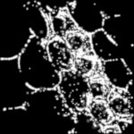

|  Method            | Parameters       | Quick Start Reader | Original Reader | Delta  |
| -------------------|------------------|--------------------|-----------------|------- |
| Initialization     |                  |4 ms|5 ms|        |
| Reader Size (Mb)     |                  |0.12|0.19|        |
| getImageCount|(No args)|1| 2| |
| getPlaneCount| Image 0 | 2| 1| |
| getChannelCount| Image 0 | 2| 1| |
| getStageLabelX| Image 0 |  1: null| 2: ome.units.quantity.Length: value[-689.6], unit[µm] stored as java.lang.Double |
| getStageLabelY| Image 0 |  1: null| 2: ome.units.quantity.Length: value[-443.4], unit[µm] stored as java.lang.Double |
| getStageLabelZ| Image 0 |  1: null| 2: ome.units.quantity.Length: value[4882.04], unit[µm] stored as java.lang.Double |
| getPixelsSizeX| Image 0 | 512| 1206| |
| getPixelsSizeY| Image 0 | 512| 1206| |
| getPixelsSizeC| Image 0 | 2| 1| |
| getImageName| Image 1 |  error: true | error: false| |
| getImageAcquisitionDate| Image 1 |  error: true | error: false| |
| getImageAnnotationRefCount| Image 1 |  error: true | error: false| |
| getImageDescription| Image 1 |  error: true | error: false| |
| getImageExperimenterRef| Image 1 |  error: true | error: false| |
| getImageInstrumentRef| Image 1 |  error: true | error: false| |
| getImageID| Image 1 |  error: true | error: false| |
| getImageROIRefCount| Image 1 |  error: true | error: false| |
| getPlaneCount| Image 1 |  error: true | error: false| |
| getChannelCount| Image 1 |  error: true | error: false| |
| getImageROIRefCount| Image 1 |  error: true | error: false| |
| getPixelsBinDataCount| Image 1 |  error: true | error: false| |
| getMicrobeamManipulationRefCount| Image 1 |  error: true | error: false| |
| getTiffDataCount| Image 1 |  error: true | error: false| |
| getStageLabelName| Image 1 |  error: true | error: false| |
| getStageLabelX| Image 1 |  error: true | error: false| |
| getStageLabelY| Image 1 |  error: true | error: false| |
| getStageLabelZ| Image 1 |  error: true | error: false| |
| getPixelsSizeX| Image 1 |  error: true | error: false| |
| getPixelsSizeY| Image 1 |  error: true | error: false| |
| getPixelsSizeZ| Image 1 |  error: true | error: false| |
| getPixelsSizeC| Image 1 |  error: true | error: false| |
| getPixelsSizeT| Image 1 |  error: true | error: false| |
| getPixelsPhysicalSizeX| Image 1 |  error: true | error: false| |
| getPixelsPhysicalSizeY| Image 1 |  error: true | error: false| |
| getPixelsPhysicalSizeZ| Image 1 |  error: true | error: false| |
| getPixelsInterleaved| Image 1 |  error: true | error: false| |
| getPixelsDimensionOrder| Image 1 |  error: true | error: false| |
| getPixelsBigEndian| Image 1 |  error: true | error: false| |
| getPixelsID| Image 1 |  error: true | error: false| |
| Different plane count found for image 02| 1| |
| Different plane count found for image 1 error: true | error: false| |
| Different channel count found for image 02| 1| |
| Different channel count found for image 1 error: true | error: false| |
# [PALM_OnlineVerrechnet.czi](https://zenodo.org/records/10577621/files/PALM_OnlineVerrechnet.czi) report
 - **Autostitch** = false
 - ZeissCZIReader v7.1.0
 - ZeissQuickStartCZIReader v0.2.4-SNAPSHOT

# Images 

| Series            | Quick Start Reader | Size | Original Reader | Size | #Diffs |
|-------------------|--------------------|------|-----------------|------|--------|
| Read time (all)   |15 ms|------|43 ms|------|--------|
|0||X:512 Y:512 C:2 Z:1 T:1||X:1206 Y:1206 C:1 Z:1 T:1|10009|
|1| | ||X:512 Y:512 C:1 Z:1 T:1|-1|

# Metadata

