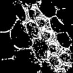
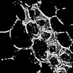

|  Method            | Parameters       | Quick Start Reader | Original Reader | Delta  |
| -------------------|------------------|--------------------|-----------------|------- |
| Initialization     |                  |3 ms|4 ms|        |
| Reader Size (Mb)     |                  |0.12|0.19|        |
| getPlaneCount| Image 1 | 2| 1| |
| getChannelCount| Image 1 | 2| 1| |
| getStageLabelName| Image 1 | Scene position #0| Scene position #1| |
| getStageLabelX| Image 1 |  1: null| 2: ome.units.quantity.Length: value[0], unit[reference frame] stored as java.lang.Integer |
| getStageLabelY| Image 1 |  1: null| 2: ome.units.quantity.Length: value[0], unit[reference frame] stored as java.lang.Integer |
| getPixelsSizeC| Image 1 | 2| 1| |
| Different plane count found for image 12| 1| |
| Different channel count found for image 12| 1| |
# [PALM_OnlineVerrechnet.czi](https://zenodo.org/records/10577621/files/PALM_OnlineVerrechnet.czi) report
 - **Autostitch** = true
 - ZeissCZIReader v7.1.0
 - ZeissQuickStartCZIReader v0.2.4-SNAPSHOT

# Images 

| Series            | Quick Start Reader | Size | Original Reader | Size | #Diffs |
|-------------------|--------------------|------|-----------------|------|--------|
| Read time (all)   |37 ms|------|42 ms|------|--------|
|0||X:1206 Y:1206 C:1 Z:1 T:1||X:1206 Y:1206 C:1 Z:1 T:1|0|
|1||X:512 Y:512 C:2 Z:1 T:1||X:512 Y:512 C:1 Z:1 T:1|8665|

# Metadata

