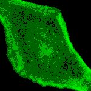

# [Ph488.czi](https://zenodo.org/record/5101351/files/Ph488.czi) report
 - **Autostitch** = false
 - ZeissCZIReader v6.14.0
 - ZeissQuickStartCZIReader v0.1.7-SNAPSHOT

# Images 

| Series            | Quick Start Reader | Size | Original Reader | Size |
|-------------------|--------------------|------|-----------------|------|
| Read time (all)   |24 ms|------|32 ms|------|
|0||X:1024 Y:1024 C:1 Z:41 T:1||X:1024 Y:1024 C:1 Z:41 T:1|

# Metadata

|  Method            | Parameters       | Quick Start Reader | Original Reader | Delta  |
| -------------------|------------------|--------------------|-----------------|------- |
| Initialization     |                  |3 ms|4 ms|        |
| Reader Size (Mb)     |                  |0.16|0.27|        |
| getStageLabelX| Image 0 | 0.000 um | -5599.600 um | 5599.600 um |
| getStageLabelY| Image 0 | 0.000 um | -16981.400 um | 16981.400 um |
| getStageLabelZ| Image 0 | 0.000 um | 24100.700 um | 24100.700 um |
| getPlaneDeltaT| Image 0 Plane 0 |  0.000 s |  5362.108 s | 5362.108 s |
| getPlanePositionX| Image 0 Plane 0 | 0.000 um | -5599.600 um | 5599.600 um |
| getPlanePositionY| Image 0 Plane 0 | 0.000 um | -16981.400 um | 16981.400 um |
| getPlanePositionZ| Image 0 Plane 0 | 0.000 um | 24100.700 um | 24100.700 um |
| getPlaneDeltaT| Image 0 Plane 1 |  0.000 s |  5362.108 s | 5362.108 s |
| getPlanePositionX| Image 0 Plane 1 | 0.000 um | -5599.600 um | 5599.600 um |
| getPlanePositionY| Image 0 Plane 1 | 0.000 um | -16981.400 um | 16981.400 um |
| getPlanePositionZ| Image 0 Plane 1 | 0.130 um | 24100.830 um | 24100.700 um |
| getPlaneDeltaT| Image 0 Plane 2 |  0.000 s |  5362.108 s | 5362.108 s |
| getPlanePositionX| Image 0 Plane 2 | 0.000 um | -5599.600 um | 5599.600 um |
| getPlanePositionY| Image 0 Plane 2 | 0.000 um | -16981.400 um | 16981.400 um |
| getPlanePositionZ| Image 0 Plane 2 | 0.260 um | 24100.960 um | 24100.700 um |
| getPlaneDeltaT| Image 0 Plane 3 |  0.000 s |  5362.108 s | 5362.108 s |
| getPlanePositionX| Image 0 Plane 3 | 0.000 um | -5599.600 um | 5599.600 um |
| getPlanePositionY| Image 0 Plane 3 | 0.000 um | -16981.400 um | 16981.400 um |
| getPlanePositionZ| Image 0 Plane 3 | 0.390 um | 24101.090 um | 24100.700 um |
| getPlaneDeltaT| Image 0 Plane 4 |  0.000 s |  5362.108 s | 5362.108 s |
| getPlanePositionX| Image 0 Plane 4 | 0.000 um | -5599.600 um | 5599.600 um |
| getPlanePositionY| Image 0 Plane 4 | 0.000 um | -16981.400 um | 16981.400 um |
| getPlanePositionZ| Image 0 Plane 4 | 0.520 um | 24101.220 um | 24100.700 um |
| getPlaneDeltaT| Image 0 Plane 5 |  0.000 s |  5362.108 s | 5362.108 s |
| getPlanePositionX| Image 0 Plane 5 | 0.000 um | -5599.600 um | 5599.600 um |
| getPlanePositionY| Image 0 Plane 5 | 0.000 um | -16981.400 um | 16981.400 um |
| getPlanePositionZ| Image 0 Plane 5 | 0.650 um | 24101.350 um | 24100.700 um |
| getPlaneDeltaT| Image 0 Plane 6 |  0.000 s |  5362.108 s | 5362.108 s |
| getPlanePositionX| Image 0 Plane 6 | 0.000 um | -5599.600 um | 5599.600 um |
| getPlanePositionY| Image 0 Plane 6 | 0.000 um | -16981.400 um | 16981.400 um |
| getPlanePositionZ| Image 0 Plane 6 | 0.780 um | 24101.480 um | 24100.700 um |
| getPlaneDeltaT| Image 0 Plane 7 |  0.000 s |  5362.108 s | 5362.108 s |
| getPlanePositionX| Image 0 Plane 7 | 0.000 um | -5599.600 um | 5599.600 um |
| getPlanePositionY| Image 0 Plane 7 | 0.000 um | -16981.400 um | 16981.400 um |
| getPlanePositionZ| Image 0 Plane 7 | 0.910 um | 24101.610 um | 24100.700 um |
| getPlaneDeltaT| Image 0 Plane 8 |  0.000 s |  5362.108 s | 5362.108 s |
| getPlanePositionX| Image 0 Plane 8 | 0.000 um | -5599.600 um | 5599.600 um |
| getPlanePositionY| Image 0 Plane 8 | 0.000 um | -16981.400 um | 16981.400 um |
| getPlanePositionZ| Image 0 Plane 8 | 1.040 um | 24101.740 um | 24100.700 um |
| getPlaneDeltaT| Image 0 Plane 9 |  0.000 s |  5362.108 s | 5362.108 s |
| getPlanePositionX| Image 0 Plane 9 | 0.000 um | -5599.600 um | 5599.600 um |
| getPlanePositionY| Image 0 Plane 9 | 0.000 um | -16981.400 um | 16981.400 um |
| getPlanePositionZ| Image 0 Plane 9 | 1.170 um | 24101.870 um | 24100.700 um |
| getPlaneDeltaT| Image 0 Plane 10 |  0.000 s |  5362.108 s | 5362.108 s |
| getPlanePositionX| Image 0 Plane 10 | 0.000 um | -5599.600 um | 5599.600 um |
| getPlanePositionY| Image 0 Plane 10 | 0.000 um | -16981.400 um | 16981.400 um |
| getPlanePositionZ| Image 0 Plane 10 | 1.300 um | 24102.000 um | 24100.700 um |
| getPlaneDeltaT| Image 0 Plane 11 |  0.000 s |  5362.108 s | 5362.108 s |
| getPlanePositionX| Image 0 Plane 11 | 0.000 um | -5599.600 um | 5599.600 um |
| getPlanePositionY| Image 0 Plane 11 | 0.000 um | -16981.400 um | 16981.400 um |
| getPlanePositionZ| Image 0 Plane 11 | 1.430 um | 24102.130 um | 24100.700 um |
| getPlaneDeltaT| Image 0 Plane 12 |  0.000 s |  5362.108 s | 5362.108 s |
| getPlanePositionX| Image 0 Plane 12 | 0.000 um | -5599.600 um | 5599.600 um |
| getPlanePositionY| Image 0 Plane 12 | 0.000 um | -16981.400 um | 16981.400 um |
| getPlanePositionZ| Image 0 Plane 12 | 1.560 um | 24102.260 um | 24100.700 um |
| getPlaneDeltaT| Image 0 Plane 13 |  0.000 s |  5362.108 s | 5362.108 s |
| getPlanePositionX| Image 0 Plane 13 | 0.000 um | -5599.600 um | 5599.600 um |
| getPlanePositionY| Image 0 Plane 13 | 0.000 um | -16981.400 um | 16981.400 um |
| getPlanePositionZ| Image 0 Plane 13 | 1.690 um | 24102.390 um | 24100.700 um |
| getPlaneDeltaT| Image 0 Plane 14 |  0.000 s |  5362.108 s | 5362.108 s |
| getPlanePositionX| Image 0 Plane 14 | 0.000 um | -5599.600 um | 5599.600 um |
| getPlanePositionY| Image 0 Plane 14 | 0.000 um | -16981.400 um | 16981.400 um |
| getPlanePositionZ| Image 0 Plane 14 | 1.820 um | 24102.520 um | 24100.700 um |
| getPlaneDeltaT| Image 0 Plane 15 |  0.000 s |  5362.108 s | 5362.108 s |
| getPlanePositionX| Image 0 Plane 15 | 0.000 um | -5599.600 um | 5599.600 um |
| getPlanePositionY| Image 0 Plane 15 | 0.000 um | -16981.400 um | 16981.400 um |
| getPlanePositionZ| Image 0 Plane 15 | 1.950 um | 24102.650 um | 24100.700 um |
| getPlaneDeltaT| Image 0 Plane 16 |  0.000 s |  5362.108 s | 5362.108 s |
| getPlanePositionX| Image 0 Plane 16 | 0.000 um | -5599.600 um | 5599.600 um |
| getPlanePositionY| Image 0 Plane 16 | 0.000 um | -16981.400 um | 16981.400 um |
| getPlanePositionZ| Image 0 Plane 16 | 2.080 um | 24102.780 um | 24100.700 um |
| getPlaneDeltaT| Image 0 Plane 17 |  0.000 s |  5362.108 s | 5362.108 s |
| getPlanePositionX| Image 0 Plane 17 | 0.000 um | -5599.600 um | 5599.600 um |
| getPlanePositionY| Image 0 Plane 17 | 0.000 um | -16981.400 um | 16981.400 um |
| getPlanePositionZ| Image 0 Plane 17 | 2.210 um | 24102.910 um | 24100.700 um |
| getPlaneDeltaT| Image 0 Plane 18 |  0.000 s |  5362.108 s | 5362.108 s |
| getPlanePositionX| Image 0 Plane 18 | 0.000 um | -5599.600 um | 5599.600 um |
| getPlanePositionY| Image 0 Plane 18 | 0.000 um | -16981.400 um | 16981.400 um |
| getPlanePositionZ| Image 0 Plane 18 | 2.340 um | 24103.040 um | 24100.700 um |
| getPlaneDeltaT| Image 0 Plane 19 |  0.000 s |  5362.108 s | 5362.108 s |
| getPlanePositionX| Image 0 Plane 19 | 0.000 um | -5599.600 um | 5599.600 um |
| getPlanePositionY| Image 0 Plane 19 | 0.000 um | -16981.400 um | 16981.400 um |
| getPlanePositionZ| Image 0 Plane 19 | 2.470 um | 24103.170 um | 24100.700 um |
| getPlaneDeltaT| Image 0 Plane 20 |  0.000 s |  5362.108 s | 5362.108 s |
| getPlanePositionX| Image 0 Plane 20 | 0.000 um | -5599.600 um | 5599.600 um |
| getPlanePositionY| Image 0 Plane 20 | 0.000 um | -16981.400 um | 16981.400 um |
| getPlanePositionZ| Image 0 Plane 20 | 2.600 um | 24103.300 um | 24100.700 um |
| getPlaneDeltaT| Image 0 Plane 21 |  0.000 s |  5362.108 s | 5362.108 s |
| getPlanePositionX| Image 0 Plane 21 | 0.000 um | -5599.600 um | 5599.600 um |
| getPlanePositionY| Image 0 Plane 21 | 0.000 um | -16981.400 um | 16981.400 um |
| getPlanePositionZ| Image 0 Plane 21 | 2.730 um | 24103.430 um | 24100.700 um |
| getPlaneDeltaT| Image 0 Plane 22 |  0.000 s |  5362.108 s | 5362.108 s |
| getPlanePositionX| Image 0 Plane 22 | 0.000 um | -5599.600 um | 5599.600 um |
| getPlanePositionY| Image 0 Plane 22 | 0.000 um | -16981.400 um | 16981.400 um |
| getPlanePositionZ| Image 0 Plane 22 | 2.860 um | 24103.560 um | 24100.700 um |
| getPlaneDeltaT| Image 0 Plane 23 |  0.000 s |  5362.108 s | 5362.108 s |
| getPlanePositionX| Image 0 Plane 23 | 0.000 um | -5599.600 um | 5599.600 um |
| getPlanePositionY| Image 0 Plane 23 | 0.000 um | -16981.400 um | 16981.400 um |
| getPlanePositionZ| Image 0 Plane 23 | 2.990 um | 24103.690 um | 24100.700 um |
| getPlaneDeltaT| Image 0 Plane 24 |  0.000 s |  5362.108 s | 5362.108 s |
| getPlanePositionX| Image 0 Plane 24 | 0.000 um | -5599.600 um | 5599.600 um |
| getPlanePositionY| Image 0 Plane 24 | 0.000 um | -16981.400 um | 16981.400 um |
| getPlanePositionZ| Image 0 Plane 24 | 3.120 um | 24103.820 um | 24100.700 um |
| getPlaneDeltaT| Image 0 Plane 25 |  0.000 s |  5362.108 s | 5362.108 s |
| getPlanePositionX| Image 0 Plane 25 | 0.000 um | -5599.600 um | 5599.600 um |
| getPlanePositionY| Image 0 Plane 25 | 0.000 um | -16981.400 um | 16981.400 um |
| getPlanePositionZ| Image 0 Plane 25 | 3.250 um | 24103.950 um | 24100.700 um |
| getPlaneDeltaT| Image 0 Plane 26 |  0.000 s |  5362.108 s | 5362.108 s |
| getPlanePositionX| Image 0 Plane 26 | 0.000 um | -5599.600 um | 5599.600 um |
| getPlanePositionY| Image 0 Plane 26 | 0.000 um | -16981.400 um | 16981.400 um |
| getPlanePositionZ| Image 0 Plane 26 | 3.380 um | 24104.080 um | 24100.700 um |
| getPlaneDeltaT| Image 0 Plane 27 |  0.000 s |  5362.108 s | 5362.108 s |
| getPlanePositionX| Image 0 Plane 27 | 0.000 um | -5599.600 um | 5599.600 um |
| getPlanePositionY| Image 0 Plane 27 | 0.000 um | -16981.400 um | 16981.400 um |
| getPlanePositionZ| Image 0 Plane 27 | 3.510 um | 24104.210 um | 24100.700 um |
| getPlaneDeltaT| Image 0 Plane 28 |  0.000 s |  5362.108 s | 5362.108 s |
| getPlanePositionX| Image 0 Plane 28 | 0.000 um | -5599.600 um | 5599.600 um |
| getPlanePositionY| Image 0 Plane 28 | 0.000 um | -16981.400 um | 16981.400 um |
| getPlanePositionZ| Image 0 Plane 28 | 3.640 um | 24104.340 um | 24100.700 um |
| getPlaneDeltaT| Image 0 Plane 29 |  0.000 s |  5362.108 s | 5362.108 s |
| getPlanePositionX| Image 0 Plane 29 | 0.000 um | -5599.600 um | 5599.600 um |
| getPlanePositionY| Image 0 Plane 29 | 0.000 um | -16981.400 um | 16981.400 um |
| getPlanePositionZ| Image 0 Plane 29 | 3.770 um | 24104.470 um | 24100.700 um |
| getPlaneDeltaT| Image 0 Plane 30 |  0.000 s |  5362.108 s | 5362.108 s |
| getPlanePositionX| Image 0 Plane 30 | 0.000 um | -5599.600 um | 5599.600 um |
| getPlanePositionY| Image 0 Plane 30 | 0.000 um | -16981.400 um | 16981.400 um |
| getPlanePositionZ| Image 0 Plane 30 | 3.900 um | 24104.600 um | 24100.700 um |
| getPlaneDeltaT| Image 0 Plane 31 |  0.000 s |  5362.108 s | 5362.108 s |
| getPlanePositionX| Image 0 Plane 31 | 0.000 um | -5599.600 um | 5599.600 um |
| getPlanePositionY| Image 0 Plane 31 | 0.000 um | -16981.400 um | 16981.400 um |
| getPlanePositionZ| Image 0 Plane 31 | 4.030 um | 24104.730 um | 24100.700 um |
| getPlaneDeltaT| Image 0 Plane 32 |  0.000 s |  5362.108 s | 5362.108 s |
| getPlanePositionX| Image 0 Plane 32 | 0.000 um | -5599.600 um | 5599.600 um |
| getPlanePositionY| Image 0 Plane 32 | 0.000 um | -16981.400 um | 16981.400 um |
| getPlanePositionZ| Image 0 Plane 32 | 4.160 um | 24104.860 um | 24100.700 um |
| getPlaneDeltaT| Image 0 Plane 33 |  0.000 s |  5362.108 s | 5362.108 s |
| getPlanePositionX| Image 0 Plane 33 | 0.000 um | -5599.600 um | 5599.600 um |
| getPlanePositionY| Image 0 Plane 33 | 0.000 um | -16981.400 um | 16981.400 um |
| getPlanePositionZ| Image 0 Plane 33 | 4.290 um | 24104.990 um | 24100.700 um |
| getPlaneDeltaT| Image 0 Plane 34 |  0.000 s |  5362.108 s | 5362.108 s |
| getPlanePositionX| Image 0 Plane 34 | 0.000 um | -5599.600 um | 5599.600 um |
| getPlanePositionY| Image 0 Plane 34 | 0.000 um | -16981.400 um | 16981.400 um |
| getPlanePositionZ| Image 0 Plane 34 | 4.420 um | 24105.120 um | 24100.700 um |
| getPlaneDeltaT| Image 0 Plane 35 |  0.000 s |  5362.108 s | 5362.108 s |
| getPlanePositionX| Image 0 Plane 35 | 0.000 um | -5599.600 um | 5599.600 um |
| getPlanePositionY| Image 0 Plane 35 | 0.000 um | -16981.400 um | 16981.400 um |
| getPlanePositionZ| Image 0 Plane 35 | 4.550 um | 24105.250 um | 24100.700 um |
| getPlaneDeltaT| Image 0 Plane 36 |  0.000 s |  5362.108 s | 5362.108 s |
| getPlanePositionX| Image 0 Plane 36 | 0.000 um | -5599.600 um | 5599.600 um |
| getPlanePositionY| Image 0 Plane 36 | 0.000 um | -16981.400 um | 16981.400 um |
| getPlanePositionZ| Image 0 Plane 36 | 4.680 um | 24105.380 um | 24100.700 um |
| getPlaneDeltaT| Image 0 Plane 37 |  0.000 s |  5362.108 s | 5362.108 s |
| getPlanePositionX| Image 0 Plane 37 | 0.000 um | -5599.600 um | 5599.600 um |
| getPlanePositionY| Image 0 Plane 37 | 0.000 um | -16981.400 um | 16981.400 um |
| getPlanePositionZ| Image 0 Plane 37 | 4.810 um | 24105.510 um | 24100.700 um |
| getPlaneDeltaT| Image 0 Plane 38 |  0.000 s |  5362.108 s | 5362.108 s |
| getPlanePositionX| Image 0 Plane 38 | 0.000 um | -5599.600 um | 5599.600 um |
| getPlanePositionY| Image 0 Plane 38 | 0.000 um | -16981.400 um | 16981.400 um |
| getPlanePositionZ| Image 0 Plane 38 | 4.940 um | 24105.640 um | 24100.700 um |
| getPlaneDeltaT| Image 0 Plane 39 |  0.000 s |  5362.108 s | 5362.108 s |
| getPlanePositionX| Image 0 Plane 39 | 0.000 um | -5599.600 um | 5599.600 um |
| getPlanePositionY| Image 0 Plane 39 | 0.000 um | -16981.400 um | 16981.400 um |
| getPlanePositionZ| Image 0 Plane 39 | 5.070 um | 24105.770 um | 24100.700 um |
| getPlaneDeltaT| Image 0 Plane 40 |  0.000 s |  5362.108 s | 5362.108 s |
| getPlanePositionX| Image 0 Plane 40 | 0.000 um | -5599.600 um | 5599.600 um |
| getPlanePositionY| Image 0 Plane 40 | 0.000 um | -16981.400 um | 16981.400 um |
| getPlanePositionZ| Image 0 Plane 40 | 5.200 um | 24105.900 um | 24100.700 um |
