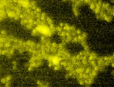

# [Plate1-Blue-A-12-Scene-3-P3-F2-03.czi](https://downloads.openmicroscopy.org/images/Zeiss-CZI/idr0011/Plate1-Blue-A_TS-Stinger/Plate1-Blue-A-12-Scene-3-P3-F2-03.czi) report
 - **Autostitch** = false
 - ZeissCZIReader v6.14.0
 - ZeissQuickStartCZIReader v0.1.7-SNAPSHOT

# Images 

| Series            | Quick Start Reader | Size | Original Reader | Size |
|-------------------|--------------------|------|-----------------|------|
| Read time (all)   |41 ms|------|45 ms|------|
|0||X:672 Y:512 C:3 Z:21 T:1||X:672 Y:512 C:3 Z:21 T:1|

# Metadata

|  Method            | Parameters       | Quick Start Reader | Original Reader | Delta  |
| -------------------|------------------|--------------------|-----------------|------- |
| Initialization     |                  |7 ms|8 ms|        |
| Reader Size (Mb)     |                  |0.93|1.16|        |
| getStageLabelName| Image 0 | P3| Scene position #0| |
| getStageLabelZ| Image 0 | -3435.340 um | -3438.840 um | 3.500 um |
| getPlaneDeltaT| Image 0 Plane 3 |  30.691 s |  30.581 s | 0.110 s |
| getPlaneDeltaT| Image 0 Plane 4 |  30.884 s |  30.781 s | 0.103 s |
| getPlanePositionZ| Image 0 Plane 5 | -3434.990 um | -3435.340 um | 0.350 um |
| getPlaneDeltaT| Image 0 Plane 6 |  31.262 s |  31.060 s | 0.202 s |
| getPlaneDeltaT| Image 0 Plane 7 |  31.456 s |  31.313 s | 0.143 s |
| getPlanePositionZ| Image 0 Plane 8 | -3434.640 um | -3435.340 um | 0.700 um |
| getPlaneDeltaT| Image 0 Plane 9 |  31.832 s |  31.618 s | 0.214 s |
| getPlaneDeltaT| Image 0 Plane 10 |  32.028 s |  31.797 s | 0.231 s |
| getPlanePositionZ| Image 0 Plane 11 | -3434.290 um | -3435.340 um | 1.050 um |
| getPlaneDeltaT| Image 0 Plane 12 |  32.403 s |  32.053 s | 0.350 s |
| getPlaneDeltaT| Image 0 Plane 13 |  32.601 s |  32.284 s | 0.317 s |
| getPlanePositionZ| Image 0 Plane 14 | -3433.940 um | -3435.340 um | 1.400 um |
| getPlaneDeltaT| Image 0 Plane 15 |  32.973 s |  32.541 s | 0.432 s |
| getPlaneDeltaT| Image 0 Plane 16 |  33.173 s |  32.733 s | 0.440 s |
| getPlanePositionZ| Image 0 Plane 17 | -3433.590 um | -3435.340 um | 1.750 um |
| getPlaneDeltaT| Image 0 Plane 18 |  33.543 s |  32.989 s | 0.554 s |
| getPlaneDeltaT| Image 0 Plane 19 |  33.745 s |  33.180 s | 0.565 s |
| getPlanePositionZ| Image 0 Plane 20 | -3433.240 um | -3435.340 um | 2.100 um |
| getPlaneDeltaT| Image 0 Plane 21 |  34.114 s |  33.443 s | 0.671 s |
| getPlaneDeltaT| Image 0 Plane 22 |  34.317 s |  33.634 s | 0.683 s |
| getPlanePositionZ| Image 0 Plane 23 | -3432.890 um | -3435.340 um | 2.450 um |
| getPlaneDeltaT| Image 0 Plane 24 |  34.684 s |  33.940 s | 0.744 s |
| getPlaneDeltaT| Image 0 Plane 25 |  34.889 s |  34.131 s | 0.758 s |
| getPlanePositionZ| Image 0 Plane 26 | -3432.540 um | -3435.340 um | 2.800 um |
| getPlaneDeltaT| Image 0 Plane 27 |  35.254 s |  34.394 s | 0.860 s |
| getPlaneDeltaT| Image 0 Plane 28 |  35.461 s |  34.586 s | 0.875 s |
| getPlanePositionZ| Image 0 Plane 29 | -3432.190 um | -3435.340 um | 3.150 um |
| getPlaneDeltaT| Image 0 Plane 30 |  35.825 s |  34.865 s | 0.960 s |
| getPlaneDeltaT| Image 0 Plane 31 |  36.033 s |  35.054 s | 0.979 s |
| getPlanePositionZ| Image 0 Plane 32 | -3431.840 um | -3435.340 um | 3.500 um |
| getPlaneDeltaT| Image 0 Plane 33 |  36.395 s |  37.756 s | 1.361 s |
| getPlaneDeltaT| Image 0 Plane 34 |  36.606 s |  37.990 s | 1.384 s |
| getPlanePositionZ| Image 0 Plane 35 | -3431.490 um | -3435.340 um | 3.850 um |
| getPlaneDeltaT| Image 0 Plane 36 |  36.966 s |  38.244 s | 1.278 s |
| getPlaneDeltaT| Image 0 Plane 37 |  37.178 s |  38.475 s | 1.297 s |
| getPlanePositionZ| Image 0 Plane 38 | -3431.140 um | -3435.340 um | 4.200 um |
| getPlaneDeltaT| Image 0 Plane 39 |  37.536 s |  38.731 s | 1.195 s |
| getPlaneDeltaT| Image 0 Plane 40 |  37.750 s |  38.955 s | 1.205 s |
| getPlanePositionZ| Image 0 Plane 41 | -3430.790 um | -3435.340 um | 4.550 um |
| getPlaneDeltaT| Image 0 Plane 42 |  38.106 s |  39.212 s | 1.106 s |
| getPlaneDeltaT| Image 0 Plane 43 |  38.322 s |  39.439 s | 1.117 s |
| getPlanePositionZ| Image 0 Plane 44 | -3430.440 um | -3435.340 um | 4.900 um |
| getPlaneDeltaT| Image 0 Plane 45 |  38.677 s |  39.738 s | 1.061 s |
| getPlaneDeltaT| Image 0 Plane 46 |  38.894 s |  39.951 s | 1.057 s |
| getPlanePositionZ| Image 0 Plane 47 | -3430.090 um | -3435.340 um | 5.250 um |
| getPlaneDeltaT| Image 0 Plane 48 |  39.247 s |  40.212 s | 0.965 s |
| getPlaneDeltaT| Image 0 Plane 49 |  39.466 s |  40.404 s | 0.938 s |
| getPlanePositionZ| Image 0 Plane 50 | -3429.740 um | -3435.340 um | 5.600 um |
| getPlaneDeltaT| Image 0 Plane 51 |  39.817 s |  40.697 s | 0.880 s |
| getPlaneDeltaT| Image 0 Plane 52 |  40.038 s |  40.876 s | 0.838 s |
| getPlanePositionZ| Image 0 Plane 53 | -3429.390 um | -3435.340 um | 5.950 um |
| getPlaneDeltaT| Image 0 Plane 54 |  40.388 s |  41.171 s | 0.783 s |
| getPlaneDeltaT| Image 0 Plane 55 |  40.611 s |  41.351 s | 0.740 s |
| getPlanePositionZ| Image 0 Plane 56 | -3429.040 um | -3435.340 um | 6.300 um |
| getPlaneDeltaT| Image 0 Plane 57 |  40.958 s |  41.614 s | 0.656 s |
| getPlaneDeltaT| Image 0 Plane 58 |  41.183 s |  41.838 s | 0.655 s |
| getPlanePositionZ| Image 0 Plane 59 | -3428.690 um | -3435.340 um | 6.650 um |
| getPlaneDeltaT| Image 0 Plane 60 |  41.529 s |  42.099 s | 0.570 s |
| getPlaneDeltaT| Image 0 Plane 61 |  41.755 s |  42.327 s | 0.572 s |
| getPlanePositionZ| Image 0 Plane 62 | -3428.340 um | -3435.340 um | 7.000 um |
