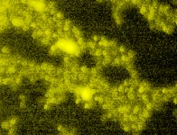

# [Plate1-Blue-A-12-Scene-3-P3-F2-03.czi](https://downloads.openmicroscopy.org/images/Zeiss-CZI/idr0011/Plate1-Blue-A_TS-Stinger/Plate1-Blue-A-12-Scene-3-P3-F2-03.czi) report
 - **Autostitch** = true
 - ZeissCZIReader v6.14.0
 - ZeissQuickStartCZIReader v0.1.8-SNAPSHOT

# Images 

| Series            | Quick Start Reader | Size | Original Reader | Size | #Diffs |
|-------------------|--------------------|------|-----------------|------|--------|
| Read time (all)   |35 ms|------|49 ms|------|--------|
|0||X:672 Y:512 C:3 Z:21 T:1||X:672 Y:512 C:3 Z:21 T:1|0|

# Metadata

|  Method            | Parameters       | Quick Start Reader | Original Reader | Delta  |
| -------------------|------------------|--------------------|-----------------|------- |
| Initialization     |                  |10 ms|11 ms|        |
| Reader Size (Mb)     |                  |0.93|1.16|        |
| getStageLabelName| Image 0 | P3| Scene position #0| |
| getStageLabelZ| Image 0 | -3435.340 um | -3438.840 um | 3.500 um |
| getPlaneDeltaT| Image 0 Plane 3 |  30.720 s |  30.581 s | 0.139 s |
| getPlaneDeltaT| Image 0 Plane 4 |  30.913 s |  30.781 s | 0.132 s |
| getPlanePositionZ| Image 0 Plane 5 | -3434.990 um | -3435.340 um | 0.350 um |
| getPlaneDeltaT| Image 0 Plane 6 |  31.319 s |  31.060 s | 0.259 s |
| getPlaneDeltaT| Image 0 Plane 7 |  31.514 s |  31.313 s | 0.201 s |
| getPlanePositionZ| Image 0 Plane 8 | -3434.640 um | -3435.340 um | 0.700 um |
| getPlaneDeltaT| Image 0 Plane 9 |  31.918 s |  31.618 s | 0.300 s |
| getPlaneDeltaT| Image 0 Plane 10 |  32.114 s |  31.797 s | 0.317 s |
| getPlanePositionZ| Image 0 Plane 11 | -3434.290 um | -3435.340 um | 1.050 um |
| getPlaneDeltaT| Image 0 Plane 12 |  32.517 s |  32.053 s | 0.464 s |
| getPlaneDeltaT| Image 0 Plane 13 |  32.715 s |  32.284 s | 0.431 s |
| getPlanePositionZ| Image 0 Plane 14 | -3433.940 um | -3435.340 um | 1.400 um |
| getPlaneDeltaT| Image 0 Plane 15 |  33.116 s |  32.541 s | 0.575 s |
| getPlaneDeltaT| Image 0 Plane 16 |  33.316 s |  32.733 s | 0.583 s |
| getPlanePositionZ| Image 0 Plane 17 | -3433.590 um | -3435.340 um | 1.750 um |
| getPlaneDeltaT| Image 0 Plane 18 |  33.714 s |  32.989 s | 0.725 s |
| getPlaneDeltaT| Image 0 Plane 19 |  33.916 s |  33.180 s | 0.736 s |
| getPlanePositionZ| Image 0 Plane 20 | -3433.240 um | -3435.340 um | 2.100 um |
| getPlaneDeltaT| Image 0 Plane 21 |  34.313 s |  33.443 s | 0.870 s |
| getPlaneDeltaT| Image 0 Plane 22 |  34.517 s |  33.634 s | 0.883 s |
| getPlanePositionZ| Image 0 Plane 23 | -3432.890 um | -3435.340 um | 2.450 um |
| getPlaneDeltaT| Image 0 Plane 24 |  34.912 s |  33.940 s | 0.972 s |
| getPlaneDeltaT| Image 0 Plane 25 |  35.118 s |  34.131 s | 0.987 s |
| getPlanePositionZ| Image 0 Plane 26 | -3432.540 um | -3435.340 um | 2.800 um |
| getPlaneDeltaT| Image 0 Plane 27 |  35.511 s |  34.394 s | 1.117 s |
| getPlaneDeltaT| Image 0 Plane 28 |  35.719 s |  34.586 s | 1.133 s |
| getPlanePositionZ| Image 0 Plane 29 | -3432.190 um | -3435.340 um | 3.150 um |
| getPlaneDeltaT| Image 0 Plane 30 |  36.110 s |  34.865 s | 1.245 s |
| getPlaneDeltaT| Image 0 Plane 31 |  36.319 s |  35.054 s | 1.266 s |
| getPlanePositionZ| Image 0 Plane 32 | -3431.840 um | -3435.340 um | 3.500 um |
| getPlaneDeltaT| Image 0 Plane 33 |  36.709 s |  37.756 s | 1.047 s |
| getPlaneDeltaT| Image 0 Plane 34 |  36.920 s |  37.990 s | 1.070 s |
| getPlanePositionZ| Image 0 Plane 35 | -3431.490 um | -3435.340 um | 3.850 um |
| getPlaneDeltaT| Image 0 Plane 36 |  37.308 s |  38.244 s | 0.936 s |
| getPlaneDeltaT| Image 0 Plane 37 |  37.521 s |  38.475 s | 0.954 s |
| getPlanePositionZ| Image 0 Plane 38 | -3431.140 um | -3435.340 um | 4.200 um |
| getPlaneDeltaT| Image 0 Plane 39 |  37.907 s |  38.731 s | 0.824 s |
| getPlaneDeltaT| Image 0 Plane 40 |  38.122 s |  38.955 s | 0.833 s |
| getPlanePositionZ| Image 0 Plane 41 | -3430.790 um | -3435.340 um | 4.550 um |
| getPlaneDeltaT| Image 0 Plane 42 |  38.506 s |  39.212 s | 0.706 s |
| getPlaneDeltaT| Image 0 Plane 43 |  38.722 s |  39.439 s | 0.716 s |
| getPlanePositionZ| Image 0 Plane 44 | -3430.440 um | -3435.340 um | 4.900 um |
| getPlaneDeltaT| Image 0 Plane 45 |  39.104 s |  39.738 s | 0.633 s |
| getPlaneDeltaT| Image 0 Plane 46 |  39.323 s |  39.951 s | 0.628 s |
| getPlanePositionZ| Image 0 Plane 47 | -3430.090 um | -3435.340 um | 5.250 um |
| getPlaneDeltaT| Image 0 Plane 48 |  39.703 s |  40.212 s | 0.509 s |
| getPlaneDeltaT| Image 0 Plane 49 |  39.924 s |  40.404 s | 0.480 s |
| getPlanePositionZ| Image 0 Plane 50 | -3429.740 um | -3435.340 um | 5.600 um |
| getPlaneDeltaT| Image 0 Plane 51 |  40.302 s |  40.697 s | 0.395 s |
| getPlaneDeltaT| Image 0 Plane 52 |  40.525 s |  40.876 s | 0.351 s |
| getPlanePositionZ| Image 0 Plane 53 | -3429.390 um | -3435.340 um | 5.950 um |
| getPlaneDeltaT| Image 0 Plane 54 |  40.901 s |  41.171 s | 0.270 s |
| getPlaneDeltaT| Image 0 Plane 55 |  41.125 s |  41.351 s | 0.225 s |
| getPlanePositionZ| Image 0 Plane 56 | -3429.040 um | -3435.340 um | 6.300 um |
| getPlaneDeltaT| Image 0 Plane 57 |  41.500 s |  41.614 s | 0.114 s |
| getPlaneDeltaT| Image 0 Plane 58 |  41.726 s |  41.838 s | 0.112 s |
| getPlanePositionZ| Image 0 Plane 59 | -3428.690 um | -3435.340 um | 6.650 um |
| getPlanePositionZ| Image 0 Plane 62 | -3428.340 um | -3435.340 um | 7.000 um |
