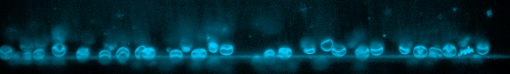

# [RBC_full_time_series.czi](https://zenodo.org/record/7117784/files/RBC_full_time_series.czi) report
 - **Autostitch** = false
 - ZeissCZIReader v6.14.0
 - ZeissQuickStartCZIReader v0.1.7-SNAPSHOT

# Images 

| Series            | Quick Start Reader | Size | Original Reader | Size |
|-------------------|--------------------|------|-----------------|------|
| Read time (all)   |155 ms|------|763 ms|------|
|0||X:2048 Y:300 C:1 Z:834 T:3||X:2048 Y:300 C:1 Z:834 T:3|

# Metadata

|  Method            | Parameters       | Quick Start Reader | Original Reader | Delta  |
| -------------------|------------------|--------------------|-----------------|------- |
| Initialization     |                  |31 ms|144 ms|        |
| Reader Size (Mb)     |                  |2.58|5.33|        |
| getPlanePositionZ| Image 0 Plane 1 | -384.727 um | -385.027 um | 0.300 um |
| getPlanePositionZ| Image 0 Plane 2 | -384.427 um | -385.027 um | 0.600 um |
| getPlanePositionZ| Image 0 Plane 3 | -384.127 um | -385.027 um | 0.900 um |
| getPlanePositionZ| Image 0 Plane 4 | -383.827 um | -385.027 um | 1.200 um |
| getPlanePositionZ| Image 0 Plane 5 | -383.527 um | -385.027 um | 1.500 um |
| getPlanePositionZ| Image 0 Plane 6 | -383.227 um | -385.027 um | 1.800 um |
| getPlanePositionZ| Image 0 Plane 7 | -382.927 um | -385.027 um | 2.100 um |
| getPlanePositionZ| Image 0 Plane 8 | -382.627 um | -385.027 um | 2.400 um |
| getPlanePositionZ| Image 0 Plane 9 | -382.327 um | -385.027 um | 2.700 um |
| getPlanePositionZ| Image 0 Plane 10 | -382.027 um | -385.027 um | 3.000 um |
| getPlanePositionZ| Image 0 Plane 11 | -381.727 um | -385.027 um | 3.300 um |
| getPlanePositionZ| Image 0 Plane 12 | -381.427 um | -385.027 um | 3.600 um |
| getPlanePositionZ| Image 0 Plane 13 | -381.127 um | -385.027 um | 3.900 um |
| getPlanePositionZ| Image 0 Plane 14 | -380.827 um | -385.027 um | 4.200 um |
| getPlanePositionZ| Image 0 Plane 15 | -380.527 um | -385.027 um | 4.500 um |
| getPlanePositionZ| Image 0 Plane 16 | -380.227 um | -385.027 um | 4.800 um |
| getPlanePositionZ| Image 0 Plane 17 | -379.927 um | -385.027 um | 5.100 um |
| getPlanePositionZ| Image 0 Plane 18 | -379.627 um | -385.027 um | 5.400 um |
| getPlanePositionZ| Image 0 Plane 19 | -379.327 um | -385.027 um | 5.700 um |
| getPlanePositionZ| Image 0 Plane 20 | -379.027 um | -385.027 um | 6.000 um |
| getPlaneDeltaT| Image 0 Plane 21 |  3.099 s |  3.101 s | 0.002 s |
| getPlanePositionZ| Image 0 Plane 21 | -378.727 um | -385.027 um | 6.300 um |
| getPlaneDeltaT| Image 0 Plane 22 |  3.143 s |  3.144 s | 0.001 s |
| getPlanePositionZ| Image 0 Plane 22 | -378.427 um | -385.027 um | 6.600 um |
| getPlanePositionZ| Image 0 Plane 23 | -378.127 um | -385.027 um | 6.900 um |
| getPlaneDeltaT| Image 0 Plane 24 |  3.230 s |  3.231 s | 0.001 s |
| getPlanePositionZ| Image 0 Plane 24 | -377.827 um | -385.027 um | 7.200 um |
| getPlaneDeltaT| Image 0 Plane 25 |  3.273 s |  3.274 s | 0.001 s |
| getPlanePositionZ| Image 0 Plane 25 | -377.527 um | -385.027 um | 7.500 um |
| getPlaneDeltaT| Image 0 Plane 26 |  3.316 s |  3.318 s | 0.002 s |
| getPlanePositionZ| Image 0 Plane 26 | -377.227 um | -385.027 um | 7.800 um |
| getPlaneDeltaT| Image 0 Plane 27 |  3.360 s |  3.361 s | 0.001 s |
| getPlanePositionZ| Image 0 Plane 27 | -376.927 um | -385.027 um | 8.100 um |
| getPlanePositionZ| Image 0 Plane 28 | -376.627 um | -385.027 um | 8.400 um |
| getPlaneDeltaT| Image 0 Plane 29 |  3.447 s |  3.448 s | 0.001 s |
| getPlanePositionZ| Image 0 Plane 29 | -376.327 um | -385.027 um | 8.700 um |
| getPlanePositionZ| Image 0 Plane 30 | -376.027 um | -385.027 um | 9.000 um |
| getPlaneDeltaT| Image 0 Plane 31 |  3.534 s |  3.535 s | 0.001 s |
| getPlanePositionZ| Image 0 Plane 31 | -375.727 um | -385.027 um | 9.300 um |
| getPlanePositionZ| Image 0 Plane 32 | -375.427 um | -385.027 um | 9.600 um |
| getPlaneDeltaT| Image 0 Plane 33 |  3.620 s |  3.622 s | 0.002 s |
| getPlanePositionZ| Image 0 Plane 33 | -375.127 um | -385.027 um | 9.900 um |
| getPlaneDeltaT| Image 0 Plane 34 |  3.664 s |  3.665 s | 0.001 s |
| getPlanePositionZ| Image 0 Plane 34 | -374.827 um | -385.027 um | 10.200 um |
| getPlaneDeltaT| Image 0 Plane 35 |  3.707 s |  3.713 s | 0.006 s |
| getPlanePositionZ| Image 0 Plane 35 | -374.527 um | -385.027 um | 10.500 um |
| getPlaneDeltaT| Image 0 Plane 36 |  3.751 s |  3.752 s | 0.001 s |
| getPlanePositionZ| Image 0 Plane 36 | -374.227 um | -385.027 um | 10.800 um |
| getPlaneDeltaT| Image 0 Plane 37 |  3.794 s |  3.796 s | 0.002 s |
| getPlanePositionZ| Image 0 Plane 37 | -373.927 um | -385.027 um | 11.100 um |
| getPlaneDeltaT| Image 0 Plane 38 |  3.838 s |  3.839 s | 0.001 s |
| getPlanePositionZ| Image 0 Plane 38 | -373.627 um | -385.027 um | 11.400 um |
| getPlaneDeltaT| Image 0 Plane 39 |  3.881 s |  3.883 s | 0.002 s |
| getPlanePositionZ| Image 0 Plane 39 | -373.327 um | -385.027 um | 11.700 um |
| getPlaneDeltaT| Image 0 Plane 40 |  3.925 s |  3.926 s | 0.001 s |
| getPlanePositionZ| Image 0 Plane 40 | -373.027 um | -385.027 um | 12.000 um |
| getPlaneDeltaT| Image 0 Plane 41 |  3.968 s |  3.969 s | 0.001 s |
| getPlanePositionZ| Image 0 Plane 41 | -372.727 um | -385.027 um | 12.300 um |
| getPlaneDeltaT| Image 0 Plane 42 |  4.011 s |  4.013 s | 0.002 s |
| getPlanePositionZ| Image 0 Plane 42 | -372.427 um | -385.027 um | 12.600 um |
| getPlaneDeltaT| Image 0 Plane 43 |  4.055 s |  4.056 s | 0.001 s |
| getPlanePositionZ| Image 0 Plane 43 | -372.127 um | -385.027 um | 12.900 um |
| getPlaneDeltaT| Image 0 Plane 44 |  4.098 s |  4.100 s | 0.002 s |
| getPlanePositionZ| Image 0 Plane 44 | -371.827 um | -385.027 um | 13.200 um |
| getPlaneDeltaT| Image 0 Plane 45 |  4.142 s |  4.144 s | 0.002 s |
| getPlanePositionZ| Image 0 Plane 45 | -371.527 um | -385.027 um | 13.500 um |
| getPlaneDeltaT| Image 0 Plane 46 |  4.185 s |  4.187 s | 0.002 s |
| getPlanePositionZ| Image 0 Plane 46 | -371.227 um | -385.027 um | 13.800 um |
| getPlaneDeltaT| Image 0 Plane 47 |  4.229 s |  4.231 s | 0.002 s |
| getPlanePositionZ| Image 0 Plane 47 | -370.927 um | -385.027 um | 14.100 um |
| getPlaneDeltaT| Image 0 Plane 48 |  4.272 s |  4.274 s | 0.002 s |
| getPlanePositionZ| Image 0 Plane 48 | -370.627 um | -385.027 um | 14.400 um |
| getPlaneDeltaT| Image 0 Plane 49 |  4.316 s |  4.318 s | 0.002 s |
| getPlanePositionZ| Image 0 Plane 49 | -370.327 um | -385.027 um | 14.700 um |
| getPlaneDeltaT| Image 0 Plane 50 |  4.359 s |  4.361 s | 0.002 s |
| getPlanePositionZ| Image 0 Plane 50 | -370.027 um | -385.027 um | 15.000 um |
| getPlaneDeltaT| Image 0 Plane 51 |  4.402 s |  4.404 s | 0.002 s |
| getPlanePositionZ| Image 0 Plane 51 | -369.727 um | -385.027 um | 15.300 um |
| getPlaneDeltaT| Image 0 Plane 52 |  4.446 s |  4.448 s | 0.002 s |
| getPlanePositionZ| Image 0 Plane 52 | -369.427 um | -385.027 um | 15.600 um |
| getPlaneDeltaT| Image 0 Plane 53 |  4.489 s |  4.491 s | 0.002 s |
| getPlanePositionZ| Image 0 Plane 53 | -369.127 um | -385.027 um | 15.900 um |
| getPlaneDeltaT| Image 0 Plane 54 |  4.533 s |  4.535 s | 0.002 s |
| getPlanePositionZ| Image 0 Plane 54 | -368.827 um | -385.027 um | 16.200 um |
| getPlaneDeltaT| Image 0 Plane 55 |  4.576 s |  4.578 s | 0.002 s |
| getPlanePositionZ| Image 0 Plane 55 | -368.527 um | -385.027 um | 16.500 um |
| getPlaneDeltaT| Image 0 Plane 56 |  4.620 s |  4.622 s | 0.002 s |
| getPlanePositionZ| Image 0 Plane 56 | -368.227 um | -385.027 um | 16.800 um |
| getPlaneDeltaT| Image 0 Plane 57 |  4.663 s |  4.665 s | 0.002 s |
| getPlanePositionZ| Image 0 Plane 57 | -367.927 um | -385.027 um | 17.100 um |
| getPlaneDeltaT| Image 0 Plane 58 |  4.706 s |  4.709 s | 0.003 s |
| getPlanePositionZ| Image 0 Plane 58 | -367.627 um | -385.027 um | 17.400 um |
| getPlaneDeltaT| Image 0 Plane 59 |  4.750 s |  4.752 s | 0.002 s |
| getPlanePositionZ| Image 0 Plane 59 | -367.327 um | -385.027 um | 17.700 um |
| getPlaneDeltaT| Image 0 Plane 60 |  4.793 s |  4.796 s | 0.003 s |
| getPlanePositionZ| Image 0 Plane 60 | -367.027 um | -385.027 um | 18.000 um |
| getPlaneDeltaT| Image 0 Plane 61 |  4.837 s |  4.839 s | 0.002 s |
| getPlanePositionZ| Image 0 Plane 61 | -366.727 um | -385.027 um | 18.300 um |
| getPlaneDeltaT| Image 0 Plane 62 |  4.880 s |  4.883 s | 0.003 s |
| getPlanePositionZ| Image 0 Plane 62 | -366.427 um | -385.027 um | 18.600 um |
| getPlaneDeltaT| Image 0 Plane 63 |  4.924 s |  4.926 s | 0.002 s |
| getPlanePositionZ| Image 0 Plane 63 | -366.127 um | -385.027 um | 18.900 um |
| getPlaneDeltaT| Image 0 Plane 64 |  4.967 s |  4.969 s | 0.002 s |
| getPlanePositionZ| Image 0 Plane 64 | -365.827 um | -385.027 um | 19.200 um |
| getPlaneDeltaT| Image 0 Plane 65 |  5.011 s |  5.013 s | 0.002 s |
| getPlanePositionZ| Image 0 Plane 65 | -365.527 um | -385.027 um | 19.500 um |
| getPlaneDeltaT| Image 0 Plane 66 |  5.054 s |  5.056 s | 0.002 s |
| getPlanePositionZ| Image 0 Plane 66 | -365.227 um | -385.027 um | 19.800 um |
| getPlaneDeltaT| Image 0 Plane 67 |  5.097 s |  5.100 s | 0.003 s |
| getPlanePositionZ| Image 0 Plane 67 | -364.927 um | -385.027 um | 20.100 um |
| getPlaneDeltaT| Image 0 Plane 68 |  5.141 s |  5.143 s | 0.002 s |
| getPlanePositionZ| Image 0 Plane 68 | -364.627 um | -385.027 um | 20.400 um |
| getPlaneDeltaT| Image 0 Plane 69 |  5.184 s |  5.188 s | 0.004 s |
| getPlanePositionZ| Image 0 Plane 69 | -364.327 um | -385.027 um | 20.700 um |
| getPlaneDeltaT| Image 0 Plane 70 |  5.228 s |  5.231 s | 0.003 s |
| getPlanePositionZ| Image 0 Plane 70 | -364.027 um | -385.027 um | 21.000 um |
| getPlaneDeltaT| Image 0 Plane 71 |  5.271 s |  5.275 s | 0.004 s |
| getPlanePositionZ| Image 0 Plane 71 | -363.727 um | -385.027 um | 21.300 um |
| getPlaneDeltaT| Image 0 Plane 72 |  5.315 s |  5.318 s | 0.003 s |
| getPlanePositionZ| Image 0 Plane 72 | -363.427 um | -385.027 um | 21.600 um |
| getPlaneDeltaT| Image 0 Plane 73 |  5.358 s |  5.362 s | 0.004 s |
| getPlanePositionZ| Image 0 Plane 73 | -363.127 um | -385.027 um | 21.900 um |
| getPlaneDeltaT| Image 0 Plane 74 |  5.401 s |  5.405 s | 0.004 s |
| getPlanePositionZ| Image 0 Plane 74 | -362.827 um | -385.027 um | 22.200 um |
| getPlaneDeltaT| Image 0 Plane 75 |  5.445 s |  5.449 s | 0.004 s |
| getPlanePositionZ| Image 0 Plane 75 | -362.527 um | -385.027 um | 22.500 um |
| getPlaneDeltaT| Image 0 Plane 76 |  5.488 s |  5.492 s | 0.004 s |
| getPlanePositionZ| Image 0 Plane 76 | -362.227 um | -385.027 um | 22.800 um |
| getPlaneDeltaT| Image 0 Plane 77 |  5.532 s |  5.536 s | 0.004 s |
| getPlanePositionZ| Image 0 Plane 77 | -361.927 um | -385.027 um | 23.100 um |
| getPlaneDeltaT| Image 0 Plane 78 |  5.575 s |  5.579 s | 0.004 s |
| getPlanePositionZ| Image 0 Plane 78 | -361.627 um | -385.027 um | 23.400 um |
| getPlaneDeltaT| Image 0 Plane 79 |  5.619 s |  5.623 s | 0.004 s |
| getPlanePositionZ| Image 0 Plane 79 | -361.327 um | -385.027 um | 23.700 um |
| getPlaneDeltaT| Image 0 Plane 80 |  5.662 s |  5.666 s | 0.004 s |
| getPlanePositionZ| Image 0 Plane 80 | -361.027 um | -385.027 um | 24.000 um |
| getPlaneDeltaT| Image 0 Plane 81 |  5.706 s |  5.709 s | 0.003 s |
| getPlanePositionZ| Image 0 Plane 81 | -360.727 um | -385.027 um | 24.300 um |
| getPlaneDeltaT| Image 0 Plane 82 |  5.749 s |  5.753 s | 0.004 s |
| getPlanePositionZ| Image 0 Plane 82 | -360.427 um | -385.027 um | 24.600 um |
| getPlaneDeltaT| Image 0 Plane 83 |  5.792 s |  5.796 s | 0.004 s |
| getPlanePositionZ| Image 0 Plane 83 | -360.127 um | -385.027 um | 24.900 um |
| getPlaneDeltaT| Image 0 Plane 84 |  5.836 s |  5.840 s | 0.004 s |
| getPlanePositionZ| Image 0 Plane 84 | -359.827 um | -385.027 um | 25.200 um |
| getPlaneDeltaT| Image 0 Plane 85 |  5.879 s |  5.883 s | 0.004 s |
| getPlanePositionZ| Image 0 Plane 85 | -359.527 um | -385.027 um | 25.500 um |
| getPlaneDeltaT| Image 0 Plane 86 |  5.923 s |  5.927 s | 0.004 s |
| getPlanePositionZ| Image 0 Plane 86 | -359.227 um | -385.027 um | 25.800 um |
| getPlaneDeltaT| Image 0 Plane 87 |  5.966 s |  5.970 s | 0.004 s |
| getPlanePositionZ| Image 0 Plane 87 | -358.927 um | -385.027 um | 26.100 um |
| getPlaneDeltaT| Image 0 Plane 88 |  6.010 s |  6.014 s | 0.004 s |
| getPlanePositionZ| Image 0 Plane 88 | -358.627 um | -385.027 um | 26.400 um |
| getPlaneDeltaT| Image 0 Plane 89 |  6.053 s |  6.057 s | 0.004 s |
| getPlanePositionZ| Image 0 Plane 89 | -358.327 um | -385.027 um | 26.700 um |
| getPlaneDeltaT| Image 0 Plane 90 |  6.096 s |  6.100 s | 0.004 s |
| getPlanePositionZ| Image 0 Plane 90 | -358.027 um | -385.027 um | 27.000 um |
| getPlaneDeltaT| Image 0 Plane 91 |  6.140 s |  6.144 s | 0.004 s |
| getPlanePositionZ| Image 0 Plane 91 | -357.727 um | -385.027 um | 27.300 um |
| getPlaneDeltaT| Image 0 Plane 92 |  6.183 s |  6.187 s | 0.004 s |
| getPlanePositionZ| Image 0 Plane 92 | -357.427 um | -385.027 um | 27.600 um |
| getPlaneDeltaT| Image 0 Plane 93 |  6.227 s |  6.231 s | 0.004 s |
| getPlanePositionZ| Image 0 Plane 93 | -357.127 um | -385.027 um | 27.900 um |
| getPlaneDeltaT| Image 0 Plane 94 |  6.270 s |  6.274 s | 0.004 s |
| getPlanePositionZ| Image 0 Plane 94 | -356.827 um | -385.027 um | 28.200 um |
| getPlaneDeltaT| Image 0 Plane 95 |  6.314 s |  6.318 s | 0.004 s |
| getPlanePositionZ| Image 0 Plane 95 | -356.527 um | -385.027 um | 28.500 um |
| getPlaneDeltaT| Image 0 Plane 96 |  6.357 s |  6.361 s | 0.004 s |
| getPlanePositionZ| Image 0 Plane 96 | -356.227 um | -385.027 um | 28.800 um |
| getPlaneDeltaT| Image 0 Plane 97 |  6.401 s |  6.405 s | 0.004 s |
| getPlanePositionZ| Image 0 Plane 97 | -355.927 um | -385.027 um | 29.100 um |
| getPlaneDeltaT| Image 0 Plane 98 |  6.444 s |  6.448 s | 0.004 s |
| getPlanePositionZ| Image 0 Plane 98 | -355.627 um | -385.027 um | 29.400 um |
| getPlaneDeltaT| Image 0 Plane 99 |  6.487 s |  6.492 s | 0.005 s |
| getPlanePositionZ| Image 0 Plane 99 | -355.327 um | -385.027 um | 29.700 um |
| getPlaneDeltaT| Image 0 Plane 100 |  6.531 s |  6.536 s | 0.005 s |
| getPlanePositionZ| Image 0 Plane 100 | -355.027 um | -385.027 um | 30.000 um |
| getPlaneDeltaT| Image 0 Plane 101 |  6.574 s |  6.579 s | 0.005 s |
| getPlanePositionZ| Image 0 Plane 101 | -354.727 um | -385.027 um | 30.300 um |
| getPlaneDeltaT| Image 0 Plane 102 |  6.618 s |  6.623 s | 0.005 s |
| getPlanePositionZ| Image 0 Plane 102 | -354.427 um | -385.027 um | 30.600 um |
| getPlaneDeltaT| Image 0 Plane 103 |  6.661 s |  6.666 s | 0.005 s |
| getPlanePositionZ| Image 0 Plane 103 | -354.127 um | -385.027 um | 30.900 um |
| getPlaneDeltaT| Image 0 Plane 104 |  6.705 s |  6.710 s | 0.005 s |
| getPlanePositionZ| Image 0 Plane 104 | -353.827 um | -385.027 um | 31.200 um |
| getPlaneDeltaT| Image 0 Plane 105 |  6.748 s |  6.753 s | 0.005 s |
| getPlanePositionZ| Image 0 Plane 105 | -353.527 um | -385.027 um | 31.500 um |
| getPlaneDeltaT| Image 0 Plane 106 |  6.792 s |  6.797 s | 0.005 s |
| getPlanePositionZ| Image 0 Plane 106 | -353.227 um | -385.027 um | 31.800 um |
| getPlaneDeltaT| Image 0 Plane 107 |  6.835 s |  6.840 s | 0.005 s |
| getPlanePositionZ| Image 0 Plane 107 | -352.927 um | -385.027 um | 32.100 um |
| getPlaneDeltaT| Image 0 Plane 108 |  6.878 s |  6.884 s | 0.006 s |
| getPlanePositionZ| Image 0 Plane 108 | -352.627 um | -385.027 um | 32.400 um |
| getPlaneDeltaT| Image 0 Plane 109 |  6.922 s |  6.927 s | 0.005 s |
| getPlanePositionZ| Image 0 Plane 109 | -352.327 um | -385.027 um | 32.700 um |
| getPlaneDeltaT| Image 0 Plane 110 |  6.965 s |  6.971 s | 0.006 s |
| getPlanePositionZ| Image 0 Plane 110 | -352.027 um | -385.027 um | 33.000 um |
| getPlaneDeltaT| Image 0 Plane 111 |  7.009 s |  7.014 s | 0.005 s |
| getPlanePositionZ| Image 0 Plane 111 | -351.727 um | -385.027 um | 33.300 um |
| getPlaneDeltaT| Image 0 Plane 112 |  7.052 s |  7.057 s | 0.005 s |
| getPlanePositionZ| Image 0 Plane 112 | -351.427 um | -385.027 um | 33.600 um |
| getPlaneDeltaT| Image 0 Plane 113 |  7.096 s |  7.101 s | 0.005 s |
| getPlanePositionZ| Image 0 Plane 113 | -351.127 um | -385.027 um | 33.900 um |
| getPlaneDeltaT| Image 0 Plane 114 |  7.139 s |  7.145 s | 0.006 s |
| getPlanePositionZ| Image 0 Plane 114 | -350.827 um | -385.027 um | 34.200 um |
| getPlaneDeltaT| Image 0 Plane 115 |  7.182 s |  7.188 s | 0.006 s |
| getPlanePositionZ| Image 0 Plane 115 | -350.527 um | -385.027 um | 34.500 um |
| getPlaneDeltaT| Image 0 Plane 116 |  7.226 s |  7.231 s | 0.005 s |
| getPlanePositionZ| Image 0 Plane 116 | -350.227 um | -385.027 um | 34.800 um |
| getPlaneDeltaT| Image 0 Plane 117 |  7.269 s |  7.275 s | 0.006 s |
| getPlanePositionZ| Image 0 Plane 117 | -349.927 um | -385.027 um | 35.100 um |
| getPlaneDeltaT| Image 0 Plane 118 |  7.313 s |  7.318 s | 0.005 s |
| getPlanePositionZ| Image 0 Plane 118 | -349.627 um | -385.027 um | 35.400 um |
| getPlaneDeltaT| Image 0 Plane 119 |  7.356 s |  7.362 s | 0.006 s |
| getPlanePositionZ| Image 0 Plane 119 | -349.327 um | -385.027 um | 35.700 um |
| getPlaneDeltaT| Image 0 Plane 120 |  7.400 s |  7.405 s | 0.005 s |
| getPlanePositionZ| Image 0 Plane 120 | -349.027 um | -385.027 um | 36.000 um |
| getPlaneDeltaT| Image 0 Plane 121 |  7.443 s |  7.449 s | 0.006 s |
| getPlanePositionZ| Image 0 Plane 121 | -348.727 um | -385.027 um | 36.300 um |
| getPlaneDeltaT| Image 0 Plane 122 |  7.487 s |  7.492 s | 0.005 s |
| getPlanePositionZ| Image 0 Plane 122 | -348.427 um | -385.027 um | 36.600 um |
| getPlaneDeltaT| Image 0 Plane 123 |  7.530 s |  7.536 s | 0.006 s |
| getPlanePositionZ| Image 0 Plane 123 | -348.127 um | -385.027 um | 36.900 um |
| getPlaneDeltaT| Image 0 Plane 124 |  7.573 s |  7.579 s | 0.006 s |
| getPlanePositionZ| Image 0 Plane 124 | -347.827 um | -385.027 um | 37.200 um |
| getPlaneDeltaT| Image 0 Plane 125 |  7.617 s |  7.623 s | 0.006 s |
| getPlanePositionZ| Image 0 Plane 125 | -347.527 um | -385.027 um | 37.500 um |
| getPlaneDeltaT| Image 0 Plane 126 |  7.660 s |  7.667 s | 0.007 s |
| getPlanePositionZ| Image 0 Plane 126 | -347.227 um | -385.027 um | 37.800 um |
| getPlaneDeltaT| Image 0 Plane 127 |  7.704 s |  7.709 s | 0.005 s |
| getPlanePositionZ| Image 0 Plane 127 | -346.927 um | -385.027 um | 38.100 um |
| getPlaneDeltaT| Image 0 Plane 128 |  7.747 s |  7.753 s | 0.006 s |
| getPlanePositionZ| Image 0 Plane 128 | -346.627 um | -385.027 um | 38.400 um |
| getPlaneDeltaT| Image 0 Plane 129 |  7.791 s |  7.796 s | 0.005 s |
| getPlanePositionZ| Image 0 Plane 129 | -346.327 um | -385.027 um | 38.700 um |
| getPlaneDeltaT| Image 0 Plane 130 |  7.834 s |  7.841 s | 0.007 s |
| getPlanePositionZ| Image 0 Plane 130 | -346.027 um | -385.027 um | 39.000 um |
| getPlaneDeltaT| Image 0 Plane 131 |  7.877 s |  7.884 s | 0.007 s |
| getPlanePositionZ| Image 0 Plane 131 | -345.727 um | -385.027 um | 39.300 um |
| getPlaneDeltaT| Image 0 Plane 132 |  7.921 s |  7.928 s | 0.007 s |
| getPlanePositionZ| Image 0 Plane 132 | -345.427 um | -385.027 um | 39.600 um |
| getPlaneDeltaT| Image 0 Plane 133 |  7.964 s |  7.971 s | 0.007 s |
| getPlanePositionZ| Image 0 Plane 133 | -345.127 um | -385.027 um | 39.900 um |
| getPlaneDeltaT| Image 0 Plane 134 |  8.008 s |  8.015 s | 0.007 s |
| getPlanePositionZ| Image 0 Plane 134 | -344.827 um | -385.027 um | 40.200 um |
| getPlaneDeltaT| Image 0 Plane 135 |  8.051 s |  8.058 s | 0.007 s |
| getPlanePositionZ| Image 0 Plane 135 | -344.527 um | -385.027 um | 40.500 um |
| getPlaneDeltaT| Image 0 Plane 136 |  8.095 s |  8.102 s | 0.007 s |
| getPlanePositionZ| Image 0 Plane 136 | -344.227 um | -385.027 um | 40.800 um |
| getPlaneDeltaT| Image 0 Plane 137 |  8.138 s |  8.145 s | 0.007 s |
| getPlanePositionZ| Image 0 Plane 137 | -343.927 um | -385.027 um | 41.100 um |
| getPlaneDeltaT| Image 0 Plane 138 |  8.182 s |  8.188 s | 0.006 s |
| getPlanePositionZ| Image 0 Plane 138 | -343.627 um | -385.027 um | 41.400 um |
| getPlaneDeltaT| Image 0 Plane 139 |  8.225 s |  8.232 s | 0.007 s |
| getPlanePositionZ| Image 0 Plane 139 | -343.327 um | -385.027 um | 41.700 um |
| getPlaneDeltaT| Image 0 Plane 140 |  8.268 s |  8.275 s | 0.007 s |
| getPlanePositionZ| Image 0 Plane 140 | -343.027 um | -385.027 um | 42.000 um |
| getPlaneDeltaT| Image 0 Plane 141 |  8.312 s |  8.319 s | 0.007 s |
| getPlanePositionZ| Image 0 Plane 141 | -342.727 um | -385.027 um | 42.300 um |
| getPlaneDeltaT| Image 0 Plane 142 |  8.355 s |  8.363 s | 0.008 s |
| getPlanePositionZ| Image 0 Plane 142 | -342.427 um | -385.027 um | 42.600 um |
| getPlaneDeltaT| Image 0 Plane 143 |  8.399 s |  8.406 s | 0.007 s |
| getPlanePositionZ| Image 0 Plane 143 | -342.127 um | -385.027 um | 42.900 um |
| getPlaneDeltaT| Image 0 Plane 144 |  8.442 s |  8.449 s | 0.007 s |
| getPlanePositionZ| Image 0 Plane 144 | -341.827 um | -385.027 um | 43.200 um |
| getPlaneDeltaT| Image 0 Plane 145 |  8.486 s |  8.493 s | 0.007 s |
| getPlanePositionZ| Image 0 Plane 145 | -341.527 um | -385.027 um | 43.500 um |
| getPlaneDeltaT| Image 0 Plane 146 |  8.529 s |  8.536 s | 0.007 s |
| getPlanePositionZ| Image 0 Plane 146 | -341.227 um | -385.027 um | 43.800 um |
| getPlaneDeltaT| Image 0 Plane 147 |  8.573 s |  8.580 s | 0.007 s |
| getPlanePositionZ| Image 0 Plane 147 | -340.927 um | -385.027 um | 44.100 um |
| getPlaneDeltaT| Image 0 Plane 148 |  8.616 s |  8.623 s | 0.007 s |
| getPlanePositionZ| Image 0 Plane 148 | -340.627 um | -385.027 um | 44.400 um |
| getPlaneDeltaT| Image 0 Plane 149 |  8.659 s |  8.667 s | 0.008 s |
| getPlanePositionZ| Image 0 Plane 149 | -340.327 um | -385.027 um | 44.700 um |
| getPlaneDeltaT| Image 0 Plane 150 |  8.703 s |  8.711 s | 0.008 s |
| getPlanePositionZ| Image 0 Plane 150 | -340.027 um | -385.027 um | 45.000 um |
| getPlaneDeltaT| Image 0 Plane 151 |  8.746 s |  8.754 s | 0.008 s |
| getPlanePositionZ| Image 0 Plane 151 | -339.727 um | -385.027 um | 45.300 um |
| getPlaneDeltaT| Image 0 Plane 152 |  8.790 s |  8.797 s | 0.007 s |
| getPlanePositionZ| Image 0 Plane 152 | -339.427 um | -385.027 um | 45.600 um |
| getPlaneDeltaT| Image 0 Plane 153 |  8.833 s |  8.840 s | 0.007 s |
| getPlanePositionZ| Image 0 Plane 153 | -339.127 um | -385.027 um | 45.900 um |
| getPlaneDeltaT| Image 0 Plane 154 |  8.877 s |  8.884 s | 0.007 s |
| getPlanePositionZ| Image 0 Plane 154 | -338.827 um | -385.027 um | 46.200 um |
| getPlaneDeltaT| Image 0 Plane 155 |  8.920 s |  8.927 s | 0.007 s |
| getPlanePositionZ| Image 0 Plane 155 | -338.527 um | -385.027 um | 46.500 um |
| getPlaneDeltaT| Image 0 Plane 156 |  8.963 s |  8.971 s | 0.008 s |
| getPlanePositionZ| Image 0 Plane 156 | -338.227 um | -385.027 um | 46.800 um |
| getPlaneDeltaT| Image 0 Plane 157 |  9.007 s |  9.014 s | 0.007 s |
| getPlanePositionZ| Image 0 Plane 157 | -337.927 um | -385.027 um | 47.100 um |
| getPlaneDeltaT| Image 0 Plane 158 |  9.050 s |  9.058 s | 0.008 s |
| getPlanePositionZ| Image 0 Plane 158 | -337.627 um | -385.027 um | 47.400 um |
| getPlaneDeltaT| Image 0 Plane 159 |  9.094 s |  9.101 s | 0.007 s |
| getPlanePositionZ| Image 0 Plane 159 | -337.327 um | -385.027 um | 47.700 um |
| getPlaneDeltaT| Image 0 Plane 160 |  9.137 s |  9.145 s | 0.008 s |
| getPlanePositionZ| Image 0 Plane 160 | -337.027 um | -385.027 um | 48.000 um |
| getPlaneDeltaT| Image 0 Plane 161 |  9.181 s |  9.188 s | 0.007 s |
| getPlanePositionZ| Image 0 Plane 161 | -336.727 um | -385.027 um | 48.300 um |
| getPlaneDeltaT| Image 0 Plane 162 |  9.224 s |  9.232 s | 0.008 s |
| getPlanePositionZ| Image 0 Plane 162 | -336.427 um | -385.027 um | 48.600 um |
| getPlaneDeltaT| Image 0 Plane 163 |  9.268 s |  9.275 s | 0.007 s |
| getPlanePositionZ| Image 0 Plane 163 | -336.127 um | -385.027 um | 48.900 um |
| getPlaneDeltaT| Image 0 Plane 164 |  9.311 s |  9.320 s | 0.009 s |
| getPlanePositionZ| Image 0 Plane 164 | -335.827 um | -385.027 um | 49.200 um |
| getPlaneDeltaT| Image 0 Plane 165 |  9.354 s |  9.363 s | 0.009 s |
| getPlanePositionZ| Image 0 Plane 165 | -335.527 um | -385.027 um | 49.500 um |
| getPlaneDeltaT| Image 0 Plane 166 |  9.398 s |  9.406 s | 0.008 s |
| getPlanePositionZ| Image 0 Plane 166 | -335.227 um | -385.027 um | 49.800 um |
| getPlaneDeltaT| Image 0 Plane 167 |  9.441 s |  9.450 s | 0.009 s |
| getPlanePositionZ| Image 0 Plane 167 | -334.927 um | -385.027 um | 50.100 um |
| getPlaneDeltaT| Image 0 Plane 168 |  9.485 s |  9.493 s | 0.008 s |
| getPlanePositionZ| Image 0 Plane 168 | -334.627 um | -385.027 um | 50.400 um |
| getPlaneDeltaT| Image 0 Plane 169 |  9.528 s |  9.537 s | 0.009 s |
| getPlanePositionZ| Image 0 Plane 169 | -334.327 um | -385.027 um | 50.700 um |
| getPlaneDeltaT| Image 0 Plane 170 |  9.572 s |  9.580 s | 0.008 s |
| getPlanePositionZ| Image 0 Plane 170 | -334.027 um | -385.027 um | 51.000 um |
| getPlaneDeltaT| Image 0 Plane 171 |  9.615 s |  9.624 s | 0.009 s |
| getPlanePositionZ| Image 0 Plane 171 | -333.727 um | -385.027 um | 51.300 um |
| getPlaneDeltaT| Image 0 Plane 172 |  9.658 s |  9.667 s | 0.009 s |
| getPlanePositionZ| Image 0 Plane 172 | -333.427 um | -385.027 um | 51.600 um |
| getPlaneDeltaT| Image 0 Plane 173 |  9.702 s |  9.711 s | 0.009 s |
| getPlanePositionZ| Image 0 Plane 173 | -333.127 um | -385.027 um | 51.900 um |
| getPlaneDeltaT| Image 0 Plane 174 |  9.745 s |  9.754 s | 0.009 s |
| getPlanePositionZ| Image 0 Plane 174 | -332.827 um | -385.027 um | 52.200 um |
| getPlaneDeltaT| Image 0 Plane 175 |  9.789 s |  9.797 s | 0.008 s |
| getPlanePositionZ| Image 0 Plane 175 | -332.527 um | -385.027 um | 52.500 um |
| getPlaneDeltaT| Image 0 Plane 176 |  9.832 s |  9.841 s | 0.009 s |
| getPlanePositionZ| Image 0 Plane 176 | -332.227 um | -385.027 um | 52.800 um |
| getPlaneDeltaT| Image 0 Plane 177 |  9.876 s |  9.884 s | 0.008 s |
| getPlanePositionZ| Image 0 Plane 177 | -331.927 um | -385.027 um | 53.100 um |
| getPlaneDeltaT| Image 0 Plane 178 |  9.919 s |  9.928 s | 0.009 s |
| getPlanePositionZ| Image 0 Plane 178 | -331.627 um | -385.027 um | 53.400 um |
| getPlaneDeltaT| Image 0 Plane 179 |  9.963 s |  9.971 s | 0.008 s |
| getPlanePositionZ| Image 0 Plane 179 | -331.327 um | -385.027 um | 53.700 um |
| getPlaneDeltaT| Image 0 Plane 180 |  10.006 s |  10.015 s | 0.009 s |
| getPlanePositionZ| Image 0 Plane 180 | -331.027 um | -385.027 um | 54.000 um |
| getPlaneDeltaT| Image 0 Plane 181 |  10.049 s |  10.058 s | 0.009 s |
| getPlanePositionZ| Image 0 Plane 181 | -330.727 um | -385.027 um | 54.300 um |
| getPlaneDeltaT| Image 0 Plane 182 |  10.093 s |  10.102 s | 0.009 s |
| getPlanePositionZ| Image 0 Plane 182 | -330.427 um | -385.027 um | 54.600 um |
| getPlaneDeltaT| Image 0 Plane 183 |  10.136 s |  10.145 s | 0.009 s |
| getPlanePositionZ| Image 0 Plane 183 | -330.127 um | -385.027 um | 54.900 um |
| getPlaneDeltaT| Image 0 Plane 184 |  10.180 s |  10.189 s | 0.009 s |
| getPlanePositionZ| Image 0 Plane 184 | -329.827 um | -385.027 um | 55.200 um |
| getPlaneDeltaT| Image 0 Plane 185 |  10.223 s |  10.232 s | 0.009 s |
| getPlanePositionZ| Image 0 Plane 185 | -329.527 um | -385.027 um | 55.500 um |
| getPlaneDeltaT| Image 0 Plane 186 |  10.267 s |  10.276 s | 0.009 s |
| getPlanePositionZ| Image 0 Plane 186 | -329.227 um | -385.027 um | 55.800 um |
| getPlaneDeltaT| Image 0 Plane 187 |  10.310 s |  10.319 s | 0.009 s |
| getPlanePositionZ| Image 0 Plane 187 | -328.927 um | -385.027 um | 56.100 um |
| getPlaneDeltaT| Image 0 Plane 188 |  10.354 s |  10.362 s | 0.008 s |
| getPlanePositionZ| Image 0 Plane 188 | -328.627 um | -385.027 um | 56.400 um |
| getPlaneDeltaT| Image 0 Plane 189 |  10.397 s |  10.406 s | 0.009 s |
| getPlanePositionZ| Image 0 Plane 189 | -328.327 um | -385.027 um | 56.700 um |
| getPlaneDeltaT| Image 0 Plane 190 |  10.440 s |  10.449 s | 0.009 s |
| getPlanePositionZ| Image 0 Plane 190 | -328.027 um | -385.027 um | 57.000 um |
| getPlaneDeltaT| Image 0 Plane 191 |  10.484 s |  10.493 s | 0.009 s |
| getPlanePositionZ| Image 0 Plane 191 | -327.727 um | -385.027 um | 57.300 um |
| getPlaneDeltaT| Image 0 Plane 192 |  10.527 s |  10.536 s | 0.009 s |
| getPlanePositionZ| Image 0 Plane 192 | -327.427 um | -385.027 um | 57.600 um |
| getPlaneDeltaT| Image 0 Plane 193 |  10.571 s |  10.580 s | 0.009 s |
| getPlanePositionZ| Image 0 Plane 193 | -327.127 um | -385.027 um | 57.900 um |
| getPlaneDeltaT| Image 0 Plane 194 |  10.614 s |  10.623 s | 0.009 s |
| getPlanePositionZ| Image 0 Plane 194 | -326.827 um | -385.027 um | 58.200 um |
| getPlaneDeltaT| Image 0 Plane 195 |  10.658 s |  10.668 s | 0.010 s |
| getPlanePositionZ| Image 0 Plane 195 | -326.527 um | -385.027 um | 58.500 um |
| getPlaneDeltaT| Image 0 Plane 196 |  10.701 s |  10.711 s | 0.010 s |
| getPlanePositionZ| Image 0 Plane 196 | -326.227 um | -385.027 um | 58.800 um |
| getPlaneDeltaT| Image 0 Plane 197 |  10.744 s |  10.755 s | 0.011 s |
| getPlanePositionZ| Image 0 Plane 197 | -325.927 um | -385.027 um | 59.100 um |
| getPlaneDeltaT| Image 0 Plane 198 |  10.788 s |  10.802 s | 0.014 s |
| getPlanePositionZ| Image 0 Plane 198 | -325.627 um | -385.027 um | 59.400 um |
| getPlaneDeltaT| Image 0 Plane 199 |  10.831 s |  10.841 s | 0.010 s |
| getPlanePositionZ| Image 0 Plane 199 | -325.327 um | -385.027 um | 59.700 um |
| getPlaneDeltaT| Image 0 Plane 200 |  10.875 s |  10.885 s | 0.010 s |
| getPlanePositionZ| Image 0 Plane 200 | -325.027 um | -385.027 um | 60.000 um |
| getPlaneDeltaT| Image 0 Plane 201 |  10.918 s |  10.928 s | 0.010 s |
| getPlanePositionZ| Image 0 Plane 201 | -324.727 um | -385.027 um | 60.300 um |
| getPlaneDeltaT| Image 0 Plane 202 |  10.962 s |  10.972 s | 0.010 s |
| getPlanePositionZ| Image 0 Plane 202 | -324.427 um | -385.027 um | 60.600 um |
| getPlaneDeltaT| Image 0 Plane 203 |  11.005 s |  11.015 s | 0.010 s |
| getPlanePositionZ| Image 0 Plane 203 | -324.127 um | -385.027 um | 60.900 um |
| getPlaneDeltaT| Image 0 Plane 204 |  11.049 s |  11.059 s | 0.010 s |
| getPlanePositionZ| Image 0 Plane 204 | -323.827 um | -385.027 um | 61.200 um |
| getPlaneDeltaT| Image 0 Plane 205 |  11.092 s |  11.102 s | 0.010 s |
| getPlanePositionZ| Image 0 Plane 205 | -323.527 um | -385.027 um | 61.500 um |
| getPlaneDeltaT| Image 0 Plane 206 |  11.135 s |  11.146 s | 0.011 s |
| getPlanePositionZ| Image 0 Plane 206 | -323.227 um | -385.027 um | 61.800 um |
| getPlaneDeltaT| Image 0 Plane 207 |  11.179 s |  11.189 s | 0.010 s |
| getPlanePositionZ| Image 0 Plane 207 | -322.927 um | -385.027 um | 62.100 um |
| getPlaneDeltaT| Image 0 Plane 208 |  11.222 s |  11.233 s | 0.011 s |
| getPlanePositionZ| Image 0 Plane 208 | -322.627 um | -385.027 um | 62.400 um |
| getPlaneDeltaT| Image 0 Plane 209 |  11.266 s |  11.276 s | 0.010 s |
| getPlanePositionZ| Image 0 Plane 209 | -322.327 um | -385.027 um | 62.700 um |
| getPlaneDeltaT| Image 0 Plane 210 |  11.309 s |  11.320 s | 0.011 s |
| getPlanePositionZ| Image 0 Plane 210 | -322.027 um | -385.027 um | 63.000 um |
| getPlaneDeltaT| Image 0 Plane 211 |  11.353 s |  11.363 s | 0.010 s |
| getPlanePositionZ| Image 0 Plane 211 | -321.727 um | -385.027 um | 63.300 um |
| getPlaneDeltaT| Image 0 Plane 212 |  11.396 s |  11.406 s | 0.010 s |
| getPlanePositionZ| Image 0 Plane 212 | -321.427 um | -385.027 um | 63.600 um |
| getPlaneDeltaT| Image 0 Plane 213 |  11.439 s |  11.450 s | 0.011 s |
| getPlanePositionZ| Image 0 Plane 213 | -321.127 um | -385.027 um | 63.900 um |
| getPlaneDeltaT| Image 0 Plane 214 |  11.483 s |  11.493 s | 0.010 s |
| getPlanePositionZ| Image 0 Plane 214 | -320.827 um | -385.027 um | 64.200 um |
| getPlaneDeltaT| Image 0 Plane 215 |  11.526 s |  11.537 s | 0.011 s |
| getPlanePositionZ| Image 0 Plane 215 | -320.527 um | -385.027 um | 64.500 um |
| getPlaneDeltaT| Image 0 Plane 216 |  11.570 s |  11.580 s | 0.010 s |
| getPlanePositionZ| Image 0 Plane 216 | -320.227 um | -385.027 um | 64.800 um |
| getPlaneDeltaT| Image 0 Plane 217 |  11.613 s |  11.624 s | 0.011 s |
| getPlanePositionZ| Image 0 Plane 217 | -319.927 um | -385.027 um | 65.100 um |
| getPlaneDeltaT| Image 0 Plane 218 |  11.657 s |  11.667 s | 0.010 s |
| getPlanePositionZ| Image 0 Plane 218 | -319.627 um | -385.027 um | 65.400 um |
| getPlaneDeltaT| Image 0 Plane 219 |  11.700 s |  11.711 s | 0.011 s |
| getPlanePositionZ| Image 0 Plane 219 | -319.327 um | -385.027 um | 65.700 um |
| getPlaneDeltaT| Image 0 Plane 220 |  11.744 s |  11.754 s | 0.010 s |
| getPlanePositionZ| Image 0 Plane 220 | -319.027 um | -385.027 um | 66.000 um |
| getPlaneDeltaT| Image 0 Plane 221 |  11.787 s |  11.798 s | 0.011 s |
| getPlanePositionZ| Image 0 Plane 221 | -318.727 um | -385.027 um | 66.300 um |
| getPlaneDeltaT| Image 0 Plane 222 |  11.830 s |  11.841 s | 0.011 s |
| getPlanePositionZ| Image 0 Plane 222 | -318.427 um | -385.027 um | 66.600 um |
| getPlaneDeltaT| Image 0 Plane 223 |  11.874 s |  11.884 s | 0.010 s |
| getPlanePositionZ| Image 0 Plane 223 | -318.127 um | -385.027 um | 66.900 um |
| getPlaneDeltaT| Image 0 Plane 224 |  11.917 s |  11.928 s | 0.011 s |
| getPlanePositionZ| Image 0 Plane 224 | -317.827 um | -385.027 um | 67.200 um |
| getPlaneDeltaT| Image 0 Plane 225 |  11.961 s |  11.972 s | 0.011 s |
| getPlanePositionZ| Image 0 Plane 225 | -317.527 um | -385.027 um | 67.500 um |
| getPlaneDeltaT| Image 0 Plane 226 |  12.004 s |  12.015 s | 0.011 s |
| getPlanePositionZ| Image 0 Plane 226 | -317.227 um | -385.027 um | 67.800 um |
| getPlaneDeltaT| Image 0 Plane 227 |  12.048 s |  12.059 s | 0.011 s |
| getPlanePositionZ| Image 0 Plane 227 | -316.927 um | -385.027 um | 68.100 um |
| getPlaneDeltaT| Image 0 Plane 228 |  12.091 s |  12.102 s | 0.011 s |
| getPlanePositionZ| Image 0 Plane 228 | -316.627 um | -385.027 um | 68.400 um |
| getPlaneDeltaT| Image 0 Plane 229 |  12.134 s |  12.146 s | 0.012 s |
| getPlanePositionZ| Image 0 Plane 229 | -316.327 um | -385.027 um | 68.700 um |
| getPlaneDeltaT| Image 0 Plane 230 |  12.178 s |  12.189 s | 0.011 s |
| getPlanePositionZ| Image 0 Plane 230 | -316.027 um | -385.027 um | 69.000 um |
| getPlaneDeltaT| Image 0 Plane 231 |  12.221 s |  12.233 s | 0.012 s |
| getPlanePositionZ| Image 0 Plane 231 | -315.727 um | -385.027 um | 69.300 um |
| getPlaneDeltaT| Image 0 Plane 232 |  12.265 s |  12.276 s | 0.011 s |
| getPlanePositionZ| Image 0 Plane 232 | -315.427 um | -385.027 um | 69.600 um |
| getPlaneDeltaT| Image 0 Plane 233 |  12.308 s |  12.320 s | 0.012 s |
| getPlanePositionZ| Image 0 Plane 233 | -315.127 um | -385.027 um | 69.900 um |
| getPlaneDeltaT| Image 0 Plane 234 |  12.352 s |  12.363 s | 0.011 s |
| getPlanePositionZ| Image 0 Plane 234 | -314.827 um | -385.027 um | 70.200 um |
| getPlaneDeltaT| Image 0 Plane 235 |  12.395 s |  12.407 s | 0.012 s |
| getPlanePositionZ| Image 0 Plane 235 | -314.527 um | -385.027 um | 70.500 um |
| getPlaneDeltaT| Image 0 Plane 236 |  12.439 s |  12.450 s | 0.011 s |
| getPlanePositionZ| Image 0 Plane 236 | -314.227 um | -385.027 um | 70.800 um |
| getPlaneDeltaT| Image 0 Plane 237 |  12.482 s |  12.494 s | 0.012 s |
| getPlanePositionZ| Image 0 Plane 237 | -313.927 um | -385.027 um | 71.100 um |
| getPlaneDeltaT| Image 0 Plane 238 |  12.525 s |  12.537 s | 0.012 s |
| getPlanePositionZ| Image 0 Plane 238 | -313.627 um | -385.027 um | 71.400 um |
| getPlaneDeltaT| Image 0 Plane 239 |  12.569 s |  12.581 s | 0.012 s |
| getPlanePositionZ| Image 0 Plane 239 | -313.327 um | -385.027 um | 71.700 um |
| getPlaneDeltaT| Image 0 Plane 240 |  12.612 s |  12.624 s | 0.012 s |
| getPlanePositionZ| Image 0 Plane 240 | -313.027 um | -385.027 um | 72.000 um |
| getPlaneDeltaT| Image 0 Plane 241 |  12.656 s |  12.668 s | 0.012 s |
| getPlanePositionZ| Image 0 Plane 241 | -312.727 um | -385.027 um | 72.300 um |
| getPlaneDeltaT| Image 0 Plane 242 |  12.699 s |  12.712 s | 0.013 s |
| getPlanePositionZ| Image 0 Plane 242 | -312.427 um | -385.027 um | 72.600 um |
| getPlaneDeltaT| Image 0 Plane 243 |  12.743 s |  12.755 s | 0.012 s |
| getPlanePositionZ| Image 0 Plane 243 | -312.127 um | -385.027 um | 72.900 um |
| getPlaneDeltaT| Image 0 Plane 244 |  12.786 s |  12.798 s | 0.012 s |
| getPlanePositionZ| Image 0 Plane 244 | -311.827 um | -385.027 um | 73.200 um |
| getPlaneDeltaT| Image 0 Plane 245 |  12.830 s |  12.841 s | 0.011 s |
| getPlanePositionZ| Image 0 Plane 245 | -311.527 um | -385.027 um | 73.500 um |
| getPlaneDeltaT| Image 0 Plane 246 |  12.873 s |  12.885 s | 0.012 s |
| getPlanePositionZ| Image 0 Plane 246 | -311.227 um | -385.027 um | 73.800 um |
| getPlaneDeltaT| Image 0 Plane 247 |  12.916 s |  12.928 s | 0.012 s |
| getPlanePositionZ| Image 0 Plane 247 | -310.927 um | -385.027 um | 74.100 um |
| getPlaneDeltaT| Image 0 Plane 248 |  12.960 s |  12.972 s | 0.012 s |
| getPlanePositionZ| Image 0 Plane 248 | -310.627 um | -385.027 um | 74.400 um |
| getPlaneDeltaT| Image 0 Plane 249 |  13.003 s |  13.015 s | 0.012 s |
| getPlanePositionZ| Image 0 Plane 249 | -310.327 um | -385.027 um | 74.700 um |
| getPlaneDeltaT| Image 0 Plane 250 |  13.047 s |  13.059 s | 0.012 s |
| getPlanePositionZ| Image 0 Plane 250 | -310.027 um | -385.027 um | 75.000 um |
| getPlaneDeltaT| Image 0 Plane 251 |  13.090 s |  13.102 s | 0.012 s |
| getPlanePositionZ| Image 0 Plane 251 | -309.727 um | -385.027 um | 75.300 um |
| getPlaneDeltaT| Image 0 Plane 252 |  13.134 s |  13.147 s | 0.013 s |
| getPlanePositionZ| Image 0 Plane 252 | -309.427 um | -385.027 um | 75.600 um |
| getPlaneDeltaT| Image 0 Plane 253 |  13.177 s |  13.190 s | 0.013 s |
| getPlanePositionZ| Image 0 Plane 253 | -309.127 um | -385.027 um | 75.900 um |
| getPlaneDeltaT| Image 0 Plane 254 |  13.220 s |  13.234 s | 0.014 s |
| getPlanePositionZ| Image 0 Plane 254 | -308.827 um | -385.027 um | 76.200 um |
| getPlaneDeltaT| Image 0 Plane 255 |  13.264 s |  13.277 s | 0.013 s |
| getPlanePositionZ| Image 0 Plane 255 | -308.527 um | -385.027 um | 76.500 um |
| getPlaneDeltaT| Image 0 Plane 256 |  13.307 s |  13.320 s | 0.013 s |
| getPlanePositionZ| Image 0 Plane 256 | -308.227 um | -385.027 um | 76.800 um |
| getPlaneDeltaT| Image 0 Plane 257 |  13.351 s |  13.364 s | 0.013 s |
| getPlanePositionZ| Image 0 Plane 257 | -307.927 um | -385.027 um | 77.100 um |
| getPlaneDeltaT| Image 0 Plane 258 |  13.394 s |  13.407 s | 0.013 s |
| getPlanePositionZ| Image 0 Plane 258 | -307.627 um | -385.027 um | 77.400 um |
| getPlaneDeltaT| Image 0 Plane 259 |  13.438 s |  13.451 s | 0.013 s |
| getPlanePositionZ| Image 0 Plane 259 | -307.327 um | -385.027 um | 77.700 um |
| getPlaneDeltaT| Image 0 Plane 260 |  13.481 s |  13.494 s | 0.013 s |

 More than 500 differences.
