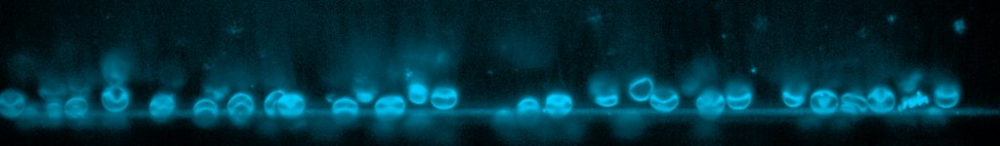

# [RBC_full_time_series.czi](https://zenodo.org/record/7117784/files/RBC_full_time_series.czi) report
 - **Autostitch** = true
 - ZeissCZIReader v6.14.0
 - ZeissQuickStartCZIReader v0.1.8-SNAPSHOT

# Images 

| Series            | Quick Start Reader | Size | Original Reader | Size | #Diffs |
|-------------------|--------------------|------|-----------------|------|--------|
| Read time (all)   |95 ms|------|198 ms|------|--------|
|0||X:2048 Y:300 C:1 Z:834 T:3||X:2048 Y:300 C:1 Z:834 T:3|0|

# Metadata

|  Method            | Parameters       | Quick Start Reader | Original Reader | Delta  |
| -------------------|------------------|--------------------|-----------------|------- |
| Initialization     |                  |24 ms|105 ms|        |
| Reader Size (Mb)     |                  |2.60|5.33|        |
| getStageLabelX| Image 0 | 0.000 um | -9037.023 um | 9037.023 um |
| getStageLabelY| Image 0 | 0.000 um | 11550.020 um | 11550.020 um |
| getPlanePositionX| Image 0 Plane 0 | 0.000 um | -9037.023 um | 9037.023 um |
| getPlanePositionY| Image 0 Plane 0 | 0.000 um | 11550.020 um | 11550.020 um |
| getPlanePositionX| Image 0 Plane 1 | 0.000 um | -9037.023 um | 9037.023 um |
| getPlanePositionY| Image 0 Plane 1 | 0.000 um | 11550.020 um | 11550.020 um |
| getPlanePositionZ| Image 0 Plane 1 | -384.727 um | -385.027 um | 0.300 um |
| getPlanePositionX| Image 0 Plane 2 | 0.000 um | -9037.023 um | 9037.023 um |
| getPlanePositionY| Image 0 Plane 2 | 0.000 um | 11550.020 um | 11550.020 um |
| getPlanePositionZ| Image 0 Plane 2 | -384.427 um | -385.027 um | 0.600 um |
| getPlanePositionX| Image 0 Plane 3 | 0.000 um | -9037.023 um | 9037.023 um |
| getPlanePositionY| Image 0 Plane 3 | 0.000 um | 11550.020 um | 11550.020 um |
| getPlanePositionZ| Image 0 Plane 3 | -384.127 um | -385.027 um | 0.900 um |
| getPlanePositionX| Image 0 Plane 4 | 0.000 um | -9037.023 um | 9037.023 um |
| getPlanePositionY| Image 0 Plane 4 | 0.000 um | 11550.020 um | 11550.020 um |
| getPlanePositionZ| Image 0 Plane 4 | -383.827 um | -385.027 um | 1.200 um |
| getPlanePositionX| Image 0 Plane 5 | 0.000 um | -9037.023 um | 9037.023 um |
| getPlanePositionY| Image 0 Plane 5 | 0.000 um | 11550.020 um | 11550.020 um |
| getPlanePositionZ| Image 0 Plane 5 | -383.527 um | -385.027 um | 1.500 um |
| getPlanePositionX| Image 0 Plane 6 | 0.000 um | -9037.023 um | 9037.023 um |
| getPlanePositionY| Image 0 Plane 6 | 0.000 um | 11550.020 um | 11550.020 um |
| getPlanePositionZ| Image 0 Plane 6 | -383.227 um | -385.027 um | 1.800 um |
| getPlanePositionX| Image 0 Plane 7 | 0.000 um | -9037.023 um | 9037.023 um |
| getPlanePositionY| Image 0 Plane 7 | 0.000 um | 11550.020 um | 11550.020 um |
| getPlanePositionZ| Image 0 Plane 7 | -382.927 um | -385.027 um | 2.100 um |
| getPlanePositionX| Image 0 Plane 8 | 0.000 um | -9037.023 um | 9037.023 um |
| getPlanePositionY| Image 0 Plane 8 | 0.000 um | 11550.020 um | 11550.020 um |
| getPlanePositionZ| Image 0 Plane 8 | -382.627 um | -385.027 um | 2.400 um |
| getPlanePositionX| Image 0 Plane 9 | 0.000 um | -9037.023 um | 9037.023 um |
| getPlanePositionY| Image 0 Plane 9 | 0.000 um | 11550.020 um | 11550.020 um |
| getPlanePositionZ| Image 0 Plane 9 | -382.327 um | -385.027 um | 2.700 um |
| getPlanePositionX| Image 0 Plane 10 | 0.000 um | -9037.023 um | 9037.023 um |
| getPlanePositionY| Image 0 Plane 10 | 0.000 um | 11550.020 um | 11550.020 um |
| getPlanePositionZ| Image 0 Plane 10 | -382.027 um | -385.027 um | 3.000 um |
| getPlanePositionX| Image 0 Plane 11 | 0.000 um | -9037.023 um | 9037.023 um |
| getPlanePositionY| Image 0 Plane 11 | 0.000 um | 11550.020 um | 11550.020 um |
| getPlanePositionZ| Image 0 Plane 11 | -381.727 um | -385.027 um | 3.300 um |
| getPlanePositionX| Image 0 Plane 12 | 0.000 um | -9037.023 um | 9037.023 um |
| getPlanePositionY| Image 0 Plane 12 | 0.000 um | 11550.020 um | 11550.020 um |
| getPlanePositionZ| Image 0 Plane 12 | -381.427 um | -385.027 um | 3.600 um |
| getPlanePositionX| Image 0 Plane 13 | 0.000 um | -9037.023 um | 9037.023 um |
| getPlanePositionY| Image 0 Plane 13 | 0.000 um | 11550.020 um | 11550.020 um |
| getPlanePositionZ| Image 0 Plane 13 | -381.127 um | -385.027 um | 3.900 um |
| getPlanePositionX| Image 0 Plane 14 | 0.000 um | -9037.023 um | 9037.023 um |
| getPlanePositionY| Image 0 Plane 14 | 0.000 um | 11550.020 um | 11550.020 um |
| getPlanePositionZ| Image 0 Plane 14 | -380.827 um | -385.027 um | 4.200 um |
| getPlanePositionX| Image 0 Plane 15 | 0.000 um | -9037.023 um | 9037.023 um |
| getPlanePositionY| Image 0 Plane 15 | 0.000 um | 11550.020 um | 11550.020 um |
| getPlanePositionZ| Image 0 Plane 15 | -380.527 um | -385.027 um | 4.500 um |
| getPlanePositionX| Image 0 Plane 16 | 0.000 um | -9037.023 um | 9037.023 um |
| getPlanePositionY| Image 0 Plane 16 | 0.000 um | 11550.020 um | 11550.020 um |
| getPlanePositionZ| Image 0 Plane 16 | -380.227 um | -385.027 um | 4.800 um |
| getPlanePositionX| Image 0 Plane 17 | 0.000 um | -9037.023 um | 9037.023 um |
| getPlanePositionY| Image 0 Plane 17 | 0.000 um | 11550.020 um | 11550.020 um |
| getPlanePositionZ| Image 0 Plane 17 | -379.927 um | -385.027 um | 5.100 um |
| getPlanePositionX| Image 0 Plane 18 | 0.000 um | -9037.023 um | 9037.023 um |
| getPlanePositionY| Image 0 Plane 18 | 0.000 um | 11550.020 um | 11550.020 um |
| getPlanePositionZ| Image 0 Plane 18 | -379.627 um | -385.027 um | 5.400 um |
| getPlanePositionX| Image 0 Plane 19 | 0.000 um | -9037.023 um | 9037.023 um |
| getPlanePositionY| Image 0 Plane 19 | 0.000 um | 11550.020 um | 11550.020 um |
| getPlanePositionZ| Image 0 Plane 19 | -379.327 um | -385.027 um | 5.700 um |
| getPlanePositionX| Image 0 Plane 20 | 0.000 um | -9037.023 um | 9037.023 um |
| getPlanePositionY| Image 0 Plane 20 | 0.000 um | 11550.020 um | 11550.020 um |
| getPlanePositionZ| Image 0 Plane 20 | -379.027 um | -385.027 um | 6.000 um |
| getPlanePositionX| Image 0 Plane 21 | 0.000 um | -9037.023 um | 9037.023 um |
| getPlanePositionY| Image 0 Plane 21 | 0.000 um | 11550.020 um | 11550.020 um |
| getPlanePositionZ| Image 0 Plane 21 | -378.727 um | -385.027 um | 6.300 um |
| getPlanePositionX| Image 0 Plane 22 | 0.000 um | -9037.023 um | 9037.023 um |
| getPlanePositionY| Image 0 Plane 22 | 0.000 um | 11550.020 um | 11550.020 um |
| getPlanePositionZ| Image 0 Plane 22 | -378.427 um | -385.027 um | 6.600 um |
| getPlanePositionX| Image 0 Plane 23 | 0.000 um | -9037.023 um | 9037.023 um |
| getPlanePositionY| Image 0 Plane 23 | 0.000 um | 11550.020 um | 11550.020 um |
| getPlanePositionZ| Image 0 Plane 23 | -378.127 um | -385.027 um | 6.900 um |
| getPlanePositionX| Image 0 Plane 24 | 0.000 um | -9037.023 um | 9037.023 um |
| getPlanePositionY| Image 0 Plane 24 | 0.000 um | 11550.020 um | 11550.020 um |
| getPlanePositionZ| Image 0 Plane 24 | -377.827 um | -385.027 um | 7.200 um |
| getPlanePositionX| Image 0 Plane 25 | 0.000 um | -9037.023 um | 9037.023 um |
| getPlanePositionY| Image 0 Plane 25 | 0.000 um | 11550.020 um | 11550.020 um |
| getPlanePositionZ| Image 0 Plane 25 | -377.527 um | -385.027 um | 7.500 um |
| getPlanePositionX| Image 0 Plane 26 | 0.000 um | -9037.023 um | 9037.023 um |
| getPlanePositionY| Image 0 Plane 26 | 0.000 um | 11550.020 um | 11550.020 um |
| getPlanePositionZ| Image 0 Plane 26 | -377.227 um | -385.027 um | 7.800 um |
| getPlanePositionX| Image 0 Plane 27 | 0.000 um | -9037.023 um | 9037.023 um |
| getPlanePositionY| Image 0 Plane 27 | 0.000 um | 11550.020 um | 11550.020 um |
| getPlanePositionZ| Image 0 Plane 27 | -376.927 um | -385.027 um | 8.100 um |
| getPlanePositionX| Image 0 Plane 28 | 0.000 um | -9037.023 um | 9037.023 um |
| getPlanePositionY| Image 0 Plane 28 | 0.000 um | 11550.020 um | 11550.020 um |
| getPlanePositionZ| Image 0 Plane 28 | -376.627 um | -385.027 um | 8.400 um |
| getPlanePositionX| Image 0 Plane 29 | 0.000 um | -9037.023 um | 9037.023 um |
| getPlanePositionY| Image 0 Plane 29 | 0.000 um | 11550.020 um | 11550.020 um |
| getPlanePositionZ| Image 0 Plane 29 | -376.327 um | -385.027 um | 8.700 um |
| getPlanePositionX| Image 0 Plane 30 | 0.000 um | -9037.023 um | 9037.023 um |
| getPlanePositionY| Image 0 Plane 30 | 0.000 um | 11550.020 um | 11550.020 um |
| getPlanePositionZ| Image 0 Plane 30 | -376.027 um | -385.027 um | 9.000 um |
| getPlanePositionX| Image 0 Plane 31 | 0.000 um | -9037.023 um | 9037.023 um |
| getPlanePositionY| Image 0 Plane 31 | 0.000 um | 11550.020 um | 11550.020 um |
| getPlanePositionZ| Image 0 Plane 31 | -375.727 um | -385.027 um | 9.300 um |
| getPlanePositionX| Image 0 Plane 32 | 0.000 um | -9037.023 um | 9037.023 um |
| getPlanePositionY| Image 0 Plane 32 | 0.000 um | 11550.020 um | 11550.020 um |
| getPlanePositionZ| Image 0 Plane 32 | -375.427 um | -385.027 um | 9.600 um |
| getPlanePositionX| Image 0 Plane 33 | 0.000 um | -9037.023 um | 9037.023 um |
| getPlanePositionY| Image 0 Plane 33 | 0.000 um | 11550.020 um | 11550.020 um |
| getPlanePositionZ| Image 0 Plane 33 | -375.127 um | -385.027 um | 9.900 um |
| getPlanePositionX| Image 0 Plane 34 | 0.000 um | -9037.023 um | 9037.023 um |
| getPlanePositionY| Image 0 Plane 34 | 0.000 um | 11550.020 um | 11550.020 um |
| getPlanePositionZ| Image 0 Plane 34 | -374.827 um | -385.027 um | 10.200 um |
| getPlanePositionX| Image 0 Plane 35 | 0.000 um | -9037.023 um | 9037.023 um |
| getPlanePositionY| Image 0 Plane 35 | 0.000 um | 11550.020 um | 11550.020 um |
| getPlanePositionZ| Image 0 Plane 35 | -374.527 um | -385.027 um | 10.500 um |
| getPlanePositionX| Image 0 Plane 36 | 0.000 um | -9037.023 um | 9037.023 um |
| getPlanePositionY| Image 0 Plane 36 | 0.000 um | 11550.020 um | 11550.020 um |
| getPlanePositionZ| Image 0 Plane 36 | -374.227 um | -385.027 um | 10.800 um |
| getPlanePositionX| Image 0 Plane 37 | 0.000 um | -9037.023 um | 9037.023 um |
| getPlanePositionY| Image 0 Plane 37 | 0.000 um | 11550.020 um | 11550.020 um |
| getPlanePositionZ| Image 0 Plane 37 | -373.927 um | -385.027 um | 11.100 um |
| getPlanePositionX| Image 0 Plane 38 | 0.000 um | -9037.023 um | 9037.023 um |
| getPlanePositionY| Image 0 Plane 38 | 0.000 um | 11550.020 um | 11550.020 um |
| getPlanePositionZ| Image 0 Plane 38 | -373.627 um | -385.027 um | 11.400 um |
| getPlanePositionX| Image 0 Plane 39 | 0.000 um | -9037.023 um | 9037.023 um |
| getPlanePositionY| Image 0 Plane 39 | 0.000 um | 11550.020 um | 11550.020 um |
| getPlanePositionZ| Image 0 Plane 39 | -373.327 um | -385.027 um | 11.700 um |
| getPlanePositionX| Image 0 Plane 40 | 0.000 um | -9037.023 um | 9037.023 um |
| getPlanePositionY| Image 0 Plane 40 | 0.000 um | 11550.020 um | 11550.020 um |
| getPlanePositionZ| Image 0 Plane 40 | -373.027 um | -385.027 um | 12.000 um |
| getPlanePositionX| Image 0 Plane 41 | 0.000 um | -9037.023 um | 9037.023 um |
| getPlanePositionY| Image 0 Plane 41 | 0.000 um | 11550.020 um | 11550.020 um |
| getPlanePositionZ| Image 0 Plane 41 | -372.727 um | -385.027 um | 12.300 um |
| getPlanePositionX| Image 0 Plane 42 | 0.000 um | -9037.023 um | 9037.023 um |
| getPlanePositionY| Image 0 Plane 42 | 0.000 um | 11550.020 um | 11550.020 um |
| getPlanePositionZ| Image 0 Plane 42 | -372.427 um | -385.027 um | 12.600 um |
| getPlanePositionX| Image 0 Plane 43 | 0.000 um | -9037.023 um | 9037.023 um |
| getPlanePositionY| Image 0 Plane 43 | 0.000 um | 11550.020 um | 11550.020 um |
| getPlanePositionZ| Image 0 Plane 43 | -372.127 um | -385.027 um | 12.900 um |
| getPlanePositionX| Image 0 Plane 44 | 0.000 um | -9037.023 um | 9037.023 um |
| getPlanePositionY| Image 0 Plane 44 | 0.000 um | 11550.020 um | 11550.020 um |
| getPlanePositionZ| Image 0 Plane 44 | -371.827 um | -385.027 um | 13.200 um |
| getPlanePositionX| Image 0 Plane 45 | 0.000 um | -9037.023 um | 9037.023 um |
| getPlanePositionY| Image 0 Plane 45 | 0.000 um | 11550.020 um | 11550.020 um |
| getPlanePositionZ| Image 0 Plane 45 | -371.527 um | -385.027 um | 13.500 um |
| getPlanePositionX| Image 0 Plane 46 | 0.000 um | -9037.023 um | 9037.023 um |
| getPlanePositionY| Image 0 Plane 46 | 0.000 um | 11550.020 um | 11550.020 um |
| getPlanePositionZ| Image 0 Plane 46 | -371.227 um | -385.027 um | 13.800 um |
| getPlanePositionX| Image 0 Plane 47 | 0.000 um | -9037.023 um | 9037.023 um |
| getPlanePositionY| Image 0 Plane 47 | 0.000 um | 11550.020 um | 11550.020 um |
| getPlanePositionZ| Image 0 Plane 47 | -370.927 um | -385.027 um | 14.100 um |
| getPlanePositionX| Image 0 Plane 48 | 0.000 um | -9037.023 um | 9037.023 um |
| getPlanePositionY| Image 0 Plane 48 | 0.000 um | 11550.020 um | 11550.020 um |
| getPlanePositionZ| Image 0 Plane 48 | -370.627 um | -385.027 um | 14.400 um |
| getPlanePositionX| Image 0 Plane 49 | 0.000 um | -9037.023 um | 9037.023 um |
| getPlanePositionY| Image 0 Plane 49 | 0.000 um | 11550.020 um | 11550.020 um |
| getPlanePositionZ| Image 0 Plane 49 | -370.327 um | -385.027 um | 14.700 um |
| getPlanePositionX| Image 0 Plane 50 | 0.000 um | -9037.023 um | 9037.023 um |
| getPlanePositionY| Image 0 Plane 50 | 0.000 um | 11550.020 um | 11550.020 um |
| getPlanePositionZ| Image 0 Plane 50 | -370.027 um | -385.027 um | 15.000 um |
| getPlanePositionX| Image 0 Plane 51 | 0.000 um | -9037.023 um | 9037.023 um |
| getPlanePositionY| Image 0 Plane 51 | 0.000 um | 11550.020 um | 11550.020 um |
| getPlanePositionZ| Image 0 Plane 51 | -369.727 um | -385.027 um | 15.300 um |
| getPlanePositionX| Image 0 Plane 52 | 0.000 um | -9037.023 um | 9037.023 um |
| getPlanePositionY| Image 0 Plane 52 | 0.000 um | 11550.020 um | 11550.020 um |
| getPlanePositionZ| Image 0 Plane 52 | -369.427 um | -385.027 um | 15.600 um |
| getPlanePositionX| Image 0 Plane 53 | 0.000 um | -9037.023 um | 9037.023 um |
| getPlanePositionY| Image 0 Plane 53 | 0.000 um | 11550.020 um | 11550.020 um |
| getPlanePositionZ| Image 0 Plane 53 | -369.127 um | -385.027 um | 15.900 um |
| getPlanePositionX| Image 0 Plane 54 | 0.000 um | -9037.023 um | 9037.023 um |
| getPlanePositionY| Image 0 Plane 54 | 0.000 um | 11550.020 um | 11550.020 um |
| getPlanePositionZ| Image 0 Plane 54 | -368.827 um | -385.027 um | 16.200 um |
| getPlanePositionX| Image 0 Plane 55 | 0.000 um | -9037.023 um | 9037.023 um |
| getPlanePositionY| Image 0 Plane 55 | 0.000 um | 11550.020 um | 11550.020 um |
| getPlanePositionZ| Image 0 Plane 55 | -368.527 um | -385.027 um | 16.500 um |
| getPlanePositionX| Image 0 Plane 56 | 0.000 um | -9037.023 um | 9037.023 um |
| getPlanePositionY| Image 0 Plane 56 | 0.000 um | 11550.020 um | 11550.020 um |
| getPlanePositionZ| Image 0 Plane 56 | -368.227 um | -385.027 um | 16.800 um |
| getPlanePositionX| Image 0 Plane 57 | 0.000 um | -9037.023 um | 9037.023 um |
| getPlanePositionY| Image 0 Plane 57 | 0.000 um | 11550.020 um | 11550.020 um |
| getPlanePositionZ| Image 0 Plane 57 | -367.927 um | -385.027 um | 17.100 um |
| getPlanePositionX| Image 0 Plane 58 | 0.000 um | -9037.023 um | 9037.023 um |
| getPlanePositionY| Image 0 Plane 58 | 0.000 um | 11550.020 um | 11550.020 um |
| getPlanePositionZ| Image 0 Plane 58 | -367.627 um | -385.027 um | 17.400 um |
| getPlanePositionX| Image 0 Plane 59 | 0.000 um | -9037.023 um | 9037.023 um |
| getPlanePositionY| Image 0 Plane 59 | 0.000 um | 11550.020 um | 11550.020 um |
| getPlanePositionZ| Image 0 Plane 59 | -367.327 um | -385.027 um | 17.700 um |
| getPlanePositionX| Image 0 Plane 60 | 0.000 um | -9037.023 um | 9037.023 um |
| getPlanePositionY| Image 0 Plane 60 | 0.000 um | 11550.020 um | 11550.020 um |
| getPlanePositionZ| Image 0 Plane 60 | -367.027 um | -385.027 um | 18.000 um |
| getPlanePositionX| Image 0 Plane 61 | 0.000 um | -9037.023 um | 9037.023 um |
| getPlanePositionY| Image 0 Plane 61 | 0.000 um | 11550.020 um | 11550.020 um |
| getPlanePositionZ| Image 0 Plane 61 | -366.727 um | -385.027 um | 18.300 um |
| getPlanePositionX| Image 0 Plane 62 | 0.000 um | -9037.023 um | 9037.023 um |
| getPlanePositionY| Image 0 Plane 62 | 0.000 um | 11550.020 um | 11550.020 um |
| getPlanePositionZ| Image 0 Plane 62 | -366.427 um | -385.027 um | 18.600 um |
| getPlanePositionX| Image 0 Plane 63 | 0.000 um | -9037.023 um | 9037.023 um |
| getPlanePositionY| Image 0 Plane 63 | 0.000 um | 11550.020 um | 11550.020 um |
| getPlanePositionZ| Image 0 Plane 63 | -366.127 um | -385.027 um | 18.900 um |
| getPlanePositionX| Image 0 Plane 64 | 0.000 um | -9037.023 um | 9037.023 um |
| getPlanePositionY| Image 0 Plane 64 | 0.000 um | 11550.020 um | 11550.020 um |
| getPlanePositionZ| Image 0 Plane 64 | -365.827 um | -385.027 um | 19.200 um |
| getPlanePositionX| Image 0 Plane 65 | 0.000 um | -9037.023 um | 9037.023 um |
| getPlanePositionY| Image 0 Plane 65 | 0.000 um | 11550.020 um | 11550.020 um |
| getPlanePositionZ| Image 0 Plane 65 | -365.527 um | -385.027 um | 19.500 um |
| getPlanePositionX| Image 0 Plane 66 | 0.000 um | -9037.023 um | 9037.023 um |
| getPlanePositionY| Image 0 Plane 66 | 0.000 um | 11550.020 um | 11550.020 um |
| getPlanePositionZ| Image 0 Plane 66 | -365.227 um | -385.027 um | 19.800 um |
| getPlanePositionX| Image 0 Plane 67 | 0.000 um | -9037.023 um | 9037.023 um |
| getPlanePositionY| Image 0 Plane 67 | 0.000 um | 11550.020 um | 11550.020 um |
| getPlanePositionZ| Image 0 Plane 67 | -364.927 um | -385.027 um | 20.100 um |
| getPlanePositionX| Image 0 Plane 68 | 0.000 um | -9037.023 um | 9037.023 um |
| getPlanePositionY| Image 0 Plane 68 | 0.000 um | 11550.020 um | 11550.020 um |
| getPlanePositionZ| Image 0 Plane 68 | -364.627 um | -385.027 um | 20.400 um |
| getPlanePositionX| Image 0 Plane 69 | 0.000 um | -9037.023 um | 9037.023 um |
| getPlanePositionY| Image 0 Plane 69 | 0.000 um | 11550.020 um | 11550.020 um |
| getPlanePositionZ| Image 0 Plane 69 | -364.327 um | -385.027 um | 20.700 um |
| getPlanePositionX| Image 0 Plane 70 | 0.000 um | -9037.023 um | 9037.023 um |
| getPlanePositionY| Image 0 Plane 70 | 0.000 um | 11550.020 um | 11550.020 um |
| getPlanePositionZ| Image 0 Plane 70 | -364.027 um | -385.027 um | 21.000 um |
| getPlanePositionX| Image 0 Plane 71 | 0.000 um | -9037.023 um | 9037.023 um |
| getPlanePositionY| Image 0 Plane 71 | 0.000 um | 11550.020 um | 11550.020 um |
| getPlanePositionZ| Image 0 Plane 71 | -363.727 um | -385.027 um | 21.300 um |
| getPlanePositionX| Image 0 Plane 72 | 0.000 um | -9037.023 um | 9037.023 um |
| getPlanePositionY| Image 0 Plane 72 | 0.000 um | 11550.020 um | 11550.020 um |
| getPlanePositionZ| Image 0 Plane 72 | -363.427 um | -385.027 um | 21.600 um |
| getPlanePositionX| Image 0 Plane 73 | 0.000 um | -9037.023 um | 9037.023 um |
| getPlanePositionY| Image 0 Plane 73 | 0.000 um | 11550.020 um | 11550.020 um |
| getPlanePositionZ| Image 0 Plane 73 | -363.127 um | -385.027 um | 21.900 um |
| getPlanePositionX| Image 0 Plane 74 | 0.000 um | -9037.023 um | 9037.023 um |
| getPlanePositionY| Image 0 Plane 74 | 0.000 um | 11550.020 um | 11550.020 um |
| getPlanePositionZ| Image 0 Plane 74 | -362.827 um | -385.027 um | 22.200 um |
| getPlanePositionX| Image 0 Plane 75 | 0.000 um | -9037.023 um | 9037.023 um |
| getPlanePositionY| Image 0 Plane 75 | 0.000 um | 11550.020 um | 11550.020 um |
| getPlanePositionZ| Image 0 Plane 75 | -362.527 um | -385.027 um | 22.500 um |
| getPlanePositionX| Image 0 Plane 76 | 0.000 um | -9037.023 um | 9037.023 um |
| getPlanePositionY| Image 0 Plane 76 | 0.000 um | 11550.020 um | 11550.020 um |
| getPlanePositionZ| Image 0 Plane 76 | -362.227 um | -385.027 um | 22.800 um |
| getPlanePositionX| Image 0 Plane 77 | 0.000 um | -9037.023 um | 9037.023 um |
| getPlanePositionY| Image 0 Plane 77 | 0.000 um | 11550.020 um | 11550.020 um |
| getPlanePositionZ| Image 0 Plane 77 | -361.927 um | -385.027 um | 23.100 um |
| getPlanePositionX| Image 0 Plane 78 | 0.000 um | -9037.023 um | 9037.023 um |
| getPlanePositionY| Image 0 Plane 78 | 0.000 um | 11550.020 um | 11550.020 um |
| getPlanePositionZ| Image 0 Plane 78 | -361.627 um | -385.027 um | 23.400 um |
| getPlanePositionX| Image 0 Plane 79 | 0.000 um | -9037.023 um | 9037.023 um |
| getPlanePositionY| Image 0 Plane 79 | 0.000 um | 11550.020 um | 11550.020 um |
| getPlanePositionZ| Image 0 Plane 79 | -361.327 um | -385.027 um | 23.700 um |
| getPlanePositionX| Image 0 Plane 80 | 0.000 um | -9037.023 um | 9037.023 um |
| getPlanePositionY| Image 0 Plane 80 | 0.000 um | 11550.020 um | 11550.020 um |
| getPlanePositionZ| Image 0 Plane 80 | -361.027 um | -385.027 um | 24.000 um |
| getPlanePositionX| Image 0 Plane 81 | 0.000 um | -9037.023 um | 9037.023 um |
| getPlanePositionY| Image 0 Plane 81 | 0.000 um | 11550.020 um | 11550.020 um |
| getPlanePositionZ| Image 0 Plane 81 | -360.727 um | -385.027 um | 24.300 um |
| getPlanePositionX| Image 0 Plane 82 | 0.000 um | -9037.023 um | 9037.023 um |
| getPlanePositionY| Image 0 Plane 82 | 0.000 um | 11550.020 um | 11550.020 um |
| getPlanePositionZ| Image 0 Plane 82 | -360.427 um | -385.027 um | 24.600 um |
| getPlanePositionX| Image 0 Plane 83 | 0.000 um | -9037.023 um | 9037.023 um |
| getPlanePositionY| Image 0 Plane 83 | 0.000 um | 11550.020 um | 11550.020 um |
| getPlanePositionZ| Image 0 Plane 83 | -360.127 um | -385.027 um | 24.900 um |
| getPlanePositionX| Image 0 Plane 84 | 0.000 um | -9037.023 um | 9037.023 um |
| getPlanePositionY| Image 0 Plane 84 | 0.000 um | 11550.020 um | 11550.020 um |
| getPlanePositionZ| Image 0 Plane 84 | -359.827 um | -385.027 um | 25.200 um |
| getPlanePositionX| Image 0 Plane 85 | 0.000 um | -9037.023 um | 9037.023 um |
| getPlanePositionY| Image 0 Plane 85 | 0.000 um | 11550.020 um | 11550.020 um |
| getPlanePositionZ| Image 0 Plane 85 | -359.527 um | -385.027 um | 25.500 um |
| getPlanePositionX| Image 0 Plane 86 | 0.000 um | -9037.023 um | 9037.023 um |
| getPlanePositionY| Image 0 Plane 86 | 0.000 um | 11550.020 um | 11550.020 um |
| getPlanePositionZ| Image 0 Plane 86 | -359.227 um | -385.027 um | 25.800 um |
| getPlanePositionX| Image 0 Plane 87 | 0.000 um | -9037.023 um | 9037.023 um |
| getPlanePositionY| Image 0 Plane 87 | 0.000 um | 11550.020 um | 11550.020 um |
| getPlanePositionZ| Image 0 Plane 87 | -358.927 um | -385.027 um | 26.100 um |
| getPlanePositionX| Image 0 Plane 88 | 0.000 um | -9037.023 um | 9037.023 um |
| getPlanePositionY| Image 0 Plane 88 | 0.000 um | 11550.020 um | 11550.020 um |
| getPlanePositionZ| Image 0 Plane 88 | -358.627 um | -385.027 um | 26.400 um |
| getPlanePositionX| Image 0 Plane 89 | 0.000 um | -9037.023 um | 9037.023 um |
| getPlanePositionY| Image 0 Plane 89 | 0.000 um | 11550.020 um | 11550.020 um |
| getPlanePositionZ| Image 0 Plane 89 | -358.327 um | -385.027 um | 26.700 um |
| getPlanePositionX| Image 0 Plane 90 | 0.000 um | -9037.023 um | 9037.023 um |
| getPlanePositionY| Image 0 Plane 90 | 0.000 um | 11550.020 um | 11550.020 um |
| getPlanePositionZ| Image 0 Plane 90 | -358.027 um | -385.027 um | 27.000 um |
| getPlanePositionX| Image 0 Plane 91 | 0.000 um | -9037.023 um | 9037.023 um |
| getPlanePositionY| Image 0 Plane 91 | 0.000 um | 11550.020 um | 11550.020 um |
| getPlanePositionZ| Image 0 Plane 91 | -357.727 um | -385.027 um | 27.300 um |
| getPlanePositionX| Image 0 Plane 92 | 0.000 um | -9037.023 um | 9037.023 um |
| getPlanePositionY| Image 0 Plane 92 | 0.000 um | 11550.020 um | 11550.020 um |
| getPlanePositionZ| Image 0 Plane 92 | -357.427 um | -385.027 um | 27.600 um |
| getPlanePositionX| Image 0 Plane 93 | 0.000 um | -9037.023 um | 9037.023 um |
| getPlanePositionY| Image 0 Plane 93 | 0.000 um | 11550.020 um | 11550.020 um |
| getPlanePositionZ| Image 0 Plane 93 | -357.127 um | -385.027 um | 27.900 um |
| getPlanePositionX| Image 0 Plane 94 | 0.000 um | -9037.023 um | 9037.023 um |
| getPlanePositionY| Image 0 Plane 94 | 0.000 um | 11550.020 um | 11550.020 um |
| getPlanePositionZ| Image 0 Plane 94 | -356.827 um | -385.027 um | 28.200 um |
| getPlanePositionX| Image 0 Plane 95 | 0.000 um | -9037.023 um | 9037.023 um |
| getPlanePositionY| Image 0 Plane 95 | 0.000 um | 11550.020 um | 11550.020 um |
| getPlanePositionZ| Image 0 Plane 95 | -356.527 um | -385.027 um | 28.500 um |
| getPlanePositionX| Image 0 Plane 96 | 0.000 um | -9037.023 um | 9037.023 um |
| getPlanePositionY| Image 0 Plane 96 | 0.000 um | 11550.020 um | 11550.020 um |
| getPlanePositionZ| Image 0 Plane 96 | -356.227 um | -385.027 um | 28.800 um |
| getPlanePositionX| Image 0 Plane 97 | 0.000 um | -9037.023 um | 9037.023 um |
| getPlanePositionY| Image 0 Plane 97 | 0.000 um | 11550.020 um | 11550.020 um |
| getPlanePositionZ| Image 0 Plane 97 | -355.927 um | -385.027 um | 29.100 um |
| getPlanePositionX| Image 0 Plane 98 | 0.000 um | -9037.023 um | 9037.023 um |
| getPlanePositionY| Image 0 Plane 98 | 0.000 um | 11550.020 um | 11550.020 um |
| getPlanePositionZ| Image 0 Plane 98 | -355.627 um | -385.027 um | 29.400 um |
| getPlanePositionX| Image 0 Plane 99 | 0.000 um | -9037.023 um | 9037.023 um |
| getPlanePositionY| Image 0 Plane 99 | 0.000 um | 11550.020 um | 11550.020 um |
| getPlanePositionZ| Image 0 Plane 99 | -355.327 um | -385.027 um | 29.700 um |
| getPlanePositionX| Image 0 Plane 100 | 0.000 um | -9037.023 um | 9037.023 um |
| getPlanePositionY| Image 0 Plane 100 | 0.000 um | 11550.020 um | 11550.020 um |
| getPlanePositionZ| Image 0 Plane 100 | -355.027 um | -385.027 um | 30.000 um |
| getPlanePositionX| Image 0 Plane 101 | 0.000 um | -9037.023 um | 9037.023 um |
| getPlanePositionY| Image 0 Plane 101 | 0.000 um | 11550.020 um | 11550.020 um |
| getPlanePositionZ| Image 0 Plane 101 | -354.727 um | -385.027 um | 30.300 um |
| getPlanePositionX| Image 0 Plane 102 | 0.000 um | -9037.023 um | 9037.023 um |
| getPlanePositionY| Image 0 Plane 102 | 0.000 um | 11550.020 um | 11550.020 um |
| getPlanePositionZ| Image 0 Plane 102 | -354.427 um | -385.027 um | 30.600 um |
| getPlanePositionX| Image 0 Plane 103 | 0.000 um | -9037.023 um | 9037.023 um |
| getPlanePositionY| Image 0 Plane 103 | 0.000 um | 11550.020 um | 11550.020 um |
| getPlanePositionZ| Image 0 Plane 103 | -354.127 um | -385.027 um | 30.900 um |
| getPlanePositionX| Image 0 Plane 104 | 0.000 um | -9037.023 um | 9037.023 um |
| getPlanePositionY| Image 0 Plane 104 | 0.000 um | 11550.020 um | 11550.020 um |
| getPlanePositionZ| Image 0 Plane 104 | -353.827 um | -385.027 um | 31.200 um |
| getPlanePositionX| Image 0 Plane 105 | 0.000 um | -9037.023 um | 9037.023 um |
| getPlanePositionY| Image 0 Plane 105 | 0.000 um | 11550.020 um | 11550.020 um |
| getPlanePositionZ| Image 0 Plane 105 | -353.527 um | -385.027 um | 31.500 um |
| getPlanePositionX| Image 0 Plane 106 | 0.000 um | -9037.023 um | 9037.023 um |
| getPlanePositionY| Image 0 Plane 106 | 0.000 um | 11550.020 um | 11550.020 um |
| getPlanePositionZ| Image 0 Plane 106 | -353.227 um | -385.027 um | 31.800 um |
| getPlanePositionX| Image 0 Plane 107 | 0.000 um | -9037.023 um | 9037.023 um |
| getPlanePositionY| Image 0 Plane 107 | 0.000 um | 11550.020 um | 11550.020 um |
| getPlanePositionZ| Image 0 Plane 107 | -352.927 um | -385.027 um | 32.100 um |
| getPlanePositionX| Image 0 Plane 108 | 0.000 um | -9037.023 um | 9037.023 um |
| getPlanePositionY| Image 0 Plane 108 | 0.000 um | 11550.020 um | 11550.020 um |
| getPlanePositionZ| Image 0 Plane 108 | -352.627 um | -385.027 um | 32.400 um |
| getPlanePositionX| Image 0 Plane 109 | 0.000 um | -9037.023 um | 9037.023 um |
| getPlanePositionY| Image 0 Plane 109 | 0.000 um | 11550.020 um | 11550.020 um |
| getPlanePositionZ| Image 0 Plane 109 | -352.327 um | -385.027 um | 32.700 um |
| getPlanePositionX| Image 0 Plane 110 | 0.000 um | -9037.023 um | 9037.023 um |
| getPlanePositionY| Image 0 Plane 110 | 0.000 um | 11550.020 um | 11550.020 um |
| getPlanePositionZ| Image 0 Plane 110 | -352.027 um | -385.027 um | 33.000 um |
| getPlanePositionX| Image 0 Plane 111 | 0.000 um | -9037.023 um | 9037.023 um |
| getPlanePositionY| Image 0 Plane 111 | 0.000 um | 11550.020 um | 11550.020 um |
| getPlanePositionZ| Image 0 Plane 111 | -351.727 um | -385.027 um | 33.300 um |
| getPlanePositionX| Image 0 Plane 112 | 0.000 um | -9037.023 um | 9037.023 um |
| getPlanePositionY| Image 0 Plane 112 | 0.000 um | 11550.020 um | 11550.020 um |
| getPlanePositionZ| Image 0 Plane 112 | -351.427 um | -385.027 um | 33.600 um |
| getPlanePositionX| Image 0 Plane 113 | 0.000 um | -9037.023 um | 9037.023 um |
| getPlanePositionY| Image 0 Plane 113 | 0.000 um | 11550.020 um | 11550.020 um |
| getPlanePositionZ| Image 0 Plane 113 | -351.127 um | -385.027 um | 33.900 um |
| getPlanePositionX| Image 0 Plane 114 | 0.000 um | -9037.023 um | 9037.023 um |
| getPlanePositionY| Image 0 Plane 114 | 0.000 um | 11550.020 um | 11550.020 um |
| getPlanePositionZ| Image 0 Plane 114 | -350.827 um | -385.027 um | 34.200 um |
| getPlanePositionX| Image 0 Plane 115 | 0.000 um | -9037.023 um | 9037.023 um |
| getPlanePositionY| Image 0 Plane 115 | 0.000 um | 11550.020 um | 11550.020 um |
| getPlanePositionZ| Image 0 Plane 115 | -350.527 um | -385.027 um | 34.500 um |
| getPlanePositionX| Image 0 Plane 116 | 0.000 um | -9037.023 um | 9037.023 um |
| getPlanePositionY| Image 0 Plane 116 | 0.000 um | 11550.020 um | 11550.020 um |
| getPlanePositionZ| Image 0 Plane 116 | -350.227 um | -385.027 um | 34.800 um |
| getPlanePositionX| Image 0 Plane 117 | 0.000 um | -9037.023 um | 9037.023 um |
| getPlanePositionY| Image 0 Plane 117 | 0.000 um | 11550.020 um | 11550.020 um |
| getPlanePositionZ| Image 0 Plane 117 | -349.927 um | -385.027 um | 35.100 um |
| getPlanePositionX| Image 0 Plane 118 | 0.000 um | -9037.023 um | 9037.023 um |
| getPlanePositionY| Image 0 Plane 118 | 0.000 um | 11550.020 um | 11550.020 um |
| getPlanePositionZ| Image 0 Plane 118 | -349.627 um | -385.027 um | 35.400 um |
| getPlanePositionX| Image 0 Plane 119 | 0.000 um | -9037.023 um | 9037.023 um |
| getPlanePositionY| Image 0 Plane 119 | 0.000 um | 11550.020 um | 11550.020 um |
| getPlanePositionZ| Image 0 Plane 119 | -349.327 um | -385.027 um | 35.700 um |
| getPlanePositionX| Image 0 Plane 120 | 0.000 um | -9037.023 um | 9037.023 um |
| getPlanePositionY| Image 0 Plane 120 | 0.000 um | 11550.020 um | 11550.020 um |
| getPlanePositionZ| Image 0 Plane 120 | -349.027 um | -385.027 um | 36.000 um |
| getPlanePositionX| Image 0 Plane 121 | 0.000 um | -9037.023 um | 9037.023 um |
| getPlanePositionY| Image 0 Plane 121 | 0.000 um | 11550.020 um | 11550.020 um |
| getPlanePositionZ| Image 0 Plane 121 | -348.727 um | -385.027 um | 36.300 um |
| getPlanePositionX| Image 0 Plane 122 | 0.000 um | -9037.023 um | 9037.023 um |
| getPlanePositionY| Image 0 Plane 122 | 0.000 um | 11550.020 um | 11550.020 um |
| getPlanePositionZ| Image 0 Plane 122 | -348.427 um | -385.027 um | 36.600 um |
| getPlanePositionX| Image 0 Plane 123 | 0.000 um | -9037.023 um | 9037.023 um |
| getPlanePositionY| Image 0 Plane 123 | 0.000 um | 11550.020 um | 11550.020 um |
| getPlanePositionZ| Image 0 Plane 123 | -348.127 um | -385.027 um | 36.900 um |
| getPlanePositionX| Image 0 Plane 124 | 0.000 um | -9037.023 um | 9037.023 um |
| getPlanePositionY| Image 0 Plane 124 | 0.000 um | 11550.020 um | 11550.020 um |
| getPlanePositionZ| Image 0 Plane 124 | -347.827 um | -385.027 um | 37.200 um |
| getPlanePositionX| Image 0 Plane 125 | 0.000 um | -9037.023 um | 9037.023 um |
| getPlanePositionY| Image 0 Plane 125 | 0.000 um | 11550.020 um | 11550.020 um |
| getPlanePositionZ| Image 0 Plane 125 | -347.527 um | -385.027 um | 37.500 um |
| getPlanePositionX| Image 0 Plane 126 | 0.000 um | -9037.023 um | 9037.023 um |
| getPlanePositionY| Image 0 Plane 126 | 0.000 um | 11550.020 um | 11550.020 um |
| getPlanePositionZ| Image 0 Plane 126 | -347.227 um | -385.027 um | 37.800 um |
| getPlanePositionX| Image 0 Plane 127 | 0.000 um | -9037.023 um | 9037.023 um |
| getPlanePositionY| Image 0 Plane 127 | 0.000 um | 11550.020 um | 11550.020 um |
| getPlanePositionZ| Image 0 Plane 127 | -346.927 um | -385.027 um | 38.100 um |
| getPlanePositionX| Image 0 Plane 128 | 0.000 um | -9037.023 um | 9037.023 um |
| getPlanePositionY| Image 0 Plane 128 | 0.000 um | 11550.020 um | 11550.020 um |
| getPlanePositionZ| Image 0 Plane 128 | -346.627 um | -385.027 um | 38.400 um |
| getPlanePositionX| Image 0 Plane 129 | 0.000 um | -9037.023 um | 9037.023 um |
| getPlanePositionY| Image 0 Plane 129 | 0.000 um | 11550.020 um | 11550.020 um |
| getPlanePositionZ| Image 0 Plane 129 | -346.327 um | -385.027 um | 38.700 um |
| getPlanePositionX| Image 0 Plane 130 | 0.000 um | -9037.023 um | 9037.023 um |
| getPlanePositionY| Image 0 Plane 130 | 0.000 um | 11550.020 um | 11550.020 um |
| getPlanePositionZ| Image 0 Plane 130 | -346.027 um | -385.027 um | 39.000 um |
| getPlanePositionX| Image 0 Plane 131 | 0.000 um | -9037.023 um | 9037.023 um |
| getPlanePositionY| Image 0 Plane 131 | 0.000 um | 11550.020 um | 11550.020 um |
| getPlanePositionZ| Image 0 Plane 131 | -345.727 um | -385.027 um | 39.300 um |
| getPlanePositionX| Image 0 Plane 132 | 0.000 um | -9037.023 um | 9037.023 um |
| getPlanePositionY| Image 0 Plane 132 | 0.000 um | 11550.020 um | 11550.020 um |
| getPlanePositionZ| Image 0 Plane 132 | -345.427 um | -385.027 um | 39.600 um |
| getPlanePositionX| Image 0 Plane 133 | 0.000 um | -9037.023 um | 9037.023 um |
| getPlanePositionY| Image 0 Plane 133 | 0.000 um | 11550.020 um | 11550.020 um |
| getPlanePositionZ| Image 0 Plane 133 | -345.127 um | -385.027 um | 39.900 um |
| getPlanePositionX| Image 0 Plane 134 | 0.000 um | -9037.023 um | 9037.023 um |
| getPlanePositionY| Image 0 Plane 134 | 0.000 um | 11550.020 um | 11550.020 um |
| getPlanePositionZ| Image 0 Plane 134 | -344.827 um | -385.027 um | 40.200 um |
| getPlanePositionX| Image 0 Plane 135 | 0.000 um | -9037.023 um | 9037.023 um |
| getPlanePositionY| Image 0 Plane 135 | 0.000 um | 11550.020 um | 11550.020 um |
| getPlanePositionZ| Image 0 Plane 135 | -344.527 um | -385.027 um | 40.500 um |
| getPlanePositionX| Image 0 Plane 136 | 0.000 um | -9037.023 um | 9037.023 um |
| getPlanePositionY| Image 0 Plane 136 | 0.000 um | 11550.020 um | 11550.020 um |
| getPlanePositionZ| Image 0 Plane 136 | -344.227 um | -385.027 um | 40.800 um |
| getPlanePositionX| Image 0 Plane 137 | 0.000 um | -9037.023 um | 9037.023 um |
| getPlanePositionY| Image 0 Plane 137 | 0.000 um | 11550.020 um | 11550.020 um |
| getPlanePositionZ| Image 0 Plane 137 | -343.927 um | -385.027 um | 41.100 um |
| getPlanePositionX| Image 0 Plane 138 | 0.000 um | -9037.023 um | 9037.023 um |
| getPlanePositionY| Image 0 Plane 138 | 0.000 um | 11550.020 um | 11550.020 um |
| getPlanePositionZ| Image 0 Plane 138 | -343.627 um | -385.027 um | 41.400 um |
| getPlanePositionX| Image 0 Plane 139 | 0.000 um | -9037.023 um | 9037.023 um |
| getPlanePositionY| Image 0 Plane 139 | 0.000 um | 11550.020 um | 11550.020 um |
| getPlanePositionZ| Image 0 Plane 139 | -343.327 um | -385.027 um | 41.700 um |
| getPlanePositionX| Image 0 Plane 140 | 0.000 um | -9037.023 um | 9037.023 um |
| getPlanePositionY| Image 0 Plane 140 | 0.000 um | 11550.020 um | 11550.020 um |
| getPlanePositionZ| Image 0 Plane 140 | -343.027 um | -385.027 um | 42.000 um |
| getPlanePositionX| Image 0 Plane 141 | 0.000 um | -9037.023 um | 9037.023 um |
| getPlanePositionY| Image 0 Plane 141 | 0.000 um | 11550.020 um | 11550.020 um |
| getPlanePositionZ| Image 0 Plane 141 | -342.727 um | -385.027 um | 42.300 um |
| getPlanePositionX| Image 0 Plane 142 | 0.000 um | -9037.023 um | 9037.023 um |
| getPlanePositionY| Image 0 Plane 142 | 0.000 um | 11550.020 um | 11550.020 um |
| getPlanePositionZ| Image 0 Plane 142 | -342.427 um | -385.027 um | 42.600 um |
| getPlanePositionX| Image 0 Plane 143 | 0.000 um | -9037.023 um | 9037.023 um |
| getPlanePositionY| Image 0 Plane 143 | 0.000 um | 11550.020 um | 11550.020 um |
| getPlanePositionZ| Image 0 Plane 143 | -342.127 um | -385.027 um | 42.900 um |
| getPlanePositionX| Image 0 Plane 144 | 0.000 um | -9037.023 um | 9037.023 um |
| getPlanePositionY| Image 0 Plane 144 | 0.000 um | 11550.020 um | 11550.020 um |
| getPlanePositionZ| Image 0 Plane 144 | -341.827 um | -385.027 um | 43.200 um |
| getPlanePositionX| Image 0 Plane 145 | 0.000 um | -9037.023 um | 9037.023 um |
| getPlanePositionY| Image 0 Plane 145 | 0.000 um | 11550.020 um | 11550.020 um |
| getPlanePositionZ| Image 0 Plane 145 | -341.527 um | -385.027 um | 43.500 um |
| getPlanePositionX| Image 0 Plane 146 | 0.000 um | -9037.023 um | 9037.023 um |
| getPlanePositionY| Image 0 Plane 146 | 0.000 um | 11550.020 um | 11550.020 um |
| getPlanePositionZ| Image 0 Plane 146 | -341.227 um | -385.027 um | 43.800 um |
| getPlanePositionX| Image 0 Plane 147 | 0.000 um | -9037.023 um | 9037.023 um |
| getPlanePositionY| Image 0 Plane 147 | 0.000 um | 11550.020 um | 11550.020 um |
| getPlanePositionZ| Image 0 Plane 147 | -340.927 um | -385.027 um | 44.100 um |
| getPlanePositionX| Image 0 Plane 148 | 0.000 um | -9037.023 um | 9037.023 um |
| getPlanePositionY| Image 0 Plane 148 | 0.000 um | 11550.020 um | 11550.020 um |
| getPlanePositionZ| Image 0 Plane 148 | -340.627 um | -385.027 um | 44.400 um |
| getPlanePositionX| Image 0 Plane 149 | 0.000 um | -9037.023 um | 9037.023 um |
| getPlanePositionY| Image 0 Plane 149 | 0.000 um | 11550.020 um | 11550.020 um |
| getPlanePositionZ| Image 0 Plane 149 | -340.327 um | -385.027 um | 44.700 um |
| getPlanePositionX| Image 0 Plane 150 | 0.000 um | -9037.023 um | 9037.023 um |
| getPlanePositionY| Image 0 Plane 150 | 0.000 um | 11550.020 um | 11550.020 um |
| getPlanePositionZ| Image 0 Plane 150 | -340.027 um | -385.027 um | 45.000 um |
| getPlanePositionX| Image 0 Plane 151 | 0.000 um | -9037.023 um | 9037.023 um |
| getPlanePositionY| Image 0 Plane 151 | 0.000 um | 11550.020 um | 11550.020 um |
| getPlanePositionZ| Image 0 Plane 151 | -339.727 um | -385.027 um | 45.300 um |
| getPlanePositionX| Image 0 Plane 152 | 0.000 um | -9037.023 um | 9037.023 um |
| getPlanePositionY| Image 0 Plane 152 | 0.000 um | 11550.020 um | 11550.020 um |
| getPlanePositionZ| Image 0 Plane 152 | -339.427 um | -385.027 um | 45.600 um |
| getPlanePositionX| Image 0 Plane 153 | 0.000 um | -9037.023 um | 9037.023 um |
| getPlanePositionY| Image 0 Plane 153 | 0.000 um | 11550.020 um | 11550.020 um |
| getPlanePositionZ| Image 0 Plane 153 | -339.127 um | -385.027 um | 45.900 um |
| getPlanePositionX| Image 0 Plane 154 | 0.000 um | -9037.023 um | 9037.023 um |
| getPlanePositionY| Image 0 Plane 154 | 0.000 um | 11550.020 um | 11550.020 um |
| getPlanePositionZ| Image 0 Plane 154 | -338.827 um | -385.027 um | 46.200 um |
| getPlanePositionX| Image 0 Plane 155 | 0.000 um | -9037.023 um | 9037.023 um |
| getPlanePositionY| Image 0 Plane 155 | 0.000 um | 11550.020 um | 11550.020 um |
| getPlanePositionZ| Image 0 Plane 155 | -338.527 um | -385.027 um | 46.500 um |
| getPlanePositionX| Image 0 Plane 156 | 0.000 um | -9037.023 um | 9037.023 um |
| getPlanePositionY| Image 0 Plane 156 | 0.000 um | 11550.020 um | 11550.020 um |
| getPlanePositionZ| Image 0 Plane 156 | -338.227 um | -385.027 um | 46.800 um |
| getPlanePositionX| Image 0 Plane 157 | 0.000 um | -9037.023 um | 9037.023 um |
| getPlanePositionY| Image 0 Plane 157 | 0.000 um | 11550.020 um | 11550.020 um |
| getPlanePositionZ| Image 0 Plane 157 | -337.927 um | -385.027 um | 47.100 um |
| getPlanePositionX| Image 0 Plane 158 | 0.000 um | -9037.023 um | 9037.023 um |
| getPlanePositionY| Image 0 Plane 158 | 0.000 um | 11550.020 um | 11550.020 um |
| getPlanePositionZ| Image 0 Plane 158 | -337.627 um | -385.027 um | 47.400 um |
| getPlanePositionX| Image 0 Plane 159 | 0.000 um | -9037.023 um | 9037.023 um |
| getPlanePositionY| Image 0 Plane 159 | 0.000 um | 11550.020 um | 11550.020 um |
| getPlanePositionZ| Image 0 Plane 159 | -337.327 um | -385.027 um | 47.700 um |
| getPlanePositionX| Image 0 Plane 160 | 0.000 um | -9037.023 um | 9037.023 um |
| getPlanePositionY| Image 0 Plane 160 | 0.000 um | 11550.020 um | 11550.020 um |
| getPlanePositionZ| Image 0 Plane 160 | -337.027 um | -385.027 um | 48.000 um |
| getPlanePositionX| Image 0 Plane 161 | 0.000 um | -9037.023 um | 9037.023 um |
| getPlanePositionY| Image 0 Plane 161 | 0.000 um | 11550.020 um | 11550.020 um |
| getPlanePositionZ| Image 0 Plane 161 | -336.727 um | -385.027 um | 48.300 um |
| getPlanePositionX| Image 0 Plane 162 | 0.000 um | -9037.023 um | 9037.023 um |
| getPlanePositionY| Image 0 Plane 162 | 0.000 um | 11550.020 um | 11550.020 um |
| getPlanePositionZ| Image 0 Plane 162 | -336.427 um | -385.027 um | 48.600 um |
| getPlanePositionX| Image 0 Plane 163 | 0.000 um | -9037.023 um | 9037.023 um |
| getPlanePositionY| Image 0 Plane 163 | 0.000 um | 11550.020 um | 11550.020 um |
| getPlanePositionZ| Image 0 Plane 163 | -336.127 um | -385.027 um | 48.900 um |
| getPlanePositionX| Image 0 Plane 164 | 0.000 um | -9037.023 um | 9037.023 um |
| getPlanePositionY| Image 0 Plane 164 | 0.000 um | 11550.020 um | 11550.020 um |

 More than 500 differences.
