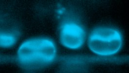

# [RBC_tiny.czi](https://zenodo.org/record/7117784/files/RBC_tiny.czi) report
 - **Autostitch** = true
 - ZeissCZIReader v6.14.0
 - ZeissQuickStartCZIReader v0.1.8-SNAPSHOT

# Images 

| Series            | Quick Start Reader | Size | Original Reader | Size | #Diffs |
|-------------------|--------------------|------|-----------------|------|--------|
| Read time (all)   |45 ms|------|77 ms|------|--------|
|0||X:209 Y:118 C:1 Z:834 T:1||X:209 Y:118 C:1 Z:834 T:1|0|

# Metadata

|  Method            | Parameters       | Quick Start Reader | Original Reader | Delta  |
| -------------------|------------------|--------------------|-----------------|------- |
| Initialization     |                  |13 ms|40 ms|        |
| Reader Size (Mb)     |                  |1.79|2.99|        |
| getPlanePositionZ| Image 0 Plane 1 | -384.727 um | -385.027 um | 0.300 um |
| getPlanePositionZ| Image 0 Plane 2 | -384.427 um | -385.027 um | 0.600 um |
| getPlanePositionZ| Image 0 Plane 3 | -384.127 um | -385.027 um | 0.900 um |
| getPlanePositionZ| Image 0 Plane 4 | -383.827 um | -385.027 um | 1.200 um |
| getPlanePositionZ| Image 0 Plane 5 | -383.527 um | -385.027 um | 1.500 um |
| getPlanePositionZ| Image 0 Plane 6 | -383.227 um | -385.027 um | 1.800 um |
| getPlanePositionZ| Image 0 Plane 7 | -382.927 um | -385.027 um | 2.100 um |
| getPlanePositionZ| Image 0 Plane 8 | -382.627 um | -385.027 um | 2.400 um |
| getPlanePositionZ| Image 0 Plane 9 | -382.327 um | -385.027 um | 2.700 um |
| getPlanePositionZ| Image 0 Plane 10 | -382.027 um | -385.027 um | 3.000 um |
| getPlanePositionZ| Image 0 Plane 11 | -381.727 um | -385.027 um | 3.300 um |
| getPlanePositionZ| Image 0 Plane 12 | -381.427 um | -385.027 um | 3.600 um |
| getPlanePositionZ| Image 0 Plane 13 | -381.127 um | -385.027 um | 3.900 um |
| getPlanePositionZ| Image 0 Plane 14 | -380.827 um | -385.027 um | 4.200 um |
| getPlanePositionZ| Image 0 Plane 15 | -380.527 um | -385.027 um | 4.500 um |
| getPlanePositionZ| Image 0 Plane 16 | -380.227 um | -385.027 um | 4.800 um |
| getPlanePositionZ| Image 0 Plane 17 | -379.927 um | -385.027 um | 5.100 um |
| getPlanePositionZ| Image 0 Plane 18 | -379.627 um | -385.027 um | 5.400 um |
| getPlanePositionZ| Image 0 Plane 19 | -379.327 um | -385.027 um | 5.700 um |
| getPlanePositionZ| Image 0 Plane 20 | -379.027 um | -385.027 um | 6.000 um |
| getPlanePositionZ| Image 0 Plane 21 | -378.727 um | -385.027 um | 6.300 um |
| getPlanePositionZ| Image 0 Plane 22 | -378.427 um | -385.027 um | 6.600 um |
| getPlanePositionZ| Image 0 Plane 23 | -378.127 um | -385.027 um | 6.900 um |
| getPlanePositionZ| Image 0 Plane 24 | -377.827 um | -385.027 um | 7.200 um |
| getPlanePositionZ| Image 0 Plane 25 | -377.527 um | -385.027 um | 7.500 um |
| getPlanePositionZ| Image 0 Plane 26 | -377.227 um | -385.027 um | 7.800 um |
| getPlanePositionZ| Image 0 Plane 27 | -376.927 um | -385.027 um | 8.100 um |
| getPlanePositionZ| Image 0 Plane 28 | -376.627 um | -385.027 um | 8.400 um |
| getPlanePositionZ| Image 0 Plane 29 | -376.327 um | -385.027 um | 8.700 um |
| getPlanePositionZ| Image 0 Plane 30 | -376.027 um | -385.027 um | 9.000 um |
| getPlanePositionZ| Image 0 Plane 31 | -375.727 um | -385.027 um | 9.300 um |
| getPlanePositionZ| Image 0 Plane 32 | -375.427 um | -385.027 um | 9.600 um |
| getPlanePositionZ| Image 0 Plane 33 | -375.127 um | -385.027 um | 9.900 um |
| getPlanePositionZ| Image 0 Plane 34 | -374.827 um | -385.027 um | 10.200 um |
| getPlanePositionZ| Image 0 Plane 35 | -374.527 um | -385.027 um | 10.500 um |
| getPlanePositionZ| Image 0 Plane 36 | -374.227 um | -385.027 um | 10.800 um |
| getPlanePositionZ| Image 0 Plane 37 | -373.927 um | -385.027 um | 11.100 um |
| getPlanePositionZ| Image 0 Plane 38 | -373.627 um | -385.027 um | 11.400 um |
| getPlanePositionZ| Image 0 Plane 39 | -373.327 um | -385.027 um | 11.700 um |
| getPlanePositionZ| Image 0 Plane 40 | -373.027 um | -385.027 um | 12.000 um |
| getPlanePositionZ| Image 0 Plane 41 | -372.727 um | -385.027 um | 12.300 um |
| getPlanePositionZ| Image 0 Plane 42 | -372.427 um | -385.027 um | 12.600 um |
| getPlanePositionZ| Image 0 Plane 43 | -372.127 um | -385.027 um | 12.900 um |
| getPlanePositionZ| Image 0 Plane 44 | -371.827 um | -385.027 um | 13.200 um |
| getPlanePositionZ| Image 0 Plane 45 | -371.527 um | -385.027 um | 13.500 um |
| getPlanePositionZ| Image 0 Plane 46 | -371.227 um | -385.027 um | 13.800 um |
| getPlanePositionZ| Image 0 Plane 47 | -370.927 um | -385.027 um | 14.100 um |
| getPlanePositionZ| Image 0 Plane 48 | -370.627 um | -385.027 um | 14.400 um |
| getPlanePositionZ| Image 0 Plane 49 | -370.327 um | -385.027 um | 14.700 um |
| getPlanePositionZ| Image 0 Plane 50 | -370.027 um | -385.027 um | 15.000 um |
| getPlanePositionZ| Image 0 Plane 51 | -369.727 um | -385.027 um | 15.300 um |
| getPlanePositionZ| Image 0 Plane 52 | -369.427 um | -385.027 um | 15.600 um |
| getPlanePositionZ| Image 0 Plane 53 | -369.127 um | -385.027 um | 15.900 um |
| getPlanePositionZ| Image 0 Plane 54 | -368.827 um | -385.027 um | 16.200 um |
| getPlanePositionZ| Image 0 Plane 55 | -368.527 um | -385.027 um | 16.500 um |
| getPlanePositionZ| Image 0 Plane 56 | -368.227 um | -385.027 um | 16.800 um |
| getPlanePositionZ| Image 0 Plane 57 | -367.927 um | -385.027 um | 17.100 um |
| getPlanePositionZ| Image 0 Plane 58 | -367.627 um | -385.027 um | 17.400 um |
| getPlanePositionZ| Image 0 Plane 59 | -367.327 um | -385.027 um | 17.700 um |
| getPlanePositionZ| Image 0 Plane 60 | -367.027 um | -385.027 um | 18.000 um |
| getPlanePositionZ| Image 0 Plane 61 | -366.727 um | -385.027 um | 18.300 um |
| getPlanePositionZ| Image 0 Plane 62 | -366.427 um | -385.027 um | 18.600 um |
| getPlanePositionZ| Image 0 Plane 63 | -366.127 um | -385.027 um | 18.900 um |
| getPlanePositionZ| Image 0 Plane 64 | -365.827 um | -385.027 um | 19.200 um |
| getPlanePositionZ| Image 0 Plane 65 | -365.527 um | -385.027 um | 19.500 um |
| getPlanePositionZ| Image 0 Plane 66 | -365.227 um | -385.027 um | 19.800 um |
| getPlanePositionZ| Image 0 Plane 67 | -364.927 um | -385.027 um | 20.100 um |
| getPlanePositionZ| Image 0 Plane 68 | -364.627 um | -385.027 um | 20.400 um |
| getPlanePositionZ| Image 0 Plane 69 | -364.327 um | -385.027 um | 20.700 um |
| getPlanePositionZ| Image 0 Plane 70 | -364.027 um | -385.027 um | 21.000 um |
| getPlanePositionZ| Image 0 Plane 71 | -363.727 um | -385.027 um | 21.300 um |
| getPlanePositionZ| Image 0 Plane 72 | -363.427 um | -385.027 um | 21.600 um |
| getPlanePositionZ| Image 0 Plane 73 | -363.127 um | -385.027 um | 21.900 um |
| getPlanePositionZ| Image 0 Plane 74 | -362.827 um | -385.027 um | 22.200 um |
| getPlanePositionZ| Image 0 Plane 75 | -362.527 um | -385.027 um | 22.500 um |
| getPlanePositionZ| Image 0 Plane 76 | -362.227 um | -385.027 um | 22.800 um |
| getPlanePositionZ| Image 0 Plane 77 | -361.927 um | -385.027 um | 23.100 um |
| getPlanePositionZ| Image 0 Plane 78 | -361.627 um | -385.027 um | 23.400 um |
| getPlanePositionZ| Image 0 Plane 79 | -361.327 um | -385.027 um | 23.700 um |
| getPlanePositionZ| Image 0 Plane 80 | -361.027 um | -385.027 um | 24.000 um |
| getPlanePositionZ| Image 0 Plane 81 | -360.727 um | -385.027 um | 24.300 um |
| getPlanePositionZ| Image 0 Plane 82 | -360.427 um | -385.027 um | 24.600 um |
| getPlanePositionZ| Image 0 Plane 83 | -360.127 um | -385.027 um | 24.900 um |
| getPlanePositionZ| Image 0 Plane 84 | -359.827 um | -385.027 um | 25.200 um |
| getPlanePositionZ| Image 0 Plane 85 | -359.527 um | -385.027 um | 25.500 um |
| getPlanePositionZ| Image 0 Plane 86 | -359.227 um | -385.027 um | 25.800 um |
| getPlanePositionZ| Image 0 Plane 87 | -358.927 um | -385.027 um | 26.100 um |
| getPlanePositionZ| Image 0 Plane 88 | -358.627 um | -385.027 um | 26.400 um |
| getPlanePositionZ| Image 0 Plane 89 | -358.327 um | -385.027 um | 26.700 um |
| getPlanePositionZ| Image 0 Plane 90 | -358.027 um | -385.027 um | 27.000 um |
| getPlanePositionZ| Image 0 Plane 91 | -357.727 um | -385.027 um | 27.300 um |
| getPlanePositionZ| Image 0 Plane 92 | -357.427 um | -385.027 um | 27.600 um |
| getPlanePositionZ| Image 0 Plane 93 | -357.127 um | -385.027 um | 27.900 um |
| getPlanePositionZ| Image 0 Plane 94 | -356.827 um | -385.027 um | 28.200 um |
| getPlanePositionZ| Image 0 Plane 95 | -356.527 um | -385.027 um | 28.500 um |
| getPlanePositionZ| Image 0 Plane 96 | -356.227 um | -385.027 um | 28.800 um |
| getPlanePositionZ| Image 0 Plane 97 | -355.927 um | -385.027 um | 29.100 um |
| getPlanePositionZ| Image 0 Plane 98 | -355.627 um | -385.027 um | 29.400 um |
| getPlanePositionZ| Image 0 Plane 99 | -355.327 um | -385.027 um | 29.700 um |
| getPlanePositionZ| Image 0 Plane 100 | -355.027 um | -385.027 um | 30.000 um |
| getPlanePositionZ| Image 0 Plane 101 | -354.727 um | -385.027 um | 30.300 um |
| getPlanePositionZ| Image 0 Plane 102 | -354.427 um | -385.027 um | 30.600 um |
| getPlanePositionZ| Image 0 Plane 103 | -354.127 um | -385.027 um | 30.900 um |
| getPlanePositionZ| Image 0 Plane 104 | -353.827 um | -385.027 um | 31.200 um |
| getPlanePositionZ| Image 0 Plane 105 | -353.527 um | -385.027 um | 31.500 um |
| getPlanePositionZ| Image 0 Plane 106 | -353.227 um | -385.027 um | 31.800 um |
| getPlanePositionZ| Image 0 Plane 107 | -352.927 um | -385.027 um | 32.100 um |
| getPlanePositionZ| Image 0 Plane 108 | -352.627 um | -385.027 um | 32.400 um |
| getPlanePositionZ| Image 0 Plane 109 | -352.327 um | -385.027 um | 32.700 um |
| getPlanePositionZ| Image 0 Plane 110 | -352.027 um | -385.027 um | 33.000 um |
| getPlanePositionZ| Image 0 Plane 111 | -351.727 um | -385.027 um | 33.300 um |
| getPlanePositionZ| Image 0 Plane 112 | -351.427 um | -385.027 um | 33.600 um |
| getPlanePositionZ| Image 0 Plane 113 | -351.127 um | -385.027 um | 33.900 um |
| getPlanePositionZ| Image 0 Plane 114 | -350.827 um | -385.027 um | 34.200 um |
| getPlanePositionZ| Image 0 Plane 115 | -350.527 um | -385.027 um | 34.500 um |
| getPlanePositionZ| Image 0 Plane 116 | -350.227 um | -385.027 um | 34.800 um |
| getPlanePositionZ| Image 0 Plane 117 | -349.927 um | -385.027 um | 35.100 um |
| getPlanePositionZ| Image 0 Plane 118 | -349.627 um | -385.027 um | 35.400 um |
| getPlanePositionZ| Image 0 Plane 119 | -349.327 um | -385.027 um | 35.700 um |
| getPlanePositionZ| Image 0 Plane 120 | -349.027 um | -385.027 um | 36.000 um |
| getPlanePositionZ| Image 0 Plane 121 | -348.727 um | -385.027 um | 36.300 um |
| getPlanePositionZ| Image 0 Plane 122 | -348.427 um | -385.027 um | 36.600 um |
| getPlanePositionZ| Image 0 Plane 123 | -348.127 um | -385.027 um | 36.900 um |
| getPlanePositionZ| Image 0 Plane 124 | -347.827 um | -385.027 um | 37.200 um |
| getPlanePositionZ| Image 0 Plane 125 | -347.527 um | -385.027 um | 37.500 um |
| getPlanePositionZ| Image 0 Plane 126 | -347.227 um | -385.027 um | 37.800 um |
| getPlanePositionZ| Image 0 Plane 127 | -346.927 um | -385.027 um | 38.100 um |
| getPlanePositionZ| Image 0 Plane 128 | -346.627 um | -385.027 um | 38.400 um |
| getPlanePositionZ| Image 0 Plane 129 | -346.327 um | -385.027 um | 38.700 um |
| getPlanePositionZ| Image 0 Plane 130 | -346.027 um | -385.027 um | 39.000 um |
| getPlanePositionZ| Image 0 Plane 131 | -345.727 um | -385.027 um | 39.300 um |
| getPlanePositionZ| Image 0 Plane 132 | -345.427 um | -385.027 um | 39.600 um |
| getPlanePositionZ| Image 0 Plane 133 | -345.127 um | -385.027 um | 39.900 um |
| getPlanePositionZ| Image 0 Plane 134 | -344.827 um | -385.027 um | 40.200 um |
| getPlanePositionZ| Image 0 Plane 135 | -344.527 um | -385.027 um | 40.500 um |
| getPlanePositionZ| Image 0 Plane 136 | -344.227 um | -385.027 um | 40.800 um |
| getPlanePositionZ| Image 0 Plane 137 | -343.927 um | -385.027 um | 41.100 um |
| getPlanePositionZ| Image 0 Plane 138 | -343.627 um | -385.027 um | 41.400 um |
| getPlanePositionZ| Image 0 Plane 139 | -343.327 um | -385.027 um | 41.700 um |
| getPlanePositionZ| Image 0 Plane 140 | -343.027 um | -385.027 um | 42.000 um |
| getPlanePositionZ| Image 0 Plane 141 | -342.727 um | -385.027 um | 42.300 um |
| getPlanePositionZ| Image 0 Plane 142 | -342.427 um | -385.027 um | 42.600 um |
| getPlanePositionZ| Image 0 Plane 143 | -342.127 um | -385.027 um | 42.900 um |
| getPlanePositionZ| Image 0 Plane 144 | -341.827 um | -385.027 um | 43.200 um |
| getPlanePositionZ| Image 0 Plane 145 | -341.527 um | -385.027 um | 43.500 um |
| getPlanePositionZ| Image 0 Plane 146 | -341.227 um | -385.027 um | 43.800 um |
| getPlanePositionZ| Image 0 Plane 147 | -340.927 um | -385.027 um | 44.100 um |
| getPlanePositionZ| Image 0 Plane 148 | -340.627 um | -385.027 um | 44.400 um |
| getPlanePositionZ| Image 0 Plane 149 | -340.327 um | -385.027 um | 44.700 um |
| getPlanePositionZ| Image 0 Plane 150 | -340.027 um | -385.027 um | 45.000 um |
| getPlanePositionZ| Image 0 Plane 151 | -339.727 um | -385.027 um | 45.300 um |
| getPlanePositionZ| Image 0 Plane 152 | -339.427 um | -385.027 um | 45.600 um |
| getPlanePositionZ| Image 0 Plane 153 | -339.127 um | -385.027 um | 45.900 um |
| getPlanePositionZ| Image 0 Plane 154 | -338.827 um | -385.027 um | 46.200 um |
| getPlanePositionZ| Image 0 Plane 155 | -338.527 um | -385.027 um | 46.500 um |
| getPlanePositionZ| Image 0 Plane 156 | -338.227 um | -385.027 um | 46.800 um |
| getPlanePositionZ| Image 0 Plane 157 | -337.927 um | -385.027 um | 47.100 um |
| getPlanePositionZ| Image 0 Plane 158 | -337.627 um | -385.027 um | 47.400 um |
| getPlanePositionZ| Image 0 Plane 159 | -337.327 um | -385.027 um | 47.700 um |
| getPlanePositionZ| Image 0 Plane 160 | -337.027 um | -385.027 um | 48.000 um |
| getPlanePositionZ| Image 0 Plane 161 | -336.727 um | -385.027 um | 48.300 um |
| getPlanePositionZ| Image 0 Plane 162 | -336.427 um | -385.027 um | 48.600 um |
| getPlanePositionZ| Image 0 Plane 163 | -336.127 um | -385.027 um | 48.900 um |
| getPlanePositionZ| Image 0 Plane 164 | -335.827 um | -385.027 um | 49.200 um |
| getPlanePositionZ| Image 0 Plane 165 | -335.527 um | -385.027 um | 49.500 um |
| getPlanePositionZ| Image 0 Plane 166 | -335.227 um | -385.027 um | 49.800 um |
| getPlanePositionZ| Image 0 Plane 167 | -334.927 um | -385.027 um | 50.100 um |
| getPlanePositionZ| Image 0 Plane 168 | -334.627 um | -385.027 um | 50.400 um |
| getPlanePositionZ| Image 0 Plane 169 | -334.327 um | -385.027 um | 50.700 um |
| getPlanePositionZ| Image 0 Plane 170 | -334.027 um | -385.027 um | 51.000 um |
| getPlanePositionZ| Image 0 Plane 171 | -333.727 um | -385.027 um | 51.300 um |
| getPlanePositionZ| Image 0 Plane 172 | -333.427 um | -385.027 um | 51.600 um |
| getPlanePositionZ| Image 0 Plane 173 | -333.127 um | -385.027 um | 51.900 um |
| getPlanePositionZ| Image 0 Plane 174 | -332.827 um | -385.027 um | 52.200 um |
| getPlanePositionZ| Image 0 Plane 175 | -332.527 um | -385.027 um | 52.500 um |
| getPlanePositionZ| Image 0 Plane 176 | -332.227 um | -385.027 um | 52.800 um |
| getPlanePositionZ| Image 0 Plane 177 | -331.927 um | -385.027 um | 53.100 um |
| getPlanePositionZ| Image 0 Plane 178 | -331.627 um | -385.027 um | 53.400 um |
| getPlanePositionZ| Image 0 Plane 179 | -331.327 um | -385.027 um | 53.700 um |
| getPlanePositionZ| Image 0 Plane 180 | -331.027 um | -385.027 um | 54.000 um |
| getPlanePositionZ| Image 0 Plane 181 | -330.727 um | -385.027 um | 54.300 um |
| getPlanePositionZ| Image 0 Plane 182 | -330.427 um | -385.027 um | 54.600 um |
| getPlanePositionZ| Image 0 Plane 183 | -330.127 um | -385.027 um | 54.900 um |
| getPlanePositionZ| Image 0 Plane 184 | -329.827 um | -385.027 um | 55.200 um |
| getPlanePositionZ| Image 0 Plane 185 | -329.527 um | -385.027 um | 55.500 um |
| getPlanePositionZ| Image 0 Plane 186 | -329.227 um | -385.027 um | 55.800 um |
| getPlanePositionZ| Image 0 Plane 187 | -328.927 um | -385.027 um | 56.100 um |
| getPlanePositionZ| Image 0 Plane 188 | -328.627 um | -385.027 um | 56.400 um |
| getPlanePositionZ| Image 0 Plane 189 | -328.327 um | -385.027 um | 56.700 um |
| getPlanePositionZ| Image 0 Plane 190 | -328.027 um | -385.027 um | 57.000 um |
| getPlanePositionZ| Image 0 Plane 191 | -327.727 um | -385.027 um | 57.300 um |
| getPlanePositionZ| Image 0 Plane 192 | -327.427 um | -385.027 um | 57.600 um |
| getPlanePositionZ| Image 0 Plane 193 | -327.127 um | -385.027 um | 57.900 um |
| getPlanePositionZ| Image 0 Plane 194 | -326.827 um | -385.027 um | 58.200 um |
| getPlanePositionZ| Image 0 Plane 195 | -326.527 um | -385.027 um | 58.500 um |
| getPlanePositionZ| Image 0 Plane 196 | -326.227 um | -385.027 um | 58.800 um |
| getPlanePositionZ| Image 0 Plane 197 | -325.927 um | -385.027 um | 59.100 um |
| getPlanePositionZ| Image 0 Plane 198 | -325.627 um | -385.027 um | 59.400 um |
| getPlanePositionZ| Image 0 Plane 199 | -325.327 um | -385.027 um | 59.700 um |
| getPlanePositionZ| Image 0 Plane 200 | -325.027 um | -385.027 um | 60.000 um |
| getPlanePositionZ| Image 0 Plane 201 | -324.727 um | -385.027 um | 60.300 um |
| getPlanePositionZ| Image 0 Plane 202 | -324.427 um | -385.027 um | 60.600 um |
| getPlanePositionZ| Image 0 Plane 203 | -324.127 um | -385.027 um | 60.900 um |
| getPlanePositionZ| Image 0 Plane 204 | -323.827 um | -385.027 um | 61.200 um |
| getPlanePositionZ| Image 0 Plane 205 | -323.527 um | -385.027 um | 61.500 um |
| getPlanePositionZ| Image 0 Plane 206 | -323.227 um | -385.027 um | 61.800 um |
| getPlanePositionZ| Image 0 Plane 207 | -322.927 um | -385.027 um | 62.100 um |
| getPlanePositionZ| Image 0 Plane 208 | -322.627 um | -385.027 um | 62.400 um |
| getPlanePositionZ| Image 0 Plane 209 | -322.327 um | -385.027 um | 62.700 um |
| getPlanePositionZ| Image 0 Plane 210 | -322.027 um | -385.027 um | 63.000 um |
| getPlanePositionZ| Image 0 Plane 211 | -321.727 um | -385.027 um | 63.300 um |
| getPlanePositionZ| Image 0 Plane 212 | -321.427 um | -385.027 um | 63.600 um |
| getPlanePositionZ| Image 0 Plane 213 | -321.127 um | -385.027 um | 63.900 um |
| getPlanePositionZ| Image 0 Plane 214 | -320.827 um | -385.027 um | 64.200 um |
| getPlanePositionZ| Image 0 Plane 215 | -320.527 um | -385.027 um | 64.500 um |
| getPlanePositionZ| Image 0 Plane 216 | -320.227 um | -385.027 um | 64.800 um |
| getPlanePositionZ| Image 0 Plane 217 | -319.927 um | -385.027 um | 65.100 um |
| getPlanePositionZ| Image 0 Plane 218 | -319.627 um | -385.027 um | 65.400 um |
| getPlanePositionZ| Image 0 Plane 219 | -319.327 um | -385.027 um | 65.700 um |
| getPlanePositionZ| Image 0 Plane 220 | -319.027 um | -385.027 um | 66.000 um |
| getPlanePositionZ| Image 0 Plane 221 | -318.727 um | -385.027 um | 66.300 um |
| getPlanePositionZ| Image 0 Plane 222 | -318.427 um | -385.027 um | 66.600 um |
| getPlanePositionZ| Image 0 Plane 223 | -318.127 um | -385.027 um | 66.900 um |
| getPlanePositionZ| Image 0 Plane 224 | -317.827 um | -385.027 um | 67.200 um |
| getPlanePositionZ| Image 0 Plane 225 | -317.527 um | -385.027 um | 67.500 um |
| getPlanePositionZ| Image 0 Plane 226 | -317.227 um | -385.027 um | 67.800 um |
| getPlanePositionZ| Image 0 Plane 227 | -316.927 um | -385.027 um | 68.100 um |
| getPlanePositionZ| Image 0 Plane 228 | -316.627 um | -385.027 um | 68.400 um |
| getPlanePositionZ| Image 0 Plane 229 | -316.327 um | -385.027 um | 68.700 um |
| getPlanePositionZ| Image 0 Plane 230 | -316.027 um | -385.027 um | 69.000 um |
| getPlanePositionZ| Image 0 Plane 231 | -315.727 um | -385.027 um | 69.300 um |
| getPlanePositionZ| Image 0 Plane 232 | -315.427 um | -385.027 um | 69.600 um |
| getPlanePositionZ| Image 0 Plane 233 | -315.127 um | -385.027 um | 69.900 um |
| getPlanePositionZ| Image 0 Plane 234 | -314.827 um | -385.027 um | 70.200 um |
| getPlanePositionZ| Image 0 Plane 235 | -314.527 um | -385.027 um | 70.500 um |
| getPlanePositionZ| Image 0 Plane 236 | -314.227 um | -385.027 um | 70.800 um |
| getPlanePositionZ| Image 0 Plane 237 | -313.927 um | -385.027 um | 71.100 um |
| getPlanePositionZ| Image 0 Plane 238 | -313.627 um | -385.027 um | 71.400 um |
| getPlanePositionZ| Image 0 Plane 239 | -313.327 um | -385.027 um | 71.700 um |
| getPlanePositionZ| Image 0 Plane 240 | -313.027 um | -385.027 um | 72.000 um |
| getPlanePositionZ| Image 0 Plane 241 | -312.727 um | -385.027 um | 72.300 um |
| getPlanePositionZ| Image 0 Plane 242 | -312.427 um | -385.027 um | 72.600 um |
| getPlanePositionZ| Image 0 Plane 243 | -312.127 um | -385.027 um | 72.900 um |
| getPlanePositionZ| Image 0 Plane 244 | -311.827 um | -385.027 um | 73.200 um |
| getPlanePositionZ| Image 0 Plane 245 | -311.527 um | -385.027 um | 73.500 um |
| getPlanePositionZ| Image 0 Plane 246 | -311.227 um | -385.027 um | 73.800 um |
| getPlanePositionZ| Image 0 Plane 247 | -310.927 um | -385.027 um | 74.100 um |
| getPlanePositionZ| Image 0 Plane 248 | -310.627 um | -385.027 um | 74.400 um |
| getPlanePositionZ| Image 0 Plane 249 | -310.327 um | -385.027 um | 74.700 um |
| getPlanePositionZ| Image 0 Plane 250 | -310.027 um | -385.027 um | 75.000 um |
| getPlanePositionZ| Image 0 Plane 251 | -309.727 um | -385.027 um | 75.300 um |
| getPlanePositionZ| Image 0 Plane 252 | -309.427 um | -385.027 um | 75.600 um |
| getPlanePositionZ| Image 0 Plane 253 | -309.127 um | -385.027 um | 75.900 um |
| getPlanePositionZ| Image 0 Plane 254 | -308.827 um | -385.027 um | 76.200 um |
| getPlanePositionZ| Image 0 Plane 255 | -308.527 um | -385.027 um | 76.500 um |
| getPlanePositionZ| Image 0 Plane 256 | -308.227 um | -385.027 um | 76.800 um |
| getPlanePositionZ| Image 0 Plane 257 | -307.927 um | -385.027 um | 77.100 um |
| getPlanePositionZ| Image 0 Plane 258 | -307.627 um | -385.027 um | 77.400 um |
| getPlanePositionZ| Image 0 Plane 259 | -307.327 um | -385.027 um | 77.700 um |
| getPlanePositionZ| Image 0 Plane 260 | -307.027 um | -385.027 um | 78.000 um |
| getPlanePositionZ| Image 0 Plane 261 | -306.727 um | -385.027 um | 78.300 um |
| getPlanePositionZ| Image 0 Plane 262 | -306.427 um | -385.027 um | 78.600 um |
| getPlanePositionZ| Image 0 Plane 263 | -306.127 um | -385.027 um | 78.900 um |
| getPlanePositionZ| Image 0 Plane 264 | -305.827 um | -385.027 um | 79.200 um |
| getPlanePositionZ| Image 0 Plane 265 | -305.527 um | -385.027 um | 79.500 um |
| getPlanePositionZ| Image 0 Plane 266 | -305.227 um | -385.027 um | 79.800 um |
| getPlanePositionZ| Image 0 Plane 267 | -304.927 um | -385.027 um | 80.100 um |
| getPlanePositionZ| Image 0 Plane 268 | -304.627 um | -385.027 um | 80.400 um |
| getPlanePositionZ| Image 0 Plane 269 | -304.327 um | -385.027 um | 80.700 um |
| getPlanePositionZ| Image 0 Plane 270 | -304.027 um | -385.027 um | 81.000 um |
| getPlanePositionZ| Image 0 Plane 271 | -303.727 um | -385.027 um | 81.300 um |
| getPlanePositionZ| Image 0 Plane 272 | -303.427 um | -385.027 um | 81.600 um |
| getPlanePositionZ| Image 0 Plane 273 | -303.127 um | -385.027 um | 81.900 um |
| getPlanePositionZ| Image 0 Plane 274 | -302.827 um | -385.027 um | 82.200 um |
| getPlanePositionZ| Image 0 Plane 275 | -302.527 um | -385.027 um | 82.500 um |
| getPlanePositionZ| Image 0 Plane 276 | -302.227 um | -385.027 um | 82.800 um |
| getPlanePositionZ| Image 0 Plane 277 | -301.927 um | -385.027 um | 83.100 um |
| getPlanePositionZ| Image 0 Plane 278 | -301.627 um | -385.027 um | 83.400 um |
| getPlanePositionZ| Image 0 Plane 279 | -301.327 um | -385.027 um | 83.700 um |
| getPlanePositionZ| Image 0 Plane 280 | -301.027 um | -385.027 um | 84.000 um |
| getPlanePositionZ| Image 0 Plane 281 | -300.727 um | -385.027 um | 84.300 um |
| getPlanePositionZ| Image 0 Plane 282 | -300.427 um | -385.027 um | 84.600 um |
| getPlanePositionZ| Image 0 Plane 283 | -300.127 um | -385.027 um | 84.900 um |
| getPlanePositionZ| Image 0 Plane 284 | -299.827 um | -385.027 um | 85.200 um |
| getPlanePositionZ| Image 0 Plane 285 | -299.527 um | -385.027 um | 85.500 um |
| getPlanePositionZ| Image 0 Plane 286 | -299.227 um | -385.027 um | 85.800 um |
| getPlanePositionZ| Image 0 Plane 287 | -298.927 um | -385.027 um | 86.100 um |
| getPlanePositionZ| Image 0 Plane 288 | -298.627 um | -385.027 um | 86.400 um |
| getPlanePositionZ| Image 0 Plane 289 | -298.327 um | -385.027 um | 86.700 um |
| getPlanePositionZ| Image 0 Plane 290 | -298.027 um | -385.027 um | 87.000 um |
| getPlanePositionZ| Image 0 Plane 291 | -297.727 um | -385.027 um | 87.300 um |
| getPlanePositionZ| Image 0 Plane 292 | -297.427 um | -385.027 um | 87.600 um |
| getPlanePositionZ| Image 0 Plane 293 | -297.127 um | -385.027 um | 87.900 um |
| getPlanePositionZ| Image 0 Plane 294 | -296.827 um | -385.027 um | 88.200 um |
| getPlanePositionZ| Image 0 Plane 295 | -296.527 um | -385.027 um | 88.500 um |
| getPlanePositionZ| Image 0 Plane 296 | -296.227 um | -385.027 um | 88.800 um |
| getPlanePositionZ| Image 0 Plane 297 | -295.927 um | -385.027 um | 89.100 um |
| getPlanePositionZ| Image 0 Plane 298 | -295.627 um | -385.027 um | 89.400 um |
| getPlanePositionZ| Image 0 Plane 299 | -295.327 um | -385.027 um | 89.700 um |
| getPlanePositionZ| Image 0 Plane 300 | -295.027 um | -385.027 um | 90.000 um |
| getPlanePositionZ| Image 0 Plane 301 | -294.727 um | -385.027 um | 90.300 um |
| getPlanePositionZ| Image 0 Plane 302 | -294.427 um | -385.027 um | 90.600 um |
| getPlanePositionZ| Image 0 Plane 303 | -294.127 um | -385.027 um | 90.900 um |
| getPlanePositionZ| Image 0 Plane 304 | -293.827 um | -385.027 um | 91.200 um |
| getPlanePositionZ| Image 0 Plane 305 | -293.527 um | -385.027 um | 91.500 um |
| getPlanePositionZ| Image 0 Plane 306 | -293.227 um | -385.027 um | 91.800 um |
| getPlanePositionZ| Image 0 Plane 307 | -292.927 um | -385.027 um | 92.100 um |
| getPlanePositionZ| Image 0 Plane 308 | -292.627 um | -385.027 um | 92.400 um |
| getPlanePositionZ| Image 0 Plane 309 | -292.327 um | -385.027 um | 92.700 um |
| getPlanePositionZ| Image 0 Plane 310 | -292.027 um | -385.027 um | 93.000 um |
| getPlanePositionZ| Image 0 Plane 311 | -291.727 um | -385.027 um | 93.300 um |
| getPlanePositionZ| Image 0 Plane 312 | -291.427 um | -385.027 um | 93.600 um |
| getPlanePositionZ| Image 0 Plane 313 | -291.127 um | -385.027 um | 93.900 um |
| getPlanePositionZ| Image 0 Plane 314 | -290.827 um | -385.027 um | 94.200 um |
| getPlanePositionZ| Image 0 Plane 315 | -290.527 um | -385.027 um | 94.500 um |
| getPlanePositionZ| Image 0 Plane 316 | -290.227 um | -385.027 um | 94.800 um |
| getPlanePositionZ| Image 0 Plane 317 | -289.927 um | -385.027 um | 95.100 um |
| getPlanePositionZ| Image 0 Plane 318 | -289.627 um | -385.027 um | 95.400 um |
| getPlanePositionZ| Image 0 Plane 319 | -289.327 um | -385.027 um | 95.700 um |
| getPlanePositionZ| Image 0 Plane 320 | -289.027 um | -385.027 um | 96.000 um |
| getPlanePositionZ| Image 0 Plane 321 | -288.727 um | -385.027 um | 96.300 um |
| getPlanePositionZ| Image 0 Plane 322 | -288.427 um | -385.027 um | 96.600 um |
| getPlanePositionZ| Image 0 Plane 323 | -288.127 um | -385.027 um | 96.900 um |
| getPlanePositionZ| Image 0 Plane 324 | -287.827 um | -385.027 um | 97.200 um |
| getPlanePositionZ| Image 0 Plane 325 | -287.527 um | -385.027 um | 97.500 um |
| getPlanePositionZ| Image 0 Plane 326 | -287.227 um | -385.027 um | 97.800 um |
| getPlanePositionZ| Image 0 Plane 327 | -286.927 um | -385.027 um | 98.100 um |
| getPlanePositionZ| Image 0 Plane 328 | -286.627 um | -385.027 um | 98.400 um |
| getPlanePositionZ| Image 0 Plane 329 | -286.327 um | -385.027 um | 98.700 um |
| getPlanePositionZ| Image 0 Plane 330 | -286.027 um | -385.027 um | 99.000 um |
| getPlanePositionZ| Image 0 Plane 331 | -285.727 um | -385.027 um | 99.300 um |
| getPlanePositionZ| Image 0 Plane 332 | -285.427 um | -385.027 um | 99.600 um |
| getPlanePositionZ| Image 0 Plane 333 | -285.127 um | -385.027 um | 99.900 um |
| getPlanePositionZ| Image 0 Plane 334 | -284.827 um | -385.027 um | 100.200 um |
| getPlanePositionZ| Image 0 Plane 335 | -284.527 um | -385.027 um | 100.500 um |
| getPlanePositionZ| Image 0 Plane 336 | -284.227 um | -385.027 um | 100.800 um |
| getPlanePositionZ| Image 0 Plane 337 | -283.927 um | -385.027 um | 101.100 um |
| getPlanePositionZ| Image 0 Plane 338 | -283.627 um | -385.027 um | 101.400 um |
| getPlanePositionZ| Image 0 Plane 339 | -283.327 um | -385.027 um | 101.700 um |
| getPlanePositionZ| Image 0 Plane 340 | -283.027 um | -385.027 um | 102.000 um |
| getPlanePositionZ| Image 0 Plane 341 | -282.727 um | -385.027 um | 102.300 um |
| getPlanePositionZ| Image 0 Plane 342 | -282.427 um | -385.027 um | 102.600 um |
| getPlanePositionZ| Image 0 Plane 343 | -282.127 um | -385.027 um | 102.900 um |
| getPlanePositionZ| Image 0 Plane 344 | -281.827 um | -385.027 um | 103.200 um |
| getPlanePositionZ| Image 0 Plane 345 | -281.527 um | -385.027 um | 103.500 um |
| getPlanePositionZ| Image 0 Plane 346 | -281.227 um | -385.027 um | 103.800 um |
| getPlanePositionZ| Image 0 Plane 347 | -280.927 um | -385.027 um | 104.100 um |
| getPlanePositionZ| Image 0 Plane 348 | -280.627 um | -385.027 um | 104.400 um |
| getPlanePositionZ| Image 0 Plane 349 | -280.327 um | -385.027 um | 104.700 um |
| getPlanePositionZ| Image 0 Plane 350 | -280.027 um | -385.027 um | 105.000 um |
| getPlanePositionZ| Image 0 Plane 351 | -279.727 um | -385.027 um | 105.300 um |
| getPlanePositionZ| Image 0 Plane 352 | -279.427 um | -385.027 um | 105.600 um |
| getPlanePositionZ| Image 0 Plane 353 | -279.127 um | -385.027 um | 105.900 um |
| getPlanePositionZ| Image 0 Plane 354 | -278.827 um | -385.027 um | 106.200 um |
| getPlanePositionZ| Image 0 Plane 355 | -278.527 um | -385.027 um | 106.500 um |
| getPlanePositionZ| Image 0 Plane 356 | -278.227 um | -385.027 um | 106.800 um |
| getPlanePositionZ| Image 0 Plane 357 | -277.927 um | -385.027 um | 107.100 um |
| getPlanePositionZ| Image 0 Plane 358 | -277.627 um | -385.027 um | 107.400 um |
| getPlanePositionZ| Image 0 Plane 359 | -277.327 um | -385.027 um | 107.700 um |
| getPlanePositionZ| Image 0 Plane 360 | -277.027 um | -385.027 um | 108.000 um |
| getPlanePositionZ| Image 0 Plane 361 | -276.727 um | -385.027 um | 108.300 um |
| getPlanePositionZ| Image 0 Plane 362 | -276.427 um | -385.027 um | 108.600 um |
| getPlanePositionZ| Image 0 Plane 363 | -276.127 um | -385.027 um | 108.900 um |
| getPlanePositionZ| Image 0 Plane 364 | -275.827 um | -385.027 um | 109.200 um |
| getPlanePositionZ| Image 0 Plane 365 | -275.527 um | -385.027 um | 109.500 um |
| getPlanePositionZ| Image 0 Plane 366 | -275.227 um | -385.027 um | 109.800 um |
| getPlanePositionZ| Image 0 Plane 367 | -274.927 um | -385.027 um | 110.100 um |
| getPlanePositionZ| Image 0 Plane 368 | -274.627 um | -385.027 um | 110.400 um |
| getPlanePositionZ| Image 0 Plane 369 | -274.327 um | -385.027 um | 110.700 um |
| getPlanePositionZ| Image 0 Plane 370 | -274.027 um | -385.027 um | 111.000 um |
| getPlanePositionZ| Image 0 Plane 371 | -273.727 um | -385.027 um | 111.300 um |
| getPlanePositionZ| Image 0 Plane 372 | -273.427 um | -385.027 um | 111.600 um |
| getPlanePositionZ| Image 0 Plane 373 | -273.127 um | -385.027 um | 111.900 um |
| getPlanePositionZ| Image 0 Plane 374 | -272.827 um | -385.027 um | 112.200 um |
| getPlanePositionZ| Image 0 Plane 375 | -272.527 um | -385.027 um | 112.500 um |
| getPlanePositionZ| Image 0 Plane 376 | -272.227 um | -385.027 um | 112.800 um |
| getPlanePositionZ| Image 0 Plane 377 | -271.927 um | -385.027 um | 113.100 um |
| getPlanePositionZ| Image 0 Plane 378 | -271.627 um | -385.027 um | 113.400 um |
| getPlanePositionZ| Image 0 Plane 379 | -271.327 um | -385.027 um | 113.700 um |
| getPlanePositionZ| Image 0 Plane 380 | -271.027 um | -385.027 um | 114.000 um |
| getPlanePositionZ| Image 0 Plane 381 | -270.727 um | -385.027 um | 114.300 um |
| getPlanePositionZ| Image 0 Plane 382 | -270.427 um | -385.027 um | 114.600 um |
| getPlanePositionZ| Image 0 Plane 383 | -270.127 um | -385.027 um | 114.900 um |
| getPlanePositionZ| Image 0 Plane 384 | -269.827 um | -385.027 um | 115.200 um |
| getPlanePositionZ| Image 0 Plane 385 | -269.527 um | -385.027 um | 115.500 um |
| getPlanePositionZ| Image 0 Plane 386 | -269.227 um | -385.027 um | 115.800 um |
| getPlanePositionZ| Image 0 Plane 387 | -268.927 um | -385.027 um | 116.100 um |
| getPlanePositionZ| Image 0 Plane 388 | -268.627 um | -385.027 um | 116.400 um |
| getPlanePositionZ| Image 0 Plane 389 | -268.327 um | -385.027 um | 116.700 um |
| getPlanePositionZ| Image 0 Plane 390 | -268.027 um | -385.027 um | 117.000 um |
| getPlanePositionZ| Image 0 Plane 391 | -267.727 um | -385.027 um | 117.300 um |
| getPlanePositionZ| Image 0 Plane 392 | -267.427 um | -385.027 um | 117.600 um |
| getPlanePositionZ| Image 0 Plane 393 | -267.127 um | -385.027 um | 117.900 um |
| getPlanePositionZ| Image 0 Plane 394 | -266.827 um | -385.027 um | 118.200 um |
| getPlanePositionZ| Image 0 Plane 395 | -266.527 um | -385.027 um | 118.500 um |
| getPlanePositionZ| Image 0 Plane 396 | -266.227 um | -385.027 um | 118.800 um |
| getPlanePositionZ| Image 0 Plane 397 | -265.927 um | -385.027 um | 119.100 um |
| getPlanePositionZ| Image 0 Plane 398 | -265.627 um | -385.027 um | 119.400 um |
| getPlanePositionZ| Image 0 Plane 399 | -265.327 um | -385.027 um | 119.700 um |
| getPlanePositionZ| Image 0 Plane 400 | -265.027 um | -385.027 um | 120.000 um |
| getPlanePositionZ| Image 0 Plane 401 | -264.727 um | -385.027 um | 120.300 um |
| getPlanePositionZ| Image 0 Plane 402 | -264.427 um | -385.027 um | 120.600 um |
| getPlanePositionZ| Image 0 Plane 403 | -264.127 um | -385.027 um | 120.900 um |
| getPlanePositionZ| Image 0 Plane 404 | -263.827 um | -385.027 um | 121.200 um |
| getPlanePositionZ| Image 0 Plane 405 | -263.527 um | -385.027 um | 121.500 um |
| getPlanePositionZ| Image 0 Plane 406 | -263.227 um | -385.027 um | 121.800 um |
| getPlanePositionZ| Image 0 Plane 407 | -262.927 um | -385.027 um | 122.100 um |
| getPlanePositionZ| Image 0 Plane 408 | -262.627 um | -385.027 um | 122.400 um |
| getPlanePositionZ| Image 0 Plane 409 | -262.327 um | -385.027 um | 122.700 um |
| getPlanePositionZ| Image 0 Plane 410 | -262.027 um | -385.027 um | 123.000 um |
| getPlanePositionZ| Image 0 Plane 411 | -261.727 um | -385.027 um | 123.300 um |
| getPlanePositionZ| Image 0 Plane 412 | -261.427 um | -385.027 um | 123.600 um |
| getPlanePositionZ| Image 0 Plane 413 | -261.127 um | -385.027 um | 123.900 um |
| getPlanePositionZ| Image 0 Plane 414 | -260.827 um | -385.027 um | 124.200 um |
| getPlanePositionZ| Image 0 Plane 415 | -260.527 um | -385.027 um | 124.500 um |
| getPlanePositionZ| Image 0 Plane 416 | -260.227 um | -385.027 um | 124.800 um |
| getPlanePositionZ| Image 0 Plane 417 | -259.927 um | -385.027 um | 125.100 um |
| getPlanePositionZ| Image 0 Plane 418 | -259.627 um | -385.027 um | 125.400 um |
| getPlanePositionZ| Image 0 Plane 419 | -259.327 um | -385.027 um | 125.700 um |
| getPlanePositionZ| Image 0 Plane 420 | -259.027 um | -385.027 um | 126.000 um |
| getPlanePositionZ| Image 0 Plane 421 | -258.727 um | -385.027 um | 126.300 um |
| getPlanePositionZ| Image 0 Plane 422 | -258.427 um | -385.027 um | 126.600 um |
| getPlanePositionZ| Image 0 Plane 423 | -258.127 um | -385.027 um | 126.900 um |
| getPlanePositionZ| Image 0 Plane 424 | -257.827 um | -385.027 um | 127.200 um |
| getPlanePositionZ| Image 0 Plane 425 | -257.527 um | -385.027 um | 127.500 um |
| getPlanePositionZ| Image 0 Plane 426 | -257.227 um | -385.027 um | 127.800 um |
| getPlanePositionZ| Image 0 Plane 427 | -256.927 um | -385.027 um | 128.100 um |
| getPlanePositionZ| Image 0 Plane 428 | -256.627 um | -385.027 um | 128.400 um |
| getPlanePositionZ| Image 0 Plane 429 | -256.327 um | -385.027 um | 128.700 um |
| getPlanePositionZ| Image 0 Plane 430 | -256.027 um | -385.027 um | 129.000 um |
| getPlanePositionZ| Image 0 Plane 431 | -255.727 um | -385.027 um | 129.300 um |
| getPlanePositionZ| Image 0 Plane 432 | -255.427 um | -385.027 um | 129.600 um |
| getPlanePositionZ| Image 0 Plane 433 | -255.127 um | -385.027 um | 129.900 um |
| getPlanePositionZ| Image 0 Plane 434 | -254.827 um | -385.027 um | 130.200 um |
| getPlanePositionZ| Image 0 Plane 435 | -254.527 um | -385.027 um | 130.500 um |
| getPlanePositionZ| Image 0 Plane 436 | -254.227 um | -385.027 um | 130.800 um |
| getPlanePositionZ| Image 0 Plane 437 | -253.927 um | -385.027 um | 131.100 um |
| getPlanePositionZ| Image 0 Plane 438 | -253.627 um | -385.027 um | 131.400 um |
| getPlanePositionZ| Image 0 Plane 439 | -253.327 um | -385.027 um | 131.700 um |
| getPlanePositionZ| Image 0 Plane 440 | -253.027 um | -385.027 um | 132.000 um |
| getPlanePositionZ| Image 0 Plane 441 | -252.727 um | -385.027 um | 132.300 um |
| getPlanePositionZ| Image 0 Plane 442 | -252.427 um | -385.027 um | 132.600 um |
| getPlanePositionZ| Image 0 Plane 443 | -252.127 um | -385.027 um | 132.900 um |
| getPlanePositionZ| Image 0 Plane 444 | -251.827 um | -385.027 um | 133.200 um |
| getPlanePositionZ| Image 0 Plane 445 | -251.527 um | -385.027 um | 133.500 um |
| getPlanePositionZ| Image 0 Plane 446 | -251.227 um | -385.027 um | 133.800 um |
| getPlanePositionZ| Image 0 Plane 447 | -250.927 um | -385.027 um | 134.100 um |
| getPlanePositionZ| Image 0 Plane 448 | -250.627 um | -385.027 um | 134.400 um |
| getPlanePositionZ| Image 0 Plane 449 | -250.327 um | -385.027 um | 134.700 um |
| getPlanePositionZ| Image 0 Plane 450 | -250.027 um | -385.027 um | 135.000 um |
| getPlanePositionZ| Image 0 Plane 451 | -249.727 um | -385.027 um | 135.300 um |
| getPlanePositionZ| Image 0 Plane 452 | -249.427 um | -385.027 um | 135.600 um |
| getPlanePositionZ| Image 0 Plane 453 | -249.127 um | -385.027 um | 135.900 um |
| getPlanePositionZ| Image 0 Plane 454 | -248.827 um | -385.027 um | 136.200 um |
| getPlanePositionZ| Image 0 Plane 455 | -248.527 um | -385.027 um | 136.500 um |
| getPlanePositionZ| Image 0 Plane 456 | -248.227 um | -385.027 um | 136.800 um |
| getPlanePositionZ| Image 0 Plane 457 | -247.927 um | -385.027 um | 137.100 um |
| getPlanePositionZ| Image 0 Plane 458 | -247.627 um | -385.027 um | 137.400 um |
| getPlanePositionZ| Image 0 Plane 459 | -247.327 um | -385.027 um | 137.700 um |
| getPlanePositionZ| Image 0 Plane 460 | -247.027 um | -385.027 um | 138.000 um |
| getPlanePositionZ| Image 0 Plane 461 | -246.727 um | -385.027 um | 138.300 um |
| getPlanePositionZ| Image 0 Plane 462 | -246.427 um | -385.027 um | 138.600 um |
| getPlanePositionZ| Image 0 Plane 463 | -246.127 um | -385.027 um | 138.900 um |
| getPlanePositionZ| Image 0 Plane 464 | -245.827 um | -385.027 um | 139.200 um |
| getPlanePositionZ| Image 0 Plane 465 | -245.527 um | -385.027 um | 139.500 um |
| getPlanePositionZ| Image 0 Plane 466 | -245.227 um | -385.027 um | 139.800 um |
| getPlanePositionZ| Image 0 Plane 467 | -244.927 um | -385.027 um | 140.100 um |
| getPlanePositionZ| Image 0 Plane 468 | -244.627 um | -385.027 um | 140.400 um |
| getPlanePositionZ| Image 0 Plane 469 | -244.327 um | -385.027 um | 140.700 um |
| getPlanePositionZ| Image 0 Plane 470 | -244.027 um | -385.027 um | 141.000 um |
| getPlanePositionZ| Image 0 Plane 471 | -243.727 um | -385.027 um | 141.300 um |
| getPlanePositionZ| Image 0 Plane 472 | -243.427 um | -385.027 um | 141.600 um |
| getPlanePositionZ| Image 0 Plane 473 | -243.127 um | -385.027 um | 141.900 um |
| getPlanePositionZ| Image 0 Plane 474 | -242.827 um | -385.027 um | 142.200 um |
| getPlanePositionZ| Image 0 Plane 475 | -242.527 um | -385.027 um | 142.500 um |
| getPlanePositionZ| Image 0 Plane 476 | -242.227 um | -385.027 um | 142.800 um |
| getPlanePositionZ| Image 0 Plane 477 | -241.927 um | -385.027 um | 143.100 um |
| getPlanePositionZ| Image 0 Plane 478 | -241.627 um | -385.027 um | 143.400 um |
| getPlanePositionZ| Image 0 Plane 479 | -241.327 um | -385.027 um | 143.700 um |
| getPlanePositionZ| Image 0 Plane 480 | -241.027 um | -385.027 um | 144.000 um |
| getPlanePositionZ| Image 0 Plane 481 | -240.727 um | -385.027 um | 144.300 um |
| getPlanePositionZ| Image 0 Plane 482 | -240.427 um | -385.027 um | 144.600 um |
| getPlanePositionZ| Image 0 Plane 483 | -240.127 um | -385.027 um | 144.900 um |
| getPlanePositionZ| Image 0 Plane 484 | -239.827 um | -385.027 um | 145.200 um |
| getPlanePositionZ| Image 0 Plane 485 | -239.527 um | -385.027 um | 145.500 um |
| getPlanePositionZ| Image 0 Plane 486 | -239.227 um | -385.027 um | 145.800 um |
| getPlanePositionZ| Image 0 Plane 487 | -238.927 um | -385.027 um | 146.100 um |
| getPlanePositionZ| Image 0 Plane 488 | -238.627 um | -385.027 um | 146.400 um |
| getPlanePositionZ| Image 0 Plane 489 | -238.327 um | -385.027 um | 146.700 um |
| getPlanePositionZ| Image 0 Plane 490 | -238.027 um | -385.027 um | 147.000 um |
| getPlanePositionZ| Image 0 Plane 491 | -237.727 um | -385.027 um | 147.300 um |
| getPlanePositionZ| Image 0 Plane 492 | -237.427 um | -385.027 um | 147.600 um |
| getPlanePositionZ| Image 0 Plane 493 | -237.127 um | -385.027 um | 147.900 um |
| getPlanePositionZ| Image 0 Plane 494 | -236.827 um | -385.027 um | 148.200 um |
| getPlanePositionZ| Image 0 Plane 495 | -236.527 um | -385.027 um | 148.500 um |

 More than 500 differences.
