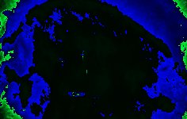

|  Method            | Parameters       | Quick Start Reader | Original Reader | Delta  |
| -------------------|------------------|--------------------|-----------------|------- |
| Initialization     |                  |15 ms|22 ms|        |
| Reader Size (Mb)     |                  |0.92|1.14|        |
# [Rat_100um_MOR1_x500_TSA.czi](https://zenodo.org/record/7818783/files/Rat_100um_MOR1_x500_TSA.czi) report
 - **Autostitch** = false
 - ZeissCZIReader v7.0.0
 - ZeissQuickStartCZIReader v0.2.2-SNAPSHOT

# Images 

| Series            | Quick Start Reader | Size | Original Reader | Size | #Diffs |
|-------------------|--------------------|------|-----------------|------|--------|
| Read time (all)   |89 ms|------|92 ms|------|--------|
|0||X:1920 Y:1216 C:1 Z:1 T:1||X:1920 Y:1216 C:1 Z:1 T:1|0|

# Metadata

