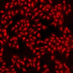
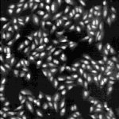
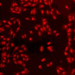
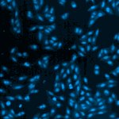
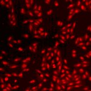
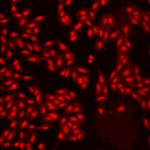

# [S=1_3x3_T=3_Z=4_CH=2.czi](https://zenodo.org/record/7015307/files/S%3D1_3x3_T%3D3_Z%3D4_CH%3D2.czi) report
 - **Autostitch** = false
 - ZeissCZIReader v6.14.0
 - ZeissQuickStartCZIReader v0.1.8-SNAPSHOT

# Images 

| Series            | Quick Start Reader | Size | Original Reader | Size | #Diffs |
|-------------------|--------------------|------|-----------------|------|--------|
| Read time (all)   |240 ms|------|224 ms|------|--------|
|0||X:640 Y:640 C:2 Z:4 T:3||X:640 Y:640 C:2 Z:4 T:3|0|
|1||X:640 Y:640 C:2 Z:4 T:3||X:640 Y:640 C:2 Z:4 T:3|0|
|2||X:640 Y:640 C:2 Z:4 T:3||X:640 Y:640 C:2 Z:4 T:3|0|
|3||X:640 Y:640 C:2 Z:4 T:3||X:640 Y:640 C:2 Z:4 T:3|0|
|4||X:640 Y:640 C:2 Z:4 T:3||X:640 Y:640 C:2 Z:4 T:3|0|
|5||X:640 Y:640 C:2 Z:4 T:3||X:640 Y:640 C:2 Z:4 T:3|0|
|6||X:640 Y:640 C:2 Z:4 T:3||X:640 Y:640 C:2 Z:4 T:3|0|
|7||X:640 Y:640 C:2 Z:4 T:3||X:640 Y:640 C:2 Z:4 T:3|0|
|8||X:640 Y:640 C:2 Z:4 T:3||X:640 Y:640 C:2 Z:4 T:3|0|

# Metadata

|  Method            | Parameters       | Quick Start Reader | Original Reader | Delta  |
| -------------------|------------------|--------------------|-----------------|------- |
| Initialization     |                  |32 ms|27 ms|        |
| Reader Size (Mb)     |                  |2.06|2.86|        |
| getStageLabelName| Image 0 | D6| Scene position #0| |
| getStageLabelName| Image 1 | D6| Scene position #1| |
| getStageLabelName| Image 2 | D6| Scene position #2| |
| getStageLabelName| Image 3 | D6| Scene position #3| |
| getStageLabelName| Image 4 | D6| Scene position #4| |
| getStageLabelName| Image 5 | D6| Scene position #5| |
| getStageLabelName| Image 6 | D6| Scene position #6| |
| getStageLabelName| Image 7 | D6| Scene position #7| |
| getStageLabelName| Image 8 | D6| Scene position #8| |
