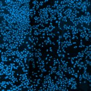
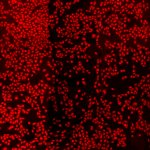
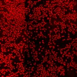
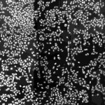

# [S=1_3x3_T=3_Z=4_CH=2.czi](https://zenodo.org/record/7015307/files/S%3D1_3x3_T%3D3_Z%3D4_CH%3D2.czi) report
 - **Autostitch** = true
 - ZeissCZIReader v6.14.0
 - ZeissQuickStartCZIReader v0.1.8-SNAPSHOT

# Images 

| Series            | Quick Start Reader | Size | Original Reader | Size | #Diffs |
|-------------------|--------------------|------|-----------------|------|--------|
| Read time (all)   |164 ms|------|196 ms|------|--------|
|0||X:1792 Y:1792 C:2 Z:4 T:3||X:1792 Y:1792 C:2 Z:4 T:3|0|
|1||X:896 Y:896 C:2 Z:4 T:3||X:896 Y:896 C:2 Z:4 T:3|0|

# Metadata

|  Method            | Parameters       | Quick Start Reader | Original Reader | Delta  |
| -------------------|------------------|--------------------|-----------------|------- |
| Initialization     |                  |23 ms|36 ms|        |
| Reader Size (Mb)     |                  |1.95|2.76|        |
| getStageLabelName| Image 0 | D6| Scene position #0| |
| getStageLabelX| Image 0 | 49442.400 um | 49500.000 um | 57.600 um |
| getStageLabelY| Image 0 | 35442.400 um | 35500.000 um | 57.600 um |
| getStageLabelName| Image 1 | D6| Scene position #1| |
| getStageLabelX| Image 1 | 0.000 um | 49500.000 um | 49500.000 um |
| getStageLabelY| Image 1 | 0.000 um | 35500.000 um | 35500.000 um |
| getStageLabelZ| Image 1 | | 1: ome.units.quantity.Length: value[0.0], unit[µm] stored as java.lang.Double| 2: null |
| getPixelsPhysicalSizeX| Image 1 | 0.200 um | 0.100 um | 0.100 um |
| getPixelsPhysicalSizeY| Image 1 | 0.200 um | 0.100 um | 0.100 um |
| getPlanePositionX| Image 0 Plane 0 | 49442.400 um | 49500.000 um | 57.600 um |
| getPlanePositionY| Image 0 Plane 0 | 35442.400 um | 35500.000 um | 57.600 um |
| getPlanePositionX| Image 0 Plane 1 | 49442.400 um | 49500.000 um | 57.600 um |
| getPlanePositionY| Image 0 Plane 1 | 35442.400 um | 35500.000 um | 57.600 um |
| getPlaneDeltaT| Image 0 Plane 2 |  2.486 s |  2.509 s | 0.023 s |
| getPlanePositionX| Image 0 Plane 2 | 49442.400 um | 49500.000 um | 57.600 um |
| getPlanePositionY| Image 0 Plane 2 | 35442.400 um | 35500.000 um | 57.600 um |
| getPlaneDeltaT| Image 0 Plane 3 |  2.557 s |  2.567 s | 0.010 s |
| getPlanePositionX| Image 0 Plane 3 | 49442.400 um | 49500.000 um | 57.600 um |
| getPlanePositionY| Image 0 Plane 3 | 35442.400 um | 35500.000 um | 57.600 um |
| getPlaneDeltaT| Image 0 Plane 4 |  2.792 s |  2.818 s | 0.026 s |
| getPlanePositionX| Image 0 Plane 4 | 49442.400 um | 49500.000 um | 57.600 um |
| getPlanePositionY| Image 0 Plane 4 | 35442.400 um | 35500.000 um | 57.600 um |
| getPlaneDeltaT| Image 0 Plane 5 |  2.849 s |  2.862 s | 0.013 s |
| getPlanePositionX| Image 0 Plane 5 | 49442.400 um | 49500.000 um | 57.600 um |
| getPlanePositionY| Image 0 Plane 5 | 35442.400 um | 35500.000 um | 57.600 um |
| getPlanePositionX| Image 0 Plane 6 | 49442.400 um | 49500.000 um | 57.600 um |
| getPlanePositionY| Image 0 Plane 6 | 35442.400 um | 35500.000 um | 57.600 um |
| getPlanePositionX| Image 0 Plane 7 | 49442.400 um | 49500.000 um | 57.600 um |
| getPlanePositionY| Image 0 Plane 7 | 35442.400 um | 35500.000 um | 57.600 um |
| getPlaneDeltaT| Image 0 Plane 8 |  28.969 s |  28.843 s | 0.126 s |
| getPlanePositionX| Image 0 Plane 8 | 49442.400 um | 49500.000 um | 57.600 um |
| getPlanePositionY| Image 0 Plane 8 | 35442.400 um | 35500.000 um | 57.600 um |
| getPlaneDeltaT| Image 0 Plane 9 |  29.034 s |  28.892 s | 0.142 s |
| getPlanePositionX| Image 0 Plane 9 | 49442.400 um | 49500.000 um | 57.600 um |
| getPlanePositionY| Image 0 Plane 9 | 35442.400 um | 35500.000 um | 57.600 um |
| getPlaneDeltaT| Image 0 Plane 10 |  29.275 s |  29.138 s | 0.137 s |
| getPlanePositionX| Image 0 Plane 10 | 49442.400 um | 49500.000 um | 57.600 um |
| getPlanePositionY| Image 0 Plane 10 | 35442.400 um | 35500.000 um | 57.600 um |
| getPlaneDeltaT| Image 0 Plane 11 |  29.327 s |  29.203 s | 0.124 s |
| getPlanePositionX| Image 0 Plane 11 | 49442.400 um | 49500.000 um | 57.600 um |
| getPlanePositionY| Image 0 Plane 11 | 35442.400 um | 35500.000 um | 57.600 um |
| getPlaneDeltaT| Image 0 Plane 12 |  29.581 s |  29.438 s | 0.143 s |
| getPlanePositionX| Image 0 Plane 12 | 49442.400 um | 49500.000 um | 57.600 um |
| getPlanePositionY| Image 0 Plane 12 | 35442.400 um | 35500.000 um | 57.600 um |
| getPlaneDeltaT| Image 0 Plane 13 |  29.619 s |  29.486 s | 0.133 s |
| getPlanePositionX| Image 0 Plane 13 | 49442.400 um | 49500.000 um | 57.600 um |
| getPlanePositionY| Image 0 Plane 13 | 35442.400 um | 35500.000 um | 57.600 um |
| getPlaneDeltaT| Image 0 Plane 14 |  29.887 s |  29.727 s | 0.160 s |
| getPlanePositionX| Image 0 Plane 14 | 49442.400 um | 49500.000 um | 57.600 um |
| getPlanePositionY| Image 0 Plane 14 | 35442.400 um | 35500.000 um | 57.600 um |
| getPlaneDeltaT| Image 0 Plane 15 |  29.912 s |  29.771 s | 0.141 s |
| getPlanePositionX| Image 0 Plane 15 | 49442.400 um | 49500.000 um | 57.600 um |
| getPlanePositionY| Image 0 Plane 15 | 35442.400 um | 35500.000 um | 57.600 um |
| getPlanePositionX| Image 0 Plane 16 | 49442.400 um | 49500.000 um | 57.600 um |
| getPlanePositionY| Image 0 Plane 16 | 35442.400 um | 35500.000 um | 57.600 um |
| getPlanePositionX| Image 0 Plane 17 | 49442.400 um | 49500.000 um | 57.600 um |
| getPlanePositionY| Image 0 Plane 17 | 35442.400 um | 35500.000 um | 57.600 um |
| getPlaneDeltaT| Image 0 Plane 18 |  56.064 s |  56.042 s | 0.022 s |
| getPlanePositionX| Image 0 Plane 18 | 49442.400 um | 49500.000 um | 57.600 um |
| getPlanePositionY| Image 0 Plane 18 | 35442.400 um | 35500.000 um | 57.600 um |
| getPlaneDeltaT| Image 0 Plane 19 |  56.097 s |  56.094 s | 0.003 s |
| getPlanePositionX| Image 0 Plane 19 | 49442.400 um | 49500.000 um | 57.600 um |
| getPlanePositionY| Image 0 Plane 19 | 35442.400 um | 35500.000 um | 57.600 um |
| getPlaneDeltaT| Image 0 Plane 20 |  56.370 s |  56.331 s | 0.039 s |
| getPlanePositionX| Image 0 Plane 20 | 49442.400 um | 49500.000 um | 57.600 um |
| getPlanePositionY| Image 0 Plane 20 | 35442.400 um | 35500.000 um | 57.600 um |
| getPlaneDeltaT| Image 0 Plane 21 |  56.389 s |  56.377 s | 0.012 s |
| getPlanePositionX| Image 0 Plane 21 | 49442.400 um | 49500.000 um | 57.600 um |
| getPlanePositionY| Image 0 Plane 21 | 35442.400 um | 35500.000 um | 57.600 um |
| getPlaneDeltaT| Image 0 Plane 22 |  56.676 s |  56.619 s | 0.057 s |
| getPlanePositionX| Image 0 Plane 22 | 49442.400 um | 49500.000 um | 57.600 um |
| getPlanePositionY| Image 0 Plane 22 | 35442.400 um | 35500.000 um | 57.600 um |
| getPlaneDeltaT| Image 0 Plane 23 |  56.682 s |  56.670 s | 0.012 s |
| getPlanePositionX| Image 0 Plane 23 | 49442.400 um | 49500.000 um | 57.600 um |
| getPlanePositionY| Image 0 Plane 23 | 35442.400 um | 35500.000 um | 57.600 um |
| getPlaneDeltaT| Image 1 Plane 0 | | 1: null| 2: ome.units.quantity.Time: value[2.1800246999999997], unit[s] stored as java.lang.Double |
| getPlaneExposureTime| Image 1 Plane 0 | | 1: null| 2: ome.units.quantity.Time: value[150.0], unit[s] stored as java.lang.Double |
| getPlanePositionX| Image 1 Plane 0 | | 1: null| 2: ome.units.quantity.Length: value[49500.0], unit[µm] stored as java.lang.Double |
| getPlanePositionY| Image 1 Plane 0 | | 1: null| 2: ome.units.quantity.Length: value[35500.0], unit[µm] stored as java.lang.Double |
| getPlaneDeltaT| Image 1 Plane 1 | | 1: null| 2: ome.units.quantity.Time: value[2.1800246999999997], unit[s] stored as java.lang.Double |
| getPlaneExposureTime| Image 1 Plane 1 | | 1: null| 2: ome.units.quantity.Time: value[150.0], unit[s] stored as java.lang.Double |
| getPlanePositionX| Image 1 Plane 1 | | 1: null| 2: ome.units.quantity.Length: value[49500.0], unit[µm] stored as java.lang.Double |
| getPlanePositionY| Image 1 Plane 1 | | 1: null| 2: ome.units.quantity.Length: value[35500.0], unit[µm] stored as java.lang.Double |
| getPlaneDeltaT| Image 1 Plane 2 | | 1: null| 2: ome.units.quantity.Time: value[2.1800246999999997], unit[s] stored as java.lang.Double |
| getPlaneExposureTime| Image 1 Plane 2 | | 1: null| 2: ome.units.quantity.Time: value[150.0], unit[s] stored as java.lang.Double |
| getPlanePositionX| Image 1 Plane 2 | | 1: null| 2: ome.units.quantity.Length: value[49500.0], unit[µm] stored as java.lang.Double |
| getPlanePositionY| Image 1 Plane 2 | | 1: null| 2: ome.units.quantity.Length: value[35500.0], unit[µm] stored as java.lang.Double |
| getPlaneDeltaT| Image 1 Plane 3 | | 1: null| 2: ome.units.quantity.Time: value[2.1800246999999997], unit[s] stored as java.lang.Double |
| getPlaneExposureTime| Image 1 Plane 3 | | 1: null| 2: ome.units.quantity.Time: value[150.0], unit[s] stored as java.lang.Double |
| getPlanePositionX| Image 1 Plane 3 | | 1: null| 2: ome.units.quantity.Length: value[49500.0], unit[µm] stored as java.lang.Double |
| getPlanePositionY| Image 1 Plane 3 | | 1: null| 2: ome.units.quantity.Length: value[35500.0], unit[µm] stored as java.lang.Double |
| getPlaneDeltaT| Image 1 Plane 4 | | 1: null| 2: ome.units.quantity.Time: value[2.1800246999999997], unit[s] stored as java.lang.Double |
| getPlaneExposureTime| Image 1 Plane 4 | | 1: null| 2: ome.units.quantity.Time: value[150.0], unit[s] stored as java.lang.Double |
| getPlanePositionX| Image 1 Plane 4 | | 1: null| 2: ome.units.quantity.Length: value[49500.0], unit[µm] stored as java.lang.Double |
| getPlanePositionY| Image 1 Plane 4 | | 1: null| 2: ome.units.quantity.Length: value[35500.0], unit[µm] stored as java.lang.Double |
| getPlaneDeltaT| Image 1 Plane 5 | | 1: null| 2: ome.units.quantity.Time: value[2.1800246999999997], unit[s] stored as java.lang.Double |
| getPlaneExposureTime| Image 1 Plane 5 | | 1: null| 2: ome.units.quantity.Time: value[150.0], unit[s] stored as java.lang.Double |
| getPlanePositionX| Image 1 Plane 5 | | 1: null| 2: ome.units.quantity.Length: value[49500.0], unit[µm] stored as java.lang.Double |
| getPlanePositionY| Image 1 Plane 5 | | 1: null| 2: ome.units.quantity.Length: value[35500.0], unit[µm] stored as java.lang.Double |
| getPlaneDeltaT| Image 1 Plane 6 | | 1: null| 2: ome.units.quantity.Time: value[2.1800246999999997], unit[s] stored as java.lang.Double |
| getPlaneExposureTime| Image 1 Plane 6 | | 1: null| 2: ome.units.quantity.Time: value[150.0], unit[s] stored as java.lang.Double |
| getPlanePositionX| Image 1 Plane 6 | | 1: null| 2: ome.units.quantity.Length: value[49500.0], unit[µm] stored as java.lang.Double |
| getPlanePositionY| Image 1 Plane 6 | | 1: null| 2: ome.units.quantity.Length: value[35500.0], unit[µm] stored as java.lang.Double |
| getPlaneDeltaT| Image 1 Plane 7 | | 1: null| 2: ome.units.quantity.Time: value[2.1800246999999997], unit[s] stored as java.lang.Double |
| getPlaneExposureTime| Image 1 Plane 7 | | 1: null| 2: ome.units.quantity.Time: value[150.0], unit[s] stored as java.lang.Double |
| getPlanePositionX| Image 1 Plane 7 | | 1: null| 2: ome.units.quantity.Length: value[49500.0], unit[µm] stored as java.lang.Double |
| getPlanePositionY| Image 1 Plane 7 | | 1: null| 2: ome.units.quantity.Length: value[35500.0], unit[µm] stored as java.lang.Double |
| getPlaneDeltaT| Image 1 Plane 8 | | 1: null| 2: ome.units.quantity.Time: value[28.8432583], unit[s] stored as java.lang.Double |
| getPlaneExposureTime| Image 1 Plane 8 | | 1: null| 2: ome.units.quantity.Time: value[150.0], unit[s] stored as java.lang.Double |
| getPlanePositionX| Image 1 Plane 8 | | 1: null| 2: ome.units.quantity.Length: value[49500.0], unit[µm] stored as java.lang.Double |
| getPlanePositionY| Image 1 Plane 8 | | 1: null| 2: ome.units.quantity.Length: value[35500.0], unit[µm] stored as java.lang.Double |
| getPlaneDeltaT| Image 1 Plane 9 | | 1: null| 2: ome.units.quantity.Time: value[28.8432583], unit[s] stored as java.lang.Double |
| getPlaneExposureTime| Image 1 Plane 9 | | 1: null| 2: ome.units.quantity.Time: value[150.0], unit[s] stored as java.lang.Double |
| getPlanePositionX| Image 1 Plane 9 | | 1: null| 2: ome.units.quantity.Length: value[49500.0], unit[µm] stored as java.lang.Double |
| getPlanePositionY| Image 1 Plane 9 | | 1: null| 2: ome.units.quantity.Length: value[35500.0], unit[µm] stored as java.lang.Double |
| getPlaneDeltaT| Image 1 Plane 10 | | 1: null| 2: ome.units.quantity.Time: value[28.8432583], unit[s] stored as java.lang.Double |
| getPlaneExposureTime| Image 1 Plane 10 | | 1: null| 2: ome.units.quantity.Time: value[150.0], unit[s] stored as java.lang.Double |
| getPlanePositionX| Image 1 Plane 10 | | 1: null| 2: ome.units.quantity.Length: value[49500.0], unit[µm] stored as java.lang.Double |
| getPlanePositionY| Image 1 Plane 10 | | 1: null| 2: ome.units.quantity.Length: value[35500.0], unit[µm] stored as java.lang.Double |
| getPlaneDeltaT| Image 1 Plane 11 | | 1: null| 2: ome.units.quantity.Time: value[28.8432583], unit[s] stored as java.lang.Double |
| getPlaneExposureTime| Image 1 Plane 11 | | 1: null| 2: ome.units.quantity.Time: value[150.0], unit[s] stored as java.lang.Double |
| getPlanePositionX| Image 1 Plane 11 | | 1: null| 2: ome.units.quantity.Length: value[49500.0], unit[µm] stored as java.lang.Double |
| getPlanePositionY| Image 1 Plane 11 | | 1: null| 2: ome.units.quantity.Length: value[35500.0], unit[µm] stored as java.lang.Double |
| getPlaneDeltaT| Image 1 Plane 12 | | 1: null| 2: ome.units.quantity.Time: value[28.8432583], unit[s] stored as java.lang.Double |
| getPlaneExposureTime| Image 1 Plane 12 | | 1: null| 2: ome.units.quantity.Time: value[150.0], unit[s] stored as java.lang.Double |
| getPlanePositionX| Image 1 Plane 12 | | 1: null| 2: ome.units.quantity.Length: value[49500.0], unit[µm] stored as java.lang.Double |
| getPlanePositionY| Image 1 Plane 12 | | 1: null| 2: ome.units.quantity.Length: value[35500.0], unit[µm] stored as java.lang.Double |
| getPlaneDeltaT| Image 1 Plane 13 | | 1: null| 2: ome.units.quantity.Time: value[28.8432583], unit[s] stored as java.lang.Double |
| getPlaneExposureTime| Image 1 Plane 13 | | 1: null| 2: ome.units.quantity.Time: value[150.0], unit[s] stored as java.lang.Double |
| getPlanePositionX| Image 1 Plane 13 | | 1: null| 2: ome.units.quantity.Length: value[49500.0], unit[µm] stored as java.lang.Double |
| getPlanePositionY| Image 1 Plane 13 | | 1: null| 2: ome.units.quantity.Length: value[35500.0], unit[µm] stored as java.lang.Double |
| getPlaneDeltaT| Image 1 Plane 14 | | 1: null| 2: ome.units.quantity.Time: value[28.8432583], unit[s] stored as java.lang.Double |
| getPlaneExposureTime| Image 1 Plane 14 | | 1: null| 2: ome.units.quantity.Time: value[150.0], unit[s] stored as java.lang.Double |
| getPlanePositionX| Image 1 Plane 14 | | 1: null| 2: ome.units.quantity.Length: value[49500.0], unit[µm] stored as java.lang.Double |
| getPlanePositionY| Image 1 Plane 14 | | 1: null| 2: ome.units.quantity.Length: value[35500.0], unit[µm] stored as java.lang.Double |
| getPlaneDeltaT| Image 1 Plane 15 | | 1: null| 2: ome.units.quantity.Time: value[28.8432583], unit[s] stored as java.lang.Double |
| getPlaneExposureTime| Image 1 Plane 15 | | 1: null| 2: ome.units.quantity.Time: value[150.0], unit[s] stored as java.lang.Double |
| getPlanePositionX| Image 1 Plane 15 | | 1: null| 2: ome.units.quantity.Length: value[49500.0], unit[µm] stored as java.lang.Double |
| getPlanePositionY| Image 1 Plane 15 | | 1: null| 2: ome.units.quantity.Length: value[35500.0], unit[µm] stored as java.lang.Double |
| getPlaneDeltaT| Image 1 Plane 16 | | 1: null| 2: ome.units.quantity.Time: value[55.7584963], unit[s] stored as java.lang.Double |
| getPlaneExposureTime| Image 1 Plane 16 | | 1: null| 2: ome.units.quantity.Time: value[150.0], unit[s] stored as java.lang.Double |
| getPlanePositionX| Image 1 Plane 16 | | 1: null| 2: ome.units.quantity.Length: value[49500.0], unit[µm] stored as java.lang.Double |
| getPlanePositionY| Image 1 Plane 16 | | 1: null| 2: ome.units.quantity.Length: value[35500.0], unit[µm] stored as java.lang.Double |
| getPlaneDeltaT| Image 1 Plane 17 | | 1: null| 2: ome.units.quantity.Time: value[55.7584963], unit[s] stored as java.lang.Double |
| getPlaneExposureTime| Image 1 Plane 17 | | 1: null| 2: ome.units.quantity.Time: value[150.0], unit[s] stored as java.lang.Double |
| getPlanePositionX| Image 1 Plane 17 | | 1: null| 2: ome.units.quantity.Length: value[49500.0], unit[µm] stored as java.lang.Double |
| getPlanePositionY| Image 1 Plane 17 | | 1: null| 2: ome.units.quantity.Length: value[35500.0], unit[µm] stored as java.lang.Double |
| getPlaneDeltaT| Image 1 Plane 18 | | 1: null| 2: ome.units.quantity.Time: value[55.7584963], unit[s] stored as java.lang.Double |
| getPlaneExposureTime| Image 1 Plane 18 | | 1: null| 2: ome.units.quantity.Time: value[150.0], unit[s] stored as java.lang.Double |
| getPlanePositionX| Image 1 Plane 18 | | 1: null| 2: ome.units.quantity.Length: value[49500.0], unit[µm] stored as java.lang.Double |
| getPlanePositionY| Image 1 Plane 18 | | 1: null| 2: ome.units.quantity.Length: value[35500.0], unit[µm] stored as java.lang.Double |
| getPlaneDeltaT| Image 1 Plane 19 | | 1: null| 2: ome.units.quantity.Time: value[55.7584963], unit[s] stored as java.lang.Double |
| getPlaneExposureTime| Image 1 Plane 19 | | 1: null| 2: ome.units.quantity.Time: value[150.0], unit[s] stored as java.lang.Double |
| getPlanePositionX| Image 1 Plane 19 | | 1: null| 2: ome.units.quantity.Length: value[49500.0], unit[µm] stored as java.lang.Double |
| getPlanePositionY| Image 1 Plane 19 | | 1: null| 2: ome.units.quantity.Length: value[35500.0], unit[µm] stored as java.lang.Double |
| getPlaneDeltaT| Image 1 Plane 20 | | 1: null| 2: ome.units.quantity.Time: value[55.7584963], unit[s] stored as java.lang.Double |
| getPlaneExposureTime| Image 1 Plane 20 | | 1: null| 2: ome.units.quantity.Time: value[150.0], unit[s] stored as java.lang.Double |
| getPlanePositionX| Image 1 Plane 20 | | 1: null| 2: ome.units.quantity.Length: value[49500.0], unit[µm] stored as java.lang.Double |
| getPlanePositionY| Image 1 Plane 20 | | 1: null| 2: ome.units.quantity.Length: value[35500.0], unit[µm] stored as java.lang.Double |
| getPlaneDeltaT| Image 1 Plane 21 | | 1: null| 2: ome.units.quantity.Time: value[55.7584963], unit[s] stored as java.lang.Double |
| getPlaneExposureTime| Image 1 Plane 21 | | 1: null| 2: ome.units.quantity.Time: value[150.0], unit[s] stored as java.lang.Double |
| getPlanePositionX| Image 1 Plane 21 | | 1: null| 2: ome.units.quantity.Length: value[49500.0], unit[µm] stored as java.lang.Double |
| getPlanePositionY| Image 1 Plane 21 | | 1: null| 2: ome.units.quantity.Length: value[35500.0], unit[µm] stored as java.lang.Double |
| getPlaneDeltaT| Image 1 Plane 22 | | 1: null| 2: ome.units.quantity.Time: value[55.7584963], unit[s] stored as java.lang.Double |
| getPlaneExposureTime| Image 1 Plane 22 | | 1: null| 2: ome.units.quantity.Time: value[150.0], unit[s] stored as java.lang.Double |
| getPlanePositionX| Image 1 Plane 22 | | 1: null| 2: ome.units.quantity.Length: value[49500.0], unit[µm] stored as java.lang.Double |
| getPlanePositionY| Image 1 Plane 22 | | 1: null| 2: ome.units.quantity.Length: value[35500.0], unit[µm] stored as java.lang.Double |
| getPlaneDeltaT| Image 1 Plane 23 | | 1: null| 2: ome.units.quantity.Time: value[55.7584963], unit[s] stored as java.lang.Double |
| getPlaneExposureTime| Image 1 Plane 23 | | 1: null| 2: ome.units.quantity.Time: value[150.0], unit[s] stored as java.lang.Double |
| getPlanePositionX| Image 1 Plane 23 | | 1: null| 2: ome.units.quantity.Length: value[49500.0], unit[µm] stored as java.lang.Double |
| getPlanePositionY| Image 1 Plane 23 | | 1: null| 2: ome.units.quantity.Length: value[35500.0], unit[µm] stored as java.lang.Double |
